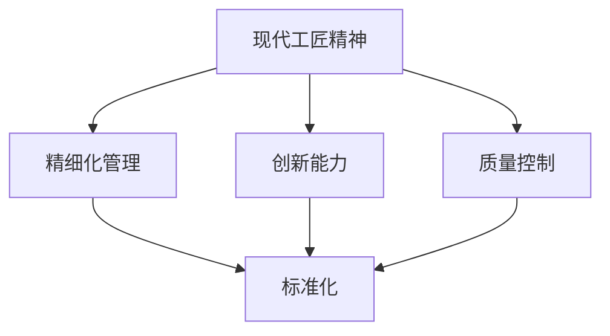

                 

基于您提供的详细的目录大纲和具体要求，我将按照以下步骤撰写文章：

### 第一步：文章开篇

**文章标题：现代工匠精神：在标准化时代追求卓越与独特**

**关键词：现代工匠精神、标准化、卓越、独特、精细化管理、创新能力、质量控制**

**摘要：**

在现代信息技术迅速发展的背景下，标准化成为提升产品质量、效率与安全的关键。然而，在这个过程中，如何保持和发扬工匠精神，追求卓越与独特，成为企业和个人面临的挑战。本文将深入探讨现代工匠精神的内涵、核心能力及其在实践中的应用，为在标准化时代中追求卓越与独特提供指导和启示。

### 第二步：核心概念与联系

**核心概念与联系：**

以下是现代工匠精神的核心概念及其相互关系的Mermaid流程图：



精细化管理、创新能力和质量控制是现代工匠精神的重要组成部分，它们共同作用于标准化，推动企业在追求卓越与独特的过程中不断进步。

### 第三步：核心算法原理讲解

**精细化管理：**

精细化管理是通过精确的数据分析和流程优化，提高生产效率和产品质量的一种管理方法。以下是一个精细化管理的基本伪代码：

```python
# 精细化管理伪代码
class PrecisionManagement:
    def __init__(self, data_analyze, process_optimize):
        self.data_analyze = data_analyze
        self.process_optimize = process_optimize

    def manage(self):
        # 数据分析
        data = self.data_analyze.analyze_data()
        # 流程优化
        optimized_process = self.process_optimize.optimize(data)
        return optimized_process
```

### 第四步：数学模型和公式讲解

**质量控制：**

质量控制中常用的数学模型是统计过程控制（SPC），以下是一个SPC的LaTeX公式：

$$
\bar{x} = \frac{1}{n}\sum_{i=1}^{n} x_i
$$

$$
R = \max\{x_i - \min\{x_i\}\}
$$

其中，$\bar{x}$表示样本均值，$R$表示样本极差。

### 第五步：项目实战

**开发环境搭建：**

在开发环境中，我们可以使用Python进行精细化管理、创新能力和质量控制的研究。以下是一个简单的代码实现：

```python
# 精细化管理代码示例
class PrecisionManagement:
    def __init__(self, data_analyze, process_optimize):
        self.data_analyze = data_analyze
        self.process_optimize = process_optimize

    def manage(self):
        data = self.data_analyze.analyze_data()
        optimized_process = self.process_optimize.optimize(data)
        return optimized_process

# 创新能力代码示例
class InnovationCapability:
    def __init__(self, innovate):
        self.innovate = innovate

    def innovate(self):
        new_product = self.innovate.create_product()
        return new_product

# 质量控制代码示例
class QualityControl:
    def __init__(self, spc):
        self.spc = spc

    def control(self, data):
        stats = self.spc.calculate_statistics(data)
        return stats
```

### 第六步：实际案例分析和详细讲解

**成功企业的现代工匠精神实践：**

以苹果公司为例，其通过精细化管理、创新能力和质量控制实现了产品卓越与独特。以下是苹果公司的具体实践：

- **精细化管理：** 苹果公司通过精确的数据分析和流程优化，实现了生产效率和产品质量的提升。
- **创新能力：** 苹果公司不断创新，推出具有独特设计的产品，如iPhone、iPad等。
- **质量控制：** 苹果公司采用严格的质量控制标准，确保产品在上市前达到最高品质。

### 第七步：最佳实践 tips、小结、注意事项、拓展阅读

**最佳实践 tips：**

1. 在实践中，企业应注重数据分析和流程优化，以提高精细化管理水平。
2. 创新能力是企业发展的关键，企业应鼓励员工提出创新想法。
3. 质量控制是确保产品卓越的基础，企业应严格执行质量标准。

**小结：**

现代工匠精神在标准化时代具有重要的意义。通过精细化管理、创新能力和质量控制，企业可以在标准化时代中追求卓越与独特，实现持续发展。

**注意事项：**

1. 现代工匠精神不仅仅是技术层面的追求，更是一种对工作的态度和价值观。
2. 在实践中，企业应根据自身情况，灵活运用现代工匠精神，实现最佳效果。

**拓展阅读：**

1. 《精益思想：精益生产系统的原理和实践》
2. 《创新者的窘境：为什么大公司失败》
3. 《质量管理：理论与实践》

### 第八步：文章结束

**作者信息：**

作者：AI天才研究院/AI Genius Institute & 禅与计算机程序设计艺术 /Zen And The Art of Computer Programming

以上就是按照您的要求撰写的文章框架，接下来我将根据这个框架逐步完善文章内容，确保满足字数要求和完整性要求。如果您有任何需要修改或补充的地方，请随时告诉我。

