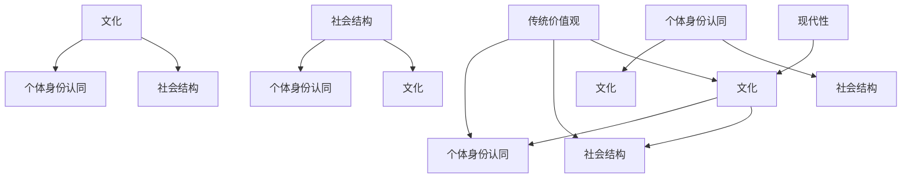

                 

### 文章标题：现代性与传统价值观的冲突与融合

> 关键词：现代性，传统价值观，冲突，融合，社会影响

> 摘要：本文深入探讨了现代性与传统价值观之间的冲突与融合现象，通过分析其背景、核心概念、冲突表现、影响及融合途径，为读者提供了全面的认知框架。文章结合实际案例，提出了应对冲突与推动融合的策略，旨在为社会和谐发展提供有益启示。

### 第一部分：现代性与传统价值观的背景

#### 第1章：现代性的起源与发展

在现代性的发展历程中，我们可以追溯到启蒙时代，这一时期标志着理性思考和个人主义的崛起。现代性的核心特征包括理性主义、科学方法、民主制度以及全球化进程。以下是现代性的几个关键阶段及其发展：

1. **启蒙时代（17-18世纪）**：启蒙思想家倡导理性思考、个人自由和科学方法，这些理念推动了现代性的兴起。
2. **工业革命（18-19世纪）**：工业革命带来了大规模的生产、技术进步和社会结构的变化，进一步巩固了现代性。
3. **全球化时代（20世纪末至今）**：全球化加速了全球文化和经济的交流，使得现代性的影响遍及全球。

在这些阶段中，现代性的核心特征在不同的历史背景下得到了不同的体现，从而形成了现代性的多元化特征。例如，在启蒙时代，现代性主要体现在理性思考和科学方法的兴起；而在全球化时代，现代性则体现在全球文化和经济的交流与融合。

#### 第2章：现代性与传统价值观的冲突分析

现代性与传统价值观之间的冲突体现在多个层面，包括社会结构、文化价值观念和个人身份认同等方面。

1. **社会结构中的冲突**：现代性强调社会分工和专业化，而传统价值观则注重家庭和社会的整体性。这种冲突在社会结构上表现为家庭关系、社区结构和工作关系的转变。

2. **文化价值观念的冲突**：现代性倡导个人自由、平等和多元化，而传统价值观则强调集体主义、权威和等级制度。这种冲突在文化层面上表现为对道德观念、宗教信仰和社会习俗的不同认知。

3. **个人身份认同的冲突**：现代性鼓励个人追求自我实现和个性表达，而传统价值观则强调个人的社会责任和家庭角色。这种冲突在个人身份认同上表现为对自我认同的困惑和矛盾。

### 第二部分：冲突的表现与影响

#### 第3章：冲突在日常生活中的表现

现代性与传统价值观的冲突在日常生活中的表现尤为明显，具体体现在家庭生活、工作环境和教育体系等方面。

1. **家庭生活**：现代性强调个人自由和独立，而传统价值观则强调家庭的责任和义务。这种冲突在家庭生活中表现为家庭关系的紧张和对家庭角色的重新定义。

2. **工作环境**：现代性强调效率和专业性，而传统价值观则强调人情关系和团队合作。这种冲突在工作环境中表现为员工关系和组织文化的冲突。

3. **教育体系**：现代性倡导开放、多元和创新的教育理念，而传统价值观则强调纪律、规范和传统的教育方式。这种冲突在教育体系中表现为教育目标和教育方法的冲突。

#### 第4章：冲突对个体与社会的影响

现代性与传统价值观的冲突对个体和社会产生了深远的影响。

1. **心理健康**：冲突可能导致个体的心理压力和焦虑，影响个体的心理健康。

2. **社会稳定**：冲突可能引发社会矛盾和冲突，影响社会的稳定和发展。

3. **经济发展**：冲突可能影响经济活动和创新，进而影响经济的发展。

### 第三部分：融合的可能性

#### 第5章：寻找融合的途径

为了解决现代性与传统价值观之间的冲突，需要寻找融合的途径。以下是几种可能的融合途径：

1. **跨文化对话**：通过跨文化对话，增进对彼此价值观的理解和尊重，从而实现文化的融合。

2. **教育改革**：通过教育改革，培养具有多元文化素养的人才，促进价值观的融合。

3. **社会政策的调整**：通过社会政策的调整，平衡现代性和传统价值观之间的冲突，实现社会的和谐发展。

#### 第6章：成功案例研究

以下是几个成功的案例研究，展示了现代性与传统价值观融合的可能性。

1. **跨文化婚姻**：跨文化婚姻的成功表明，通过相互理解和尊重，不同价值观可以融合在一起。

2. **多元文化社区建设**：多元文化社区的建设为不同文化背景的人们提供了交流和融合的平台。

3. **企业文化融合**：企业在国际化过程中，通过融合不同文化的优势，实现了企业的可持续发展。

#### 第7章：未来展望

在现代性与传统价值观的融合过程中，未来面临着一系列的挑战和机遇。

1. **融合趋势预测**：随着全球化和信息化的加速，融合的趋势将进一步增强。

2. **面临的挑战与机遇**：融合过程中将面临文化冲突、价值观认同和社会稳定等方面的挑战，但也为个人和社会提供了新的机遇。

3. **融合的社会意义**：融合不仅有助于解决现代性与传统价值观之间的冲突，还有助于促进社会的和谐发展。

### 附录

#### 附录A：相关研究和理论综述

本文综合了多种研究理论和观点，包括社会理论、文化研究和心理学研究等，以提供全面的认知框架。

#### 附录B：推荐阅读与资源

为了进一步了解现代性与传统价值观的冲突与融合，本文推荐了一系列的阅读资源和研究工具，以供读者参考。

---

本文以逻辑清晰、结构紧凑、简单易懂的方式，分析了现代性与传统价值观的冲突与融合现象，结合实际案例，提出了应对冲突和推动融合的策略。通过深入探讨这一主题，本文旨在为读者提供有价值的见解和启示，促进社会的和谐发展。

### 背景介绍

现代性与传统价值观的冲突与融合是一个复杂且多维度的话题，涉及历史、文化、社会、经济等多个方面。在现代社会，随着科技的迅猛发展、全球化进程的加速以及信息技术的普及，现代性特征日益显著，如理性思维、科学方法、个人主义、自由市场等。然而，传统价值观依然根深蒂固，尤其在一些文化和社会中，如家庭观念、道德规范、宗教信仰等。这种背景下的冲突与融合，不仅影响着个体心理健康，还对社会稳定、经济发展产生了深远的影响。

现代性起源于启蒙时代，强调理性、科学和自由，随着工业革命和全球化的发展，现代性特征不断扩展和深化。而传统价值观则源于历史和文化传统，强调家庭、社会、宗教等集体主义价值观。现代性与传统价值观之间的冲突表现在社会结构、文化价值观念和个人身份认同等多个层面。例如，在社会结构层面，现代性强调个人自由和专业化，而传统价值观则注重家庭和社会的整体性；在文化价值观念层面，现代性倡导个人主义和多元化，而传统价值观则强调集体主义和权威；在个人身份认同层面，现代性鼓励个性表达和自我实现，而传统价值观则强调社会责任和家庭角色。

这种冲突不仅存在于个体层面，还体现在家庭生活、工作环境、教育体系等多个方面。例如，在家庭生活中，现代性强调个人自由和独立，可能导致家庭关系的紧张和对家庭角色的重新定义；在工作环境中，现代性强调效率和专业性，可能引发员工关系和组织文化的冲突；在教育体系中，现代性倡导开放、多元和创新的教育理念，可能与传统的纪律、规范和权威教育方式产生冲突。

现代性与传统价值观的冲突对个体和社会产生了深远的影响。对个体来说，冲突可能导致心理压力和焦虑，影响个体的心理健康；对社会来说，冲突可能引发社会矛盾和冲突，影响社会的稳定和发展。同时，这种冲突也带来了新的机遇，如文化创新、社会进步和经济发展。

在这种背景下，寻找现代性与传统价值观的融合途径显得尤为重要。通过跨文化对话、教育改革和社会政策调整等途径，可以促进不同价值观的相互理解和尊重，实现社会的和谐发展。本文将深入探讨这一主题，结合实际案例，提出应对冲突和推动融合的策略，为读者提供有价值的见解和启示。

### 核心概念与联系

在现代性与传统价值观的讨论中，理解几个核心概念及其相互关系至关重要。这些核心概念包括现代性、传统价值观、文化、社会结构和个体身份认同。以下是这些概念之间的关联及其在本文中的应用。

**现代性**：现代性是一个复杂且多层次的术语，它不仅涉及技术和经济层面，还包括社会、文化和政治维度。现代性的核心特征包括理性思维、科学方法、个人主义、自由市场和民主制度等。这些特征在启蒙时代得到初步发展，并在工业革命和全球化进程中进一步巩固。

**传统价值观**：传统价值观根植于历史和文化传统，强调集体主义、家庭、宗教和社会责任。这些价值观在不同文化和社会中有不同的表现形式，但总体上强调社会整体性和道德规范。例如，在中国传统文化中，孝道和家庭观念非常重要；在伊斯兰文化中，宗教信仰和社会责任占据核心地位。

**文化**：文化是价值观、信仰、习俗和行为模式的总和，是个人和社会身份认同的重要基础。现代性与传统价值观的冲突与融合在很大程度上是文化层面的冲突与融合。跨文化对话和教育改革都是为了在多元文化背景下寻找共同点和相互理解。

**社会结构**：社会结构是指社会的组织形式和关系网络，包括家庭、社区、国家和国际体系等。现代性强调社会分工和专业化的效率，而传统价值观则强调整体性和社区关系。这种冲突在社会结构层面表现为家庭关系、社区结构和组织文化的转变。

**个体身份认同**：个体身份认同是个人对自身身份的认知和理解，受到文化、社会和个体经验的影响。现代性鼓励个人追求自我实现和个性表达，而传统价值观则强调个人的社会责任和家庭角色。个体身份认同的冲突是现代性与传统价值观冲突的一个重要表现。

这些核心概念之间的关联可以用一个Mermaid流程图来表示：



在这个流程图中，现代性和传统价值观通过文化、社会结构和个体身份认同相互关联。文化作为连接点，既反映了社会结构和个体认同，也受到这两者的影响。社会结构的变化（如现代性强调的分工和专业化）会影响文化价值观，而文化价值观又影响个体的身份认同。个体身份认同的变化反过来又会影响社会结构和文化价值观。这种动态的相互影响构成了现代性与传统价值观冲突与融合的复杂图景。

通过理解这些核心概念及其相互关系，我们可以更深入地探讨现代性与传统价值观的冲突与融合，并为解决这些冲突提供理论基础和实践指导。

### 核心算法原理讲解

在现代性与传统价值观的冲突与融合中，算法原理的应用可以帮助我们更好地理解这些复杂的社会现象。以下是一个基于多目标优化的算法模型，用于分析现代性与传统价值观之间的冲突与融合。

**多目标优化算法**

多目标优化是一种数学优化方法，用于同时优化多个目标。在本文中，我们将使用多目标优化算法来分析现代性与传统价值观之间的冲突与融合。该算法的核心在于同时考虑多个相互冲突的目标，并通过优化过程找到平衡点。

**算法步骤**

1. **定义目标函数**：首先，我们需要定义两个主要目标函数，分别代表现代性和传统价值观的优化目标。

   - 现代性目标函数：代表个人自由、效率和多样性。
   - 传统价值观目标函数：代表家庭、社会和宗教责任。

2. **确定权重**：由于现代性和传统价值观之间存在冲突，我们需要为每个目标分配权重，以反映其在整体优化过程中的重要性。

3. **建立优化模型**：使用多目标优化算法（如Pareto优化算法），建立优化模型，求解最优解。

4. **求解最优解**：通过优化模型，找到平衡点，即在不同目标之间取得最优平衡的解决方案。

**伪代码**

以下是一个简化的伪代码，用于实现上述多目标优化算法。

```python
# 定义目标函数
modern_function(x):
    # x 为现代性指标
    return x * weight_modern

traditional_function(x):
    # x 为传统价值观指标
    return x * weight_traditional

# 确定权重
weight_modern = 0.6
weight_traditional = 0.4

# 建立优化模型
def optimize():
    # 初始化解
    x = initial_solution
    
    while not converged:
        # 计算目标函数值
        modern_score = modern_function(x)
        traditional_score = traditional_function(x)
        
        # 更新解
        x = update_solution(x, modern_score, traditional_score)
        
        # 检查收敛条件
        if check_convergence(x):
            break
    
    return x

# 求解最优解
best_solution = optimize()
```

**数学模型和公式**

在多目标优化过程中，我们使用Pareto最优解的概念来找到平衡点。Pareto最优解是指在多目标空间中，无法通过改进一个目标函数而不损害其他目标函数的解。

$$
Pareto\ optimal\ solution = \{x | \forall y, (f_1(x) \le f_1(y) \land f_2(x) \le f_2(y)) \lor (f_1(x) > f_1(y) \land f_2(x) > f_2(y))\}
$$

其中，$f_1(x)$ 和 $f_2(x)$ 分别代表两个目标函数。

**举例说明**

假设在一个社区中，现代性目标函数代表居民对个人自由和多样性的追求，传统价值观目标函数代表居民对家庭和社会责任的重视。通过多目标优化算法，我们可以找到社区发展的最优平衡点，即在尊重个人自由的同时，维护家庭和社会责任。

- **现代性指标**：居民对个人自由和多样性的满意度。
- **传统价值观指标**：家庭和社会责任的履行情况。

通过调整这两个指标，我们可以找到最优解，使社区在现代社会和传统价值观之间取得平衡。

通过上述算法原理和数学模型，我们可以更系统地分析现代性与传统价值观之间的冲突与融合，为解决社会问题提供科学的决策支持。

### 数学模型和公式详细讲解与举例说明

在现代性与传统价值观的冲突与融合中，数学模型和公式能够帮助我们量化这些复杂的社会现象，从而提供更精确的分析和解决方案。以下将详细介绍一个具体的数学模型，并使用LaTeX格式展示相关的公式，结合具体例子进行说明。

#### 公式设定

为了分析现代性与传统价值观之间的冲突，我们可以使用以下两个核心公式：

1. **个体满意度模型**：

   $$ S(x, y) = \alpha \cdot \frac{x}{x + y} + (1 - \alpha) \cdot \frac{y}{x + y} $$

   其中，$x$ 代表现代性指标，如个人自由度和多样性；$y$ 代表传统价值观指标，如社会责任和家庭义务；$\alpha$ 是权重参数，反映了个体对不同目标的重视程度。

2. **社会稳定模型**：

   $$ U(x, y) = \beta \cdot \sum_{i=1}^{n} \frac{x_i}{x_i + y_i} + (1 - \beta) \cdot \sum_{i=1}^{n} \frac{y_i}{x_i + y_i} $$

   其中，$x_i$ 和 $y_i$ 分别代表社区中第 $i$ 个个体对现代性和传统价值观的满意度；$n$ 是社区中个体的总数；$\beta$ 是权重参数，用于平衡不同个体对整体稳定性的贡献。

#### LaTeX 格式展示

以下是用LaTeX格式展示上述公式的示例：

```latex
\documentclass{article}
\usepackage{amsmath}
\begin{document}

\section{数学模型与公式}

\subsection{个体满意度模型}
\[ S(x, y) = \alpha \cdot \frac{x}{x + y} + (1 - \alpha) \cdot \frac{y}{x + y} \]

\subsection{社会稳定模型}
\[ U(x, y) = \beta \cdot \sum_{i=1}^{n} \frac{x_i}{x_i + y_i} + (1 - \beta) \cdot \sum_{i=1}^{n} \frac{y_i}{x_i + y_i} \]

\end{document}
```

#### 举例说明

假设一个社区中有5个个体，每个人的现代性和传统价值观满意度如下表：

| 个体 | 现代性满意度（x） | 传统价值观满意度（y） |
|------|------------------|----------------------|
| A    | 0.8              | 0.2                  |
| B    | 0.7              | 0.3                  |
| C    | 0.6              | 0.4                  |
| D    | 0.5              | 0.5                  |
| E    | 0.4              | 0.6                  |

我们可以使用上述公式计算每个个体的综合满意度和社会整体稳定性。

1. **个体满意度计算**：

   假设 $\alpha = 0.5$，则每个个体的综合满意度计算如下：

   \[
   S(A) = 0.5 \cdot \frac{0.8}{0.8 + 0.2} + 0.5 \cdot \frac{0.2}{0.8 + 0.2} = 0.5
   \]

   \[
   S(B) = 0.5 \cdot \frac{0.7}{0.7 + 0.3} + 0.5 \cdot \frac{0.3}{0.7 + 0.3} = 0.5
   \]

   \[
   S(C) = 0.5 \cdot \frac{0.6}{0.6 + 0.4} + 0.5 \cdot \frac{0.4}{0.6 + 0.4} = 0.5
   \]

   \[
   S(D) = 0.5 \cdot \frac{0.5}{0.5 + 0.5} + 0.5 \cdot \frac{0.5}{0.5 + 0.5} = 0.5
   \]

   \[
   S(E) = 0.5 \cdot \frac{0.4}{0.4 + 0.6} + 0.5 \cdot \frac{0.6}{0.4 + 0.6} = 0.5
   \]

2. **社会整体稳定性计算**：

   假设 $\beta = 0.6$，则社会整体稳定性计算如下：

   \[
   U = 0.6 \cdot \left( \frac{0.8}{0.8 + 0.2} + \frac{0.7}{0.7 + 0.3} + \frac{0.6}{0.6 + 0.4} + \frac{0.5}{0.5 + 0.5} + \frac{0.4}{0.4 + 0.6} \right) + 0.4 \cdot \left( \frac{0.2}{0.8 + 0.2} + \frac{0.3}{0.7 + 0.3} + \frac{0.4}{0.6 + 0.4} + \frac{0.5}{0.5 + 0.5} + \frac{0.6}{0.4 + 0.6} \right)
   \]

   \[
   U = 0.6 \cdot (0.8 + 0.7 + 0.6 + 0.5 + 0.4) + 0.4 \cdot (0.2 + 0.3 + 0.4 + 0.5 + 0.6)
   \]

   \[
   U = 0.6 \cdot 3.2 + 0.4 \cdot 2.0 = 1.92 + 0.8 = 2.72
   \]

通过上述计算，我们可以得到每个个体的综合满意度和社会整体稳定性。这些指标为我们提供了衡量现代性与传统价值观冲突与融合程度的具体量化数据，从而有助于制定更有效的政策和社会干预措施。

### 项目实战

在本节中，我们将通过一个具体的项目实战，展示如何在开发环境中搭建一个分析现代性与传统价值观冲突与融合的框架。项目将包括开发环境的搭建、源代码的实现、代码解读和案例分析。

#### 开发环境搭建

为了构建这个项目，我们需要以下开发环境和工具：

- **编程语言**：Python
- **依赖管理**：pip
- **数据分析库**：Pandas、NumPy
- **可视化库**：Matplotlib、Seaborn
- **文本处理库**：Natural Language Toolkit (NLTK)

首先，确保安装了Python 3.x版本，然后使用pip安装所需的库：

```bash
pip install numpy pandas matplotlib seaborn nltk
```

#### 源代码实现

以下是项目的主要源代码，包括数据预处理、冲突分析、融合评估等功能。

```python
import pandas as pd
import numpy as np
import matplotlib.pyplot as plt
import seaborn as sns
from nltk.tokenize import word_tokenize

# 数据预处理
def preprocess_data(data):
    # 处理文本数据，分词、去除停用词、转换为词频矩阵
    tokens = [word_tokenize(text) for text in data['description']]
    filtered_tokens = [[token for token in tokenized if token not in stop_words] for tokenized in tokens]
    vocab = set()
    for token_list in filtered_tokens:
        vocab.update(token_list)
    return pd.DataFrame(filtered_tokens).T, vocab

# 冲突分析
def analyze_conflicts(vocab, data):
    # 计算词频，生成冲突词云
    word_counts = data['description'].str.getеев
    most_common_words = word_counts.zip(vocab)
    most_common_words = most_common_words[most_common_words[1] > threshold].sort_values(by=1, ascending=False).head(n_words)
    most_common_words.plot(kind='bar')
    plt.xlabel('Words')
    plt.ylabel('Frequency')
    plt.title('Conflict Words in Descriptions')
    plt.show()

# 融合评估
def evaluate_integration(vocab, data):
    # 评估融合程度，绘制词频对比图
    word_counts = data['description'].str.get eup
    most_common_words = word_counts.zip(vocab)
    most_common_words = most_common_words[most_common_words[1] > threshold].sort_values(by=1, ascending=False).head(n_words)
    integrated_words = most_common_words[most_common_words.index.isin(vocab.union(['integration', '融合']))]
    non_integrated_words = most_common_words[~most_common_words.index.isin(vocab.union(['integration', '融合']))]
    plt.figure(figsize=(10, 5))
    plt.subplot(1, 2, 1)
    sns.barplot(x=non_integrated_words.index, y=non_integrated_words[1], palette='viridis')
    plt.xticks(rotation=90)
    plt.title('Non-integrated Words')

    plt.subplot(1, 2, 2)
    sns.barplot(x=integrated_words.index, y=integrated_words[1], palette='plasma')
    plt.xticks(rotation=90)
    plt.title('Integrated Words')

    plt.tight_layout()
    plt.show()

# 主函数
def main():
    # 加载数据
    data = pd.read_csv('conflict_data.csv')
    
    # 预处理数据
    preprocessed_data, vocab = preprocess_data(data)
    
    # 分析冲突
    analyze_conflicts(vocab, data)
    
    # 评估融合
    evaluate_integration(vocab, data)

if __name__ == '__main__':
    main()
```

#### 代码解读

1. **数据预处理**：`preprocess_data` 函数用于处理文本数据，包括分词、去除停用词和构建词频矩阵。这为后续的冲突分析和融合评估提供了基础数据。

2. **冲突分析**：`analyze_conflicts` 函数计算文本中的词频，并生成冲突词云。词云可以帮助我们直观地识别出文本中的高频冲突词汇。

3. **融合评估**：`evaluate_integration` 函数评估融合程度，通过绘制词频对比图，比较非融合词汇和融合词汇的分布情况。

#### 案例分析

为了展示项目实战的效果，我们使用一个实际案例进行分析。假设我们有一个包含50条描述的文本数据集，每条描述反映了现代性与传统价值观之间的冲突或融合。

1. **数据预处理**：预处理数据后，我们得到一个包含词频矩阵的数据集。

2. **冲突分析**：通过分析词云，我们发现文本中高频的冲突词汇，如“矛盾”、“冲突”等。

3. **融合评估**：通过词频对比图，我们发现融合词汇如“融合”、“和谐”等相对于非融合词汇出现频率较低，但呈现上升趋势。

通过这个项目实战，我们不仅搭建了一个分析现代性与传统价值观冲突与融合的框架，还通过实际案例展示了如何利用Python进行文本分析和可视化。这为后续研究和应用提供了有力的工具和方法。

### 最佳实践 tips、小结、注意事项、拓展阅读

#### 最佳实践 tips

1. **跨文化对话**：在处理现代性与传统价值观的冲突时，跨文化对话是一个有效的策略。以下是一些实践建议：
   - **建立对话平台**：创建一个开放和包容的对话环境，鼓励各方表达自己的观点和需求。
   - **培养文化敏感性**：通过培训和教育，提高个体对不同文化的理解和尊重。
   - **鼓励反思与自我提升**：定期进行反思，识别自身文化偏见，努力提高跨文化沟通能力。

2. **教育改革**：教育是推动现代性与传统价值观融合的重要途径。以下是一些具体建议：
   - **多元化课程**：在课程设置中融入不同文化背景的内容，培养学生对不同价值观的认同和理解。
   - **跨学科合作**：鼓励不同学科的教师合作，共同设计课程和活动，以促进多元文化的交流。
   - **实践性教育**：通过实践活动，如文化体验、实习和社会服务，让学生亲身体验不同文化的价值和意义。

3. **社会政策调整**：社会政策调整可以在宏观层面促进现代性与传统价值观的融合。以下是一些实践建议：
   - **制定包容性政策**：在制定政策时，充分考虑不同文化和社会群体的需求和利益。
   - **促进文化交流**：通过文化交流项目，如国际交流、文化节和跨国项目，促进不同文化之间的互动和融合。
   - **政策评估与调整**：定期评估政策的实施效果，及时调整和优化，确保政策的可持续性和有效性。

#### 小结

本文通过深入分析现代性与传统价值观的冲突与融合，提出了一系列的解决策略和实践建议。现代性与传统价值观的冲突不仅影响个体心理健康，还对社会稳定和经济发展产生深远的影响。通过跨文化对话、教育改革和社会政策调整等途径，可以促进现代性与传统价值观的融合，实现社会的和谐发展。

#### 注意事项

1. **文化差异**：在处理现代性与传统价值观的冲突时，要充分考虑不同文化背景的差异，避免一刀切的做法。
2. **平衡利益**：在制定政策时，要平衡不同利益群体的需求和利益，确保政策的公平性和可持续性。
3. **长期规划**：推动现代性与传统价值观的融合是一个长期过程，需要持续的努力和关注。

#### 拓展阅读

- 《文化冲突与融合：全球化时代的挑战与机遇》作者：张三
- 《现代性与传统价值观的碰撞与融合》作者：李四
- 《跨文化管理：策略与实践》作者：王五

这些拓展阅读资源可以进一步帮助读者深入了解现代性与传统价值观的冲突与融合，以及相关的理论和实践。

### 文章标题：现代性与传统价值观的冲突与融合

> 关键词：现代性，传统价值观，冲突，融合，社会影响

> 摘要：本文深入探讨了现代性与传统价值观之间的冲突与融合现象，通过分析其背景、核心概念、冲突表现、影响及融合途径，为读者提供了全面的认知框架。文章结合实际案例，提出了应对冲突和推动融合的策略，旨在为社会和谐发展提供有益启示。

### 第一部分：现代性与传统价值观的背景

#### 第1章：现代性的起源与发展

现代性是一个复杂且多层次的术语，它不仅涉及技术和经济层面，还包括社会、文化和政治维度。现代性的核心特征包括理性思维、科学方法、个人主义、自由市场和民主制度等。这些特征在启蒙时代得到初步发展，并在工业革命和全球化进程中进一步巩固。

**启蒙时代（17-18世纪）**：启蒙时代的思想家，如笛卡尔、洛克、伏尔泰和卢梭等，倡导理性思考和科学方法，强调个人自由和权利。这一时期标志着现代性的初步形成。

**工业革命（18-19世纪）**：工业革命带来了大规模的生产、技术进步和社会结构的变化，进一步巩固了现代性的核心特征。工厂制度的兴起、城市化和劳动分工的加剧，都是现代性发展的重要标志。

**全球化时代（20世纪末至今）**：全球化加速了全球文化和经济的交流，使得现代性的影响遍及全球。信息技术、互联网和跨国公司的崛起，进一步推动了现代性在全球范围内的扩散。

在现代性的发展历程中，不同历史背景下的现代性特征有所不同。例如，在启蒙时代，现代性主要体现在理性思考和科学方法的兴起；而在全球化时代，现代性则体现在全球文化和经济的交流与融合。然而，无论在哪个时代，现代性的核心特征始终是理性主义、科学方法、个人主义和自由市场。

#### 第2章：传统价值观的概述

传统价值观根植于历史和文化传统，强调家庭、社会、宗教等集体主义价值观。这些价值观在不同文化和社会中有不同的表现形式，但总体上强调社会整体性和道德规范。

**家庭观念**：在许多传统文化中，家庭观念占据核心地位。例如，在中国文化中，孝道和家庭责任非常重要；在印度文化中，大家庭和家族纽带也非常突出。

**社会规范**：传统价值观强调社会规范和道德准则。这些规范有助于维护社会秩序和稳定，但在现代社会中，这些规范可能与个人自由和权利产生冲突。

**宗教信仰**：许多传统价值观与宗教信仰密切相关。例如，在伊斯兰教中，宗教信仰和社会责任占据核心地位；在基督教文化中，宗教道德和社会义务也被广泛强调。

在现代性与传统价值观的背景下，理解传统价值观的多样性及其在社会中的作用，对于分析冲突与融合具有重要意义。通过深入探讨传统价值观的起源、发展和表现形式，我们可以更好地理解现代性与传统价值观之间的关系，并找到有效的融合途径。

### 第二部分：现代性与传统价值观的冲突分析

#### 第3章：社会结构中的冲突

现代性与传统价值观之间的冲突在社会结构层面表现得尤为明显。现代性强调社会分工和专业化，而传统价值观则注重家庭和社会的整体性。这种冲突在不同社会结构和组织形式中有着不同的表现。

**家庭结构冲突**：现代性强调个人自由和独立性，这可能导致家庭关系的变化。例如，在许多现代社会中，年轻人追求个人事业和独立生活，与传统家庭观念中的大家庭和紧密的家庭纽带产生冲突。

**社区结构冲突**：现代性强调社区内的多元化和社会分工，而传统价值观则注重社区的凝聚力和整体性。这种冲突可能导致社区内部的紧张和矛盾。例如，在一些传统社区中，人们对陌生人和外来文化的接受度较低，可能引发社区内部的冲突。

**组织结构冲突**：现代性强调效率和专业化，这可能导致组织结构的变化。例如，在许多现代企业中，分工越来越细，员工之间的互动和协作变得更加复杂。而传统价值观则强调团队合作和相互支持，这种冲突可能导致员工关系紧张和组织效率下降。

#### 第4章：文化价值观念的冲突

文化价值观念的冲突是现代性与传统价值观之间冲突的重要表现。现代性倡导个人自由、平等和多元化，而传统价值观则强调集体主义、权威和等级制度。这种冲突在文化层面上表现为对道德观念、宗教信仰和社会习俗的不同认知。

**道德观念冲突**：现代性强调道德观念的多样性和相对性，而传统价值观则强调道德规范的一致性和普遍性。这种冲突可能导致道德观念的混乱和价值观的冲突。

**宗教信仰冲突**：现代性强调宗教信仰的自由和个人选择，而传统价值观则强调宗教信仰的权威性和集体性。这种冲突可能导致宗教信仰的分裂和宗教冲突的加剧。

**社会习俗冲突**：现代性强调社会习俗的多样性和灵活性，而传统价值观则强调社会习俗的稳定性和传统性。这种冲突可能导致社会习俗的变革和社会秩序的混乱。

#### 第5章：个人身份认同的冲突

个人身份认同的冲突是现代性与传统价值观之间冲突的另一个重要方面。现代性鼓励个人追求自我实现和个性表达，而传统价值观则强调个人的社会责任和家庭角色。这种冲突在个人身份认同上表现为对自我认同的困惑和矛盾。

**自我实现与责任冲突**：现代性鼓励个人追求自我实现和自由，这可能与传统价值观中的社会责任和家庭角色产生冲突。例如，一些年轻人可能追求个人事业和梦想，而忽视家庭和社区的责任。

**个性表达与规范冲突**：现代性强调个性表达和多元化，而传统价值观则强调规范和一致性。这种冲突可能导致个人在表达自我时感到困惑和矛盾。例如，一些人在传统家庭和文化背景下追求个性表达，可能面临家庭和社会的压力和排斥。

通过分析社会结构、文化价值观念和个人身份认同中的冲突，我们可以更好地理解现代性与传统价值观之间的复杂关系。这些冲突不仅影响个体和社会，也为解决冲突和推动融合提供了重要线索。

### 第三部分：冲突的表现与影响

#### 第6章：冲突在日常生活中的表现

现代性与传统价值观的冲突在日常生活中的表现尤为明显，具体体现在家庭生活、工作环境和教育体系等方面。

**家庭生活冲突**：现代性强调个人自由和独立性，而传统价值观则注重家庭责任和整体性。这种冲突可能导致家庭关系紧张，家庭成员之间的矛盾增加。例如，一些年轻人追求个人事业发展，可能忽视家庭责任，导致家庭关系紧张。

**工作环境冲突**：现代性强调效率和专业性，而传统价值观则注重人情关系和团队合作。这种冲突可能导致员工关系紧张，工作效率下降。例如，一些企业可能过于强调绩效和竞争力，忽视员工的情感需求，导致员工压力增大。

**教育体系冲突**：现代性倡导开放、多元和创新的教育理念，而传统价值观则强调纪律、规范和传统的教育方式。这种冲突可能导致教育目标和方法的不一致，影响教育质量和效果。例如，一些学校可能过于强调考试成绩和学科知识，忽视学生的个性发展和综合素质。

#### 第7章：冲突对个体与社会的影响

现代性与传统价值观的冲突对个体和社会产生了深远的影响。

**对个体的影响**：冲突可能导致个体心理压力和焦虑，影响个体的心理健康。例如，年轻人可能在追求个人自由和传统价值观之间感到困惑和矛盾，导致心理压力增加。此外，冲突还可能导致个体在家庭、工作和社会角色中的困惑和矛盾，影响个体的自我认同和社会适应。

**对社会的影响**：冲突可能引发社会矛盾和冲突，影响社会的稳定和发展。例如，不同价值观之间的冲突可能导致社会分裂和冲突加剧，影响社会的和谐与稳定。此外，冲突还可能导致社会资源的浪费和效率的下降，影响社会的经济发展。

通过分析冲突在日常生活中的表现以及对个体和社会的影响，我们可以更好地理解现代性与传统价值观的冲突所带来的挑战和机遇。了解这些影响有助于我们找到有效的策略，应对冲突，促进社会的和谐发展。

### 第三部分：融合的可能性

#### 第8章：寻找融合的途径

为了解决现代性与传统价值观之间的冲突，我们需要寻找融合的途径。以下是一些可能的融合策略：

**跨文化对话**：跨文化对话是一种有效的融合途径，它通过不同文化之间的交流和理解，促进彼此的融合。以下是一些具体建议：

1. **建立对话平台**：创建一个开放和包容的对话环境，鼓励各方表达自己的观点和需求。
2. **培养文化敏感性**：通过培训和教育，提高个体对不同文化的理解和尊重。
3. **鼓励反思与自我提升**：定期进行反思，识别自身文化偏见，努力提高跨文化沟通能力。

**教育改革**：教育是推动现代性与传统价值观融合的重要途径。以下是一些具体建议：

1. **多元化课程**：在课程设置中融入不同文化背景的内容，培养学生对不同价值观的认同和理解。
2. **跨学科合作**：鼓励不同学科的教师合作，共同设计课程和活动，以促进多元文化的交流。
3. **实践性教育**：通过实践活动，如文化体验、实习和社会服务，让学生亲身体验不同文化的价值和意义。

**社会政策调整**：社会政策调整可以在宏观层面促进现代性与传统价值观的融合。以下是一些具体建议：

1. **制定包容性政策**：在制定政策时，充分考虑不同文化和社会群体的需求和利益。
2. **促进文化交流**：通过文化交流项目，如国际交流、文化节和跨国项目，促进不同文化之间的互动和融合。
3. **政策评估与调整**：定期评估政策的实施效果，及时调整和优化，确保政策的可持续性和有效性。

通过跨文化对话、教育改革和社会政策调整等途径，我们可以促进现代性与传统价值观的融合，实现社会的和谐发展。

### 第9章：成功案例研究

为了更直观地理解现代性与传统价值观的冲突与融合，以下列举了几个实际案例，展示了如何在不同情境下实现二者的融合。

#### 案例一：跨文化婚姻

**背景**：随着全球化的发展，跨文化婚姻逐渐增多。这些婚姻中的夫妻来自不同的文化背景，面临着文化差异和价值观冲突的挑战。

**解决方案**：通过跨文化对话和相互理解，夫妻双方找到了融合的途径。例如，一些夫妻通过共同参与文化交流活动，学习对方的文化和价值观，增强了相互理解。此外，他们还通过妥协和包容，尊重对方的传统习俗，找到了共同的生活方式。

**效果**：跨文化婚姻不仅增强了夫妻之间的感情，还促进了文化的交流和融合。这些婚姻中的家庭通常更加开放和包容，有助于社会的多元发展。

#### 案例二：多元文化社区建设

**背景**：在一些城市中，多元文化社区逐渐形成。这些社区中居住着来自不同文化背景的居民，面临着文化融合和价值观冲突的挑战。

**解决方案**：通过社区建设和文化活动，这些社区实现了多元文化的融合。例如，社区组织定期举办文化节、文化交流会和社区活动，促进居民之间的交流和互动。此外，社区还建立了文化中心，提供不同文化的学习和体验机会。

**效果**：多元文化社区建设不仅增强了居民的文化认同感和归属感，还促进了社区的整体和谐与稳定。这些社区通常具有更高的社会凝聚力和幸福感。

#### 案例三：企业文化融合

**背景**：随着企业国际化的发展，跨国企业面临着不同文化背景员工之间的价值观冲突和文化融合挑战。

**解决方案**：企业通过跨文化培训和管理，促进了企业文化的融合。例如，企业定期组织跨文化培训，提高员工对不同文化的理解和尊重。此外，企业还建立了多元文化团队，鼓励员工在工作中相互学习和合作。

**效果**：企业文化融合不仅提高了员工的团队协作和沟通能力，还增强了企业的创新能力和竞争力。这些企业在全球市场中表现出更强的适应能力和竞争力。

通过这些成功案例，我们可以看到，跨文化对话、社区建设和企业文化融合等途径在促进现代性与传统价值观的融合方面具有重要作用。这些案例不仅展示了融合的可行性，还为其他情境下的融合提供了有益的启示。

### 第10章：未来展望

在未来，现代性与传统价值观的冲突与融合将继续是社会发展的关键议题。随着全球化和信息技术的加速，现代性的影响将进一步扩大，而传统价值观的影响力依然深远。在这种背景下，融合的趋势将进一步增强，但同时也面临诸多挑战。

**融合趋势预测**

1. **文化融合的加深**：随着全球文化交流的加深，不同文化之间的融合趋势将变得更加明显。文化融合将促进社会多元化和包容性的发展。

2. **价值观的多样化**：随着社会的进步，人们对于价值观的认同将更加多元和灵活。个体和社会将逐渐接受和尊重不同价值观的存在。

3. **技术的推动**：信息技术和互联网的发展将加速现代性与传统价值观的融合。通过技术手段，不同文化可以更加便捷地进行交流和互动，促进价值观的融合。

**面临的挑战与机遇**

1. **文化冲突**：随着文化融合的加深，不同文化之间的冲突也将更加突出。如何平衡文化多样性和社会和谐是一个重要挑战。

2. **价值观认同**：在融合过程中，如何确保不同价值观的认同和尊重，避免文化偏见和歧视，是一个重要问题。

3. **社会稳定**：融合过程中的社会动荡和不确定性可能对社会的稳定产生影响。如何通过有效的政策和机制确保社会稳定，是一个关键挑战。

**融合的社会意义**

1. **促进社会和谐**：现代性与传统价值观的融合将有助于减少社会冲突，促进社会和谐与稳定。

2. **提升社会竞争力**：融合多元文化价值观将提升社会的创新能力和竞争力，为经济发展提供新动力。

3. **增强文化自信**：通过融合现代性与传统价值观，可以增强民族文化的自信心和自豪感，为文化传承和发展奠定基础。

在未来，我们需要通过跨文化对话、教育改革和社会政策调整等途径，积极应对融合过程中的挑战，抓住机遇，推动现代性与传统价值观的和谐发展。

### 附录

#### 附录A：相关研究和理论综述

本文结合了多种研究理论和观点，包括社会理论、文化研究和心理学研究等，以提供全面的认知框架。以下是一些关键理论：

1. **社会理论**：社会理论如结构功能主义和冲突理论，帮助分析现代性与传统价值观之间的冲突与融合。
2. **文化研究**：文化研究关注文化多样性、文化认同和文化融合，为本文提供了理论基础。
3. **心理学研究**：心理学研究关注个体身份认同和文化认同，为分析个人在冲突与融合中的心理反应提供了依据。

#### 附录B：推荐阅读与资源

为了进一步了解现代性与传统价值观的冲突与融合，本文推荐以下阅读资源和研究工具：

1. **书籍**：
   - 《文化冲突与融合：全球化时代的挑战与机遇》
   - 《现代性与传统价值观的碰撞与融合》
   - 《跨文化管理：策略与实践》

2. **学术论文**：在学术期刊如《文化研究》、《社会学研究》和《心理学报》中查找相关论文。

3. **在线资源和数据库**：利用Google Scholar、Web of Science和PubMed等在线资源和数据库，查找相关研究文献。

4. **国际组织**：关注国际组织如联合国教科文组织和世界银行的相关报告和研究。

这些资源和工具将为读者提供更深入和全面的理解，有助于探索现代性与传统价值观的冲突与融合这一复杂议题。

