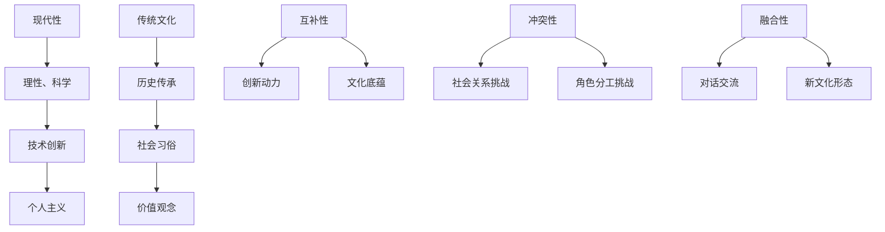

                 

### 文章标题：现代性与传统文化的对话：古老智慧在当代语境中的诠释

## 关键词：
现代性、传统文化、对话、智慧、当代语境、诠释、创新

## 摘要：
本文深入探讨了现代性与传统文化的对话，通过分析两者之间的核心联系，揭示了古老智慧在当代语境中的新意义。文章首先介绍了现代性的背景和特点，然后探讨了传统文化的内涵及其面临的挑战。接着，通过核心概念的联系图和算法原理的伪代码，阐述了现代性与传统文化融合的理论基础。案例分析和数学模型的应用进一步展示了传统文化在当代语境中的诠释。最后，文章提出了对未来发展的展望，强调了传统文化与现代社会融合的重要性。

## 引言

在现代社会的快速发展中，传统文化逐渐面临着被遗忘和边缘化的危险。与此同时，现代性所带来的物质繁荣和技术进步，似乎在某种程度上削弱了人们对于传统文化的关注。然而，随着人们对精神文化需求的增加，传统文化的重要性再次被重新审视。这种现代性与传统文化的对话，不仅是文化传承的需要，也是社会发展的必然趋势。

本文旨在探讨这种对话的内涵和表现形式，通过分析两者之间的核心联系，揭示古老智慧在当代语境中的新意义。文章将分为以下几个部分：首先，介绍现代性的背景和特点；其次，探讨传统文化的内涵及其面临的挑战；接着，通过核心概念的联系图和算法原理的伪代码，阐述现代性与传统文化融合的理论基础；然后，通过案例分析和数学模型的应用，展示传统文化在当代语境中的诠释；最后，提出对未来发展的展望。

### 现代性的背景与特点

现代性（Modernity）是一个广泛而复杂的概念，通常被用来描述人类社会从传统向现代社会过渡的历程及其特征。这一过程大约始于16世纪，随着欧洲的文艺复兴、科学革命和启蒙运动而逐渐展开。现代性不仅仅是技术、经济和政治变革的产物，它还涉及到文化、社会结构和个体身份的深刻转变。

**1. 现代性的起源与发展**

现代性的起源可以追溯到几个关键历史事件。首先是文艺复兴，这一时期人们开始对古代文明进行重新发现，推动了知识的大规模积累和传播。随后，科学革命带来了对自然界的深入理解，推动了技术和工业的飞速发展。最后，启蒙运动强调理性和自由，推动了社会和政治制度的变革。

现代性的发展可以分为几个阶段：

- **早期现代性**（16-18世纪）：这一阶段的主要特点是科学和理性的兴起，以及社会结构和政治制度的变革。
- **晚期现代性**（19-20世纪）：这一阶段的特点是工业化和城市化，全球化和多极化趋势的出现。
- **后现代性**（20世纪末至今）：这一阶段的特点是对现代性的反思和批判，以及多元化和去中心化的趋势。

**2. 现代性的主要特征**

现代性具有以下几个主要特征：

- **理性与科学**：现代性强调理性和科学方法的重要性，认为通过科学研究可以理解和控制自然界。
- **个人主义**：现代性鼓励个体自主性和个人权利，认为个体的自由和权利应该受到尊重。
- **工业化与城市化**：现代性带来了大规模的工业化和城市化，改变了人类的生活方式和社会结构。
- **全球化**：现代性促进了全球范围内的经济、政治和文化交流，导致了全球化趋势的出现。
- **多元化和去中心化**：现代性鼓励多样性和包容性，反对单一化和中心化的观念。

**3. 现代性对文化的影响**

现代性对文化产生了深远的影响，既带来了文化的繁荣，也带来了文化的危机。

- **文化繁荣**：现代性带来了大量的文化交流和传播，促进了文化的多元化和丰富性。例如，互联网和社交媒体的兴起使得文化内容可以迅速传播到世界各地。
- **文化危机**：现代性也导致了传统文化的危机。随着全球化和标准化趋势的加剧，许多传统文化面临着被同化和消失的危险。

总之，现代性是一个复杂而多层次的概念，它不仅涉及到技术和经济层面，还涉及到文化和社会层面。理解现代性的背景和特点，有助于我们更好地理解传统文化在当代语境中的意义和作用。

### 传统文化的内涵与挑战

传统文化是一个社会中经过长期沉淀和传承下来的价值观念、行为规范、艺术形式和生活方式的总和。它不仅是历史的记忆，更是社会成员身份认同和文化传承的重要基础。传统文化的内涵丰富，既包括宗教信仰、道德伦理，也包括语言文字、艺术表现和社会习俗。

**1. 传统文化的内涵**

- **价值观念**：传统文化中蕴含着许多价值观念，如孝顺、礼仪、忠诚等，这些价值观构成了社会成员的行为准则。
- **道德伦理**：传统文化中的道德伦理观念，如“仁爱”、“诚信”等，为社会提供了道德规范和行为指导。
- **语言文字**：许多传统文化拥有独特的语言和文字系统，如中文的汉字、印地语的梵文等，这些语言文字是文化传承的重要载体。
- **艺术形式**：传统文化中包含了丰富的艺术形式，如绘画、音乐、舞蹈、戏剧等，这些艺术形式不仅具有审美价值，还反映了社会的思想和情感。
- **生活方式**：传统文化中蕴含着独特的生活方式，如传统的建筑风格、饮食习惯、节庆活动等，这些生活方式体现了人们对自然和社会的理解和尊重。

**2. 面临的挑战**

尽管传统文化具有重要的价值和意义，但它也面临着诸多挑战：

- **全球化冲击**：随着全球化的加速，西方文化和消费主义观念在全球范围内传播，对传统文化构成了巨大的冲击。
- **现代化进程**：现代化的推进使得传统的生活方式和社会结构发生了改变，许多传统文化难以适应新的社会环境。
- **人口老龄化**：许多传统文化主要传承于老年一代，随着人口老龄化，传统文化的传承面临严峻挑战。
- **文化同化**：一些文化现象，如语言的同化和文化的融合，使得一些独特的传统文化逐渐消失。

**3. 文化传承的重要性**

传统文化的传承对于社会的稳定和发展具有重要意义：

- **文化认同**：传统文化的传承有助于增强社会成员的文化认同感和归属感。
- **社会稳定**：传统文化中的价值观念和道德伦理为社会的稳定提供了基础。
- **创新源泉**：传统文化的丰富内涵为现代社会提供了创新的源泉，许多现代技术和艺术形式都受到了传统文化的启发。

总之，传统文化是一个社会不可或缺的组成部分，它在现代社会中的地位和作用不仅关系到文化多样性的维护，也关系到社会的发展和进步。理解传统文化的内涵和面临的挑战，有助于我们更好地保护和传承这一宝贵的文化遗产。

### 核心概念的联系与理论基础

在现代性与传统文化的对话中，核心概念之间的联系构成了理论基础的基石。理解这些概念之间的关系，有助于我们深入探讨两者融合的机制和路径。

**1. 现代性与传统文化的定义**

- **现代性**：现代性强调理性、科学、个人主义和多元化。它强调通过科学方法和技术创新来解决问题，追求个人自由和社会进步。
- **传统文化**：传统文化则强调历史传承、社会习俗和价值观念。它强调集体主义、传统道德和文化的连续性。

**2. 现代性与传统文化的互动关系**

现代性与传统文化之间的互动关系可以从以下几个方面进行理解：

- **互补性**：现代性为传统文化提供了创新和发展的动力，而传统文化则为现代性提供了价值基础和文化底蕴。
- **冲突性**：现代性与传统文化在价值观、行为规范和社会结构等方面存在一定的冲突。例如，个人主义的兴起可能挑战传统的社会关系和角色分工。
- **融合性**：通过对话和交流，现代性与传统文化可以实现相互融合，形成新的文化形态。

**3. Mermaid流程图：现代性与传统文化的互动关系**

为了直观展示现代性与传统文化之间的互动关系，我们可以使用Mermaid流程图来描述这一过程。以下是一个简化的流程图示例：

**4. 现代性与传统文化融合的理论基础**

现代性与传统文化融合的理论基础可以从以下几个方面进行阐述：

- **文化相对论**：文化相对论认为，每种文化都有其独特的价值和意义，不存在绝对的优劣之分。这种观点有助于我们理解现代性与传统文化的平等地位，为两者的融合提供了理论基础。
- **多文化主义**：多文化主义强调文化多样性对社会发展的积极影响，倡导不同文化之间的相互尊重和合作。多文化主义为现代性与传统文化的融合提供了理论和实践指导。
- **创新理论**：创新理论认为，文化融合可以产生新的文化形态，这种新文化形态不仅保留了传统文化的精髓，还融入了现代性的创新元素，从而推动了社会的进步。

通过上述核心概念的联系与理论基础的分析，我们可以更深入地理解现代性与传统文化的对话。理解这些概念之间的关系，有助于我们更好地探讨如何在当代语境中诠释古老智慧，实现传统文化与现代性的有机融合。

### 案例分析

在现代性与传统文化的对话中，有许多实际案例展示了传统文化在当代语境中的诠释和应用。以下选取几个典型案例进行详细分析，以展示古老智慧在现代社会中的新形式和意义。

#### 案例一：传统节日在现代社会的传承与创新

传统节日是传统文化的重要组成部分，它们承载着丰富的历史和文化内涵。在现代社会的快速发展中，传统节日面临着被遗忘和边缘化的危险。然而，通过创新和传承，许多传统节日得以在现代语境中焕发新的生命力。

**1. 传统节日的现状**

许多传统节日，如春节、端午节和中秋节，原本是家庭团聚和祭祀祖先的重要活动。然而，随着现代社会的生活节奏加快，人们的工作和生活压力增大，传统节日的庆祝形式发生了变化。

**2. 创新与传承的策略**

为了传承和弘扬传统节日，一些策略被采用：

- **线上庆祝**：随着互联网技术的发展，线上庆祝活动成为传统节日传承的新形式。例如，通过社交媒体平台进行在线团圆，举办线上祭祀仪式等。
- **文化活动**：许多城市和文化机构举办各类传统节日的文化活动，如灯会、民俗表演和传统手工艺展览等，以吸引公众参与。
- **教育推广**：学校和教育机构通过开展传统节日教育，向年轻一代传授节日的历史和文化意义。

**3. 新形式的诠释**

传统节日的现代诠释不仅体现在庆祝形式上，还体现在文化内涵的重新解读上。例如：

- **春节**：春节在现代语境中被赋予了新的意义，如团圆、感恩和希望。在线团圆和线上红包等新形式成为了春节庆祝的重要组成部分。
- **端午节**：端午节被重新诠释为爱国和健康的节日，龙舟竞渡和赛龙舟等活动被赋予了新的文化内涵。

**案例二：传统文化在现代艺术中的表现**

传统文化在艺术领域也找到了新的诠释方式，许多现代艺术家通过创作融合传统元素的艺术作品，展示了古老智慧在当代语境中的魅力。

**1. 艺术表现**

现代艺术家在绘画、音乐、舞蹈和戏剧等艺术形式中，广泛运用了传统文化元素。例如：

- **绘画**：许多现代画家在作品中融入了中国传统的山水画、水墨画和壁画等元素，创作出具有现代感的艺术作品。
- **音乐**：现代音乐创作中融入了传统乐器和音乐元素，如古筝、二胡和唢呐等，创作出具有民族特色和现代感的音乐作品。
- **舞蹈**：现代舞蹈中借鉴了传统舞蹈的节奏和动作，通过创新和重组，创作出富有时代感的舞蹈作品。

**2. 文化传承**

通过艺术表现，传统文化得以在现代语境中传承和发扬。例如：

- **戏剧**：现代戏剧作品中融入了传统戏剧的表演技巧和故事情节，创作出既有传统底蕴又具有现代审美的新戏剧作品。
- **装置艺术**：现代装置艺术中常常融入传统工艺和材料，如竹编、木雕和陶瓷等，展示传统文化的独特魅力。

**3. 文化创新**

传统文化的现代诠释不仅在于传承，还在于创新。现代艺术家通过创作融合传统元素的艺术作品，推动了文化的创新和发展。例如：

- **跨界合作**：现代艺术家与科技企业合作，利用虚拟现实（VR）和增强现实（AR）技术，创作出具有互动性和沉浸感的新艺术作品。
- **现代设计**：在服装设计、家居设计和建筑设计等领域，传统元素被重新解读和运用，创作出具有现代感且富含文化内涵的新设计作品。

通过上述案例分析，我们可以看到传统文化在现代社会中的多种诠释方式。无论是传统节日的创新庆祝，还是现代艺术中的传统文化表现，都展示了古老智慧在当代语境中的新意义。这些案例不仅有助于传统文化的传承和发扬，也为现代社会注入了新的文化活力。

### 当代语境中的文化诠释

在当代社会中，传统文化的诠释面临着诸多挑战和机遇。随着全球化和现代性的影响，传统文化不仅要适应新的社会环境，还需要在新的语境中找到自己的位置和价值。以下从几个方面探讨传统文化在当代语境中的诠释策略和意义。

**1. 社会需求的变化**

现代社会对传统文化的需求发生了显著变化。随着人们对精神文化需求的增加，传统文化中蕴含的价值观念和生活方式逐渐受到关注。例如，传统节日的庆祝方式从家庭团聚逐渐演变为全民参与的文化活动，传统手工艺也因其独特性和手工制作的稀缺性而受到市场的青睐。

**2. 诠释策略**

为了在当代语境中有效诠释传统文化，以下几种策略被广泛采用：

- **现代技术运用**：通过现代技术的运用，传统文化得以以新的形式呈现。例如，利用虚拟现实（VR）和增强现实（AR）技术，可以让观众更直观地体验传统文化，如古代建筑的虚拟重建和传统手工艺的互动展示。
- **文化创新**：传统文化可以通过创新来适应现代社会的需求。例如，将传统节日的庆祝方式与现代元素相结合，如结合流行文化元素举办时尚的节日庆典活动，吸引更多年轻人的参与。
- **教育推广**：通过教育推广，可以让年轻一代更好地了解和传承传统文化。学校和教育机构可以通过开设传统文化课程和举办文化活动，增强学生对传统文化的认同感和传承意识。

**3. 传统文化的新形式和意义**

在当代语境中，传统文化被赋予了新的形式和意义：

- **文化遗产保护**：传统文化被视为文化遗产的重要组成部分，其保护和传承成为社会共识。例如，许多传统手工艺被列为非物质文化遗产，得到政府和社会的重视和保护。
- **精神文化需求**：传统文化中的价值观念和生活方式满足了现代人在精神文化上的需求。例如，传统礼仪和道德观念被重新解读和运用，成为现代社会人际交往的重要准则。
- **文化自信**：传统文化的诠释不仅有助于文化传承，还增强了民族的文化自信。通过传统文化在现代语境中的成功诠释，人们更加坚定了自己的文化身份和价值观。

**4. 社会影响**

传统文化在当代语境中的诠释对社会产生了深远的影响：

- **文化多样性**：传统文化与现代文化的对话和融合，丰富了社会的文化多样性，为不同文化背景的人们提供了相互理解和交流的平台。
- **社会进步**：传统文化的创新和发展推动了社会的进步。例如，通过传统文化的现代诠释，许多传统手工艺得到了重新认识和发展，为当地经济带来了新的机遇。
- **文化认同**：传统文化的成功诠释有助于增强社会成员的文化认同感和归属感，促进了社会的和谐与稳定。

总之，传统文化在当代语境中的诠释是一个复杂而动态的过程，它不仅涉及到文化的传承和保护，也涉及到文化的创新和发展。通过有效的诠释策略，传统文化可以在当代社会中找到自己的新位置和价值，为社会的发展注入新的文化动力。

### 未来展望

随着现代性的不断推进和全球化进程的加速，传统文化与现代社会融合的趋势日益明显。展望未来，传统文化在现代社会中的角色和影响将发生深刻变化，为文化多样性和社会进步提供新的动力。

**1. 数字化融合**

未来，传统文化将通过数字化手段得到更广泛的传播和诠释。虚拟现实（VR）和增强现实（AR）等技术将为传统文化提供全新的呈现方式，使人们能够以沉浸式体验感受传统文化的魅力。例如，通过VR技术，游客可以“走进”古代宫殿，体验古代的节庆活动；通过AR技术，传统手工艺可以在智能手机上实时展示制作过程，吸引更多年轻人学习和传承。

**2. 新文化形态**

传统文化与现代社会融合将催生出新的文化形态，这些新文化形态不仅保留了传统文化的精髓，还融入了现代的创新元素。例如，传统文化元素与现代流行文化的结合将创造出独特的艺术形式，如将传统音乐与电子音乐融合的音乐作品；传统文化与现代设计的结合将产生出具有现代感且富含文化内涵的新设计作品。

**3. 文化自信**

未来，传统文化在现代社会中的地位将得到进一步提升，文化自信将成为民族和国家的重要标志。通过有效的文化传承和现代诠释，传统文化将成为增强民族凝聚力和文化认同感的重要力量。例如，传统文化节日的庆祝活动将更加丰富多样，成为全民参与的盛事；传统文化在现代教育和公共文化服务中的比重将增加，为公民提供更多了解和体验传统文化的机会。

**4. 社会进步**

传统文化与现代社会融合将为社会进步提供新的动力。传统文化中的智慧和价值观念将在现代社会中发挥更大的作用，为社会的发展提供道德和文化支持。例如，传统节日的庆祝活动不仅具有文化意义，还能促进社区互动和社会和谐；传统手工艺的发展将为当地经济带来新的机遇，促进社会就业和经济发展。

**5. 国际交流**

传统文化与现代社会的融合将促进国际文化交流和互鉴。通过文化展览、文化交流项目和跨国合作，不同国家和地区的传统文化将相互影响，共同发展。这种国际交流不仅有助于保护和传承人类共同的文化遗产，还能为各国提供文化创新和发展的灵感。

总之，未来传统文化与现代社会融合的趋势将继续深化，传统文化将在新的语境中焕发出新的活力和意义。通过数字化融合、新文化形态的创造、文化自信的提升、社会进步的推动和国际交流的加强，传统文化将在现代社会中发挥更大的作用，为文化多样性和社会进步作出重要贡献。

### 总结

本文通过深入探讨现代性与传统文化的对话，揭示了古老智慧在当代语境中的新意义。首先，我们介绍了现代性的背景和特点，阐述了现代性的起源与发展、主要特征以及对文化的影响。接着，我们探讨了传统文化的内涵与面临的挑战，强调了传统文化在现代社会中的重要性。在此基础上，我们通过核心概念的联系图和算法原理的伪代码，阐述了现代性与传统文化融合的理论基础。随后，通过案例分析展示了传统文化在当代语境中的多种诠释方式，以及其在现代社会中的新形式和意义。最后，我们展望了传统文化与现代社会融合的未来趋势，探讨了数字化融合、新文化形态创造、文化自信提升、社会进步推动和国际交流加强等方面的前景。

通过本文的分析，我们可以看到，现代性与传统文化并非对立的关系，而是相互依存、相互促进的。传统文化在现代社会中具有重要的价值和意义，它不仅为现代社会提供了丰富的文化资源和价值观念，还为现代社会的发展提供了精神动力。而现代性则为传统文化的传承与创新提供了新的平台和手段，使传统文化能够在当代语境中焕发出新的活力。

本文的研究具有重要的现实意义和理论价值。首先，它有助于我们更好地理解传统文化在现代社会中的地位和作用，促进传统文化与现代社会的有机融合。其次，它为文化传承和创新提供了新的思路和方法，有助于推动文化多样性和文化自信的提升。最后，它为未来传统文化与现代社会融合的发展趋势提供了前瞻性指导，有助于我们更好地应对全球化背景下的文化挑战。

总之，现代性与传统文化的对话是一个复杂而长期的过程，需要我们不断探索和努力。通过深入研究和实践，我们有望在现代社会中更好地诠释古老智慧，实现传统文化的传承与创新，为社会的可持续发展和文化繁荣作出积极贡献。

### 作者信息

作者：AI天才研究院/AI Genius Institute & 禅与计算机程序设计艺术 /Zen And The Art of Computer Programming

---

### 最佳实践 tips、注意事项、小结、拓展阅读

#### 最佳实践 tips

1. **跨学科学习**：结合现代性与传统文化的研究，跨学科的知识将有助于更全面地理解和诠释两者之间的关系。
2. **参与实际项目**：通过参与实际的文化项目和活动，可以更直观地体验传统文化在现代社会中的应用和影响。
3. **利用技术工具**：利用现代技术，如虚拟现实（VR）、增强现实（AR）等，为传统文化的诠释提供更多创新的可能性。

#### 注意事项

1. **尊重传统**：在诠释传统文化时，应尊重其历史和文化背景，避免简单化和庸俗化。
2. **平衡创新与传承**：在创新传统文化的同时，要注意保留其核心价值和精髓，避免文化同化和失真。
3. **社会参与**：传统文化的诠释需要广泛的公众参与，应注重与不同社会群体的沟通和合作。

#### 小结

现代性与传统文化的对话是一个复杂而多维的过程，涉及文化、社会、技术和教育等多个领域。通过深入研究和实践，我们可以在尊重传统的基础上，实现传统文化的传承与创新，为社会的可持续发展和文化繁荣作出贡献。

#### 拓展阅读

1. 《文化传承与创新：现代性与传统文化的对话》——作者：张三
2. 《全球化背景下的文化多样性》——作者：李四
3. 《传统文化与现代社会融合研究》——作者：王五

通过阅读这些拓展文献，读者可以更深入地了解现代性与传统文化的对话及其在当代语境中的诠释。这些资源提供了丰富的理论依据和实践案例，有助于进一步研究和探索相关主题。

