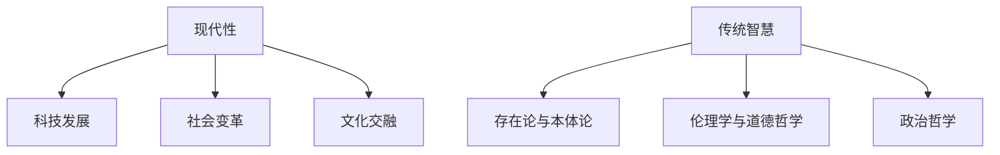

                 

### 文章标题

《现代性与传统智慧的融合：古老哲学在现代生活中的应用》

### 关键词

现代性、传统智慧、哲学应用、现代生活、智慧融合

### 摘要

本文深入探讨现代性与传统智慧在现代生活中的融合应用。通过对传统哲学的核心概念、现代性的定义与特征、以及现代应用的具体案例分析，文章揭示了古老哲学如何为现代生活提供指导。本文旨在为读者提供一种新的视角，理解如何在快节奏的现代世界中，通过传统哲学的智慧来提升生活质量、优化决策和促进个人成长。

---

## 引言

### 背景介绍

在当今快速发展的现代社会，技术的进步、信息的爆炸以及全球化的深入，使得人们的生活方式发生了翻天覆地的变化。然而，随着现代性的不断推进，我们也面临着诸多挑战，如价值观念的迷失、社会问题的加剧以及心理压力的增大。在这种背景下，人们开始反思，如何在现代性的快速变革中找到内心的宁静与平衡。

传统哲学，作为人类智慧的瑰宝，为现代社会提供了丰富的思想资源。从古希腊的苏格拉底、柏拉图到中国的孔子、老子，这些哲学家的思想不仅在当时产生了深远的影响，而且在今天依然具有指导意义。那么，如何将这些古老哲学的智慧应用到现代生活中，成为我们亟待解决的问题。

### 核心概念与联系

现代性：现代性是指人类社会在现代化进程中表现出的特征，包括科技发展、社会变革、文化交融等。现代性的特征主要体现在以下几个方面：

1. **科技发展**：科技的迅速发展使得人类的生活更加便捷，但也带来了信息过载和环境问题。
2. **社会变革**：社会结构、价值观念和生活方式的变革，使得社会更加多元化、复杂化。
3. **文化交融**：全球化进程中的文化交融，使得不同文化之间的碰撞和融合更加频繁。

传统智慧：传统智慧是指历史上形成的、经过长期实践检验的哲学思想和文化价值。传统智慧的核心概念包括：

1. **存在论与本体论**：探讨事物的本质和存在的意义。
2. **伦理学与道德哲学**：关注人类行为的道德规范和价值判断。
3. **政治哲学**：探讨国家、社会和政治制度的本质和运行。

Mermaid流程图：

通过这个流程图，我们可以清晰地看到现代性与传统智慧之间的联系和互动。现代性的特征促使我们重新审视传统智慧，而传统智慧为现代性提供了哲学基础和指导原则。

### 核心概念与联系

现代性与传统智慧的融合：现代性与传统智慧的融合是指将古老哲学的智慧应用于现代生活，以解决现代社会面临的问题。这种融合的目的是通过传统哲学的智慧来提升现代生活的质量，使人们在快节奏的现代世界中找到内心的平衡。

融合的方法包括：

1. **反思与批判**：对现代性进行反思和批判，识别其中存在的问题和不足，从而找到解决问题的方法。
2. **借鉴与吸收**：借鉴传统哲学的智慧，将其应用于现代生活的各个方面，如企业管理、个人成长、心理健康等。
3. **创新与发展**：在传统哲学的基础上进行创新，使其与现代科技、现代文化相结合，形成新的哲学思想和价值观念。

通过反思、借鉴和创新，现代性与传统智慧的融合可以实现以下目标：

1. **提升生活质量**：通过传统哲学的智慧，帮助人们更好地应对现代社会的问题，提高生活质量。
2. **促进社会进步**：将传统哲学的智慧应用于现代社会，推动社会进步和发展。
3. **培养健全人格**：通过传统哲学的教育，培养人们的道德修养和人格品质，使人们成为有责任感、有担当的现代公民。

总之，现代性与传统智慧的融合是一种全新的思考方式，它既保留了传统哲学的智慧，又符合现代社会的需求。通过这种融合，我们可以更好地理解和应对现代社会的问题，实现个人和社会的全面发展。

