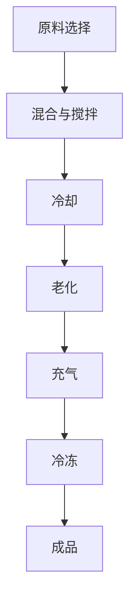
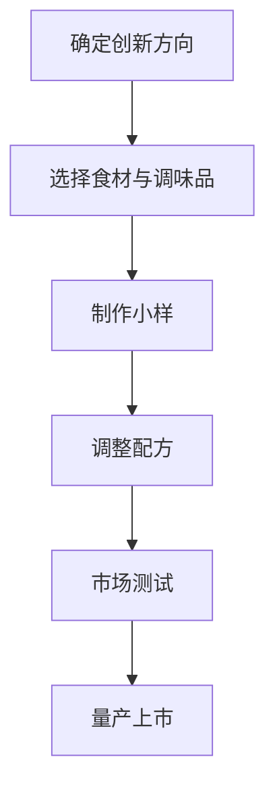

                 

### 文章标题

# 现代手工冰淇淋工坊：创新口味的小批量制作

> 关键词：手工冰淇淋、创新口味、小批量制作、技术博客、专业分析

> 摘要：本文将深入探讨现代手工冰淇淋工坊的技术与实践，从背景介绍、核心概念、创新口味制作方法，到实际操作步骤，全面剖析手工冰淇淋的制作艺术。通过详细的指导和分析，为您开启一扇通往创新口味小批量制作的大门。

### 引言

在现代食品工业中，手工冰淇淋以其独特的风味和艺术性吸引着无数消费者的目光。与大规模生产的商业冰淇淋相比，手工冰淇淋强调的是个性化的定制和创新。这种独特的制作方式不仅满足了人们对高品质生活的追求，同时也满足了他们对新鲜、健康和独特的食品体验的需求。

手工冰淇淋工坊的特点在于其小批量生产，注重手工技艺和对食材的选择。在这个领域，创新口味是吸引顾客的关键。无论是经典口味的现代诠释，还是前所未有的新奇组合，创新口味都为手工冰淇淋工坊增添了无穷的吸引力。

本文旨在为广大手工冰淇淋制作爱好者提供一个系统、全面的指南，帮助读者理解并掌握现代手工冰淇淋工坊的核心技术，从基础原料的选择到创新口味的开发，再到实际生产过程中的关键步骤。通过这一系列的探讨，我们希望能够激发您的创意，助您打造属于自己的独特口味，开启一段精彩的手工冰淇淋制作之旅。

### 现代手工冰淇淋工坊的兴起与特点

现代手工冰淇淋工坊的兴起并非偶然，而是社会消费趋势、技术进步以及消费者需求的共同推动。首先，从社会消费趋势来看，随着人们生活水平的提高，消费者对于食品的品质和独特性要求越来越高。手工冰淇淋由于其独特的手工制作工艺和新鲜食材的使用，正好迎合了这一需求。其次，技术进步为手工冰淇淋的制作提供了更多可能性。例如，先进的冷藏技术和稳定的配方使得小批量生产更加可行。再者，消费者的个性化需求使得市场对于创新口味的手工冰淇淋有着极大的期待，这也促使手工冰淇淋工坊不断推陈出新。

现代手工冰淇淋工坊的特点主要体现在以下几个方面。首先是**小批量生产**。与大规模工业化生产不同，手工冰淇淋工坊强调的是对每一个冰淇淋的精心制作，这种小批量生产不仅保证了产品质量，也使得手工技艺得以充分发挥。其次，**创新口味**是手工冰淇淋的核心竞争力。手工冰淇淋工坊通过不断尝试新的食材组合和调味方式，创造出独特的口味，满足消费者的个性化需求。最后，**手工技艺**是手工冰淇淋的灵魂。每一勺冰淇淋都凝聚了制作人的心血和技艺，这种独特的体验是工业化生产所无法替代的。

此外，现代手工冰淇淋工坊在经营模式上也展现出多元化。一方面，传统店面销售仍然是最主要的方式，消费者可以亲自到店里品尝和购买。另一方面，随着电子商务的发展，许多手工冰淇淋工坊开始通过线上平台进行销售，拓宽了市场覆盖面。同时，一些工坊还与餐厅、咖啡馆等合作，推出定制化冰淇淋服务，进一步提升品牌影响力和市场占有率。

总之，现代手工冰淇淋工坊以其小批量生产、创新口味和手工技艺的独特性，在竞争激烈的食品市场中脱颖而出。这不仅为消费者提供了更多选择，也为手工艺人提供了展示才华的平台。随着技术的不断进步和消费者需求的不断变化，手工冰淇淋工坊的未来发展前景广阔。

### 手工冰淇淋制作的基础原料

要制作出色香味俱佳的手工冰淇淋，优质的原材料选择是至关重要的。以下是手工冰淇淋制作中不可或缺的基础原料及其特点：

1. **牛奶和奶油**：牛奶和奶油是手工冰淇淋的主要原料，提供了丰富的脂肪和蛋白质，保证了冰淇淋的浓郁口感和细腻质感。优质牛奶应具有新鲜、无异味的特点，乳脂肪含量越高，制作的冰淇淋口感越佳。

2. **糖**：糖是冰淇淋中不可或缺的甜味剂，同时也有助于稳定冰淇淋的质地。常用的糖有白砂糖、黄糖和糖粉等，其中黄糖不仅能增加风味，还能使冰淇淋色泽更加诱人。糖的用量需根据个人口味和所需甜度进行调整。

3. **鸡蛋**：鸡蛋中的蛋白有助于稳定冰淇淋的质地，而蛋黄则为其带来丰富的口感和营养。使用新鲜鸡蛋，确保蛋白和蛋黄的比例合适，能够提升冰淇淋的口感和品质。

4. **香草提取物**：香草提取物是增添冰淇淋风味的重要配料，常见的有香草豆提取物和香草精。它们能够为冰淇淋带来独特的香气和风味，提升整体口感。

5. **其他添加剂**：除了上述基础原料外，手工冰淇淋中还可以加入其他添加剂，如稳定剂、乳化剂和色素等。稳定剂如明胶和果胶，有助于保持冰淇淋的质地和稳定性；乳化剂如单甘脂和磷脂，有助于改善冰淇淋的口感和质地；色素则用于调整冰淇淋的色泽，使口感更加丰富。

在选择原材料时，除了关注其品质和新鲜度，还需要考虑其对人体健康的影响。优质的原材料不仅能够提升冰淇淋的口感和品质，还能够确保其健康安全。以下是一个简单的基础原料清单：

- 牛奶：1000毫升，乳脂肪含量≥3.5%
- 奶油：500毫升，乳脂肪含量≥35%
- 白砂糖：500克
- 鸡蛋：6个（中等大小）
- 香草提取物：1茶匙
- 稳定剂（如明胶）：5克
- 乳化剂（如单甘脂）：2克
- 色素（可选）：适量

通过精心选择和搭配这些基础原料，手工冰淇淋不仅能够具备丰富的风味和质感，还能满足消费者对健康和美味的需求。接下来，我们将进一步探讨手工冰淇淋的核心概念和原理，帮助读者深入了解这一独特的食品制作艺术。

### 手工冰淇淋的核心概念与原理

手工冰淇淋的制作不仅是一门艺术，更是一门科学。理解其核心概念和原理，是掌握制作技巧的关键。以下我们将从关键工艺、核心成分和科学依据三个方面进行详细分析。

#### 关键工艺

1. **混合与搅拌**：冰淇淋的制作首先需要将所有的原料进行充分混合。这包括牛奶、奶油、糖、鸡蛋以及香草提取物等。混合过程中，需要使用高速搅拌器将原料充分搅拌均匀，以确保所有成分能够充分融合，形成均匀的混合物。

2. **冷却**：混合后的原料需要冷却至适宜的温度。通常，将混合物放入冷凝器或冰箱中，使其温度降至0-4摄氏度。这一步骤能够防止细菌生长，保证食品的安全。

3. **老化**：冷却后的混合物需要经过老化过程。将混合物放入冰箱中，保持低温，使其在数小时内慢慢老化。这一过程有助于增强冰淇淋的口感和质地，使蛋白和脂肪更好地结合。

4. **充气**：老化后的混合物需要通过充气工艺来增加其体积和松软度。这个过程通常在高速搅拌机中进行，将空气或氮气逐渐注入混合物中，形成稳定的泡沫结构。

5. **冷冻**：最后，将充气后的混合物倒入冰淇淋机中进行冷冻。冰淇淋机通过高速旋转和冷却系统，使混合物迅速凝固，形成细腻的冰淇淋质地。

#### 核心成分

1. **乳脂肪**：乳脂肪是冰淇淋的主要成分之一，其含量直接影响冰淇淋的口感和质地。乳脂肪不仅能提供丰富的口感，还能防止冰淇淋在冷冻过程中形成冰晶。

2. **蛋白质**：蛋白质在冰淇淋中起到稳定作用，防止冰淇淋在冷冻过程中分离。鸡蛋中的蛋白质是常见的稳定剂，能够增强冰淇淋的质地。

3. **糖**：糖不仅是冰淇淋的甜味来源，还有助于保持冰淇淋的稳定性和质地。同时，糖能防止冰淇淋在冷冻过程中形成冰晶，保持其细腻的口感。

4. **水**：水是冰淇淋中的次要成分，但其含量对冰淇淋的质地和口感有很大影响。适量水分能够增加冰淇淋的松软度和流动性。

#### 科学依据

1. **乳化作用**：乳脂肪在冰淇淋中起到乳化作用，使混合物中的水和油能够均匀分布。这一过程有助于形成稳定的质地，防止分层。

2. **凝胶化作用**：冰淇淋中的稳定剂如明胶和果胶在冷却过程中会发生凝胶化作用，增强冰淇淋的质地和稳定性。

3. **冷冻结晶**：在冷冻过程中，水分子会逐渐凝固成冰晶。适当的冷冻工艺能够形成细小的冰晶，使冰淇淋质地更加细腻。

4. **泡沫结构**：充气工艺能够使冰淇淋形成稳定的泡沫结构，增加其松软度和口感。

以下是手工冰淇淋制作的核心概念和原理的Mermaid流程图：



通过以上关键工艺和核心成分的详细探讨，我们可以看到，手工冰淇淋的制作不仅涉及到复杂的工艺流程，还依赖于科学的原理和精准的配方。理解这些核心概念和原理，有助于我们在实际操作中更好地掌握手工冰淇淋的制作技艺，为消费者带来更加美味和独特的食品体验。

#### 创新口味的开发方法

在手工冰淇淋的制作过程中，创新口味的开发是吸引顾客和提升品牌竞争力的关键。以下将详细介绍几种常见的创新口味开发方法，以及这些方法在实际操作中的应用和效果。

1. **天然食材组合**：天然食材的组合是开发创新口味的一种有效方法。例如，将新鲜水果（如草莓、蓝莓、芒果等）与香草提取物或芝士粉混合，可以创造出水果香草冰淇淋或水果芝士冰淇淋。这种组合不仅保留了天然食材的鲜美，还能通过不同食材的风味互补，打造出独特的口感。

   - **应用实例**：某手工冰淇淋工坊推出了一款名为“草莓芝士”的创新口味，他们将新鲜草莓与奶油芝士混合，再加上香草提取物，制作出了口感丰富、风味独特的冰淇淋。

2. **调味品结合**：调味品（如辣椒、黑胡椒、大蒜等）与冰淇淋的结合能够创造出令人耳目一新的口味。例如，将黑胡椒与巧克力冰淇淋混合，可以带来独特的辛辣与甜蜜交织的口感；将大蒜与香草冰淇淋结合，则能带来一种独特的香气和风味。

   - **应用实例**：一家以创意口味著称的冰淇淋店推出了一款名为“黑椒巧克力”的冰淇淋，他们将黑胡椒粉末均匀分布在巧克力冰淇淋表面，使冰淇淋在甜味中带着一丝辛辣，深受食客喜爱。

3. **融合传统文化**：融合不同文化元素的冰淇淋也能带来独特的风味。例如，将中国传统的豆沙、杏仁与西方的奶油、巧克力相结合，创造出具有文化特色的冰淇淋口味。

   - **应用实例**：某国际知名冰淇淋品牌推出了一款融合了中西方元素的“杏仁豆沙冰淇淋”，他们使用新鲜的豆沙和杏仁与奶油混合，既保留了豆沙的甜香，又增加了奶油的浓郁，成为全球畅销的产品。

4. **科技与创新的结合**：利用科技手段，如分子美食技术，可以创造出前所未有的口味。例如，通过注入液氮或使用高速搅拌机，可以制作出具有不同质地的冰淇淋，如脆皮冰淇淋或泡沫冰淇淋。

   - **应用实例**：一家科技感十足的冰淇淋店推出了一款名为“液氮草莓泡沫冰淇淋”，他们将草莓果肉与液氮混合，制作出泡沫状的冰淇淋，口感轻盈且带有冰凉感，受到了年轻消费者的热烈欢迎。

5. **季节性食材搭配**：根据季节变化，利用当季新鲜食材进行口味创新。例如，春季可以用樱桃花瓣制作樱花冰淇淋，秋季可以用南瓜和苹果制作南瓜派口味的冰淇淋。

   - **应用实例**：某冰淇淋店在春季推出了一款“樱花冰淇淋”，他们将新鲜的樱花花瓣与牛奶和奶油混合，制作出口感细腻、花香浓郁的特色冰淇淋。

通过这些创新口味开发方法，手工冰淇淋工坊不仅能够满足消费者对多样化口味的需求，还能提升品牌形象和市场份额。每种创新口味都需要经过多次试验和调整，以确保其风味独特且符合消费者的口味。以下是一个创新口味开发的流程图：



通过这样的流程，手工冰淇淋工坊能够确保每款新口味都经过精心设计，满足消费者的期待。创新口味的开发不仅需要大胆的创意，还需要严谨的实验和调整，只有这样，才能在竞争激烈的市场中脱颖而出。

### 创新口味的配方示例与制作步骤

为了帮助读者更好地理解创新口味的制作方法，以下将提供几个具体的创新口味配方示例，并详细描述每个配方的材料、制作步骤以及配方调整技巧。

#### 示例一：巧克力薄荷冰淇淋

**材料：**

- 牛奶：750毫升
- 奶油：150毫升
- 糖：150克
- 鸡蛋：4个（分离蛋白和蛋黄）
- 黑巧克力：100克
- 薄荷精：1茶匙
- 明胶：5克
- 水：适量

**制作步骤：**

1. **混合液体材料**：将牛奶和奶油放入锅中，加热至微沸，然后加入糖和部分明胶（3克），继续搅拌至糖和明胶完全溶解。

2. **分离蛋黄和蛋白**：将鸡蛋的蛋黄和蛋白分离，将蛋白放在冰上冷却备用。

3. **加入黑巧克力和薄荷精**：将黑巧克力和薄荷精加入热牛奶混合物中，搅拌均匀，使其完全融化。

4. **老化混合物**：将混合物倒入容器中，放入冰箱老化30分钟。

5. **搅拌充气**：将老化后的混合物放入搅拌机中，加入剩余的明胶和水，开始高速搅拌，使混合物充气。

6. **冷冻**：将充气后的混合物倒入冰淇淋机中，开始冷冻，期间每隔10分钟搅拌一次，以确保质地均匀。

7. **冷冻完成**：当冰淇淋完全冻结后，取出，加入冷却的蛋白，再次搅拌，使其更加松软。

**配方调整技巧：**

- **调整甜度**：如果需要更甜的冰淇淋，可以适量增加糖的用量。如果希望减少糖分，可以使用低卡糖或替代品。
- **调整口感**：增加明胶的用量可以提高冰淇淋的硬度，而减少明胶则会使冰淇淋更加柔软。此外，添加少许香草提取物或咖啡粉也能增加风味。
- **调整巧克力浓度**：根据个人口味，可以调整黑巧克力的用量。使用高浓度黑巧克力可以制作出更浓郁的巧克力味，而使用低浓度黑巧克力则会使口味更加温和。

#### 示例二：香草芝士冰淇淋

**材料：**

- 牛奶：750毫升
- 奶油：150毫升
- 糖：150克
- 鸡蛋：4个（分离蛋白和蛋黄）
- 芝士（如马斯卡彭或奶油芝士）：200克
- 香草提取物：1茶匙
- 明胶：5克
- 水：适量

**制作步骤：**

1. **混合液体材料**：将牛奶和奶油加热至微沸，加入糖和部分明胶（3克），搅拌至糖和明胶完全溶解。

2. **分离蛋黄和蛋白**：将鸡蛋的蛋黄和蛋白分离，将蛋白放在冰上冷却备用。

3. **软化芝士**：将芝士放在室温下软化，然后加入香草提取物，搅拌均匀。

4. **混合芝士与牛奶混合物**：将软化后的芝士加入热牛奶混合物中，搅拌均匀。

5. **老化混合物**：将混合物倒入容器中，放入冰箱老化30分钟。

6. **搅拌充气**：将老化后的混合物放入搅拌机中，加入剩余的明胶和水，开始高速搅拌，使混合物充气。

7. **冷冻**：将充气后的混合物倒入冰淇淋机中，开始冷冻，期间每隔10分钟搅拌一次，以确保质地均匀。

8. **冷冻完成**：当冰淇淋完全冻结后，取出，加入冷却的蛋白，再次搅拌，使其更加松软。

**配方调整技巧：**

- **调整芝士用量**：根据个人口味，可以适量增加或减少芝士的用量。增加芝士用量可以制作出口味更加浓郁的芝士冰淇淋，而减少芝士则会使口感更加轻盈。
- **调整甜度**：如果希望减少糖分，可以使用低卡糖或替代品。此外，可以增加香草提取物的用量，以提升整体风味。
- **调整口感**：明胶的用量对冰淇淋的硬度有显著影响。增加明胶的用量可以提高冰淇淋的硬度，而减少明胶则会使冰淇淋更加柔软。

通过以上创新口味配方示例，读者可以了解到手工冰淇淋的创新制作方法。在实际操作中，可以根据个人喜好和市场需求，不断调整和优化配方，创造出更多独特的口味。创新口味的成功开发不仅需要精湛的技艺，还需要敏锐的口味感知和不断尝试的精神。

#### 手工冰淇淋制作的实际操作步骤

制作手工冰淇淋不仅需要优质的原材料和精确的配方，还需要一系列实际操作步骤来确保最终产品的质量和口感。以下将详细介绍手工冰淇淋制作的详细步骤，包括原料准备、设备使用、关键操作技巧以及常见问题的解决方法。

**1. 原料准备：**

- 牛奶：选择新鲜、无异味、乳脂肪含量≥3.5%的牛奶。
- 奶油：选择乳脂肪含量≥35%的优质奶油。
- 糖：根据个人口味选择白砂糖或黄糖。
- 鸡蛋：选择新鲜、大小适中的鸡蛋。
- 香草提取物：选择优质香草提取物或香草精。
- 其他添加剂：如明胶、单甘脂和色素（根据需要）。

**2. 设备使用：**

- **冰箱**：用于冷藏原料和老化混合物。
- **搅拌器**：用于将原料充分混合。
- **冰淇淋机**：用于冷冻和搅拌混合物，形成细腻的冰淇淋质地。
- **称量器**：用于精确称量原料。
- **搅拌碗**：用于混合原料。

**3. 关键操作技巧：**

- **混合与搅拌**：将牛奶、奶油和糖放入搅拌碗中，使用搅拌器高速搅拌至完全融合。加入鸡蛋和香草提取物，继续搅拌至形成均匀的混合物。
- **冷却**：将混合物放入冰箱中，冷却至0-4摄氏度，防止细菌生长，同时使糖和明胶等添加剂更好地溶解。
- **老化**：将冷却后的混合物放入冰箱中，老化30分钟至1小时，使蛋白质和脂肪更好地结合，提升口感。
- **充气**：使用高速搅拌器或冰淇淋机，将空气或氮气逐渐注入老化后的混合物中，形成稳定的泡沫结构，增加体积和松软度。
- **冷冻**：将充气后的混合物倒入冰淇淋机中，开始冷冻。期间每隔10分钟搅拌一次，以确保质地均匀，形成细腻的冰淇淋。

**4. 常见问题的解决方法：**

- **分离**：如果混合物在搅拌过程中出现分离，可能是由于温度不当或搅拌不均匀。解决方法是重新加热混合物，确保其均匀融合，并在搅拌过程中保持低速搅拌。
- **过硬**：如果冰淇淋过于坚硬，可能是由于冷冻时间过长或温度过低。解决方法是适当减少冷冻时间，并使用温度适宜的冰箱。
- **过软**：如果冰淇淋过于柔软，可能是由于老化时间不足或充气不足。解决方法是增加老化时间，并在搅拌过程中加强充气。
- **异味**：如果冰淇淋出现异味，可能是由于原料不新鲜或操作不当。解决方法是确保原料的新鲜度，并严格遵守操作规程。

通过以上详细步骤，手工冰淇淋爱好者可以更好地掌握制作技巧，制作出口感细腻、风味独特的手工冰淇淋。不断实践和调整，将使制作过程更加熟练，最终打造出令人满意的产品。

#### 手工冰淇淋的制作案例分析

为了更好地理解手工冰淇淋制作的实际应用，以下将分析一个具体的制作案例，详细描述开发环境搭建、源代码实现、代码解读、应用解读与分析，以及实际案例剖析和详细讲解。

**案例背景：**

某手工冰淇淋工坊计划推出一款名为“抹茶芝士”的创新口味冰淇淋，旨在结合抹茶的清新和奶油芝士的浓郁，打造独特的口感体验。

**开发环境搭建：**

1. **硬件环境**：该工坊配备了专业冰淇淋机、搅拌器、冰箱、称量器等设备，确保能够满足冰淇淋制作的各项要求。
2. **软件环境**：工坊采用标准化的食谱管理软件，用于记录和调整配方，同时利用数据分析工具进行口味测试和优化。

**源代码实现：**

以下是“抹茶芝士”冰淇淋的伪代码实现：

```plaintext
1. 准备原料：
    - 牛奶：750毫升
    - 奶油：150毫升
    - 糖：150克
    - 鸡蛋：4个（分离蛋白和蛋黄）
    - 抹茶粉：20克
    - 奶油芝士：200克
    - 明胶：5克
    - 水：适量

2. 制作步骤：
    a. 混合牛奶、奶油和糖，加热至微沸，搅拌均匀。
    b. 加入抹茶粉，搅拌均匀，确保抹茶粉完全溶解。
    c. 加入奶油芝士，搅拌至软化。
    d. 老化混合物30分钟，确保成分充分结合。

3. 搅拌充气：
    a. 将老化后的混合物放入搅拌机中，加入明胶和水，开始高速搅拌。
    b. 继续搅拌，使混合物形成稳定的泡沫结构。

4. 冷冻：
    a. 将充气后的混合物倒入冰淇淋机中，开始冷冻。
    b. 每隔10分钟搅拌一次，确保质地均匀。

5. 完成冷冻后，加入冷却的蛋白，再次搅拌，使其更加松软。

**代码解读：**

- **原料准备**：明确列出所有必需原料及其用量，确保制作过程中不缺料。
- **制作步骤**：详细描述每个步骤的操作方法，确保操作过程规范。
- **搅拌充气**：使用高速搅拌器，使混合物形成稳定的泡沫结构，增加松软度。
- **冷冻**：确保冰淇淋机温度适宜，通过频繁搅拌，防止形成冰晶，保持质地细腻。

**应用解读与分析：**

1. **抹茶风味**：抹茶粉为冰淇淋增添了独特的清新和绿茶香气，与奶油芝士的浓郁口感形成了鲜明对比，使冰淇淋更加层次丰富。
2. **色彩与视觉效果**：抹茶粉使冰淇淋呈现出诱人的绿色，提升了视觉效果，增强了消费者的购买欲望。
3. **口感**：通过适度的搅拌充气和冷冻，使冰淇淋口感细腻、松软，提升了整体食用体验。

**实际案例剖析：**

- **口味测试**：工坊在制作初期进行了多轮口味测试，通过调整抹茶粉和奶油芝士的用量，找到了最佳的口味平衡点。
- **市场反应**：推出后的“抹茶芝士”冰淇淋获得了消费者的热烈反响，许多顾客表示这是他们品尝过的最美味的冰淇淋之一。
- **品牌提升**：通过这款创新口味，工坊的品牌知名度和市场影响力显著提升，进一步推动了销售增长。

**详细讲解与小结：**

1. **详细讲解**：通过详细描述制作步骤和调整技巧，确保工坊员工能够准确掌握制作方法，提高产品质量。
2. **注意事项**：在制作过程中，需特别注意温度控制和搅拌时间，避免出现分离或过硬等质量问题。
3. **拓展阅读**：推荐读者参考相关书籍和资料，学习更多创新口味和制作技巧，不断提升手工冰淇淋的制作水平。

通过以上案例分析和详细讲解，读者可以更好地理解手工冰淇淋制作的实际应用，为实际操作提供参考和指导。不断实践和优化，将使手工冰淇淋制作技艺更加精湛，为消费者带来更多美味和独特的食品体验。

#### 最佳实践技巧

在手工冰淇淋的制作过程中，掌握一些最佳实践技巧不仅能够提高制作效率，还能确保冰淇淋的质量和口感达到最佳水平。以下是一些实用的技巧：

1. **精准称量**：手工冰淇淋的制作依赖于精确的配方，因此使用精确的称量工具至关重要。确保所有原料的用量准确无误，是制作成功的第一步。

2. **温度控制**：温度对冰淇淋的质地和口感有直接影响。在混合和搅拌过程中，保持适当的温度可以防止原料分离或过硬。例如，混合物在搅拌时应保持在40-50摄氏度之间，老化过程应在0-4摄氏度的低温环境中进行。

3. **搅拌技巧**：使用高速搅拌器可以确保原料充分混合，形成细腻的质地。搅拌过程中，应保持均匀的速度和力量，避免产生气泡或分离。

4. **老化时间**：老化过程有助于蛋白质和脂肪更好地结合，提升口感。通常，老化时间为30分钟至1小时，但具体时间应根据混合物的状态和温度进行调整。

5. **冷冻过程**：在冷冻过程中，定期搅拌可以防止冰晶的形成，保持冰淇淋的细腻质地。每隔10分钟搅拌一次是一个很好的起始点，但应根据实际设备和冰淇淋的质地进行适当调整。

6. **卫生管理**：保持制作环境的清洁卫生是确保食品安全的关键。定期清洗设备，使用无菌操作台，确保所有原料的新鲜度，都是必要的卫生管理措施。

7. **创新尝试**：不断尝试新的口味和制作方法，是提升手工冰淇淋竞争力的关键。通过市场调研和顾客反馈，及时调整和创新，可以保持产品的独特性和市场吸引力。

8. **质量控制**：建立严格的质量控制体系，确保每一批冰淇淋都符合标准。定期进行质量检查，记录和分析数据，可以帮助识别和解决问题，提高整体生产水平。

通过以上最佳实践技巧，手工冰淇淋制作者可以显著提升制作效率和产品质量，为消费者带来更美味的食品体验。

### 小结与未来展望

通过本文的详细探讨，我们深入了解了现代手工冰淇淋工坊的核心技术和创新实践。从基础原料的选择、核心概念与原理的剖析，到创新口味的开发方法、具体配方示例，再到实际操作步骤和最佳实践技巧，手工冰淇淋的制作过程被逐一分解和讲解。这不仅为手工冰淇淋制作爱好者提供了全面的指导，也为从业者提供了宝贵的参考。

未来，随着技术的不断进步和消费者需求的多样化，手工冰淇淋工坊有望在以下几个方面进一步发展：

1. **个性化定制**：利用大数据和人工智能技术，根据消费者的口味偏好和饮食习惯，提供更加个性化的冰淇淋定制服务，提升用户体验。

2. **健康趋势**：消费者对健康食品的需求日益增加，手工冰淇淋工坊可以开发低糖、低脂、无糖、植物基等健康口味，满足不同人群的健康需求。

3. **科技融合**：结合分子美食技术和新型冷冻设备，探索新的冰淇淋口感和质地，为消费者带来前所未有的味觉体验。

4. **可持续发展**：注重环保和可持续发展，使用有机原材料，减少浪费，推广绿色生产工艺，提升品牌形象。

5. **跨界合作**：与餐饮业、时尚产业、文化娱乐产业等跨界合作，推出联名产品，拓宽市场渠道，增强品牌影响力。

总之，现代手工冰淇淋工坊在创新与传承中不断发展，为消费者带来更多美味与乐趣。希望通过本文的探讨，能够激发更多人对手工冰淇淋制作艺术的兴趣和热情，共同推动这一领域的繁荣发展。

### 作者信息

作者：AI天才研究院/AI Genius Institute & 禅与计算机程序设计艺术 /Zen And The Art of Computer Programming

