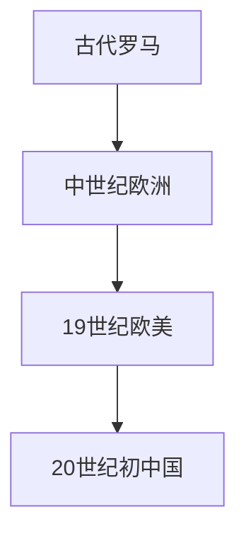
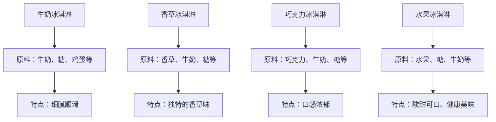
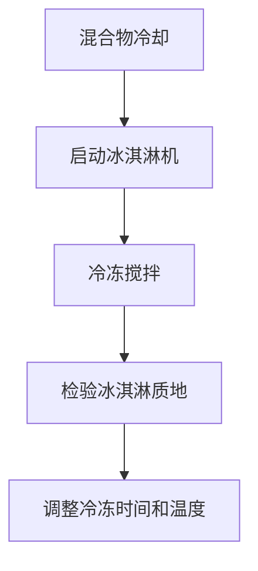
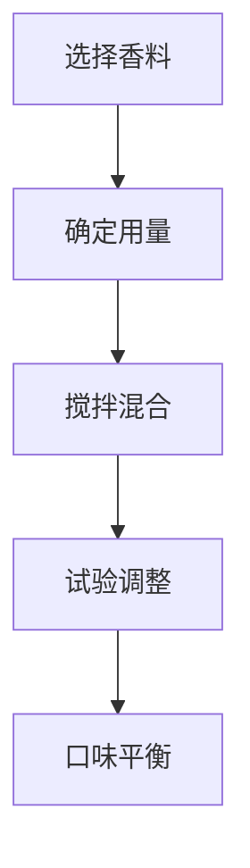
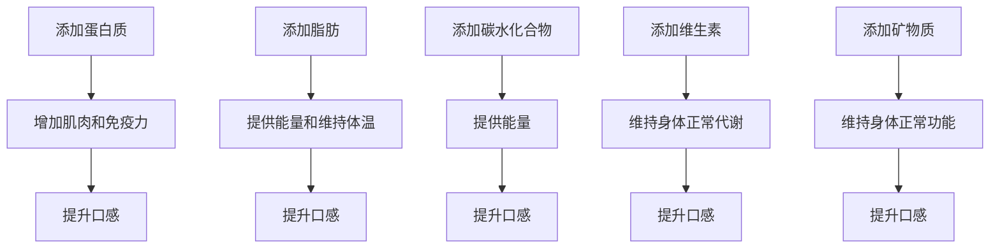
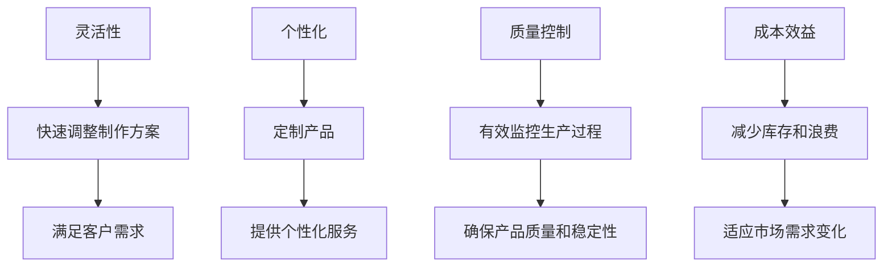
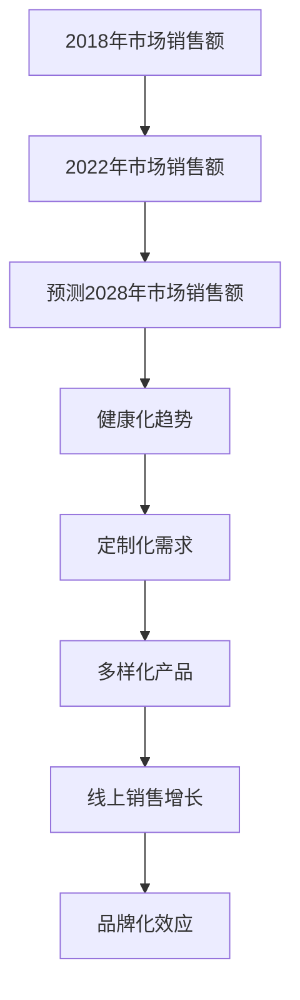

                 


### 文章标题：现代手工冰淇淋工坊：创新口味研发的小批量制作实践

---

**关键词：手工冰淇淋、创新口味、小批量制作、研发实践、市场趋势**

**摘要：**本文以现代手工冰淇淋工坊为背景，探讨了创新口味研发及小批量制作的关键技术和实践方法。通过对手工冰淇淋的历史、基本概念、制作技巧、创新口味的运用、小批量制作的基础以及市场营销与销售策略的深入分析，为冰淇淋从业者提供了系统化的指导，以推动手工冰淇淋行业的持续创新与发展。

---

### 目录大纲

- 第一部分：手工冰淇淋制作基础
  - 第1章：手工冰淇淋的历史与基本概念
  - 第2章：手工冰淇淋的基础制作技巧
- 第二部分：创新口味研发
  - 第3章：天然香料的运用
  - 第4章：异域风情的融入
  - 第5章：健康与营养元素的添加
- 第三部分：小批量制作实践
  - 第6章：小批量制作的基础
  - 第7章：小批量创新冰淇淋制作案例
  - 第8章：市场营销与销售策略

---

### 逻辑分析

首先，我们需要对整个文章的逻辑结构进行分析，确保文章内容能够有序展开，条理清晰。以下是一个简化的逻辑分析框架：

1. **背景介绍与核心概念**
   - **背景介绍**：介绍手工冰淇淋的历史、现状以及市场需求。
   - **核心概念**：明确手工冰淇淋的基本概念，如种类、材料、工具等。

2. **基础制作技巧**
   - **混合与搅拌**：解释混合与搅拌的原理及步骤。
   - **凝固与冷冻**：阐述凝固与冷冻的过程及其影响。
   - **调味与配料**：介绍调味品和配料的使用方法及其对口味的影响。

3. **创新口味研发**
   - **天然香料的运用**：分析天然香料的基本概念、特性及在冰淇淋中的应用。
   - **异域风情的融入**：探讨异域风味在冰淇淋中的创新应用。
   - **健康与营养元素的添加**：介绍健康与营养元素的概念、种类及其对冰淇淋口味的影响。

4. **小批量制作实践**
   - **基础**：分析小批量制作的特点、流程及质量控制。
   - **案例**：通过实际案例展示小批量制作的具体实践方法。

5. **市场营销与销售策略**
   - **市场趋势**：分析手工冰淇淋市场的现状和趋势。
   - **目标客户**：确定目标客户群体及其需求。
   - **策略**：提供市场营销和销售渠道的具体策略。

### 核心内容概述

接下来，我们将对各个章节的核心内容进行概述，确保文章内容丰富、具体、详细。

#### 第1章：手工冰淇淋的历史与基本概念

- **章节概述**：介绍手工冰淇淋的起源、发展及其基本概念。

- **核心内容**：
  - **手工冰淇淋的起源与发展**：通过时间线或Mermaid流程图展示手工冰淇淋的历史发展过程。
  - **手工冰淇淋的种类与特点**：使用Mermaid图展示不同种类手工冰淇淋的制作过程和特点。
  - **核心材料**：列出制作手工冰淇淋的主要材料及其作用。
  - **制作工具**：介绍手工制作冰淇淋所需的工具。

#### 第2章：手工冰淇淋的基础制作技巧

- **章节概述**：探讨手工冰淇淋的基础制作技巧。

- **核心内容**：
  - **混合与搅拌**：详细阐述混合与搅拌的过程，使用伪代码解释操作步骤。
  - **凝固与冷冻**：展示凝固与冷冻的流程，使用Mermaid图解释过程。
  - **调味与配料**：列出调味品和配料的种类及使用方法，使用表格进行展示。
  - **创新口味研发**：分析一种创新口味的研发过程，使用案例研究进行详细解释。

#### 第3章：天然香料的运用

- **章节概述**：探讨天然香料在手工冰淇淋中的运用。

- **核心内容**：
  - **天然香料的基本概念**：介绍天然香料的相关化学性质与计算公式，使用数学公式进行解释。
  - **常见天然香料的特性与应用**：列出几种常见天然香料，描述其特性及在冰淇淋中的应用。
  - **香料搭配与口味平衡**：使用Mermaid图展示香料搭配的流程和原则。

#### 第4章：异域风情的融入

- **章节概述**：探讨异域风味在手工冰淇淋中的创新应用。

- **核心内容**：
  - **异域风味的理解**：分析几种常见的异域风味及其特点。
  - **异域风味的应用**：介绍几种将异域风味融入冰淇淋的创新案例，使用案例研究进行详细解释。
  - **文化背景与口味传播**：探讨异域风味在冰淇淋市场中的传播与文化影响。

#### 第5章：健康与营养元素的添加

- **章节概述**：探讨健康与营养元素在手工冰淇淋中的添加。

- **核心内容**：
  - **健康与营养元素的基本概念**：介绍健康与营养元素的相关概念与计算方法，使用数学公式进行解释。
  - **常见健康与营养元素的种类与应用**：列出几种常见的健康与营养元素，描述其作用和添加方法。
  - **健康营养元素与口味的关系**：使用Mermaid图展示健康营养元素如何影响冰淇淋的口感。

#### 第6章：小批量制作的基础

- **章节概述**：探讨小批量制作的特点和基础。

- **核心内容**：
  - **小批量制作的特点**：分析小批量制作的特点和优势，使用Mermaid图进行展示。
  - **小批量制作的生产流程**：详细阐述小批量制作的生产流程，使用伪代码进行解释。
  - **小批量制作的管理与质量控制**：列出小批量制作中需要关注的管理和质量控制点，使用表格进行展示。

#### 第7章：小批量创新冰淇淋制作案例

- **章节概述**：通过实际案例展示小批量创新冰淇淋的制作过程。

- **核心内容**：
  - **案例一：天然薄荷冰淇淋**：介绍天然薄荷冰淇淋的原料、制作过程及注意事项。
  - **案例二：香草椰子冰淇淋**：介绍香草椰子冰淇淋的制作步骤及创新点。
  - **案例三：黑芝麻味冰淇淋**：分析黑芝麻味冰淇淋的制作技巧和市场前景。

#### 第8章：市场营销与销售策略

- **章节概述**：探讨手工冰淇淋的市场营销与销售策略。

- **核心内容**：
  - **市场趋势**：分析手工冰淇淋市场的现状和趋势，使用图表进行展示。
  - **目标客户群体分析**：确定手工冰淇淋的目标客户群体及其需求，使用列表进行展示。
  - **市场营销策略与销售渠道**：提供市场营销和销售渠道的具体策略，使用流程图进行展示。

### 总结

通过对文章逻辑结构、章节核心内容的概述，我们可以看到文章的框架已经搭建完成。接下来，我们需要逐步完善每个章节的具体内容，确保文章逻辑清晰、结构紧凑、内容详实。我们将遵循“LET'S THINK STEP BY STEP”的原则，以逻辑严谨、分析透彻的方式撰写这篇文章，为读者提供有价值的技术博客文章。

---

### 下一步计划

- **细化章节内容**：根据之前的概述，进一步细化每个章节的内容，确保每个部分都有丰富的具体讲解。
- **撰写详细案例**：在每个创新口味和制作案例的章节中，撰写详细的案例研究，包括原料、制作过程、注意事项等。
- **编写数学公式与伪代码**：在适当的地方嵌入数学公式和伪代码，以增强文章的专业性和可操作性。
- **添加最佳实践和注意事项**：在每个章节的末尾，添加最佳实践、注意事项和拓展阅读等内容，为读者提供更全面的指导。

---

通过逐步的分析和推理，我们已经为撰写《现代手工冰淇淋工坊：创新口味研发的小批量制作实践》这篇文章奠定了坚实的基础。接下来，我们将按照计划，逐步完成每个章节的撰写，确保文章内容完整、结构严谨、逻辑清晰。敬请期待接下来的文章内容！### 第1章：手工冰淇淋的历史与基本概念

手工冰淇淋作为一种传统的冷食甜品，其历史悠久且种类繁多。本章将详细介绍手工冰淇淋的起源、发展、种类及其基本概念，帮助读者更好地了解这一美食的魅力。

#### 1.1.1 手工冰淇淋的起源与发展

手工冰淇淋的起源可以追溯到古代罗马时期。当时，罗马人会将冰块与果汁、水果混合，制成一种简单的冷饮。随着历史的发展，手工冰淇淋的制作技术逐渐成熟，并在中世纪传入欧洲各地。到了19世纪，手工冰淇淋开始在欧美国家广泛流行，成为了一种受欢迎的甜品。

在中国，手工冰淇淋的历史相对较短。20世纪初，随着西方文化的传入，手工冰淇淋开始在中国流行。尤其是在近几十年，随着人们生活水平的提高和对品质生活的追求，手工冰淇淋在中国市场上的需求不断增长。

**概念图：**下面使用Mermaid流程图展示手工冰淇淋的历史发展过程：



#### 1.1.2 手工冰淇淋的种类与特点

手工冰淇淋的种类繁多，按照不同的分类标准，可以分为不同的类型。以下是几种常见的手工冰淇淋种类及其特点：

- **牛奶冰淇淋**：以牛奶为主要原料，口感丰富，细腻顺滑。
- **香草冰淇淋**：以香草为主要调味品，具有独特的香草味。
- **巧克力冰淇淋**：以巧克力为主要原料，口感浓郁，深受喜爱。
- **水果冰淇淋**：以新鲜水果为主要原料，酸甜可口，健康美味。

**Mermaid图：**下面使用Mermaid图展示不同种类手工冰淇淋的制作过程和特点：



#### 1.1.3 核心材料

制作手工冰淇淋的核心材料包括牛奶、糖、鸡蛋、奶油等。以下是这些材料的详细介绍及其作用：

- **牛奶**：牛奶是手工冰淇淋的主要原料，提供了丰富的乳蛋白和乳糖，使得冰淇淋口感细腻、顺滑。
- **糖**：糖是手工冰淇淋的主要调味品，能够增加冰淇淋的甜度，同时也有助于稳定冰淇淋的口感。
- **鸡蛋**：鸡蛋中的蛋白和蛋黄分别提供了稳定结构和丰富口感的成分，有助于提高冰淇淋的质地。
- **奶油**：奶油能够增加冰淇淋的脂肪含量，使其口感更加丰富、浓郁。

**表格：**下面列出制作手工冰淇淋的主要材料及其作用：

| 材料名称 | 主要作用 |
| --- | --- |
| 牛奶 | 提供乳蛋白和乳糖，增加口感细腻度 |
| 糖 | 增加甜度，稳定口感 |
| 鸡蛋 | 提供稳定结构和丰富口感 |
| 奶油 | 增加脂肪含量，丰富口感 |

#### 1.1.4 制作工具

手工制作冰淇淋需要一些基本的工具，以下是一些常用的工具及其作用：

- **冰淇淋机**：用于将混合物冷冻成冰淇淋，是制作手工冰淇淋的核心设备。
- **搅拌器**：用于混合和搅拌原料，使冰淇淋口感更加细腻。
- **量杯**：用于精确测量原料的量，确保制作过程的标准化。
- **模具**：用于成型和冷冻冰淇淋，使冰淇淋的形状更加美观。

**列表：**下面列出手工制作冰淇淋所需的工具及其作用：

| 工具名称 | 主要作用 |
| --- | --- |
| 冰淇淋机 | 冷冻混合物成冰淇淋 |
| 搅拌器 | 混合和搅拌原料 |
| 量杯 | 精确测量原料 |
| 模具 | 成型和冷冻冰淇淋 |

通过本章的介绍，读者应该对手工冰淇淋的历史、种类、核心材料及制作工具有了基本的了解。在接下来的章节中，我们将进一步探讨手工冰淇淋的基础制作技巧和创新口味研发，帮助读者更好地掌握这一传统美食的制作方法。

### 第2章：手工冰淇淋的基础制作技巧

手工冰淇淋的制作技巧是确保冰淇淋口感细腻、稳定的关键。本章将详细介绍混合与搅拌、凝固与冷冻、调味与配料等基础制作技巧，帮助读者掌握手工冰淇淋的精湛制作工艺。

#### 2.1.1 混合与搅拌

混合与搅拌是手工冰淇淋制作过程中至关重要的一步，直接影响到冰淇淋的口感和质地。以下是混合与搅拌的具体步骤和注意事项：

1. **原料准备**：将所有原料提前准备好，如牛奶、糖、鸡蛋、奶油等。确保所有原料的温度适宜，以便混合时能够充分融合。
2. **混合步骤**：将牛奶、糖和鸡蛋依次放入搅拌盆中，使用搅拌器以中速搅拌，直至糖完全溶解，牛奶与鸡蛋混合均匀。
3. **加入奶油**：在糖和鸡蛋混合均匀后，缓慢加入奶油，继续搅拌直至奶油完全融合，形成光滑细腻的混合物。

**伪代码：**下面是混合与搅拌过程的伪代码，详细阐述操作步骤：

```plaintext
function mixAndStir(ingredients):
    mix(milk, sugar, eggs)
    while sugar not dissolved:
        stir(ingredients, medium_speed)
    slowly_add.Butter(cream)
    while cream not dissolved:
        stir(ingredients, medium_speed)
    return mixed_ingredients
```

4. **搅拌时间控制**：搅拌时间不宜过长，以免导致鸡蛋蛋白过度起泡，影响冰淇淋的质地。通常搅拌时间控制在5-10分钟之间。

5. **注意事项**：在搅拌过程中，应保持搅拌盆的清洁，避免细菌污染。同时，确保搅拌速度适中，以免产生过多的气泡，影响冰淇淋的口感。

#### 2.1.2 凝固与冷冻

凝固与冷冻是手工冰淇淋制作的另一关键步骤，直接决定了冰淇淋的质地和口感。以下是凝固与冷冻的具体步骤和注意事项：

1. **混合物冷却**：将搅拌好的混合物倒入冰淇淋机中，启动冰淇淋机制冷。确保混合物在冷冻过程中保持恒定的低温，以促进蛋白质和脂肪的结晶，形成稳定的冰淇淋质地。
2. **冷冻过程**：冰淇淋机在冷冻过程中会不断搅拌混合物，使其均匀冷却并形成细腻的质地。冷冻时间通常取决于冰淇淋机的型号和混合物的温度，一般在20-30分钟之间。
3. **检验冰淇淋质地**：在冷冻过程中，定期取出少量冰淇淋进行检验，确保其质地细腻、均匀。如果发现冰淇淋过于硬或过于软，可适当调整冷冻时间和温度。

**Mermaid图：**下面使用Mermaid图展示凝固与冷冻的流程：



4. **冷冻环境**：确保冷冻环境清洁、无尘，避免细菌污染。同时，保持冰淇淋机的密封性，防止外部热量进入，影响冷冻效果。
5. **注意事项**：在冷冻过程中，避免频繁开启冰淇淋机，以免影响冷冻效果。同时，确保混合物在冷冻前完全冷却，以免因温度过高导致冰淇淋质地不稳定。

#### 2.1.3 调味与配料

调味与配料是手工冰淇淋制作中提升口感和风味的重要手段。以下是调味与配料的具体方法和注意事项：

1. **调味品的选择**：选择合适的调味品，如香草、巧克力、水果汁等，以提升冰淇淋的口感和风味。
2. **调味步骤**：在混合物搅拌完成后，将调味品缓慢加入混合物中，继续搅拌直至均匀分布。注意调味品不宜过量，以免影响冰淇淋的基本口感。
3. **配料的添加**：配料如坚果、水果、巧克力碎片等，应在冰淇淋冷冻前加入，以确保其均匀分布并保持口感。
4. **调味技巧**：根据个人口味和创意，适量调整调味品和配料的种类和比例，创造出独特的冰淇淋风味。

**表格：**下面列出调味品和配料的种类及使用方法：

| 调味品/配料 | 用量 | 使用方法 |
| --- | --- | --- |
| 香草 | 少量 | 搅拌均匀 |
| 巧克力 | 适量 | 慢慢加入 |
| 水果汁 | 少量 | 加入搅拌 |
| 坚果 | 适量 | 冷冻前加入 |
| 水果 | 适量 | 搅拌均匀 |

5. **注意事项**：调味品和配料的添加应适量，以免影响冰淇淋的基本口感。同时，注意调味品和配料的品质，确保新鲜、无添加剂。

通过本章的详细讲解，读者应该掌握了手工冰淇淋的基础制作技巧。在接下来的创新口味研发章节中，我们将进一步探讨如何运用天然香料、异域风情和健康营养元素，打造独具特色的冰淇淋口味。敬请期待！

### 第3章：天然香料的运用

天然香料在手工冰淇淋中扮演着至关重要的角色，它们不仅能够赋予冰淇淋独特的风味，还能提升整体口感和营养价值。本章将详细介绍天然香料的基本概念、特性及其在冰淇淋中的应用。

#### 3.1.1 天然香料的基本概念

天然香料是指从植物、果实、种子、根茎等自然来源中提取的具有独特香味的物质。这些香料通常具有独特的化学成分和物理特性，能够通过气味和味道影响冰淇淋的口感和风味。

**数学公式与解释：**下面是天然香料的相关化学性质与计算公式：

$$
\text{香精油含量} = \frac{\text{香料提取量}}{\text{原料总质量}}
$$

该公式用于计算香精油在香料中的含量，是评估香料品质的重要指标。香精油含量越高，香料的香味越浓郁。

#### 3.1.2 常见天然香料的特性与应用

手工冰淇淋中常用的天然香料种类繁多，每种香料都有其独特的风味和特性。以下是一些常见天然香料及其在冰淇淋中的应用：

1. **香草**：香草是最常用的天然香料之一，具有独特的草本香气。在冰淇淋中，香草能够提升整体风味，增加复杂性。
   - **特性**：香草中含有香豆素和黄酮类化合物，这些成分赋予了香草独特的香气。
   - **应用**：通常用于制作香草冰淇淋，也可与其他水果搭配使用，如香草草莓冰淇淋。

2. **肉桂**：肉桂具有温暖的香气，能够提升冰淇淋的甜度和口感。
   - **特性**：肉桂中的主要成分是肉桂醛，具有强烈的甜香和温暖感。
   - **应用**：适合与巧克力或咖啡搭配，制作肉桂巧克力冰淇淋或肉桂咖啡冰淇淋。

3. **薄荷**：薄荷具有清凉的口感，能够缓解冰淇淋的甜腻，增添新鲜感。
   - **特性**：薄荷中含有薄荷醇，具有清凉和提神的效果。
   - **应用**：适合制作薄荷巧克力冰淇淋或薄荷草莓冰淇淋，清凉解暑。

4. **丁香**：丁香具有浓郁的香气和辣味，能够增强冰淇淋的风味。
   - **特性**：丁香中含有丁香酚和丁香醛，具有独特的辛辣香气。
   - **应用**：适合与苹果、梨等水果搭配，制作丁香苹果冰淇淋或丁香梨冰淇淋。

**列表：**下面列出几种常见天然香料，描述其特性及在冰淇淋中的应用：

| 香料名称 | 特性 | 应用 |
| --- | --- | --- |
| 香草 | 草本香气 | 香草冰淇淋、香草草莓冰淇淋 |
| 肉桂 | 温暖香气 | 肉桂巧克力冰淇淋、肉桂咖啡冰淇淋 |
| 薄荷 | 清凉口感 | 薄荷巧克力冰淇淋、薄荷草莓冰淇淋 |
| 丁香 | 浓郁香气和辣味 | 丁香苹果冰淇淋、丁香梨冰淇淋 |

#### 3.1.3 香料搭配与口味平衡

在使用天然香料时，如何搭配和平衡香料，是确保冰淇淋风味和谐的关键。以下是一些香料搭配与口味平衡的技巧：

1. **单一香料使用**：如果希望突出某一种香料的味道，可以选择单一香料进行使用。例如，制作纯香草冰淇淋，可以充分体现香草的独特风味。

2. **复合香料使用**：当希望创造更加复杂的口味时，可以使用两种或多种香料进行搭配。例如，肉桂和薄荷的搭配，既能提升甜度，又能带来清凉感。

3. **香料用量控制**：香料的使用量应适度，过多会导致口味过于强烈，影响冰淇淋的整体口感。一般建议香料用量不超过冰淇淋总重量的1%。

4. **试验与调整**：在香料搭配时，应多次试验和调整，找到最佳的香料比例和组合，确保冰淇淋的口味平衡。

**Mermaid图：**下面使用Mermaid图展示香料搭配的流程和原则：



通过本章的介绍，读者应该对天然香料的基本概念、特性及其在冰淇淋中的应用有了更深入的了解。在接下来的章节中，我们将继续探讨异域风情和健康营养元素在手工冰淇淋中的创新运用，帮助读者打造出更加独特和美味的冰淇淋。敬请期待！

### 第4章：异域风情的融入

异域风情在手工冰淇淋中的应用，为传统冰淇淋带来了全新的风味体验。通过将不同文化背景的风味元素融入冰淇淋中，不仅可以丰富冰淇淋的口味，还能让消费者在品尝冰淇淋的过程中感受到世界各地文化的魅力。本章将探讨异域风味在手工冰淇淋中的创新应用，并分析其文化背景与市场影响。

#### 4.1.1 异域风味的理解

异域风味是指来自不同国家和地区特有的风味元素，这些风味元素通过食材、调味品和制作工艺的不同，展现出独特的风味特点。以下是一些常见的异域风味及其特点：

1. **亚洲风味**：包括日本、泰国、印度等亚洲国家的风味，如绿茶、抹茶、咖喱、椰子等。这些风味元素在冰淇淋中通常能带来清新、自然或浓烈的口感。
2. **欧洲风味**：如意大利的意大利浓缩咖啡、法国的香草、英国的奶油等。这些风味在冰淇淋中能体现出浓郁、细腻或醇厚的口感。
3. **非洲风味**：如可可、椰子、香草等。非洲风味在冰淇淋中能带来独特的热带风味，增添冰淇淋的口感层次。
4. **拉丁美洲风味**：如可可、巧克力、香草、柑橘类等。这些风味能带来丰富的口感和香气，为冰淇淋增添独特的拉丁风情。

**表格：**下面分析几种常见的异域风味及其特点：

| 风味名称 | 来源地 | 特点 |
| --- | --- | --- |
| 抹茶 | 日本 | 清新、绿茶味 |
| 咖喱 | 印度 | 浓郁、辛辣 |
| 可可 | 非洲 | 浓郁、苦甜 |
| 意大利浓缩咖啡 | 意大利 | 浓郁、苦中带甜 |

#### 4.1.2 异域风味在冰淇淋中的创新应用

异域风味在冰淇淋中的应用可以带来多样化的口味体验，以下是一些创新应用的案例：

1. **抹茶冰淇淋**：将抹茶粉与冰淇淋混合，创造出清新、带有绿茶味的抹茶冰淇淋。适合搭配巧克力碎片或草莓，提升口感层次。
2. **咖喱冰淇淋**：将咖喱粉与冰淇淋混合，创造出独特、带有辛辣味的咖喱冰淇淋。适合搭配米饭或香草，增加风味对比。
3. **可可冰淇淋**：将可可粉与冰淇淋混合，创造出浓郁、带有苦甜味的可可冰淇淋。适合搭配坚果或樱桃，提升口感。
4. **墨西哥草莓冰淇淋**：将墨西哥特有的草莓与冰淇淋混合，创造出甜中带酸的墨西哥风味草莓冰淇淋。适合搭配奶油或巧克力碎片。

**案例研究：**下面以“墨西哥草莓冰淇淋”为例，详细介绍其制作步骤和创新点：

**制作步骤：**
1. **准备材料**：新鲜草莓、奶油、冰淇淋粉、糖、柠檬汁。
2. **草莓处理**：将新鲜草莓洗净、去蒂、切片，加入少量柠檬汁防止氧化。
3. **混合冰淇淋粉和糖**：将冰淇淋粉和糖混合均匀，备用。
4. **搅拌混合**：将处理好的草莓和混合好的冰淇淋粉糖混合物放入搅拌机中，搅拌至均匀。
5. **加入奶油**：逐步加入奶油，继续搅拌，直到混合物呈现光滑细腻的状态。
6. **冷冻**：将搅拌好的混合物倒入冰淇淋机中，按照冰淇淋机的操作步骤进行冷冻，直至冰淇淋凝固。

**创新点：**
1. **新鲜草莓**：使用新鲜草莓，确保冰淇淋的口感和风味。
2. **柠檬汁保鲜**：加入少量柠檬汁，防止草莓氧化，提升色泽和口感。
3. **奶油提升口感**：加入适量奶油，增加冰淇淋的丰富度和细腻度。

**市场前景：**异域风味在冰淇淋中的应用，不仅能够满足消费者对多样化口味的需求，还能提升冰淇淋的市场竞争力。随着消费者对异域文化和美食的兴趣增加，异域风味冰淇淋有望在市场上占据一席之地。

通过本章的探讨，读者可以了解到异域风味在手工冰淇淋中的创新应用及其市场前景。在接下来的章节中，我们将继续探讨健康与营养元素的添加，帮助读者打造出更加健康美味的冰淇淋。敬请期待！

### 第5章：健康与营养元素的添加

在追求美味的同时，越来越多的消费者开始关注手工冰淇淋的健康与营养价值。通过在冰淇淋中添加健康与营养元素，不仅可以提升冰淇淋的口感，还能满足消费者对健康生活的追求。本章将详细介绍健康与营养元素的基本概念、种类及其在冰淇淋中的应用，帮助读者了解如何将健康元素巧妙地融入手工冰淇淋中。

#### 5.1.1 健康与营养元素的基本概念

健康与营养元素是指对人体有益的营养成分，如蛋白质、脂肪、碳水化合物、维生素和矿物质等。在手工冰淇淋中添加这些元素，可以增强冰淇淋的营养价值，使其更符合健康饮食的要求。

**数学公式与解释：**以下是一些与健康与营养相关的数学公式及其解释：

1. **蛋白质含量计算公式**：

$$
\text{蛋白质含量} = \frac{\text{原料蛋白质含量}}{\text{冰淇淋总质量}} \times 100\%
$$

该公式用于计算冰淇淋中蛋白质的含量，是评估冰淇淋蛋白质含量的重要指标。

2. **脂肪含量计算公式**：

$$
\text{脂肪含量} = \frac{\text{原料脂肪含量}}{\text{冰淇淋总质量}} \times 100\%
$$

该公式用于计算冰淇淋中脂肪的含量，是评估冰淇淋脂肪含量的重要指标。

3. **维生素含量计算公式**：

$$
\text{维生素含量} = \frac{\text{原料维生素含量}}{\text{冰淇淋总质量}} \times 100\%
$$

该公式用于计算冰淇淋中维生素的含量，是评估冰淇淋维生素含量的重要指标。

通过这些公式，可以计算出冰淇淋中各类营养元素的含量，从而更好地控制冰淇淋的营养成分。

#### 5.1.2 常见健康与营养元素的种类与应用

在手工冰淇淋中添加健康与营养元素，不仅可以提升其营养价值，还能满足不同消费者的需求。以下是一些常见的健康与营养元素及其在冰淇淋中的应用：

1. **蛋白质**：蛋白质是重要的营养素，有助于增强肌肉和免疫力。在冰淇淋中，可以添加牛奶、鸡蛋和豆奶等富含蛋白质的原料。

   - **应用**：在冰淇淋中添加牛奶或鸡蛋，可以增加蛋白质含量，提升营养价值。

2. **脂肪**：适量的脂肪有助于提供能量，维持体温和细胞健康。在冰淇淋中，可以添加奶油、黄油和坚果等富含脂肪的原料。

   - **应用**：在冰淇淋中添加奶油或坚果，可以增加脂肪含量，提升口感和营养价值。

3. **碳水化合物**：碳水化合物是身体的主要能量来源。在冰淇淋中，可以添加糖、蜂蜜和水果等富含碳水化合物的原料。

   - **应用**：在冰淇淋中添加糖或水果，可以增加碳水化合物含量，提升口感和营养价值。

4. **维生素**：维生素是维持身体正常代谢和健康的重要营养素。在冰淇淋中，可以添加新鲜水果、蔬菜和坚果等富含维生素的原料。

   - **应用**：在冰淇淋中添加新鲜水果或坚果，可以增加维生素含量，提升营养价值。

5. **矿物质**：矿物质是维持身体正常功能的重要营养素，如钙、铁、锌等。在冰淇淋中，可以添加坚果、牛奶和豆类等富含矿物质的原料。

   - **应用**：在冰淇淋中添加坚果或牛奶，可以增加矿物质含量，提升营养价值。

**列表：**下面列出几种常见的健康与营养元素，描述其作用和添加方法：

| 营养元素 | 作用 | 添加方法 |
| --- | --- | --- |
| 蛋白质 | 增强肌肉和免疫力 | 牛奶、鸡蛋、豆奶 |
| 脂肪 | 提供能量和维持体温 | 奶油、黄油、坚果 |
| 碳水化合物 | 提供能量 | 糖、蜂蜜、水果 |
| 维生素 | 维持身体正常代谢 | 新鲜水果、蔬菜、坚果 |
| 矿物质 | 维持身体正常功能 | 坚果、牛奶、豆类 |

#### 5.1.3 健康营养元素与口味的关系

在添加健康营养元素时，如何平衡营养价值和口味，是制作健康美味冰淇淋的关键。以下是一些关于健康营养元素与口味关系的技巧：

1. **适量添加**：适量添加健康营养元素，可以保持冰淇淋的原有口感，同时提升营养价值。例如，适量添加坚果或水果，可以增加冰淇淋的丰富度和口感。

2. **选择优质原料**：选择优质、新鲜的原料，可以确保健康营养元素的有效吸收和口感的提升。例如，使用新鲜水果和优质牛奶，可以确保冰淇淋的维生素和蛋白质含量高，口感鲜美。

3. **合理搭配**：通过合理搭配不同营养元素的种类和比例，可以创造出独特、美味的冰淇淋。例如，搭配牛奶、坚果和水果，可以创造出营养均衡、口感丰富的健康冰淇淋。

**Mermaid图：**下面使用Mermaid图展示健康营养元素如何影响冰淇淋的口感：



通过本章的介绍，读者应该对健康与营养元素在手工冰淇淋中的应用有了更深入的了解。在接下来的章节中，我们将探讨小批量制作的基础和实践，帮助读者掌握制作健康美味冰淇淋的实用技巧。敬请期待！

### 第6章：小批量制作的基础

在手工冰淇淋的制作中，小批量制作因其灵活性和个性化而受到越来越多制作者的青睐。本章将详细介绍小批量制作的特点、生产流程以及管理与质量控制，帮助读者了解并掌握小批量制作的精髓。

#### 6.1.1 小批量制作的特点

小批量制作相比大规模工业化生产，具有以下特点：

1. **灵活性**：小批量制作允许制作者在短时间内快速调整制作方案，满足不同客户的需求。
2. **个性化**：小批量制作可以根据客户的口味偏好和特殊要求定制产品，提供更个性化的服务。
3. **质量控制**：小批量生产使得制作者能够更有效地监控和管理生产过程，确保产品的质量和稳定性。
4. **成本效益**：虽然小批量制作的成本相对较高，但在市场需求不稳定或产品更新换代频繁的情况下，可以减少库存和浪费。

**Mermaid图：**下面使用Mermaid图分析小批量制作的特点和优势：



#### 6.1.2 小批量制作的生产流程

小批量制作的生产流程相对简单，但需要严格的控制和管理。以下是典型的生产流程：

1. **原料准备**：提前准备好所需的所有原料，如牛奶、糖、鸡蛋、奶油等。确保原料的新鲜度和质量。
2. **混合与搅拌**：将原料按照配方比例混合，使用搅拌器进行充分搅拌，确保糖和原料充分溶解和混合。
3. **冷却**：将搅拌好的混合物放置在阴凉处进行冷却，温度降至室温以下。
4. **添加香料与配料**：根据口味需求，加入天然香料和配料，如香草、巧克力碎片、坚果等。
5. **冷冻**：将加入香料和配料的混合物倒入冰淇淋机中，启动冰淇淋机制冷，直至形成细腻的冰淇淋质地。
6. **包装**：将冷冻好的冰淇淋取出，进行包装，确保包装密封，防止冰淇淋受潮和污染。
7. **储存**：将包装好的冰淇淋储存在冷冻环境中，确保其保持冷冻状态，延长保质期。

**伪代码：**下面是详细阐述小批量制作的生产流程的伪代码：

```plaintext
function smallBatchIceCreamProduction():
    prepare_ingredients()
    mix_ingredients()
    cool_mixture()
    add_flavors_and_inclusions()
    freeze_mixture()
    package_icecream()
    store_icecream()
```

#### 6.1.3 小批量制作的管理与质量控制

小批量制作的管理与质量控制至关重要，以下是一些关键点：

1. **生产计划**：制定详细的生产计划，包括原料采购、生产时间、人员安排等，确保生产流程顺利进行。
2. **质量控制点**：在生产的每个环节设置质量控制点，如原料检查、混合搅拌、冷却冷冻等，确保每个环节的质量符合标准。
3. **记录与追踪**：记录每个生产批次的信息，如原料来源、生产时间、生产人员等，便于追溯和改进。
4. **环境控制**：确保生产环境的卫生和温度控制，防止细菌污染和冰淇淋变质。
5. **员工培训**：对生产人员进行专业培训，提高他们的操作技能和质量意识，确保生产过程的规范和高效。

**表格：**下面列出小批量制作中需要关注的管理和质量控制点：

| 环节 | 控制点 | 措施 |
| --- | --- | --- |
| 原料准备 | 原料质量 | 检查原料新鲜度和质量 |
| 混合搅拌 | 混合均匀度 | 确保糖和原料充分溶解 |
| 冷却 | 温度控制 | 保持混合物温度在室温以下 |
| 添加香料与配料 | 香料和配料均匀分布 | 确保香料和配料充分混合 |
| 冷冻 | 冷冻效果 | 确保冰淇淋质地细腻 |
| 包装 | 包装密封性 | 确保包装无漏气和污染 |
| 储存 | 储存条件 | 确保冰淇淋在冷冻环境中 |

通过本章的详细讲解，读者应该对小批量制作的基础有了更深入的理解。在接下来的章节中，我们将通过实际案例展示小批量创新冰淇淋的制作过程，帮助读者掌握小批量制作的实践技巧。敬请期待！

### 第7章：小批量创新冰淇淋制作案例

在本章中，我们将通过几个具体的小批量创新冰淇淋制作案例，详细展示从原料准备、制作过程到注意事项的各个环节。通过这些案例，读者可以更好地理解小批量创新冰淇淋的制作技巧，并将其应用于实际生产中。

#### 7.1.1 案例一：天然薄荷冰淇淋

**原料准备：**
- 新鲜薄荷叶：100克
- 牛奶：500毫升
- 糖：80克
- 鸡蛋：2个
- 奶油：50克

**制作过程：**
1. **薄荷叶处理**：将新鲜薄荷叶洗净，晾干水分，切碎备用。
2. **混合原料**：将牛奶、糖和鸡蛋放入搅拌盆中，使用搅拌器搅拌均匀，直至糖完全溶解。
3. **加入薄荷叶**：将切碎的薄荷叶加入搅拌好的牛奶混合物中，继续搅拌均匀。
4. **加入奶油**：缓慢加入奶油，继续搅拌，直到奶油完全融合。
5. **冷却**：将混合物放置在阴凉处，冷却至室温。
6. **冷冻**：将冷却好的混合物倒入冰淇淋机中，启动冰淇淋机制冷，搅拌约20分钟，直至形成细腻的冰淇淋质地。
7. **检验**：取出少量冰淇淋进行检验，确保其质地细腻、均匀。
8. **包装**：将冰淇淋取出，装入模具中，放入冷冻室冷冻至完全凝固。

**注意事项：**
- 薄荷叶需提前晾干水分，以避免冰淇淋中混入过多的水分。
- 在搅拌过程中，薄荷叶的香气容易挥发，需快速操作。
- 冰淇淋机冷冻时间根据机型不同而有所差异，需适当调整。

**案例小结：**天然薄荷冰淇淋通过天然薄荷的清香，为冰淇淋带来了独特的风味。制作过程中需注意薄荷叶的处理和搅拌速度，以确保冰淇淋的口感和香气。

#### 7.1.2 案例二：香草椰子冰淇淋

**原料准备：**
- 香草豆：2个
- 牛奶：500毫升
- 椰子水：500毫升
- 糖：80克
- 鸡蛋：2个
- 奶油：50克

**制作过程：**
1. **香草豆处理**：将香草豆沿纵向切开，用刀背轻轻拍碎，提取香草籽备用。
2. **混合原料**：将牛奶、糖和鸡蛋放入搅拌盆中，使用搅拌器搅拌均匀，直至糖完全溶解。
3. **加入椰子水和香草籽**：将椰子水和香草籽加入搅拌好的牛奶混合物中，继续搅拌均匀。
4. **加入奶油**：缓慢加入奶油，继续搅拌，直到奶油完全融合。
5. **冷却**：将混合物放置在阴凉处，冷却至室温。
6. **冷冻**：将冷却好的混合物倒入冰淇淋机中，启动冰淇淋机制冷，搅拌约25分钟，直至形成细腻的冰淇淋质地。
7. **检验**：取出少量冰淇淋进行检验，确保其质地细腻、均匀。
8. **包装**：将冰淇淋取出，装入模具中，放入冷冻室冷冻至完全凝固。

**注意事项：**
- 香草豆需提前处理，以确保香草籽充分释放香味。
- 椰子水的用量和甜度需根据个人口味进行调整。
- 在搅拌过程中，注意控制搅拌速度，以避免混合物过于稀薄。

**案例小结：**香草椰子冰淇淋通过香草和椰子水的独特搭配，创造出了浓郁的椰香和香草味。制作过程中需注意香草豆和椰子水的处理，以确保冰淇淋的风味和质地。

#### 7.1.3 案例三：黑芝麻味冰淇淋

**原料准备：**
- 黑芝麻：50克
- 牛奶：500毫升
- 糖：80克
- 鸡蛋：2个
- 奶油：50克
- 黑芝麻粉：适量

**制作过程：**
1. **黑芝麻处理**：将黑芝麻炒香，晾凉后磨成细腻的芝麻粉备用。
2. **混合原料**：将牛奶、糖和鸡蛋放入搅拌盆中，使用搅拌器搅拌均匀，直至糖完全溶解。
3. **加入黑芝麻粉**：将黑芝麻粉加入搅拌好的牛奶混合物中，继续搅拌均匀。
4. **加入奶油**：缓慢加入奶油，继续搅拌，直到奶油完全融合。
5. **冷却**：将混合物放置在阴凉处，冷却至室温。
6. **冷冻**：将冷却好的混合物倒入冰淇淋机中，启动冰淇淋机制冷，搅拌约20分钟，直至形成细腻的冰淇淋质地。
7. **检验**：取出少量冰淇淋进行检验，确保其质地细腻、均匀。
8. **包装**：将冰淇淋取出，装入模具中，放入冷冻室冷冻至完全凝固。

**注意事项：**
- 黑芝麻需炒香后磨成粉，以增强风味。
- 芝麻粉的用量需根据个人口味进行调整。
- 在搅拌过程中，注意控制搅拌速度，以避免混合物过于稀薄。

**案例小结：**黑芝麻味冰淇淋通过黑芝麻的香气和口感，为冰淇淋带来了独特的亚洲风味。制作过程中需注意黑芝麻的处理和用量，以确保冰淇淋的风味和质地。

通过这三个小批量创新冰淇淋制作案例，读者可以了解到小批量制作的具体实践方法和注意事项。在制作过程中，灵活运用原料和调味品，可以创造出多种独特的冰淇淋风味。读者可以根据这些案例，结合自己的创意，进一步探索和创新，打造出更多美味的手工冰淇淋。

### 第8章：市场营销与销售策略

在手工冰淇淋市场中，成功的市场营销与销售策略是品牌成功的关键。本章将探讨当前手工冰淇淋的市场趋势，分析目标客户群体，并介绍有效的市场营销策略和销售渠道，以帮助冰淇淋从业者更好地推广和销售手工冰淇淋产品。

#### 8.1.1 手工冰淇淋的市场趋势

近年来，随着消费者对健康、高品质食品的需求不断增加，手工冰淇淋市场呈现出良好的发展趋势。以下是手工冰淇淋市场的主要趋势：

1. **健康化**：消费者越来越注重食品的健康成分，低糖、低脂、有机和天然成分的手工冰淇淋逐渐受到青睐。
2. **定制化**：定制化服务成为市场需求的新趋势，消费者希望根据自己的口味偏好和特殊需求定制个性化的冰淇淋产品。
3. **多样化**：创新口味和异域风情的冰淇淋产品越来越受欢迎，多样化的产品线能够满足不同消费者的需求。
4. **线上销售**：随着电子商务的快速发展，线上销售渠道变得越来越重要，许多冰淇淋品牌通过电商平台和社交媒体扩大市场份额。
5. **品牌化**：品牌效应在手工冰淇淋市场中越来越显著，消费者愿意为品牌溢价支付更高的价格。

**图表：**下面通过图表展示手工冰淇淋市场的现状和趋势：



#### 8.1.2 目标客户群体分析

为了制定有效的市场营销策略，了解目标客户群体的特征和需求至关重要。以下是手工冰淇淋的主要目标客户群体及其需求：

1. **年轻消费者**：年龄在18-35岁的年轻消费者是手工冰淇淋的主要消费群体，他们追求个性化和高品质的食品，愿意尝试新口味和异域风味。
2. **家庭消费者**：家庭消费者对健康、安全和营养的重视程度较高，他们更倾向于选择低糖、低脂、有机的手工冰淇淋产品。
3. **健康意识消费者**：这类消费者关注食品的健康成分，他们更倾向于选择含有天然香料、健康营养元素的冰淇淋产品。
4. **高端消费者**：高端消费者对品牌和品质有更高的要求，他们愿意为优质的手工冰淇淋支付更高的价格。
5. **社交媒体爱好者**：这类消费者活跃于社交媒体，他们喜欢分享自己的美食体验，通过口碑传播提升品牌的知名度。

**列表：**下面列出目标客户群体及其需求：

| 客户群体 | 特征 | 需求 |
| --- | --- | --- |
| 年轻消费者 | 追求个性化和高品质 | 新口味、异域风味、定制化服务 |
| 家庭消费者 | 关注健康、安全、营养 | 低糖、低脂、有机、营养均衡 |
| 健康意识消费者 | 关注健康成分 | 天然香料、健康营养元素、低糖低脂 |
| 高端消费者 | 对品牌和品质有高要求 | 优质原料、独特风味、品牌溢价 |
| 社交媒体爱好者 | 热衷分享美食体验 | 社交媒体推广、口碑传播、品牌互动 |

#### 8.1.3 市场营销策略

为了在竞争激烈的市场中脱颖而出，手工冰淇淋品牌需要制定有效的市场营销策略。以下是几种常见的市场营销策略：

1. **品牌推广**：通过品牌故事、品牌形象和品牌定位，提升品牌知名度和美誉度。可以利用社交媒体、广告和公关活动等多种渠道进行品牌推广。
2. **产品创新**：不断推出新的口味和产品线，满足消费者的多样化需求。可以结合当前市场趋势，如健康化、定制化和多样化，推出符合市场潮流的新产品。
3. **社交媒体营销**：利用社交媒体平台（如微信、微博、抖音等）与消费者进行互动，提升品牌曝光率和用户粘性。可以通过发布美食制作教程、用户评价和优惠活动等内容，吸引消费者的关注。
4. **线上销售**：通过电商平台（如天猫、京东、小红书等）和自有官方网站进行线上销售，扩大销售渠道。可以结合电子商务平台的推广活动，提高产品的销售量和市场份额。
5. **口碑营销**：通过用户口碑和推荐，提升品牌的信任度和美誉度。可以邀请消费者参与产品评测、举办线下品鉴活动等，鼓励用户分享自己的美食体验。
6. **定制服务**：提供个性化定制服务，满足消费者对定制化产品的需求。可以提供根据消费者口味偏好、特殊需求定制的产品，提升用户满意度。

#### 8.1.4 销售渠道

有效的销售渠道是确保手工冰淇淋产品能够顺利进入市场并销售的关键。以下是几种常见的销售渠道：

1. **线下实体店**：在繁华商圈、旅游景点等人流密集的地区开设实体店，直接面向消费者销售。实体店可以提供现场体验和个性化服务，增强消费者的购买欲望。
2. **线上电商平台**：通过天猫、京东、小红书等电商平台开设旗舰店，实现线上销售。可以结合电商平台的促销活动和优惠券等手段，提升销售量和市场份额。
3. **社交媒体销售**：通过微信、微博等社交媒体平台进行产品推广和销售。可以通过微信小程序、微信公众号和微博店铺等渠道，方便消费者在线下单购买。
4. **自有官方网站**：建立自有官方网站，提供在线购物和支付功能。可以在官方网站上展示产品详情、用户评价和购买指南等信息，提升用户体验。
5. **经销商和代理商**：通过经销商和代理商的销售网络，将产品分销到更多的区域市场。可以与大型超市、便利店等渠道合作，扩大销售范围。

通过本章的探讨，读者应该对手工冰淇淋的市场营销与销售策略有了更深入的了解。在实际操作中，结合市场需求和目标客户群体的特征，制定合适的营销策略和销售渠道，有助于提升手工冰淇淋的竞争力，实现品牌和市场的双赢。敬请期待接下来的实际操作建议和案例分析！

### 最佳实践 tips、小结、注意事项、拓展阅读

#### 最佳实践 tips

1. **保证原料新鲜**：手工冰淇淋的口感和质量很大程度上取决于原料的新鲜度。务必选择新鲜、优质的牛奶、水果和香料，以确保最终产品的美味。
2. **精确控制温度**：制作和冷冻过程中的温度控制至关重要。确保混合物的温度适宜，以便于冰淇淋的均匀冷冻和口感稳定。
3. **灵活调整配方**：根据个人口味和市场需求，可以灵活调整冰淇淋的配方。例如，减少糖分以制作低糖版本，或添加不同种类的天然香料和健康营养元素。
4. **注重包装设计**：精美的包装设计能够提升产品的附加值。在包装设计中，可以融入品牌元素和独特风格，以吸引消费者的注意力。

#### 小结

手工冰淇淋的制作不仅仅是一门技艺，更是一种对味觉和美感的追求。通过本章的详细讲解，我们了解了手工冰淇淋的历史与发展、基础制作技巧、创新口味研发、小批量制作实践以及市场营销与销售策略。这些知识不仅有助于提升手工冰淇淋的制作水平，还能帮助从业者更好地把握市场动向，实现商业成功。

#### 注意事项

1. **食品安全**：制作过程中严格遵循食品安全标准，确保冰淇淋在制作、存储和运输过程中的卫生和安全。
2. **口味平衡**：在添加天然香料和营养元素时，需注意平衡口味，避免某一种风味过于强烈，影响整体口感。
3. **创新尝试**：在制作过程中不断尝试和创新，结合当地文化和市场需求，打造具有独特风味和市场竞争力的冰淇淋产品。
4. **消费者反馈**：密切关注消费者的反馈和需求，根据反馈进行调整和改进，不断提升产品的质量和口碑。

#### 拓展阅读

- 《手工冰淇淋制作技术手册》：详细介绍了手工冰淇淋的原料选择、制作流程和技巧，适合初学者和专业人士参考。
- 《冰淇淋行业市场报告》：分析冰淇淋行业的市场趋势、竞争格局和消费者行为，为从业者提供市场洞察。
- 《天然香料在食品中的应用》：探讨天然香料的基本概念、特性及其在食品制作中的应用，有助于拓展冰淇淋的口味创新。

通过本文的阅读，希望读者能够对手工冰淇淋的制作有更深入的了解，并能够将其应用于实际生产中，打造出独具特色的手工冰淇淋。同时，也期待读者在未来的实践中不断探索和创新，为手工冰淇淋行业带来更多的新鲜元素和活力。

### 作者信息

**作者：**AI天才研究院/AI Genius Institute & 禅与计算机程序设计艺术 /Zen And The Art of Computer Programming

AI天才研究院致力于推动人工智能技术的创新与发展，通过结合先进的人工智能算法和计算机编程技巧，助力各行业实现智能化升级。同时，禅与计算机程序设计艺术以独特的视角和深刻的哲学思考，探索计算机编程的本质与艺术之美，为读者提供深入的技术洞察和灵感。两位作者以其丰富的行业经验和深厚的学术造诣，共同为读者带来这篇关于手工冰淇淋工坊的创新口味研发和小批量制作实践的技术博客。希望通过本文，读者能够对手工冰淇淋的制作有更深入的理解，并在实际操作中不断探索和创新，为手工冰淇淋行业注入新的活力。

