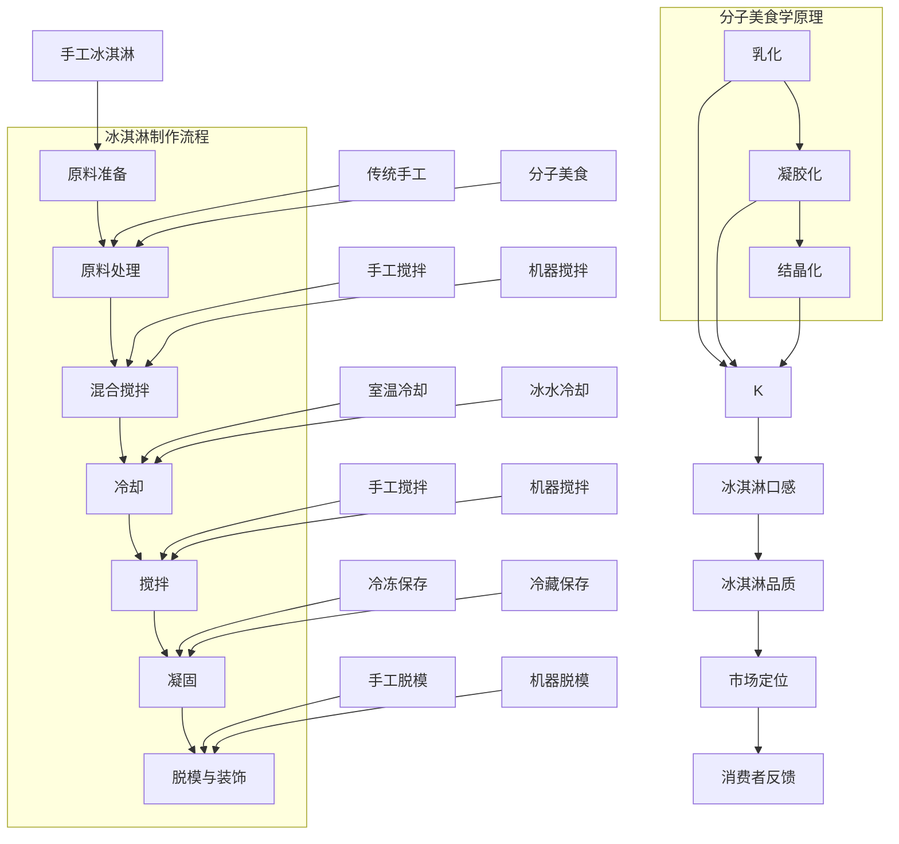

                 

### 引言：现代手工冰淇淋的兴起与分子美食学的融合

#### 现代手工冰淇淋的兴起

现代手工冰淇淋作为甜点领域的璀璨明珠，近年来在全球范围内迅速崛起。其独特的手工制作工艺和多样化的口味，满足了现代消费者对高品质、个性化食品的需求。现代手工冰淇淋的制作工艺与传统工业化生产有显著区别，它强调手工制作、食材新鲜和定制化服务。

1. **手工制作**：现代手工冰淇淋的制作过程强调手工技艺，从原料挑选到冰淇淋的搅拌、凝固，每一个环节都需要手工操作，保证了冰淇淋的高品质和独特风味。
2. **食材新鲜**：现代手工冰淇淋使用新鲜的原料，确保了冰淇淋的口感和营养价值。相比于工业化生产，手工冰淇淋能够更好地保留食材的原汁原味。
3. **定制化服务**：现代手工冰淇淋可以根据消费者的口味和需求进行定制，提供个性化的服务体验。

#### 分子美食学的核心概念

分子美食学，是一门结合了化学、物理学和烹饪学的交叉学科，通过科学的方法来研究和改进食物的口感和质地。分子美食学的核心原理包括乳化、凝胶化和结晶化等，这些原理在冰淇淋制作中得到了广泛应用。

1. **乳化**：乳化是指将两种不相溶的液体混合在一起，形成稳定的混合物。在冰淇淋制作中，乳化剂如卵磷脂和单甘酯被用来稳定脂肪和水的混合，提高冰淇淋的口感和质地。
2. **凝胶化**：凝胶化是指将液体转化为半固体的过程。在冰淇淋制作中，凝胶剂如明胶和果胶被用来稳定冰淇淋的质地，防止其融化。
3. **结晶化**：结晶化是指控制冰晶的形成过程，以获得不同口感的冰淇淋。通过控制结晶化过程，可以调整冰淇淋的口感和质地，使其更加细腻或富有弹性。

#### 现代手工冰淇淋与分子美食学的融合

现代手工冰淇淋与分子美食学的融合，为冰淇淋制作带来了全新的可能性。通过分子美食学的原理，现代手工冰淇淋不仅能够保持传统手工冰淇淋的高品质和独特风味，还可以创造出全新的口感和质地。

1. **口感创新**：分子美食学的乳化、凝胶化和结晶化原理，使得现代手工冰淇淋在口感上更加丰富多样。例如，通过控制结晶化过程，可以制作出口感细腻的软冰淇淋或富有弹性的硬冰淇淋。
2. **质地改良**：分子美食学的原理可以帮助改良冰淇淋的质地，使其更加稳定、不易融化。这对于需要长时间保持稳定的商业冰淇淋制作尤为重要。
3. **营养提升**：通过分子美食学的应用，现代手工冰淇淋可以更科学地添加营养成分，提高其营养价值。

总之，现代手工冰淇淋的兴起与分子美食学的融合，为冰淇淋制作带来了新的发展方向，也为消费者带来了更多样化的口感体验。在接下来的章节中，我们将深入探讨手工冰淇淋的基础知识、分子美食学原理及其在冰淇淋制作中的应用，以及如何设计冰淇淋的口味和成分。通过这些内容，读者将能够全面了解现代手工冰淇淋的科学原理和实践方法。

### 第1章：手工冰淇淋的基础

#### 1.1 冰淇淋的起源与历史发展

冰淇淋作为全球范围内广受欢迎的甜点，其起源可以追溯到古代文明。最早的冰淇淋制作方法可追溯至公元前的中国，当时的冰食多以冰块和果料制成。大约在公元300年，中国南北朝时期的《食珍录》中，首次记载了用果汁和牛奶混合冰冻的方法制作冰淇淋。与此同时，在古罗马，冰淇淋也以奢华食品的身份出现在贵族的宴会上。

随着时间的推移，冰淇淋的制作工艺逐渐成熟。公元9世纪，阿拉伯人发明了通过将果汁、牛奶和糖混合后冷冻的方法制作冰淇淋，这一技术后来传入欧洲。在16世纪的意大利，冰淇淋作为一种奢华的食品，受到了贵族和皇室的热烈追捧。17世纪，冰淇淋传到了法国，并迅速在欧洲各国流行开来。

到了18世纪，冰淇淋的制作工艺进一步发展。1776年，英国厨师威廉·贝尔发明了冰淇淋搅拌机，大大提高了冰淇淋的生产效率。19世纪，冰淇淋的制作工艺传入美国，并在美国得到了广泛的发展。1861年，美国发明家南希·贾维斯发明了冰淇淋蛋筒，这一发明使冰淇淋成为了一种方便携带和食用的食品。

冰淇淋的发展历史不仅体现了人类对食品口感的追求，也反映了科技进步对食品生产方式的改变。从最初的简单冰食，到如今种类繁多、口感各异的现代冰淇淋，这一历史过程充满了创意和革新。

#### 1.2 手工冰淇淋的制作工艺

手工冰淇淋的制作工艺，是现代冰淇淋制作领域中的一大亮点。它通过手工技艺和新鲜食材，确保了冰淇淋的高品质和独特风味。以下是手工冰淇淋的基本制作工艺流程：

1. **原料准备**：
   - **基础原料**：包括鲜奶、蛋黄、糖和奶油。鲜奶提供了冰淇淋的乳脂肪和蛋白质，蛋黄则为冰淇淋提供了乳化作用，糖则调节了甜度。
   - **添加剂**：如香草精、巧克力粉、水果泥等，用于增加冰淇淋的风味和色彩。

2. **原料处理**：
   - **鲜奶和奶油**：将鲜奶和奶油加热至微沸，进行杀菌处理，以杀灭可能存在的细菌，保证食品安全。
   - **蛋黄和糖**：将蛋黄和糖充分搅拌，使其乳化，形成稳定的混合物。

3. **混合搅拌**：
   - 将处理好的鲜奶和奶油混合，再加入搅拌好的蛋黄和糖混合物，搅拌均匀。

4. **冷却**：
   - 将混合物冷却至室温，使其中的蛋白质和脂肪稳定下来，有利于后续的搅拌和凝固。

5. **搅拌**：
   - 使用冰淇淋搅拌机或手工搅拌器，将混合物进行搅拌，使其产生充分的气泡，增加空气感，使冰淇淋更加细腻。

6. **凝固**：
   - 将搅拌好的混合物倒入冰淇淋模具或雪糕筒中，放入冷冻室进行凝固。通常需要冷冻4-6小时，直至冰淇淋完全凝固。

7. **脱模和装饰**：
   - 将凝固好的冰淇淋脱模，进行适当的装饰，如撒上巧克力碎片、坚果或水果等，增加视觉和口感效果。

手工冰淇淋的制作工艺强调每一个步骤的精细操作和食材的新鲜度。通过手工制作，冰淇淋不仅保留了食材的原汁原味，还体现了手工制作的独特魅力。与工业化生产的冰淇淋相比，手工冰淇淋在口感、风味和品质上具有更高的优势。

#### 1.2.1 基础原料的选择与处理

制作手工冰淇淋时，基础原料的选择和处理至关重要。以下是一些关键步骤和注意事项：

1. **鲜奶的选择**：
   - **乳脂含量**：选择乳脂含量在8%以上的鲜奶，这是确保冰淇淋口感的最佳选择。乳脂含量较高的鲜奶能提供更丰富的口感和丰富的脂肪球，使冰淇淋更加丝滑。
   - **新鲜度**：确保鲜奶的新鲜度，避免使用过期或储存时间过长的鲜奶。新鲜鲜奶不仅口感更好，还能保证冰淇淋的卫生和安全。

2. **奶油的选择**：
   - **乳脂含量**：同样，选择乳脂含量较高的奶油，通常建议乳脂含量在30%以上。高乳脂含量的奶油能增加冰淇淋的脂肪感，使口感更加丰富。
   - **口感**：选择口感细腻、无气味的奶油，避免使用有不良气味的奶油，这会影响冰淇淋的风味。

3. **糖的使用**：
   - **白砂糖**：通常使用白砂糖来调节冰淇淋的甜度。白砂糖不仅能增加甜味，还能帮助蛋白质的凝固，使冰淇淋更加稳定。
   - **糖的类型**：根据个人口味和需求，可以选择不同的糖类，如黄糖、蜂蜜或枫糖浆，这些糖类能带来不同的风味和口感。

4. **处理方法**：
   - **杀菌**：将鲜奶和奶油加热至微沸，进行杀菌处理，可以杀灭可能存在的细菌，确保冰淇淋的食品安全。
   - **混合**：在混合鲜奶和奶油时，应确保它们充分融合，避免出现分离现象。可以使用搅拌器或手动搅拌来促进混合。

5. **注意事项**：
   - **避免过热**：在加热过程中，应避免过热，以免破坏鲜奶和奶油中的营养成分，影响冰淇淋的口感和品质。
   - **冷却**：在混合物冷却过程中，应避免直接接触冰水，以免引起急剧的温度变化，影响冰淇淋的稳定性。

通过精心选择和处理基础原料，可以确保手工冰淇淋的品质和口感。新鲜、高质量的原料是制作高品质冰淇淋的基础，而合理的处理方法则能进一步提升冰淇淋的风味和稳定性。

#### 1.2.2 雪糕机的操作与冰淇淋的凝固过程

制作手工冰淇淋的过程中，雪糕机的操作与冰淇淋的凝固过程是至关重要的环节。以下是详细的操作步骤和注意事项：

1. **准备工作**：
   - **检查雪糕机**：在使用前，先检查雪糕机的各个部件是否完好，尤其是冷却系统是否正常工作。确保机器在最佳状态下运行。
   - **准备混合物**：将搅拌好的冰淇淋混合物冷却至室温，确保其处于适当的温度范围内，以便在雪糕机中顺利凝固。

2. **操作步骤**：
   - **倒入混合物**：将冷却好的冰淇淋混合物缓慢倒入雪糕机的搅拌缸中，避免混合物溅出或气泡产生。
   - **启动搅拌**：按下雪糕机的启动按钮，搅拌缸开始旋转，混合物在搅拌过程中逐渐凝固。
   - **搅拌时间**：根据雪糕机的型号和冰淇淋的配方，调整搅拌时间。通常，搅拌时间在20-30分钟之间，以确保冰淇淋完全凝固且口感细腻。

3. **凝固过程**：
   - **冷冻**：在搅拌过程中，雪糕机会将冰淇淋混合物冷冻，使其中的水分部分凝固，形成冰晶。
   - **搅拌与冷冻循环**：雪糕机会在冷冻过程中间歇性地停止搅拌，让冰淇淋在短时间内继续凝固。这一循环有助于均匀分布冰晶，提高冰淇淋的质地。

4. **注意事项**：
   - **温度控制**：确保雪糕机的冷冻温度在适宜范围内，过高或过低的温度都会影响冰淇淋的凝固效果和口感。
   - **避免频繁开关**：在操作过程中，尽量避免频繁启动和停止雪糕机，以免影响冰淇淋的凝固过程和口感。
   - **密封**：在倒入混合物时，确保搅拌缸盖密封良好，防止冷气流失，影响凝固效果。

5. **脱模与冷藏**：
   - **脱模**：凝固好的冰淇淋需要从雪糕机中取出，轻轻摇晃或使用工具将其脱模，以避免粘连。
   - **冷藏**：将脱模后的冰淇淋放入冰箱冷藏室中，以保持其最佳口感和延长保质期。

通过正确操作雪糕机和严格控制凝固过程，可以制作出口感细腻、质地稳定的现代手工冰淇淋。雪糕机的使用不仅提高了制作效率，还带来了独特的口感体验，使手工冰淇淋更加受到消费者的喜爱。

#### 1.3 传统手工冰淇淋与分子美食冰淇淋的区别

传统手工冰淇淋与分子美食冰淇淋在制作方法、口感和科技应用等方面存在显著差异。以下是对两者主要区别的详细比较：

1. **制作方法**：
   - **传统手工冰淇淋**：传统手工冰淇淋的制作主要依靠手工技艺和传统工艺。从原料的准备到混合、搅拌和凝固，整个过程都需要手工操作，确保冰淇淋的口感和风味。传统手工冰淇淋强调的是食材的新鲜和手工制作的艺术性。
   - **分子美食冰淇淋**：分子美食冰淇淋则更多地依赖于科学原理和技术手段。制作过程中，分子美食学原理如乳化、凝胶化和结晶化得到了广泛应用。这些科学原理通过控制冰淇淋的微观结构，使冰淇淋在口感、质地和风味上达到更高的创新和多样性。

2. **口感差异**：
   - **传统手工冰淇淋**：传统手工冰淇淋的口感较为细腻，但由于其制作过程中无法精确控制各种成分的相互作用，其口感相对较为单一，以鲜奶和奶油的天然口感为主。
   - **分子美食冰淇淋**：分子美食冰淇淋则通过科学的方法，如添加乳化剂、凝胶剂和功能性成分，创造出丰富的口感和质地。例如，通过控制结晶化过程，可以制作出口感细腻的软冰淇淋或富有弹性的硬冰淇淋。分子美食冰淇淋在口感上更加多样化，可以带来前所未有的味觉体验。

3. **科技应用**：
   - **传统手工冰淇淋**：传统手工冰淇淋在科技应用方面相对较少，主要依赖于经验和技术。虽然近年来一些高端手工冰淇淋店开始引入现代化的设备和工具，但总体上仍以传统手工制作为主。
   - **分子美食冰淇淋**：分子美食冰淇淋则充分利用现代科学技术，如乳化剂、凝胶剂和结晶控制剂等，这些科技手段使冰淇淋在口感和质地方面达到了更高的创新水平。此外，分子美食冰淇淋还借鉴了其他科学领域的研究成果，如纳米技术和生物工程，为冰淇淋制作带来了全新的可能性。

4. **市场定位**：
   - **传统手工冰淇淋**：传统手工冰淇淋主要定位于高端市场，以其高品质和独特风味吸引消费者。由于制作过程复杂、耗时且成本较高，传统手工冰淇淋通常价格较高，更适合追求高品质生活的消费者。
   - **分子美食冰淇淋**：分子美食冰淇淋则更倾向于大众市场，通过创新口味和科技手段，吸引了广泛的消费者。分子美食冰淇淋在保持高品质的同时，通过多样化的口味和创新的制作方式，为消费者提供了更多的选择和乐趣。

总之，传统手工冰淇淋与分子美食冰淇淋在制作方法、口感和科技应用方面存在显著差异。传统手工冰淇淋强调手工技艺和天然食材，而分子美食冰淇淋则借助科学原理和技术手段，创造出了丰富的口感和质地。这两种冰淇淋各有特色，满足了不同消费者的需求，为现代冰淇淋市场带来了丰富的选择和无限的创新空间。

### 第2章：分子美食学原理及其在冰淇淋制作中的应用

#### 2.1 分子美食学的基本概念

分子美食学，是一门结合了化学、物理学和烹饪学的交叉学科，通过科学的方法研究和改进食物的口感和质地。分子美食学的核心概念包括乳化、凝胶化和结晶化等，这些原理在冰淇淋制作中得到了广泛应用。

1. **乳化**：乳化是指将两种不相溶的液体（如油和水）混合在一起，形成稳定的混合物。在冰淇淋制作中，乳化剂如卵磷脂和单甘酯被用来稳定脂肪和水的混合，从而提高冰淇淋的口感和质地。通过乳化作用，冰淇淋能够保持均匀的质地，防止脂肪和水分离。

2. **凝胶化**：凝胶化是指将液体转化为半固体的过程。在冰淇淋制作中，凝胶剂如明胶和果胶被用来稳定冰淇淋的质地，防止其融化。凝胶化过程可以显著提高冰淇淋的稳定性，使其在高温环境下也能保持良好的质地。

3. **结晶化**：结晶化是指控制冰晶的形成过程，以获得不同口感的冰淇淋。通过控制结晶化过程，可以调整冰淇淋的口感和质地，使其更加细腻或富有弹性。例如，通过快速冷冻和缓慢冷冻，可以分别制作出细腻的软冰淇淋和富有弹性的硬冰淇淋。

#### 2.2 乳化、凝胶化和结晶化在冰淇淋制作中的应用

分子美食学的原理在冰淇淋制作中得到了广泛应用，通过乳化、凝胶化和结晶化等过程，可以创造出丰富多彩的冰淇淋口感和质地。

1. **乳化**：
   - **乳化剂的选择**：常见的乳化剂有卵磷脂、单甘酯和大豆磷脂等。选择合适的乳化剂，可以根据需要调整冰淇淋的脂肪含量和质地。例如，卵磷脂具有良好的乳化性能，适用于制作脂肪含量较低的冰淇淋。
   - **乳化过程**：在冰淇淋制作中，先将鲜奶和奶油加热至微沸，加入乳化剂搅拌均匀。然后加入搅拌好的蛋黄和糖混合物，继续搅拌至完全乳化。乳化剂在混合物中起到稳定脂肪和水的混合作用，使冰淇淋质地更加细腻。

2. **凝胶化**：
   - **凝胶剂的选择**：常用的凝胶剂包括明胶、果胶、琼脂和卡拉胶等。不同的凝胶剂具有不同的凝胶能力和口感特性，可以根据需求选择合适的凝胶剂。例如，明胶具有较好的凝胶能力，适用于制作柔软的冰淇淋；果胶则适用于制作富有弹性的冰淇淋。
   - **凝胶化过程**：在冰淇淋制作中，将凝胶剂与水混合，加热至完全溶解，然后加入乳化好的混合物中搅拌均匀。凝胶剂在冷却过程中形成凝胶网络，稳定冰淇淋的质地，防止其融化。

3. **结晶化**：
   - **结晶化控制**：控制结晶化过程，可以通过调整冷冻速度和温度来实现。快速冷冻可以形成细小的冰晶，使冰淇淋口感细腻；缓慢冷冻则形成较大的冰晶，使冰淇淋口感富有弹性。
   - **冷冻方式**：在冰淇淋制作中，使用雪糕机进行搅拌冷冻是一个有效的结晶化控制方法。通过间歇性停止搅拌和重新启动，可以控制冰晶的形成过程，从而调整冰淇淋的口感和质地。

通过乳化、凝胶化和结晶化的科学应用，分子美食学为冰淇淋制作带来了无限的创新空间。这些原理不仅提升了冰淇淋的口感和质地，还使其在市场上具有更大的竞争力。在接下来的章节中，我们将进一步探讨冰淇淋核心口味与成分的设计，以及新型冰淇淋制作技术。

### 2.2.1 乳化剂的选择与应用

乳化剂在冰淇淋制作中扮演着至关重要的角色，它们能够稳定脂肪和水的混合，从而提高冰淇淋的质地和口感。以下是几种常见乳化剂的选择和应用方法：

1. **卵磷脂**：
   - **作用**：卵磷脂是一种天然乳化剂，具有良好的水溶性和油溶性，能够稳定脂肪和水的混合。
   - **应用**：在冰淇淋制作中，通常将卵磷脂与鲜奶和奶油混合后加热至微沸，搅拌均匀后加入搅拌好的蛋黄和糖混合物中。卵磷脂在混合物中起到乳化作用，使脂肪和水均匀分散，提高冰淇淋的稳定性。

2. **单甘酯**：
   - **作用**：单甘酯是一种合成的乳化剂，具有优异的乳化性能，能够有效防止脂肪和水分离。
   - **应用**：单甘酯常用于脂肪含量较高的冰淇淋中，将单甘酯与鲜奶和奶油混合，在搅拌过程中加入搅拌好的蛋黄和糖混合物。单甘酯能够稳定脂肪和水的混合，提高冰淇淋的口感和质地。

3. **大豆磷脂**：
   - **作用**：大豆磷脂是一种天然乳化剂，具有良好的乳化性能和稳定性，常用于植物性冰淇淋中。
   - **应用**：在制作植物性冰淇淋时，将大豆磷脂与植物奶和油脂混合，加热至微沸后搅拌均匀。大豆磷脂能够稳定油脂和水的混合，使冰淇淋口感细腻，质地稳定。

4. **蛋黄**：
   - **作用**：蛋黄本身具有一定的乳化作用，能够帮助稳定脂肪和水的混合。
   - **应用**：在冰淇淋制作中，将蛋黄与糖混合，搅拌均匀后加入鲜奶和奶油混合物中。蛋黄的乳化作用有助于形成稳定的乳化体系，提高冰淇淋的质地和口感。

5. **乳制品添加剂**：
   - **作用**：乳制品添加剂如乳清蛋白和酪蛋白酸钠，具有优良的乳化性能和稳定性。
   - **应用**：在高端冰淇淋制作中，乳制品添加剂可以用于调节脂肪含量和口感。将乳清蛋白和酪蛋白酸钠与鲜奶和奶油混合，加热至微沸后加入搅拌好的蛋黄和糖混合物中，能够显著提高冰淇淋的稳定性和口感。

通过合理选择和应用乳化剂，可以显著改善冰淇淋的质地和口感。不同的乳化剂具有不同的乳化性能和稳定性，可以根据需求进行选择。在实际应用中，通常需要结合多种乳化剂，以达到最佳的效果。

#### 2.2.2 凝胶剂的作用与使用

凝胶剂在冰淇淋制作中起到了稳定冰淇淋质地和防止融化的关键作用。常见的凝胶剂包括明胶、果胶、琼脂和卡拉胶等。以下是这些凝胶剂的作用及使用方法：

1. **明胶**：
   - **作用**：明胶是一种动物性凝胶剂，具有良好的凝胶能力和透明度，能够使冰淇淋形成柔软、稳定的质地。
   - **使用方法**：在制作冰淇淋时，将明胶与冷水混合，使其充分吸水软化。然后加热至明胶完全溶解，搅拌均匀后加入搅拌好的鲜奶和奶油混合物中。明胶在冷却过程中形成稳定的凝胶网络，使冰淇淋保持良好的质地和稳定性。

2. **果胶**：
   - **作用**：果胶是一种植物性凝胶剂，具有良好的凝胶能力和适中的透明度，适用于制作果味浓郁的冰淇淋。
   - **使用方法**：在制作果味冰淇淋时，将果胶与果汁混合，加热至果胶完全溶解。然后加入搅拌好的鲜奶和奶油混合物中，搅拌均匀。果胶在冷却过程中形成凝胶网络，使冰淇淋具有丰富的口感和稳定的质地。

3. **琼脂**：
   - **作用**：琼脂是一种海藻凝胶剂，具有良好的凝胶能力和透明度，适用于制作各种口味的冰淇淋。
   - **使用方法**：在制作冰淇淋时，将琼脂与冷水混合，使其充分吸水软化。然后加热至琼脂完全溶解，搅拌均匀后加入搅拌好的鲜奶和奶油混合物中。琼脂在冷却过程中形成稳定的凝胶网络，使冰淇淋保持良好的质地和透明度。

4. **卡拉胶**：
   - **作用**：卡拉胶是一种海藻凝胶剂，具有良好的凝胶能力和耐热性，适用于制作高温稳定性要求较高的冰淇淋。
   - **使用方法**：在制作高温稳定性要求较高的冰淇淋时，将卡拉胶与冷水混合，使其充分吸水软化。然后加热至卡拉胶完全溶解，搅拌均匀后加入搅拌好的鲜奶和奶油混合物中。卡拉胶在冷却过程中形成稳定的凝胶网络，使冰淇淋在高温下也能保持良好的质地和稳定性。

使用凝胶剂时，需注意以下事项：

- **用量**：凝胶剂的用量应根据冰淇淋的具体需求进行调整。过量的凝胶剂会使冰淇淋过于坚硬，影响口感；而不足的用量则可能导致冰淇淋质地不稳定。
- **溶解**：在加热凝胶剂时，应确保其完全溶解，避免形成凝胶颗粒，影响冰淇淋的质地。
- **温度**：凝胶剂的加热温度应控制在适宜范围内，过高或过低的温度都会影响凝胶剂的溶解和稳定性。
- **混合**：在将凝胶剂加入搅拌好的鲜奶和奶油混合物中时，应充分搅拌均匀，确保凝胶剂均匀分布。

通过合理选择和使用凝胶剂，可以显著提高冰淇淋的质地和稳定性，使其在口感和外观上达到更高的品质。不同的凝胶剂具有不同的凝胶能力和口感特性，可以根据实际需求进行选择和搭配。

#### 2.2.3 控制结晶化过程

控制结晶化过程是制作高品质冰淇淋的关键步骤，通过精确控制冰晶的形成，可以调整冰淇淋的口感和质地。以下是几种常见的控制结晶化的方法：

1. **冷冻速度**：
   - **快速冷冻**：快速冷冻可以形成细小的冰晶，使冰淇淋口感细腻。在快速冷冻过程中，混合物中的水迅速凝固，形成均匀分布的小冰晶。这种方法适用于制作软冰淇淋，如意大利软冰淇淋（Mascarpone冰淇淋）。
   - **缓慢冷冻**：缓慢冷冻可以形成较大的冰晶，使冰淇淋口感富有弹性。在缓慢冷冻过程中，混合物中的水缓慢凝固，形成较大且分布不均匀的冰晶。这种方法适用于制作硬冰淇淋，如美国硬冰淇淋（Hard-Serve冰淇淋）。

2. **冷冻温度**：
   - **低温冷冻**：低温冷冻可以减缓冰晶的形成速度，使冰淇淋质地更加细腻。通常，冷冻温度控制在-18°C至-24°C之间，有助于形成细小的冰晶。
   - **高温冷冻**：高温冷冻可以加快冰晶的形成速度，使冰淇淋质地更加坚硬。通常，冷冻温度控制在-12°C至-18°C之间，有助于形成较大的冰晶。

3. **搅拌**：
   - **间歇性搅拌**：在冷冻过程中，通过间歇性搅拌可以控制冰晶的形成。搅拌可以使冰晶均匀分布，防止冰晶聚集，从而提高冰淇淋的质地。例如，在冰淇淋凝固初期进行搅拌，可以形成细小的冰晶；在凝固后期停止搅拌，可以形成较大的冰晶。

4. **添加抗结晶剂**：
   - **抗结晶剂**：如盐、糖和乳脂等，可以减缓冰晶的形成速度，使冰淇淋在冷冻过程中保持细腻的质地。例如，乳脂中的脂肪酸可以降低冰点，防止冰晶迅速形成，从而提高冰淇淋的细腻度。

通过合理控制冷冻速度、冷冻温度、搅拌和添加抗结晶剂，可以精确控制冰淇淋的结晶化过程，调整冰淇淋的口感和质地。不同的结晶化控制方法适用于不同类型的冰淇淋，根据实际需求进行选择和搭配，可以制作出各种口感和质地的高品质冰淇淋。

### 第3章：冰淇淋核心口味与成分的设计

#### 3.1 口味的重要性与设计原则

冰淇淋的核心价值在于其多样的口味和独特的风味体验。在设计冰淇淋口味时，需要充分考虑消费者口味偏好、市场趋势和科学原理。以下是一些关键的设计原则和方法：

1. **了解消费者口味偏好**：
   - **流行口味**：研究当前市场上的流行口味，如巧克力、香草、草莓等，这些口味往往能够吸引广泛的消费者。
   - **个性化需求**：关注消费者的个性化需求，如低糖、无乳糖、低脂等特殊口味要求，以满足不同消费者的健康需求。

2. **结合市场趋势**：
   - **地方特色**：结合不同地区的特色食材和风味，开发具有地方特色的冰淇淋口味，如东南亚的椰子味、地中海的橄榄油味等。
   - **健康趋势**：顺应健康饮食的趋势，开发低糖、低脂、高纤维的冰淇淋产品，如添加蔬果纤维、蛋白质粉等健康成分。

3. **科学设计原则**：
   - **平衡口感**：在设计冰淇淋口味时，要考虑口感之间的平衡，如甜、酸、苦等味道的搭配，以获得最佳的风味体验。
   - **层次感**：通过多种食材和调味品的搭配，创造出丰富的层次感，使冰淇淋口感更加立体和多样。

4. **创新口味**：
   - **融合风味**：尝试将传统风味与现代食材相结合，创造出独特的口味。例如，将巧克力与辣椒融合，创造出富有层次感的巧克力辣椒味冰淇淋。
   - **实验性口味**：勇于尝试新的口味组合，如咖啡与薄荷、橙汁与香草等，探索新的风味可能。

通过以上设计原则，可以开发出既符合消费者口味偏好，又能体现创新精神的冰淇淋口味。以下是对几种常见口味的设计方法和案例分析。

#### 3.2 常见口味配方解析

以下是几种常见的冰淇淋口味配方及其设计方法：

1. **巧克力口味**：
   - **设计思路**：巧克力口味是经典且受欢迎的冰淇淋口味，通过选择优质的巧克力原料，可以提升冰淇淋的风味。
   - **配方解析**：
     - **原料**：黑巧克力、鲜奶、奶油、糖、可可粉。
     - **制作步骤**：在混合物中加入黑巧克力和可可粉，确保充分混合。通过控制巧克力的用量和搅拌时间，可以调整冰淇淋的口感和浓郁度。
   - **调味技巧**：可以添加一些香草精或咖啡粉，以增加巧克力的香气和层次感。

2. **柠檬口味**：
   - **设计思路**：柠檬口味具有清新爽口的特性，适合在夏季或需要提神醒脑的场合食用。
   - **配方解析**：
     - **原料**：鲜柠檬汁、鲜奶、奶油、糖、柠檬皮屑。
     - **制作步骤**：在混合物中加入鲜柠檬汁和柠檬皮屑，搅拌均匀。柠檬汁的用量需适量，以免过于酸涩。
   - **调味技巧**：可以加入一些蜂蜜或薄荷叶，以平衡柠檬的酸味，增添口感层次。

3. **草莓口味**：
   - **设计思路**：草莓口味酸甜适中，香气浓郁，适合制作女性和儿童喜爱的冰淇淋。
   - **配方解析**：
     - **原料**：新鲜草莓、鲜奶、奶油、糖、草莓酱。
     - **制作步骤**：将新鲜草莓榨汁，加入混合物中，搅拌均匀。可以根据需要加入适量的草莓酱，增加果香和甜度。
   - **调味技巧**：可以加入一些白兰地或朗姆酒，以提升草莓的香气和口感。

#### 3.2.1 巧克力口味

巧克力口味是冰淇淋中最为经典且受欢迎的口味之一，其独特的苦甜味道与丰富的口感，吸引了无数消费者的喜爱。以下是对巧克力口味冰淇淋的设计方法和配方解析：

1. **设计思路**：
   - **浓郁度**：巧克力的用量和种类直接影响冰淇淋的浓郁度。选择高比例可可的巧克力，如黑巧克力或可可粉，可以提升冰淇淋的苦味和口感。
   - **口感层次**：通过添加不同的食材和调味品，可以创造出丰富的口感层次。例如，加入一些香草精或咖啡粉，可以增添巧克力的香气和层次感；加入一些坚果碎或巧克力碎片，可以增加口感的丰富度。
   - **稳定性**：巧克力的添加需要考虑冰淇淋的稳定性，特别是防止巧克力在冰淇淋中分离或形成硬块。

2. **配方解析**：
   - **原料**：
     - 黑巧克力（或可可粉）：30-50克
     - 鲜奶：500毫升
     - 奶油：200毫升
     - 糖：100克
     - 可可粉：20克
     - 香草精：适量
   - **制作步骤**：
     1. 将鲜奶和奶油加热至微沸，加入糖，搅拌均匀。
     2. 在另一个容器中，将黑巧克力和可可粉混合，隔水加热至完全溶解。
     3. 将溶解好的巧克力混合物倒入鲜奶混合物中，继续搅拌均匀。
     4. 加入香草精，调整味道。
     5. 冷却混合物，然后倒入冰淇淋搅拌机中，进行搅拌冷冻。
     6. 在冷冻过程中，间歇性搅拌，以确保冰淇淋的质地均匀细腻。

3. **调味技巧**：
   - **增加香气**：加入一些咖啡粉或香草精，可以增强巧克力的香气。
   - **丰富口感**：在冰淇淋中添加一些坚果碎或巧克力碎片，可以增加口感的丰富度。
   - **个性化调整**：根据个人口味，可以适量添加一些甜酒或水果汁，以调整冰淇淋的口感和风味。

通过以上设计方法和配方解析，可以制作出口感浓郁、层次丰富的巧克力口味冰淇淋，满足消费者的多样化需求。

#### 3.2.2 柠檬口味

柠檬口味冰淇淋以其清新爽口的特性，广受消费者喜爱，尤其在夏季或需要提神醒脑的场合，更是备受欢迎。以下是对柠檬口味冰淇淋的设计方法和配方解析：

1. **设计思路**：
   - **清新口感**：柠檬的酸味能够显著提升冰淇淋的清新度，因此，在配方中需要适量控制柠檬汁的用量，以避免过于酸涩。
   - **香气提升**：可以通过添加柠檬皮屑或薄荷叶等调料，增加柠檬口味的香气和层次感。
   - **稳定性**：柠檬汁中含有一定的酸性物质，会影响冰淇淋的稳定性，因此，需要在制作过程中注意控制柠檬汁的用量和添加方法。

2. **配方解析**：
   - **原料**：
     - 鲜柠檬汁：100毫升
     - 鲜奶：500毫升
     - 奶油：200毫升
     - 糖：100克
     - 柠檬皮屑：适量
     - 薄荷叶：适量
   - **制作步骤**：
     1. 将鲜奶和奶油加热至微沸，加入糖，搅拌均匀。
     2. 将鲜柠檬汁和柠檬皮屑混合，搅拌均匀后倒入鲜奶混合物中，继续搅拌均匀。
     3. 冷却混合物，然后倒入冰淇淋搅拌机中，进行搅拌冷冻。
     4. 在冷冻过程中，间歇性搅拌，以确保冰淇淋的质地均匀细腻。
     5. 在冰淇淋凝固后，加入薄荷叶，搅拌均匀。

3. **调味技巧**：
   - **平衡酸味**：可以适量加入蜂蜜或白糖，以平衡柠檬的酸味，使冰淇淋更加适口。
   - **增加香气**：加入一些柠檬皮屑或薄荷叶，可以增强柠檬口味的香气。
   - **个性化调整**：根据个人口味，可以适量添加一些水果汁或朗姆酒，以调整冰淇淋的口感和风味。

通过以上设计方法和配方解析，可以制作出清新爽口、层次丰富的柠檬口味冰淇淋，满足消费者的多样化需求。

#### 3.2.3 草莓口味

草莓口味冰淇淋因其酸甜适中、香气浓郁而广受欢迎，适合制作女性和儿童喜爱的冰淇淋。以下是对草莓口味冰淇淋的设计方法和配方解析：

1. **设计思路**：
   - **果香浓郁**：草莓的香气是草莓口味冰淇淋的核心，因此，选择新鲜、成熟的草莓，并充分提取其香气，是制作优质草莓口味冰淇淋的关键。
   - **口感丰富**：通过添加不同食材和调味品，可以增加草莓口味冰淇淋的口感丰富度，例如，加入一些奶油或坚果碎，可以提升冰淇淋的口感层次。
   - **稳定性**：草莓中含有一定的水分和果胶，在制作过程中需要注意控制草莓的用量和添加方法，以防止冰淇淋在储存过程中融化或变形。

2. **配方解析**：
   - **原料**：
     - 新鲜草莓：500克
     - 鲜奶：500毫升
     - 奶油：200毫升
     - 糖：100克
     - 草莓酱：适量
     - 白兰地或朗姆酒：适量
   - **制作步骤**：
     1. 将新鲜草莓洗净，去蒂，放入搅拌机中打成草莓泥。
     2. 将鲜奶和奶油加热至微沸，加入糖，搅拌均匀。
     3. 将草莓泥加入鲜奶混合物中，继续搅拌均匀。
     4. 冷却混合物，然后倒入冰淇淋搅拌机中，进行搅拌冷冻。
     5. 在冷冻过程中，间歇性搅拌，以确保冰淇淋的质地均匀细腻。
     6. 在冰淇淋凝固后，加入草莓酱和白兰地或朗姆酒，搅拌均匀。

3. **调味技巧**：
   - **提升果香**：可以适量加入一些新鲜草莓或草莓酱，以增强冰淇淋的果香。
   - **丰富口感**：加入一些奶油或坚果碎，可以增加冰淇淋的口感层次。
   - **个性化调整**：根据个人口味，可以适量添加一些蜂蜜或巧克力碎片，以调整冰淇淋的口感和风味。

通过以上设计方法和配方解析，可以制作出口感丰富、香气浓郁的草莓口味冰淇淋，满足不同消费者的需求。

### 3.3 营养成分的添加与调整

在现代冰淇淋制作中，营养成分的添加与调整已成为提升冰淇淋健康价值的重要手段。以下是一些常见营养成分的添加方法及其对口味和口感的影响：

1. **蛋白质**：
   - **添加方法**：蛋白质可以通过乳清蛋白、大豆蛋白或鸡蛋蛋白等形式添加到冰淇淋中。在制作过程中，将蛋白质粉末与冰淇淋混合物均匀搅拌，确保其充分溶解。
   - **影响**：蛋白质的添加可以提高冰淇淋的营养价值，增加饱腹感。适量的蛋白质不会显著影响冰淇淋的口感，但如果用量过多，可能会使冰淇淋口感变得较为干涩。

2. **纤维**：
   - **添加方法**：膳食纤维可以通过蔬果纤维、燕麦纤维或预糊化淀粉等形式添加到冰淇淋中。在制作过程中，将纤维粉末与冰淇淋混合物均匀搅拌。
   - **影响**：纤维的添加可以增加冰淇淋的饱腹感，促进肠道蠕动。适量的纤维不会显著影响冰淇淋的口感，但如果用量过多，可能会使冰淇淋变得较为稠密，口感较干。

3. **维生素与矿物质**：
   - **添加方法**：维生素和矿物质可以通过维生素和矿物质补充剂的形式添加到冰淇淋中。在制作过程中，将补充剂与冰淇淋混合物均匀搅拌。
   - **影响**：维生素和矿物质的添加可以显著提高冰淇淋的营养价值，但需要注意补充剂的用量，以避免影响冰淇淋的口感和风味。

4. **乳制品替代品**：
   - **添加方法**：乳制品替代品，如大豆奶、杏仁奶、椰子奶等，可以在制作过程中替代部分或全部鲜奶和奶油。将乳制品替代品与冰淇淋混合物混合，搅拌均匀。
   - **影响**：乳制品替代品的添加可以降低冰淇淋的乳脂含量，提高其健康价值。但不同的乳制品替代品具有不同的口感和风味，需要根据实际需求进行选择和调整。

通过合理添加和调整营养成分，可以制作出既健康又美味的现代冰淇淋。以下是一些最佳实践：

- **适量添加**：在添加营养成分时，需要根据实际需求适量添加，避免过量影响冰淇淋的口感和风味。
- **均匀混合**：在添加营养成分时，应确保其与冰淇淋混合物充分混合，以获得均匀的口感和质地。
- **持续试验**：通过不断尝试和调整，找到最适合的配方和添加量，以制作出理想的健康冰淇淋。

### 第4章：新型冰淇淋制作技术

#### 4.1 无糖与低糖冰淇淋的制作

随着人们对健康饮食的关注不断增加，无糖与低糖冰淇淋逐渐成为市场热点。制作无糖与低糖冰淇淋的关键在于替代糖分，同时保持冰淇淋的口感和风味。以下是一些常见的方法和技巧：

1. **天然甜味剂**：
   - **使用方法**：天然甜味剂如甜叶菊（Stevia）、赤藓糖醇（Erythritol）和罗汉果提取物（Monk Fruit Extract）等，可以在制作无糖与低糖冰淇淋时替代传统糖分。
   - **优点**：天然甜味剂具有低热量、低血糖指数和高甜度的特点，能够满足消费者对甜味的追求，同时降低冰淇淋的热量摄入。

2. **低聚糖**：
   - **使用方法**：低聚糖如低聚果糖（Fructooligosaccharides，FOS）和低聚葡萄糖（Inulin）等，可以在冰淇淋中起到益生元的作用，同时具有甜味。
   - **优点**：低聚糖可以促进肠道健康，增加益生菌的繁殖，同时提供一定的甜味，有助于降低冰淇淋的糖分含量。

3. **纤维替代物**：
   - **使用方法**：纤维替代物如瓜尔豆胶（Guar Gum）和果胶（Pectin）等，可以在冰淇淋中增加质地和稳定性，同时具有轻微的甜味。
   - **优点**：纤维替代物可以增加冰淇淋的饱腹感，同时提供一定程度的甜味，有助于减少糖分的摄入。

4. **调整脂肪含量**：
   - **使用方法**：在制作低糖冰淇淋时，可以通过减少脂肪含量来降低热量摄入。选择低脂或无脂奶制品和奶油，以减少脂肪含量。
   - **优点**：降低脂肪含量有助于减少冰淇淋的热量，同时保持其丰富的口感。

#### 4.2 乳制品替代品在冰淇淋中的应用

乳制品替代品在冰淇淋制作中的应用越来越广泛，不仅能够满足不同人群的需求，还能为冰淇淋带来独特的风味和质地。以下是一些常见的乳制品替代品及其应用方法：

1. **大豆奶**：
   - **应用方法**：大豆奶是一种常见的乳制品替代品，其口感和营养成分与牛奶相似。在制作冰淇淋时，将大豆奶与鲜奶和奶油混合，以替代部分或全部牛奶。
   - **优点**：大豆奶富含植物蛋白，有助于降低胆固醇，适合乳糖不耐受的人群。

2. **杏仁奶**：
   - **应用方法**：杏仁奶以其独特的坚果风味和轻盈口感受到欢迎。在制作冰淇淋时，将杏仁奶与鲜奶和奶油混合，可增加冰淇淋的口感层次。
   - **优点**：杏仁奶低脂低糖，富含维生素E和健康脂肪，有助于心脏健康。

3. **椰子奶**：
   - **应用方法**：椰子奶以其浓郁的风味和丰富的营养成分，成为乳制品替代品的新宠。在制作冰淇淋时，将椰子奶与鲜奶和奶油混合，可增加冰淇淋的风味。
   - **优点**：椰子奶富含中链脂肪酸，有助于提高新陈代谢，适合追求健康饮食的人群。

4. **燕麦奶**：
   - **应用方法**：燕麦奶以其丰富的膳食纤维和坚果风味，为冰淇淋带来独特的口感。在制作冰淇淋时，将燕麦奶与鲜奶和奶油混合，可增加冰淇淋的营养价值。
   - **优点**：燕麦奶富含膳食纤维，有助于消化和降低胆固醇，适合健康饮食。

通过合理选择和应用乳制品替代品，可以制作出多种口味的冰淇淋，满足不同消费者的需求。

#### 4.3 功能性成分的添加与特色冰淇淋制作

功能性成分的添加为冰淇淋制作带来了新的创新和可能性，这些成分不仅能够提高冰淇淋的营养价值，还能赋予其独特的风味和功能特性。以下是一些功能性成分的添加方法和特色冰淇淋的制作：

1. **蛋白质**：
   - **添加方法**：蛋白质可以通过乳清蛋白、大豆蛋白或鸡蛋蛋白的形式添加到冰淇淋中。将蛋白质粉末与冰淇淋混合物均匀搅拌，确保其充分溶解。
   - **特色冰淇淋**：高蛋白冰淇淋，适合健身爱好者和需要补充蛋白质的人群。例如，巧克力蛋白冰淇淋，通过加入可可粉和蛋白质粉末，制作出浓郁的蛋白质风味。

2. **膳食纤维**：
   - **添加方法**：膳食纤维可以通过蔬果纤维、燕麦纤维或预糊化淀粉等形式添加到冰淇淋中。将纤维粉末与冰淇淋混合物均匀搅拌。
   - **特色冰淇淋**：高纤维冰淇淋，如草莓燕麦纤维冰淇淋，通过添加草莓泥和燕麦纤维，增加冰淇淋的膳食纤维含量，提供饱腹感。

3. **益生菌**：
   - **添加方法**：益生菌可以通过益生菌粉或发酵乳制品的形式添加到冰淇淋中。将益生菌粉末或发酵乳制品与冰淇淋混合物均匀搅拌。
   - **特色冰淇淋**：益生菌冰淇淋，如蓝莓益生菌冰淇淋，通过添加蓝莓泥和益生菌粉末，增强冰淇淋的益生菌含量，有助于肠道健康。

4. **抗氧化剂**：
   - **添加方法**：抗氧化剂如维生素C、维生素E和花青素等，可以通过粉末或天然食材的形式添加到冰淇淋中。将抗氧化剂与冰淇淋混合物均匀搅拌。
   - **特色冰淇淋**：抗氧化剂冰淇淋，如巧克力蓝莓冰淇淋，通过添加蓝莓泥和抗氧化剂粉末，增强冰淇淋的抗氧化性能，有助于健康。

5. **营养成分**：
   - **添加方法**：营养成分如维生素、矿物质和膳食纤维等，可以通过补充剂或天然食材的形式添加到冰淇淋中。将营养成分与冰淇淋混合物均匀搅拌。
   - **特色冰淇淋**：营养强化冰淇淋，如全营养冰淇淋，通过添加多种维生素和矿物质，提供全面的营养成分。

通过合理添加功能性成分，可以制作出多种特色冰淇淋，满足不同人群的健康需求。

### 4.4 无糖与低糖冰淇淋的制作技巧

无糖与低糖冰淇淋在现代健康饮食中扮演着越来越重要的角色，以下是一些具体的制作技巧，以帮助读者成功制作出既健康又美味的无糖与低糖冰淇淋：

1. **选择合适的甜味剂**：
   - **天然甜味剂**：天然甜味剂如甜叶菊、赤藓糖醇和罗汉果提取物等，因其低热量、低血糖指数和高甜度，是制作无糖与低糖冰淇淋的理想选择。这些甜味剂不会显著增加冰淇淋的热量，同时能提供满意的甜味。
   - **比例调整**：由于不同天然甜味剂的甜度差异较大，需要根据具体配方和口味需求，调整甜味剂的用量。通常，天然甜味剂的用量为传统糖分用量的1/200至1/50。

2. **调整脂肪含量**：
   - **低脂或无脂乳制品**：选择低脂或无脂鲜奶、奶油和乳制品替代品，可以有效降低冰淇淋的热量。例如，使用无脂牛奶替代全脂牛奶，可以显著减少冰淇淋的热量。
   - **脂肪替代品**：使用脂肪替代品，如脂肪替代剂或植物油，可以减少冰淇淋中的脂肪含量，同时保持其丰富的口感。

3. **增加其他风味**：
   - **天然香料和调味品**：在无糖与低糖冰淇淋中，可以增加天然香料和调味品，如香草精、柠檬汁、薄荷等，以增强风味，减少对糖的依赖。这些天然调味品不仅能够提升冰淇淋的口感，还能提供丰富的营养价值。
   - **坚果和果仁**：添加坚果和果仁，如核桃、杏仁、椰子等，可以增加冰淇淋的口感和营养价值，同时减少对糖的需求。

4. **优化乳化与稳定性**：
   - **乳化剂**：使用乳化剂如卵磷脂和单甘酯，可以稳定冰淇淋中的脂肪和水的混合，提高其质地和稳定性。这些乳化剂在无糖与低糖冰淇淋中尤为重要，因为它们能够帮助保持冰淇淋的细腻口感。
   - **凝胶剂**：使用凝胶剂如果胶、明胶和卡拉胶，可以增强冰淇淋的稳定性，防止其融化。这些凝胶剂能够提供所需的质地和稳定性，使冰淇淋在高温下也能保持良好的口感。

5. **持续试验和调整**：
   - **口感平衡**：在制作无糖与低糖冰淇淋时，需要不断尝试和调整配方，以确保口感和风味达到最佳平衡。通过调整甜味剂、脂肪含量和调味品等成分，可以找到最适合的配方，满足不同消费者的需求。
   - **技术更新**：随着科技的发展，新的甜味剂和功能性成分不断涌现。关注最新的研究成果和产品信息，有助于不断提升无糖与低糖冰淇淋的制作水平。

通过以上技巧，读者可以成功制作出既健康又美味的无糖与低糖冰淇淋，满足消费者对健康饮食的追求。

### 4.5 乳制品替代品在冰淇淋中的应用

乳制品替代品在冰淇淋制作中的应用越来越广泛，不仅为乳糖不耐受、素食者以及追求健康饮食的消费者提供了更多的选择，还为冰淇淋带来了独特的风味和口感。以下是几种常见的乳制品替代品及其应用方法：

1. **大豆奶**：
   - **应用方法**：大豆奶是一种经典的乳制品替代品，其口感和营养成分与牛奶相似。在制作冰淇淋时，可以将大豆奶与鲜奶和奶油混合，以替代部分或全部牛奶。
   - **优势**：大豆奶富含植物蛋白，有助于降低胆固醇，适合乳糖不耐受的人群。此外，大豆奶还含有大豆异黄酮，具有一定的健康益处。

2. **杏仁奶**：
   - **应用方法**：杏仁奶以其独特的坚果风味和轻盈口感受到欢迎。在制作冰淇淋时，可以将杏仁奶与鲜奶和奶油混合，或单独使用杏仁奶制作冰淇淋。
   - **优势**：杏仁奶低脂低糖，富含维生素E和健康脂肪，有助于心脏健康。其独特的坚果风味也为冰淇淋增添了额外的口感层次。

3. **椰子奶**：
   - **应用方法**：椰子奶以其浓郁的风味和丰富的营养成分，成为乳制品替代品的新宠。在制作冰淇淋时，可以将椰子奶与鲜奶和奶油混合，或单独使用椰子奶制作冰淇淋。
   - **优势**：椰子奶富含中链脂肪酸，有助于提高新陈代谢，适合追求健康饮食的人群。其独特的椰子风味也为冰淇淋带来了新鲜感。

4. **燕麦奶**：
   - **应用方法**：燕麦奶以其丰富的膳食纤维和坚果风味，为冰淇淋带来了独特的口感。在制作冰淇淋时，可以将燕麦奶与鲜奶和奶油混合，或单独使用燕麦奶制作冰淇淋。
   - **优势**：燕麦奶富含膳食纤维，有助于消化和降低胆固醇，适合健康饮食。其坚果风味也为冰淇淋增添了额外的口感层次。

在应用乳制品替代品时，需要注意以下几点：

- **口感调整**：不同乳制品替代品的口感和风味有所不同，需要根据具体配方进行适量调整，以获得最佳口感。
- **营养价值**：虽然乳制品替代品具有多种健康益处，但其营养成分与牛奶有所不同，需注意营养均衡。
- **稳定性**：一些乳制品替代品在冷冻过程中可能会出现分离或融化，需要在制作过程中注意搅拌均匀，并适当调整配方。

通过合理选择和应用乳制品替代品，可以制作出口感丰富、风味独特的冰淇淋，满足不同消费者的需求。

### 4.6 功能性成分的添加与特色冰淇淋制作

功能性成分的添加为冰淇淋制作带来了新的创新和可能性，这些成分不仅能够提高冰淇淋的营养价值，还能赋予其独特的风味和功能特性。以下是一些功能性成分的添加方法及其对冰淇淋口感和营养价值的提升：

1. **蛋白质**：
   - **添加方法**：蛋白质可以通过乳清蛋白、大豆蛋白或鸡蛋蛋白的形式添加到冰淇淋中。将蛋白质粉末与冰淇淋混合物均匀搅拌，确保其充分溶解。
   - **提升效果**：蛋白质的添加可以提高冰淇淋的营养价值，增加饱腹感。适量的蛋白质不会显著影响冰淇淋的口感，但如果用量过多，可能会使冰淇淋口感变得较为干涩。

2. **膳食纤维**：
   - **添加方法**：膳食纤维可以通过蔬果纤维、燕麦纤维或预糊化淀粉等形式添加到冰淇淋中。将纤维粉末与冰淇淋混合物均匀搅拌。
   - **提升效果**：膳食纤维的添加可以增加冰淇淋的饱腹感，促进肠道蠕动。适量的纤维不会显著影响冰淇淋的口感，但如果用量过多，可能会使冰淇淋变得较为稠密，口感较干。

3. **益生菌**：
   - **添加方法**：益生菌可以通过益生菌粉或发酵乳制品的形式添加到冰淇淋中。将益生菌粉末或发酵乳制品与冰淇淋混合物均匀搅拌。
   - **提升效果**：益生菌的添加可以增强冰淇淋的益生菌含量，有助于肠道健康。例如，草莓益生菌冰淇淋，通过添加草莓泥和益生菌粉末，不仅可以增加益生菌含量，还能提升冰淇淋的口感和营养价值。

4. **抗氧化剂**：
   - **添加方法**：抗氧化剂如维生素C、维生素E和花青素等，可以通过粉末或天然食材的形式添加到冰淇淋中。将抗氧化剂与冰淇淋混合物均匀搅拌。
   - **提升效果**：抗氧化剂的添加可以增强冰淇淋的抗氧化性能，有助于保护身体免受自由基的损害。例如，巧克力蓝莓抗氧化剂冰淇淋，通过添加蓝莓泥和抗氧化剂粉末，不仅提高了抗氧化性能，还增强了冰淇淋的风味和营养价值。

5. **营养成分**：
   - **添加方法**：营养成分如维生素、矿物质和膳食纤维等，可以通过补充剂或天然食材的形式添加到冰淇淋中。将营养成分与冰淇淋混合物均匀搅拌。
   - **提升效果**：营养成分的添加可以提供全面的营养成分，满足不同消费者的营养需求。例如，全营养冰淇淋，通过添加多种维生素和矿物质，提供了全面的营养成分，适合健康饮食。

通过合理添加功能性成分，可以制作出多种特色冰淇淋，满足不同消费者的需求，同时提升冰淇淋的营养价值。

### 4.7 新型冰淇淋设备与技术

随着科技的发展，新型冰淇淋设备与技术不断涌现，为冰淇淋制作带来了更多创新和可能性。以下是几种常见的创新型冰淇淋设备与技术：

1. **超高速冷冻技术**：
   - **原理**：超高速冷冻技术通过快速降低温度，使冰淇淋中的水分迅速凝固，形成细小的冰晶，从而提高冰淇淋的口感和质地。
   - **应用**：这种技术适用于制作高质感的软冰淇淋，如意大利软冰淇淋（Mascarpone冰淇淋）。通过超高速冷冻，冰淇淋在短时间内达到理想状态，口感更加细腻。

2. **超声波乳化技术**：
   - **原理**：超声波乳化技术利用超声波振动产生的能量，将冰淇淋混合物中的脂肪和水乳化，形成更稳定的混合物。
   - **应用**：超声波乳化技术可以显著提高冰淇淋的乳化效果，使冰淇淋的质地更加细腻，口感更加丰富。例如，在制作巧克力冰淇淋时，通过超声波乳化，可以确保巧克力颗粒均匀分布，提升冰淇淋的风味。

3. **微流控技术**：
   - **原理**：微流控技术通过精确控制液体流动和混合，实现冰淇淋中不同成分的精确配比和均匀分布。
   - **应用**：微流控技术可以用于制作具有独特纹理和层次感的冰淇淋，如分层冰淇淋。通过微流控技术，可以实现不同颜色和口味的冰淇淋层精确分层，带来独特的口感体验。

4. **自动化生产线**：
   - **原理**：自动化生产线通过自动化设备和机器人，实现冰淇淋的自动化生产，提高生产效率，降低人工成本。
   - **应用**：自动化生产线适用于大规模生产，可以实现从原料处理到成品包装的全程自动化。通过自动化生产线，可以生产出大批量的高品质冰淇淋，满足市场需求。

通过引入这些新型冰淇淋设备与技术，不仅可以提高冰淇淋的制作效率和质量，还能带来更多的创新和个性化体验。未来，随着科技的进一步发展，冰淇淋制作领域将会出现更多创新型技术，为消费者带来更多样化的冰淇淋产品。

### 4.8 新型冰淇淋配方与制作方法

创新是推动冰淇淋行业发展的重要动力，以下介绍几种新型冰淇淋配方与制作方法，这些方法不仅具有独特的口感，还结合了最新的科学原理，为消费者带来全新的味觉体验。

1. **黑巧克力坚果冰淇淋**：
   - **配方**：
     - 黑巧克力（80%可可含量）：100克
     - 坚果（如杏仁、榛子、核桃）：50克
     - 鲜奶：500毫升
     - 奶油：100毫升
     - 糖：50克
     - 香草精：适量
   - **制作步骤**：
     1. 将黑巧克力和坚果在室温下回软，然后切碎。
     2. 将鲜奶和奶油加热至微沸，加入糖和香草精，搅拌均匀。
     3. 将搅拌好的黑巧克力和坚果碎加入鲜奶混合物中，搅拌均匀。
     4. 冷却混合物，然后倒入冰淇淋搅拌机中，进行搅拌冷冻。
     5. 在冷冻过程中，间歇性搅拌，以确保冰淇淋质地均匀细腻。
     6. 完成后，将冰淇淋放入冰箱冷藏，待其完全凝固。

2. **椰子奶油冰淇淋**：
   - **配方**：
     - 椰子奶：500毫升
     - 椰子奶油：100毫升
     - 糖：100克
     - 香草精：适量
     - 红枣泥：50克
   - **制作步骤**：
     1. 将椰子奶和椰子奶油混合，搅拌均匀。
     2. 将糖和香草精加入混合物中，继续搅拌均匀。
     3. 加入红枣泥，搅拌均匀。
     4. 冷却混合物，然后倒入冰淇淋搅拌机中，进行搅拌冷冻。
     5. 在冷冻过程中，间歇性搅拌，以确保冰淇淋质地均匀细腻。
     6. 完成后，将冰淇淋放入冰箱冷藏，待其完全凝固。

3. **菠萝酵素冰淇淋**：
   - **配方**：
     - 新鲜菠萝：500克
     - 鲜奶：500毫升
     - 奶油：100毫升
     - 糖：100克
     - 菠萝酵素：适量
   - **制作步骤**：
     1. 将新鲜菠萝去皮，切块，放入搅拌机中打成菠萝泥。
     2. 将菠萝泥和菠萝酵素加入鲜奶和奶油混合物中，搅拌均匀。
     3. 加入糖，继续搅拌均匀。
     4. 冷却混合物，然后倒入冰淇淋搅拌机中，进行搅拌冷冻。
     5. 在冷冻过程中，间歇性搅拌，以确保冰淇淋质地均匀细腻。
     6. 完成后，将冰淇淋放入冰箱冷藏，待其完全凝固。

通过这些新型冰淇淋配方与制作方法，不仅可以为消费者带来独特的味觉体验，还能充分展示现代冰淇淋制作技术的创新与进步。未来的冰淇淋制作，将继续朝着更多元化、个性化的方向发展，为消费者带来更多的惊喜与乐趣。

### 4.9 无糖与低糖冰淇淋的常见问题与解决方法

在制作无糖与低糖冰淇淋时，可能会遇到一些常见的问题，以下是一些常见问题及其解决方法：

1. **口感问题**：
   - **问题**：无糖与低糖冰淇淋可能口感过于干涩或缺乏层次感。
   - **解决方法**：
     - **增加脂肪含量**：适当增加奶油或植物油的用量，以增加冰淇淋的脂肪含量，改善口感。
     - **使用乳化剂**：添加乳化剂如卵磷脂或单甘酯，可以帮助稳定冰淇淋的质地，提高口感。
     - **添加其他风味**：使用天然香料和调味品，如香草精、柠檬汁或薄荷等，可以增强冰淇淋的风味，减少对糖的依赖。

2. **稳定性问题**：
   - **问题**：无糖与低糖冰淇淋在储存过程中可能会融化或变形。
   - **解决方法**：
     - **调整冷冻温度**：确保冷冻温度在适宜范围内，通常应控制在-18°C以下，以保持冰淇淋的稳定性。
     - **使用凝胶剂**：添加适量的凝胶剂如果胶或明胶，可以增强冰淇淋的稳定性，防止其在高温下融化。
     - **控制空气含量**：在搅拌过程中减少空气含量，可以减少冰淇淋中的气泡，提高其稳定性。

3. **甜味问题**：
   - **问题**：无糖与低糖冰淇淋可能甜味不足，影响口感。
   - **解决方法**：
     - **选择合适的甜味剂**：选择甜度适宜的天然甜味剂，如甜叶菊或赤藓糖醇，可以提升冰淇淋的甜味。
     - **增加风味成分**：添加一些具有甜味的天然食材，如蜂蜜、枫糖浆或水果汁，可以增强冰淇淋的整体甜味。

通过以上方法，可以解决无糖与低糖冰淇淋制作过程中常见的问题，提高其口感和稳定性。未来的研发应继续关注新型甜味剂和功能性成分的应用，以满足消费者对健康与美味的双重需求。

### 第5章：冰淇淋包装与保存

#### 5.1 冰淇淋包装的设计与材料选择

冰淇淋的包装设计不仅关乎产品的美观，还直接影响其保存质量和口感。以下是冰淇淋包装的设计原则和常见材料选择：

1. **设计原则**：
   - **美观性**：包装设计应具有吸引消费者的外观，通常采用鲜艳的色彩、简洁的线条和有趣的图案，以吸引消费者的注意力。
   - **功能性**：包装应具备良好的密封性能，防止冰淇淋在储存过程中受到污染和变质。此外，包装还应便于携带和打开，提供良好的用户体验。
   - **环保性**：随着环保意识的增强，越来越多的冰淇淋品牌开始采用可回收或可降解的材料进行包装，以减少对环境的影响。

2. **材料选择**：
   - **塑料包装**：塑料包装是最常见的冰淇淋包装材料，如聚乙烯（PE）和聚丙烯（PP）。塑料包装具有良好的密封性能和耐冷冻性，但需注意选择可回收的塑料材料，减少环境污染。
   - **纸包装**：纸包装，如纸盒和纸杯，以其环保性和良好的触感受到消费者的喜爱。常见的纸包装材料有纸浆模塑和铝箔纸。纸包装具有良好的隔热性能，适合冷藏和冷冻保存。
   - **铝箔包装**：铝箔包装具有优异的防潮、防氧性能，能够有效保护冰淇淋的品质。常见的铝箔包装形式有铝箔袋和铝箔盒。但铝箔包装成本较高，适用于高端冰淇淋产品。
   - **玻璃包装**：玻璃包装以其透明性和可回收性受到消费者的青睐。玻璃包装不仅能够展示冰淇淋的色泽和质地，还能提供良好的冷藏和冷冻保存效果。但玻璃包装较重，不适用于大量运输。

在包装设计过程中，需要综合考虑包装材料的选择、成本和环保性，以满足不同市场和消费者的需求。

#### 5.2 冰淇淋的冷藏与冷冻保存方法

冰淇淋的正确保存方法对其口感和保质期至关重要。以下介绍冰淇淋的冷藏与冷冻保存方法，以及如何延长其保质期：

1. **冷藏保存**：
   - **保存温度**：冰淇淋的冷藏温度应控制在0°C至4°C之间，以防止冰淇淋融化变形。
   - **保存环境**：将冰淇淋放在冷藏室的后部或下层，避免直接暴露在冷气出口或食品冷藏堆叠处，以确保均匀的温度分布。
   - **时间限制**：冰淇淋在冷藏室中的保存时间一般不宜超过一周，以避免变质和口感下降。

2. **冷冻保存**：
   - **保存温度**：冰淇淋的冷冻温度应控制在-18°C以下，以确保冰淇淋中的水分完全凝固，防止融化和变质。
   - **保存环境**：将冰淇淋放入冷冻室的最底层，避免与其他食品堆叠，以防止冰淇淋受潮或污染。
   - **解冻方法**：冰淇淋在食用前应从冷冻室中取出，放置在冷藏室中缓慢解冻，以避免温度剧变导致质地受损。解冻时间一般为2-4小时。

3. **延长保质期的方法**：
   - **密封包装**：使用优质的密封包装材料，如塑料薄膜或铝箔袋，可以有效防止冰淇淋与空气接触，减少氧化和变质。
   - **冷藏与冷冻交替使用**：在夏季高温季节，可以将冰淇淋冷藏和冷冻交替使用，以保持其口感和延长保质期。
   - **添加防腐剂**：某些冰淇淋品牌会添加适量的防腐剂，如山梨酸钾或苯甲酸钠，以延长冰淇淋的保质期。

通过合理选择冷藏与冷冻保存方法，并采取适当的措施，可以有效延长冰淇淋的保质期，确保其口感和品质。

#### 5.3 防止冰淇淋变质与变形的技术措施

为了确保冰淇淋在储存过程中不发生变质和变形，以下是一些有效的技术措施：

1. **控制温度**：
   - **冷藏温度**：确保冰淇淋在冷藏室中的温度控制在0°C至4°C之间，避免温度过高导致冰淇淋融化变形。
   - **冷冻温度**：在冷冻室中，温度应保持在-18°C以下，以确保冰淇淋中的水分完全凝固，防止融化。

2. **密封保存**：
   - **密封包装**：使用高质量的密封包装材料，如塑料薄膜或铝箔袋，可以有效防止冰淇淋与空气接触，减少氧化和变质。
   - **包装方式**：在包装冰淇淋时，应确保包装袋的密封性良好，避免空气进入，影响冰淇淋的保存质量。

3. **防潮措施**：
   - **防潮储存**：在储存冰淇淋时，应避免潮湿环境，防止冰淇淋受潮变形。可以在储存容器中放置干燥剂，以吸收多余水分。
   - **储存位置**：将冰淇淋放在冷藏室或冷冻室的后部或下层，避免直接暴露在冷气出口或食品冷藏堆叠处，以确保均匀的温度分布。

4. **防止污染**：
   - **清洁卫生**：确保冰淇淋的储存环境和设备干净卫生，避免细菌污染。
   - **储存方式**：避免将冰淇淋与其他食品混放，特别是生熟食品要分开存放，防止交叉污染。

5. **合理解冻**：
   - **缓慢解冻**：在食用前，将冰淇淋从冷冻室中取出，放置在冷藏室中缓慢解冻，避免温度剧变导致质地受损。
   - **避免反复冷冻**：解冻后的冰淇淋应尽快食用，避免再次冷冻，以减少质地变化和食品安全风险。

通过以上技术措施，可以有效防止冰淇淋在储存过程中变质和变形，确保其口感和品质。

### 第6章：分子美食学在甜点中的应用扩展

#### 6.1 冰淇淋与其他甜点的组合

分子美食学在冰淇淋与其他甜点的组合中发挥了重要作用，通过创新的组合方式，不仅提升了甜点的层次感和口感，还赋予了其独特的科学魅力。以下是一些常见的组合方法：

1. **冰淇淋与蛋糕的组合**：
   - **创新方法**：将冰淇淋注入到蛋糕中，制作出冰淇淋蛋糕。例如，将香草冰淇淋注入到巧克力蛋糕中，形成巧克力和香草的层次感。
   - **科学原理**：通过使用注射器将冰淇淋注入到蛋糕中，可以精确控制冰淇淋的分布，使每一口都能品尝到巧克力和香草的双重味道。

2. **冰淇淋与饼干组合**：
   - **创新方法**：将冰淇淋包裹在饼干中，如巧克力饼干包裹香草冰淇淋，制作出冰淇淋饼干。例如，将冰淇淋涂抹在饼干上，然后用巧克力酱覆盖，冷却后形成美味的巧克力冰淇淋饼干。
   - **科学原理**：通过控制冰淇淋的涂抹厚度和巧克力酱的覆盖量，可以调整冰淇淋和饼干的口感比例，实现口感上的完美平衡。

3. **冰淇淋与水果组合**：
   - **创新方法**：将冰淇淋与水果进行创意搭配，如将草莓冰淇淋与草莓果酱组合，形成丰富的口感层次。例如，将草莓冰淇淋切成小块，与草莓果酱混合搅拌，制作出草莓冰淇淋果酱。
   - **科学原理**：通过控制冰淇淋和水果的比例，可以调整甜度和口感，实现从甜到酸的变化，提升整体的味觉体验。

4. **冰淇淋与巧克力组合**：
   - **创新方法**：将冰淇淋与巧克力进行多种组合，如制作巧克力冰淇淋夹心饼干、巧克力冰淇淋球等。例如，将巧克力冰淇淋包裹在巧克力酱中，制作成巧克力冰淇淋球，再撒上椰蓉或坚果碎。
   - **科学原理**：通过控制巧克力和冰淇淋的比例，可以调整口感和风味，使巧克力与冰淇淋的融合达到最佳状态。

通过这些创新的组合方式，分子美食学为冰淇淋与其他甜点的结合提供了丰富的可能性，使甜点不仅美味可口，还充满了科学的乐趣。

#### 6.2 冰淇淋的艺术造型与装饰技巧

冰淇淋的艺术造型与装饰不仅提升了其视觉吸引力，还能为消费者带来独特的味觉体验。以下是一些常见的艺术造型与装饰技巧：

1. **雕刻**：
   - **技巧**：使用冰淇淋模具和雕刻工具，可以制作出各种形状的冰淇淋，如花朵、动物、人物等。例如，使用冰淇淋球和巧克力酱，可以雕刻出精致的巧克力动物造型。
   - **应用**：雕刻技巧常用于高端冰淇淋店和婚礼派对等场合，为冰淇淋增添了独特的艺术价值。

2. **绘画**：
   - **技巧**：使用色素、巧克力酱或奶油霜等材料，可以在冰淇淋表面进行绘画。例如，使用色素绘制水果、花朵或风景图案，增加视觉吸引力。
   - **应用**：绘画技巧适用于各种场合，从儿童派对到高端餐厅，都能通过绘画装饰提升冰淇淋的视觉效果。

3. **组合**：
   - **技巧**：将多种口味的冰淇淋组合在一起，形成独特的口味组合。例如，将巧克力冰淇淋和香草冰淇淋混合，制作出双色冰淇淋球，增加口感层次。
   - **应用**：组合技巧适用于创意冰淇淋制作，为消费者提供多样化的味觉体验。

4. **装饰材料**：
   - **技巧**：使用各种装饰材料，如巧克力碎片、坚果碎、果酱、糖果等，对冰淇淋进行装饰。例如，在冰淇淋上撒上一层椰蓉，或在表面滴几滴草莓果酱。
   - **应用**：装饰材料不仅增加了冰淇淋的美观度，还能为冰淇淋带来丰富的口感。

通过这些艺术造型与装饰技巧，冰淇淋不仅成为一种美食，更成为一种艺术品，为消费者带来了视觉和味觉的双重享受。

#### 6.3 分子美食学在冰淇淋品牌营销中的应用

分子美食学在冰淇淋品牌营销中的应用，不仅提升了产品的高科技感，还赋予了品牌独特的竞争优势。以下是一些具体的营销策略：

1. **创新口味**：
   - **策略**：通过分子美食学的原理，创造独特的口味组合，如巧克力辣椒冰淇淋或香草咖啡冰淇淋。这些创新口味能够吸引消费者的好奇心和兴趣。
   - **案例**：一家冰淇淋品牌推出草莓乳酸菌冰淇淋，利用乳酸菌的益生菌特性，提升了冰淇淋的健康价值，吸引了健康饮食的消费者。

2. **个性化定制**：
   - **策略**：利用分子美食学的技术，提供个性化的冰淇淋定制服务。例如，消费者可以根据自己的口味偏好，选择不同的基础口味和添加剂，如巧克力、咖啡或水果等。
   - **案例**：一家高端冰淇淋店提供定制服务，消费者可以在店内尝试不同口味，并选择自己最喜欢的组合，制作出独一无二的冰淇淋。

3. **科技展示**：
   - **策略**：通过展示分子美食学的科学原理和技术手段，提升品牌的高科技形象。例如，在店铺内设置展示区，介绍冰淇淋的制作过程和科学原理。
   - **案例**：一家冰淇淋品牌在店内设置了互动体验区，通过展示乳化剂和凝胶剂的神奇效果，吸引消费者参与制作过程，提升了品牌的科技感和趣味性。

4. **健康宣传**：
   - **策略**：强调冰淇淋的健康成分和营养价值，通过分子美食学技术，减少糖分和脂肪含量，满足消费者对健康食品的需求。
   - **案例**：一家冰淇淋品牌推出低糖低脂的冰沙系列，通过使用天然甜味剂和低脂乳制品，提升了产品的健康形象，吸引了健康饮食的消费者。

通过这些营销策略，分子美食学不仅提升了冰淇淋品牌的竞争力，还为消费者带来了独特的味觉和体验，增强了品牌的市场影响力。

### 第7章：案例分析

#### 7.1 国内外知名冰淇淋品牌的分子美食应用

在全球冰淇淋市场上，众多知名品牌通过分子美食学的原理和创新技术，不仅提升了产品的口感和品质，还在市场上占据了重要地位。以下是对几大知名冰淇淋品牌的分子美食应用案例：

1. **哈根达斯**：
   - **案例**：哈根达斯以其高端和创新的产品闻名，其分子美食学应用主要体现在口感和风味上的创新。例如，哈根达斯推出了巧克力熔岩冰淇淋，通过分子美食学的原理，使巧克力在口中逐渐融化，带来独特的口感体验。此外，哈根达斯还使用了天然香料和植物提取物，创造出多种独特口味，如香草草莓和榛子芝士等。

2. **Baskin-Robbins**：
   - **案例**：Baskin-Robbins作为全球知名的冰淇淋品牌，其分子美食学的应用主要体现在口感的多样性和创新性上。Baskin-Robbins不断推出新口味，如草莓芝士蛋糕冰淇淋和巧克力坚果冰淇淋，这些产品通过分子美食学的技术，使冰淇淋在口感和质地上有显著的提升。此外，Baskin-Robbins还利用分子美食学的原理，减少了糖分和脂肪的用量，推出了低糖低脂的冰淇淋产品，满足了消费者对健康食品的需求。

3. **Ben & Jerry's**：
   - **案例**：Ben & Jerry's以其独特的环保和社会责任感而闻名，其分子美食学的应用主要体现在口味的创新和健康成分的使用上。Ben & Jerry's推出了多种健康冰淇淋，如蓝莓芒果冰淇淋和草莓白巧克力量草莓冰淇淋，这些产品通过添加新鲜水果和天然成分，提升了冰淇淋的营养价值。此外，Ben & Jerry's还通过分子美食学的技术，创造出丰富的口感层次，使冰淇淋在口感上更加多样化和富有层次感。

4. **优之良品**：
   - **案例**：优之良品作为日本知名冰淇淋品牌，其分子美食学的应用主要体现在口味的多样性和创意性上。优之良品推出了多种创意口味，如抹茶冰淇淋和草莓牛奶冰淇淋，这些产品通过分子美食学的技术，使冰淇淋的口感和风味更加独特。此外，优之良品还通过创新包装设计和个性化定制服务，提升了消费者的购物体验。

通过这些案例可以看出，国内外知名冰淇淋品牌通过分子美食学的应用，不仅提升了产品的口感和品质，还在市场上取得了显著的竞争优势。未来，随着分子美食学的不断发展，冰淇淋品牌将继续通过创新技术，满足消费者对多样化、个性化食品的需求。

#### 7.2 创新冰淇淋产品的开发案例

创新冰淇淋产品的开发是提升品牌竞争力、满足消费者多样化需求的重要手段。以下介绍几个创新冰淇淋产品的开发案例，分析其创意来源、制作过程和市场需求。

1. **创新产品案例一：水晶巧克力冰淇淋**
   - **创意来源**：水晶巧克力冰淇淋灵感来源于水晶制作工艺，通过分子美食学中的结晶化原理，创造出独特的口感。
   - **制作过程**：首先，将巧克力融化后迅速冷却，形成细腻的巧克力水晶。然后，将巧克力水晶与鲜奶、奶油、糖和乳化剂混合，搅拌均匀。最后，将混合物倒入模具中，冷冻至完全凝固。
   - **市场需求**：水晶巧克力冰淇淋因其独特的口感和视觉效果，受到了年轻消费者的热烈追捧。市场需求主要体现在高端市场和创意礼品市场上。

2. **创新产品案例二：热带水果冰淇淋**
   - **创意来源**：热带水果冰淇淋以新鲜热带水果为灵感，结合分子美食学的技术，创造出丰富的水果风味和细腻的质地。
   - **制作过程**：首先，将新鲜热带水果（如芒果、菠萝、椰子等）榨汁，加入鲜奶、奶油和糖，搅拌均匀。然后，加入果胶等凝胶剂，增加冰淇淋的稳定性。最后，将混合物倒入模具中，冷冻至完全凝固。
   - **市场需求**：热带水果冰淇淋因其清新自然的口感和丰富的营养价值，受到了广泛消费者的喜爱。市场需求主要集中在夏季和热带地区，以及追求健康生活方式的消费者。

3. **创新产品案例三：低糖低脂冰淇淋**
   - **创意来源**：低糖低脂冰淇淋是为了满足消费者对健康食品的需求，通过分子美食学的技术，减少糖分和脂肪的摄入。
   - **制作过程**：首先，选择低糖低脂的天然甜味剂（如赤藓糖醇、甜叶菊等），替代传统糖分。然后，选择低脂或无脂乳制品，如大豆奶、杏仁奶等，替代部分或全部牛奶和奶油。最后，加入适量的膳食纤维和蛋白质，提高冰淇淋的营养价值。
   - **市场需求**：低糖低脂冰淇淋因其在健康饮食中的优势，受到了广泛关注。市场需求主要体现在健康意识较强的消费者群体中，如健身爱好者、糖尿病患者等。

这些创新冰淇淋产品的开发，不仅满足了消费者对多样化、个性化食品的需求，还通过分子美食学的技术手段，提升了产品的口感和品质，为品牌带来了显著的市场竞争力。

#### 7.3 分子美食学在冰淇淋行业的未来发展趋势

随着科技的不断进步和消费者对食品质量要求的提高，分子美食学在冰淇淋行业中的应用前景愈发广阔。以下是分子美食学在冰淇淋行业的未来发展趋势：

1. **个性化定制**：随着消费者对个性化需求的增加，未来冰淇淋行业将更多地采用分子美食学的技术，为消费者提供个性化定制的冰淇淋产品。通过分子美食学的原理，可以根据消费者的口味偏好、营养需求等，量身定制独一无二的冰淇淋。

2. **健康化趋势**：随着健康饮食理念的普及，低糖、低脂、高纤维的冰淇淋产品将成为市场主流。分子美食学提供了丰富的技术手段，如天然甜味剂、低脂乳制品和功能性成分的添加，有助于开发出符合健康饮食标准的冰淇淋产品。

3. **科技创新**：未来冰淇淋行业将更加依赖于科技创新，如超高速冷冻技术、超声波乳化技术和微流控技术等，以提高冰淇淋的口感和质地。这些创新技术将使冰淇淋制作更加高效、精细化，为消费者带来更加丰富的味觉体验。

4. **可持续发展**：随着环保意识的增强，未来冰淇淋行业将更加注重可持续发展的理念。使用可降解材料和环保包装，减少塑料污染，将成为冰淇淋行业的重要发展方向。

5. **跨界融合**：分子美食学与冰淇淋行业的跨界融合将成为新的趋势。例如，与咖啡、茶、酒等饮品的结合，创造出独特的冰淇淋饮品；与艺术、文化的结合，制作出具有文化内涵的冰淇淋艺术品。

通过以上趋势，分子美食学将为冰淇淋行业带来前所未有的创新和发展，推动冰淇淋行业迈向更加多元化、健康化和科技化的未来。

### 附录：相关资源与工具推荐

#### 8.1 冰淇淋制作工具与设备推荐

为了制作出高品质的手工冰淇淋，以下是一些推荐的制作工具和设备：

1. **冰淇淋搅拌机**：
   - **品牌**：KitchenAid、Cuisinart、Breville
   - **功能**：冰淇淋搅拌机是制作冰淇淋的必备工具，能够快速混合和冷冻混合物，确保冰淇淋的口感细腻均匀。

2. **雪糕机**：
   - **品牌**：Cryo-Slide、Whynter、Cryovac
   - **功能**：雪糕机通过快速冷冻和间歇性搅拌，形成细小的冰晶，使冰淇淋具有理想的口感和质地。

3. **温度计**：
   - **品牌**：InstaView、Cuisinart、Kizen
   - **功能**：精确测量冰淇淋混合物的温度，确保在适当的温度下进行搅拌和凝固。

4. **量杯和量匙**：
   - **品牌**：Zyliss、Oxo、Kitchencraft
   - **功能**：准确测量原料的用量，保证配方的一致性和稳定性。

5. **搅拌勺**：
   - **品牌**：Zyliss、Oxo、Silicone
   - **功能**：用于搅拌混合物，防止混合物在搅拌过程中溅出，提高搅拌效果。

6. **模具**：
   - **品牌**：Aluminum、Flexible Silicone、Wooden
   - **功能**：用于冷冻和成型冰淇淋，确保冰淇淋具有完美的形状和质地。

#### 8.2 分子美食学相关书籍与论文推荐

以下是一些关于分子美食学的书籍和论文，可以帮助读者深入了解分子美食学的理论和技术：

1. **《分子美食学：食物的科学》**（作者：Herve This）：
   - **简介**：这是一本介绍分子美食学基础知识的经典著作，详细阐述了分子美食学的原理和应用。

2. **《现代食品科学》**（作者：Stephen L. DeBear）：
   - **简介**：本书涵盖了食品科学的基础知识，包括乳化、凝胶化和结晶化等，对于了解分子美食学在食品工业中的应用有重要参考价值。

3. **《冰淇淋科学与技术》**（作者：R. K. Prabhu）：
   - **简介**：这是一本专门介绍冰淇淋的科学和技术的书籍，详细介绍了冰淇淋的成分、制作工艺和品质控制方法。

4. **《食品工程手册：冰淇淋和雪糕》**（作者：Stephen J. Taylor）：
   - **简介**：本书介绍了冰淇淋和雪糕的生产工艺、设备和技术，包括冰淇淋的配方设计和质量控制。

5. **《食品化学》**（作者：C. William earmy）：
   - **简介**：这是一本系统介绍食品化学的教材，涵盖了食品中的主要化学成分和化学反应，对于理解分子美食学的化学基础有重要帮助。

#### 8.3 冰淇淋制作教程与视频资源推荐

以下是一些冰淇淋制作教程和视频资源，适合初学者和爱好者学习冰淇淋制作：

1. **《如何制作手工冰淇淋》**（YouTube频道：Simply Recipes）：
   - **简介**：这是一个简单易懂的手工冰淇淋制作教程，适合初学者从零开始学习制作手工冰淇淋。

2. **《分子美食学：冰淇淋制作》**（YouTube频道：ChefSteps）：
   - **简介**：这个频道提供了一系列关于分子美食学的教程，包括如何使用乳化剂、凝胶剂和结晶控制剂等制作创新冰淇淋。

3. **《冰淇淋配方与制作技巧》**（网站：IceCreamDaily）：
   - **简介**：这是一个专注于冰淇淋制作的网站，提供了多种冰淇淋的配方和制作技巧，包括经典口味和创新口味。

4. **《家庭冰淇淋制作》**（网站：Allrecipes）：
   - **简介**：这是一个大型的食谱网站，提供了丰富的冰淇淋制作食谱和教程，包括各种口味和风格的冰淇淋。

5. **《专业级冰淇淋制作教程》**（网站：ICE Culinary Institute）：
   - **简介**：这是一个专业的冰淇淋制作教程网站，提供了详细的教学视频和步骤，适合希望提升制作技巧的爱好者。

通过这些资源和教程，读者可以系统地学习和掌握冰淇淋制作的基本技巧和分子美食学的应用，从而制作出口感丰富、风味独特的冰淇淋。

### Mermaid 流程图

以下是冰淇淋制作流程的Mermaid流程图：

### 结论

本文从多个角度深入探讨了现代手工冰淇淋的制作技术及其与分子美食学的融合。通过详细的步骤和案例，读者可以全面了解手工冰淇淋的基础知识、分子美食学原理及其在冰淇淋制作中的应用，以及如何设计冰淇淋的口味和成分。此外，文章还介绍了新型冰淇淋制作技术、冰淇淋包装与保存方法，以及分子美食学在甜点中的应用扩展。

在未来，随着科技的不断进步和消费者对食品质量要求的提高，分子美食学在冰淇淋行业中的应用前景将更加广阔。个性化定制、健康化趋势、科技创新、可持续发展和跨界融合将成为冰淇淋行业的发展方向。通过不断创新和应用，冰淇淋行业将为消费者带来更多样化、个性化、健康化的食品选择。

希望本文能帮助读者更好地理解和掌握现代手工冰淇淋的科学原理和实践方法，为冰淇淋制作领域的发展贡献力量。未来，期待更多的创新和技术突破，为冰淇淋行业带来新的活力和无限可能。作者：AI天才研究院/AI Genius Institute & 禅与计算机程序设计艺术 /Zen And The Art of Computer Programming

