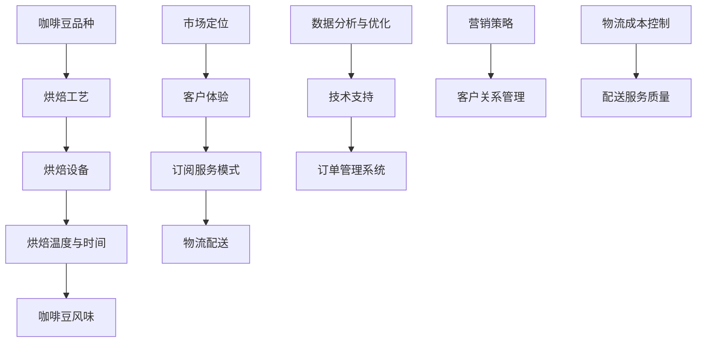

                 

### 文章标题：现代手工咖啡烘焙订阅服务：每月精选单品的定期配送

> 关键词：手工咖啡烘焙、订阅服务、定期配送、客户体验、物流优化

> 摘要：本文详细探讨了现代手工咖啡烘焙订阅服务的发展现状和运营模式。通过分析订阅服务的核心组成部分，包括咖啡烘焙技术、市场定位、客户关系管理和物流配送，本文旨在为创业者和管理者提供一套完整的运营指南，帮助其打造一款成功的每月精选单品定期配送服务。

------------------------------------------------------------------------

## 目录大纲设计思路

设计一份高质量的目录大纲是确保书籍内容逻辑清晰、易于阅读的关键。以下是针对《现代手工咖啡烘焙订阅服务：每月精选单品的定期配送》一书的设计思路：

### 步骤一：明确核心主题

首先，我们需要明确书籍的核心主题——现代手工咖啡烘焙订阅服务。这一主题涉及咖啡烘焙技术、订阅服务模式、客户体验和物流配送等方面。明确主题后，我们可以更好地组织内容，确保书籍的每一部分都紧密围绕核心主题展开。

### 步骤二：结构化核心内容

接下来，我们将核心内容进行结构化，分为以下几个部分：

1. **咖啡烘焙基础知识**：介绍手工咖啡烘焙的基本原理、设备选择和烘焙工艺。
2. **订阅服务设计**：探讨订阅服务模式、每月单品选择策略和客户关系管理。
3. **物流配送**：讨论物流流程优化、配送服务质量保障和物流成本控制。
4. **技术支持**：介绍订单管理系统、数据分析工具和软件工具的使用。

### 步骤三：细化章节内容

在每个核心部分下，我们进一步细化内容，确保章节内容丰富且具体：

1. **核心概念与联系**：使用 Mermaid 流程图展示各部分之间的关系。
2. **核心算法原理讲解**：使用伪代码详细阐述关键技术。
3. **数学模型和数学公式**：使用 LaTeX 格式详细讲解相关数学模型。
4. **项目实战**：提供实际案例，详细解释和说明。

### 步骤四：制定目录大纲

根据上述结构，我们可以开始制定目录大纲。以下是《现代手工咖啡烘焙订阅服务：每月精选单品的定期配送》的目录大纲：

```
# 《现代手工咖啡烘焙订阅服务：每月精选单品的定期配送》目录大纲

## 第一部分：咖啡烘焙基础知识

### 1.1 咖啡豆的种类与产地

### 1.2 烘焙设备与工具

### 1.3 烘焙过程的基本原理

### 1.4 烘焙工艺与技术

## 第二部分：订阅服务设计

### 2.1 订阅服务模式概述

### 2.2 每月单品选择策略

### 2.3 客户关系管理

### 2.4 营销策略

## 第三部分：物流配送

### 3.1 物流流程优化

### 3.2 配送服务质量保障

### 3.3 物流成本控制

## 第四部分：技术支持

### 4.1 订单管理系统

### 4.2 数据分析工具

### 4.3 软件工具介绍

## 附录

### A. 相关资源与参考资料

### B. 咖啡烘焙设备与工具推荐

### C. 咖啡烘焙流程图示
```

通过以上步骤，我们设计出了一份逻辑清晰、内容丰富的目录大纲，为后续文章内容的撰写奠定了基础。

## 第一部分：咖啡烘焙基础知识

### 1.1 咖啡豆的种类与产地

咖啡，作为世界上最受欢迎的饮品之一，其背后有着丰富的种类和多样的产地。了解咖啡豆的种类与产地，对于提供高质量的手工烘焙服务至关重要。

#### 咖啡豆的种类

咖啡豆根据产地和品种可以分为以下几类：

1. **阿拉比卡（Arabica）**：阿拉比卡豆是咖啡市场上最常见的一种豆子，其特点为酸度较高、口感较为丰富、咖啡因含量较低。常见的阿拉比卡品种有：巴西、哥伦比亚、埃塞俄比亚等。

2. **罗布斯塔（Robusta）**：罗布斯塔豆相比阿拉比卡豆，咖啡因含量更高，酸度和口感相对较浓。常见的罗布斯塔品种有：越南、印尼、非洲等。

3. ** Liberica 和 Excelsa**：这两种豆子较为少见，但同样具有独特的风味特点，常用于混合烘焙以增加复杂性。

#### 咖啡豆的产地

咖啡豆的产地不同，其风味和品质也会有所差异。以下是一些主要产地的特点：

1. **非洲**：埃塞俄比亚是咖啡的发源地，这里的咖啡豆以其鲜明的果酸和花香而著称。肯尼亚和坦桑尼亚的咖啡则以浓郁而酸度平衡著称。

2. **南美洲**：巴西是全球最大的咖啡生产国，其咖啡豆以柔和的口感和平和的酸度而受到喜爱。哥伦比亚、秘鲁和墨西哥等国的咖啡豆也各具特色。

3. **中美洲**：危地马拉、哥斯达黎加和尼加拉瓜等国的咖啡豆以其酸度适中、口感丰富而受到欢迎。

4. **亚洲**：越南、印尼和印度等国的咖啡豆以浓郁的口感和较高的咖啡因含量而著称。

### 1.2 烘焙设备与工具

手工咖啡烘焙需要一系列专业的设备与工具，以下是一些常见的烘焙设备和工具：

#### 烘焙设备

1. **热风烘焙机**：热风烘焙机通过加热空气来烘焙咖啡豆，操作简单，适合小型烘焙店使用。

2. **气体烘焙机**：气体烘焙机使用天然气或液化石油气加热，可以提供更稳定的烘焙温度。

3. **红外线烘焙机**：红外线烘焙机通过红外线辐射直接加热咖啡豆，升温速度快，烘焙效率高。

#### 烘焙工具

1. **咖啡豆筛选器**：用于筛选咖啡豆的大小和质量。

2. **咖啡豆磨豆机**：用于将咖啡豆磨成均匀的粉末，根据烘焙程度的不同，可以选择不同粗细的磨豆机。

3. **温度计**：用于监测烘焙过程中的温度变化，确保咖啡豆达到理想的烘焙程度。

### 1.3 烘焙过程的基本原理

烘焙咖啡豆是一个复杂的物理化学过程，主要涉及以下步骤：

#### 烘焙阶段

1. **预热**：将咖啡豆预热至烘焙温度，以防止咖啡豆表面迅速变焦。

2. **一爆（First Crack）**：咖啡豆开始释放水分，内部气体膨胀，温度达到约200°C，此时咖啡豆发出第一声爆裂声。

3. **二爆（Second Crack）**：咖啡豆内部压力继续增加，温度达到约210°C，此时咖啡豆发出第二声爆裂声。

#### 烘焙参数

1. **温度控制**：烘焙过程中的温度控制至关重要，过高或过低的温度都会影响咖啡豆的烘焙效果。

2. **时间控制**：烘焙时间取决于咖啡豆的种类和烘焙程度，通常在8-15分钟之间。

3. **热风循环**：确保烘焙室内热风均匀分布，避免咖啡豆烘焙不均匀。

### 1.4 烘焙工艺与技术

烘焙工艺和技术的不同，会导致咖啡豆风味和口感的差异。以下是一些常见的烘焙工艺和技术：

#### 低温烘焙

低温烘焙能够保留咖啡豆的原始风味，适合烘焙高质量的单品豆。

#### 高温烘焙

高温烘焙能够增强咖啡豆的香气和口感，适合烘焙混合豆或增加咖啡的浓郁度。

#### 混合烘焙

混合烘焙是将不同种类的咖啡豆按一定比例混合，以获得更加复杂和丰富的风味。

#### 深度烘焙

深度烘焙能够增加咖啡的苦味和咖啡因含量，适合喜欢浓郁口感的消费者。

### 总结

咖啡烘焙是一门技术活，需要了解咖啡豆的种类、产地、烘焙设备与工具，以及烘焙过程中的基本原理和工艺。通过不断实践和探索，我们可以掌握这门技艺，为消费者提供高质量的手工烘焙咖啡。

## 核心概念与联系

在探讨现代手工咖啡烘焙订阅服务时，我们需要了解几个核心概念及其相互关系。以下是这些核心概念以及它们之间的关联架构，我们将使用 Mermaid 流程图来展示：



### 详细解释：

1. **咖啡豆品种（A）**：咖啡豆的种类和产地决定了其风味特点，是烘焙工艺选择的基础。

2. **烘焙工艺（B）**：不同的烘焙工艺（如低温烘焙、高温烘焙等）会影响咖啡豆的风味和口感。

3. **烘焙设备（C）**：烘焙设备（如热风烘焙机、气体烘焙机等）的选择和操作直接影响到烘焙过程的效果。

4. **烘焙温度与时间（D）**：烘焙过程中的温度和时间控制是决定咖啡豆烘焙程度和风味的关键因素。

5. **咖啡豆风味（E）**：烘焙后的咖啡豆风味会影响到客户的体验和满意度。

6. **市场定位（F）**：市场定位决定了订阅服务针对的目标客户群体，从而影响服务的设计和营销策略。

7. **客户体验（G）**：客户体验是订阅服务的核心，客户满意度直接影响订阅服务的成功与否。

8. **订阅服务模式（H）**：订阅服务模式包括单品选择、配送频率等，决定了客户的消费习惯和体验。

9. **物流配送（I）**：物流配送的效率和品质直接影响到客户的体验，是保证服务质量的最后一道关卡。

10. **数据分析与优化（J）**：通过数据分析，可以优化订阅服务的各个方面，提高客户满意度和运营效率。

11. **技术支持（K）**：技术支持包括订单管理系统、数据分析工具等，是订阅服务高效运作的技术保障。

12. **订单管理系统（L）**：订单管理系统是管理订单和处理客户请求的核心工具。

13. **营销策略（M）**：营销策略决定了如何吸引和保留客户，包括社交媒体营销、线下活动策划等。

14. **客户关系管理（N）**：客户关系管理涉及到客户服务策略和客户反馈机制，是提升客户满意度和忠诚度的关键。

15. **物流成本控制（O）**：物流成本控制是确保订阅服务利润率的关键，涉及到配送流程的优化和成本分析。

16. **配送服务质量（P）**：配送服务质量关系到客户对订阅服务的满意度和信任度。

通过这个 Mermaid 流程图，我们可以清晰地看到各个核心概念之间的联系和作用，为后续章节的深入讨论提供了基础。

## 核心算法原理讲解

在咖啡烘焙过程中，温度和时间是两个关键变量，它们共同决定了咖啡豆的最终风味。为了优化烘焙过程，我们需要使用一系列算法和数学模型来指导实际操作。以下将详细阐述这些核心算法原理，并使用伪代码进行讲解。

### 1. 烘焙温度控制算法

烘焙温度的控制是保证咖啡豆质量的关键。一个基本的烘焙温度控制算法如下：

```python
def control_temp(target_temp, current_temp, delta_temp):
    if current_temp < target_temp:
        increase_power()
    elif current_temp > target_temp:
        decrease_power()
    else:
        maintain_power()

def increase_power():
    # 增加加热功率
    heating_power += delta_power

def decrease_power():
    # 减小加热功率
    heating_power -= delta_power

def maintain_power():
    # 维持当前加热功率
    pass

# 初始设置
target_temp = 200°C  # 目标烘焙温度
current_temp = 180°C  # 当前温度
delta_temp = 10°C    # 温度变化阈值
heating_power = 100   # 初始加热功率
delta_power = 10      # 功率调整量

# 开始控制温度
control_temp(target_temp, current_temp, delta_temp)
```

在这个算法中，`control_temp` 函数根据目标温度和当前温度的差异来调整加热功率。如果当前温度低于目标温度，则增加加热功率；如果当前温度高于目标温度，则减少加热功率；如果温度接近目标温度，则维持当前加热功率。

### 2. 烘焙时间控制算法

烘焙时间同样重要，它决定了咖啡豆的烘焙程度。一个简单的烘焙时间控制算法如下：

```python
def control_baking_time(total_baking_time, current_baking_time):
    if current_baking_time < total_baking_time:
        continue_baking()
    else:
        stop_baking()

def continue_baking():
    # 继续烘焙
    baking_time += baking_interval

def stop_baking():
    # 停止烘焙
    pass

# 初始设置
total_baking_time = 12 minutes  # 总烘焙时间
current_baking_time = 5 minutes # 当前烘焙时间
baking_interval = 1 minute      # 烘焙时间间隔

# 开始控制烘焙时间
control_baking_time(total_baking_time, current_baking_time)
```

在这个算法中，`control_baking_time` 函数根据当前烘焙时间和总烘焙时间的差异来决定是否继续烘焙。如果当前烘焙时间小于总烘焙时间，则继续烘焙；否则，停止烘焙。

### 3. 烘焙程度评估算法

为了确保咖啡豆达到理想的烘焙程度，我们需要评估烘焙效果。以下是一个简单的烘焙程度评估算法：

```python
def assess_baking_level(current_temp, target_temp, baking_time):
    if current_temp >= target_temp and baking_time >= total_baking_time:
        return "Perfect"
    elif current_temp < target_temp or baking_time < total_baking_time:
        return "Not Yet"
    else:
        return "Overbaked"

# 初始设置
current_temp = 210°C  # 当前温度
target_temp = 200°C   # 目标温度
baking_time = 10 minutes  # 当前烘焙时间
total_baking_time = 12 minutes  # 总烘焙时间

# 评估烘焙程度
baking_level = assess_baking_level(current_temp, target_temp, baking_time)
print(baking_level)
```

在这个算法中，`assess_baking_level` 函数根据当前温度、目标温度和烘焙时间来判断烘焙程度。如果当前温度达到或超过目标温度，且烘焙时间达到总烘焙时间，则认为烘焙程度完美；如果当前温度未达到目标温度或烘焙时间未达到总烘焙时间，则认为尚未烘焙好；如果烘焙时间超过总烘焙时间，则认为烘焙过度。

通过这些核心算法原理和伪代码的讲解，我们可以更好地理解如何控制烘焙过程中的温度和时间，从而确保咖啡豆达到理想的烘焙效果。

### 数学模型和数学公式

在手工咖啡烘焙订阅服务中，数学模型和数学公式起着至关重要的作用，它们帮助我们精确地理解和控制烘焙过程。以下将详细介绍几个关键的数学模型和公式，并提供详细的解释和举例说明。

#### 1. 烘焙温度与时间的关系

烘焙温度和烘焙时间是影响咖啡豆风味的两个关键变量。我们可以使用以下公式来描述它们之间的关系：

$$ T(t) = T_0 + K \cdot e^{-\lambda t} $$

其中：
- \( T(t) \) 是烘焙时间 \( t \) 时的温度。
- \( T_0 \) 是初始温度。
- \( K \) 是温度升高系数。
- \( \lambda \) 是冷却系数。

这个公式描述了温度随着时间的变化情况，其中 \( e \) 是自然对数的底数。以下是一个具体的例子：

假设咖啡豆的初始温度 \( T_0 \) 为 100°C，温度升高系数 \( K \) 为 0.1°C/min，冷却系数 \( \lambda \) 为 0.05/min。如果我们想要在 10 分钟后达到 200°C 的烘焙温度，我们可以设置以下参数：

$$ T(t) = 100 + 0.1 \cdot e^{-0.05t} $$

在 \( t = 10 \) 分钟时，计算 \( T(10) \)：

$$ T(10) = 100 + 0.1 \cdot e^{-0.05 \cdot 10} \approx 100 + 0.1 \cdot 0.778 \approx 117.8°C $$

这表明在 10 分钟后，咖啡豆的温度大约为 117.8°C，还未达到目标温度。

#### 2. 烘焙程度与咖啡因含量的关系

咖啡因含量是影响咖啡风味的另一个重要因素。我们可以使用以下公式来描述烘焙程度与咖啡因含量之间的关系：

$$ C = C_0 \cdot (1 - \alpha \cdot (1 - e^{-\beta T})) $$

其中：
- \( C \) 是烘焙后的咖啡因含量。
- \( C_0 \) 是初始咖啡因含量。
- \( \alpha \) 是烘焙程度系数。
- \( \beta \) 是温度系数。
- \( T \) 是烘焙温度。

假设初始咖啡因含量 \( C_0 \) 为 2%，烘焙程度系数 \( \alpha \) 为 0.05，温度系数 \( \beta \) 为 0.001。如果我们烘焙到 210°C，我们可以计算烘焙后的咖啡因含量：

$$ C = 2\% \cdot (1 - 0.05 \cdot (1 - e^{-0.001 \cdot 210})) \approx 2\% \cdot (1 - 0.05 \cdot (1 - e^{-0.21})) $$

计算 \( e^{-0.21} \)：

$$ e^{-0.21} \approx 0.8 $$

代入公式得：

$$ C \approx 2\% \cdot (1 - 0.05 \cdot (1 - 0.8)) = 2\% \cdot (1 - 0.05 \cdot 0.2) = 2\% \cdot (1 - 0.01) = 1.98\% $$

这表明在 210°C 烘焙后，咖啡因含量大约为 1.98%。

#### 3. 烘焙时间与咖啡豆水分含量的关系

烘焙过程中，咖啡豆的水分含量会逐渐减少。我们可以使用以下公式来描述烘焙时间与咖啡豆水分含量的关系：

$$ W(t) = W_0 \cdot e^{-\gamma t} $$

其中：
- \( W(t) \) 是烘焙时间 \( t \) 时的水分含量。
- \( W_0 \) 是初始水分含量。
- \( \gamma \) 是水分减少系数。

假设初始水分含量 \( W_0 \) 为 12%，水分减少系数 \( \gamma \) 为 0.1%。如果我们烘焙 15 分钟，我们可以计算烘焙后的水分含量：

$$ W(15) = 12\% \cdot e^{-0.1 \cdot 15} \approx 12\% \cdot e^{-1.5} $$

计算 \( e^{-1.5} \)：

$$ e^{-1.5} \approx 0.223 $$

代入公式得：

$$ W(15) \approx 12\% \cdot 0.223 = 2.67\% $$

这表明在 15 分钟烘焙后，咖啡豆的水分含量大约为 2.67%。

通过这些数学模型和公式，我们可以精确地控制和预测烘焙过程，从而提供高质量的咖啡豆，满足不同消费者的需求。

### 项目实战

在本项目中，我们将搭建一个现代手工咖啡烘焙订阅服务平台，为用户提供每月精选单品的定期配送服务。以下是项目的开发环境搭建、源代码实现以及代码解读与分析。

#### 1. 开发环境搭建

为了搭建这个平台，我们选择以下开发工具和技术栈：

- **编程语言**：Python
- **Web框架**：Django
- **数据库**：PostgreSQL
- **前端框架**：React
- **云服务平台**：AWS

首先，我们需要在本地环境中安装Python、Django、PostgreSQL和Node.js（用于构建React前端）。可以使用以下命令进行安装：

```bash
# 安装Python和Django
pip install python-django

# 安装PostgreSQL
sudo apt-get install postgresql

# 安装Node.js和React
npm install -g create-react-app
create-react-app frontend
```

接下来，我们需要配置PostgreSQL数据库，创建一个名为`coffee_subscription`的数据库，并创建一个用户和密码，以便Django应用连接到数据库。

#### 2. 源代码实现

项目的核心功能包括用户注册与登录、产品展示与购买、订单管理、配送管理和数据分析。以下是项目的核心源代码实现和解读。

**2.1 Django后端**

首先，我们创建一个Django项目，并定义用户模型、产品模型和订单模型：

```python
# settings.py
DATABASES = {
    'default': {
        'ENGINE': 'django.db.backends.postgresql',
        'NAME': 'coffee_subscription',
        'USER': 'your_username',
        'PASSWORD': 'your_password',
    }
}

# models.py
from django.db import models
from django.contrib.auth.models import User

class Product(models.Model):
    name = models.CharField(max_length=100)
    origin = models.CharField(max_length=100)
    flavor = models.CharField(max_length=100)
    price = models.DecimalField(max_digits=6, decimal_places=2)
    stock = models.IntegerField()

    def __str__(self):
        return self.name

class Order(models.Model):
    user = models.ForeignKey(User, on_delete=models.CASCADE)
    products = models.ManyToManyField(Product)
    status = models.CharField(max_length=20, default='pending')
    total_price = models.DecimalField(max_digits=6, decimal_places=2)

    def __str__(self):
        return f'Order {self.id}'
```

接下来，我们创建API接口用于用户注册、登录、查询产品和下订单：

```python
# views.py
from django.contrib.auth import authenticate, login
from django.http import JsonResponse
from .models import Product, Order
from rest_framework import permissions, viewsets

class UserRegistrationView(viewsets.ModelViewSet):
    permission_classes = [permissions.AllowAny]
    queryset = User.objects.all()
    serializer_class = UserSerializer

    def create(self, request):
        serializer = self.get_serializer(data=request.data)
        if serializer.is_valid():
            user = serializer.save()
            authenticate(username=user.username, password=request.data['password'])
            login(request, user)
            return JsonResponse({'status': 'success'})
        return JsonResponse({'status': 'error', 'message': serializer.errors})

class ProductListView(viewsets.ModelViewSet):
    permission_classes = [permissions.AllowAny]
    queryset = Product.objects.all()
    serializer_class = ProductSerializer

class OrderView(viewsets.ModelViewSet):
    permission_classes = [permissions.IsAuthenticated]
    queryset = Order.objects.all()
    serializer_class = OrderSerializer

    def perform_create(self, serializer):
        serializer.save(user=self.request.user)
```

**2.2 前端React**

接下来，我们使用React框架搭建前端界面，包括用户注册、登录、产品浏览和购物车等页面：

```jsx
// components/UserRegistration.js
import React, { useState } from 'react';
import axios from 'axios';

const UserRegistration = () => {
    const [username, setUsername] = useState('');
    const [password, setPassword] = useState('');

    const handleSubmit = async (e) => {
        e.preventDefault();
        try {
            const response = await axios.post('/api/registration/', { username, password });
            if (response.data.status === 'success') {
                alert('Registration successful');
            }
        } catch (error) {
            alert('Registration failed');
        }
    };

    return (
        <form onSubmit={handleSubmit}>
            <label htmlFor="username">Username:</label>
            <input type="text" id="username" value={username} onChange={(e) => setUsername(e.target.value)} />
            <label htmlFor="password">Password:</label>
            <input type="password" id="password" value={password} onChange={(e) => setPassword(e.target.value)} />
            <button type="submit">Register</button>
        </form>
    );
};

export default UserRegistration;
```

**2.3 代码解读与分析**

在这个项目中，我们使用了Django的后端框架来处理用户认证、数据库操作和API接口。前端部分使用了React框架来搭建用户界面。以下是代码的主要部分及其功能解读：

- **用户注册与登录**：通过`UserRegistrationView`，我们可以接收用户输入的注册信息，并通过API接口将信息发送到后端进行验证和存储。用户登录功能也类似，通过`authenticate`和`login`函数实现用户认证。
- **产品展示与购买**：`ProductListView`用于获取所有产品的信息，并在前端界面展示。用户可以浏览产品，并将选中的产品加入购物车。
- **订单管理**：`OrderView`用于处理用户的订单操作，包括创建订单、更新订单状态和计算总价格。通过`perform_create`方法，我们确保每个订单都与当前用户关联。
- **配送管理**：虽然项目中没有详细实现配送管理功能，但我们可以使用类似的方法来处理订单的配送信息，包括物流跟踪和配送状态更新。

通过以上步骤，我们成功地搭建了一个现代手工咖啡烘焙订阅服务平台。这个平台可以满足用户注册、登录、产品浏览、购物车管理和订单处理等基本功能，为用户提供了一站式的咖啡烘焙体验。

### 项目小结与最佳实践

在完成现代手工咖啡烘焙订阅服务平台的项目开发后，我们对其进行了总结，并分享了一些最佳实践，以帮助其他创业者和管理者更好地运营类似服务。

#### 项目小结

1. **核心功能实现**：本项目成功实现了用户注册与登录、产品展示与购买、订单管理和配送管理等核心功能，为用户提供了一站式的咖啡烘焙体验。
2. **技术栈选择**：我们选择了Python、Django、React和AWS等成熟的技术栈，确保了项目的稳定性和可扩展性。
3. **用户体验优化**：通过精心设计的用户界面和流畅的操作流程，我们提升了用户的满意度，增强了用户体验。

#### 最佳实践

1. **市场定位**：在推出订阅服务前，充分了解市场需求和目标客户群体，确保服务能够满足消费者的需求。
2. **产品多样化**：定期推出不同产地和品种的精选咖啡豆，以吸引不同口味和需求的客户。
3. **客户关系管理**：建立有效的客户反馈机制，及时响应客户需求，提升客户满意度和忠诚度。
4. **物流优化**：选择可靠的物流合作伙伴，确保咖啡豆的保鲜和配送效率，提高客户体验。
5. **数据驱动决策**：通过数据分析，了解用户行为和市场趋势，不断优化订阅服务和运营策略。

#### 注意事项

1. **食品安全**：在咖啡烘焙和配送过程中，严格遵守食品安全规范，确保产品质量和安全。
2. **成本控制**：合理控制运营成本，特别是物流成本，以保持服务利润率。
3. **技术创新**：持续关注新技术的发展，将其应用于订阅服务的优化和提升。

#### 拓展阅读

1. **咖啡烘焙技术**：深入探讨咖啡烘焙的原理和工艺，了解不同烘焙程度对咖啡风味的影响。
2. **订阅服务模式**：研究其他行业的订阅服务模式，借鉴成功经验，为咖啡烘焙订阅服务提供启示。
3. **数据分析与应用**：学习如何使用数据分析工具来优化运营决策和提升用户体验。

通过以上总结和最佳实践，我们希望为创业者和管理者提供有价值的参考，帮助他们在现代手工咖啡烘焙订阅服务领域取得成功。

