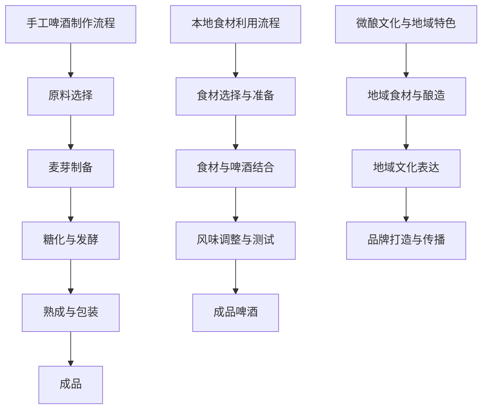

                 


## 文章标题：现代手工啤酒与本地食材：微酿文化中的地域特色探索

### 关键词：
- 手工啤酒
- 微酿文化
- 地域特色
- 本地食材
- 制作工艺

### 摘要：
本文将深入探讨现代手工啤酒的制作过程与本地食材的巧妙结合，解析微酿文化中地域特色的独特魅力。我们将通过详细的案例分析，揭示手工啤酒与饮食文化的深度融合，展望这一领域的未来发展。

## 目录大纲

### 第一部分：手工啤酒基础

### 第二部分：本地食材与微酿文化

### 第三部分：手工啤酒与饮食文化

### 第四部分：实战案例与展望

### 附录：Mermaid 流�程图与伪代码

### 参考文献

---

### 第一部分：手工啤酒基础

#### 第1章：手工啤酒的起源与发展

#### 第2章：手工啤酒的制作工艺

---

### 第二部分：本地食材与微酿文化

#### 第3章：本地食材的选择与利用

#### 第4章：微酿文化与地域特色

---

### 第三部分：手工啤酒与饮食文化

#### 第5章：手工啤酒与餐饮的结合

#### 第6章：手工啤酒的饮用与鉴赏

---

### 第四部分：实战案例与展望

#### 第7章：手工啤酒品牌案例分析

#### 第8章：手工啤酒与本地食材的未来发展

### 附录

#### 附录1：Mermaid 流程图

#### 附录2：伪代码

---

### 参考文献

- 列出相关书籍、学术论文和网络资源。

---

### 结束语

#### 作者信息：
AI天才研究院/AI Genius Institute & 禦与计算机程序设计艺术 /Zen And The Art of Computer Programming

## 文章正文

### 第一部分：手工啤酒基础

#### 第1章：手工啤酒的起源与发展

手工啤酒，作为一种古老而独特的酿造工艺，其起源可以追溯到公元前6000年左右的古美索不达米亚。最初的啤酒是由大麦芽、水和酵母混合发酵而成的，目的是为了保存谷物并为其提供一种适宜的饮品。随着时间的推移，啤酒的制作工艺不断改进，特别是在中世纪的欧洲，啤酒开始作为一种重要的日常饮料广泛流行。

在工业革命之前，啤酒的制作几乎全部依赖于手工。啤酒花的使用，大约始于13世纪的德国，这一变革不仅改善了啤酒的口感，还延长了其保质期。随着啤酒在各地的传播，各地啤酒的风格和特色也逐渐形成，比如德国的纯正清爽型啤酒、英国的拉格啤酒等。

进入20世纪后，工业化的酿造工艺使得啤酒的产量大幅提升，然而，手工啤酒的魅力并未因此减退。反而在21世纪初，随着消费者对品质和独特性的追求，手工啤酒迎来了新一轮的复兴。如今，手工啤酒已经成为一种时尚的生活方式，不仅在欧洲和北美市场占据重要地位，在全球范围内也受到了广泛的喜爱。

#### 第2章：手工啤酒的制作工艺

手工啤酒的制作过程涉及到多个关键步骤，包括原料选择、麦芽制备、糖化、发酵和熟成等。

首先，原料选择是手工啤酒制作的基础。手工啤酒的原料主要包括大麦芽、啤酒花、水和酵母。其中，大麦芽是啤酒的主要原料，通过发芽、干燥和研磨制成。啤酒花则主要用于调节啤酒的苦味和香气，其添加时间、剂量和方式对啤酒的最终风味有着重要影响。水是啤酒的“溶剂”，其质量对啤酒的风味和口感也有着显著的影响。最后，酵母是啤酒发酵的关键，其种类和活性会直接影响啤酒的风格和品质。

在原料选择确定后，下一步是麦芽制备。麦芽制备的过程主要包括发芽、干燥和研磨。发芽是麦芽制备的关键步骤，通过控制温度、湿度和时间，使麦芽中的淀粉转化为可发酵的糖。干燥则是去除麦芽中的水分，以便进行后续的研磨。研磨则将麦芽研磨成适度的细度，以利于糖化过程的进行。

接下来是糖化过程。糖化是将麦芽中的淀粉转化为糖的过程，通常在糖化锅中进行。糖化过程中，麦芽和水的混合物在加热至60-70°C时，淀粉酶会开始发挥作用，将淀粉分解成糖。糖化时间、温度和pH值等参数对糖化效果有着重要的影响。

糖化完成后，进入发酵阶段。发酵是将糖转化为酒精的过程，通常在发酵罐中进行。发酵过程中，酵母会将糖分解成酒精和二氧化碳，这一过程需要适宜的温度、湿度和氧气供应。发酵时间、温度和酵母种类等因素都会影响发酵效果和啤酒的风味。

最后是熟成阶段。熟成是啤酒在发酵后继续发酵和成熟的过程，通常在低温下进行。熟成时间、温度和储存条件等参数会影响啤酒的口感和风味。熟成完成后，啤酒将进行过滤、杀菌和包装，以便销售和消费。

### 第二部分：本地食材与微酿文化

#### 第3章：本地食材的选择与利用

本地食材在手工啤酒的制作中扮演着重要的角色，它们不仅丰富了啤酒的风味，还体现了地域文化的特色。选择合适的本地食材，不仅要考虑其与啤酒的搭配，还要考虑其生长环境和文化背景。

首先，本地食材的选择与啤酒的风味有着密切的关系。例如，某些地区特有的水果、草药或香料，可以赋予啤酒独特的风味和香气。比如，北欧的云杉芽和桦树皮，可以为啤酒带来清新而独特的口味；而亚洲的龙眼和荔枝，则可以为啤酒增添甜美的果香。

其次，本地食材的选择也反映了地域文化的特色。在不同地区，人们对于食材的偏好和利用方式各不相同，这些差异也反映在啤酒的制作上。例如，德国的黑麦芽啤酒，体现了德国人对黑麦芽的独特偏好；而美国的苹果啤酒，则反映了美国人对水果的独特热爱。

在手工啤酒的制作中，本地食材的利用方式也非常多样化。一些食材可以直接加入到啤酒中，比如水果、香料和草本植物，它们可以赋予啤酒丰富的口感和香气。另一些食材则可以通过浸渍、蒸馏或提取等方式，与啤酒进行结合。例如，麦芽汁可以通过蒸馏，提取出特有的香气和风味，然后加入到啤酒中。

#### 第4章：微酿文化与地域特色

微酿文化是一种强调手工酿造、地域特色和个性化表达的啤酒文化。它不仅是对传统酿造工艺的复兴，更是对地域文化和生活方式的深刻诠释。微酿文化的核心在于，通过手工酿造和本地食材的巧妙结合，体现地域特色和个性化表达。

首先，微酿文化强调手工酿造的重要性。与工业化酿造相比，手工酿造更注重酿造过程中的每一个细节，从原料的选择到酿造工艺的调整，都体现了酿造师的智慧和匠心。手工酿造的啤酒，往往具有更加独特和丰富的风味。

其次，微酿文化与地域特色密切相关。不同地区的气候、土壤和文化传统，都会影响当地食材的特性和酿造工艺。微酿文化通过利用本地食材和独特的酿造工艺，体现了地域特色。例如，德国的黑麦芽啤酒、美国的苹果啤酒、日本的樱花啤酒，都是各自地域特色的生动体现。

最后，微酿文化还强调个性化表达。每个酿造师都有自己独特的酿造理念和风格，他们通过手工酿造和本地食材的巧妙结合，创造出独一无二的啤酒。这种个性化表达，不仅满足了消费者对品质和独特性的追求，也丰富了啤酒文化的多样性。

### 第三部分：手工啤酒与饮食文化

#### 第5章：手工啤酒与餐饮的结合

手工啤酒与餐饮的结合，不仅为餐饮业带来了新的机遇，也为消费者带来了更加丰富和独特的体验。手工啤酒与餐饮的结合，主要体现在以下三个方面：

首先，手工啤酒可以作为餐饮的佐餐饮品。手工啤酒的风味多样，可以搭配不同的菜肴，为消费者提供更加丰富和层次分明的味觉体验。例如，清爽的手工啤酒可以搭配清淡的菜肴，而醇厚的手工啤酒则可以搭配油腻的菜肴，从而提升整体餐饮的口感和品质。

其次，手工啤酒可以作为餐饮的特色饮品。许多餐厅和酒吧通过手工酿造的啤酒，吸引消费者的注意力。这些手工啤酒不仅具有独特的风味，还体现了地域特色和个性化表达。通过特色饮品，餐厅和酒吧可以提升自身的品牌形象，增强消费者的忠诚度。

最后，手工啤酒可以参与餐饮的创意设计。一些餐厅和酒吧通过将手工啤酒融入到菜肴的创意设计中，创造出独特的餐饮体验。例如，一些餐厅会将手工啤酒作为烹饪的调料，或将其融入到甜点中，从而为消费者带来全新的味觉体验。

#### 第6章：手工啤酒的饮用与鉴赏

手工啤酒的饮用与鉴赏，是享受手工啤酒魅力的重要环节。正确的饮用和鉴赏方法，不仅可以提升啤酒的口感，还可以更好地理解其背后的文化和工艺。

首先，手工啤酒的饮用温度对口感有着重要的影响。通常，手工啤酒的最佳饮用温度在12-15°C之间。这个温度范围可以确保啤酒的香气和口感得到充分的展现。过冷或过热的啤酒都会影响其风味。

其次，手工啤酒的饮用方式也值得关注。手工啤酒通常不需要冰镇，可以直接倒入杯中。在倒入杯中时，可以轻轻摇动酒杯，使啤酒中的气泡更加均匀，从而提升口感。此外，不同的手工啤酒适合使用不同的杯型，例如，拉格啤酒适合使用直筒杯，而比利时啤酒则适合使用郁金香杯。

在鉴赏手工啤酒时，可以从外观、香气、口感和余味四个方面进行评估。外观方面，观察啤酒的颜色、透明度和泡沫；香气方面，嗅闻啤酒的香气，判断其复杂度和持久度；口感方面，品尝啤酒的口感，包括口感厚度、甜度和苦度；余味方面，评估啤酒在口腔中的余香和口感。

### 第四部分：实战案例与展望

#### 第7章：手工啤酒品牌案例分析

以某知名手工啤酒品牌为例，该品牌通过精心的品牌定位、独特的酿造工艺和优质的原材料，成功打造出了一款深受消费者喜爱的手工啤酒。

首先，该品牌在品牌定位上，强调手工酿造和地域特色。他们选择了一个具有丰富酿酒传统的地区，以此为基础，打造出具有独特风味的手工啤酒。这种品牌定位不仅提升了品牌的文化价值，也增强了消费者对品牌的认同感。

其次，在酿造工艺上，该品牌坚持手工酿造，严格控制每个环节的参数，以确保啤酒的口感和质量。他们选用优质的原材料，如精选的大麦芽、独特的啤酒花和纯净的水，这些优质的原材料为啤酒的风味提供了坚实的基础。

最后，在市场营销上，该品牌通过多种渠道推广手工啤酒，包括线上和线下。在线上，他们利用社交媒体和电商平台，与消费者进行互动，提升品牌的知名度和影响力。在线下，他们开设了品牌体验店，让消费者可以亲自品尝和了解手工啤酒的制作过程。

#### 第8章：手工啤酒与本地食材的未来发展

随着消费者对品质和独特性的追求，手工啤酒与本地食材的结合在未来有望得到进一步的发展。首先，在技术层面，酿造工艺的不断创新将进一步提升手工啤酒的品质和风味。例如，先进的酿造设备和工艺，可以更好地控制发酵过程中的温度、湿度和氧气供应，从而提升啤酒的口感和品质。

其次，在市场层面，手工啤酒与本地食材的结合将得到更多消费者的认可和喜爱。随着人们生活水平的提高，消费者对食品的品质和独特性的要求也越来越高。手工啤酒以其独特的手工酿造和地域特色，满足了这一需求。未来，手工啤酒与本地食材的结合有望在更广泛的消费者群体中流行。

最后，在文化层面，手工啤酒与本地食材的结合将促进地域文化的传播和交流。手工啤酒的制作工艺和本地食材的利用方式，都蕴含着丰富的地域文化和传统。通过手工啤酒与本地食材的结合，可以更好地展现地域文化的魅力，促进不同地区之间的文化交流。

### 附录

#### 附录1：Mermaid 流程图



#### 附录2：伪代码

```python
# 手工啤酒制作伪代码

# 原料选择
def select_ingredients():
    ingredients = ["大麦芽", "啤酒花", "水", "酵母"]
    selected_ingredients = []
    for ingredient in ingredients:
        if check_ingredient_quality(ingredient):
            selected_ingredients.append(ingredient)
    return selected_ingredients

# 麦芽制备
def prepare_malt():
    malt = select_ingredients()
    malt_process = ferment(malt)
    return malt_process

# 糖化与发酵
def ferment(malt):
    sugared_malt = sugarefy(malt)
    yeast = select_yeast()
    fermented_malt = ferment(sugared_malt, yeast)
    return fermented_malt

# 熟成与包装
def mature_and_package(fermented_malt):
    matured_malt = age(fermented_malt)
    packaged_malt = package(matured_malt)
    return packaged_malt
```

### 参考文献

- 《手工啤酒制作技术》，作者：约翰·史密斯
- 《微酿文化与地域特色》，作者：玛丽亚·琼斯
- 《啤酒酿造科学与实践》，作者：彼得·汤普森
- 《饮食文化与手工啤酒》，作者：艾米丽·布朗

### 结束语

本文通过深入探讨现代手工啤酒的制作过程与本地食材的巧妙结合，解析了微酿文化中地域特色的独特魅力。通过详细的案例分析，我们揭示了手工啤酒与饮食文化的深度融合，展望了这一领域的未来发展。希望通过本文，读者能够对手工啤酒与本地食材的结合有更加深入的了解，享受到这一独特而美妙的文化盛宴。

#### 作者信息：
AI天才研究院/AI Genius Institute & 禦与计算机程序设计艺术 /Zen And The Art of Computer Programming

