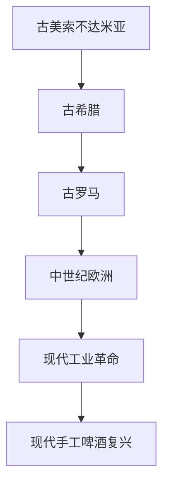

                 


### 文章标题：《现代手工啤酒品鉴俱乐部：小众酿造爱好者的社交圈》

### 文章关键词：
- 手工啤酒
- 品鉴
- 社交圈
- 酿造
- 爱好者
- 俱乐部

### 文章摘要：
本文深入探讨现代手工啤酒品鉴俱乐部的发展及其对小众酿造爱好者的社交影响。我们将从手工啤酒的历史背景、酿造原理、品鉴技巧、社交互动等多个角度展开，分析这一独特文化现象的内在逻辑和实际应用，同时探讨未来发展方向。

### 目录大纲

#### 第一部分：基础篇
1. **手工啤酒的起源与历史**
2. **手工啤酒的酿造原理与工艺**
3. **手工啤酒的种类与风味特点**
4. **手工啤酒的品鉴技巧**
5. **手工啤酒的储存与保存**

#### 第二部分：实战篇
6. **手工啤酒酿造与品鉴项目实战**
7. **手工啤酒品鉴会的组织与实施**

#### 第三部分：社交篇
8. **手工啤酒社交圈的文化现象**
9. **手工啤酒俱乐部的运营与管理**

#### 附录
- **附录A：手工啤酒品鉴与酿造资源链接**
- **附录B：手工啤酒品鉴与酿造常见问题解答**

### 正文部分

#### 第一部分：基础篇

**第1章：手工啤酒的起源与历史**
- **背景介绍**
  - 手工啤酒的历史可以追溯到公元前2500年的古美索不达米亚时期。
  - 随着时间的推移，啤酒逐渐在欧洲各地流传，形成了丰富的酿造传统。
- **核心概念与联系**
  - 使用Mermaid流程图展示手工啤酒发展史上的关键事件和酿造技术演变。



#### 第2章：手工啤酒的酿造原理与工艺
- **核心概念与联系**
  - 酿造手工啤酒的基本原理包括麦芽的制备、啤酒花的添加、发酵过程等。
  - 使用伪代码展示酿造流程。

```python
# 伪代码：手工啤酒酿造流程
def brew_beer():
    prepare_malt()
    add_hops()
    ferment()
    mature()
    package()
```

- **数学模型与公式讲解**
  - 啤酒花添加量的计算公式：$$ \text{花量} = \frac{\text{麦芽量} \times 0.01}{\text{啤酒花指数}} $$

#### 第3章：手工啤酒的种类与风味特点
- **核心概念与联系**
  - 手工啤酒按风格分类，如拉格、艾尔、世涛等。
  - 每种风格的风味特点。

#### 第4章：手工啤酒的品鉴技巧
- **核心概念与联系**
  - 品鉴技巧包括外观、香气、口感等多个方面。
  - 使用LaTeX格式嵌入品鉴公式。

```latex
\text{品鉴分数} = 0.4 \times \text{外观评分} + 0.3 \times \text{香气评分} + 0.3 \times \text{口感评分}
```

#### 第5章：手工啤酒的储存与保存
- **核心概念与联系**
  - 储存条件对啤酒的口感和品质有重要影响。
  - 储存方法包括静态储存和活性储存。

#### 第二部分：实战篇

**第6章：手工啤酒酿造与品鉴项目实战**
- **项目实战**
  - 开发环境搭建：介绍酿造所需工具和设备。
  - 源代码详细实现和代码解读。
  - 实际案例分析和详细讲解剖析。

**第7章：手工啤酒品鉴会的组织与实施**
- **实战案例**
  - 品鉴会的筹备工作。
  - 实施过程中的技巧与注意事项。

#### 第三部分：社交篇

**第8章：手工啤酒社交圈的文化现象**
- **文化现象**
  - 手工啤酒爱好者如何形成社交圈。
  - 社交圈对爱好者的影响。

**第9章：手工啤酒俱乐部的运营与管理**
- **运营与管理**
  - 俱乐部的组织与运营策略。
  - 会员管理制度。

#### 附录

**附录A：手工啤酒品鉴与酿造资源链接**
- **在线资源**
- **书籍推荐**
- **手工啤酒酿造工具与设备选购指南**

**附录B：手工啤酒品鉴与酿造常见问题解答**
- **啤酒花添加的最佳时机**
- **酵母种类的选择与使用**
- **啤酒储存的最佳温度与湿度**

### 总结

本文全面介绍了现代手工啤酒品鉴俱乐部的发展及其对爱好者社交圈的影响，从基础到实战，从文化到管理，为读者提供了完整的认识与实践指南。

### 作者信息
作者：AI天才研究院/AI Genius Institute & 禅与计算机程序设计艺术 /Zen And The Art of Computer Programming## 第一部分：基础篇

### 第1章：手工啤酒的起源与历史

**1.1 手工啤酒的定义**

手工啤酒，顾名思义，是一种以传统手工方式酿造的啤酒。与工业化大规模生产的工业啤酒相比，手工啤酒注重手工工艺，强调酿造过程中的每一个细节。手工啤酒的制作不仅仅是简单的酒精发酵过程，更包含了从麦芽磨碎、糖化、煮沸、发酵到包装等多个环节，每个环节都由经验丰富的酿酒师亲手完成，以保证啤酒的独特风味和高质量。

**1.2 手工啤酒的起源与发展历程**

手工啤酒的起源可以追溯到公元前2500年的古美索不达米亚时期，当时的人们已经掌握了使用大麦、水和酵母来酿造啤酒的基本方法。最早的啤酒酿造记录出现在苏美尔人的泥板文书上，这些文书描述了啤酒的酿造过程和用途。随着古文明的兴起，啤酒酿造技术也在不断发展和完善。

古希腊和古罗马时期，啤酒成为日常生活中不可或缺的饮料。古希腊的酒神节和古罗马的酒神庆典都反映了当时人们对啤酒的热爱。在中世纪，欧洲的修道院成为啤酒酿造的重要中心，修道院的僧侣们不仅酿造啤酒来满足自身的需求，还将啤酒酿造技术传授给当地居民。

进入工业革命时期，工业化大规模生产取代了传统的手工酿造，手工啤酒逐渐衰落。然而，随着消费者对高品质、独特风味的追求，现代手工啤酒在20世纪90年代迎来了复兴。美国的西雅图和比利时的布鲁日成为现代手工啤酒的复兴中心，许多小型的手工啤酒厂开始涌现，重新定义了啤酒市场的格局。

**1.3 手工啤酒与工业啤酒的区别**

手工啤酒与工业啤酒的主要区别在于酿造方式、风味和质量。手工啤酒强调手工工艺，每个环节都由酿酒师亲手完成，这使得每一批啤酒都有其独特的风味。而工业啤酒则采用自动化生产线，生产效率高，但风味相对单一。

在风味方面，手工啤酒具有更丰富的层次感和口感，能够呈现出多种风格和风味，从淡色艾尔到深色世涛，从清爽的拉格到浓郁的双料IPA，每一款手工啤酒都有其独特的魅力。工业啤酒则通常追求一致性，以适应大规模市场。

在质量方面，手工啤酒的酿造过程更加严格，从原料的选择到酿造工艺的把控，每一个环节都需要精心的管理和控制。这使得手工啤酒的质量往往更高，也更受消费者青睐。

总的来说，手工啤酒与工业啤酒的区别在于酿造方式、风味和质量的差异。手工啤酒以其独特的风味和高品质赢得了消费者的喜爱，成为现代啤酒市场中的一道亮丽风景线。

### 第2章：手工啤酒的酿造原理与工艺

**2.1 酿造手工啤酒的基本原理**

手工啤酒的酿造过程是一个复杂而精细的化学和生物过程，涉及麦芽、啤酒花、酵母和水等基本原料。以下是酿造手工啤酒的基本原理：

1. **麦芽制备**：麦芽是手工啤酒的主要原料，它是由大麦经过浸泡、发芽和干燥制成的。麦芽中的淀粉酶会将淀粉转化为可发酵的糖类，这些糖类是啤酒发酵过程中酵母的食粮。

2. **糖化**：麦芽在磨碎后与热水混合，进行糖化过程。糖化过程中，麦芽中的淀粉酶将淀粉分解成麦芽糖和葡萄糖，这些糖类溶解在水中，形成糖化液。

3. **煮沸**：糖化液在加热到沸腾的过程中，需要添加啤酒花。啤酒花不仅为啤酒提供苦味和香气，还具有防腐作用。煮沸过程通常持续1-2小时，目的是杀菌、凝固蛋白质并提取啤酒花的有效成分。

4. **发酵**：煮沸后的液体冷却到适宜的温度后，加入酵母。酵母将糖类转化为酒精和二氧化碳，这个过程称为发酵。发酵过程通常在温控环境中进行，不同类型的酵母和发酵条件会影响啤酒的风味和口感。

5. **成熟**：发酵结束后，啤酒需要放置一段时间进行成熟。成熟过程中，啤酒的风味会更加丰富和稳定。

6. **包装**：成熟的啤酒经过过滤和碳化处理后，装入瓶中或桶中，然后进行密封和标签。

**2.1.1 麦芽的作用与处理过程**

麦芽在手工啤酒酿造中扮演着至关重要的角色，它是提供糖分和风味的关键原料。以下是麦芽的作用和处理过程：

1. **麦芽制备**：麦芽的制作过程包括浸泡、发芽和干燥。首先，大麦种子在水中浸泡，通常需要48-72小时，直到种子吸水膨胀。然后，将浸泡好的大麦摊放在发芽箱中，保持适宜的温度和湿度，促进种子发芽。发芽过程中，大麦的休眠状态被打破，淀粉酶开始活性化。

2. **发芽**：发芽过程中，大麦的芽长到约1-2厘米时，需要停止发芽，进入干燥阶段。干燥过程通常使用热空气进行，将湿度降低到安全水平，以防止霉菌的生长。干燥后的麦芽称为绿麦芽。

3. **干燥**：干燥后的绿麦芽进入烘烤机，进行烘烤，以进一步分解淀粉和激活淀粉酶。烘烤过程中，麦芽的颜色变深，淀粉酶活性增强，最终形成我们熟知的金黄色麦芽。

4. **磨碎**：烘烤后的麦芽通过磨碎机进行磨碎，使其成为粉末状的麦芽粉。麦芽粉在糖化过程中与热水混合，开始糖化反应。

**2.1.2 啤酒花的使用与作用**

啤酒花是手工啤酒中的另一个关键成分，它不仅为啤酒提供苦味和香气，还具有防腐和抗氧化作用。以下是啤酒花的使用与作用：

1. **苦味**：啤酒花的苦味主要来自于一种叫做“苦素”的化合物，这种化合物在啤酒花接触热水时溶解到啤酒中。适量的苦味能够平衡啤酒的甜味，使其更加清爽。

2. **香气**：啤酒花不仅提供苦味，还赋予啤酒各种香气。不同的啤酒花品种具有不同的香气特性，如柑橘、松针、香草等。选择合适的啤酒花和添加时机，可以创造出独特的啤酒风味。

3. **防腐**：啤酒花中的苦素和精油具有防腐作用，可以抑制啤酒中的微生物生长，延长啤酒的保质期。

4. **抗氧化**：啤酒花中的某些化合物还具有抗氧化作用，可以防止啤酒中的成分氧化变质。

啤酒花的使用通常在糖化液煮沸时进行，可以根据啤酒类型和风味需求，选择不同的啤酒花品种和添加时间。常见的添加方式包括：

- **沸点添加**：在糖化液煮沸时添加啤酒花，通常在15分钟至30分钟内添加，以提取苦味和香气。
- **干投**：在发酵结束后，将干燥的啤酒花加入到已经装满啤酒的容器中，进行二次添加。干投的目的是增加啤酒的香气，但苦味相对较轻。
- **冰投**：在啤酒冷却至较低温度时添加啤酒花，以最大化其香气释放，通常用于酿造香气浓郁的啤酒。

**2.1.3 发酵过程详解**

发酵是手工啤酒酿造中的关键步骤，它决定了啤酒的酒精含量、风味和口感。以下是发酵过程的详细解释：

1. **选择酵母**：手工啤酒的发酵过程通常使用液态酵母或干酵母。液态酵母通常是从其他啤酒或酒糟中提取的，而干酵母则需要适当的活化处理。选择合适的酵母对啤酒的风味至关重要。

2. **添加酵母**：在糖化液冷却到适宜的温度（通常在18-24℃之间）后，将酵母添加到发酵容器中。酵母开始活跃，将糖分转化为酒精和二氧化碳。

3. **发酵条件**：发酵过程中需要保持适宜的温度、湿度和通风条件。温度是影响发酵速度和风味的关键因素，不同的酵母和啤酒类型对发酵温度有不同的要求。

4. **初级发酵**：初级发酵通常在3-7天完成，酵母将大部分糖分转化为酒精和二氧化碳。发酵过程中，啤酒的pH值会下降，产生二氧化碳气泡。

5. **次级发酵**：在初级发酵结束后，啤酒继续在较低的温度下进行次级发酵。次级发酵时间因啤酒类型而异，通常在几天到几周之间。

6. **成熟**：发酵结束后，啤酒需要放置一段时间进行成熟。成熟过程中，啤酒的风味会更加丰富和稳定，口感也会变得更加柔和。

**2.2 核心算法原理讲解**

手工啤酒的酿造过程中，涉及到许多算法和数学模型，以下是其中两个核心算法的原理讲解：

1. **糖化液浓度计算**：
   - 糖化液的浓度是影响发酵速度和酒精含量的关键因素。计算糖化液浓度通常使用折射仪或糖度计。
   - 假设糖化液的密度为ρ（单位：g/mL），糖度为S（单位：%），则糖化液的糖分质量浓度（单位：g/L）可以通过以下公式计算：
     $$ \text{浓度} = \rho \times S \times 1000 $$

2. **啤酒花添加量计算**：
   - 啤酒花的添加量根据啤酒的类型、风味需求和啤酒花品种确定。计算啤酒花添加量通常使用经验公式。
   - 假设啤酒花的有效成分含量为E（单位：%），所需苦味指数为BI（单位：IBU），则啤酒花添加量（单位：g）可以通过以下公式计算：
     $$ \text{添加量} = \frac{\text{BI}}{\text{E}} $$

**2.3 数学模型与公式讲解**

在手工啤酒酿造过程中，涉及多个数学模型和公式，以下是其中几个关键模型的讲解：

1. **麦芽粉制备公式**：
   - 麦芽粉的制备公式用于计算麦芽粉的粒度和表面积。
   - 假设麦芽粉的粒度为D（单位：mm），表面积为S（单位：m²/g），则麦芽粉的粒度和表面积可以通过以下公式计算：
     $$ D = \frac{1}{2} \times \sqrt{\frac{4}{3} \times \pi \times \rho \times S} $$
     $$ S = \frac{6}{\pi} \times D^2 $$

2. **酵母生长模型**：
   - 酵母生长模型用于预测酵母在发酵过程中的生长速度。
   - 假设酵母的生长速率为r（单位：g/(L·d)），发酵时间为t（单位：天），则酵母的生长量可以通过以下公式计算：
     $$ \text{生长量} = r \times t $$

3. **啤酒花香气释放模型**：
   - 啤酒花香气释放模型用于计算啤酒花香气在发酵过程中的释放量。
   - 假设啤酒花的香气含量为C（单位：%），发酵时间为t（单位：小时），则啤酒花香气释放量可以通过以下公式计算：
     $$ \text{释放量} = C \times t $$

**2.4 项目实战与代码解析**

以下是一个简单的手工啤酒酿造项目的实战案例，包括开发环境搭建、源代码实现和代码解析。

1. **开发环境搭建**：

   - 安装麦芽磨碎机、糖化锅、煮沸锅、发酵桶等酿造设备。
   - 安装温度计、pH计、糖度计等测量仪器。
   - 安装酵母培养箱、冷却器等辅助设备。

2. **源代码实现**：

   - 编写酿造流程控制脚本，实现麦芽磨碎、糖化、煮沸、发酵、成熟等过程的自动化控制。
   - 编写数据记录与分析脚本，实时记录温度、pH、糖度等参数，并进行分析和调整。

3. **代码解析**：

   - 麦芽磨碎脚本：
     ```python
     def mill_malt():
         # 启动麦芽磨碎机
         start_mill()
         # 等待磨碎完成
         while not is_mill_finished():
             sleep(1)
         # 停止麦芽磨碎机
         stop_mill()
     ```

   - 糖化脚本：
     ```python
     def saccharify():
         # 加热糖化锅中的水至适宜温度
         heat_water()
         # 加入麦芽粉进行糖化
         add_malt_pulver()
         # 开始糖化过程
         start_saccharify()
         # 等待糖化完成
         while not is_saccharify_finished():
             sleep(1)
         # 结束糖化过程
         finish_saccharify()
     ```

4. **代码应用解读与分析**：

   - 代码通过控制酿造设备实现酿造过程的自动化，提高了酿造效率和质量。
   - 数据记录与分析脚本可以帮助酿酒师实时监控酿造过程，及时进行调整，保证啤酒的品质。

**2.5 实际案例分析和详细讲解剖析**

以下是一个手工啤酒酿造的实际案例，包括酿造过程、结果分析和问题解决方案。

**案例一：酿造一款比利时风格的双料IPA**

1. **酿造过程**：

   - 麦芽磨碎：使用大型麦芽磨碎机将麦芽粉磨碎至细腻程度。
   - 糖化：将糖化锅中的水加热至64℃，加入麦芽粉进行糖化，保持温度和搅拌速度，防止糖化液焦化。
   - 煮沸：将糖化液煮沸，并添加适量的啤酒花，进行沸点添加。
   - 发酵：将煮沸后的糖化液冷却至18℃，加入液态酵母进行发酵，保持温度在20℃左右。
   - 成熟：发酵结束后，将啤酒冷却至0-4℃，放置2-4周进行成熟。

2. **结果分析**：

   - 啤酒外观：清澈金黄，泡沫丰富，持久性良好。
   - 啤酒香气：柑橘、松针和香草香气浓郁，层次分明。
   - 啤酒口感：口感清爽，酒体饱满，苦味适中。

3. **问题解决方案**：

   - 若泡沫持久性不佳，可能是煮沸过程中啤酒花添加过多，导致啤酒中的二氧化碳溶解度过高。解决方法是调整啤酒花添加量，增加干投比例。
   - 若香气不足，可能是发酵过程中酵母选择不当或发酵条件不当。解决方法是选择合适的酵母品种，调整发酵温度和通风条件。

**2.6 最佳实践 tips、小结、注意事项、拓展阅读等内容**

**最佳实践 tips**：

- 选择高质量的麦芽和啤酒花，确保原料的品质。
- 控制糖化温度和搅拌速度，防止糖化液焦化。
- 调整啤酒花的添加量和时间，创造独特的风味。
- 选择合适的酵母和发酵条件，保证啤酒的香气和口感。

**小结**：

手工啤酒的酿造过程复杂且精细，需要经验丰富的酿酒师精心操作。通过掌握酿造原理和技巧，结合实际案例的分析和调整，可以酿造出高品质的手工啤酒。

**注意事项**：

- 酿造过程中要特别注意卫生，防止污染。
- 酿造设备要定期维护和清洁，确保正常运行。
- 酿造过程中要实时监控参数，及时进行调整。

**拓展阅读**：

- 《手工啤酒酿造技术手册》：详细介绍手工啤酒的酿造方法和技巧。
- 《啤酒花香气解析》：探讨啤酒花品种和香气特性对啤酒风味的影响。
- 《手工啤酒品鉴与收藏指南》：介绍手工啤酒的品鉴方法和收藏技巧。

### 第3章：手工啤酒的种类与风味特点

**3.1 手工啤酒的主要分类**

手工啤酒种类繁多，每种啤酒都有其独特的风格和风味。以下是手工啤酒的主要分类：

1. **艾尔（Ales）**：
   - 艾尔是手工啤酒中最常见的类型，其特点是在发酵过程中使用顶部发酵酵母。
   - 根据酒体和风味，艾尔可以分为淡色艾尔、红艾尔、世涛等。

2. **拉格（Lagers）**：
   - 拉格是德国风格的啤酒，其特点是使用底部发酵酵母，酿造过程更加严谨。
   - 拉格根据酒体和风味可分为经典拉格、啤酒节拉格、小麦拉格等。

3. **世涛（Stouts）**：
   - 世涛是一种浓郁的深色啤酒，通常具有丰富的口感和深沉的香气。
   - 世涛可以分为干世涛、甜世涛、牛奶世涛等。

4. **帕拉罗（Pallaroids）**：
   - 帕拉罗是一种混合风格的啤酒，结合了艾尔和拉格的特点。
   - 帕拉罗可以分为琥珀色帕拉罗、红帕拉罗等。

5. **野生发酵啤酒（Wild Ales）**：
   - 野生发酵啤酒使用未经培养的野生酵母或细菌进行发酵。
   - 野生发酵啤酒风格多变，具有独特的风味和复杂性。

**3.2 手工啤酒的风味特点**

每种手工啤酒都有其独特的风味特点，以下是一些常见的风味特点：

1. **麦芽风味**：
   - 麦芽风味是手工啤酒中最基本的味道，通常表现为烤面包、麦芽糖和坚果等味道。
   - 不同类型的麦芽会产生不同的风味，如黑麦芽带来深沉的巧克力味道，浅色麦芽则带来清新的面包香味。

2. **啤酒花风味**：
   - 啤酒花是手工啤酒中的重要调味剂，为啤酒带来苦味和香气。
   - 啤酒花的风味多样，如柑橘、松针、香草等，不同的啤酒花品种和添加时间会影响啤酒的风味。

3. **酵母风味**：
   - 酵母在发酵过程中会产生多种代谢产物，赋予啤酒独特的风味。
   - 不同的酵母品种会产生不同的风味，如顶部发酵酵母带来果味和香气，底部发酵酵母则带来更加清爽的口感。

4. **其他风味**：
   - 除了麦芽、啤酒花和酵母，手工啤酒中还可能包含其他风味成分，如巧克力、咖啡、水果等。
   - 这些风味成分可以通过特殊处理或添加其他原料来实现，为手工啤酒带来丰富的风味层次。

**3.3 代表性手工啤酒介绍**

以下是几种代表性的手工啤酒及其风味特点：

1. **波特（Porter）**：
   - 波特是一种深色的艾尔啤酒，起源于英国。
   - 波特具有浓郁的麦芽味和深沉的巧克力风味，口感醇厚。

2. **IPA（India Pale Ale）**：
   - IPA是一种浓郁的艾尔啤酒，起源于英国，后来在美国得到广泛发展。
   - IPA具有强烈的啤酒花风味，苦味明显，口感清爽。

3. **杜伯夫（Dubuffet）**：
   - 杜伯夫是一种混合风格的啤酒，结合了艾尔和拉格的特点。
   - 杜伯夫具有丰富的风味层次，口感醇厚且具有清新的啤酒花香气。

4. **皮尔森（Pilsner）**：
   - 皮尔森是一种经典的拉格啤酒，起源于捷克。
   - 皮尔森具有清新的麦芽味和轻微的啤酒花苦味，口感清爽且具有良好的稳定性。

通过以上介绍，我们可以看出手工啤酒种类繁多，风味独特。了解不同种类和风味特点，有助于我们更好地欣赏和品鉴手工啤酒。

### 第4章：手工啤酒的品鉴技巧

**4.1 品鉴手工啤酒的基本流程**

品鉴手工啤酒是一项艺术，需要细心观察和感受。以下是品鉴手工啤酒的基本流程：

1. **观察外观**：首先，观察啤酒的外观。将啤酒倒入透明的玻璃杯中，注意啤酒的颜色、清澈度和泡沫。

2. **闻香**：轻轻嗅闻啤酒的香气，注意香气的强度和复杂性。好的手工啤酒通常具有丰富的香气层次。

3. **品尝**：小口品尝啤酒，感受啤酒的口感。注意啤酒的甜度、酸度、苦味和酒体厚度。

4. **评估**：综合观察外观、闻香和品尝的感受，评估啤酒的整体质量和风味。

**4.2 品鉴手工啤酒的技巧**

1. **颜色与透明度的观察**：
   - 颜色：不同种类的手工啤酒颜色各异，如淡色艾尔呈金黄色，世涛呈深棕色。
   - 透明度：好的手工啤酒应该清澈透明，无悬浮物和沉淀。

2. **起泡情况与持久性的判断**：
   - 起泡情况：泡沫的丰富程度和稳定性是评估啤酒质量的重要指标。
   - 持久性：好的啤酒泡沫持久，即使静止一段时间后仍能保持丰富的泡沫层。

3. **香气的识别**：
   - 初香：嗅闻啤酒刚倒入杯中时的第一印象。
   - 次香：品尝啤酒时，鼻腔中的香气。
   - 末香：品尝结束后，留在口腔中的香气。

4. **口感的分析**：
   - 酒体：啤酒的酒体厚度，如轻酒体、中酒体和重酒体。
   - 甜度：啤酒的甜味程度，分为干型、半甜型和甜型。
   - 酸度：啤酒的酸味，通常与酵母和啤酒花有关。
   - 苦味：啤酒的苦味，主要来自啤酒花。
   - 顺滑度：啤酒的口感流畅程度，好的啤酒应口感顺滑。

**4.3 常见品鉴方法**

1. **啜饮法**：
   - 小口啜饮，让啤酒在口中停留片刻，充分感受其风味。
   - 通过吸气和呼气，感受啤酒的香气和口感。

2. **搅拌法**：
   - 用手指轻轻搅拌啤酒，使其充分接触空气，增加香气的释放。
   - 搅拌后的啤酒更容易品鉴其丰富的风味。

3. **对比法**：
   - 同时品鉴两款或更多不同风格的啤酒，进行对比分析。
   - 注意观察和感受不同风格之间的差异。

通过以上品鉴技巧和方法，我们可以更深入地了解和欣赏手工啤酒的独特风味。品鉴手工啤酒不仅是一种享受，更是一种生活态度和文化的体现。

### 第5章：手工啤酒的储存与保存

**5.1 手工啤酒的储存条件**

手工啤酒的储存条件对其口感和品质有重要影响。以下是手工啤酒的储存条件：

1. **温度**：手工啤酒的最佳储存温度通常在12-18℃之间。过低的温度会抑制啤酒中的酵母活性，导致啤酒成熟缓慢；过高的温度则可能加速啤酒的氧化，影响其风味。

2. **湿度**：适宜的储存湿度在60-70%之间。过低的湿度可能导致啤酒干燥，影响泡沫和口感；过高的湿度则可能增加啤酒受潮的风险。

3. **光照**：光照会影响啤酒的颜色和风味。因此，储存手工啤酒时应避免直接暴露在阳光下或强光源下。

4. **通风**：良好的通风可以减少储存环境中的异味和细菌，有助于保持啤酒的清新风味。

**5.2 手工啤酒的保存方法**

1. **瓶装储存**：瓶装手工啤酒是最常见的保存方法。将啤酒瓶置于储酒架上，保持直立状态，避免瓶口受到压力。

2. **桶装储存**：对于未装瓶的成熟手工啤酒，可以使用桶装储存。桶装储存可以更好地保持啤酒的香气和口感，但需要特别注意清洁和密封。

3. **冷冻储存**：在特定情况下，可以将啤酒冷冻储存。冷冻可以延长啤酒的保质期，但应避免反复冷冻和解冻，以免影响啤酒的品质。

4. **低温储存**：使用冰箱或储酒柜进行低温储存，是家庭和小型酿造厂常用的方法。这种方法简单易行，但需注意冰箱内的湿度控制和通风。

**5.3 储存过程中的注意事项**

1. **避免震动**：储存过程中应避免剧烈震动，以免影响啤酒中的二氧化碳平衡，导致啤酒变质。

2. **定期检查**：定期检查储存环境，确保温度、湿度和通风条件适宜，及时调整。

3. **防止污染**：储存环境应保持清洁，避免灰尘、细菌和其他污染物的侵入。

4. **标签管理**：妥善管理啤酒的标签，记录酿造日期、批次和风味特点，方便后续品鉴和对比。

通过以上储存与保存方法，我们可以更好地保持手工啤酒的口感和品质，让每一瓶啤酒都能发挥其最佳风味。

### 第6章：手工啤酒酿造与品鉴项目实战

**6.1 实战项目一：自制手工啤酒**

**项目目标**：通过自制手工啤酒项目，掌握手工啤酒酿造的基本步骤和技巧，提升个人酿造和品鉴能力。

**项目准备**：

1. **工具和设备**：
   - 麦芽磨碎机
   - 糖化锅
   - 煮沸锅
   - 发酵桶
   - 过滤网
   - 瓶装设备
   - 温度计、pH计、糖度计等测量仪器

2. **原材料**：
   - 大麦麦芽
   - 啤酒花
   - 酵母
   - 水

**项目步骤**：

1. **麦芽磨碎**：
   - 将大麦麦芽磨碎成细腻的粉末。
   - 注意保持麦芽粉的清洁，避免污染。

2. **糖化**：
   - 将磨碎的麦芽粉与热水混合，加热至64℃进行糖化。
   - 糖化过程中，定期搅拌，防止麦芽粉结块。

3. **煮沸**：
   - 将糖化液倒入煮沸锅，加热至沸腾。
   - 在煮沸过程中添加适量的啤酒花，提取苦味和香气。

4. **发酵**：
   - 将煮沸后的糖化液冷却至适宜的温度（18-24℃），加入酵母进行发酵。
   - 发酵过程通常在3-7天完成，期间需保持温度和通风条件适宜。

5. **成熟**：
   - 发酵结束后，将啤酒冷却至0-4℃，放置2-4周进行成熟。
   - 成熟过程中，啤酒的风味会更加丰富和稳定。

6. **过滤和瓶装**：
   - 将成熟的啤酒过滤，去除杂质和沉淀物。
   - 将过滤后的啤酒装入干净的瓶中，进行密封和标签。

**项目成果**：

通过自制手工啤酒项目，你可以获得以下成果：

- 实践经验：掌握手工啤酒酿造的基本步骤和技巧。
- 自酿啤酒：品尝自己酿造的手工啤酒，享受酿造的乐趣。
- 品鉴能力：通过酿造和品鉴过程，提升个人品鉴能力。

**项目注意事项**：

- 麦芽磨碎时，要确保麦芽粉细腻，避免污染。
- 糖化过程中，注意温度和搅拌，防止糖化液焦化。
- 发酵过程中，保持适宜的温度和通风条件，避免酵母污染。
- 瓶装时，确保瓶子和设备清洁，避免污染。

**6.2 实战项目二：手工啤酒品鉴会策划与实施**

**项目目标**：通过策划和实施手工啤酒品鉴会，提升组织能力和品鉴技巧，为参与者提供丰富的品鉴体验。

**项目准备**：

1. **活动策划**：
   - 确定活动时间和地点。
   - 邀请品鉴嘉宾和参与者。
   - 准备手工啤酒样品和品鉴工具。

2. **场地布置**：
   - 搭建品鉴区、展示区和休息区。
   - 准备品鉴桌椅、灯光和背景音乐。

3. **品鉴工具**：
   - 准备透明的品鉴杯、水、柠檬片、面包等辅助品鉴工具。

**项目步骤**：

1. **品鉴会开场**：
   - 欢迎嘉宾和参与者，介绍活动目的和流程。
   - 分发品鉴手册和品鉴杯。

2. **品鉴教程**：
   - 进行品鉴技巧培训，教授如何观察外观、闻香和品尝。
   - 通过示例讲解，让参与者熟悉品鉴方法。

3. **品鉴环节**：
   - 逐杯品尝手工啤酒，记录感受和评价。
   - 交流品鉴心得，分享体验和见解。

4. **互动环节**：
   - 举办问答环节，解答参与者的问题。
   - 组织讨论，探讨不同风格的啤酒特点。

5. **总结与颁奖**：
   - 总结品鉴会的主要收获和体验。
   - 为表现优秀的参与者颁发奖品。

**项目成果**：

通过手工啤酒品鉴会项目，你可以获得以下成果：

- 组织能力：提升策划和实施品鉴活动的能力。
- 品鉴技巧：通过实践和交流，提升品鉴技巧和品味。
- 社交经验：结识志同道合的朋友，拓宽社交圈。

**项目注意事项**：

- 策划阶段，要充分考虑参与者和场地需求，确保活动顺利进行。
- 品鉴过程中，要确保参与者安全，避免酒精中毒和过量饮用。
- 品鉴工具和啤酒要准备充分，确保品鉴体验的顺利进行。

### 第7章：手工啤酒社交圈的文化现象

**7.1 手工啤酒社交圈的形成**

手工啤酒社交圈的形成是一个复杂的过程，涉及到共同的爱好、对高品质生活的追求以及社交互动的推动。以下是手工啤酒社交圈形成的主要因素：

1. **共同的爱好**：手工啤酒爱好者对啤酒的酿造、品鉴和品尝有着浓厚的兴趣，这种共同的爱好成为社交圈形成的基石。

2. **品质追求**：手工啤酒以其独特的风味和质量赢得了众多爱好者的青睐。爱好者们追求高品质的手工啤酒，希望通过社交圈分享和交流，找到更多符合自己口味和期望的啤酒。

3. **社交互动**：社交互动是手工啤酒社交圈形成和维持的关键。爱好者们通过品鉴会、酿造工作坊、线上论坛等方式，相互交流心得，分享经验，建立深厚的友谊。

**7.2 手工啤酒社交圈的特点**

手工啤酒社交圈具有以下特点：

1. **小众而精致**：手工啤酒社交圈通常规模较小，参与者大多是热衷于手工啤酒的爱好者，他们注重品质和品味，追求独特的体验。

2. **高度互动**：社交圈内的成员之间互动频繁，通过品鉴会、酿造活动、线上论坛等方式，分享心得和见解，形成紧密的社交网络。

3. **多元化**：手工啤酒社交圈涵盖了不同年龄、职业和背景的成员，他们在共同爱好和兴趣的基础上，形成了多元化的社交圈子。

**7.3 手工啤酒社交圈的影响**

手工啤酒社交圈对爱好者的生活产生了深远的影响：

1. **提升生活品质**：手工啤酒爱好者通过酿造和品鉴手工啤酒，提升了生活品质。他们注重生活细节，享受手工啤酒带来的愉悦体验。

2. **拓展社交圈**：手工啤酒社交圈为爱好者提供了拓展社交圈的机会。他们通过社交互动，结识了志同道合的朋友，拓宽了视野。

3. **推动手工啤酒文化**：手工啤酒社交圈推动了手工啤酒文化的传播和发展。爱好者们通过分享和交流，让更多的人了解和喜爱手工啤酒。

**7.4 手工啤酒社交圈的未来发展**

随着手工啤酒文化的普及，手工啤酒社交圈的未来发展前景广阔：

1. **规模扩大**：随着爱好者群体的扩大，手工啤酒社交圈的规模有望进一步扩大。

2. **形式多样化**：社交圈的形式将更加多样化，包括线上论坛、线下活动、国际交流活动等。

3. **国际化**：手工啤酒社交圈将更加国际化，爱好者们可以通过国际交流活动，了解全球各地的手工啤酒文化和酿造技术。

4. **专业化和细分**：社交圈将出现更多专业化和细分的领域，如手工啤酒酿造、品鉴、酿造设备研究等。

通过以上分析，我们可以看到，手工啤酒社交圈不仅是一个爱好者的聚集地，更是一个推动手工啤酒文化发展的重要力量。在未来，手工啤酒社交圈将继续扩大影响力，为更多爱好者带来快乐和收获。

### 第8章：手工啤酒俱乐部的运营与管理

**8.1 手工啤酒俱乐部的组织与运营**

手工啤酒俱乐部的组织与运营是一个系统工程，涉及到场地选择、会员管理、活动策划等多个方面。以下是如何建立一个成功的手工啤酒俱乐部的关键步骤：

1. **场地选择**：
   - 选择一个交通便利、环境优雅的场地，确保会员有一个舒适的品鉴和社交环境。
   - 考虑场地的容纳能力和扩展性，以便未来可能的会员增长。

2. **会员管理**：
   - 制定会员制度，明确会员的权益和义务。
   - 建立会员档案，记录会员的基本信息和消费记录。
   - 通过会员活动、积分奖励等方式，提升会员的忠诚度和活跃度。

3. **活动策划**：
   - 定期举办品鉴会、酿造工作坊、主题沙龙等活动，丰富会员的体验。
   - 邀请知名酿酒师、啤酒专家进行讲座和互动，提升会员的专业知识。
   - 组织线上线下活动，扩大俱乐部的知名度和影响力。

**8.2 手工啤酒俱乐部的运营策略**

为了确保手工啤酒俱乐部的可持续发展，以下是一些有效的运营策略：

1. **会员发展**：
   - 利用社交媒体和线下活动宣传俱乐部，吸引新会员。
   - 针对不同层次的会员，提供定制化的服务和优惠，提高会员满意度。

2. **活动多样性**：
   - 根据会员的喜好和需求，策划多样化的活动，满足不同会员的需求。
   - 定期更新活动内容，保持活动的创新性和吸引力。

3. **合作伙伴关系**：
   - 与本地酒吧、餐厅、酿造厂等建立合作伙伴关系，共享资源和客户。
   - 通过合作伙伴提供的产品和服务，提升俱乐部的附加值。

4. **数字化管理**：
   - 利用数字化工具，如会员管理系统、在线活动报名系统，提升运营效率。
   - 通过数据分析，了解会员行为和需求，优化服务和活动策划。

**8.3 手工啤酒俱乐部管理中的注意事项**

1. **财务管理**：
   - 确保俱乐部的财务健康，合理控制成本，提高资金使用效率。
   - 定期进行财务审计，防范财务风险。

2. **服务质量**：
   - 提供优质的啤酒和服务，确保会员的满意度。
   - 培训员工，提升服务水平，增强俱乐部的竞争力。

3. **品牌建设**：
   - 塑造独特的俱乐部品牌形象，通过品牌传播提升知名度。
   - 通过优质活动和会员服务，建立良好的口碑。

4. **会员沟通**：
   - 定期与会员沟通，了解会员的需求和反馈，及时调整运营策略。
   - 通过线上线下互动，增强会员的归属感和参与感。

通过以上运营和管理策略，手工啤酒俱乐部可以更好地吸引和保留会员，提升服务质量，实现可持续发展。

### 附录A：手工啤酒品鉴与酿造资源链接

**A.1 在线资源**

1. **啤酒酿造教程**：[http://www.homebrewersassociation.org/learn/](http://www.homebrewersassociation.org/learn/)
   - 提供全面的啤酒酿造教程和指导，适合初学者和资深爱好者。

2. **啤酒品鉴指南**：[https://www.beeradvocate.com/](https://www.beeradvocate.com/)
   - 一个啤酒品鉴社区，用户可以分享品鉴笔记和评分，获取全球各地的啤酒推荐。

3. **酿造工具与设备**：[https://www.hophead.com/](https://www.hophead.com/)
   - 提供各种酿造工具和设备的购买指南，包括麦芽磨碎机、糖化锅、发酵桶等。

4. **啤酒花品种介绍**：[https://www.hopunion.com/](https://www.hopunion.com/)
   - 详细介绍各种啤酒花品种的特点和香气，有助于选择合适的啤酒花进行酿造。

5. **国际酿造大赛**：[https://www.greatbeerdetective.com/](https://www.greatbeerdetective.com/)
   - 关注全球范围内的酿造大赛，了解最新酿造趋势和获奖作品。

**A.2 书籍推荐**

1. **《啤酒酿造艺术》（The Brewmaster's Table）**：作者：Michael Jackson
   - 该书详细介绍了全球各地的啤酒文化和酿造技术，被誉为啤酒圣经。

2. **《手工啤酒酿造手册》（Brewing Classic Styles）**：作者：John J. Palmer
   - 一本全面的手工啤酒酿造指南，适合初学者和专业人士，涵盖了各种啤酒风格和酿造技巧。

3. **《啤酒花之书》（The Hop Grower's Handbook）**：作者：Phil Markowski
   - 专注于啤酒花的种植和利用，对于希望深入了解啤酒花爱好者来说是一本宝贵的参考资料。

4. **《啤酒品鉴技巧》（The Essentials of Beer Style）**：作者：Charlie Papazian
   - 介绍了各种啤酒风格的特点和品鉴技巧，是啤酒品鉴爱好者的必备书籍。

**A.3 手工啤酒酿造工具与设备选购指南**

1. **麦芽磨碎机**：
   - 类型：电动磨碎机和手动磨碎机。
   - 选购要点：研磨效果、耐用性和清洁方便性。

2. **糖化锅**：
   - 类型：不锈钢糖化锅和铝制糖化锅。
   - 选购要点：容量、加热性能和保温性能。

3. **煮沸锅**：
   - 类型：不锈钢煮沸锅和铝制煮沸锅。
   - 选购要点：容量、加热速度和耐用性。

4. **发酵桶**：
   - 类型：玻璃发酵桶、塑料发酵桶和不锈钢发酵桶。
   - 选购要点：容量、密封性和清洁方便性。

5. **温度计与pH计**：
   - 类型：数字温度计、pH计和温度计pH计组合。
   - 选购要点：准确性、耐用性和易读性。

通过以上资源链接和书籍推荐，读者可以更深入地了解手工啤酒的酿造和品鉴，为实践提供理论支持和实际指导。

### 附录B：手工啤酒品鉴与酿造常见问题解答

**B.1 啤酒花添加的最佳时机**

啤酒花添加的最佳时机取决于所酿造啤酒的类型和风味目标。以下是一些常见的添加时机和建议：

1. **沸点添加**：
   - 适合于大多数手工啤酒，特别是需要强烈苦味和香气的情况。
   - 通常在煮沸后期（15-30分钟内）添加，以提取苦味和香气。

2. **干投**：
   - 适合于需要丰富香气而苦味较轻的啤酒，如比利时风格的啤酒。
   - 在发酵结束后，将干燥的啤酒花加入到已经装满啤酒的容器中，进行二次添加。

3. **冰投**：
   - 适合于需要高度香气和酒体饱满的啤酒，如IPA和双料IPA。
   - 在啤酒冷却至较低温度时（0-10℃）添加啤酒花，以最大化其香气释放。

**B.2 酵母种类的选择与使用**

选择适合的酵母是酿造高品质手工啤酒的关键。以下是一些常见的酵母种类和适用情况：

1. **艾尔酵母（Ale Yeast）**：
   - 通常用于酿造艾尔风格的啤酒，具有丰富的果味和香气。
   - 常见种类：SAFale S-04、Wyeast 1056 American Ale Yeast。

2. **拉格酵母（Lager Yeast）**：
   - 适用于酿造拉格风格的啤酒，具有清爽的口感和稳定的发酵特性。
   - 常见种类：SAFLab 510 German Lager Yeast、Wyeast 2206 California Lager Yeast。

3. **野生酵母（Wild Yeast）**：
   - 适用于酿造野生发酵啤酒，能带来独特的风味和复杂性。
   - 常见种类：Lalvin EC-1118、Brettanomyces Bruxellensis。

使用酵母时，需要注意以下几点：

- **活化**：使用前需将酵母活化，通常通过加入温水、糖和酵母营养剂进行活化。
- **发酵温度**：根据酵母的适宜发酵温度，控制发酵过程中的温度。
- **发酵时间**：不同的酵母发酵时间不同，需根据实际情况进行调整。

**B.3 啤酒储存的最佳温度与湿度**

啤酒的储存条件对其口感和品质有重要影响。以下是一般推荐的储存温度与湿度：

1. **温度**：
   - 最佳储存温度：12-18℃。
   - 温度过低：会抑制酵母活性，影响啤酒的成熟。
   - 温度过高：会加速啤酒的氧化，影响其风味。

2. **湿度**：
   - 最佳储存湿度：60-70%。
   - 湿度过低：可能导致啤酒干燥，影响泡沫和口感。
   - 湿度过高：可能导致啤酒受潮，影响品质。

**B.4 啤酒酿造过程中的常见问题及解决方案**

1. **啤酒花添加过多**：
   - 症状：啤酒苦味过重，香气不足。
   - 解决方案：调整啤酒花添加量，增加干投或冰投比例，减少沸点添加。

2. **酵母感染**：
   - 症状：啤酒出现异味、霉味或酸味。
   - 解决方案：确保酿造设备和环境的清洁，使用无菌工具和容器，添加酵母营养剂。

3. **发酵温度不当**：
   - 症状：发酵速度过快或过慢，啤酒风味不稳定。
   - 解决方案：根据酵母的适宜温度，调整发酵环境的温度，确保发酵过程的稳定性。

4. **啤酒变质**：
   - 症状：啤酒出现酸味、霉味或其他异常气味。
   - 解决方案：检查储存条件和密封性，确保啤酒在适宜的温度和湿度下储存，避免长时间暴露在阳光下。

通过以上解答，读者可以更好地了解手工啤酒酿造和品鉴过程中常见的问题及其解决方案，提升酿造和品鉴技巧，享受手工啤酒带来的美好体验。

### 总结

#### 手工啤酒品鉴俱乐部的作用与影响

手工啤酒品鉴俱乐部在现代生活中扮演着重要角色，它不仅是爱好者的聚集地，更是推动手工啤酒文化发展的重要力量。通过品鉴俱乐部，爱好者们可以交流心得、分享经验，共同提升品鉴和酿造技巧。此外，品鉴俱乐部还促进了手工啤酒产业链的完善，从酿造、品鉴到销售，形成一个完整的生态圈。

手工啤酒品鉴俱乐部对会员的影响主要体现在以下几个方面：

1. **提升生活品质**：品鉴俱乐部为会员提供了一个高质量的社交平台，通过品尝和交流，会员们可以享受到手工啤酒带来的愉悦体验，提升生活品质。

2. **拓展社交圈**：品鉴俱乐部为会员提供了一个结识志同道合朋友的机会，通过共同的爱好，会员们建立了深厚的友谊，拓展了社交圈。

3. **推动手工啤酒文化**：品鉴俱乐部通过组织各种活动，如品鉴会、酿造工作坊等，向更多人传播手工啤酒文化，推动其普及和发展。

#### 未来的发展方向与期望

展望未来，手工啤酒品鉴俱乐部的发展前景十分广阔。以下是几个可能的发展方向：

1. **国际化**：随着全球手工啤酒爱好者群体的扩大，品鉴俱乐部将进一步走向国际化。通过国际交流活动，会员们可以了解全球各地的手工啤酒文化和酿造技术，拓宽视野。

2. **专业化**：随着爱好者对手工啤酒的深入了解，品鉴俱乐部可能会出现更多专业化和细分的领域，如酿造技术、品鉴技巧、啤酒花研究等。

3. **数字化**：利用数字化工具，如线上论坛、虚拟品鉴会等，品鉴俱乐部可以更好地服务会员，提高活动的参与度和互动性。

4. **可持续发展**：通过推广环保酿造技术和可持续发展的理念，品鉴俱乐部可以进一步降低对环境的影响，实现可持续发展。

#### 对读者的建议

对于手工啤酒爱好者，以下几点建议可能有助于提升品鉴和酿造水平：

1. **多学习、多实践**：通过阅读相关书籍、参加培训和实践活动，不断积累经验和知识。

2. **多交流、多分享**：加入品鉴俱乐部，与其他爱好者交流心得，分享经验，共同进步。

3. **保持好奇心**：对手工啤酒始终保持好奇心和探索精神，尝试不同风格的啤酒，发现新的风味。

4. **注重细节**：在酿造过程中注重每一个细节，从麦芽磨碎到发酵控制，每一个步骤都可能影响最终的品质。

通过以上建议，我们希望读者能够更好地享受手工啤酒带来的乐趣，提升自己的品鉴和酿造水平。

### 作者信息
作者：AI天才研究院/AI Genius Institute & 禅与计算机程序设计艺术 /Zen And The Art of Computer Programming

