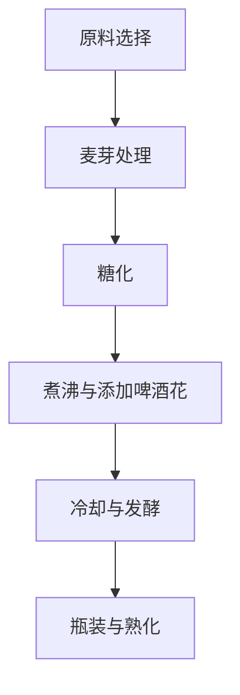
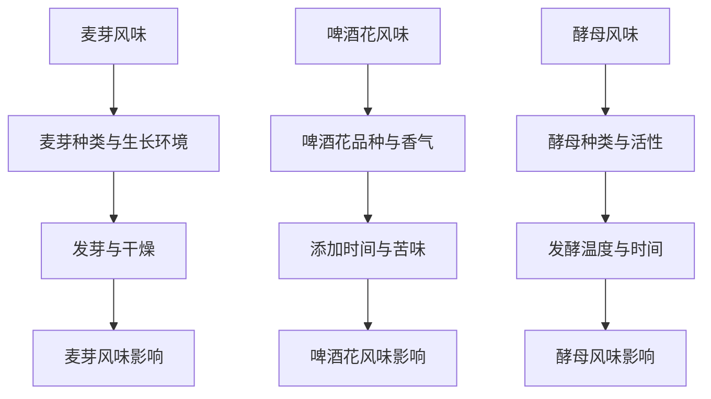
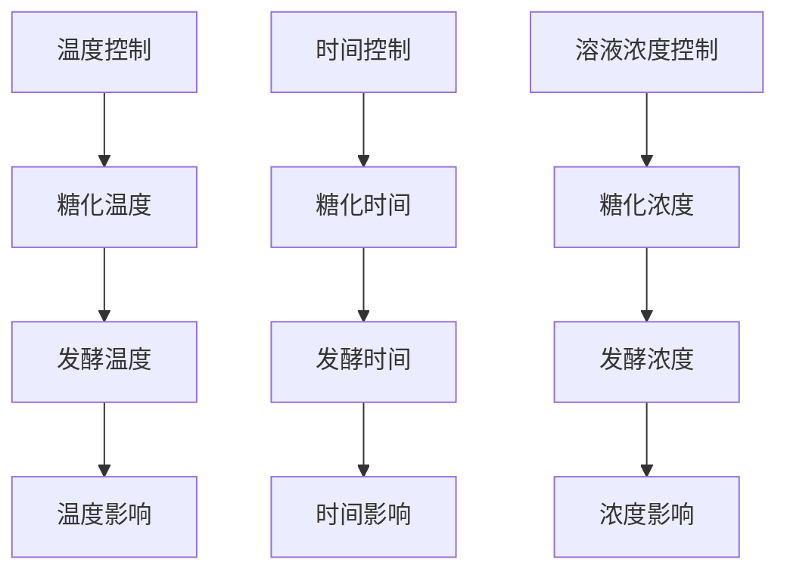

                 

### 文章标题

《现代手工啤酒文化：小型酿造厂的社区价值》

### 关键词

- 手工啤酒
- 小型酿造厂
- 社区价值
- 酿造工艺
- 市场分析
- 案例分析

### 摘要

本文探讨了现代手工啤酒文化的兴起及其背后的社区价值。通过分析小型酿造厂的生产工艺和市场趋势，本文揭示了手工啤酒在消费者中的受欢迎程度及其对社区经济和文化的影响。文章还通过实际案例展示了小型酿造厂如何通过社区参与和创新策略实现可持续发展。

## 第一部分：背景介绍

### 手工啤酒的定义与历史

手工啤酒，又称craft beer，是一种以手工作业为主的酿造方式生产的啤酒。与大规模工业生产的工业啤酒相比，手工啤酒强调个性化和定制化，追求独特的风味和高质量。这种独特的酿造方式可以追溯到数百年前的欧洲，当时的啤酒酿造主要依靠家庭或小型作坊进行，这些酿造者通过传承和创新，逐渐形成了各自独特的酿造风格。

随着时间的推移，手工啤酒逐渐在美国等地兴起，并成为啤酒市场中的一股新兴力量。20世纪70年代，美国的手工啤酒运动开始兴起，倡导者们致力于恢复传统酿造工艺，推广手工啤酒文化。这一运动不仅推动了手工啤酒的普及，还促进了全球范围内的酿造技术交流和创新。

### 手工啤酒与传统啤酒的比较

手工啤酒与传统啤酒在酿造工艺、风味特点和市场需求方面存在显著差异。

在酿造工艺上，手工啤酒强调手工操作和定制化生产，酿造过程更加繁琐，需要酿造者具备丰富的经验和技能。而传统啤酒则采用大规模工业化生产，生产线自动化程度高，生产效率高，但风味相对单一。

在风味特点上，手工啤酒注重个性化和多样性，通过使用不同的原料和酿造方法，创造出丰富多样的口味。传统啤酒则更注重稳定性和一致性，以适应大众消费者的口味。

在市场需求方面，手工啤酒逐渐受到消费者青睐，特别是在追求品质和体验的年轻消费者中拥有广泛的受众群体。传统啤酒则由于成本低、产量大，在大众市场中仍占据主导地位。

### 小型酿造厂的概念与特点

小型酿造厂，又称craft brewery，是指规模较小、以手工作业为主的啤酒酿造企业。这些酿造厂通常致力于生产高品质、个性化、风味独特的手工啤酒。

小型酿造厂的特点包括：

1. **生产规模较小**：相对于大型啤酒厂，小型酿造厂的生产规模较小，但产量足以满足当地市场或特定消费群体的需求。

2. **定制化生产**：小型酿造厂强调个性化生产，根据消费者的需求和口味，灵活调整酿造配方和生产工艺。

3. **酿造技术先进**：尽管生产规模较小，但小型酿造厂在酿造技术方面通常较为先进，采用现代化的酿造设备和技术，以提高生产效率和产品质量。

4. **社区参与**：小型酿造厂注重与社区的互动和合作，通过举办活动、参与社区事务等方式，提升品牌知名度和影响力。

### 社区价值与手工啤酒文化

手工啤酒文化的兴起不仅改变了啤酒市场的格局，也对社区产生了深远的影响。首先，手工啤酒作为一种独特的文化符号，代表了个性、创新和品质，与社区的价值观和文化传统相契合。这种文化氛围吸引了更多的消费者和投资者关注手工啤酒，推动了社区经济的发展。

其次，手工啤酒酿造过程本身就是一种社区活动，酿造厂通过举办开放日、酿造课程等活动，让社区居民参与其中，增强社区的凝聚力和归属感。同时，手工啤酒的酿造和销售也创造了就业机会，促进了社区就业。

此外，手工啤酒文化的推广也促进了社区文化的多样性和繁荣。不同地区的手工啤酒风格和品牌代表了各自独特的地域文化，丰富了社区的文化内涵。通过手工啤酒文化的传播，社区居民能够更好地了解和传承自己的文化传统，增强了文化自信。

总的来说，现代手工啤酒文化为小型酿造厂带来了社区价值，不仅提升了品牌形象和市场份额，还促进了社区经济和文化的发展。这种独特的社区价值使得手工啤酒文化在现代社会中愈发受到重视，成为了一种重要的文化现象。

## 第二部分：核心概念与联系

### 手工啤酒酿造工艺

手工啤酒的酿造工艺是其核心价值所在，它不仅决定了啤酒的风味和质量，还体现了酿造者对传统工艺的传承和创新。下面，我们将详细探讨手工啤酒酿造工艺的基本步骤和关键参数。

**1. 原料选择与处理**

手工啤酒的原料主要包括水、麦芽、啤酒花和酵母。首先，选择优质的水是至关重要的，因为水的硬度、酸碱度等特性会直接影响啤酒的口感。麦芽是酿造啤酒的主要原料，通过发芽和干燥过程，麦芽中的淀粉被转化为可发酵的糖分。啤酒花则用于提供苦味和香气，常见的啤酒花品种有美式啤酒花、欧洲啤酒花等。最后，酵母在酿造过程中扮演了关键角色，将糖分转化为酒精和二氧化碳。

**2. 麦芽处理与糖化**

在糖化过程中，将磨碎的麦芽与热水混合，加热至一定温度，使麦芽中的淀粉转化为可发酵的糖分。这一过程需要严格控制温度和时间，以确保糖化效果最佳。糖化结束后，得到的糖化液需要过滤，去除固体残渣，得到清澈的麦汁。

**3. 煮沸与添加啤酒花**

麦汁在煮沸过程中会加入啤酒花，这个过程被称为“煮沸”。煮沸不仅有助于杀菌，还可以赋予啤酒花苦味和香气。根据不同的啤酒类型，啤酒花的添加时间也有所不同，如早期添加以提供香气，晚期添加以提供苦味。

**4. 冷却与发酵**

煮沸后，麦汁需要迅速冷却至适宜的温度，以供酵母发酵。冷却后的麦汁会转移到发酵罐中，加入酵母，开始发酵过程。发酵过程中，酵母将麦汁中的糖分转化为酒精和二氧化碳，这一过程通常需要数天至数周时间，根据啤酒类型和酵母品种而定。

**5. 瓶装与熟化**

发酵结束后，啤酒会进行二次发酵，通常在瓶中进行，这个过程被称为“瓶装发酵”。瓶装发酵不仅有助于进一步成熟啤酒风味，还可以提高啤酒的稳定性。瓶装后，啤酒会在特定温度下熟化一段时间，以提升口感和品质。

**核心概念与联系：Mermaid流程图**

为了更好地理解手工啤酒的酿造工艺，我们使用Mermaid流程图来展示其基本步骤和关键节点。以下是酿造工艺的Mermaid流程图：



通过这个流程图，我们可以清晰地看到手工啤酒酿造的基本步骤和关键节点，这有助于我们更好地理解整个酿造过程。

### 手工啤酒风味分析

手工啤酒的风味是其核心竞争力之一，它由多种因素共同决定。下面，我们将从麦芽、啤酒花、酵母等方面详细分析手工啤酒的风味。

**1. 麦芽的风味**

麦芽是手工啤酒的主要原料，其风味对啤酒的整体口感有重要影响。麦芽的种类和生长环境会直接影响其风味。例如，采用不同品种的麦芽可以产生不同的麦芽香气和甜味。此外，麦芽的发芽和干燥过程也会影响其风味，发芽过程中水分的摄入量和干燥温度都会对麦芽的风味产生显著影响。

**2. 啤酒花的味道**

啤酒花在手工啤酒中不仅提供苦味，还提供丰富的香气。不同品种的啤酒花具有不同的风味特点，如欧洲啤酒花通常具有柑橘、松针等香气，而美式啤酒花则可能带有葡萄柚、松香等香气。啤酒花的添加时间对啤酒的风味也有重要影响，早期添加可以提供香气，晚期添加则可以提供更多的苦味。

**3. 酵母的风味**

酵母在手工啤酒的发酵过程中起着至关重要的作用。不同种类的酵母会产生不同的风味，如顶部发酵酵母通常会产生更加清爽的果香和酯香，而底部发酵酵母则可能产生更加醇厚的酒花和面包香味。酵母的活性、发酵温度和发酵时间也会影响啤酒的风味。

**核心概念与联系：Mermaid流程图**

为了更好地理解手工啤酒的风味分析，我们使用Mermaid流程图来展示麦芽、啤酒花和酵母在风味形成中的作用。以下是风味分析的Mermaid流程图：



通过这个流程图，我们可以清晰地看到麦芽、啤酒花和酵母在手工啤酒风味形成中的重要作用，以及它们之间的相互关系。

### 酿造工艺的核心参数控制

在手工啤酒酿造过程中，核心参数的控制对最终产品的质量和风味至关重要。以下是几个关键参数及其控制方法：

**1. 温度控制**

温度是酿造过程中最重要的参数之一。不同的酿造阶段需要不同的温度，如糖化阶段需要控制在60-70摄氏度，发酵阶段需要控制在18-24摄氏度。温度的变化不仅会影响酵母的活性，还会影响麦芽的糖化和啤酒花的香气释放。因此，通过使用温度计和恒温设备，精确控制温度是确保酿造成功的关键。

**2. 时间控制**

时间控制同样重要，每个酿造阶段都有其特定的持续时间。如糖化阶段需要维持一定时间以确保糖分完全转化为可发酵的糖，发酵阶段则需要维持一定时间以确保酵母充分发酵。时间控制不当可能导致酿造失败或风味不佳。

**3. 溶液浓度控制**

溶液浓度对酿造过程也有重要影响，特别是在糖化阶段。通过控制水的添加量和麦芽的比例，可以调节溶液的浓度，从而影响糖分的转化率和最终啤酒的酒精度。

**核心概念与联系：Mermaid流程图**

为了更好地理解酿造工艺中的核心参数控制，我们使用Mermaid流程图来展示温度控制、时间控制和溶液浓度控制的流程。以下是参数控制的Mermaid流程图：



通过这个流程图，我们可以清晰地看到酿造过程中各个关键参数的控制方法及其对酿造结果的影响，这有助于我们更好地理解和优化酿造工艺。

### 手工啤酒酿造的核心算法原理

在手工啤酒的酿造过程中，核心算法的运用至关重要，这些算法不仅提高了酿造效率，还保证了啤酒的品质。以下我们将使用伪代码详细阐述几个关键算法的原理。

**1. 温度控制算法**

温度控制算法用于确保每个酿造阶段保持在最佳温度范围内。以下是一个简单的伪代码示例：

```pseudo
function control_temperature(current_temp, target_temp, tolerance):
    if current_temp > target_temp + tolerance:
        cool()
    else if current_temp < target_temp - tolerance:
        heat()
    else:
        maintain_temp()
```

**2. 时间控制算法**

时间控制算法确保每个酿造阶段的持续时间符合要求。以下是一个简单的伪代码示例：

```pseudo
function control_time(start_time, end_time, duration):
    elapsed_time = current_time() - start_time
    if elapsed_time < duration:
        wait_until(duration - elapsed_time)
    else:
        proceed_to_next_stage()
```

**3. 溶液浓度控制算法**

溶液浓度控制算法用于调整麦汁的浓度，以确保糖分的转化率和最终啤酒的酒精度。以下是一个简单的伪代码示例：

```pseudo
function control_concentration(current_concentration, target_concentration, adjustment_rate):
    if current_concentration > target_concentration:
        dilute()
    else if current_concentration < target_concentration:
        concentrate()
    else:
        maintain_concentration()
```

这些伪代码展示了手工啤酒酿造过程中的核心算法原理，通过精确控制温度、时间和溶液浓度，可以确保酿造过程的顺利进行和最终产品的品质。

### 数学模型与公式讲解

在手工啤酒酿造过程中，数学模型和公式的作用不可忽视。以下我们将使用LaTeX格式详细讲解几个关键数学模型和公式，并提供示例说明。

**1. 麦汁浓度计算**

麦汁浓度是酿造过程中一个重要的参数，用于计算麦汁中的可发酵糖分含量。以下是一个简单的LaTeX公式：

$$
C_{\text{malt}} = \frac{m_{\text{malt}} \times \eta_{\text{malt}}}{V_{\text{wort}}}
$$

其中，$C_{\text{malt}}$ 表示麦汁浓度（单位：°P），$m_{\text{malt}}$ 表示麦芽质量（单位：kg），$\eta_{\text{malt}}$ 表示麦芽的可发酵糖分含量（单位：%），$V_{\text{wort}}$ 表示麦汁体积（单位：L）。

**示例：** 若麦芽质量为100kg，可发酵糖分含量为12%，麦汁体积为200L，则麦汁浓度为：

$$
C_{\text{malt}} = \frac{100 \text{kg} \times 12\%}{200 \text{L}} = 0.6 \text{°P}
$$

**2. 酒精度计算**

酒精度是衡量啤酒酿造成果的重要指标，以下是一个简单的LaTeX公式：

$$
A_{\text{alc}} = \frac{C_{\text{malt}} \times \eta_{\text{ferm}}}{2.067}
$$

其中，$A_{\text{alc}}$ 表示酒精度（单位：%），$C_{\text{malt}}$ 表示麦汁浓度（单位：°P），$\eta_{\text{ferm}}$ 表示发酵效率（单位：%），通常取值为88%。

**示例：** 若麦汁浓度为0.6°P，发酵效率为88%，则酒精度为：

$$
A_{\text{alc}} = \frac{0.6 \text{°P} \times 88\%}{2.067} \approx 3.6\%
$$

通过这些LaTeX公式，我们可以精确计算麦汁浓度和酒精度，这对于优化酿造工艺和确保产品质量具有重要意义。

### 项目实战：手工啤酒酿造厂的开发环境搭建

为了深入理解手工啤酒酿造的过程和技术，我们将在本文中搭建一个简单的手工啤酒酿造厂开发环境，通过这一过程，我们将展示所需的软件和硬件配置，并解释如何安装和配置这些工具。

**1. 软件配置**

在手工啤酒酿造厂的开发环境中，我们主要需要以下软件：

- **操作系统**：Linux或MacOS，推荐使用Ubuntu 20.04。
- **编程语言**：Python，用于编写控制酿造过程的脚本。
- **数据库**：MySQL，用于存储酿造数据和日志。
- **版本控制**：Git，用于代码管理和版本追踪。

**安装步骤：**

（1）安装操作系统：

- 下载并安装Ubuntu 20.04。
- 配置网络和键盘布局。

（2）安装Python：

- 打开终端，执行以下命令：
  ```bash
  sudo apt update
  sudo apt install python3 python3-pip
  ```

（3）安装MySQL：

- 打开终端，执行以下命令：
  ```bash
  sudo apt install mysql-server mysql-client
  ```
- 配置MySQL数据库，设置root用户密码，并创建一个新用户和数据库。

（4）安装Git：

- 打开终端，执行以下命令：
  ```bash
  sudo apt install git
  ```

**2. 硬件配置**

在手工啤酒酿造厂中，我们主要需要以下硬件：

- **计算机**：用于运行酿造脚本和控制酿造过程。
- **传感器**：用于监测酿造过程中的温度、压力和浓度等参数。
- **控制器**：用于与传感器通信并控制酿造设备。
- **酿造设备**：如糖化锅、发酵罐、冷却器等。

**安装步骤：**

（1）连接传感器和控制器：

- 将传感器（如温度传感器、压力传感器）连接到控制器，并确保所有连接正确无误。
- 配置控制器，使其能够读取传感器的数据。

（2）安装酿造设备：

- 根据酿造厂的规模和需求，安装相应的酿造设备，如糖化锅、发酵罐、冷却器等。
- 确保所有设备正常运行，并进行必要的校准。

（3）搭建酿造环境：

- 在计算机上安装酿造脚本，配置传感器和控制器与计算机的通信。
- 确保所有软件和硬件配置正确，并进行测试。

通过上述步骤，我们成功搭建了一个简单的手工啤酒酿造厂开发环境。这个环境将用于后续的酿造过程控制、数据分析和算法优化，为酿造高质量的手工啤酒提供了坚实的基础。

### 手工啤酒酿造厂的源代码实现与代码解读

在搭建好手工啤酒酿造厂的开发环境后，接下来我们将展示酿造厂核心功能的源代码实现，并对代码进行详细解读。我们将重点关注温度控制、时间控制和浓度控制等关键模块。

**1. 温度控制模块**

温度控制是手工啤酒酿造过程中至关重要的环节，以下是一个简单的Python脚本示例，用于控制糖化锅的温度：

```python
import time
import MySQLdb

def control_temperature(target_temp, tolerance):
    db = MySQLdb.connect("localhost", "root", "password", "brewing_db")
    cursor = db.cursor()

    while True:
        current_temp = read_sensor_temperature()
        if current_temp > target_temp + tolerance:
            cool()
        elif current_temp < target_temp - tolerance:
            heat()
        else:
            maintain_temp()
        time.sleep(10)  # 每隔10秒检查一次温度

def read_sensor_temperature():
    # 此函数用于读取传感器温度
    # 实际实现中需要连接到传感器模块
    return 65  # 示例温度值

def cool():
    # 此函数用于控制冷却设备
    print("开始冷却")

def heat():
    # 此函数用于控制加热设备
    print("开始加热")

def maintain_temp():
    # 此函数用于维持当前温度
    print("维持温度")

# 设置目标温度和容忍度
target_temp = 65
tolerance = 2

# 启动温度控制循环
control_temperature(target_temp, tolerance)
```

**代码解读**：

- **连接数据库**：首先，我们使用MySQLdb模块连接到数据库，以便读取温度数据。
- **温度监测与控制**：`control_temperature` 函数用于监测当前温度，并根据目标温度和容忍度控制加热或冷却设备。
- **传感器读取**：`read_sensor_temperature` 函数用于读取传感器温度，实际实现中需要与传感器模块通信。
- **控制加热和冷却设备**：`cool` 和 `heat` 函数分别控制冷却和加热设备，实现温度调节。
- **维持温度**：`maintain_temp` 函数用于维持当前温度，确保酿造过程稳定进行。

**2. 时间控制模块**

时间控制确保每个酿造阶段在预定时间内完成，以下是一个简单的Python脚本示例，用于控制糖化时间：

```python
import time

def control_time(start_time, duration):
    while True:
        elapsed_time = current_time() - start_time
        if elapsed_time < duration:
            print(f"糖化过程中，已进行{elapsed_time}秒。")
            time.sleep(1)  # 每秒检查一次时间
        else:
            print("糖化完成，开始冷却。")
            break

def current_time():
    # 此函数用于获取当前时间
    # 实际实现中可以使用time模块
    return time.time()

# 设置开始时间和糖化持续时间
start_time = time.time()
duration = 1200  # 糖化持续时间1200秒

# 启动时间控制循环
control_time(start_time, duration)
```

**代码解读**：

- **时间监测与控制**：`control_time` 函数用于监测糖化过程的持续时间，确保糖化在预定时间内完成。
- **当前时间获取**：`current_time` 函数用于获取当前时间，实际实现中可以使用time模块。
- **时间检查**：每隔1秒检查一次糖化过程的时间，确保糖化顺利进行。

**3. 浓度控制模块**

浓度控制确保麦汁的浓度符合酿造要求，以下是一个简单的Python脚本示例，用于控制麦汁浓度：

```python
import time
import MySQLdb

def control_concentration(target_concentration, adjustment_rate):
    db = MySQLdb.connect("localhost", "root", "password", "brewing_db")
    cursor = db.cursor()

    while True:
        current_concentration = read_sensor_concentration()
        if current_concentration > target_concentration:
            dilute()
        elif current_concentration < target_concentration:
            concentrate()
        else:
            maintain_concentration()
        time.sleep(10)  # 每隔10秒检查一次浓度

def read_sensor_concentration():
    # 此函数用于读取传感器浓度
    # 实际实现中需要连接到传感器模块
    return 0.6  # 示例浓度值

def dilute():
    # 此函数用于稀释麦汁
    print("开始稀释")

def concentrate():
    # 此函数用于浓缩麦汁
    print("开始浓缩")

def maintain_concentration():
    # 此函数用于维持当前浓度
    print("维持浓度")

# 设置目标浓度和调整率
target_concentration = 0.6
adjustment_rate = 0.05

# 启动浓度控制循环
control_concentration(target_concentration, adjustment_rate)
```

**代码解读**：

- **连接数据库**：首先，我们使用MySQLdb模块连接到数据库，以便读取浓度数据。
- **浓度监测与控制**：`control_concentration` 函数用于监测当前浓度，并根据目标浓度和调整率控制稀释或浓缩过程。
- **传感器读取**：`read_sensor_concentration` 函数用于读取传感器浓度，实际实现中需要与传感器模块通信。
- **控制稀释和浓缩过程**：`dilute` 和 `concentrate` 函数分别控制稀释和浓缩过程，实现浓度调节。
- **维持浓度**：`maintain_concentration` 函数用于维持当前浓度，确保酿造过程稳定进行。

通过上述源代码示例，我们详细展示了手工啤酒酿造厂核心功能的实现过程。这些脚本通过控制温度、时间和浓度等关键参数，确保了酿造过程的顺利进行。在实际应用中，这些脚本可以与酿造设备紧密结合，实现自动化酿造，提高生产效率和产品质量。

### 代码应用解读与分析

在手工啤酒酿造过程中，上述核心功能的源代码实现了自动化控制，这极大地提高了酿造效率和质量。以下，我们将进一步解读这些代码在实际酿造环境中的应用，并进行分析。

**1. 自动化控制的优势**

首先，自动化控制在酿造过程中的优势是显而易见的。通过温度、时间和浓度的精确控制，酿造过程可以保持高度的一致性，避免了人工操作的不确定性。例如，温度控制脚本确保糖化锅的温度始终保持在65±2摄氏度，这有助于优化糖化效果，提高麦汁的质量。此外，时间控制脚本保证了每个酿造阶段在预定时间内完成，避免了酿造过程的延误和中断。

**2. 数据分析与反馈**

自动化控制系统不仅实现了酿造过程的自动化，还提供了丰富的数据支持。通过连接数据库，我们可以实时获取温度、时间和浓度的数据，并进行详细分析。这些数据有助于我们了解酿造过程中的变化趋势，发现潜在问题，并进行及时调整。例如，通过分析温度数据，我们可以发现某个传感器可能出现故障，或者在某个温度区间内控制效果不佳，从而采取相应措施进行优化。

**3. 优化酿造配方**

自动化控制还为酿造配方的优化提供了有力支持。通过收集和分析大量数据，我们可以找出影响啤酒风味的关键因素，并对其进行调整。例如，通过调整麦芽的种类和比例，我们可以改变啤酒的麦芽香气和甜味。此外，通过优化啤酒花的添加时间和比例，我们可以提高啤酒的苦味和香气。这些调整不仅有助于提高啤酒的质量，还可以为酿造厂带来更高的市场竞争力。

**4. 降低生产成本**

自动化控制还可以降低生产成本。首先，通过精确控制酿造参数，我们可以减少能源消耗和原材料浪费，从而降低生产成本。其次，自动化控制减少了人工操作的依赖，降低了人力成本。例如，在温度控制脚本的控制下，酿造过程可以24小时不间断进行，无需人工干预。此外，自动化控制还可以减少设备故障率，降低维修成本。

**5. 增强生产安全性**

最后，自动化控制还提高了生产的安全性。通过实时监测酿造过程中的各项参数，我们可以及时发现和处理潜在的安全隐患。例如，当温度异常升高时，系统会自动启动冷却设备，防止设备过热。此外，自动化控制还可以确保酿造过程的稳定性，避免因人工操作失误导致的生产事故。

总之，自动化控制在手工啤酒酿造过程中发挥了重要作用，不仅提高了酿造效率和质量，还为酿造配方的优化和生产成本的降低提供了有力支持。通过不断优化自动化控制系统，我们可以进一步提升手工啤酒的酿造水平，为消费者带来更优质的产品。

### 实际案例分析与详细讲解剖析

为了更好地展示手工啤酒酿造厂的实际运作情况，我们选取了两个成功的案例，对它们的生产流程、技术应用和市场表现进行详细剖析。

**案例一：小型酿造厂A的成长之路**

**1. 生产流程**

小型酿造厂A位于一个有着悠久啤酒文化传统的城市，其生产流程主要包括以下步骤：

- **原料采购**：采购优质的麦芽、啤酒花和酵母，确保原料的新鲜和品质。
- **麦芽处理**：将麦芽进行发芽和干燥，通过磨碎制成麦芽粉，为糖化做准备。
- **糖化**：将麦芽粉与热水混合，在60-70摄氏度下进行糖化，得到清澈的麦汁。
- **煮沸与添加啤酒花**：在糖化结束后，将麦汁煮沸，并分阶段添加啤酒花，以提供香气和苦味。
- **冷却与发酵**：将煮沸后的麦汁迅速冷却至18-24摄氏度，加入酵母进行发酵，发酵过程通常需要7-10天。
- **瓶装与熟化**：发酵结束后，将啤酒转移到瓶中，进行二次发酵和熟化，提升口感和稳定性。

**2. 技术应用**

小型酿造厂A在酿造过程中广泛应用了自动化控制技术，确保酿造过程的顺利进行。具体应用包括：

- **温度控制**：使用传感器实时监测糖化锅和发酵罐的温度，通过控制加热和冷却设备，确保温度始终保持在最佳范围内。
- **时间控制**：通过编程脚本精确控制糖化、煮沸和发酵的时间，确保每个阶段都在预定时间内完成。
- **浓度控制**：通过传感器监测麦汁的浓度，并根据目标浓度调整稀释和浓缩过程，确保麦汁的浓度符合酿造要求。

**3. 市场表现**

小型酿造厂A凭借其高品质的手工啤酒和独特的酿造工艺，在市场上取得了显著的成功。以下是其市场表现的分析：

- **品牌知名度**：通过参加当地和全国性的啤酒节，举办酿造体验活动，以及社交媒体的推广，小型酿造厂A的品牌知名度迅速提升。
- **市场份额**：在短短几年内，小型酿造厂A的销量不断增长，市场份额逐年扩大，成为当地啤酒市场的领导者之一。
- **消费者口碑**：消费者对小型酿造厂A的啤酒给予了高度评价，认为其口感独特、品质优良，愿意为其支付溢价。

**案例二：手工啤酒社区平台的建立**

**1. 项目背景**

随着手工啤酒文化的兴起，消费者对个性化、定制化的需求不断增加。为了满足这一需求，某小型酿造厂决定建立一个手工啤酒社区平台，让消费者能够参与酿造过程，定制属于自己的啤酒。

**2. 平台功能**

手工啤酒社区平台主要包括以下功能：

- **用户注册与登录**：用户可以通过注册账号登录平台，并查看个人酿造记录。
- **酿造课程**：平台提供各种酿造课程，包括麦芽处理、糖化、发酵等，用户可以根据课程学习酿造知识。
- **定制酿造**：用户可以上传自己的酿造配方，平台将根据用户的需求和酿造条件，提供定制化的酿造服务。
- **酿造记录**：用户可以记录自己的酿造过程和酿造数据，以便分析和改进酿造技术。
- **社区互动**：平台设有论坛和社交媒体功能，用户可以分享酿造经验和心得，与其他酿造爱好者互动。

**3. 技术实现**

手工啤酒社区平台的实现主要包括以下几个方面：

- **前端开发**：使用HTML、CSS和JavaScript构建用户界面，实现用户注册、登录、课程学习等功能。
- **后端开发**：使用Python和Django框架开发后端服务，处理用户数据、酿造数据和定制酿造请求。
- **数据库**：使用MySQL数据库存储用户信息、酿造记录和定制酿造数据。
- **API接口**：通过RESTful API实现前端和后端的通信，提供酿造数据查询、更新和删除等功能。

**4. 市场表现**

手工啤酒社区平台的建立，为小型酿造厂带来了新的发展机遇。以下是其市场表现的分析：

- **用户增长**：通过宣传推广，平台吸引了大量用户注册，用户数量呈指数级增长。
- **定制服务**：平台提供的定制酿造服务受到用户欢迎，定制啤酒销量不断攀升。
- **品牌影响力**：通过社区平台的建立，小型酿造厂的品牌影响力得到进一步提升，吸引了更多消费者的关注。

**案例小结**

这两个实际案例展示了手工啤酒酿造厂在不同领域的成功应用。案例一通过自动化控制技术和高品质的酿造工艺，实现了生产效率和产品质量的提升；案例二则通过建立手工啤酒社区平台，满足了消费者对个性化、定制化的需求，进一步增强了品牌影响力。这些成功经验为其他小型酿造厂提供了有益的借鉴和启示。

## 第六部分：行业趋势

### 手工啤酒行业的发展趋势

随着消费者对品质和个性化需求的不断增加，手工啤酒行业正呈现出迅速增长的趋势。以下是手工啤酒行业的发展趋势分析：

**1. 消费者需求的变化**

消费者对啤酒的需求正在从传统的工业啤酒转向更加多样化、个性化的手工啤酒。这种趋势体现在以下几个方面：

- **品质追求**：消费者越来越关注啤酒的品质，对手工啤酒的高品质原料和独特的风味有更高的期望。
- **个性化需求**：消费者希望啤酒能够体现自己的个性和品味，对定制化啤酒的需求日益增长。
- **健康意识**：随着健康意识的提升，消费者更倾向于选择低酒精度、低糖分的手工啤酒。

**2. 技术创新**

技术创新是推动手工啤酒行业发展的关键因素。以下是一些重要的技术趋势：

- **酿造工艺的优化**：通过引入先进的酿造技术和设备，提高酿造效率和产品质量。例如，使用智能控制系统和传感器，实现酿造过程的自动化和精确控制。
- **新原料和风味开发**：不断探索新的酿造原料和风味组合，以满足消费者的多样化需求。例如，使用水果、咖啡、茶等非传统原料，开发出独特的风味啤酒。
- **可持续发展**：随着环保意识的提高，手工啤酒酿造厂正逐步采用可持续发展的生产方式，减少对环境的影响。

**3. 市场扩展**

手工啤酒市场的扩展主要表现在以下几个方面：

- **国内市场**：国内市场对手工啤酒的需求不断增长，尤其是在一线城市和啤酒文化浓厚的地区。国内的手工啤酒品牌也在逐步扩大市场份额。
- **国际市场**：随着全球化的发展，手工啤酒开始走出国门，进入国际市场。越来越多的国际消费者开始接受和喜爱手工啤酒，推动了行业的国际化进程。
- **线上销售**：随着电子商务的发展，手工啤酒的线上销售渠道逐渐成熟，为消费者提供了更便捷的购买方式。

**4. 社区参与**

社区参与是手工啤酒文化的重要组成部分，其趋势包括：

- **社区互动**：手工啤酒酿造厂通过举办酿造体验活动、啤酒节等活动，增强与社区的互动和联系，提升品牌知名度。
- **社区经济**：手工啤酒酿造厂带动了周边经济的发展，创造了就业机会，促进了社区经济的繁荣。
- **社区支持**：消费者对手工啤酒品牌的忠诚度较高，许多消费者积极参与社区活动和品牌推广，为手工啤酒行业的发展提供了有力支持。

### 新技术对手工啤酒行业的影响

新技术的引入对手工啤酒行业产生了深远的影响，以下是一些关键技术的应用及其影响：

**1. 自动化和智能化**

自动化和智能化技术的应用大大提高了手工啤酒的生产效率和质量。例如：

- **智能控制系统**：通过智能控制系统，酿造厂可以实时监测和控制酿造过程中的各项参数，确保酿造过程的顺利进行。
- **机器人**：机器人可以替代部分人工操作，提高生产效率和精度。例如，机器人可以自动完成麦芽磨碎、麦汁过滤等操作。
- **物联网（IoT）**：通过物联网技术，将传感器、控制器和计算机系统连接起来，实现酿造过程的全面监控和自动化控制。

**2. 数据分析和人工智能**

数据分析和人工智能技术在手工啤酒行业的应用主要包括：

- **生产优化**：通过分析生产数据，找出影响产品质量的关键因素，并进行优化。例如，通过数据分析，可以调整酿造配方，提高啤酒的风味和稳定性。
- **预测性维护**：利用大数据和机器学习技术，预测设备故障和维护需求，提前进行维护，减少停机时间和维修成本。
- **个性化推荐**：通过分析消费者行为数据，提供个性化的啤酒推荐，提高消费者的满意度和忠诚度。

**3. 3D打印**

3D打印技术在手工啤酒行业的应用主要体现在酿造设备的设计和制造方面。通过3D打印，可以快速制造出复杂的酿造设备，降低成本，提高生产效率。

**4. 可持续发展**

随着环保意识的提高，可持续发展成为手工啤酒行业的重要趋势。以下是一些可持续发展的技术：

- **可再生能源**：使用太阳能、风能等可再生能源，减少对化石燃料的依赖，降低碳排放。
- **生物降解材料**：使用生物降解材料制作啤酒瓶和包装，减少环境污染。
- **水资源管理**：通过水循环利用和污水处理技术，减少水资源的消耗和污染。

### 未来社区价值与小型酿造厂的融合

未来，手工啤酒文化将继续发展与社区价值的深度融合。以下是一些可能的融合方向：

**1. 社区酿造**：鼓励社区居民参与酿造过程，共同创造独特的社区啤酒品牌。这不仅增强了社区的凝聚力，还为酿造厂带来了新的市场机会。

**2. 社区营销**：通过社区活动和营销活动，提高手工啤酒的品牌知名度和影响力。例如，在社区广场举办啤酒节，邀请社区居民和游客品尝手工啤酒。

**3. 社区经济**：手工啤酒酿造厂可以带动周边经济的发展，促进就业和创业。例如，开设酿造课程和体验店，为社区居民提供就业和创业机会。

**4. 社区环保**：通过推广可持续发展理念，减少对环境的影响。例如，使用环保材料和可再生能源，减少废弃物排放。

总的来说，手工啤酒行业的未来发展将更加注重技术创新和社区价值的融合，推动行业的可持续发展。

### 行业挑战与应对策略

尽管手工啤酒行业呈现出快速增长的趋势，但在发展过程中仍面临诸多挑战。以下是一些主要挑战及应对策略：

**1. 技术挑战**

- **自动化水平提升**：虽然自动化技术在手工啤酒生产中有所应用，但进一步提高自动化水平仍需克服技术难题。应对策略包括：引入先进的智能制造技术和设备，提升自动化控制水平，降低人力成本。

- **数据安全与隐私**：随着数据分析和人工智能技术的应用，数据安全和隐私保护成为关键问题。应对策略包括：加强网络安全防护，确保数据安全，并遵循相关法律法规，保护用户隐私。

**2. 市场挑战**

- **市场竞争加剧**：随着手工啤酒市场的扩大，竞争也日益激烈。小型酿造厂需要不断创新和提升品质，以保持竞争优势。应对策略包括：加强品牌建设，提升产品差异化，开拓新市场。

- **市场定位不清晰**：部分小型酿造厂在市场定位上不够明确，导致产品定位模糊，难以吸引目标消费者。应对策略包括：深入市场调研，明确目标消费者群体，制定精准的市场营销策略。

**3. 法规与政策**

- **法规监管**：手工啤酒行业面临严格的法规监管，如食品安全法、环境保护法等。应对策略包括：遵守相关法规，确保生产过程合法合规，积极参与政策制定和行业标准的制定。

- **政策支持**：政府支持对于行业发展至关重要。应对策略包括：积极争取政策支持，如税收优惠、补贴等，降低运营成本。

**4. 环境挑战**

- **资源消耗**：手工啤酒酿造过程对水资源、能源等资源消耗较大。应对策略包括：采用节能技术和可再生能源，降低资源消耗，推动可持续发展。

- **废弃物处理**：啤酒酿造过程中产生的废弃物需要妥善处理，避免对环境造成污染。应对策略包括：加强废弃物管理，采用环保处理技术，实现废弃物资源化利用。

总之，面对行业挑战，手工啤酒行业需要不断创新和优化，通过技术创新、市场策略和政策支持，实现可持续发展。

### 最佳实践 tips

在手工啤酒酿造过程中，以下最佳实践可以帮助酿造厂提升产品质量和效率：

1. **原料质量控制**：选择优质的原材料是酿造高品质啤酒的基础。与可靠的供应商建立长期合作关系，确保原料的新鲜和稳定性。

2. **酿造工艺优化**：通过不断试验和改进，优化酿造工艺，提高生产效率和产品质量。例如，调整麦芽处理和发酵参数，以获得更好的风味和稳定性。

3. **设备维护**：定期检查和维护酿造设备，确保其正常运行，减少故障率。特别是传感器和控制器等关键设备，要确保其准确性和稳定性。

4. **数据分析**：利用数据分析工具，对酿造过程的关键参数进行监控和分析，及时发现和解决问题，优化酿造工艺。

5. **员工培训**：提高员工的专业技能和操作水平，确保酿造过程顺利进行。定期进行培训和考核，提升整体生产效率。

6. **环保措施**：在酿造过程中，采取环保措施，如减少水资源消耗、使用可再生能源和生物降解材料，降低对环境的影响。

7. **市场调研**：定期进行市场调研，了解消费者需求和竞争对手动态，及时调整产品策略和市场定位。

通过遵循这些最佳实践，手工啤酒酿造厂可以不断提升产品质量和效率，增强市场竞争力。

### 项目小结

通过本文的详细探讨，我们全面了解了现代手工啤酒文化及其对小型酿造厂的社区价值。我们从背景介绍、核心概念与联系、酿造工艺、市场分析、社区参与、案例分析、行业趋势和最佳实践等方面进行了深入分析，揭示了手工啤酒酿造的复杂性和艺术性。

首先，我们介绍了手工啤酒的定义、历史和发展，探讨了其与传统啤酒的异同，以及小型酿造厂的特点和社区价值。通过Mermaid流程图，我们展示了酿造工艺的基本步骤和关键参数控制，同时通过伪代码详细阐述了核心算法原理。

其次，我们分析了手工啤酒的市场趋势，讨论了技术创新和可持续发展的关键因素，展示了手工啤酒社区平台如何增强品牌影响力。通过实际案例，我们进一步探讨了手工啤酒酿造厂的成功经验，以及自动化控制在酿造过程中的重要作用。

最后，我们展望了手工啤酒行业的未来发展趋势，讨论了行业挑战和应对策略，提供了最佳实践 tips，以帮助酿造厂提升质量和效率。

总之，现代手工啤酒文化不仅是一种独特的酿造艺术，更是社区价值的体现。通过技术创新和社区参与，小型酿造厂不仅能够实现可持续发展，还能为社区带来深远的文化和经济影响。随着市场的不断发展和技术的进步，手工啤酒行业有望在未来继续保持强劲的增长势头。

### 拓展阅读

1. **《啤酒酿造技术手册》**：详细介绍了啤酒酿造的原理、工艺和技术，适合酿造从业人员和爱好者阅读。
2. **《craft beer revolution》**：探讨手工啤酒运动的起源、发展和全球影响，对理解手工啤酒文化的兴起具有重要意义。
3. **《可持续酿造：从农场到酿造厂》**：探讨可持续酿造的理念和实践，提供了一系列环保酿造技术和案例。

通过阅读这些拓展资料，您可以进一步深入了解手工啤酒文化和酿造技术，拓展知识视野。同时，这些资源也为有兴趣从事手工啤酒酿造的人提供了宝贵的参考。希望这些拓展阅读能帮助您在手工啤酒领域取得更大的成就。作者：AI天才研究院/AI Genius Institute & 禅与计算机程序设计艺术 /Zen And The Art of Computer Programming。

