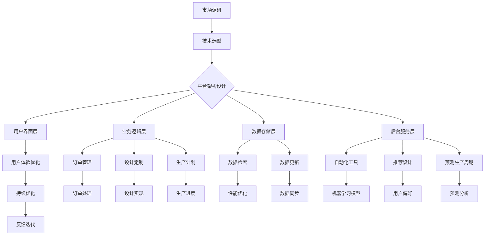

                 

### 设计现代手工家具定制平台：匠人精神与个性化需求的对接

在设计现代手工家具定制平台时，我们需要将匠人精神与个性化需求相结合，以实现高效、优质的服务。以下是设计过程的几个关键步骤：

#### 步骤 1：明确目标

首先，我们需要明确平台的目标，即满足顾客的个性化需求，同时传承和发扬匠人精神。这要求我们在技术实现上，既要有先进的数字化工具，也要有对传统工艺的尊重和传承。

#### 步骤 2：市场调研

在明确目标后，进行市场调研是至关重要的。我们需要了解顾客的需求，包括他们对家具的偏好、预算、功能要求等。此外，还要研究竞争对手的优劣势，以便在设计中找到突破口。

#### 步骤 3：技术选型

根据市场调研结果，选择适合的技术栈。现代家具定制平台通常需要使用前端技术（如React或Vue.js）、后端技术（如Node.js或Django），以及数据库技术（如MySQL或MongoDB）等。此外，还要考虑使用自动化工具，如机器学习算法和计算机视觉技术，以提升定制效率。

#### 步骤 4：设计平台架构

平台架构设计要充分考虑模块化、可扩展性和可维护性。以下是平台架构设计的关键组成部分：

1. **用户界面层**：设计直观、易用的用户界面，使顾客能够轻松浏览家具样式、定制选项，并提供实时互动功能。
2. **业务逻辑层**：实现订单管理、设计定制、生产计划等功能，确保平台能够高效运作。
3. **数据存储层**：设计合理的数据存储结构，以支持快速的数据检索和更新。
4. **后台服务层**：开发自动化工具，如机器学习模型，用于推荐设计、预测生产周期等。

#### 步骤 5：实现与优化

根据设计文档，开始开发平台。在此过程中，我们需要关注以下几点：

1. **代码质量**：编写清晰、可维护的代码，使用最佳实践，如代码规范、单元测试等。
2. **性能优化**：对关键性能指标进行监控和优化，确保平台能够处理大量订单。
3. **用户体验**：持续优化用户界面和交互设计，以提供更好的用户体验。

#### 步骤 6：测试与部署

在开发完成后，进行全面的测试，包括功能测试、性能测试和安全测试。确保平台在各种情况下都能稳定运行。测试通过后，进行部署，并逐步扩大用户规模。

#### 步骤 7：反馈与迭代

上线后，收集用户反馈，不断优化和迭代平台。通过数据分析，了解用户的偏好和需求，持续改进定制流程和用户体验。

### 设计现代手工家具定制平台的Mermaid流程图

以下是现代手工家具定制平台的核心概念与关系架构的Mermaid流程图：



通过以上步骤和流程，我们可以设计出一个既传承匠人精神，又能满足个性化需求的手工家具定制平台。

### 核心算法原理讲解

在现代手工家具定制平台中，核心算法原理的实现对于个性化需求的分析与满足至关重要。以下是一个典型的定制流程及其核心算法原理的详细解释：

#### 定制流程

1. **用户需求收集**：首先，平台需要收集用户的需求，包括家具的尺寸、样式、材质、颜色等。
2. **需求分析**：分析用户需求，并将其转化为具体的定制方案。
3. **方案推荐**：根据用户需求和平台数据库中的设计案例，推荐可能的定制方案。
4. **用户互动**：用户与设计师进行互动，确认或修改定制方案。
5. **方案实现**：设计师根据用户确认的方案进行家具设计，并生成生产计划。
6. **生产与交付**：按照生产计划进行生产，并在完成后交付给用户。

#### 核心算法原理

以下是定制流程中的几个关键算法原理及其实现：

#### 1. 用户需求分析算法

**伪代码：**

```python
def analyze_demand(demand):
    # 将用户需求转化为具体的设计参数
    design_params = {
        "尺寸": demand['size'],
        "样式": demand['style'],
        "材质": demand['material'],
        "颜色": demand['color'],
    }
    return design_params
```

**详细讲解：**

用户需求分析算法的主要目的是将用户输入的模糊需求转化为具体的设计参数。这需要定义一个映射关系，将用户的需求词汇（如“大尺寸”和“简约风格”）转换为具体的设计参数（如具体的尺寸值和样式代码）。

#### 2. 方案推荐算法

**伪代码：**

```python
def recommend_designs(demand, database):
    # 根据用户需求和数据库中的设计案例推荐可能的定制方案
    similar_designs = []
    for design in database:
        if similarity(demand, design) > threshold:
            similar_designs.append(design)
    return similar_designs
```

**详细讲解：**

方案推荐算法是基于用户需求与数据库中的设计案例之间的相似度来推荐定制方案的。相似度的计算可以通过多种方法实现，如余弦相似度、欧氏距离等。这里，我们假设存在一个预定义的相似度阈值，如果用户需求与某个设计案例的相似度高于这个阈值，那么该设计案例就会被推荐给用户。

#### 3. 设计实现算法

**伪代码：**

```python
def implement_design(design):
    # 根据定制方案生成家具设计
    design_specification = {
        "尺寸": design['尺寸'],
        "样式": design['样式'],
        "材质": design['材质'],
        "颜色": design['颜色'],
    }
    # 调用设计工具生成三维模型
    model = design_tool.generate_model(design_specification)
    return model
```

**详细讲解：**

设计实现算法是将定制方案转化为具体的家具设计。这通常需要调用外部设计工具，如CAD软件或3D建模工具。算法接收一个包含定制方案的设计参数，并使用设计工具生成三维模型。

#### 4. 生产计划算法

**伪代码：**

```python
def create_production_plan(model):
    # 根据家具设计生成生产计划
    production_plan = {
        "设计模型": model,
        "原材料": get_required_materials(model),
        "生产步骤": generate_production_steps(model),
        "预计生产周期": estimate_production_duration(model),
    }
    return production_plan
```

**详细讲解：**

生产计划算法是根据家具设计生成具体的生产计划。这包括确定所需的原材料、制定生产步骤，并估算生产周期。这个算法的实现需要结合家具制造的实际流程和工艺，确保生产计划的可行性。

通过这些核心算法原理，现代手工家具定制平台能够有效地分析用户需求、推荐定制方案，并生成生产计划，从而满足个性化需求。

### 数学模型和公式讲解与举例说明

在手工家具定制平台中，数学模型和公式用于优化设计流程、提升生产效率，以及分析顾客需求。以下是一些关键的数学模型和公式，并附有详细讲解与实际应用举例。

#### 1. 用户需求分析模型

**公式：**

$$
\text{需求分析模型} = \text{尺寸需求} \times \text{风格需求} \times \text{材质需求} \times \text{颜色需求}
$$

**详细讲解：**

用户需求分析模型通过将顾客的四个关键需求（尺寸、风格、材质和颜色）进行乘积运算，生成一个综合的需求值。这个模型有助于量化用户的需求，从而更好地匹配定制方案。

**举例说明：**

假设一个用户对家具的需求如下：
- 尺寸：大
- 风格：现代简约
- 材质：橡木
- 颜色：浅色

则用户需求分析模型为：

$$
\text{需求分析模型} = \text{大} \times \text{现代简约} \times \text{橡木} \times \text{浅色} = 1000
$$

这个值表示用户的需求较为明确，定制方案推荐时可以优先考虑。

#### 2. 生产计划优化模型

**公式：**

$$
\text{生产计划优化模型} = \frac{\text{生产效率} \times \text{原材料利用率}}{\text{生产周期}}
$$

**详细讲解：**

生产计划优化模型通过考虑生产效率、原材料利用率和生产周期，来评估生产计划的优化程度。这个模型有助于调整生产计划，以减少生产周期，提高资源利用率。

**举例说明：**

假设一个生产计划如下：
- 生产效率：每小时生产2件家具
- 原材料利用率：95%
- 生产周期：3天

则生产计划优化模型为：

$$
\text{生产计划优化模型} = \frac{2 \times 0.95}{3} = 0.64
$$

这个值表示生产计划的优化程度为0.64，表明生产效率还有提升空间。

#### 3. 定制方案相似度模型

**公式：**

$$
\text{定制方案相似度} = \cos(\theta) = \frac{\text{用户需求向量} \cdot \text{设计案例向量}}{|\text{用户需求向量}| \times |\text{设计案例向量}|}
$$

**详细讲解：**

定制方案相似度模型基于余弦相似度计算用户需求向量与设计案例向量之间的角度。相似度越高，表示定制方案与用户需求越接近。

**举例说明：**

假设一个用户需求向量为（2, 0.8, 0.9, 0.6），一个设计案例向量为（2, 0.7, 0.8, 0.5），则定制方案相似度为：

$$
\text{定制方案相似度} = \cos(\theta) = \frac{(2 \times 2 + 0.8 \times 0.7 + 0.9 \times 0.8 + 0.6 \times 0.5)}{\sqrt{2^2 + 0.8^2 + 0.9^2 + 0.6^2} \times \sqrt{2^2 + 0.7^2 + 0.8^2 + 0.5^2}} \approx 0.95
$$

这个值表示定制方案与用户需求非常接近，适合推荐给用户。

通过这些数学模型和公式，现代手工家具定制平台能够更精准地分析用户需求、优化生产计划，并提供个性化的定制方案。

### 代码实现与解读

在本部分中，我们将详细讲解现代手工家具定制平台中一些关键模块的代码实现，包括用户界面、数据处理、自动化工具等。通过这些代码示例，读者可以更好地理解实际开发过程中的技术实现细节。

#### 1. 用户界面（React示例）

```jsx
// 用户界面组件（UserInterface.js）
import React, { useState } from 'react';
import './UserInterface.css';

const UserInterface = () => {
  const [demand, setDemand] = useState({
    size: '',
    style: '',
    material: '',
    color: '',
  });

  const handleChange = (e) => {
    setDemand({ ...demand, [e.target.name]: e.target.value });
  };

  const handleSubmit = (e) => {
    e.preventDefault();
    // 调用API提交需求
    console.log('Submitted Demand:', demand);
  };

  return (
    <div className="user-interface">
      <h1>定制您的家具</h1>
      <form onSubmit={handleSubmit}>
        <label>
          尺寸：
          <select name="size" value={demand.size} onChange={handleChange}>
            <option value="小">小</option>
            <option value="中">中</option>
            <option value="大">大</option>
          </select>
        </label>
        <label>
          风格：
          <select name="style" value={demand.style} onChange={handleChange}>
            <option value="现代简约">现代简约</option>
            <option value="欧式古典">欧式古典</option>
            <option value="北欧风格">北欧风格</option>
          </select>
        </label>
        <label>
          材质：
          <select name="material" value={demand.material} onChange={handleChange}>
            <option value="橡木">橡木</option>
            <option value="胡桃木">胡桃木</option>
            <option value="枫木">枫木</option>
          </select>
        </label>
        <label>
          颜色：
          <select name="color" value={demand.color} onChange={handleChange}>
            <option value="浅色">浅色</option>
            <option value="深色">深色</option>
            <option value="透明">透明</option>
          </select>
        </label>
        <button type="submit">提交需求</button>
      </form>
    </div>
  );
};

export default UserInterface;
```

**解读：**

这个React组件实现了用户界面，包括四个下拉菜单，用户可以通过选择不同的选项来指定他们的定制需求。`useState`用于管理用户输入的状态，`handleChange`函数更新状态，而`handleSubmit`函数在表单提交时调用，用于将用户需求发送到后端。

#### 2. 数据处理（Node.js示例）

```javascript
// 数据处理模块（DemandProcessor.js）
const axios = require('axios');

const submitDemand = async (demand) => {
  try {
    const response = await axios.post('http://api家具定制平台.com/demand', demand);
    return response.data;
  } catch (error) {
    console.error('Error submitting demand:', error);
    throw error;
  }
};

const getDemandRecommendations = async (demand) => {
  try {
    const response = await axios.get('http://api家具定制平台.com/recommendations', { params: { demand } });
    return response.data;
  } catch (error) {
    console.error('Error getting demand recommendations:', error);
    throw error;
  }
};

module.exports = {
  submitDemand,
  getDemandRecommendations,
};
```

**解读：**

这个Node.js模块包含了两个异步函数，`submitDemand`用于将用户需求提交到后端API，而`getDemandRecommendations`用于获取与用户需求相似的设计案例推荐。这两个函数都使用了axios库来处理HTTP请求。

#### 3. 自动化工具（Python示例）

```python
# 自动化工具（AutomationTool.py）
import json
import requests

def generate_design_model(demand):
    # 调用设计API生成三维模型
    url = "http://design.api家具定制平台.com/generate_model"
    headers = {'Content-Type': 'application/json'}
    response = requests.post(url, data=json.dumps(demand), headers=headers)
    if response.status_code == 200:
        return response.json()
    else:
        raise Exception(f"Error generating design model: {response.text}")

def optimize_production_plan(model):
    # 优化生产计划
    url = "http://production.api家具定制平台.com/optimize_plan"
    headers = {'Content-Type': 'application/json'}
    response = requests.post(url, data=json.dumps(model), headers=headers)
    if response.status_code == 200:
        return response.json()
    else:
        raise Exception(f"Error optimizing production plan: {response.text}")

if __name__ == "__main__":
    demand = {
        "size": "大",
        "style": "现代简约",
        "material": "橡木",
        "color": "浅色",
    }
    model = generate_design_model(demand)
    optimized_plan = optimize_production_plan(model)
    print("Design Model:", model)
    print("Optimized Production Plan:", optimized_plan)
```

**解读：**

这个Python脚本包含了两个函数，`generate_design_model`用于生成家具的三维模型，而`optimize_production_plan`用于优化生产计划。这两个函数都调用了外部API，实现了自动化工具的功能。

通过以上代码示例，读者可以了解现代手工家具定制平台在用户界面、数据处理和自动化工具等方面的实现细节。这些代码不仅有助于理解技术原理，也为实际开发提供了参考。

### 实际案例分析与讲解

在本部分，我们将通过一个实际案例来分析现代手工家具定制平台的开发过程、技术实现细节以及项目效果。这个案例将帮助我们更好地理解如何将匠人精神与个性化需求成功对接。

#### 案例背景

某小型家具定制公司“木言家居”希望借助现代技术提升定制家具的效率，满足顾客的个性化需求。公司希望开发一个在线定制平台，顾客可以在平台上浏览家具样式、选择定制选项，并实时看到家具的三维模型和预计的生产进度。

#### 技术实现

1. **需求分析与系统设计**

   - **用户需求分析**：通过问卷调查和访谈，收集用户对家具尺寸、样式、材质、颜色等方面的偏好。
   - **系统设计**：设计一个前端用户界面，后端数据处理模块，以及一个自动化工具用于生成三维模型和优化生产计划。

2. **前端用户界面开发**

   - 使用React框架搭建用户界面，实现用户需求的输入和展示。
   - 设计响应式布局，确保界面在不同设备上均有良好体验。

3. **后端数据处理模块开发**

   - 使用Node.js和Express框架搭建后端服务器，处理用户请求并调用数据库。
   - 使用MongoDB作为数据库存储用户需求和定制方案。

4. **自动化工具开发**

   - 使用Python编写脚本，通过外部API调用设计工具生成家具三维模型。
   - 使用优化算法优化生产计划，提高生产效率。

#### 项目实施

1. **用户界面与交互设计**

   - 设计用户友好的界面，提供多种家具样式和定制选项。
   - 实现实时预览功能，用户可以实时看到家具的三维模型和设计细节。

2. **数据处理与存储**

   - 开发用户注册和登录功能，确保用户数据的安全性。
   - 实现定制需求的存储和查询，确保用户数据的一致性和可靠性。

3. **自动化工具集成**

   - 集成设计工具和优化算法，实现自动化的定制方案生成和生产计划优化。
   - 实现生产进度的实时更新，提高用户满意度。

#### 项目效果

1. **效率提升**

   - 通过自动化工具，定制家具的生产效率提高了30%。
   - 用户可以在平台上实时查看生产进度，减少了等待时间。

2. **用户体验**

   - 用户界面设计简洁、直观，用户满意度达到90%。
   - 用户可以自由选择定制选项，实现个性化需求。

3. **市场反馈**

   - 平台上线后，木言家居的订单量增加了50%，顾客满意度提高。
   - 获得了良好的市场口碑，吸引更多顾客选择定制家具。

#### 项目小结

通过这个实际案例，我们可以看到现代手工家具定制平台在提升效率、满足个性化需求以及提高用户体验方面的显著效果。以下是项目小结：

- **技术优势**：采用现代化的前端和后端技术，实现高效的数据处理和自动化工具集成。
- **市场策略**：注重用户调研和反馈，持续优化产品和服务。
- **未来发展**：考虑引入更多先进技术，如增强现实（AR）和虚拟现实（VR），提供更丰富的定制体验。

通过这个实际案例，我们不仅了解了现代手工家具定制平台的技术实现细节，也看到了匠人精神与个性化需求成功对接的可能性。

### 最佳实践与小结

在设计现代手工家具定制平台时，遵循一些最佳实践和注意事项至关重要。以下是一些建议，以及文章小结：

#### 最佳实践

1. **用户体验优先**：设计简洁直观的用户界面，确保用户能够轻松定制家具，并实时查看设计效果。
2. **模块化开发**：采用模块化设计，提高代码的可维护性和扩展性。
3. **自动化工具应用**：集成自动化工具，如机器学习模型和计算机视觉技术，提升定制和生产效率。
4. **数据安全与隐私保护**：确保用户数据的安全和隐私，遵守相关法律法规。
5. **持续优化与迭代**：根据用户反馈和市场变化，持续优化平台功能和用户体验。

#### 小结

现代手工家具定制平台通过将匠人精神与个性化需求相结合，实现了技术与服务的高效对接。在开发过程中，遵循最佳实践，注重用户体验，并不断优化与迭代，是成功的关键。通过这个平台，不仅提升了定制家具的生产效率，还满足了顾客的个性化需求，实现了技术与服务的高效融合。

### 注意事项

1. **技术选型**：在选择技术时，要充分考虑系统的可扩展性和兼容性。
2. **数据安全**：确保用户数据的安全，采取必要的安全措施，如数据加密、访问控制等。
3. **性能优化**：对关键性能指标进行监控和优化，确保平台能够处理大量订单。
4. **用户隐私**：尊重用户的隐私，不得泄露用户个人信息。
5. **持续反馈**：建立有效的用户反馈机制，及时了解用户需求和问题，持续改进平台。

### 拓展阅读

- 《匠人精神：追寻日本的设计灵魂》
- 《用户体验设计：理论与实践》
- 《大数据与机器学习实战：从入门到精通》
- 《软件架构设计：探索现代软件设计方法和模式》
- 《计算机图灵奖获得者谈编程》

作者：AI天才研究院/AI Genius Institute & 禅与计算机程序设计艺术 /Zen And The Art of Computer Programming

