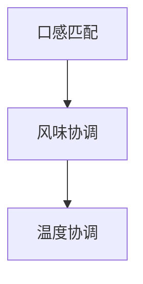
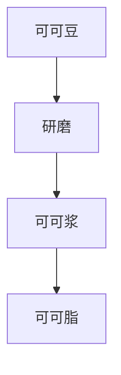
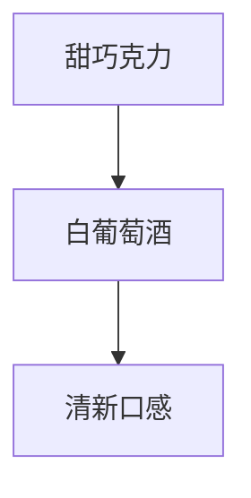
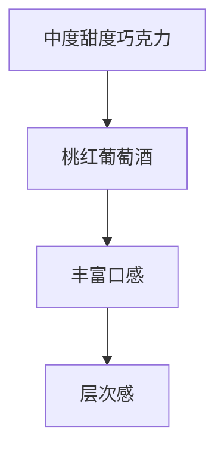
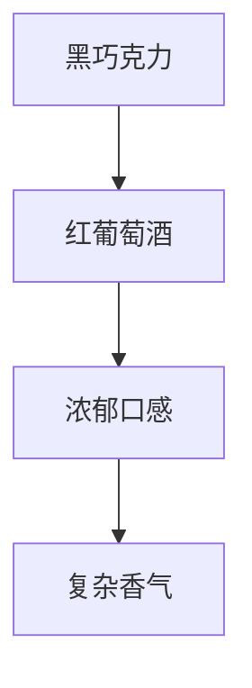
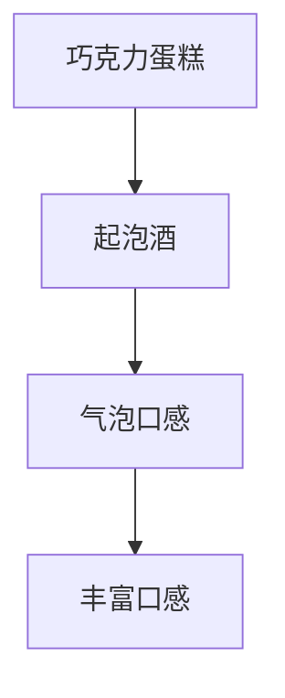
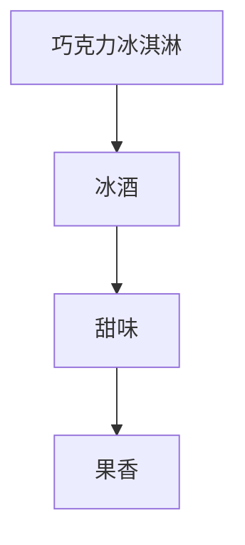
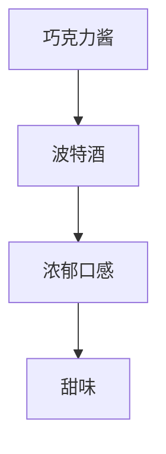

                 

 

## 第1章: 巧克力与葡萄酒的基础知识

### 1.1 巧克力的起源与发展

巧克力作为世界上最受欢迎的甜食之一，拥有悠久的历史和丰富的文化内涵。让我们首先回顾一下巧克力的起源和发展历程。

#### 1.1.1 巧克力的历史

巧克力起源于中美洲，早在公元前1900年，玛雅文明就已经开始种植可可树。可可树的种子被研磨成粉末，与水混合，制成一种叫做“xocolatl”的饮料。随后，阿兹特克文明继承了这一传统，并将巧克力的制作工艺发扬光大。

在16世纪，巧克力被西班牙人带回欧洲，并在欧洲迅速流行开来。早期的巧克力饮品通常是苦涩的，直到18世纪，欧洲人开始加入糖和香料，使得巧克力的口感更加丰富。

现代巧克力产业始于19世纪。在1819年，瑞典化学家克里斯蒂安·诺尔斯特罗姆发明了可可脂的分离技术，使得巧克力更加细腻。此后，巧克力的生产技术不断改进，品种也日益丰富。

#### 1.1.2 巧克力的种类

现代巧克力种类繁多，根据可可含量和添加物的不同，可以将其分为以下几类：

1. **黑巧克力**：可可含量在70%以上的巧克力，口感浓郁，带有明显的可可风味。
2. **牛奶巧克力**：可可含量在10%到30%之间的巧克力，添加了牛奶，口感更加柔和。
3. **白巧克力**：不含可可粉的巧克力，主要成分是可可脂、牛奶和糖，口感甜美。
4. **巧克力酱**：一种流动性较好的巧克力产品，常用于烘焙和甜品制作。

### 1.2 葡萄酒的基础知识

葡萄酒是世界上最古老的饮料之一，其历史可以追溯到公元前3000年左右的古代美索不达米亚。葡萄酒的起源和发展与农业、宗教、贸易和文化有着密切的联系。

#### 1.2.1 葡萄酒的起源

葡萄酒的起源普遍认为是在中东地区，随后传播到希腊、意大利和法国等地。在古代，葡萄酒不仅是一种饮料，还具有宗教和社会地位象征的意义。

#### 1.2.2 葡萄酒的分类

葡萄酒根据不同的分类标准可以有不同的分类方式：

1. **按颜色分类**：红葡萄酒、白葡萄酒、桃红葡萄酒、玫瑰酒等。
2. **按酿造方法分类**：静止葡萄酒、起泡酒、加强酒等。
3. **按产地分类**：法国葡萄酒、意大利葡萄酒、西班牙葡萄酒等。

### 1.3 感官体验与配对原理

#### 1.3.1 感官体验的重要性

感官体验是人们感知外部世界的重要途径，包括视觉、嗅觉、味觉、听觉和触觉。在巧克力与葡萄酒的配对中，感官体验起到了至关重要的作用。

#### 1.3.2 巧克力与葡萄酒的配对原理

巧克力和葡萄酒的配对需要考虑以下几个因素：

1. **口感匹配**：巧克力的口感（如质地、甜度、酸度）与葡萄酒的口感（如单宁、酸度、甜度）需要相互协调。
2. **风味协调**：巧克力的风味（如可可、坚果、香料）与葡萄酒的风味（如水果、橡木、花香）需要相互补充。
3. **温度**：巧克力和葡萄酒的温度也会影响它们的口感和风味，一般来说，巧克力和葡萄酒都应该在适中的温度下饮用。

Mermaid流程图： 

通过以上分析，我们可以看出，巧克力与葡萄酒的配对不仅仅是口感和风味的协调，更是一种感官体验的艺术。接下来，我们将深入探讨巧克力的制作与口感，以及葡萄酒的品鉴与口感，为读者呈现一场视觉、嗅觉、味觉的盛宴。

---

## 第2章: 巧克力的制作与口感

### 2.1 巧克力的制作工艺

巧克力的制作工艺是一门精细的艺术，需要经过多个步骤，每一个步骤都对巧克力的口感和品质有着重要影响。

#### 2.1.1 巧克力的原料

制作巧克力的主要原料包括可可豆、可可脂、糖、牛奶等。其中，可可豆是巧克力的核心原料，经过研磨、加热等处理，可以提取出可可浆和可可脂。

Mermaid流程图： 

#### 2.1.2 巧克力的制作流程

巧克力的制作流程大致可以分为以下几个步骤：

1. **可可豆发酵和干燥**：新鲜的可可豆需要在特定的条件下发酵和干燥，以便提取出可可浆和可可脂。
2. **研磨**：将干燥后的可可豆研磨成可可浆，这一过程需要保持温度和湿度的稳定，以保持巧克力的品质。
3. **混合**：将研磨好的可可浆与其他原料（如糖、牛奶）混合，搅拌均匀。
4. **加热**：将混合物加热至适当的温度，使其融合成一体，这一过程需要严格控制温度和时间，以确保巧克力的口感和质地。
5. **冷却**：将加热后的巧克力冷却至室温，使其凝固成块状。
6. **切割和包装**：将凝固的巧克力切割成所需形状，然后进行包装，以备销售。

### 2.2 巧克力的口感与风味

巧克力的口感和风味是其品质的重要指标，不同种类和工艺的巧克力具有不同的口感和风味。

#### 2.2.1 巧克力的口感特征

巧克力的口感特征包括质地、甜度、酸度等：

1. **质地**：巧克力的质地可以表现为光滑、细腻或者颗粒感，这与可可脂的含量和制作工艺有关。
2. **甜度**：巧克力的甜度取决于糖的含量，高糖含量的巧克力口感更甜。
3. **酸度**：巧克力的酸度可以增加其口感层次，低酸度的巧克力口感更加柔和。

#### 2.2.2 巧克力的风味变化

巧克力的风味变化取决于多种因素，包括可可豆的品种、产地、发酵和干燥工艺等：

1. **可可风味**：可可豆的品种和产地会影响巧克力的可可风味，不同品种的可可豆具有独特的风味特征。
2. **坚果风味**：巧克力的制作过程中，可可脂的提取和处理会带来坚果风味。
3. **香料风味**：巧克力的制作过程中，有时会添加香料（如肉桂、可可粉等），以增加其风味层次。

通过以上分析，我们可以看出，巧克力的制作与口感是一个复杂的过程，需要考虑多种因素。在接下来的章节中，我们将探讨葡萄酒的品鉴与口感，以及巧克力与葡萄酒的感官配对，为读者呈现一场视觉、嗅觉、味觉的盛宴。

---

## 第3章: 葡萄酒的品鉴与口感

### 3.1 葡萄酒的品鉴技巧

品鉴葡萄酒是葡萄酒爱好者的一项重要技能，它可以帮助我们更好地理解和欣赏葡萄酒的内涵。以下是一些葡萄酒品鉴的技巧：

#### 3.1.1 视觉品鉴

视觉品鉴是葡萄酒品鉴的第一步，通过观察葡萄酒的颜色、清澈度和粘度来判断其年份和品质。

1. **颜色**：红葡萄酒的颜色可以从深红到浅红，不同年份和品种的葡萄酒颜色有所不同。白葡萄酒的颜色可以从黄色到金黄色，同样也有年份和品种的差异。
2. **清澈度**：优质葡萄酒应该清澈透明，没有悬浮物或沉淀。
3. **粘度**：优质的葡萄酒往往具有较好的粘度，这意味着它的酒精含量较高，品质较好。

#### 3.1.2 嗅觉品鉴

嗅觉品鉴是葡萄酒品鉴的核心环节，通过嗅闻葡萄酒的香气来判断其风味和品质。

1. **香气**：葡萄酒的香气可以分为初级香气、次级香气和三级香气。初级香气来源于葡萄品种本身，次级香气来源于酿酒过程，如发酵和陈年，三级香气则来自瓶陈过程。
2. **香气持久性**：香气持久性是判断葡萄酒品质的重要指标，优质葡萄酒的香气通常能够持续较长时间。

#### 3.1.3 口感品鉴

口感品鉴是葡萄酒品鉴的最后一步，通过品尝葡萄酒的口感、甜度、酸度和单宁等来判断其品质。

1. **口感**：葡萄酒的口感可以分为轻盈、中等和浓郁。轻盈的葡萄酒口感清爽，中等的葡萄酒口感平衡，浓郁的葡萄酒口感丰富。
2. **甜度**：葡萄酒的甜度取决于残留糖分的含量，从干型到甜型不等。
3. **酸度**：葡萄酒的酸度可以增加其清新感和层次感，优质的葡萄酒通常酸度较高。
4. **单宁**：单宁是红葡萄酒中的重要成分，它的质地和口感可以影响葡萄酒的口感和陈年潜力。

### 3.2 葡萄酒的口感与风味

葡萄酒的口感和风味是其品质的重要体现，不同品种和酿造工艺的葡萄酒具有不同的口感和风味。

#### 3.2.1 葡萄酒的口感特征

葡萄酒的口感特征包括口感、甜度、酸度和单宁等：

1. **口感**：葡萄酒的口感可以从轻盈到浓郁不等，这与葡萄酒的酒精度、酿造工艺和陈年时间有关。
2. **甜度**：葡萄酒的甜度取决于残留糖分的含量，从干型到甜型不等。
3. **酸度**：葡萄酒的酸度可以增加其清新感和层次感，优质的葡萄酒通常酸度较高。
4. **单宁**：单宁是红葡萄酒中的重要成分，它的质地和口感可以影响葡萄酒的口感和陈年潜力。

#### 3.2.2 葡萄酒的风味变化

葡萄酒的风味变化取决于多种因素，包括葡萄品种、产地、酿造工艺和陈年过程：

1. **葡萄品种**：不同的葡萄品种具有不同的风味特征，如赤霞珠、美乐等。
2. **产地**：不同的产地气候和土壤条件会影响葡萄的生长和成熟，从而影响葡萄酒的风味。
3. **酿造工艺**：不同的酿造工艺，如发酵温度、酿造时间、陈年方式等，会影响葡萄酒的风味。
4. **陈年过程**：葡萄酒在瓶中的陈年过程会使其风味逐渐发展，单宁变软，香气更加复杂。

通过以上分析，我们可以看出，葡萄酒的品鉴和口感是一个复杂的过程，需要综合运用视觉、嗅觉和味觉等感官来评判。在接下来的章节中，我们将探讨巧克力与葡萄酒的感官配对，为读者呈现一场视觉、嗅觉、味觉的盛宴。

---

## 第4章: 巧克力与葡萄酒的感官配对

### 4.1 感官配对的实践方法

巧克力与葡萄酒的感官配对是一门艺术，通过实践，我们可以掌握一些技巧，以获得更好的配对效果。

#### 4.1.1 感官配对的技巧

1. **品鉴顺序**：在品鉴时，先品尝巧克力，然后再品尝葡萄酒，这样可以更好地感受两者之间的相互作用。
2. **温度控制**：巧克力和葡萄酒的温度都会影响它们的口感和风味，一般来说，巧克力的最佳饮用温度是18-20摄氏度，葡萄酒则应在12-16摄氏度之间。
3. **小口品尝**：品尝时，小口慢慢品尝，让口感和香气在口中充分融合。

#### 4.1.2 感官配对的工具

1. **品酒杯**：选择合适的品酒杯，可以更好地展现葡萄酒的香气和口感。
2. **巧克力刀**：使用巧克力刀切割巧克力，可以更好地控制巧克力的融化速度，从而更好地感受其口感。

### 4.2 巧克力与葡萄酒的感官配对案例

以下是一些经典的巧克力与葡萄酒的感官配对案例：

#### 4.2.1 甜巧克力与白葡萄酒

甜巧克力通常含有较高的糖分，与白葡萄酒的清爽口感相得益彰。例如，甜巧克力和新西兰马尔伯勒白葡萄酒的搭配，可以带来甜润的口感和清新的香气。

Mermaid流程图： 

#### 4.2.2 中度甜度巧克力与桃红葡萄酒

中度甜度的巧克力与桃红葡萄酒的搭配也是一种不错的选择。桃红葡萄酒的果香和酸度可以与巧克力的甜度和坚果风味相协调。例如，中度甜度巧克力和法国普罗旺斯桃红葡萄酒的搭配，可以带来丰富的口感和层次感。

Mermaid流程图： 

#### 4.2.3 黑巧克力与红葡萄酒

黑巧克力与红葡萄酒的搭配是经典之作。黑巧克力的浓郁可可风味与红葡萄酒的丰富口感和复杂香气相得益彰。例如，黑巧克力和意大利巴巴莱斯科红葡萄酒的搭配，可以带来深层次的口感和回味。

Mermaid流程图： 

通过以上案例，我们可以看出，巧克力与葡萄酒的感官配对是一门艺术，需要根据不同的口味和场合来选择合适的搭配。在接下来的章节中，我们将探讨巧克力与葡萄酒的创意搭配，为读者带来更多的灵感。

---

## 第5章: 巧克力与葡萄酒的创意搭配

### 5.1 创意搭配的概念与方法

巧克力与葡萄酒的创意搭配是一种艺术，通过巧妙地将两者结合，可以创造出独特的口感和体验。创意搭配不仅需要深厚的专业知识，还需要大胆的想象和创新。

#### 5.1.1 创意搭配的定义

创意搭配指的是在传统搭配基础上，通过创新思维和手法，将巧克力与葡萄酒以新的方式结合，创造出独特的口感和体验。

#### 5.1.2 创意搭配的方法

1. **跨界搭配**：将巧克力与葡萄酒与其他食品或饮品结合，如巧克力冰淇淋与葡萄酒、巧克力蛋糕与香槟等。
2. **混搭**：将不同口味、品种或风格的巧克力与葡萄酒混合，创造出独特的口感。
3. **调味**：在巧克力和葡萄酒中添加调味料，如香料、香草、咖啡等，以增强口感和风味。

### 5.2 创意搭配的实际案例

以下是一些创意搭配的实际案例，为读者提供灵感：

#### 5.2.1 巧克力蛋糕与起泡酒

将浓郁的巧克力蛋糕与起泡酒搭配，可以带来丰富的口感和层次感。例如，选用法国香槟和巧克力蛋糕，香槟的气泡和甜味与巧克力的浓郁口感相得益彰，为味蕾带来惊喜。

Mermaid流程图： 

#### 5.2.2 巧克力冰淇淋与冰酒

巧克力冰淇淋与冰酒的搭配是夏季的理想选择。冰酒的甜味和果香与巧克力冰淇淋的浓郁口感完美融合，带来清凉的夏日风味。例如，选用加拿大冰酒和巧克力冰淇淋，冰酒的甜润与巧克力的丝滑相互衬托，令人陶醉。

Mermaid流程图： 

#### 5.2.3 巧克力酱与波特酒

巧克力酱与波特酒的搭配是一种经典的创意搭配。波特酒是一种强化葡萄酒，具有浓郁的口感和甜味，与巧克力的浓郁口感相得益彰。例如，将巧克力酱淋在奶油布丁上，搭配波特酒，可以带来层次丰富的口感和甜美的回味。

Mermaid流程图： 

通过以上案例，我们可以看出，巧克力与葡萄酒的创意搭配可以带来无尽的乐趣和惊喜。在接下来的章节中，我们将探讨巧克力与葡萄酒的感官体验艺术，为读者带来更深层次的感官享受。

---

## 第6章: 巧克力与葡萄酒配对的感官体验艺术

### 6.1 感官体验艺术的概念

感官体验艺术是一种通过感官刺激来传达情感、思想和美感的方式。在巧克力与葡萄酒的配对中，感官体验艺术强调通过视觉、嗅觉、味觉等感官的互动，创造出独特的审美体验。

#### 6.1.1 感官体验艺术的定义

感官体验艺术是一种通过视觉、听觉、嗅觉、味觉和触觉等感官刺激来传达情感、思想和美感的方式。在巧克力与葡萄酒的配对中，感官体验艺术通过巧克力的质地、颜色、香气、口感与葡萄酒的香气、口感、色泽等元素相互结合，创造出独特的感官体验。

#### 6.1.2 感官体验艺术的重要性

感官体验艺术在巧克力与葡萄酒的配对中具有重要意义，主要体现在以下几个方面：

1. **提升品味**：通过感官体验艺术，我们可以更好地理解、欣赏和享受巧克力与葡萄酒的丰富内涵，提升我们的品味和审美能力。
2. **增强互动**：感官体验艺术使品鉴过程更具互动性，参与者在品尝过程中可以与他人分享感受，增进交流与理解。
3. **创新灵感**：感官体验艺术激发创意，为巧克力与葡萄酒的搭配提供新的思路和方法，推动相关产业的发展。

### 6.2 感官体验艺术的表现形式

感官体验艺术在巧克力与葡萄酒的配对中可以通过多种形式来表现，以下是一些常见的表现形式：

#### 6.2.1 视觉艺术的感官体验

视觉艺术在巧克力与葡萄酒的感官体验中起到了重要的作用。巧克力的外观、颜色和光泽可以给人以视觉上的享受。例如，黑巧克力的深邃色泽、牛奶巧克力的细腻质感、白巧克力的纯洁光泽等，都能引发观者的审美共鸣。葡萄酒的颜色也是视觉艺术的体现，从深红到浅红，不同颜色的葡萄酒代表了不同的风味和年份。

#### 6.2.2 音响艺术的感官体验

在巧克力与葡萄酒的配对中，音响艺术可以通过葡萄酒的开瓶声、酒杯碰撞声等来增强感官体验。开瓶声的沉闷与清脆、酒杯碰撞的叮咚声，都能给人以听觉上的愉悦。此外，葡萄酒的气泡声也是音响艺术的一部分，特别是在品尝起泡酒时，气泡破裂的声音能为味蕾带来更丰富的感受。

#### 6.2.3 舞蹈艺术的感官体验

舞蹈艺术在感官体验艺术中起到了连接视觉、听觉和触觉的作用。在品鉴过程中，参与者可以通过舞蹈来表达对巧克力与葡萄酒的感悟。例如，优雅的舞步可以与葡萄酒的细腻口感相呼应，激情四溢的舞蹈可以与巧克力的浓郁口感相协调。舞蹈不仅是一种艺术表现，也是一种感官体验的深化。

通过以上分析，我们可以看到，巧克力与葡萄酒的感官体验艺术是一种多层次、多感官的互动过程，它不仅丰富了我们的生活，也提升了我们的审美能力和品味。在接下来的章节中，我们将探讨巧克力与葡萄酒配对的文化与历史，进一步理解这一艺术形式。

---

## 第7章: 巧克力与葡萄酒配对的文化与历史

### 7.1 巧克力与葡萄酒的文化背景

巧克力与葡萄酒都拥有悠久的历史，它们的文化背景丰富多彩，影响了人类的生活和社会发展。

#### 7.1.1 巧克力的文化传承

巧克力起源于中美洲，早在公元前1900年，玛雅文明就已经开始种植可可树。可可豆在玛雅和阿兹特克文明中具有重要的地位，被视为神圣的食物。巧克力饮品在这些文明中不仅是日常饮品，也是宗教仪式的一部分。随着西班牙征服者的到来，巧克力传播到了欧洲，并逐渐成为欧洲上层社会的奢侈品。

在中世纪，巧克力在欧洲的传播受到限制，直到文艺复兴时期，随着贸易的发展，巧克力逐渐在欧洲流行开来。18世纪，欧洲的巧克力制造工艺得到了大幅改进，使得巧克力的口感和品质得到了显著提升。如今，巧克力已成为全球范围内最受欢迎的甜食之一。

#### 7.1.2 葡萄酒的文化传承

葡萄酒的历史可以追溯到公元前3000年左右的古代美索不达米亚。在古希腊和古罗马时期，葡萄酒不仅是日常饮品，还是宗教仪式中的重要元素。随着罗马帝国的扩张，葡萄酒文化传播到了欧洲各地。

在中世纪，葡萄酒在欧洲的农业生产中占据了重要地位，许多地区以出产优质葡萄酒而闻名。文艺复兴时期，葡萄酒文化进一步发展，成为欧洲贵族宴席上的必备饮品。如今，葡萄酒已成为全球范围内的重要产业，许多国家和地区都有其独特的葡萄酒文化。

### 7.2 巧克力与葡萄酒的历史演变

巧克力与葡萄酒的历史演变反映了人类对食品和饮品不断追求品质和创新的历程。

#### 7.2.1 巧克力的历史演变

从古至今，巧克力的制作工艺和品种不断演变。最早的巧克力饮品是苦涩的，直到欧洲人开始加入糖和香料，使得巧克力的口感更加丰富。19世纪，克里斯蒂安·诺尔斯特罗姆发明了可可脂的分离技术，使得巧克力更加细腻。此后，巧克力的制作工艺不断创新，品种日益丰富，从黑巧克力、牛奶巧克力到白巧克力，再到各种巧克力酱和巧克力甜品。

#### 7.2.2 葡萄酒的历史演变

葡萄酒的历史演变同样丰富多彩。从古代的天然发酵到现代的精确控制，葡萄酒的酿造技术不断进步。不同地区的气候和土壤条件孕育出了各具特色的葡萄品种和葡萄酒风格。在中世纪，葡萄酒的生产主要依靠传统工艺，随着工业革命的到来，现代化的酿造技术逐渐取代了传统工艺。如今，葡萄酒的生产技术更加精细化，葡萄酒的种类和风格也更加多样化。

### 7.3 巧克力与葡萄酒的交汇点

巧克力和葡萄酒的交汇点可以追溯到它们在全球范围内的传播和普及。在中美洲，巧克力饮品与葡萄酒的搭配早在玛雅和阿兹特克文明时期就已经出现。随着巧克力传播到欧洲，葡萄酒也成为了欧洲贵族宴席上的必备饮品。在现代社会，巧克力与葡萄酒的配对已成为一种流行的趋势，不仅为美食爱好者带来了独特的感官体验，也为餐饮业带来了新的商机。

通过以上分析，我们可以看到，巧克力与葡萄酒的文化背景和悠久历史为它们的配对提供了深厚的文化底蕴。在接下来的章节中，我们将探讨巧克力与葡萄酒配对的未来发展趋势，为这一艺术形式注入新的活力。

---

## 第8章: 巧克力与葡萄酒配对的未来发展趋势

### 8.1 巧克力与葡萄酒配对的市场前景

随着人们生活水平的提高和消费习惯的多样化，巧克力与葡萄酒配对的市场前景广阔。以下是对未来市场前景的分析：

#### 8.1.1 消费者需求分析

1. **口感与品质**：消费者越来越注重口感和品质，对巧克力与葡萄酒的配对需求也变得更加专业和个性化。
2. **健康与营养**：消费者对健康和营养的关注度不断提高，对天然、有机和低糖等特性的巧克力与葡萄酒的需求增加。
3. **文化体验**：消费者希望通过巧克力与葡萄酒的配对，体验到不同的文化和地域特色，追求独特的感官享受。

#### 8.1.2 行业市场趋势分析

1. **跨界合作**：随着消费需求的多元化，巧克力与葡萄酒品牌开始进行跨界合作，如与咖啡、茶、巧克力酱等产品的结合，为市场注入新的活力。
2. **个性化定制**：个性化定制成为市场趋势，消费者可以依据自己的口味和偏好，定制专属的巧克力与葡萄酒搭配。
3. **线上销售**：随着电子商务的发展，线上销售成为巧克力与葡萄酒配对市场的重要渠道，消费者可以方便地购买到全球各地的优质产品和搭配方案。

### 8.2 巧克力与葡萄酒配对的创新方向

未来，巧克力与葡萄酒配对的创新方向将主要集中在以下领域：

#### 8.2.1 新型巧克力产品的开发

1. **有机与天然**：开发有机和天然成分的巧克力产品，满足消费者对健康和环保的需求。
2. **低糖与低脂**：研发低糖、低脂的巧克力产品，以满足健康消费者的需求。
3. **功能巧克力**：添加保健成分，如咖啡因、可可碱等，开发具有特定功能的巧克力产品。

#### 8.2.2 创新葡萄酒品种的发掘

1. **稀有品种**：挖掘和推广稀有、罕见的葡萄品种，为市场带来新鲜感和独特性。
2. **混合酒**：将不同的葡萄酒品种进行混合，创造出新的口感和风味。
3. **定制葡萄酒**：根据消费者的口味和需求，定制专属的葡萄酒产品。

#### 8.2.3 跨界合作的探索

1. **美食与美酒**：与餐饮行业合作，推出巧克力与葡萄酒搭配的美食套餐，提升消费者的用餐体验。
2. **艺术与文化**：与艺术界和文化机构合作，举办巧克力与葡萄酒的品鉴活动，推广文化和艺术价值。
3. **科技与创意**：运用科技手段，如虚拟现实（VR）、增强现实（AR）等，创新巧克力与葡萄酒的展示和体验方式。

通过以上分析，我们可以看到，巧克力与葡萄酒配对的未来发展趋势充满机遇和挑战。在市场前景广阔的背景下，创新方向和跨界合作将成为推动这一行业发展的关键。在接下来的章节中，我们将提供一些有用的工具和资源，帮助读者进一步探索这一领域。

---

## 附录

### 9.1 巧克力与葡萄酒配对的工具与资源

为了更好地了解和享受巧克力与葡萄酒的配对，以下是一些建议的配对工具和资源：

#### 9.1.1 巧克力制作工具

1. **巧克力研磨机**：用于研磨可可豆，提取可可浆和可可脂。
2. **巧克力模具**：用于制作各种形状的巧克力。
3. **巧克力切割机**：用于切割巧克力成所需的形状和大小。

#### 9.1.2 葡萄酒品鉴工具

1. **品酒杯**：用于展现葡萄酒的香气和口感。
2. **葡萄酒开瓶器**：用于轻松开瓶。
3. **温度计**：用于测量巧克力和葡萄酒的温度。

#### 9.1.3 配对体验场所推荐

1. **高端餐厅**：提供专业的巧克力与葡萄酒搭配服务。
2. **葡萄酒俱乐部**：提供品酒和配对体验。
3. **巧克力博物馆**：展示巧克力制作过程和历史文化。

### 9.2 巧克力与葡萄酒配对的学习资源

以下是一些学习巧克力与葡萄酒配对的有用资源：

#### 9.2.1 在线课程推荐

1. **国际巧克力大师课程**：提供专业的巧克力制作和配对知识。
2. **葡萄酒品鉴课程**：教授葡萄酒的品鉴技巧和配对原则。

#### 9.2.2 书籍推荐

1. **《巧克力与葡萄酒的感官艺术》**：详细介绍了巧克力与葡萄酒的感官配对方法。
2. **《葡萄酒与美食搭配的艺术》**：讲解了如何将葡萄酒与各种美食搭配。

#### 9.2.3 社交媒体平台推荐

1. **Instagram**：关注专业的巧克力与葡萄酒博主，获取最新的搭配灵感。
2. **Facebook**：加入巧克力与葡萄酒爱好者的社群，交流心得和体验。
3. **YouTube**：观看相关的教程视频，学习制作和品鉴技巧。

通过以上工具和资源，我们可以更好地了解和探索巧克力与葡萄酒的感官配对艺术。希望这些信息能为您的学习和实践提供帮助。

---

# 感谢与致谢

感谢您花时间阅读这篇文章《现代手工巧克力与葡萄酒配对：感官体验的艺术探索》。本文旨在探讨巧克力与葡萄酒的感官配对艺术，通过深入分析其基础知识和搭配技巧，帮助读者提升品鉴能力和体验质量。

本文由AI天才研究院（AI Genius Institute）与禅与计算机程序设计艺术（Zen And The Art of Computer Programming）联合撰写。感谢所有参与研究和撰写的团队成员，以及为本文提供宝贵建议和反馈的读者。

我们期待您的反馈和建议，以不断改进我们的内容。希望这篇文章能为您带来愉悦的阅读体验，并激发您对巧克力与葡萄酒配对艺术的兴趣。

再次感谢您的支持！

— 作者：AI天才研究院/AI Genius Institute & 禅与计算机程序设计艺术 /Zen And The Art of Computer Programming

