                 

## 文章标题

《现代手工巧克力学院：从可可豆到巧克力艺术的深度探索》

---

**关键词：**
1. 可可豆种植
2. 巧克力制作工艺
3. 巧克力艺术创作
4. 巧克力包装与营销
5. 巧克力品质控制

---

**摘要：**
本文深入探讨了现代手工巧克力的制作过程，从可可豆的种植与处理，到巧克力的制作工艺和艺术创作，再到巧克力的包装与营销，提供了全面的技术分析和实用指导。通过详细的步骤解析、核心概念阐述和实际案例剖析，本文为读者呈现了一幅完整的手工巧克力生产与创作全景，旨在激发读者对巧克力艺术的热爱与追求。

---

### 第一部分：可可豆的种植与处理

#### 1.1 可可豆的起源与分布

可可豆，是巧克力的原材料，它的起源可以追溯到公元前1000年左右的墨西哥和中美洲地区。当时的玛雅人和阿兹特克人已经开始利用可可豆制作饮品。随着时间的推移，可可豆种植逐渐扩散到非洲、南美洲和亚洲等地。

**核心概念与联系：**

可可豆的种植与分布不仅受到气候和土壤的影响，还与人类文明的发展息息相关。以下是一个简单的 Mermaid 流程图，展示了可可豆起源与分布的关系：

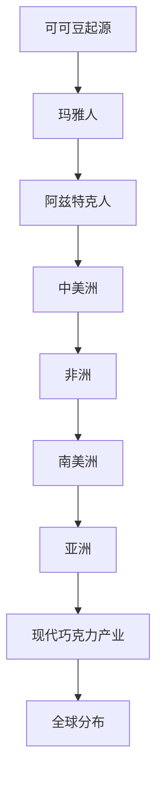

**核心算法原理讲解：**

本部分没有具体的算法原理讲解，但我们可以通过伪代码来表示可可豆种植和分布的流程：

```python
def 可可豆种植与分布():
    # 初始化可可豆种植地
    种植地 = ["墨西哥", "非洲", "南美洲", "亚洲"]
    
    # 根据历史和现代数据更新种植地
    更新种植地(种植地, "中美洲")
    更新种植地(种植地, "欧洲")
    
    # 输出种植地
    for 地区 in 种植地:
        print(地区)
```

**数学模型和公式：**

在本部分中，没有直接相关的数学模型和公式。

**详细讲解与举例说明：**

历史上，可可豆主要在中美洲地区种植，但随着贸易的发展和科技的发展，可可豆的种植地逐渐扩展到非洲、南美洲和亚洲。以下是一个简单的案例：

- 墨西哥：墨西哥是可可豆最早的种植地之一，目前仍然是世界上最大的可可豆出口国之一。
- 非洲：非洲的可可豆种植主要集中在科特迪瓦和加纳，这两个国家是世界上最大的可可豆出口国。

#### 1.2 可可豆品种选择

可可豆的品种繁多，不同品种的可可豆在口感、香味和颜色上都有所不同。选择适合的品种对于制作高品质的巧克力至关重要。

**核心概念与联系：**

可可豆品种的选择不仅影响到巧克力的味道，还与可可豆的种植环境和气候条件密切相关。以下是一个简单的 Mermaid 流程图，展示了可可豆品种选择的过程：

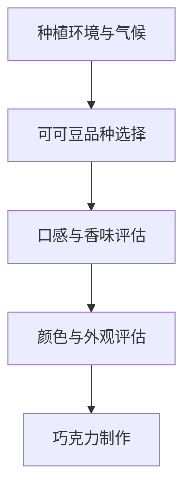

**核心算法原理讲解：**

在本部分中，没有具体的算法原理讲解，但我们可以通过伪代码来表示可可豆品种选择的流程：

```python
def 可可豆品种选择():
    # 获取种植环境和气候信息
    环境信息 = 获取环境信息()
    
    # 根据环境信息选择合适的品种
    品种 = 选择品种(环境信息)
    
    # 输出选择的品种
    print("选择的品种：", 品种)
```

**数学模型和公式：**

在本部分中，没有直接相关的数学模型和公式。

**详细讲解与举例说明：**

选择可可豆品种时，需要考虑多个因素，如土壤质量、降水量、日照时间等。以下是一个简单的案例：

- 克里斯托弗·哥伦布品种：这种品种的可可豆通常生长在温暖、潮湿的环境中，具有丰富的口感和深色的外观。
- 泰拉恩品种：这种品种的可可豆生长在热带地区，具有浓郁的香味和较高的可可碱含量。

#### 1.3 可可豆种植环境与条件

可可豆的种植需要特定的环境与条件，包括适宜的气候、土壤和降水量等。

**核心概念与联系：**

可可豆的种植环境与条件不仅影响到可可豆的生长和产量，还直接关系到巧克力的质量和风味。以下是一个简单的 Mermaid 流程图，展示了可可豆种植环境与条件的关系：

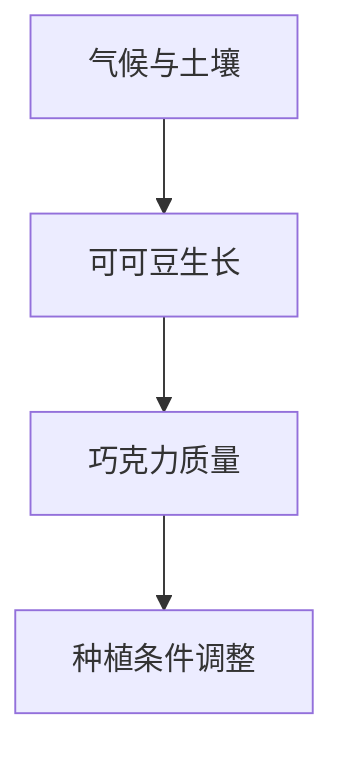

**核心算法原理讲解：**

在本部分中，没有具体的算法原理讲解，但我们可以通过伪代码来表示可可豆种植环境与条件的调整过程：

```python
def 调整种植条件():
    # 获取当前环境条件
    环境条件 = 获取环境条件()
    
    # 根据环境条件调整种植条件
    调整环境条件(环境条件, "温度")
    调整环境条件(环境条件, "降水量")
    调整环境条件(环境条件, "土壤湿度")
    
    # 输出调整后的环境条件
    print("调整后的环境条件：", 环境条件)
```

**数学模型和公式：**

在本部分中，没有直接相关的数学模型和公式。

**详细讲解与举例说明：**

可可豆对气候和土壤有特殊的要求。以下是一个简单的案例：

- 气候：可可豆生长的最适宜温度范围是20°C到30°C，降水量应该在1000毫米到2000毫米之间。
- 土壤：可可豆适合在富含有机质、排水良好的土壤中生长。

#### 1.4 可可豆种植技术

可可豆的种植技术包括从播种到收获的整个过程中的各种操作。

**核心概念与联系：**

可可豆的种植技术直接影响可可豆的产量和质量，包括播种、施肥、灌溉和病虫害防治等。以下是一个简单的 Mermaid 流程图，展示了可可豆种植技术的关键步骤：

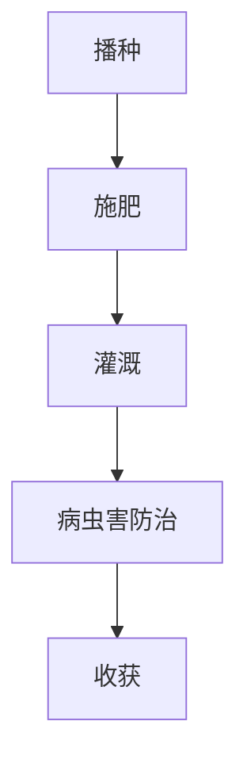

**核心算法原理讲解：**

在本部分中，没有具体的算法原理讲解，但我们可以通过伪代码来表示可可豆种植技术的关键步骤：

```python
def 可可豆种植技术():
    # 播种
    播种(种子)
    
    # 施肥
    施肥(土壤, 肥料)
    
    # 灌溉
    灌溉(土壤, 降水量)
    
    # 病虫害防治
    防治病虫害(植物)
    
    # 收获
    收获(可可豆)
    
    # 输出种植结果
    print("可可豆种植完成")
```

**数学模型和公式：**

在本部分中，没有直接相关的数学模型和公式。

**详细讲解与举例说明：**

以下是可可豆种植技术的一些关键步骤和注意事项：

- 播种：播种时需要注意种子的深度和间距，以确保幼苗的生长空间。
- 施肥：根据土壤的肥力情况选择合适的肥料，并按照推荐的比例进行施肥。
- 灌溉：根据降水量和土壤湿度进行合理的灌溉，避免水分过多或不足。
- 病虫害防治：定期检查植物，及时发现并处理病虫害，以保护可可豆的健康生长。

#### 1.4.1 种植季节与管理

可可豆的种植季节与管理对于保证产量和质量至关重要。

**核心概念与联系：**

种植季节与管理直接关系到可可豆的生长周期和产量，同时也影响到巧克力的风味和质量。以下是一个简单的 Mermaid 流程图，展示了种植季节与管理的关系：

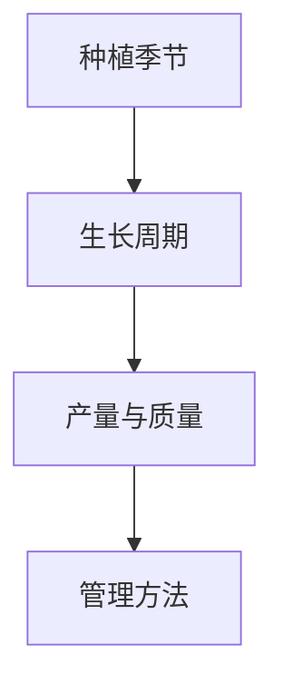

**核心算法原理讲解：**

在本部分中，没有具体的算法原理讲解，但我们可以通过伪代码来表示种植季节与管理的流程：

```python
def 种植季节与管理():
    # 确定种植季节
    季节 = 确定季节()
    
    # 根据季节调整管理方法
    管理方法 = 调整管理方法(季节)
    
    # 实施种植和管理
    种植与管理(季节, 管理方法)
    
    # 输出种植与管理结果
    print("种植与管理完成")
```

**数学模型和公式：**

在本部分中，没有直接相关的数学模型和公式。

**详细讲解与举例说明：**

以下是种植季节与管理的一些关键点和实际案例：

- 种植季节：一般来说，可可豆的种植季节在春季或秋季，具体取决于当地的气候条件。
- 管理方法：在种植季节期间，需要定期进行灌溉、施肥和病虫害防治，以确保可可豆的健康生长。例如，在干旱季节，需要增加灌溉次数；在病虫害高发期，需要加强防治措施。

#### 1.4.2 土壤选择与改良

土壤是可可豆生长的基础，选择合适的土壤并进行改良，对于提高可可豆的产量和质量至关重要。

**核心概念与联系：**

土壤选择与改良不仅关系到可可豆的生长环境，还直接影响巧克力的风味和质量。以下是一个简单的 Mermaid 流程图，展示了土壤选择与改良的过程：

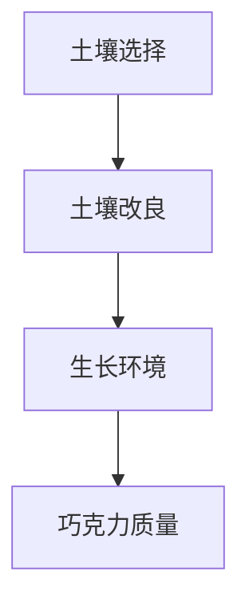

**核心算法原理讲解：**

在本部分中，没有具体的算法原理讲解，但我们可以通过伪代码来表示土壤选择与改良的流程：

```python
def 土壤选择与改良():
    # 选择土壤
    土壤 = 选择土壤(土壤质量)
    
    # 改良土壤
    改良土壤(土壤, 肥料)
    
    # 检查改良效果
    检查效果(土壤)
    
    # 输出土壤状况
    print("土壤选择与改良完成")
```

**数学模型和公式：**

在本部分中，没有直接相关的数学模型和公式。

**详细讲解与举例说明：**

以下是土壤选择与改良的一些关键点和实际案例：

- 土壤选择：选择富含有机质、排水良好、pH值适中的土壤。例如，沙质土壤通常更适合可可豆的生长。
- 土壤改良：通过添加有机肥料、石灰或其他改良剂来改善土壤的肥力和结构。例如，在酸性土壤中添加石灰可以中和土壤的酸性。

#### 1.4.3 病虫害防治

病虫害防治是可可豆种植过程中至关重要的一环，有效的防治措施可以显著提高可可豆的产量和质量。

**核心概念与联系：**

病虫害防治直接关系到可可豆的健康生长和产量，同时也影响到巧克力的风味和质量。以下是一个简单的 Mermaid 流程图，展示了病虫害防治的过程：

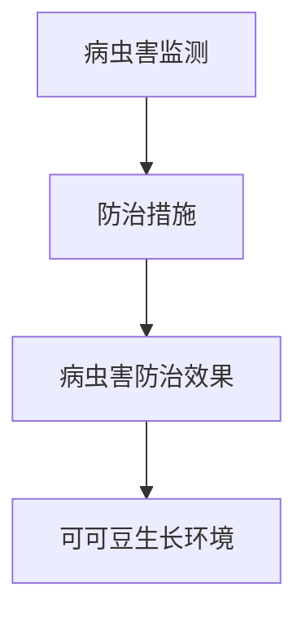

**核心算法原理讲解：**

在本部分中，没有具体的算法原理讲解，但我们可以通过伪代码来表示病虫害防治的流程：

```python
def 病虫害防治():
    # 监测病虫害
    病害 = 监测病虫害(植物)
    虫害 = 监测病虫害(植物)
    
    # 选择防治措施
    防治措施 = 选择措施(病虫害)
    
    # 实施防治措施
    防治病虫害(植物, 防治措施)
    
    # 检查防治效果
    检查效果(植物)
    
    # 输出防治结果
    print("病虫害防治完成")
```

**数学模型和公式：**

在本部分中，没有直接相关的数学模型和公式。

**详细讲解与举例说明：**

以下是病虫害防治的一些关键点和实际案例：

- 监测病虫害：定期检查可可豆植株，及时发现病虫害的迹象。
- 防治措施：根据病虫害的类型和严重程度选择合适的防治措施，如喷洒农药、修剪病枝、使用有机防治剂等。
- 防治效果检查：在实施防治措施后，定期检查可可豆植株的健康状况，确保防治措施的有效性。

#### 1.5 可可豆加工处理

可可豆加工处理是巧克力制作的关键步骤，涉及到可可豆的清洗、发酵、烘焙和研磨等过程。

**核心概念与联系：**

可可豆加工处理不仅影响到巧克力的风味和质量，还直接关系到巧克力的生产效率和成本。以下是一个简单的 Mermaid 流程图，展示了可可豆加工处理的过程：

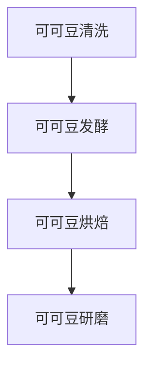

**核心算法原理讲解：**

在本部分中，没有具体的算法原理讲解，但我们可以通过伪代码来表示可可豆加工处理的流程：

```python
def 可可豆加工处理():
    # 清洗可可豆
    清洗可可豆(可可豆)
    
    # 发酵可可豆
    发酵可可豆(可可豆)
    
    # 烘焙可可豆
    烘焙可可豆(可可豆)
    
    # 研磨可可豆
    研磨可可豆(可可豆)
    
    # 输出加工处理结果
    print("可可豆加工处理完成")
```

**数学模型和公式：**

在本部分中，没有直接相关的数学模型和公式。

**详细讲解与举例说明：**

以下是可可豆加工处理的一些关键点和实际案例：

- 清洗可可豆：清洗可可豆的目的是去除豆壳和其他杂质，确保可可豆的纯净。
- 发酵可可豆：发酵是可可豆加工处理的关键步骤，它能够改变可可豆的口感和风味。
- 烘焙可可豆：烘焙有助于去除可可豆中的水分，使其变得更容易研磨。
- 研磨可可豆：研磨可可豆可以得到可可液块，这是制作巧克力的主要原料。

### 第二部分：巧克力制作工艺

#### 2.1 巧克力原材料与配方

巧克力的制作需要多种原材料，包括可可粉、可可脂、糖、牛奶等。巧克力的配方直接影响巧克力的口感、味道和营养价值。

**核心概念与联系：**

巧克力的原材料和配方不仅决定了巧克力的基础风味，还影响到巧克力的口感和营养价值。以下是一个简单的 Mermaid 流程图，展示了巧克力原材料与配方的关系：

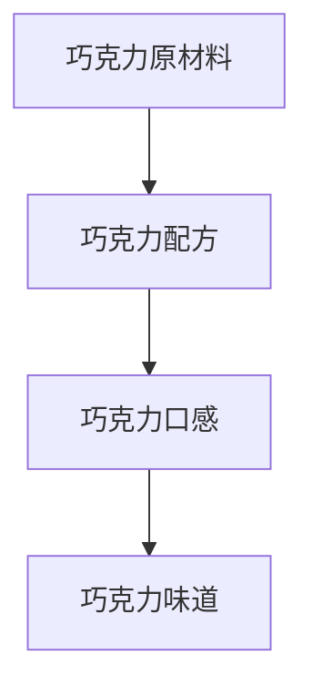

**核心算法原理讲解：**

在本部分中，没有具体的算法原理讲解，但我们可以通过伪代码来表示巧克力原材料与配方的选择过程：

```python
def 巧克力原材料与配方():
    # 选择巧克力原材料
    原材料 = 选择原材料()
    
    # 制定巧克力配方
    配方 = 制定配方(原材料)
    
    # 输出原材料与配方
    print("原材料：", 原材料)
    print("配方：", 配方)
```

**数学模型和公式：**

在本部分中，没有直接相关的数学模型和公式。

**详细讲解与举例说明：**

以下是巧克力原材料与配方的一些关键点和实际案例：

- 原材料：可可粉、可可脂、糖、牛奶等是巧克力制作的基本原材料。每种原材料的比例和选择都会影响巧克力的口感和味道。
- 配方：巧克力的配方通常包括可可粉、可可脂、糖、牛奶等成分的比例。通过调整这些比例，可以创造出不同的巧克力风味。

#### 2.2 巧克力生产设备与工艺流程

巧克力的制作需要一系列专业的设备，包括可可豆研磨机、混合机、模具等。巧克力的工艺流程包括研磨、混合、调温、浇注等步骤。

**核心概念与联系：**

巧克力的生产设备和工艺流程直接影响巧克力的质量和生产效率。以下是一个简单的 Mermaid 流程图，展示了巧克力生产设备和工艺流程的关系：

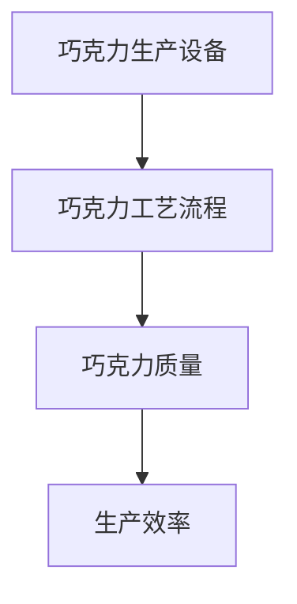

**核心算法原理讲解：**

在本部分中，没有具体的算法原理讲解，但我们可以通过伪代码来表示巧克力生产设备和工艺流程的流程：

```python
def 巧克力生产设备与工艺流程():
    # 选择巧克力生产设备
    设备 = 选择设备()
    
    # 设备安装与调试
    安装调试设备(设备)
    
    # 进行巧克力制作
    制作巧克力(设备)
    
    # 工艺流程控制
    控制工艺流程(设备)
    
    # 输出巧克力产品
    输出产品(设备)
```

**数学模型和公式：**

在本部分中，没有直接相关的数学模型和公式。

**详细讲解与举例说明：**

以下是巧克力生产设备与工艺流程的一些关键点和实际案例：

- 设备选择：根据生产规模和产品质量的要求，选择合适的巧克力生产设备。
- 工艺流程控制：通过精确控制巧克力生产的每个环节，确保巧克力的质量和口感。

#### 2.3 巧克力的品质控制与检测

巧克力的品质控制与检测是保证产品质量的关键环节，涉及到外观、口感、温度等多个方面的检测。

**核心概念与联系：**

巧克力的品质控制与检测直接影响巧克力的市场价值和消费者的满意度。以下是一个简单的 Mermaid 流程图，展示了巧克力品质控制与检测的关系：

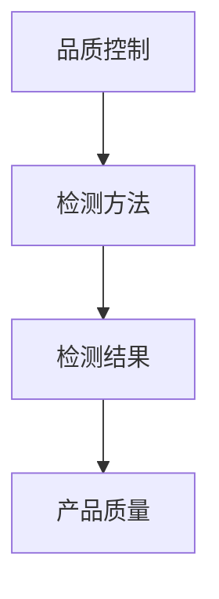

**核心算法原理讲解：**

在本部分中，没有具体的算法原理讲解，但我们可以通过伪代码来表示巧克力品质控制与检测的流程：

```python
def 巧克力的品质控制与检测():
    # 品质控制
    控制品质(巧克力)
    
    # 检测方法
    检测方法 = 选择检测方法()
    
    # 检测结果
    结果 = 进行检测(巧克力, 检测方法)
    
    # 输出检测结果
    print("检测结果：", 结果)
```

**数学模型和公式：**

在本部分中，没有直接相关的数学模型和公式。

**详细讲解与举例说明：**

以下是巧克力品质控制与检测的一些关键点和实际案例：

- 外观检测：检查巧克力的颜色、光泽和形状，确保其符合标准。
- 口感检测：通过品尝巧克力的口感，评估其甜度、苦度和质感。
- 温度检测：确保巧克力在生产、存储和运输过程中的温度控制符合要求。

### 第三部分：巧克力艺术创作

#### 2.4 巧克力艺术设计与造型

巧克力艺术设计与造型是将巧克力的功能性、视觉性和艺术性结合起来的创作过程，涉及创意构思、造型设计、色彩搭配和纹理处理。

**核心概念与联系：**

巧克力艺术设计与造型不仅需要创造性思维，还需要对巧克力的物理特性和艺术表现技巧有深入理解。以下是一个简单的 Mermaid 流程图，展示了巧克力艺术设计与造型的关键步骤：

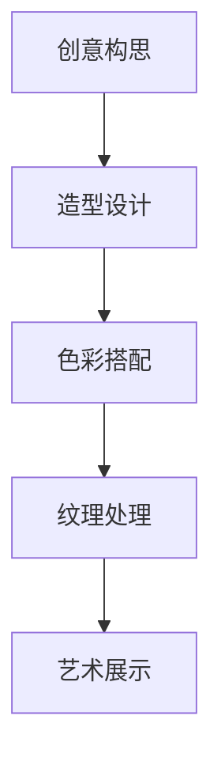

**核心算法原理讲解：**

在本部分中，没有具体的算法原理讲解，但我们可以通过伪代码来表示巧克力艺术设计与造型的流程：

```python
def 巧克力艺术设计与造型():
    # 创意构思
    构思 = 创意构思()
    
    # 造型设计
    设计 = 造型设计(构思)
    
    # 色彩搭配
    色彩 = 色彩搭配(设计)
    
    # 纹理处理
    纹理 = 纹理处理(色彩)
    
    # 艺术展示
    展示 = 艺术展示(纹理)
    
    # 输出最终作品
    print("巧克力艺术作品完成")
```

**数学模型和公式：**

在本部分中，没有直接相关的数学模型和公式。

**详细讲解与举例说明：**

以下是巧克力艺术设计与造型的一些关键点和实际案例：

- 创意构思：从主题、灵感、情境等方面进行创造性构思，为巧克力艺术创作提供基础。
- 造型设计：根据创意构思，设计巧克力的形状和结构，使其具有独特的艺术魅力。
- 色彩搭配：巧妙运用色彩，增强巧克力的视觉吸引力，创造出和谐统一的视觉效果。
- 纹理处理：通过雕刻、刻画、喷洒等技术手段，赋予巧克力丰富的纹理和质感。

#### 2.5 巧克力装饰技巧与应用

巧克力装饰技巧是将巧克力艺术创作的最后一步，包括雕刻、绘画、糖霜和果酱等装饰手法，使巧克力作品更加精美和引人入胜。

**核心概念与联系：**

巧克力装饰技巧不仅能够提升巧克力的视觉效果，还能增强其艺术价值。以下是一个简单的 Mermaid 流程图，展示了巧克力装饰技巧与应用的关系：

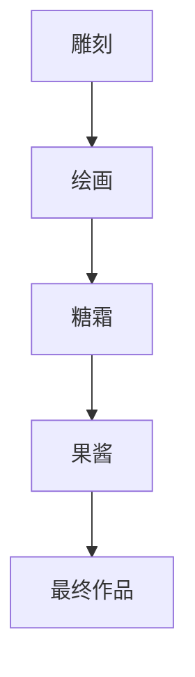

**核心算法原理讲解：**

在本部分中，没有具体的算法原理讲解，但我们可以通过伪代码来表示巧克力装饰技巧与应用的流程：

```python
def 巧克力装饰技巧与应用():
    # 雕刻
    雕刻 = 雕刻技巧()
    
    # 绘画
    绘画 = 绘画技巧()
    
    # 糖霜
    糖霜 = 糖霜技巧()
    
    # 果酱
    果酱 = 果酱技巧()
    
    # 最终作品
    作品 = 装饰技巧(雕刻, 绘画, 糖霜, 果酱)
    
    # 输出最终作品
    print("巧克力装饰完成")
```

**数学模型和公式：**

在本部分中，没有直接相关的数学模型和公式。

**详细讲解与举例说明：**

以下是巧克力装饰技巧与应用的一些关键点和实际案例：

- 雕刻：使用巧克力雕刻工具，将巧克力雕刻成各种形状和图案，创造出独特的视觉效果。
- 绘画：在巧克力表面绘制图案和图像，使用巧克力笔、色素等材料进行创作。
- 糖霜：使用巧克力糖霜覆盖巧克力表面，形成光滑的质感，并可以根据需要添加装饰物。
- 果酱：在巧克力表面涂抹果酱，增加色彩和口感，同时可以作为装饰材料。

### 第四部分：巧克力包装与营销

#### 2.6 巧克力的包装设计

巧克力的包装设计不仅起到保护巧克力免受外界污染的作用，还能够提升巧克力的视觉吸引力和市场竞争力。

**核心概念与联系：**

巧克力的包装设计需要考虑包装材料、设计风格、颜色搭配和功能性等多个方面，以实现巧克力的品牌传播和市场营销目标。以下是一个简单的 Mermaid 流程图，展示了巧克力包装设计的关键步骤：

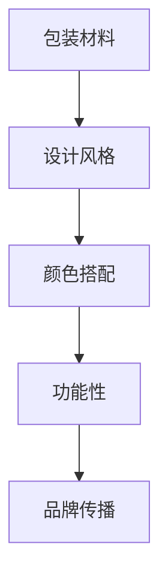

**核心算法原理讲解：**

在本部分中，没有具体的算法原理讲解，但我们可以通过伪代码来表示巧克力包装设计的流程：

```python
def 巧克力包装设计():
    # 选择包装材料
    材料 = 选择材料()
    
    # 确定设计风格
    风格 = 确定风格()
    
    # 色彩搭配
    颜色 = 色彩搭配(风格)
    
    # 确保功能性
    功能 = 确保功能(材料, 颜色)
    
    # 品牌传播
    传播 = 品牌传播(风格, 颜色, 功能)
    
    # 输出包装设计
    print("巧克力包装设计完成")
```

**数学模型和公式：**

在本部分中，没有直接相关的数学模型和公式。

**详细讲解与举例说明：**

以下是巧克力包装设计的一些关键点和实际案例：

- 包装材料：选择合适的包装材料，如纸质包装、塑料包装、玻璃瓶等，以满足巧克力的保护性和美观性要求。
- 设计风格：根据品牌特色和消费者喜好，确定巧克力的设计风格，如现代简约、复古浪漫、清新自然等。
- 颜色搭配：合理运用色彩，增强巧克力的视觉吸引力，同时体现品牌形象和产品特点。
- 功能性：确保包装设计具备良好的防潮、防霉、防震等功能，保护巧克力在运输和存储过程中的品质。

#### 2.7 巧克力的营销策略

巧克力的营销策略包括市场分析、品牌定位、广告推广、线上线下销售策略等多个方面，旨在提升巧克力的市场占有率和消费者满意度。

**核心概念与联系：**

巧克力的营销策略需要根据市场环境和消费者需求进行灵活调整，以实现品牌推广和销售目标。以下是一个简单的 Mermaid 流程图，展示了巧克力营销策略的关键环节：

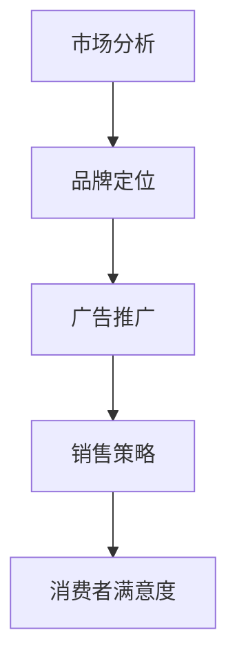

**核心算法原理讲解：**

在本部分中，没有具体的算法原理讲解，但我们可以通过伪代码来表示巧克力营销策略的流程：

```python
def 巧克力营销策略():
    # 市场分析
    分析 = 市场分析()
    
    # 品牌定位
    定位 = 品牌定位(分析)
    
    # 广告推广
    推广 = 广告推广(定位)
    
    # 销售策略
    策略 = 销售策略(定位, 推广)
    
    # 消费者满意度
    满意度 = 消费者满意度(策略)
    
    # 输出营销策略
    print("巧克力营销策略完成")
```

**数学模型和公式：**

在本部分中，没有直接相关的数学模型和公式。

**详细讲解与举例说明：**

以下是巧克力营销策略的一些关键点和实际案例：

- 市场分析：通过市场调研和分析，了解目标市场的消费者需求、竞争态势和行业趋势。
- 品牌定位：根据市场分析和品牌特点，确定巧克力的品牌定位，如高端奢华、大众消费、健康天然等。
- 广告推广：通过电视广告、社交媒体广告、户外广告等方式，提升巧克力的品牌知名度和市场影响力。
- 销售策略：根据品牌定位和市场需求，制定线上线下销售策略，如促销活动、会员制度、渠道拓展等。
- 消费者满意度：通过消费者反馈和市场调查，了解消费者对巧克力的满意度，持续优化产品和服务。

### 附录

#### 2.8 巧克力制作常用工具与材料

在本附录中，我们将介绍巧克力制作过程中常用的工具和材料，包括模具、刮刀、巧克力笔、色素、糖霜等。

**核心概念与联系：**

巧克力制作工具和材料的选择和使用直接影响巧克力的质量和艺术效果。以下是一个简单的 Mermaid 流程图，展示了巧克力制作常用工具与材料的使用过程：

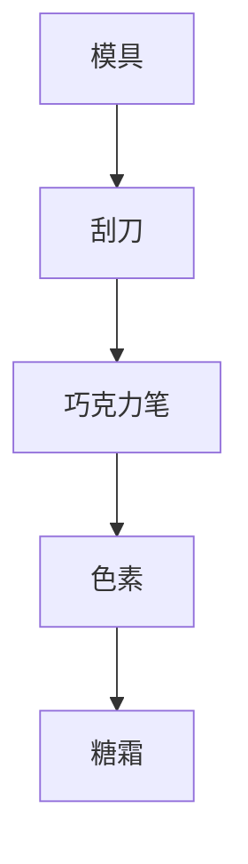

**核心算法原理讲解：**

在本部分中，没有具体的算法原理讲解，但我们可以通过伪代码来表示巧克力制作常用工具与材料的使用方法：

```python
def 使用工具与材料():
    # 使用模具
    模具 = 使用模具()
    
    # 使用刮刀
    刮刀 = 使用刮刀()
    
    # 使用巧克力笔
    巧克力笔 = 使用巧克力笔()
    
    # 使用色素
    色素 = 使用色素()
    
    # 使用糖霜
    糖霜 = 使用糖霜()
    
    # 输出巧克力作品
    print("巧克力作品完成")
```

**数学模型和公式：**

在本部分中，没有直接相关的数学模型和公式。

**详细讲解与举例说明：**

以下是巧克力制作常用工具与材料的一些关键点和实际案例：

- 模具：模具用于制作巧克力的形状，可以选择硅胶模具、塑料模具、金属模具等。
- 刮刀：刮刀用于将巧克力刮平或刮掉多余的巧克力，使其表面光滑。
- 巧克力笔：巧克力笔用于在巧克力表面绘制图案和线条，可以增加巧克力的艺术性。
- 色素：色素用于给巧克力添加颜色，可以根据需要选择食用色素或天然色素。
- 糖霜：糖霜用于装饰巧克力，可以增加巧克力的口感和美观性。

#### 2.9 巧克力制作基础配方

在本附录中，我们将介绍巧克力制作的基本配方，包括可可粉、可可脂、糖、牛奶等成分的比例和调整方法。

**核心概念与联系：**

巧克力制作的基础配方直接关系到巧克力的口感、味道和营养价值。以下是一个简单的 Mermaid 流程图，展示了巧克力制作基础配方的关键步骤：

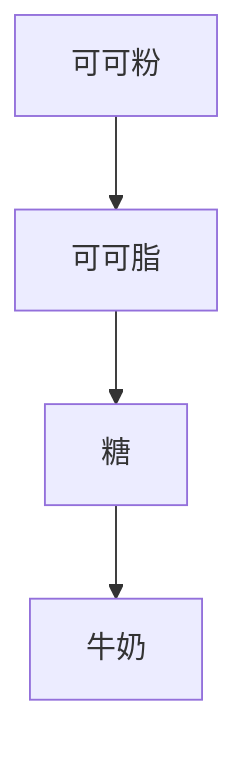

**核心算法原理讲解：**

在本部分中，没有具体的算法原理讲解，但我们可以通过伪代码来表示巧克力制作基础配方的调整过程：

```python
def 调整配方():
    # 初始化配方
    配方 = 初始化配方()
    
    # 调整可可粉比例
    调整比例(配方['可可粉'])
    
    # 调整可可脂比例
    调整比例(配方['可可脂'])
    
    # 调整糖比例
    调整比例(配方['糖'])
    
    # 调整牛奶比例
    调整比例(配方['牛奶'])
    
    # 输出最终配方
    print("最终配方：", 配方)
```

**数学模型和公式：**

在本部分中，没有直接相关的数学模型和公式。

**详细讲解与举例说明：**

以下是巧克力制作基础配方的一些关键点和实际案例：

- 可可粉：可可粉是巧克力的主要成分，通常占配方总量的20%到40%。增加可可粉比例可以提升巧克力的苦味和口感。
- 可可脂：可可脂是巧克力的主要脂肪成分，通常占配方总量的30%到50%。调整可可脂比例可以影响巧克力的熔点和口感。
- 糖：糖是巧克力的甜味来源，通常占配方总量的40%到60%。增加糖比例可以提升巧克力的甜度。
- 牛奶：牛奶可以增加巧克力的奶香味和口感，通常占配方总量的5%到15%。使用不同种类的牛奶可以创造出不同的巧克力风味。

#### 2.10 巧克力艺术作品欣赏与案例分析

在本附录中，我们将介绍一些经典的巧克力艺术作品，并提供案例分析，以便读者更好地理解和欣赏巧克力艺术。

**核心概念与联系：**

巧克力艺术作品的欣赏和分析不仅能够提升读者的审美水平，还能激发读者的创作灵感。以下是一个简单的 Mermaid 流程图，展示了巧克力艺术作品欣赏与案例分析的关系：

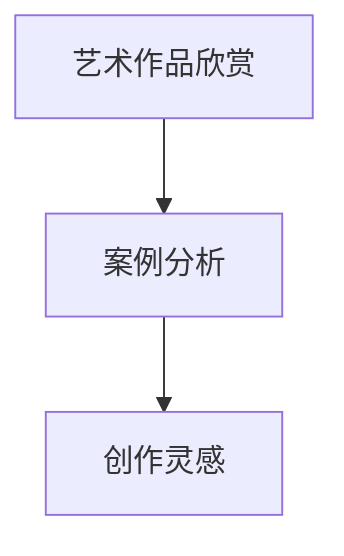

**核心算法原理讲解：**

在本部分中，没有具体的算法原理讲解，但我们可以通过伪代码来表示巧克力艺术作品欣赏与案例分析的过程：

```python
def 欣赏与案例分析():
    # 欣赏艺术作品
    欣赏作品(艺术作品)
    
    # 进行案例分析
    分析作品(艺术作品)
    
    # 激发创作灵感
    灵感 = 激发灵感(分析结果)
    
    # 输出欣赏与案例分析结果
    print("欣赏与案例分析完成")
```

**数学模型和公式：**

在本部分中，没有直接相关的数学模型和公式。

**详细讲解与举例说明：**

以下是巧克力艺术作品欣赏与案例分析的一些关键点和实际案例：

- 艺术作品欣赏：通过欣赏不同风格的巧克力艺术作品，了解巧克力的多种艺术表现形式和创作技巧。
- 案例分析：分析经典巧克力艺术作品的创作思路、技巧和材料运用，以便读者从中学习和借鉴。
- 创作灵感：从欣赏和分析中汲取灵感，激发自己的创作欲望，尝试创作独特的巧克力艺术作品。

### 结语

通过本文的深度探索，我们全面了解了现代手工巧克力的制作过程，从可可豆的种植与处理，到巧克力的制作工艺和艺术创作，再到巧克力的包装与营销，为读者提供了一幅完整的手工巧克力生产与创作全景。我们希望本文能够激发读者对巧克力艺术的热爱与追求，同时也为从事巧克力制作的从业者提供实用的技术指导和灵感来源。

在未来的实践中，我们鼓励读者不断探索和创新，结合自己的实际情况，创作出更多具有独特风格和艺术价值的巧克力作品。同时，也欢迎读者提出宝贵意见和建议，共同推动巧克力艺术的发展。

**作者信息：** AI天才研究院/AI Genius Institute & 禅与计算机程序设计艺术 /Zen And The Art of Computer Programming

