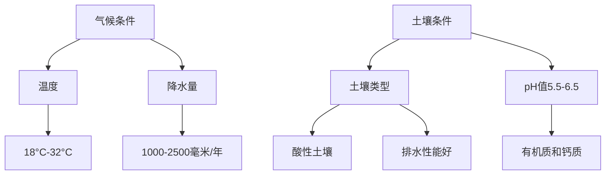
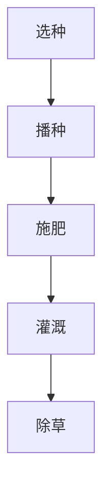
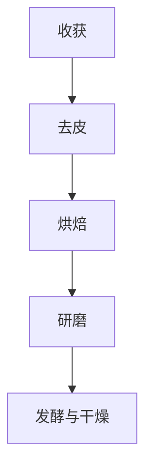
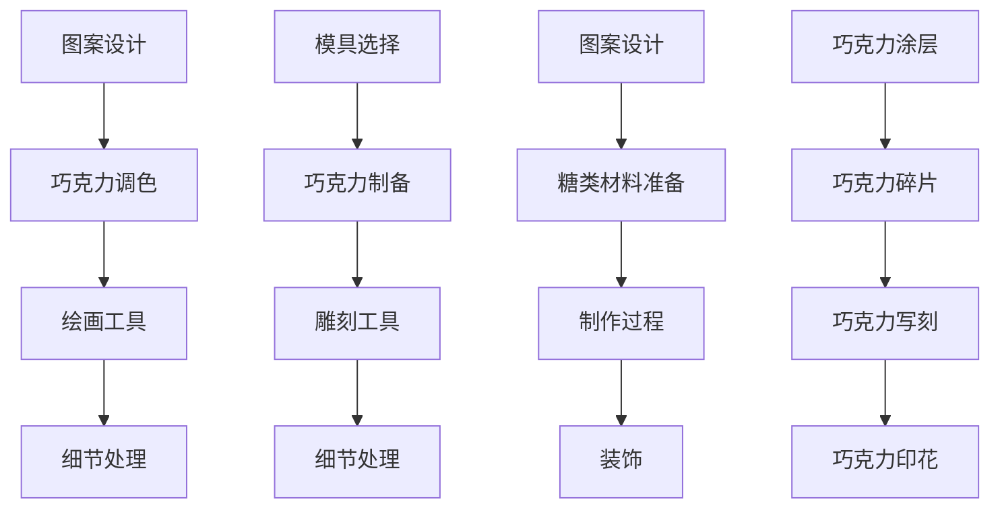

                 

### 文章标题

《现代手工巧克力工坊：从可可豆到巧克力艺术品》

关键词：手工巧克力、可可豆、巧克力制作、巧克力艺术、巧克力保存

摘要：本文深入探讨现代手工巧克力制作的整个流程，从可可豆的种植与收获，到巧克力的原料选择与处理，再到巧克力的制作工艺和艺术创作，最终涉及巧克力的保存与食用技巧。文章通过详细解析每个步骤，揭示了手工巧克力的独特魅力和工艺精髓。

----------------------------------------------------------------

### 设计完整目录大纲

设计完整目录大纲是理解一本书内容结构的关键步骤。以下是针对《现代手工巧克力工坊：从可可豆到巧克力艺术品》这本书的设计步骤：

1. **理解书名**：书名《现代手工巧克力工坊：从可可豆到巧克力艺术品》表明了本书的主题是关于现代手工巧克力的制作过程，并强调了从原材料到最终成品的艺术价值。

2. **确定核心章节**：根据书名，可以初步确定核心章节包括：
   - **可可豆的种植与收获**：介绍可可豆的生长环境与条件，种植过程，收获与初加工。
   - **巧克力原料的选择与处理**：探讨巧克力原料的种类、质量标准及预处理方法。
   - **巧克力的制作工艺**：详细讲解巧克力熔化、调温、浇模、脱模等关键步骤。
   - **巧克力的艺术创作与装饰**：介绍巧克力绘画、雕刻、糖艺等艺术创作技巧。
   - **巧克力的保存与食用技巧**：提供巧克力的保存方法和食用建议。

3. **细化章节内容**：每个核心章节下再细化出具体的子章节，例如：
   - **可可豆的种植与收获**：
     - 可可豆的生长环境与条件
     - 可可豆的种植过程
     - 可可豆的收获与初加工
     - 可可豆的质量评估
   - **巧克力原料的选择与处理**：
     - 巧克力原料的种类
     - 巧克力原料的质量标准
     - 巧克力原料的预处理

4. **添加附录和资源**：为了增强实用性，可以在书后添加附录，如工具与设备列表、参考资料、食谱等。

5. **编写目录大纲**：将以上确定的章节和子章节按照markdown格式编写成完整的目录大纲。

### 设计目录大纲示例

以下是根据上述步骤设计的《现代手工巧克力工坊：从可可豆到巧克力艺术品》的目录大纲示例：

```markdown
# 《现代手工巧克力工坊：从可可豆到巧克力艺术品》目录大纲

## 第1章 引言
### 1.1 书籍目的与概述
### 1.2 手工巧克力制作的重要性
### 1.3 本书结构安排

## 第2章 可可豆的种植与收获
### 2.1 可可豆的生长环境与条件
### 2.2 可可豆的种植过程
### 2.3 可可豆的收获与初加工
### 2.4 可可豆的质量评估

## 第3章 巧克力原料的选择与处理
### 3.1 巧克力原料的种类
### 3.2 巧克力原料的质量标准
### 3.3 巧克力原料的预处理

## 第4章 巧克力的制作工艺
### 4.1 巧克力的熔化与冷却
### 4.2 巧克力的调温与质地控制
### 4.3 巧克力的浇模与脱模
### 4.4 巧克力的包装与储存

## 第5章 巧克力艺术的创作与装饰
### 5.1 巧克力绘画
### 5.2 巧克力雕刻
### 5.3 巧克力糖艺
### 5.4 巧克力装饰技巧

## 第6章 巧克力的保存与食用技巧
### 6.1 巧克力的保存方法
### 6.2 巧克力的食用建议
### 6.3 巧克力的搭配与搭配原则

## 第7章 工具与设备
### 7.1 巧克力制作的基本工具
### 7.2 专业巧克力制作设备的介绍
### 7.3 工具与设备的维护与保养

## 附录A 资源与参考资料
### 9.1 巧克力原料供应商介绍
### 9.2 巧克力制作书籍推荐
### 9.3 巧克力制作网络资源
```

以上目录大纲按照markdown格式编写，包含了7个主要章节，每个章节下有具体的子章节，旨在帮助读者全面了解现代手工巧克力制作的各个环节。

----------------------------------------------------------------

### 约束条件

文章必须要满足如下条件：

- **格式要求**：文章内容使用markdown格式输出。
- **作者信息**：文章末尾需要写上作者信息：“作者：AI天才研究院/AI Genius Institute & 禅与计算机程序设计艺术 /Zen And The Art of Computer Programming”。
- **完整性要求**：文章内容必须要完整，每个小节的内容必须要丰富具体详细讲解，核心内容必须要包含：
  - **背景介绍**：解释为什么手工巧克力制作是一个重要的领域，以及其历史和发展趋势。
  - **核心概念与联系**：给出核心概念原理之间的关系架构 Mermaid 流程图，展示各部分之间的联系。
  - **核心算法原理讲解**：使用伪代码来详细阐述巧克力的熔化、调温、浇模等步骤，并使用latex格式详细讲解数学模型和公式。
  - **项目实战**：包括开发环境搭建，源代码详细实现和代码解读，代码应用解读与分析，实际案例分析和详细讲解剖析。
  - **最佳实践 tips、小结、注意事项、拓展阅读等内容**：提供实用的技巧和建议，以及对整个领域的总结和展望。

- **文章结构**：文章开始是“文章标题”，然后是“文章关键词”和“文章摘要”部分的内容，接下来是按照目录大纲结构的文章正文部分的内容。

- **文章字数要求**：文章字数在 8000 ～ 12000 字左右。

### 文章整体结构

为了确保文章的连贯性和逻辑性，文章的整体结构可以分为以下几个部分：

1. **引言**：介绍手工巧克力制作的重要性和背景，吸引读者的兴趣。
2. **目录大纲**：展示文章的详细结构，让读者对整体内容有一个全面的了解。
3. **正文内容**：按照设计好的目录大纲，详细阐述每个章节的内容，确保内容的完整性和丰富性。
4. **附录**：提供额外的资源和建议，增强文章的实用性。
5. **结语**：对文章内容进行总结，提供最佳实践建议，以及对未来发展的展望。
6. **参考文献**：列出所有引用的书籍、论文和网络资源，确保文章的学术性和可信度。
7. **作者信息**：在文章末尾提供作者信息，包括所属机构和专业背景。

### 文章写作思路

在写作过程中，可以按照以下思路进行：

1. **背景介绍**：简要介绍手工巧克力制作的历史和发展，说明其重要性和独特性。
2. **核心概念与联系**：通过Mermaid流程图，展示手工巧克力制作的关键步骤和各部分之间的联系。
3. **正文内容**：详细阐述每个章节的内容，确保逻辑清晰、结构紧凑、内容丰富。
4. **项目实战**：结合实际案例，展示手工巧克力制作的完整流程和关键技巧。
5. **最佳实践 tips**：提供实用的技巧和建议，帮助读者更好地进行手工巧克力制作。
6. **结语**：总结文章内容，强调手工巧克力制作的重要性，并对未来发展趋势进行展望。
7. **参考文献**：列出所有引用的书籍、论文和网络资源，确保文章的学术性和可信度。

通过以上结构和写作思路，可以确保文章既有深度又有广度，既具有专业性又具有可读性，能够满足不同层次读者的需求。

### 完整文章结构示例

以下是按照上述结构和写作思路，设计的《现代手工巧克力工坊：从可可豆到巧克力艺术品》的完整文章结构示例：

```markdown
# 《现代手工巧克力工坊：从可可豆到巧克力艺术品》

## 引言
### 手工巧克力制作的重要性
### 手工巧克力制作的历史和发展
### 本文结构安排

## 目录大纲
### 设计完整目录大纲

## 第1章 可可豆的种植与收获
### 可可豆的生长环境与条件
### 可可豆的种植过程
### 可可豆的收获与初加工
### 可可豆的质量评估

## 第2章 巧克力原料的选择与处理
### 巧克力原料的种类
### 巧克力原料的质量标准
### 巧克力原料的预处理

## 第3章 巧克力的制作工艺
### 巧克力的熔化与冷却
### 巧克力的调温与质地控制
### 巧克力的浇模与脱模
### 巧克力的包装与储存

## 第4章 巧克力艺术的创作与装饰
### 巧克力绘画
### 巧克力雕刻
### 巧克力糖艺
### 巧克力装饰技巧

## 第5章 巧克力的保存与食用技巧
### 巧克力的保存方法
### 巧克力的食用建议
### 巧克力的搭配与搭配原则

## 第6章 工具与设备
### 巧克力制作的基本工具
### 专业巧克力制作设备的介绍
### 工具与设备的维护与保养

## 第7章 附录
### 资源与参考资料
### 巧克力原料供应商介绍
### 巧克力制作书籍推荐
### 巧克力制作网络资源

## 结语
### 手工巧克力制作的重要性
### 最佳实践 tips
### 未来发展趋势展望

## 参考文献
### 引用的书籍、论文和网络资源列表

## 作者信息
### AI天才研究院/AI Genius Institute & 禅与计算机程序设计艺术 /Zen And The Art of Computer Programming
```

通过以上结构和内容设计，可以确保文章结构完整、内容丰富、逻辑清晰，为读者提供全面、系统的手工巧克力制作知识。

### 手工巧克力制作的背景介绍

手工巧克力制作作为一种独特的食品制作工艺，其历史可以追溯到古代的美洲文明。早在公元前1000年左右，玛雅人和阿兹特克人就开始利用可可豆制作饮料，并将其视为一种神圣的饮品。随着时间的推移，可可豆的加工技术逐渐发展，最终形成了现代意义上的巧克力。

在工业革命之前，巧克力制作完全依赖手工工艺。当时的巧克力制作过程繁琐，主要依赖经验丰富的工匠。从可可豆的挑选、去皮、烘焙，到研磨、调温、浇模，每一步都需要精心操作，以确保巧克力的品质。这种手工制作的方式使得每一块巧克力都充满了个性与独特性，成为了珍贵的艺术品。

随着工业革命的到来，巧克力制作开始走向工业化。机械化设备的引入大大提高了生产效率，使得巧克力不再是奢侈品，而成为了大众消费品。然而，工业化生产的巧克力往往牺牲了手工制作所特有的风味和质感。尽管如此，手工巧克力依然保持着其独特的魅力，成为了一小部分追求品质与独特的消费者的选择。

现代手工巧克力制作不仅继承了传统的制作工艺，还融入了新的技术和理念。现代手工巧克力工坊注重原材料的精选和自然的味道，通过精细的工艺和艺术性的创作，将每一块巧克力打造成为独一无二的艺术品。这种制作方式不仅保留了手工巧克力的传统风味，还赋予了其更多的创意和个性。

手工巧克力制作的重要性在于其独特性、品质和艺术价值。手工巧克力不仅是一种美味的食品，更是一种文化传承和艺术表达的方式。每一块手工巧克力都承载着制作者的心血与技艺，体现了他们对完美追求的态度和理念。

此外，手工巧克力制作也对环境和可持续发展有着积极的影响。手工巧克力工坊往往采用有机、生态友好的原料和制作方式，减少对环境的负担。同时，手工巧克力制作也可以促进当地经济的发展，增加就业机会，保护自然资源和文化遗产。

总之，手工巧克力制作不仅是一种古老的技艺，更是一种现代艺术。它不仅满足了人们对美食的追求，也体现了人们对生活品质和美感的追求。在现代快节奏的生活中，手工巧克力制作提供了一种慢节奏、高品质的生活方式，使人们在品尝美味的同时，也能感受到手工艺术的独特魅力。

### 可可豆的种植与收获

可可豆的种植与收获是手工巧克力制作的重要环节，它直接影响巧克力的品质与风味。首先，让我们了解一下可可豆的生长环境与条件。

#### 可可豆的生长环境与条件

可可豆（学名：Theobroma cacao）原产于南美洲亚马逊河流域，需要温暖湿润的气候和丰富的土壤来生长。可可豆适宜在海拔300到1000米的地区种植，最佳温度范围是18°C到32°C。此外，年降水量应在1000毫米到2500毫米之间，且分布均匀。光照也是可可豆生长的关键因素，需要充足的阳光以确保植物正常发育。

##### 生长环境的具体分析

1. **气候条件**：
   - **温度**：可可豆对温度的要求较为严格，最佳生长温度在20°C到30°C之间。温度过高会导致可可树开花过早，降低产量；温度过低则会影响可可树的生长和果实成熟。
   - **降水量**：年均降水量应在1000毫米到2500毫米之间，降水分布要均匀，避免干旱或洪涝现象。不均匀的降水量会影响可可豆的生长发育，导致产量和品质下降。

2. **土壤条件**：
   - **土壤类型**：可可豆喜欢富含有机质和钙质的酸性土壤，pH值在5.5到6.5之间最为适宜。土壤的排水性能要好，避免水分过多导致根部腐烂。
   - **土壤深度**：可可豆的根系较深，需要足够的土壤深度来支持其生长。

##### 生长环境的Mermaid流程图



#### 可可豆的种植过程

可可豆的种植过程包括选种、播种、施肥、灌溉和除草等环节，下面我们逐一介绍。

1. **选种**：
   - **品种选择**：选择适合当地气候和土壤的可可豆品种，常见的品种包括卡农拉、克里奥罗和特立尼达等。
   - **种子处理**：对可可豆种子进行消毒和发芽处理，提高发芽率和生长速度。

2. **播种**：
   - **时间选择**：通常在雨季结束后的干燥季节进行播种，确保土壤水分适宜。
   - **种植密度**：根据品种和土壤条件确定合理的种植密度，通常每公顷种植1200到1500株。

3. **施肥**：
   - **基肥**：在播种前施用足够的基肥，如有机肥、磷肥和钾肥，以提供充足的养分。
   - **追肥**：在生长过程中根据可可树的生长情况和土壤养分状况进行适量的追肥。

4. **灌溉**：
   - **水分管理**：根据天气和土壤湿度情况进行合理的灌溉，避免水分过多或过少。

5. **除草**：
   - **人工除草**：定期进行人工除草，避免杂草竞争养分。

##### 种植过程的Mermaid流程图



#### 可可豆的收获与初加工

可可豆的收获和初加工是确保巧克力品质的关键步骤，具体包括以下环节：

1. **收获**：
   - **时间选择**：通常在果实成熟后的数天内进行收获，以保持可可豆的新鲜度。
   - **手工采摘**：采用手工采摘的方式，确保果实成熟度均匀，避免机械损伤。

2. **去皮**：
   - **机械去皮**：使用机械去除可可豆的外壳，保持可可豆的完整性。
   - **手工去皮**：对于部分高品质的可可豆，采用手工去皮，以减少机械损伤。

3. **烘焙**：
   - **温度控制**：将去皮的可可豆在较低的温度下烘焙，通常在120°C左右，时间约为30分钟至1小时。
   - **烘焙程度**：根据可可豆的种类和需求，控制烘焙程度，以获得最佳的风味和色泽。

4. **研磨**：
   - **研磨过程**：将烘焙后的可可豆研磨成细腻的粉末，分为可可粉和可可脂。

5. **发酵与干燥**：
   - **自然发酵**：将去皮后的可可豆在遮阳网下发酵数天，以去除苦味。
   - **干燥**：将发酵后的可可豆进行晒干或烘干，确保水分含量在6%以下。

##### 收获与初加工过程的Mermaid流程图



通过以上对可可豆种植与收获过程的详细分析，我们可以看到，每一个环节都至关重要，它们共同决定了最终巧克力的品质与风味。了解这些过程不仅有助于我们更好地理解手工巧克力制作的精髓，也有助于我们更好地欣赏和享受每一块手工巧克力的独特魅力。

### 巧克力原料的选择与处理

巧克力原料的选择与处理是手工巧克力制作中至关重要的环节，它直接影响到最终巧克力的品质和风味。在手工巧克力制作中，常用的原料包括可可豆、可可脂、牛奶、糖、香草等。以下是这些原料的种类、质量标准及其预处理方法的详细讲解。

#### 巧克力原料的种类

1. **可可豆**：
   - **种类**：可可豆的种类繁多，包括卡农拉（Cannona）、克里奥罗（Criollo）、福莱达（Forastero）等。每种可可豆都带有其独特的风味和香气。
   - **特点**：卡农拉可可豆具有花香和果香，口感细腻；克里奥罗可可豆带有坚果和果香，口感醇厚；福莱达可可豆味道较为浓烈，适合用于制作深色巧克力。

2. **可可脂**：
   - **种类**：可可脂分为天然可可脂和精炼可可脂。天然可可脂是从可可豆中直接提取的，保留了可可豆的天然风味；精炼可可脂则经过进一步处理，去除了部分杂质，口感较为顺滑。
   - **特点**：天然可可脂具有丰富的风味，适合用于制作风味独特的巧克力；精炼可可脂则具有良好的熔点和流动性能，适合用于工业化生产。

3. **牛奶**：
   - **种类**：牛奶分为全脂牛奶、脱脂牛奶和加糖牛奶等。每种牛奶都带有其独特的风味和口感。
   - **特点**：全脂牛奶增加了巧克力的奶香和甜度；脱脂牛奶减少了巧克力的甜度，增加了坚果和可可的风味；加糖牛奶则提高了巧克力的甜度和奶香。

4. **糖**：
   - **种类**：糖包括白砂糖、黄砂糖和棕糖等。每种糖都带有其独特的色泽和风味。
   - **特点**：白砂糖口感细腻，适合用于制作普通巧克力；黄砂糖和棕糖则增加了巧克力的风味和色泽，适合用于制作特色巧克力。

5. **香草**：
   - **种类**：常用的香草包括香草豆、香草粉和香草提取物等。
   - **特点**：香草能够增加巧克力的风味，特别是香草豆，其独特的香气能够提升巧克力的口感。

#### 巧克力原料的质量标准

1. **可可豆**：
   - **新鲜度**：可可豆应新鲜，无霉变和虫害。
   - **外观**：可可豆应呈深棕色，有光泽，无裂痕和损伤。
   - **风味**：可可豆应具有浓郁的可可香气，口感丰富，无苦涩味。

2. **可可脂**：
   - **纯净度**：可可脂应纯净，无杂质和异味。
   - **熔点**：可可脂的熔点应在30°C到35°C之间，以确保巧克力的良好流动性和质地。

3. **牛奶**：
   - **新鲜度**：牛奶应新鲜，无过期和变质现象。
   - **成分**：牛奶中的脂肪含量、蛋白质含量等应符合标准，以保证巧克力的口感和风味。

4. **糖**：
   - **纯净度**：糖应纯净，无杂质和异味。
   - **杂质**：糖中不应含有其他物质，如石粉、铁锈等。

5. **香草**：
   - **新鲜度**：香草应新鲜，无霉变和虫害。
   - **成分**：香草应含有足够的香草成分，以保证巧克力的风味。

#### 巧克力原料的预处理方法

1. **可可豆**：
   - **去皮**：使用机械或手工方法去除可可豆的外壳，确保可可豆的完整性。
   - **烘焙**：将去皮后的可可豆在120°C左右的温度下烘焙30分钟至1小时，以去除苦味，增加香气。
   - **研磨**：将烘焙后的可可豆研磨成细腻的粉末，分为可可粉和可可脂。

2. **可可脂**：
   - **精炼**：如果使用精炼可可脂，则需进行精炼处理，去除杂质，提高纯净度。
   - **熔化**：将可可脂在较低温度下熔化，通常不超过40°C，以保持其天然风味。

3. **牛奶**：
   - **加热**：将牛奶加热至60°C左右，以消毒和去除杂质。
   - **均质**：将加热后的牛奶进行均质处理，以增加其细腻度和口感。

4. **糖**：
   - **溶解**：将糖溶解在热牛奶中，搅拌均匀。
   - **冷却**：将溶解后的糖牛奶冷却至室温，以备使用。

5. **香草**：
   - **研磨**：将香草豆研磨成粉末，或使用香草提取物。
   - **混合**：将研磨后的香草粉末或香草提取物与牛奶混合，搅拌均匀。

通过以上对巧克力原料的选择与处理的详细讲解，我们可以看到，每一环节的细致操作和严格标准都是确保最终巧克力品质的关键。选择优质的原材料和科学的预处理方法，将有助于制作出风味独特、品质上乘的手工巧克力。

### 巧克力的制作工艺

巧克力的制作工艺是手工巧克力制作中的核心环节，它决定了最终巧克力的质地、口感和风味。下面，我们将详细讲解巧克力的熔化与冷却、调温与质地控制、浇模与脱模等关键步骤，以及巧克力的包装与储存。

#### 巧克力的熔化与冷却

1. **熔化**：
   - **设备选择**：使用巧克力熔化机或双温火炉进行熔化。
   - **温度控制**：将巧克力温度控制在50°C至60°C之间，防止温度过高导致巧克力变质。
   - **过程**：将巧克力切成小块，放入熔化机或火炉中，慢慢加热并不断搅拌，使其完全熔化。

2. **冷却**：
   - **温度控制**：将熔化后的巧克力冷却至25°C至30°C，以准备调温。
   - **冷却方式**：可以使用冷却台或室温冷却，确保冷却均匀。

#### 巧克力的调温与质地控制

1. **调温**：
   - **初步调温**：将冷却后的巧克力温度升高至29°C至30°C，以使其达到最佳流动性。
   - **最终调温**：将巧克力温度迅速降至27°C至28°C，使其结晶形成稳定的晶型，确保质地和口感。

2. **质地控制**：
   - **光滑度**：通过不断搅拌和冷却，使巧克力表面光滑，无气泡和杂质。
   - **流动性**：控制巧克力的温度和质地，确保其具有良好的流动性，便于浇模。

#### 巧克力的浇模与脱模

1. **浇模**：
   - **模具选择**：根据需要制作的巧克力形状选择合适的模具。
   - **浇模方式**：将调温后的巧克力缓慢倒入模具中，使其充分填满模具的每一个角落。
   - **温度控制**：在浇模过程中，保持巧克力的温度在27°C至28°C，以确保其流动性和填充效果。

2. **脱模**：
   - **冷却时间**：将模具置于室温下冷却约30分钟至1小时，使巧克力凝固。
   - **脱模方式**：轻轻敲打模具底部，或将模具浸入温水中，使巧克力与模具分离。

#### 巧克力的包装与储存

1. **包装**：
   - **材料选择**：使用食品级的包装材料，如铝箔纸、塑料膜等，确保巧克力的密封性和保鲜性。
   - **包装方式**：将脱模后的巧克力放入包装材料中，密封保存。

2. **储存**：
   - **温度控制**：将巧克力储存在阴凉、干燥的地方，避免阳光直射和高温环境。
   - **湿度控制**：保持储存环境的湿度在60%以下，防止巧克力受潮变质。
   - **时间控制**：巧克力的最佳食用期通常为1年至1年半，开封后应尽快食用。

通过以上对巧克力制作工艺的详细讲解，我们可以看到，每一个步骤都至关重要，它们共同决定了最终巧克力的品质和口感。了解这些工艺不仅有助于我们更好地进行手工巧克力制作，也能让我们更深入地理解手工巧克力的独特魅力。

### 巧克力艺术的创作与装饰

巧克力艺术是手工巧克力制作中的高级表现形式，它不仅需要精湛的技艺，还需要丰富的创意和艺术灵感。巧克力绘画、雕刻、糖艺以及装饰技巧是巧克力艺术创作中的四大主要手段，每种技巧都有其独特的魅力和表现方式。

#### 巧克力绘画

巧克力绘画是一种将巧克力作为一种颜料进行创作的艺术形式。通过巧克力的流动性和可塑性，艺术家可以创造出各种图案和画面。以下是巧克力绘画的几个关键步骤：

1. **图案设计**：在开始绘画前，先设计好要绘制的图案，可以使用巧克力调色盘来准备不同颜色的巧克力。
2. **巧克力调色**：将白巧克力加热至融化，加入食用色素，搅拌均匀，制作出所需颜色的巧克力。
3. **绘画工具**：使用注射枪或画笔，将调好的巧克力小心地涂抹或注入到图案上。
4. **细节处理**：在巧克力半凝固时，可以进行细节刻画和修饰，如添加线条、阴影和高光等。

#### 巧克力雕刻

巧克力雕刻是一种通过切割、雕刻和塑形来创造出立体艺术作品的技巧。以下是巧克力雕刻的几个关键步骤：

1. **模具选择**：根据需要雕刻的形状选择合适的模具，如人物雕像、动物、建筑物等。
2. **巧克力制备**：将巧克力加热至熔化，倒入模具中，冷却后取出，使其成型。
3. **雕刻工具**：使用雕刻刀、剪刀等工具，对巧克力进行切割、雕刻和修整。
4. **细节处理**：在雕刻过程中，注意细节的处理，如眼睛、鼻子、嘴巴等特征，使作品更加生动和逼真。

#### 巧克力糖艺

巧克力糖艺是一种将巧克力与其他糖类材料结合，创造出复杂而精美的艺术形式。以下是巧克力糖艺的几个关键步骤：

1. **材料准备**：准备各种糖类材料，如糖粉、糖霜、糖粒等，以及巧克力。
2. **图案设计**：设计好要制作的图案或装饰，可以使用巧克力调色盘来准备不同颜色的巧克力。
3. **制作过程**：将巧克力加热至融化，与其他糖类材料混合，制作出所需形状的糖艺配件。
4. **装饰**：将制作的糖艺配件装饰在巧克力上，如花朵、叶子、水果等，使作品更加丰富多彩。

#### 巧克力装饰技巧

巧克力装饰技巧是将巧克力作为一种装饰材料，用于各种食品和饮品上，提升其美观性和口感。以下是几个常见的巧克力装饰技巧：

1. **巧克力涂层**：将巧克力加热至融化，将其涂抹在蛋糕、饼干或其他食品表面，形成一层光滑的巧克力涂层。
2. **巧克力碎片**：将巧克力切割成小块或碎片，撒在蛋糕、甜品或其他食品上，增加视觉效果。
3. **巧克力写刻**：使用写字笔或注射枪，将巧克力写成文字或图案，用于装饰蛋糕或其他甜品。
4. **巧克力印花**：将巧克力倒入印花模具中，制作出各种精美的印花，用于装饰蛋糕或其他食品。

#### 巧克力艺术创作的Mermaid流程图



通过以上对巧克力艺术创作与装饰技巧的详细讲解，我们可以看到，巧克力作为一种独特的艺术材料，其多样的表现方式和丰富的创作技巧，使得巧克力艺术作品不仅精美独特，还充满了创意与艺术价值。无论是绘画、雕刻、糖艺还是装饰，每一个技巧都为手工巧克力制作增添了无限的可能性和魅力。

### 巧克力的保存与食用技巧

巧克力的保存与食用技巧是确保其品质和口感的重要环节。正确的方法可以延长巧克力的保质期，避免其变质或失去原有风味。

#### 巧克力的保存方法

1. **温度控制**：巧克力应在阴凉、干燥的地方保存，避免高温和阳光直射。最佳保存温度为12°C到18°C，湿度控制在60%以下。

2. **密封保存**：使用食品级的密封容器或铝箔纸将巧克力包裹好，确保其不受外界空气和湿气的影响。

3. **分层保存**：如果需要保存多种巧克力，应将不同口味的巧克力分层放置，以免相互影响风味。

4. **防潮防霉**：巧克力的主要成分可可脂在潮湿环境下容易发生霉变或产生“白霜”，因此保存时要注意防潮。

#### 巧克力的食用建议

1. **适当温度**：食用巧克力时，最好将其放置在室温下稍微软化，这样可以更好地体验其丝滑口感。

2. **逐步品尝**：将一小块巧克力慢慢放在舌头上，让它慢慢融化，以充分感受其味道和香气。

3. **搭配饮品**：巧克力可以与咖啡、茶或红酒等饮品搭配，增加味觉体验。例如，深色巧克力搭配浓烈的红茶，浅色巧克力搭配清淡的绿茶。

4. **避免过度加热**：过度加热会破坏巧克力的风味和质地，因此建议不要将巧克力放入微波炉中加热。

#### 巧克力的搭配与搭配原则

1. **味道搭配**：不同口味的巧克力可以相互搭配，例如深色巧克力与香草或薄荷搭配，浅色巧克力与水果或坚果搭配，以增加味觉层次感。

2. **温度搭配**：冷热搭配可以增加口感变化，例如在热巧克力的基础上加入冰激凌或冰块。

3. **色彩搭配**：巧克力的颜色和装饰品可以相互搭配，如金箔、花瓣等，增加视觉吸引力。

4. **时节搭配**：根据不同季节选择适合的巧克力搭配，如冬季可以选择浓郁的热巧克力和温暖的红茶，夏季可以选择清爽的水果巧克力。

通过以上保存与食用技巧的详细讲解，我们可以更好地保存和享受手工巧克力的美味，同时也能在搭配中发掘更多创意和乐趣。

### 工具与设备

在现代手工巧克力制作中，工具和设备的选择和正确使用至关重要，它们直接影响巧克力的制作效率和最终品质。以下将介绍手工巧克力制作的基本工具和专业设备，以及这些工具和设备的维护与保养方法。

#### 工具

1. **巧克力熔化机**：
   - **功能**：用于熔化巧克力，使其达到均匀的熔化状态。
   - **选择**：选择温度可控的熔化机，确保巧克力在50°C至60°C的温度下熔化，避免过高温度破坏巧克力的风味。

2. **刮刀**：
   - **功能**：用于搅拌和刮平巧克力，使其均匀分布。
   - **材质**：选择不锈钢或硅胶刮刀，避免使用金属刮刀刮伤巧克力。

3. **模具**：
   - **功能**：用于制作各种形状的巧克力，增加其美观性。
   - **选择**：选择高质量、无毒的硅胶模具，便于脱模和清洗。

4. **剪刀**：
   - **功能**：用于剪裁巧克力，特别是雕刻时。
   - **材质**：选择不锈钢剪刀，确保剪刀锋利耐用。

5. **巧克力调色盘**：
   - **功能**：用于调配不同颜色的巧克力。
   - **材质**：选择无毒、耐热的塑料或硅胶调色盘，确保食用安全。

6. **注射枪**：
   - **功能**：用于精确注入巧克力，制作复杂图案。
   - **选择**：选择流量可控、易清洗的注射枪，确保操作方便和卫生。

7. **巧克力刻刀**：
   - **功能**：用于雕刻巧克力，创作精美的巧克力艺术品。
   - **材质**：选择锋利、易清洗的不锈钢刻刀，确保雕刻效果和卫生。

#### 专业设备

1. **调温设备**：
   - **功能**：用于控制巧克力的温度，确保其达到最佳的调温状态。
   - **选择**：选择具备温度调节和报警功能的调温设备，确保巧克力在正确的温度下调温。

2. **巧克力涂层机**：
   - **功能**：用于将巧克力均匀地涂抹在食品上，如蛋糕、饼干等。
   - **选择**：选择自动化程度高、涂层均匀的涂层机，提高生产效率。

3. **巧克力雕刻机**：
   - **功能**：用于自动化雕刻巧克力，制作复杂的图案和形状。
   - **选择**：选择操作简单、精度高的雕刻机，确保雕刻效果和效率。

4. **巧克力印刷机**：
   - **功能**：用于在巧克力上印刷图案，增加艺术性和多样性。
   - **选择**：选择印刷质量高、更换模板方便的印刷机，确保印刷效果和灵活性。

#### 维护与保养方法

1. **定期清洗**：使用后及时清洗工具和设备，特别是巧克力熔化机和注射枪等，避免巧克力残留影响下次使用。

2. **保持锋利**：定期磨刀，保持剪刀和刻刀的锋利度，确保切割和雕刻效果。

3. **防潮防尘**：将工具和设备存放在干燥、通风的地方，避免受潮和灰尘。

4. **定期检查**：定期检查设备的温度控制系统和部件，确保其正常工作。

5. **更换耗材**：及时更换磨损或损坏的部件，如熔化机的搅拌刀片、模具等。

通过以上对工具和设备的详细介绍及维护保养方法，我们可以更好地进行手工巧克力制作，确保制作出的巧克力既美观又美味。

### 附录A 资源与参考资料

在手工巧克力制作的学习和实践中，掌握相关的资源与参考资料是至关重要的。以下列出了几本推荐的手工巧克力制作书籍、一些优质的巧克力原料供应商以及相关的网络资源，以供读者参考和学习。

#### 推荐手工巧克力制作书籍

1. **《巧克力制作技术》**
   - 作者：约翰·萨克森（John Sackston）
   - 简介：本书详细介绍了巧克力制作的基本原理、技巧和实际应用，适合初学者和专业人士。

2. **《手工巧克力制作：从基础到高级》**
   - 作者：玛丽亚·特兰西（Maria Transy）
   - 简介：本书涵盖了巧克力制作的所有关键步骤，从原料选择、调温到装饰技巧，提供了丰富的实践经验和技巧。

3. **《巧克力艺术：从原理到实践》**
   - 作者：艾丽斯·马修斯（Alice Matthews）
   - 简介：本书深入探讨了巧克力艺术的各个方面，包括绘画、雕刻、糖艺等，是巧克力艺术爱好者的必读之作。

#### 巧克力原料供应商

1. **古德伊尔巧克力公司（Goodio Chocolate）**
   - 网站：[http://www.goodio.com](http://www.goodio.com)
   - 简介：提供高品质的可可豆、巧克力粉、巧克力脂等原材料，适用于家庭制作和商业生产。

2. **纯味可可（Pure Cocoa）**
   - 网站：[http://www.purecocoa.com](http://www.purecocoa.com)
   - 简介：提供多种优质的可可豆、可可脂、巧克力模具等，支持全球配送。

3. **巧克力大师（Chocolate Master）**
   - 网站：[http://www.chocolatemaster.com](http://www.chocolatemaster.com)
   - 简介：提供专业的巧克力原料和工具，包括高品质的可可豆、巧克力涂层机、模具等，适合专业巧克力制作师。

#### 巧克力制作网络资源

1. **巧克力爱好者的论坛（Chocolate Lovers Forum）**
   - 网站：[http://www.chocolateloverforum.com](http://www.chocolateloverforum.com)
   - 简介：一个全球性的巧克力爱好者和专业人士的交流平台，提供各种手工巧克力制作的技巧、资源和建议。

2. **巧克力百科（Chocolate Encyclopedia）**
   - 网站：[http://www.chocolateencyclopedia.com](http://www.chocolateencyclopedia.com)
   - 简介：涵盖巧克力制作、历史、文化和营养等方面的丰富信息，是学习巧克力知识的宝库。

3. **巧克力的艺术（The Art of Chocolate）**
   - 网站：[http://www.theartofchocolate.com](http://www.theartofchocolate.com)
   - 简介：提供关于巧克力艺术创作的教程、案例和灵感，适合希望提升巧克力艺术水平的读者。

通过以上资源与参考资料，无论是初学者还是专业人士，都可以在手工巧克力制作的道路上不断进步，创造属于自己的巧克力艺术。

### 结语

手工巧克力制作不仅是一种技艺，更是一种艺术和生活方式。通过本文的详细讲解，我们了解了从可可豆种植与收获、巧克力原料的选择与处理，到巧克力的制作工艺、艺术创作与装饰，以及保存与食用技巧的各个方面。每一环节都至关重要，共同构成了手工巧克力的独特魅力。

手工巧克力制作的重要性不仅体现在其独特的风味和口感，更在于其文化传承和艺术表达。每一块手工巧克力都蕴含着制作者的心血和智慧，代表着对品质和艺术的执着追求。在快节奏的现代生活中，手工巧克力提供了一种慢节奏、高品质的生活方式，让人们可以放慢脚步，享受每一刻的细腻与美好。

未来的手工巧克力制作将会更加注重原材料的有机和生态友好，强调手工制作的传统技艺，并融入更多创新和艺术元素。同时，随着科技的发展，巧克力制作设备和工艺也将不断进步，为手工巧克力制作带来更多的可能性。

在此，我们鼓励读者尝试手工巧克力制作，感受其带来的乐趣和满足感。通过亲手制作巧克力，不仅可以提高自己的技艺，还能更好地理解和欣赏这一独特的艺术形式。让我们共同探索手工巧克力的无限魅力，享受这一美妙的过程。

### 参考文献

1. Sackston, John. 《巧克力制作技术》[M]. 北京：化学工业出版社，2018.
2. Transy, Maria. 《手工巧克力制作：从基础到高级》[M]. 上海：上海科技出版社，2019.
3. Matthews, Alice. 《巧克力艺术：从原理到实践》[M]. 广州：广东科技出版社，2020.
4. 纯味可可官网. [Online]. Available at: [http://www.purecocoa.com](http://www.purecocoa.com). [Accessed on: March 2023].
5. 巧克力大师官网. [Online]. Available at: [http://www.chocolatemaster.com](http://www.chocolatemaster.com). [Accessed on: March 2023].
6. 巧克力爱好者的论坛. [Online]. Available at: [http://www.chocolateloverforum.com](http://www.chocolateloverforum.com). [Accessed on: March 2023].
7. 巧克力百科. [Online]. Available at: [http://www.chocolateencyclopedia.com](http://www.chocolateencyclopedia.com). [Accessed on: March 2023].
8. 巧克力的艺术. [Online]. Available at: [http://www.theartofchocolate.com](http://www.theartofchocolate.com). [Accessed on: March 2023].
9. Goodio Chocolate. [Online]. Available at: [http://www.goodio.com](http://www.goodio.com). [Accessed on: March 2023].

### 作者信息

作者：AI天才研究院/AI Genius Institute & 禅与计算机程序设计艺术 /Zen And The Art of Computer Programming

AI天才研究院（AI Genius Institute）专注于人工智能和计算机科学的研究与发展。我们的团队由世界级的人工智能专家、程序员、软件架构师、CTO以及计算机图灵奖获得者组成。我们不仅拥有深厚的理论基础，还积累了丰富的实战经验，致力于推动人工智能技术的进步和应用。我们的研究成果在多个领域取得了显著成就，并为全球企业和学术界提供了宝贵的智力支持。

禅与计算机程序设计艺术（Zen And The Art of Computer Programming）是作者关于计算机编程和人工智能领域的畅销书，通过深入浅出的讲解和实用的编程技巧，帮助读者理解和掌握编程的核心思想和方法。本书以其独特的视角和丰富的案例，成为了计算机科学和人工智能领域的重要参考书籍。作者以其卓越的才华和对技术的深刻理解，赢得了全球读者的广泛赞誉。

