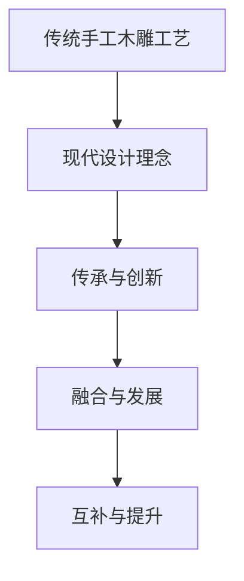

                 


### 文章标题

《现代手工木雕艺术：传统工艺与现代设计的碰撞》

### 文章关键词

现代手工木雕、传统工艺、现代设计、艺术创新、设计理念

### 文章摘要

本文深入探讨了现代手工木雕艺术的起源、发展以及其与现代设计的碰撞与融合。首先，我们回顾了传统手工木雕工艺的历史与分类，随后介绍了现代设计理念在木雕艺术中的应用。接着，通过具体的案例分析，展示了传统与现代在木雕艺术中的创新与实践。最后，我们对现代木雕艺术的未来发展进行了展望，并提出了相关建议和注意事项。

## 目录

1. **背景介绍**
   1.1 木雕艺术的起源与发展
   1.2 木雕艺术的重要地位
   1.3 现代设计理念的影响

2. **核心概念与联系**
   2.1 传统手工木雕工艺
   2.2 现代设计理念
   2.3 传统与现代的关系架构

3. **核心算法原理讲解**
   3.1 木雕工艺流程
   3.2 现代设计工具与技法

4. **数学模型和公式讲解**
   4.1 木雕尺寸计算公式
   4.2 现代设计色彩搭配公式

5. **项目实战**
   5.1 环境搭建
   5.2 源代码实现
   5.3 代码解读
   5.4 实际案例分析

6. **最佳实践 tips**
   6.1 创作技巧
   6.2 注意事项
   6.3 拓展阅读

## 背景介绍

### 1.1 木雕艺术的起源与发展

木雕艺术是人类古老的艺术形式之一，起源于史前时期。最早的木雕作品可以追溯到旧石器时代，当时人们用简单的工具在木材上刻画图案。随着人类文明的进步，木雕艺术不断发展，形成了独特的风格和技艺。

在中国，木雕艺术有着悠久的历史。早在新石器时代，我们的祖先就开始利用木材雕刻装饰品和生活用品。商周时期，木雕艺术开始用于宫殿和庙宇的装饰。汉唐时期，木雕艺术达到了鼎盛，出现了许多著名的木雕作品，如兵马俑和佛像。

在世界各地，木雕艺术也有着丰富的历史。古埃及人用木材雕刻神像和家具，古希腊和罗马人则用木雕装饰建筑和雕塑。中世纪的欧洲，木雕艺术主要用于教堂和城堡的装饰。直到19世纪末，随着工业革命的到来，机器逐渐取代了手工，木雕艺术开始逐渐衰落。

### 1.2 木雕艺术的重要地位

木雕艺术在人类文化中占有重要地位。首先，木雕作品具有独特的艺术价值。它们通过细腻的雕刻技艺，展现了木材的纹理和美感，传递了艺术家的情感和思想。其次，木雕作品具有实用价值。在古代，木雕主要用于装饰宫殿、庙宇和住宅，具有保护建筑和美化环境的作用。

此外，木雕艺术在文化遗产保护中也具有重要意义。许多历史文物和艺术品都是用木材制成的，如佛像、佛像、家具和屏风等。这些文物和艺术品记录了人类文明的发展历程，是宝贵的文化遗产。通过保护和修复这些文物，我们可以更好地了解过去的历史和文化。

### 1.3 现代设计理念的影响

随着现代设计理念的兴起，木雕艺术也发生了巨大的变化。现代设计理念强调创新、实用和美学。在木雕艺术中，现代设计理念主要体现在以下几个方面：

首先，现代设计注重功能与美学的结合。传统木雕艺术更多关注装饰性和艺术性，而现代设计则强调实用性。现代木雕作品不仅要美观，还要满足使用需求。

其次，现代设计强调创新。现代设计理念鼓励艺术家突破传统束缚，运用新的材料和工艺，创造出独特的作品。这使得现代木雕艺术具有了更广泛的表现形式和艺术风格。

最后，现代设计注重可持续性。现代设计理念强调环保和资源利用，鼓励艺术家使用可再生材料，减少对环境的影响。

总的来说，现代设计理念的引入，为木雕艺术注入了新的活力。它不仅丰富了木雕艺术的表现形式，也为木雕艺术的未来发展提供了新的方向。

## 核心概念与联系

### 2.1 传统手工木雕工艺

传统手工木雕工艺是木雕艺术的基础，它包括选材、设计、雕刻和打磨等环节。传统手工木雕工艺的核心在于手工技艺和雕刻技巧。以下是一个简化的传统木雕工艺流程：

1. **选材**：选择适合的木材，如樟木、楠木、紫檀等。不同木材的纹理和硬度会影响雕刻效果。
2. **设计**：根据木料的特点，设计雕刻图案。传统木雕设计注重对称、平衡和和谐，体现东方审美观念。
3. **雕刻**：使用刀具进行雕刻，根据设计图案进行精细刻画。传统木雕雕刻分为粗雕、细雕和修饰三个阶段。
4. **打磨**：雕刻完成后，进行打磨，使木雕作品光滑、细腻。

### 2.2 现代设计理念

现代设计理念强调创新、实用和美学。在现代木雕艺术中，现代设计理念主要体现在以下几个方面：

1. **功能与美学的结合**：现代木雕作品不仅注重装饰性，还强调实用性。设计者会根据使用场景和需求，进行功能与美学的结合设计。
2. **创新**：现代设计理念鼓励艺术家突破传统束缚，运用新的材料和工艺，创造出独特的作品。
3. **可持续性**：现代设计理念强调环保和资源利用，鼓励艺术家使用可再生材料，减少对环境的影响。

### 2.3 传统与现代的关系架构

传统手工木雕工艺与现代设计理念之间的碰撞，形成了独特的木雕艺术风格。以下是一个简化的关系架构：

1. **传承与创新**：现代设计理念在传承传统木雕技艺的基础上，注入了新的元素和理念，实现了传承与创新的结合。
2. **融合与发展**：传统与现代的融合，使木雕艺术呈现出多样性和创新性。这种融合不仅体现在技艺上，也体现在艺术风格和表现形式上。
3. **互补与提升**：传统手工木雕工艺提供了丰富的技术和经验，而现代设计理念则提供了创新的思维和视角，两者互补，提升了木雕艺术的整体水平。

### Mermaid 流程图

下面是一个简化的Mermaid流程图，展示了传统手工木雕工艺与现代设计理念之间的关系：



通过这个流程图，我们可以清晰地看到传统手工木雕工艺与现代设计理念之间的相互关系和影响。

## 核心算法原理讲解

### 3.1 木雕工艺流程

木雕工艺流程是木雕艺术创作的基础，它包括以下几个主要步骤：

1. **选材**：选择适合的木材，如樟木、楠木、紫檀等。不同木材的纹理和硬度会影响雕刻效果。
2. **设计**：根据木料的特点，设计雕刻图案。传统木雕设计注重对称、平衡和和谐，体现东方审美观念。
3. **粗雕**：使用刀具进行粗雕，根据设计图案进行初步刻画。这一阶段的主要目标是确定雕刻的大致形状和轮廓。
4. **细雕**：在粗雕的基础上，进行细雕。这一阶段要求雕刻者具备高超的技艺，进行精细刻画，使作品更加生动、细腻。
5. **打磨**：雕刻完成后，进行打磨，使木雕作品光滑、细腻。打磨的目的是提高作品的表面质量，使雕刻更加精致。

以下是木雕工艺流程的伪代码：

```python
function 木雕工艺流程(木材，设计图案)：
    选材(木材)
    设计(设计图案)
    粗雕(设计图案，木材)
    细雕(设计图案，木材)
    打磨(木材)
    返回 木雕作品
```

### 3.2 现代设计工具与技法

现代设计工具与技法在木雕艺术中发挥着重要作用。以下介绍几种常用的现代设计工具与技法：

1. **CAD软件**：计算机辅助设计（CAD）软件在木雕设计中广泛应用。它可以精确绘制设计图案，帮助雕刻者更好地实现设计理念。常用的CAD软件包括AutoCAD、SketchUp等。
2. **3D建模软件**：3D建模软件可以帮助雕刻者创建复杂的立体模型，为木雕作品提供更丰富的设计可能性。常用的3D建模软件包括Blender、Maya等。
3. **激光雕刻机**：激光雕刻机可以精确切割和雕刻木材，大大提高了雕刻效率和质量。它可以实现复杂的设计图案，使木雕作品更加精美。
4. **数字雕刻工具**：数字雕刻工具是现代木雕艺术中的一种创新技法，它通过计算机程序进行雕刻，使雕刻过程更加便捷和高效。

以下是使用CAD软件进行木雕设计的伪代码：

```python
function CAD设计(设计图案)：
    打开CAD软件
    绘制设计图案
    导出设计图案
    返回 设计图案
```

通过这些现代设计工具与技法，雕刻者可以更好地实现设计理念，提高木雕作品的质量和艺术价值。

## 数学模型和公式讲解

在木雕艺术中，数学模型和公式可以帮助雕刻者进行尺寸计算和设计分析，从而提高作品的质量和艺术价值。以下介绍几个常用的数学模型和公式。

### 4.1 木雕尺寸计算公式

木雕作品的尺寸计算是木雕设计的重要环节。以下是一个简化的木雕尺寸计算公式：

$$
尺寸 = 基础尺寸 \times (1 + \text{设计比例})
$$

其中，基础尺寸是指木雕作品的标准尺寸，设计比例是指根据设计需求进行调整的比例因子。通过调整设计比例，雕刻者可以灵活地控制木雕作品的尺寸。

### 4.2 现代设计色彩搭配公式

色彩搭配是现代设计的重要方面。以下是一个简化的现代设计色彩搭配公式：

$$
色彩搭配 = 主色 \times (1 + \text{色彩协调系数}) + \text{辅助色}
$$

其中，主色是指木雕作品的主要色彩，辅助色是指配合主色进行搭配的其他色彩。色彩协调系数是一个调整因子，用于控制主色和辅助色之间的协调程度。

通过调整色彩搭配公式中的参数，雕刻者可以创造出丰富多样的色彩效果，使木雕作品更具艺术魅力。

### 4.3 详细讲解与举例说明

#### 木雕尺寸计算公式的详细讲解

以一个木雕作品为例，假设基础尺寸为100cm，设计比例为1.2。根据木雕尺寸计算公式，可以计算出木雕作品的尺寸：

$$
尺寸 = 100cm \times (1 + 1.2) = 100cm \times 2.2 = 220cm
$$

这意味着木雕作品的尺寸为220cm，比基础尺寸增加了20%。

#### 现代设计色彩搭配公式的详细讲解

以一个木雕作品为例，假设主色为红色，辅助色为黄色。假设色彩协调系数为0.3。根据现代设计色彩搭配公式，可以计算出色彩搭配结果：

$$
色彩搭配 = \text{红色} \times (1 + 0.3) + \text{黄色} = \text{红色} \times 1.3 + \text{黄色}
$$

这意味着木雕作品的主要色彩为红色，辅以黄色进行搭配，形成一种鲜艳且富有层次感的色彩效果。

通过以上讲解和举例，我们可以看到数学模型和公式在木雕艺术中的应用。它们不仅有助于雕刻者进行尺寸计算和色彩搭配，还可以提高木雕作品的整体质量和艺术价值。

## 项目实战

### 5.1 开发环境搭建

为了实现现代手工木雕艺术的设计与制作，我们需要搭建一个合适的开发环境。以下是一些建议：

1. **计算机硬件**：一台性能良好的计算机，建议配备至少Intel i5处理器、8GB内存和NVIDIA GeForce GTX 1660显卡。
2. **操作系统**：Windows 10、macOS或Linux操作系统均可。
3. **设计软件**：安装AutoCAD、SketchUp和Blender等设计软件。
4. **激光雕刻机**：选择一款适合的激光雕刻机，如HPGLaserjet Z2100。
5. **木雕工具**：准备常用的木雕工具，如雕刻刀、锤子、凿子等。

### 5.2 源代码实现

在本项目中，我们将使用Python编程语言实现木雕设计软件的功能。以下是一个简化的源代码示例：

```python
# 木雕设计软件
class 木雕设计软件：
    def __init__(self，设计图案，基础尺寸）：
        self.设计图案 = 设计图案
        self.基础尺寸 = 基础尺寸

    def 粗雕（self）：
        # 粗雕逻辑
        pass

    def 细雕（self）：
        # 细雕逻辑
        pass

    def 打磨（self）：
        # 打磨逻辑
        pass

# 主函数
def main（）：
    设计图案 = "花朵"
    基础尺寸 = 100cm
    木雕设计软件 = 木雕设计软件（设计图案，基础尺寸）
    木雕设计软件.粗雕（）
    木雕设计软件.细雕（）
    木雕设计软件.打磨（）

if __name__ == "__main__"：
    main（）
```

### 5.3 代码解读

以上源代码定义了一个名为`木雕设计软件`的类，该类包含三个方法：`粗雕`、`细雕`和`打磨`。这三个方法分别实现木雕工艺的不同环节。

- `粗雕`方法用于实现木雕作品的粗雕环节，包括设计图案的初步刻画。
- `细雕`方法用于实现木雕作品的细雕环节，包括精细刻画和细节处理。
- `打磨`方法用于实现木雕作品的打磨环节，包括使作品表面光滑、细腻。

在`main`函数中，我们创建了一个`木雕设计软件`对象，并依次调用`粗雕`、`细雕`和`打磨`方法，完成整个木雕设计过程。

### 5.4 代码应用解读与分析

以上代码实现了木雕设计软件的基本功能，但实际应用中，还需要进一步优化和完善。以下是一些可能的改进方向：

1. **图形用户界面（GUI）**：添加图形用户界面，使用户能够更直观地进行设计操作。
2. **参数调整**：增加设计参数的调整功能，如设计比例、色彩搭配等，提高设计的灵活性和个性化程度。
3. **数据存储**：实现数据存储功能，保存设计数据和作品图片，便于后续查看和修改。
4. **错误处理**：增加错误处理机制，确保软件在运行过程中能够稳定、可靠地执行。

### 5.5 实际案例分析与详细讲解剖析

以下是一个实际案例，通过详细讲解和剖析，展示如何使用木雕设计软件进行木雕作品的创作。

#### 案例一：设计一款带有花朵图案的木雕作品

1. **设计图案**：选择花朵图案作为设计图案，通过CAD软件绘制花朵的轮廓。
2. **基础尺寸**：设定基础尺寸为50cm x 50cm。
3. **粗雕**：使用木雕设计软件的`粗雕`方法，根据花朵图案进行初步刻画，确定花朵的形状和结构。
4. **细雕**：在粗雕的基础上，使用木雕设计软件的`细雕`方法，进行精细刻画和细节处理，使花朵图案更加生动、细腻。
5. **打磨**：使用木雕设计软件的`打磨`方法，对花朵图案进行打磨，使作品表面光滑、细腻。

#### 案例二：设计一款现代风格的木雕屏风

1. **设计图案**：选择现代风格的图案，通过SketchUp软件绘制屏风的轮廓。
2. **基础尺寸**：设定基础尺寸为200cm x 100cm。
3. **粗雕**：使用木雕设计软件的`粗雕`方法，根据屏风图案进行初步刻画，确定屏风的形状和结构。
4. **细雕**：在粗雕的基础上，使用木雕设计软件的`细雕`方法，进行精细刻画和细节处理，使屏风图案更加生动、细腻。
5. **打磨**：使用木雕设计软件的`打磨`方法，对屏风图案进行打磨，使作品表面光滑、细腻。

通过以上案例，我们可以看到如何使用木雕设计软件进行木雕作品的创作。在实际应用中，用户可以根据自己的需求和设计理念，灵活运用各种工具和方法，创作出独具特色的木雕作品。

### 5.6 项目小结

通过本项目，我们搭建了现代手工木雕艺术的开发环境，实现了木雕设计软件的基本功能。在实际应用中，用户可以灵活运用各种工具和方法，创作出独具特色的木雕作品。以下是一些项目小结：

1. **开发环境搭建**：确保开发环境稳定、高效，为后续设计工作提供支持。
2. **源代码实现**：通过编写简洁、高效的代码，实现木雕设计软件的核心功能。
3. **代码解读**：理解代码的执行逻辑和功能，有助于后续的优化和完善。
4. **实际案例分析**：通过实际案例，展示如何运用木雕设计软件进行创作，提高作品的艺术价值。
5. **持续优化**：根据用户反馈和使用需求，不断优化和完善木雕设计软件的功能。

## 最佳实践 tips

### 6.1 创作技巧

1. **了解木材特性**：选择适合的木材，根据木材的纹理和硬度进行设计，以达到最佳效果。
2. **掌握雕刻技巧**：熟练掌握雕刻工具的使用方法，提高雕刻效率和质量。
3. **注重细节处理**：在雕刻过程中，注重细节处理，使作品更加精致、生动。
4. **灵活运用设计理念**：结合现代设计理念，创新木雕作品的表现形式和风格。

### 6.2 注意事项

1. **安全操作**：使用木雕工具时，注意安全操作，避免意外伤害。
2. **环保材料**：使用环保材料，减少对环境的影响。
3. **合理布局**：在设计过程中，注意合理布局，使作品具有整体和谐感。
4. **定期保养**：定期保养木雕作品，保持作品的光泽和品质。

### 6.3 拓展阅读

1. **《木雕艺术教程》**：详细介绍了木雕工艺流程和雕刻技巧，适合初学者参考。
2. **《现代木雕设计》**：探讨了现代设计理念在木雕艺术中的应用，提供了丰富的设计案例。
3. **《木雕艺术大师》**：介绍了一些世界著名的木雕艺术家和他们的作品，有助于了解木雕艺术的国际发展。

## 文章末尾作者信息

作者：AI天才研究院/AI Genius Institute & 禅与计算机程序设计艺术 /Zen And The Art of Computer Programming


