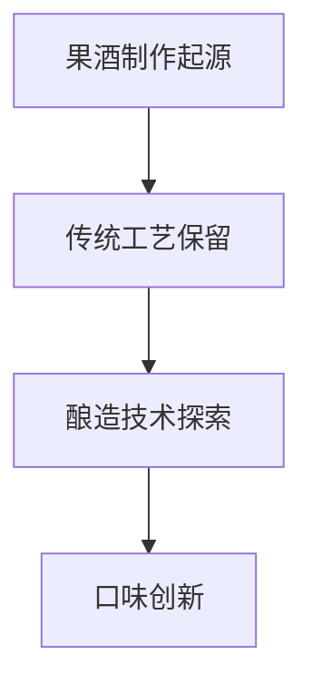
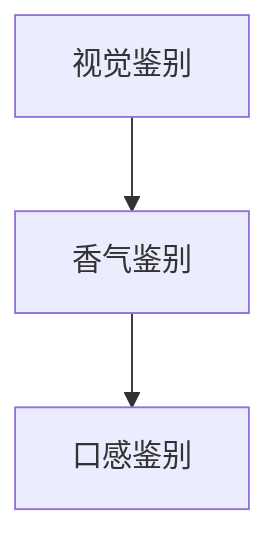
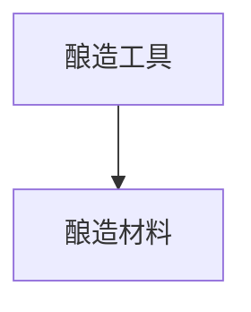
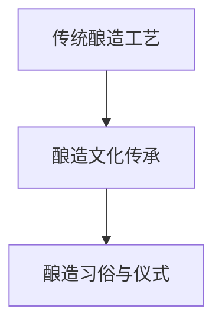
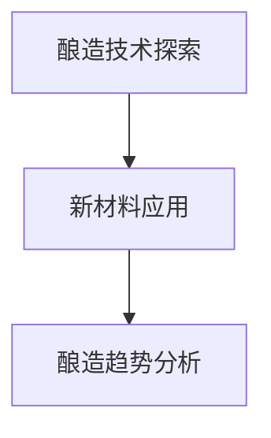
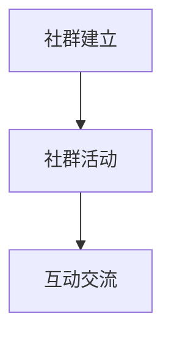
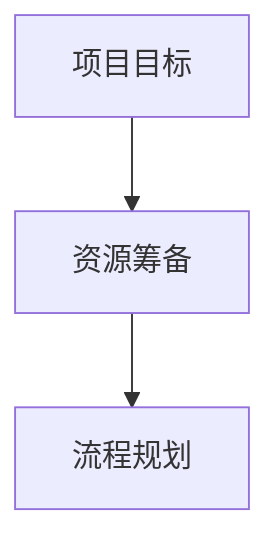
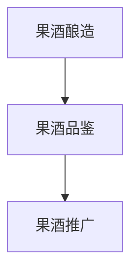
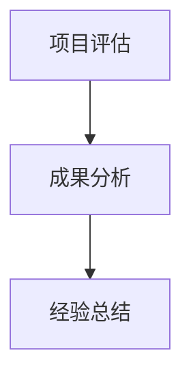

                 

### 《现代手工果酒品鉴俱乐部：小众酿造爱好者的社交圈》

关键词：手工果酒、品鉴、社交圈、酿造文化、互动交流

摘要：本文旨在探讨现代手工果酒品鉴俱乐部这一小众酿造爱好者的社交圈，从果酒制作入门、品鉴技巧、酿造工具与材料、小众酿造文化、社交圈互动、项目实战等多个角度，深入剖析手工果酒制作与品鉴的各个方面，为广大酿造爱好者提供一份详尽的技术指南和经验分享。

## 第一部分：果酒制作基础

### 第1章：果酒制作入门

#### 1.1 果酒制作的起源与发展

**背景介绍**：果酒作为一种古老的饮品，起源于人类文明的初期。随着时代的变迁，果酒的制作工艺和品种逐渐丰富。现代手工果酒制作，不仅保留了传统工艺的精髓，还在酿造技术和口味创新上不断探索。

**核心概念与联系**：

**酿造原理**：

- **化学原理**：果酒的制作过程主要涉及糖的发酵，酵母将糖转化为酒精和二氧化碳。
- **生物原理**：酵母菌在无氧环境中进行酒精发酵，产生酒精和二氧化碳。

**基本流程**：

1. **选择果实与清洗**：选择新鲜、成熟的果实，进行彻底清洗，去除杂质和农药残留。
2. **压榨与发酵**：将清洗后的果实压榨出果汁，加入糖源和酵母，启动发酵过程。
3. **熟成与过滤**：将发酵后的酒液进行熟成，去除杂质，提高口感。
4. **瓶装与储存**：将熟成的酒液进行瓶装，储存在阴凉干燥的环境中，等待进一步成熟。

#### 1.2 果酒品鉴技巧

**核心概念与联系**：

**基本标准**：

1. **酒体与口感**：酒体的厚度和口感是品鉴的重要指标。
2. **香气与余味**：香气是否丰富，余味是否持久，是判断果酒品质的关键。
3. **酒精度与甜度**：酒精度和甜度会影响果酒的口感和风味。

**实践技巧**：

1. **品鉴器具的使用**：使用专业的品鉴杯，有助于提高品鉴的准确性。
2. **品鉴环境的设置**：选择安静、光线适宜的环境，有助于充分感受果酒的香气和口感。
3. **品鉴顺序的安排**：按照酒体的厚重程度，从轻到重进行品鉴，避免酒体之间的干扰。

#### 1.3 果酒酿造工具与材料

**核心概念与联系**：

**酿造工具**：

1. **发酵桶**：用于发酵过程的容器，应保持清洁，避免污染。
2. **压榨机**：用于压榨果实，提取果汁。
3. **温度计**：用于监测发酵过程中的温度，确保发酵过程顺利进行。
4. **过滤器**：用于过滤酒液，去除杂质，提高酒的品质。

**酿造材料**：

1. **果实的选择**：选择新鲜、成熟的果实，是酿造优质果酒的基础。
2. **糖源的选择**：常用的糖源有蔗糖、葡萄糖等，应根据果酒的风味要求进行选择。
3. **酵母的选择**：选择适合果酒酿造的酵母，有助于提高酒的品质。
4. **护苗剂的选择**：护苗剂可以保护酵母，防止污染，提高酿造成功率。

## 第二部分：果酒酿造实践

### 第4章：小众酿造文化

#### 4.1 果酒酿造的传统与文化

**核心概念与联系**：

**传统酿造工艺**：

- **天然酵母发酵**：利用自然环境中的酵母进行发酵，制作出风味独特的果酒。
- **木桶熟成**：将酒液储存在木桶中，通过木桶的“呼吸”作用，使酒液更加醇厚。

**酿造文化传承**：

- **酿造技艺的传承**：通过师徒制度，将酿造技艺代代相传。
- **酿造习俗与仪式**：如酒神节、丰收祭等，反映了人们对果酒的敬畏和喜爱。

#### 4.2 果酒酿造的创新与发展

**核心概念与联系**：

**酿造技术探索**：

- **生物技术**：利用生物技术改良酵母，提高酿造效率。
- **化学技术**：利用化学技术调整酒液的成分，创造新的风味。

**新材料应用**：

- **新型容器**：如不锈钢桶、玻璃桶等，为酿造提供了更多的选择。
- **新型酵母**：如啤酒酵母、葡萄酒酵母等，为酿造出不同风味的果酒提供了可能。

**酿造趋势分析**：

- **个性定制**：消费者对个性化和定制化果酒的需求逐渐增加。
- **健康理念**：注重果酒的营养价值和健康功能，成为新的趋势。

### 第5章：果酒社交圈互动

#### 5.1 果酒酿造爱好者的社群

**核心概念与联系**：

**社群建立**：

- **线上社群**：利用社交媒体平台，建立果酒酿造爱好者的交流社区。
- **线下活动**：组织线下活动，如酿造分享会、品鉴活动等，促进爱好者之间的互动。

**社群活动**：

- **酿造分享会**：分享酿造经验和技巧，互相学习。
- **品鉴活动**：组织品鉴活动，共同品尝和讨论不同风味的果酒。

**互动交流**：

- **线上讨论**：通过论坛、微信群等平台，进行实时交流和讨论。
- **线下聚会**：定期举办线下聚会，加强爱好者之间的联系。

### 第6章：果酒制作项目实战

#### 6.1 果酒酿造项目策划

**核心概念与联系**：

**项目目标**：

- **提高酿造技能**：通过项目实践，提高果酒酿造技能。
- **推广果酒文化**：通过项目，传播果酒酿造和品鉴的知识和技巧。

**资源筹备**：

- **人力资源**：组织酿造爱好者，形成项目团队。
- **物资资源**：准备酿造所需的工具和材料。

**流程规划**：

- **前期筹备**：包括酿造工具的准备、酿造材料的采购等。
- **酿造过程**：按照酿造流程，进行酿造实践。
- **品鉴与调整**：进行果酒的品鉴，根据反馈进行调整。

#### 6.2 果酒酿造项目执行

**核心概念与联系**：

**果酒酿造**：

- **原料准备**：选择新鲜、成熟的果实，进行清洗和压榨。
- **发酵过程**：将压榨出的果汁加入糖源和酵母，启动发酵过程。
- **熟成与过滤**：将发酵后的酒液进行熟成，过滤杂质。

**果酒品鉴**：

- **感官鉴别**：通过视觉、嗅觉、味觉进行果酒的品鉴。
- **标准评判**：根据酒体、香气、口感等标准，对果酒进行评判。

**果酒推广**：

- **线上推广**：通过社交媒体、电商平台等渠道，进行果酒的推广。
- **线下推广**：通过实体店、品鉴活动等渠道，进行果酒的推广。

#### 6.3 果酒酿造项目评估

**核心概念与联系**：

**成果分析**：

- **酿造成果**：对酿造的果酒进行评估，分析酿造成果。
- **市场反馈**：收集消费者的反馈，了解市场对果酒的接受程度。

**经验总结**：

- **酿造技巧**：总结酿造过程中遇到的问题和解决方法。
- **市场策略**：总结推广过程中成功的经验和不足之处。

### 结语

手工果酒品鉴俱乐部不仅是一个小众酿造爱好者的社交圈，更是一个分享知识、交流经验、共同成长的平台。通过本文的探讨，希望能够为广大酿造爱好者提供一份实用的指南，帮助他们在果酒的世界里畅游。让我们共同探索，享受手工果酒的独特魅力。

**作者**：AI天才研究院/AI Genius Institute & 禅与计算机程序设计艺术 /Zen And The Art of Computer Programming### 第1章：果酒制作入门

#### 1.1 果酒制作的起源与发展

果酒作为一种古老的饮品，其历史可以追溯到几千年前的人类文明初期。在那时，人们偶然发现果实中的糖分在自然环境中可以发酵产生酒精，从而创造了最初的果酒。随着时间的推移，果酒的制作工艺逐渐成熟，种类也日益丰富。

**核心概念与联系**：

- **果酒制作起源**：果酒最早的制作起源于人类对自然现象的观察和利用。
- **传统工艺保留**：现代手工果酒制作强调保留传统酿造工艺的精髓，注重手工制作和自然发酵。
- **酿造技术探索**：现代果酒制作在传统工艺的基础上，不断探索新的酿造技术和方法，以提高果酒的品质和风味。
- **口味创新**：为了满足消费者的多样化需求，果酒制作也在不断尝试新的口味组合和创新。

**酿造原理**：

果酒的制作过程主要涉及糖的发酵，酵母将糖转化为酒精和二氧化碳。具体来说，酿造原理可以分为以下几个步骤：

1. **糖分提取**：选择新鲜、成熟的果实，通过压榨或其他方法提取果汁，其中含有丰富的糖分。
2. **酵母接种**：将提取出的果汁与酵母混合，酵母开始发酵过程。
3. **发酵过程**：在无氧环境中，酵母将果汁中的糖分转化为酒精和二氧化碳，这个过程称为酒精发酵。
4. **熟成**：发酵后的酒液在一段时间内继续储存，使其成熟，提高口感。
5. **过滤**：将熟成的酒液进行过滤，去除残留的固体杂质。

**基本流程**：

1. **选择果实与清洗**：选择新鲜、成熟的果实，进行彻底清洗，去除杂质和农药残留。
   - **示例**：使用清水和少量食用碱水，浸泡果实5分钟，然后彻底冲洗干净。

2. **压榨与发酵**：将清洗后的果实压榨出果汁，加入糖源和酵母，启动发酵过程。
   - **示例**：将果实压榨成汁后，加入适量的蔗糖和葡萄酒酵母，搅拌均匀后放入发酵桶中。

3. **熟成与过滤**：将发酵后的酒液进行熟成，去除杂质，提高口感。
   - **示例**：将酒液在室温下熟成2-3周，然后进行过滤，去除残留的酵母和杂质。

4. **瓶装与储存**：将熟成的酒液进行瓶装，储存在阴凉干燥的环境中，等待进一步成熟。
   - **示例**：使用无菌瓶装，将酒液装满，封口，放入冰箱储存。

**酿造工具与材料**：

- **酿造工具**：
  - 发酵桶：用于发酵过程的容器，应保持清洁，避免污染。
  - 压榨机：用于压榨果实，提取果汁。
  - 温度计：用于监测发酵过程中的温度，确保发酵过程顺利进行。
  - 过滤器：用于过滤酒液，去除杂质，提高酒的品质。

- **酿造材料**：
  - 果实：选择新鲜、成熟的果实，是酿造优质果酒的基础。
  - 糖源：常用的糖源有蔗糖、葡萄糖等，应根据果酒的风味要求进行选择。
  - 酵母：选择适合果酒酿造的酵母，有助于提高酒的品质。
  - 护苗剂：护苗剂可以保护酵母，防止污染，提高酿造成功率。

#### 1.2 果酒品鉴技巧

果酒品鉴是一项细致入微的技能，需要通过视觉、嗅觉和味觉等多个方面来进行综合评判。以下是一些基础的品鉴技巧：

**核心概念与联系**：

- **视觉鉴别**：通过观察酒液的颜色、清澈度和粘度，可以初步判断果酒的年龄和品质。
  - **示例**：深色的酒液可能表示果酒的年龄较长，而清澈透明的酒液则表示新鲜。
- **香气鉴别**：通过嗅闻酒液，可以感受到果酒的香气强度和复杂性。
  - **示例**：新鲜的果酒可能散发出水果的清香，而陈年的果酒则可能带有更深层次的香草或橡木味。
- **口感鉴别**：通过品尝酒液，可以感受到果酒的甜度、酸度、酒精含量和余味。
  - **示例**：口感平衡的果酒甜度适中，酸度适宜，酒精感不过分强烈，余味持久。

**基本标准**：

- **酒体与口感**：酒体的厚度和口感是品鉴的重要指标。酒体厚实的果酒通常口感浓郁。
- **香气与余味**：香气是否丰富，余味是否持久，是判断果酒品质的关键。
- **酒精度与甜度**：酒精度和甜度会影响果酒的口感和风味。

**实践技巧**：

- **品鉴器具的使用**：使用专业的品鉴杯，有助于提高品鉴的准确性。
  - **示例**：品鉴杯通常有较宽的杯口，有利于香气的散发和品鉴。
- **品鉴环境的设置**：选择安静、光线适宜的环境，有助于充分感受果酒的香气和口感。
  - **示例**：在柔和的灯光下，避免强光和噪音，可以更好地进行品鉴。
- **品鉴顺序的安排**：按照酒体的厚重程度，从轻到重进行品鉴，避免酒体之间的干扰。
  - **示例**：先品鉴轻盈的果酒，再逐步过渡到浓郁型果酒，以保持味觉的敏感度。

#### 1.3 果酒酿造工具与材料

在果酒酿造过程中，选择合适的工具和材料是确保酿造成功的重要因素。以下是一些常用的工具和材料：

**核心概念与联系**：

- **酿造工具**：
  - **发酵桶**：用于发酵过程的容器，应保持清洁，避免污染。常见的有玻璃桶、塑料桶和不锈钢桶。
    - **示例**：选择容量适中、易于清洗和消毒的发酵桶。
  - **压榨机**：用于压榨果实，提取果汁。常见的有手动压榨机和电动压榨机。
    - **示例**：选择适合处理所需果实数量的压榨机，确保压榨效率。
  - **温度计**：用于监测发酵过程中的温度，确保发酵过程顺利进行。
    - **示例**：选择准确、耐用的温度计，定期校准以保持测量精度。
  - **过滤器**：用于过滤酒液，去除杂质，提高酒的品质。常见的有滤网、滤纸和纤维过滤器。
    - **示例**：根据过滤需求选择合适的过滤器类型，确保过滤效果。

- **酿造材料**：
  - **果实**：选择新鲜、成熟的果实，是酿造优质果酒的基础。常见的有葡萄、苹果、桃子、梨等。
    - **示例**：选择无农药、无病害、成熟度适中的果实，以确保果汁的品质。
  - **糖源**：常用的糖源有蔗糖、葡萄糖、蜂蜜等。应根据果酒的风味要求进行选择。
    - **示例**：蔗糖适用于大多数果酒，而蜂蜜则能增添独特的甜度和香气。
  - **酵母**：选择适合果酒酿造的酵母，有助于提高酒的品质。常见有葡萄酒酵母、啤酒酵母等。
    - **示例**：葡萄酒酵母适用于大多数果酒酿造，而啤酒酵母则适用于特定类型的果酒。
  - **护苗剂**：护苗剂可以保护酵母，防止污染，提高酿造成功率。常见的有二氧化硫、维生素等。
    - **示例**：适量添加护苗剂，可以有效防止酿造过程中的污染，提高酿造的成功率。

通过了解和选择合适的酿造工具和材料，可以显著提高果酒酿造的成功率和品质。接下来，我们将进一步探讨小众酿造文化，了解这一领域的独特魅力和挑战。

### 第2章：果酒品鉴技巧

果酒品鉴是酿造爱好者们享受果酒独特风味的重要环节。通过视觉、嗅觉和味觉等多个方面的细致品鉴，可以全面了解果酒的品质和特点。以下将详细探讨果酒品鉴的技巧。

#### 2.1 果酒的感官鉴别

果酒的感官鉴别主要包括视觉鉴别、嗅觉鉴别和味觉鉴别。每个感官都有其特定的鉴别方法和重要性。

**视觉鉴别**：

视觉鉴别主要通过观察果酒的外观特征来判断其品质。具体包括：

- **颜色**：颜色是果酒外观最直观的特征。不同品种的果酒颜色各异，如苹果酒通常呈黄色，而葡萄酒则从浅红到深紫红不等。颜色深浅可以反映果酒的成熟度和年份。
  - **示例**：深红色的葡萄酒可能意味着它经过了较长时间的熟成，而浅黄色的苹果酒则可能表示较年轻的酒龄。

- **清澈度**：清澈度是判断果酒纯净程度的重要指标。优质的果酒应该清澈透明，无明显沉淀物。
  - **示例**：如果果酒中有明显的悬浮物或浑浊现象，可能是因为发酵不完全或污染。

- **粘度**：粘度可以反映果酒的酒精度和糖分含量。高酒精度和高糖分的果酒通常较为粘稠。
  - **示例**：在相同温度下，较高的酒精度和糖分会使果酒显得更粘稠。

**嗅觉鉴别**：

嗅觉鉴别主要通过嗅闻果酒来感受其香气和味道。具体包括：

- **香气强度**：香气强度可以反映果酒的香气的浓郁程度。强香气的果酒通常意味着较高的酒精度和糖分。
  - **示例**：浓郁的花香或水果香通常表示果酒的香气较为浓郁。

- **香气复杂度**：香气复杂度是指果酒香气的多样性。优质的果酒应该有丰富的香气层次。
  - **示例**：苹果酒的香气可能包含苹果的清新、香草的温暖和橡木的醇厚。

- **香气持久度**：香气持久度是指果酒香气在嗅闻后的持续时长。持久度较高的果酒通常意味着其香气更加丰富和持久。
  - **示例**：果酒在嗅闻后，香气在鼻腔中持续较长时间，表示其香气持久度较高。

**味觉鉴别**：

味觉鉴别主要通过品尝果酒来感受其口感和味道。具体包括：

- **甜度**：甜度是果酒的重要口感特征之一。甜度的高低会影响果酒的总体风味。
  - **示例**：过甜的果酒可能显得腻人，而适中的甜度则能更好地平衡其他口感。

- **酸度**：酸度是果酒的风味关键，它能够提升果酒的清爽感和层次感。
  - **示例**：适量的酸度可以使果酒显得更加生动和有活力。

- **酒精感**：酒精感是指果酒中的酒精味道。酒精感过强可能使果酒显得单调和过于浓烈。
  - **示例**：适宜的酒精感可以使果酒显得更加醇厚和优雅。

- **余味**：余味是指品尝果酒后，口中留下的味道感受。余味的持久度和多样性可以反映果酒的品质。
  - **示例**：果酒在口中留下的味道持续较长时间，且味道丰富，表示其余味较好。

**综合判断**：

通过视觉、嗅觉和味觉的综合判断，可以全面了解果酒的品质和特点。具体步骤如下：

1. **观察颜色和清澈度**：初步判断果酒的新鲜度和纯净度。
2. **嗅闻香气**：感受果酒的香气强度、复杂度和持久度。
3. **品尝口感**：判断果酒的甜度、酸度、酒精感和余味。
4. **综合评价**：根据以上感官体验，综合评价果酒的整体品质。

#### 2.2 果酒品鉴的基本标准

在果酒品鉴中，以下标准是常用的评价指标：

- **酒体与口感**：酒体的厚度和口感是果酒品鉴的重要标准。酒体厚实的果酒通常口感浓郁，层次丰富。
- **香气与余味**：香气是否丰富、持久，余味是否深远，是判断果酒品质的关键。
- **酒精度与甜度**：酒精度和甜度会影响果酒的口感和风味。适中的酒精度和甜度可以使果酒更加平衡。
- **澄清度与稳定性**：澄清度是判断果酒纯净程度的标准。稳定性则是指果酒在存放过程中的稳定性，不易变质。

#### 2.3 果酒品鉴的实践技巧

进行果酒品鉴时，以下实践技巧可以帮助提高品鉴效果：

- **品鉴器具的使用**：使用专业的品鉴杯，有助于提高品鉴的准确性。品鉴杯通常具有较宽的杯口，有利于香气的散发和品鉴。
- **品鉴环境的设置**：选择安静、光线适宜的环境，有助于充分感受果酒的香气和口感。避免强光和噪音，以保持感官的敏感性。
- **品鉴顺序的安排**：按照酒体的厚重程度，从轻到重进行品鉴，避免酒体之间的干扰。例如，先品鉴轻盈的果酒，再逐步过渡到浓郁型果酒。
- **记录与交流**：在品鉴过程中，记录下对果酒的感受和评价，便于后续的回顾和交流。通过与其他酿造爱好者的交流，可以互相学习，提高品鉴水平。

通过以上技巧，可以更全面、准确地品鉴果酒，享受这一独特的酿造文化。

### 第3章：果酒酿造工具与材料

在手工果酒酿造过程中，选择合适的工具和材料是确保酿造成功和品质的关键。以下将详细探讨果酒酿造所需的主要工具和材料。

#### 3.1 果酒酿造的工具

**发酵桶**：

发酵桶是果酒酿造过程中的核心工具，用于发酵果汁和酵母。常见的发酵桶材料有玻璃、塑料和不锈钢。

- **玻璃桶**：玻璃桶透明，便于观察发酵过程，但容易破裂，需小心使用。
- **塑料桶**：塑料桶耐腐蚀，轻便易清洗，但部分塑料材料可能会影响酒的味道。
- **不锈钢桶**：不锈钢桶耐用、坚固，不与酒液发生化学反应，是较为理想的选择。

**压榨机**：

压榨机用于将果实压榨出果汁，提取果肉中的糖分和风味。常见的压榨机类型有手动压榨机和电动压榨机。

- **手动压榨机**：适用于少量果实的压榨，操作简便，但效率较低。
- **电动压榨机**：适用于大量果实的压榨，效率高，但价格较高。

**温度计**：

温度计用于监测发酵过程中的温度，确保发酵过程在适宜的温度范围内进行。选择温度计时，应注意其准确性和耐久性。

**过滤器**：

过滤器用于过滤酒液，去除杂质，提高酒的品质。常见的过滤器类型有滤网、滤纸和纤维过滤器。

- **滤网**：适用于粗滤，去除较大的固体杂质。
- **滤纸**：适用于精细过滤，去除微小的悬浮物。
- **纤维过滤器**：适用于深层过滤，可以过滤更细微的杂质。

**其他工具**：

- **搅拌器**：用于搅拌果汁和酵母，确保均匀发酵。
- **瓶子与瓶盖**：用于储存和装瓶果酒，选择透明或半透明的瓶子，便于观察酒液的变化。
- **标签机**：用于贴上果酒标签，记录酿造日期和品种信息。

#### 3.2 果酒酿造的材料

**果实**：

果实是酿造果酒的基础材料，选择新鲜、成熟的果实是确保酒品质的关键。常见的果实有葡萄、苹果、桃子、梨等。

- **葡萄**：葡萄是酿造葡萄酒的主要原料，不同品种的葡萄可酿造出不同风味的葡萄酒。
- **苹果**：苹果是酿造苹果酒的主要原料，具有丰富的果香和口感。
- **桃子**：桃子酿造的桃子酒香气独特，口感甜美。
- **梨**：梨酿造的梨酒清爽宜人，具有柔和的甜度。

**糖源**：

糖源用于提供发酵所需的糖分，常见的糖源有蔗糖、葡萄糖和蜂蜜。

- **蔗糖**：蔗糖是酿造大多数果酒的首选糖源，其发酵速度适中，适用于各种果酒的酿造。
- **葡萄糖**：葡萄糖发酵速度较快，适用于需要快速发酵的果酒。
- **蜂蜜**：蜂蜜具有独特的甜度和香气，可用来酿造具有特殊风味的果酒。

**酵母**：

酵母是果酒发酵的关键，选择适合果酒酿造的酵母可以提高酒的品质。常见的酵母有葡萄酒酵母和啤酒酵母。

- **葡萄酒酵母**：葡萄酒酵母适用于大多数果酒的酿造，发酵温度范围较广，能产生丰富的果香。
- **啤酒酵母**：啤酒酵母发酵速度较快，适用于酿造啤酒风味的果酒。

**护苗剂**：

护苗剂用于保护酵母，防止污染，提高酿造成功率。常见的护苗剂有二氧化硫、维生素等。

- **二氧化硫**：二氧化硫具有防腐作用，可以防止酵母污染和氧化，提高酿造的安全性。
- **维生素**：维生素可以促进酵母的生长和繁殖，提高发酵效率。

通过合理选择和使用酿造工具和材料，可以显著提高果酒酿造的成功率和品质，为酿造爱好者带来更加美味的果酒体验。

### 第4章：小众酿造文化

果酒酿造不仅仅是一种技艺，更是一种独特的文化现象，尤其在现代手工果酒酿造爱好者中，这种文化尤为显著。本节将探讨小众酿造文化的起源、传统与现代酿造技术的结合，以及其背后的社交和文化意义。

#### 4.1 果酒酿造的传统与文化

**传统酿造工艺的传承**

果酒酿造作为一种古老的工艺，其传统酿造方法在不同文化和地区有着各自的特色。许多传统酿造方法通过口口相传和代代相传的方式得以保留和传承。例如，在法国的香槟区，传统酿造工艺至今仍然沿用着数百年前的手工酿造方法，如二次发酵和瓶内陈酿等。

**传统酿造习俗与仪式**

世界各地都有独特的酿造习俗和仪式，这些习俗和仪式不仅是酿造技术的体现，更是文化传承的重要方式。例如，在德国的巴登-符腾堡州，每年秋天举办的“慕尼黑啤酒节”不仅是一个庆祝丰收的节日，更是展示和传承德国啤酒酿造传统的重要活动。

**传统酿造工艺的挑战**

虽然传统酿造工艺具有深厚的历史和文化底蕴，但在现代社会，这些传统工艺面临着诸多挑战，如现代化生产流程的冲击、资源消耗和环境保护等问题。现代酿造爱好者需要在这些挑战中找到平衡，使传统酿造工艺得以传承和发扬。

**现代酿造技术的应用**

为了保留传统酿造工艺的精髓，同时提高酿造效率和品质，现代酿造爱好者们开始探索和应用现代酿造技术。这些技术包括：

- **生物技术**：利用现代生物技术改良酵母菌，提高酿造效率。
- **自动化设备**：引入自动化酿造设备，如发酵罐、压榨机和灌装机等，减少人力投入。
- **传感器技术**：利用传感器实时监测酿造过程中的温度、湿度等参数，确保酿造过程稳定。

**新材料的应用**

现代酿造爱好者还开始尝试使用新材料来改进酿造过程。例如，使用新型发酵桶和储酒容器，如不锈钢桶、玻璃桶和橡木桶等，这些材料不仅具有良好的透气性，还能为酒液增添独特的风味。

#### 4.2 果酒酿造的创新与发展

**个性化定制酿造**

随着消费者对个性化和定制化产品的需求增加，现代果酒酿造也开始朝着个性化定制的方向发展。酿造爱好者可以根据个人口味偏好，选择不同的果实、糖源和酵母，甚至可以添加草药、香料等特色材料，创造出独一无二的果酒。

**酿造新趋势**

现代果酒酿造的新趋势还包括健康理念的融入和可持续发展战略的实施。许多酿造爱好者开始注重果酒的营养价值和健康功能，如低糖、低酒精度和无添加剂的果酒。同时，他们也在探索可持续的酿造方式，减少对环境的影响。

**新技术的应用**

为了应对酿造过程中的挑战，现代酿造爱好者不断引入和应用新技术。例如，利用大数据和人工智能技术来优化酿造配方和过程控制，利用物联网技术实现酿造设备的远程监控和管理。

**跨领域合作**

现代果酒酿造还呈现出跨领域合作的趋势。例如，与美食、旅游和艺术等领域的合作，举办酿造与品鉴活动，不仅丰富了果酒文化的内涵，也为酿造爱好者提供了更多交流和学习的机会。

#### 4.3 小众酿造文化的社交意义

**社群的建立**

小众酿造文化的一个重要特点是其在酿造爱好者的社群中得以传承和发展。酿造爱好者通过在线论坛、社交媒体和线下活动等渠道，建立起紧密的社交网络，分享酿造经验和心得。

**互动交流**

在酿造爱好者的社群中，互动交流是促进知识和技能传递的重要方式。通过举办酿造分享会、品鉴会等活动，爱好者们可以互相学习，共同进步。

**文化传播**

小众酿造文化不仅是酿造技术的传承，更是文化的传播。酿造爱好者通过各种方式，如酿造展览、酿造旅游和酿造书籍等，向更广泛的公众传递果酒文化的魅力。

**社会责任**

现代酿造爱好者还承担着社会责任，通过推广健康酿造理念、推动可持续发展等方式，为社会做出积极贡献。

通过以上探讨，我们可以看到，小众酿造文化不仅具有深厚的传统底蕴，还在不断吸收和创新，成为现代酿造爱好者们分享知识、交流经验和共同成长的重要平台。

### 第5章：果酒社交圈互动

在现代社会的快节奏生活中，果酒社交圈提供了一个独特的平台，让小众酿造爱好者们能够放松身心，分享酿造经验和品味佳酿。本节将探讨果酒酿造爱好者的社群、互动活动和线上交流平台。

#### 5.1 果酒酿造爱好者的社群

**社群的建立**

果酒酿造爱好者的社群通常通过线下活动和线上平台建立。线下活动如酿造分享会、品鉴会和酿造工作坊，为爱好者们提供了面对面交流的机会。而线上平台如社交媒体群组、论坛和直播平台，则为爱好者们提供了便捷的交流渠道。

**社群的特点**

- **专业性强**：果酒酿造爱好者社群中的成员通常具备一定的酿造知识和技能，这使得社群内的交流更加深入和专业。
- **互动性强**：社群成员之间通过分享酿造经验、讨论酿造问题等方式，建立了紧密的联系，互动性较强。
- **多样性**：社群成员来自不同地区，拥有不同的酿造风格和喜好，这使得社群文化多样且充满活力。

**社群的活动**

- **酿造分享会**：酿造分享会通常由经验丰富的酿造爱好者主持，通过讲解酿造技巧、展示酿造过程等方式，分享自己的酿造经验。
- **品鉴会**：品鉴会是果酒酿造爱好者最喜爱的活动之一。在品鉴会上，爱好者们可以品尝不同类型的果酒，交流品鉴技巧，共同提升品酒水平。
- **酿造工作坊**：酿造工作坊为爱好者们提供了一个动手实践的平台，通过实际操作，学习酿造技巧，提高酿造能力。

#### 5.2 互动交流

**面对面交流**

面对面交流是果酒酿造爱好者社群中最重要的互动方式。通过参与酿造分享会、品鉴会和酿造工作坊等活动，爱好者们可以面对面交流，分享酿造心得，解答疑问。

**线上交流**

随着互联网的发展，线上交流成为果酒酿造爱好者社群的重要组成部分。以下是一些常见的线上交流方式：

- **社交媒体群组**：如Facebook、微信群等，爱好者们可以随时分享酿造经验、讨论酿造问题。
- **论坛**：专业的酿造论坛提供了详细的讨论区和教程，爱好者们可以在这里获取知识和解答疑问。
- **直播平台**：如YouTube、Twitch等，爱好者们可以通过直播展示自己的酿造过程，与其他爱好者实时互动。

**互动交流的重要性**

互动交流对于果酒酿造爱好者的社群至关重要。通过互动交流，爱好者们可以：

- **分享经验**：通过分享自己的酿造经验，爱好者们可以互相学习，提高酿造技能。
- **解决问题**：在酿造过程中遇到问题时，爱好者们可以通过社群获得解决方案，提高酿造成功率。
- **激发创意**：通过交流不同的酿造方法和技巧，爱好者们可以激发创意，探索新的酿造方式。

#### 5.3 线上交流平台

**社交媒体**

社交媒体平台如Facebook、微信群等，是果酒酿造爱好者交流的重要渠道。以下是一些常见的使用方法：

- **发布酿造经验**：爱好者们可以分享自己的酿造经验，包括酿造技巧、配方和过程等。
- **参与讨论**：爱好者们可以参与群组内的讨论，提问和解答疑问，共同进步。
- **互动交流**：通过评论、点赞和私信等方式，爱好者们可以建立联系，加深交流。

**论坛**

专业的酿造论坛提供了详细的讨论区和教程，以下是一些常见的使用方法：

- **获取知识**：爱好者们可以通过阅读论坛上的文章和教程，学习酿造知识。
- **解答疑问**：在论坛上，爱好者们可以提出自己的问题，获得其他爱好者的解答。
- **参与讨论**：论坛提供了丰富的讨论区，爱好者们可以在这里就特定话题进行深入讨论。

**直播平台**

直播平台如YouTube、Twitch等，提供了展示酿造过程和互动交流的机会。以下是一些常见的使用方法：

- **展示酿造过程**：爱好者们可以通过直播展示自己的酿造过程，让观众了解酿造的细节。
- **实时互动**：在直播过程中，观众可以通过评论和弹幕与主播互动，提问和分享心得。
- **录制分享**：直播结束后，爱好者们可以将直播录制并分享到社交媒体上，供更多人观看和学习。

通过线上交流平台，果酒酿造爱好者们可以随时随地进行交流和分享，进一步拓展自己的酿造知识和技能。

### 第6章：果酒制作项目实战

果酒制作项目实战是理论与实践相结合的过程，通过具体项目的实施，不仅能够提升酿造技能，还能积累宝贵的经验。以下将详细描述果酒制作项目的策划、执行和评估。

#### 6.1 果酒酿造项目策划

**项目目标**

策划果酒酿造项目时，首先需要明确项目目标。这些目标可能包括：

- **提高酿造技能**：通过项目实践，提升个人或团队的酿造技能。
- **推广果酒文化**：通过酿造和品鉴活动，向公众传播果酒文化。
- **优化酿造工艺**：探索和改进酿造工艺，提高果酒的品质。

**资源筹备**

在明确项目目标后，需要筹备必要的资源。这些资源包括：

- **人力资源**：组织酿造爱好者和专业人士组成团队，分工明确，确保项目顺利进行。
- **物资资源**：准备酿造所需的工具和材料，如发酵桶、压榨机、酵母、糖源等。
- **资金资源**：确保项目有足够的资金支持，包括购买材料、设备维护等。

**流程规划**

策划阶段还需要规划项目的具体流程，确保项目有条不紊地进行。常见的项目流程包括：

- **前期筹备**：包括酿造工具的准备、酿造材料的采购、团队的组建等。
- **酿造过程**：按照酿造流程，进行果实清洗、压榨、发酵、熟成和过滤等步骤。
- **品鉴与调整**：酿造完成后，进行品鉴活动，根据品鉴结果调整酿造参数。
- **推广活动**：通过线上和线下渠道，推广果酒产品和文化。

#### 6.2 果酒酿造项目执行

**酿造过程**

果酒酿造过程是项目执行的核心部分。以下是酿造过程的详细步骤：

1. **选择果实与清洗**：选择新鲜、成熟的果实，进行彻底清洗，去除杂质和农药残留。
2. **压榨与发酵**：将清洗后的果实压榨出果汁，加入糖源和酵母，启动发酵过程。
3. **发酵监测**：定期监测发酵过程中的温度、pH值等参数，确保发酵过程顺利进行。
4. **熟成**：将发酵后的酒液在适宜的温度下存放一段时间，使其成熟，提高口感。
5. **过滤与瓶装**：过滤酒液，去除杂质，然后进行瓶装，储存在阴凉干燥的环境中。

**品鉴与调整**

酿造完成后，需要进行品鉴活动，根据品鉴结果调整酿造参数。以下是品鉴和调整的步骤：

1. **视觉鉴别**：观察酒液的颜色、清澈度和粘度，初步判断果酒的品质。
2. **嗅觉鉴别**：嗅闻酒液的香气，判断香气的强度、复杂度和持久度。
3. **味觉鉴别**：品尝酒液的口感，评估甜度、酸度和酒精感等。
4. **调整酿造参数**：根据品鉴结果，调整酿造过程中的参数，如糖源比例、酵母类型、发酵温度等，以优化果酒的口感和品质。

**推广活动**

果酒酿造项目成功后，需要进行推广活动，以扩大果酒的影响力和市场。以下是一些推广活动的策略：

1. **线上推广**：通过社交媒体、电商平台等渠道，发布果酒的产品信息和品鉴体验，吸引消费者关注。
2. **线下推广**：举办酿造分享会、品鉴活动和果酒品鉴课，邀请消费者参与，增强品牌认知度。
3. **合作伙伴**：与酒吧、餐厅、酒店等合作伙伴建立合作关系，推广果酒产品。
4. **广告宣传**：投放广告，提高果酒的知名度和美誉度。

#### 6.3 果酒酿造项目评估

**成果分析**

果酒酿造项目完成后，需要对成果进行详细分析，以评估项目的成功程度。以下是成果分析的主要内容：

1. **酿造成果**：分析酿造出的果酒是否符合预期品质，如口感、香气、酒体等。
2. **市场反馈**：收集消费者的反馈，了解市场对果酒的接受程度和评价。
3. **经济效益**：评估项目的经济效益，包括成本收益、市场占有率和品牌价值等。

**经验总结**

通过项目执行，可以总结出宝贵的经验，为未来的项目提供参考。以下是经验总结的主要内容：

1. **酿造技巧**：总结酿造过程中遇到的问题和解决方法，提高酿造成功率。
2. **市场策略**：分析推广活动中的成功经验和不足之处，优化市场策略。
3. **团队合作**：总结团队合作的经验，提升团队协作能力。

通过详细策划、严格执行和全面评估，果酒酿造项目不仅能够提高酿造技能，还能积累丰富的酿造经验和市场知识，为酿造爱好者和企业带来持续的价值。

### 结语

手工果酒品鉴俱乐部不仅是一个小众酿造爱好者的社交圈，更是一个分享知识、交流经验、共同成长的平台。通过本文的探讨，我们深入了解了果酒制作的起源、原理和流程，学习了果酒品鉴的技巧，了解了果酒酿造的工具与材料，探讨了小众酿造文化的传统与现代，以及果酒社交圈的互动与推广。这些内容不仅为广大酿造爱好者提供了实用的指南，也为我们在果酒的世界里畅游提供了丰富的知识和经验。

在果酒酿造的道路上，每个人都有自己的独特见解和经验。通过不断学习、实践和分享，我们可以共同提高酿造技能，创造更多美味的果酒。同时，果酒酿造也是一种生活态度，它让我们在繁忙的现代生活中找到片刻的宁静和快乐。

**作者**：AI天才研究院/AI Genius Institute & 禅与计算机程序设计艺术 /Zen And The Art of Computer Programming

通过这篇技术博客，我们不仅对现代手工果酒品鉴俱乐部有了更深入的了解，也希望能够激发更多人参与到果酒酿造这一充满魅力的领域中来。让我们共同探索，共同分享，享受手工果酒带来的美好时光。

