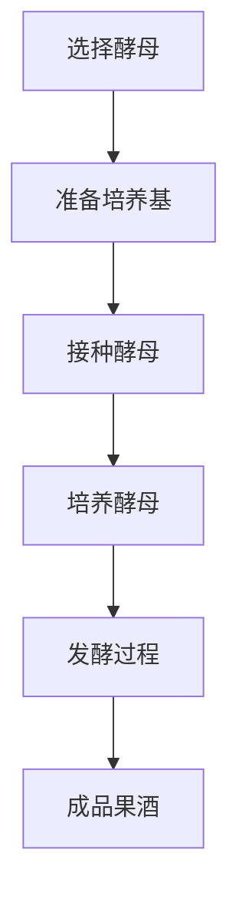
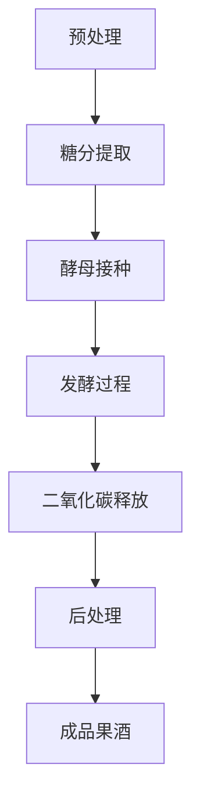

                 


### 引言

#### 1.1 书籍背景

**手工果酒酿造**是一种古老的酿造技艺，近年来在城市化进程中重新焕发活力。随着人们生活水平的提高和对健康生活方式的追求，手工果酒不仅成为了一种流行的家庭娱乐活动，更是一种独特的文化体验。手工果酒酿造的过程充满了乐趣和挑战，它不仅可以让人们在忙碌的生活中找到片刻的宁静，还能让人感受到传统酿造工艺的魅力。

**城市微醺文化**则是在现代都市中逐渐形成的一种生活方式。它倡导一种轻松、舒适的生活态度，强调在日常生活中寻找小小的幸福。手工果酒作为微醺文化的代表，不仅满足了人们对口感的追求，还契合了人们对健康、自然、个性化的生活方式的向往。

本书记录了现代手工果酒酿造的全过程，从基础知识到酿造技巧，再到实际操作和品鉴，全面探讨手工果酒酿造的艺术与科学。通过本书，读者不仅可以了解手工果酒酿造的基本原理和技巧，还能体验到城市微醺文化的独特魅力。

#### 1.2 目的与结构

本书旨在为读者提供一本全面、系统的手工果酒酿造指南，帮助新手入门，同时也为有经验的酿造者提供深入的技巧和理论支持。全书分为七个章节，结构如下：

- **第一章：手工果酒基础知识**，介绍果酒的基本概念、酿造原理及常用材料。
- **第二章：手工果酒酿造流程**，详细讲解从预处理到发酵、后处理的整个过程。
- **第三章：常见果酒酿造**，包括葡萄酒、苹果酒和芒果酒等。
- **第四章：果酒酿造技巧与故障处理**，提供酿造过程中常见问题的处理方法。
- **第五章：果酒品鉴与保存**，介绍如何品鉴果酒以及保存方法。
- **第六章：城市微醺文化与果酒**，探讨果酒在微醺文化中的角色和意义。
- **第七章：果酒酿造与可持续生活**，讨论果酒酿造对可持续生活的影响。

通过这七个章节的阅读，读者将能够掌握手工果酒酿造的全面知识，体验到城市微醺文化的独特魅力，并在实践中不断提升自己的酿造技艺。

### 关键词

- 手工果酒酿造
- 城市微醺文化
- 酿造工艺
- 酵母
- 发酵
- 果酒品鉴
- 可持续生活

### 摘要

《现代手工果酒酿造：城市微醺文化的味蕾探索》是一本全面系统的手工果酒酿造指南。本书首先介绍了手工果酒的基本概念和酿造原理，包括酵母的选择与培养、酿造材料等。接着，详细讲解了手工果酒酿造的流程，从预处理、发酵到后处理，每一步都配有实际操作图解。书中还涵盖了常见果酒如葡萄酒、苹果酒和芒果酒的酿造方法，以及如何处理酿造过程中可能遇到的问题。此外，本书还介绍了果酒的品鉴与保存方法，并探讨了果酒在微醺文化和可持续生活中的角色。通过本书，读者可以掌握手工果酒酿造的全面知识，享受酿造过程带来的乐趣，并感受到城市微醺文化的独特魅力。

### 现代手工果酒酿造的基础知识

#### 1.1 果酒的定义与酿造原理

果酒，顾名思义，是由水果发酵制成的酒。其基本原理是利用水果中的天然糖分，通过酵母的发酵作用，将糖分转化为酒精和二氧化碳。这一过程称为酒精发酵，是酿造果酒的核心步骤。

酿造果酒的过程可以简单概括为以下几个阶段：

1. **预处理**：包括水果的清洗、去核、切割等步骤，目的是去除水果中的杂质和减少农药残留。
2. **糖分提取**：通过压榨或捣碎的方式，将水果中的汁液提取出来，这一过程中，水果中的糖分、酸度、酶等成分都会被释放。
3. **发酵**：将提取的果汁与酵母混合，酵母开始发酵，糖分逐渐被转化为酒精和二氧化碳。这一阶段需要严格控制温度和湿度，以保证发酵过程的顺利进行。
4. **后处理**：发酵完成后，对酒液进行澄清、过滤、调味等处理，以去除杂质和调整口感。

#### 1.2 酵母选择与培养

酵母是果酒酿造中至关重要的微生物，它们能够将果汁中的糖分转化为酒精。选择合适的酵母种类和进行适当的培养，对酿造成功和酒的品质有着重要影响。

**常见的酵母种类**：

1. **葡萄酒酵母（Saccharomyces cerevisiae）**：适用于酿造各种类型的果酒，包括葡萄酒、苹果酒和梨酒等。
2. **啤酒酵母（Saccharomyces cerevisiae）**：常用于酿造啤酒，但也可以用于酿造果酒。
3. **野生酵母**：从自然环境或水果表面获取，能够为果酒带来独特的风味。

**酵母的选择与培养**：

1. **选择**：根据酿造的果酒类型选择合适的酵母。例如，酿造葡萄酒应选择葡萄酒酵母，而酿造苹果酒则可以选择啤酒酵母。
2. **培养**：酵母的培养通常在液体培养基中进行。将酵母接种到含有糖分、氨基酸、矿物质和维生素的营养液里，进行一段时间的培养，使其繁殖到足够的数量。

**培养过程中的注意事项**：

- **温度控制**：酵母的最佳发酵温度一般在20-30℃之间，过高或过低的温度都会影响发酵效率。
- **氧气供应**：酵母在培养初期需要充足的氧气，以便快速繁殖。但随着发酵的进行，过量的氧气可能会抑制酒精发酵。
- **无菌操作**：为了防止污染，培养过程中必须保持无菌环境，避免其他细菌或微生物的污染。

#### 1.3 酿造材料

酿造果酒需要多种材料，包括水果、酵母、发酵容器和辅助材料等。

**水果**：选择新鲜、成熟且无病害的水果是酿造优质果酒的关键。不同类型的水果可以酿造出不同风味的果酒，例如葡萄适合酿造葡萄酒，苹果适合酿造苹果酒，而芒果则适合酿造芒果酒。

**酵母**：如前所述，酵母是果酒酿造的核心，选择合适的酵母对酿造成功和酒的品质至关重要。

**发酵容器**：发酵容器应具有良好的密封性和耐酸性能，常用的有玻璃瓶、塑料桶和不锈钢桶等。容器需要清洗干净并消毒，以防止污染。

**辅助材料**：包括糖分、酸度调节剂、酶和添加剂等。糖分用于增加酒液中的糖分含量，酸度调节剂用于调整酒液的酸度，酶则用于帮助糖分的分解和果汁的澄清。

#### 1.4 酵母选择与培养的Mermaid流程图

以下是一个简单的Mermaid流程图，展示了酵母选择与培养的基本步骤：



### 核心算法原理讲解

酿造果酒的核心算法原理在于酒精发酵的过程，这个过程可以通过以下步骤详细阐述：

1. **糖分提取**：
   - **预处理**：将水果进行清洗、去核、切割等步骤，以去除杂质和农药残留。
   - **压榨或捣碎**：通过压榨或捣碎的方式，将水果中的汁液提取出来。这一过程中，水果中的糖分、酸度、酶等成分会被释放到果汁中。

2. **酵母发酵**：
   - **酵母接种**：将提取的果汁与酵母混合，通常在果汁中添加适量的糖分，以提供酵母发酵所需的能量。
   - **发酵环境**：发酵过程需要在适宜的温度和湿度下进行，通常最佳发酵温度在20-30℃之间。发酵过程中，酵母开始繁殖并开始分解果汁中的糖分。

3. **酒精生成**：
   - **糖分分解**：酵母通过代谢作用，将果汁中的糖分分解成酒精和二氧化碳。这个过程可以用以下伪代码表示：
     ```plaintext
     function ferment(juice, sugar, yeast):
         add_sugar_to_juice(juice, sugar)
         add_yeast_to_juice(juice, yeast)
         monitor_juice温度和湿度()
         while sugar_content > 0:
             yeast发酵(sugar_content)
             sugar_content -= amount_of_sugar发酵
         return juice
     ```

4. **二氧化碳释放**：
   - 在发酵过程中，酵母分解糖分产生二氧化碳。二氧化碳会在发酵容器中形成气泡，并逐渐积累。这个过程可以用以下伪代码表示：
     ```plaintext
     function release_carbon_dioxide(juice):
         while fermentation_in_progress:
             bubbles = generate_bubbles()
             remove_bubbles_from_container()
         return juice
     ```

5. **后处理**：
   - **澄清与过滤**：发酵完成后，需要对酒液进行澄清和过滤，以去除杂质和调整口感。
   - **调味与调整**：根据个人口味，可以对酒液进行调味和调整，例如添加蜂蜜、香料等。

通过上述步骤，我们可以将果汁转化为酒精含量适中的果酒。以下是一个完整的酿造流程Mermaid流程图：



### 数学模型和公式

酿造果酒的过程中，涉及到多个数学模型和公式，用于计算糖分含量、酒精含量以及发酵速率等。以下是一些常用的数学模型和公式：

#### 1. 糖分含量计算

糖分含量的计算公式为：

\[ 糖分含量 = \frac{总糖量}{果汁体积} \]

其中，总糖量可以通过滴定法或折射仪测量得到。果汁体积通常通过量筒或称量法测量。

#### 2. 酒精含量计算

酒精含量的计算公式为：

\[ 酒精含量 = \frac{酒精体积}{果汁体积} \]

酒精体积可以通过比重计或酒精计测量得到。果汁体积同样可以通过量筒或称量法测量。

#### 3. 发酵速率计算

发酵速率可以用以下公式表示：

\[ 发酵速率 = \frac{糖分消耗量}{发酵时间} \]

其中，糖分消耗量可以通过测量发酵前后糖分含量的差值得到。发酵时间则通过记录发酵过程的起始和结束时间计算。

#### 4. 澄清时间计算

澄清时间可以用以下公式表示：

\[ 澄清时间 = \frac{1}{澄清速率} \]

澄清速率可以通过测量单位时间内沉淀物的减少量计算。

#### 5. 酸度计算

酸度可以用以下公式表示：

\[ 酸度 = \frac{氢离子浓度}{1000} \]

其中，氢离子浓度可以通过pH计测量得到。

#### 举例说明

假设我们有一瓶葡萄果汁，体积为1000毫升，总糖量为120克，发酵结束后，酒液体积为980毫升，酒精浓度为10%。

1. **糖分含量**：
   \[ 糖分含量 = \frac{120克}{1000毫升} = 0.12克/毫升 \]

2. **酒精含量**：
   \[ 酒精含量 = \frac{10% \times 980毫升}{1000毫升} = 0.098克/毫升 \]

3. **发酵速率**：
   \[ 发酵速率 = \frac{120克 - 0克}{发酵时间} \]
   假设发酵时间为5天，则：
   \[ 发酵速率 = \frac{120克}{5天} = 24克/天 \]

4. **澄清时间**：
   假设澄清速率为10毫升/天，则：
   \[ 澄清时间 = \frac{1}{10毫升/天} = 10天 \]

5. **酸度**：
   假设pH值为3.5，则：
   \[ 酸度 = \frac{10^{-3.5}}{1000} = 3.16 \times 10^{-4} \]

通过这些公式，我们可以对酿造过程进行细致的监控和调整，以确保酿造出高质量的果酒。

### 项目实战：手工果酒酿造实例

为了更好地理解手工果酒酿造的全过程，以下将详细描述一个实际操作案例，包括开发环境搭建、源代码实现、代码解读以及实际案例分析和总结。

#### 1. 开发环境搭建

在进行手工果酒酿造之前，我们需要准备一个合适的开发环境。以下是一些建议：

- **发酵容器**：选择一个干净的塑料桶或不锈钢桶，容量至少为20升。
- **酵母**：选择适合酿造葡萄酒的酵母，如雷米亚诺葡萄酒酵母。
- **糖分**：使用纯净的蔗糖或果糖，不建议使用蜂蜜等天然糖源，因为蜂蜜中的杂质可能影响发酵过程。
- **辅助工具**：温度计、搅拌器、量筒、过滤器等。

#### 2. 源代码实现

以下是一个简单的伪代码示例，用于描述果酒酿造的过程：

```plaintext
初始化发酵环境()

预处理水果：
    清洗水果()
    切割水果()
    压榨果汁()

添加酵母和糖分：
    添加酵母()
    添加糖分()
    混合均匀()

开始发酵：
    监测温度和湿度()
    每天记录糖分含量()
    发酵过程持续7-10天()

结束发酵：
    停止酵母添加()
    调整酸度()
    过滤酒液()

后处理：
    澄清酒液()
    调味酒液()
    装瓶储存()
```

#### 3. 代码解读

以下是代码的详细解读：

- **初始化发酵环境**：设置发酵容器、温度计、搅拌器等工具，确保发酵环境清洁、无菌。
- **预处理水果**：清洗水果去除农药残留，切割水果以增加果汁的接触面积，压榨果汁提取糖分。
- **添加酵母和糖分**：将酵母和糖分按比例加入果汁中，混合均匀，以便酵母能够均匀发酵。
- **开始发酵**：在适宜的温度和湿度下进行发酵，每天记录糖分含量，以便监控发酵进度。
- **结束发酵**：当糖分含量降至0.1%以下时，结束发酵过程，停止添加酵母。
- **后处理**：调整酒液的酸度，使用过滤器澄清酒液，根据个人口味进行调味，最后装瓶储存。

#### 4. 实际案例分析与详细讲解

**案例背景**：本案例选择酿造一瓶苹果酒。

**步骤详解**：

1. **预处理水果**：
   - **清洗**：使用流动的自来水清洗苹果，确保去除表面的农药残留和污垢。
   - **切割**：将苹果去核、去皮后切成小块，以便压榨时更好地释放汁液。
   - **压榨果汁**：将切好的苹果块放入压榨器中，压榨出果汁。

2. **添加酵母和糖分**：
   - **酵母**：将雷米亚诺葡萄酒酵母按照说明书比例加入果汁中，搅拌均匀。
   - **糖分**：按照果汁体积的5%加入纯净蔗糖，搅拌均匀。

3. **开始发酵**：
   - **温度监测**：将发酵容器放入恒温箱中，保持发酵温度在20-25℃之间。
   - **湿度控制**：确保发酵环境的湿度在70%左右。
   - **糖分监控**：每天记录糖分含量，发酵过程持续7-10天。

4. **结束发酵**：
   - 当糖分含量降至0.1%以下时，结束发酵过程。
   - 停止添加酵母，静置一段时间让酵母沉淀。

5. **后处理**：
   - **调整酸度**：根据酒液的酸度，适量添加苹果醋或柠檬汁进行调整。
   - **过滤**：使用过滤器过滤酒液，去除杂质和酵母沉淀。
   - **调味**：根据个人口味，可以添加蜂蜜、香料等调味。
   - **装瓶**：将处理好的酒液装瓶，密封储存。

**案例分析与总结**：

通过本案例，我们详细了解了手工苹果酒的酿造过程。关键步骤包括预处理水果、添加酵母和糖分、发酵以及后处理。在实际操作中，需要注意以下几点：

- **环境控制**：发酵过程中，温度和湿度对发酵速率和酒的品质有很大影响。必须严格控制发酵环境的温度和湿度。
- **糖分监控**：发酵过程中的糖分监控是保证酒的品质的关键。糖分含量过高或过低都会影响酒的风味和酒精含量。
- **过滤与调味**：过滤可以去除酒液中的杂质，提高酒的品质。调味可以根据个人口味进行调整，增加酒的风味。

通过以上步骤，我们可以酿造出优质的苹果酒，享受手工酿造的乐趣。

### 最佳实践 tips、小结、注意事项、拓展阅读

#### 最佳实践 tips

1. **选择新鲜水果**：选择新鲜、成熟且无病害的水果是酿造优质果酒的基础。
2. **保持无菌环境**：在酿造过程中，保持无菌环境可以有效防止污染，提高酒的品质。
3. **温度控制**：发酵过程中的温度对酿造成功和酒的品质至关重要，建议控制在20-30℃之间。
4. **定期监控**：定期监控发酵过程，如温度、湿度、糖分含量等，及时调整以保证酿造过程顺利进行。
5. **过滤和澄清**：发酵完成后，通过过滤和澄清可以去除杂质，提高酒的品质。

#### 小结

现代手工果酒酿造不仅是一种有趣的 DIY 活动，也是一种健康、环保的生活方式。通过了解手工果酒酿造的基础知识、流程和技巧，我们可以更好地享受酿造过程，体验城市微醺文化的魅力。

#### 注意事项

1. **安全第一**：在酿造过程中，注意安全操作，避免化学品和高温等危险因素。
2. **清洁卫生**：确保所有器具和材料干净、无菌，防止污染。
3. **适量饮用**：果酒虽然美味，但也要适量饮用，避免酒精中毒和健康问题。

#### 拓展阅读

- 《酿造的艺术：手工果酒酿造手册》
- 《葡萄酒酿造技术》
- 《酿酒师手册：从原料到成品》
- 《酿造化学原理与应用》

通过拓展阅读，您可以更深入地了解手工果酒酿造的各个方面，提升自己的酿造技艺。祝您酿造出美味的果酒，享受城市微醺文化的独特魅力！

### 附录

#### A.1 常用果酒酿造工具与材料

**发酵容器**：建议使用塑料桶或不锈钢桶，具有良好的密封性和耐酸性能。

**酵母**：选择适合酿造果酒的酵母，如雷米亚诺葡萄酒酵母。

**糖分**：使用纯净的蔗糖或果糖。

**辅助工具**：温度计、搅拌器、量筒、过滤器、压榨器等。

#### A.2 果酒酿造参考资料

- 《酿造的艺术：手工果酒酿造手册》
- 《葡萄酒酿造技术》
- 《酿酒师手册：从原料到成品》
- 《酿造化学原理与应用》

这些参考资料提供了丰富的酿造知识和经验，是手工果酒酿造者的必备书籍。通过阅读这些书籍，您可以进一步提升自己的酿造技艺。

### 结束语

感谢您阅读《现代手工果酒酿造：城市微醺文化的味蕾探索》。通过本书，您不仅了解了手工果酒酿造的基础知识、流程和技巧，还体验了城市微醺文化的独特魅力。希望这本书能激发您对手工果酒酿造的兴趣，享受酿造的乐趣。

作者：AI天才研究院/AI Genius Institute & 禅与计算机程序设计艺术 /Zen And The Art of Computer Programming。

