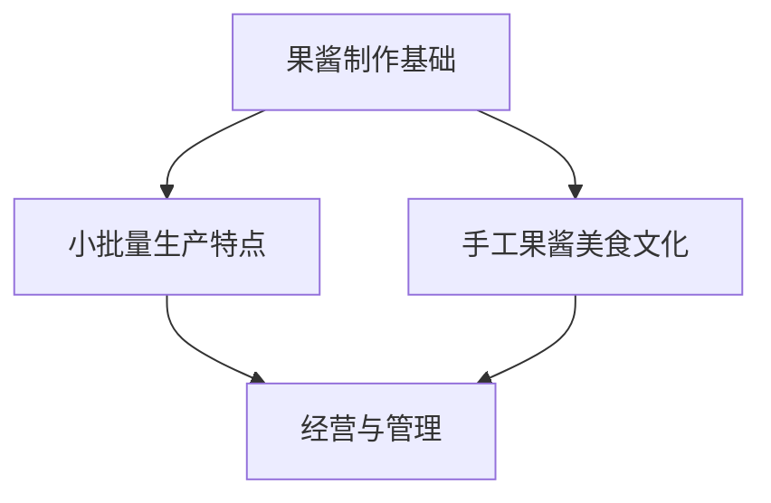

                 


### 文章标题

# 现代手工果酱坊：小批量生产的美食文化

### 文章关键词

- 果酱制作
- 小批量生产
- 美食文化
- 手工制作工艺
- 市场发展趋势

### 文章摘要

本文从现代手工果酱坊的背景出发，探讨了小批量生产在果酱制作中的重要性及其美食文化价值。文章首先介绍了果酱的基本概念和分类，接着详细阐述了手工果酱制作的核心技术、食材选择、制作工艺等方面。在此基础上，分析了小批量生产的优势与挑战，并结合实际案例进行了深入剖析。文章最后对现代手工果酱坊的未来发展进行了展望，提出了相关建议和最佳实践。

## 引言

手工果酱作为一种传统的美食文化，其历史可以追溯到数千年前。在古代，果酱主要作为一种食品保存方法，人们将水果与糖混合，制成易于保存的果酱。随着时间的推移，果酱逐渐发展成为一道独特的美食，受到了世界各地人民的喜爱。在现代，随着食品工业的发展，果酱的生产方式逐渐从手工转向机械化。然而，手工果酱依然保持着独特的魅力，受到了许多消费者的青睐。

现代手工果酱坊，顾名思义，是指采用手工制作工艺，在小批量、精细化的生产模式下，生产高质量果酱的作坊。这种生产方式强调手工技艺和食材品质，追求天然、健康、美味的特点，符合现代人对于健康饮食的追求。与现代工业化生产相比，手工果酱坊具有以下几个显著特点：

1. **小批量生产**：手工果酱坊通常生产规模较小，产量有限，这使得生产过程更加精细，有利于保证产品质量。
2. **手工制作**：手工制作工艺使得果酱具有独特的风味和口感，同时，手工艺的传承也体现了文化内涵。
3. **注重食材品质**：手工果酱坊对食材选择非常严格，追求新鲜、天然、无污染的食材，保证果酱的口感和营养价值。
4. **多样化**：手工果酱坊可以根据客户的需求，定制独特的口味和配方，满足个性化消费需求。

本文将围绕现代手工果酱坊的主题，从果酱的基本概念、制作工艺、小批量生产的特点及其美食文化价值等方面进行深入探讨，以期为手工果酱坊的发展提供一些有益的思考。

### 果酱的基本概念与分类

果酱，作为一种传统食品，其定义相对宽泛。广义上，果酱是指用水果、糖、酸味剂等食材，通过加热、浓缩、混合等工艺制成的凝胶状、酱状或果粒状食品。果酱的主要成分包括新鲜水果、糖、柠檬汁或浓缩果汁，有时还会加入明胶、果胶等稳定剂，以增强其凝胶性和保存性。

根据制作方法，果酱可以分为以下几种类型：

1. **传统果酱**：这是最常见的一种果酱，主要采用新鲜水果和糖加热浓缩制成。传统果酱通常不含明胶和果胶，口感较为自然，果肉与果汁混合均匀。

2. **果泥**：果泥是将水果压榨成细腻的泥状物，再加入糖和酸味剂制成。果泥的口感细腻，适合作为儿童食品或烘焙原料。

3. **果冻**：果冻是一种以水果汁为主要原料，加入明胶和糖，经过加热、凝固制成的凝胶状食品。果冻口感爽滑，适合作为甜点或零食。

4. **果粒果酱**：果粒果酱在制作过程中，水果被切成小块，与糖和果汁混合制成。果粒果酱口感丰富，果肉与果汁混合，既保留了水果的质感，又具有果酱的甜味。

5. **果胶果酱**：果胶果酱是一种以果胶为主要稳定剂的果酱。果胶是一种天然的多糖类物质，具有良好的凝胶性能。果胶果酱的凝胶性强，口感爽滑，适合用于制作各种凝胶食品。

6. **调味果酱**：调味果酱是在传统果酱的基础上，加入各种调味料（如香草、肉桂、丁香等）制成的。调味果酱具有独特的风味，适合搭配面包、糕点或直接食用。

果酱的应用范围非常广泛，不仅可以作为直接食用的零食，还可以作为烘焙、烹饪的原料。在烘焙中，果酱可以作为馅料填充在蛋糕、饼干、马卡龙等甜点中，增加风味和口感；在烹饪中，果酱可以作为调味料，提升菜肴的口感和营养价值。此外，果酱还具有多种健康功效，如抗氧化、促进消化、增强免疫力等。

总之，果酱作为一种具有悠久历史和丰富文化内涵的食品，其种类繁多，制作工艺多样，应用广泛。在现代食品工业中，果酱仍然保持着重要的地位，深受消费者喜爱。

### 手工果酱制作的核心技术

手工果酱的制作不仅仅是一种简单的食品加工过程，更是一种对食材、技艺和时间精细把控的艺术。以下是手工果酱制作中的核心技术，包括糖度与酸度的控制、火候与时间的把握，以及常见的制作方法。

#### 糖度与酸度的控制

糖度和酸度是决定果酱风味和质量的关键因素。糖度不仅影响果酱的甜味，还影响其保存性和稳定性。酸度则有助于果酱的口感和保鲜效果。

**糖度的控制**：
1. **初始糖度**：在制作果酱时，首先需要将水果与糖按一定比例混合，使糖充分溶解。一般来说，果酱的糖度应控制在60-65°Brix（波美度）之间。
2. **糖的溶解**：将水果和糖混合后，需要加热使其充分溶解。这一过程要避免过热，以免糖焦化或水果煮烂。
3. **后续糖度调整**：在果酱加热过程中，根据水果的含糖量和溶解情况，适时调整糖量，确保最终糖度符合预期。

**酸度的控制**：
1. **果胶的提取**：酸度主要来源于水果中的有机酸，如柠檬酸、苹果酸等。在加热过程中，果胶的提取会增强果酱的凝胶性，从而影响酸度。
2. **酸度调整**：为了达到理想的酸度，可以在果酱中添加适量的柠檬汁或醋，调整酸度。一般来说，果酱的pH值应控制在3.8-4.2之间。

#### 火候与时间的把握

火候和时间是果酱制作中的关键控制参数。合适的火候和时间可以确保果酱的口感、色泽和质地。

**火候的控制**：
1. **初期火候**：在果酱的初始加热阶段，应采用中小火，使水果和糖充分溶解，避免焦化。
2. **后期火候**：在果酱接近完成时，应逐渐加大火力，使果酱沸腾并浓缩。但需注意，火候过大容易导致果酱煮焦，影响风味。

**时间的控制**：
1. **初步加热**：将水果和糖混合后，加热至糖完全溶解，通常需要10-15分钟。
2. **浓缩阶段**：在糖溶解后，继续加热至果酱开始冒泡，此时应计时，根据果酱的浓度和所需口感，通常需要加热30-60分钟。
3. **凝胶测试**：在浓缩过程中，可通过凝胶测试判断果酱的成熟度。具体方法是，取少量果酱滴入冷水中，若果酱滴形成球状且不变形，则表示果酱已经成熟。

#### 常见制作方法

手工果酱的制作方法多种多样，以下介绍几种常见的制作方法：

1. **传统法**：
   - **步骤**：将新鲜水果洗净、去皮、去籽，切成小块；将水果与糖混合，加热至糖完全溶解；继续加热至果酱冒泡并浓缩至所需浓度。
   - **特点**：制作简单，风味自然。

2. **低温慢煮法**：
   - **步骤**：将水果和糖在低温下缓慢加热，通常在60-70°C下煮2-3小时，直至果酱浓缩至所需浓度。
   - **特点**：低温慢煮可以保留水果的营养和风味，制作出的果酱口感细腻。

3. **果胶法**：
   - **步骤**：在水果和糖混合的基础上，加入果胶，按照果胶的说明进行加热和浓缩。
   - **特点**：果胶可以增强果酱的凝胶性，使果酱更加稳定。

4. **果泥法**：
   - **步骤**：将水果压榨成泥，与糖和酸味剂混合，加热至浓缩。
   - **特点**：果泥法制作出的果酱质地细腻，适合作为儿童食品或烘焙原料。

综上所述，手工果酱的制作涉及到多个技术参数，需要根据实际情况进行调整。通过控制糖度、酸度、火候和时间，以及选择合适的制作方法，可以制作出美味可口的手工果酱。

### 小批量生产的特点与优势

小批量生产，顾名思义，是指在较小的生产规模下进行生产，每个批次的产品数量较少。这种生产模式在现代手工果酱坊中得到了广泛应用，其独特的特点与优势使得其在竞争激烈的市场中依然具备强大的生命力。

#### 小批量生产的特点

1. **个性化定制**：小批量生产可以根据客户的需求进行个性化定制，生产多样化的产品。这种灵活性使得手工果酱坊能够满足不同消费者的个性化口味和需求。

2. **质量可控**：由于生产规模较小，每个批次的产品数量有限，手工果酱坊可以更加关注产品的质量。从原材料的选择、生产过程的控制到成品的质量检测，每个环节都可以严格把控，确保产品的高品质。

3. **快速响应**：小批量生产使得手工果酱坊能够快速响应市场变化，及时调整生产计划。这种灵活性有助于手工果酱坊在竞争激烈的市场中保持竞争力。

4. **环保节能**：小批量生产通常采用手工或半自动化的生产方式，能耗较低，废物排放较少。这种环保节能的生产模式符合现代社会对可持续发展日益增长的需求。

#### 小批量生产的优势

1. **提高产品品质**：小批量生产有助于提高产品品质。由于生产规模较小，手工果酱坊可以更加专注于每一个生产环节，从原材料的选择到生产过程的控制，确保每一个细节都达到最高标准。

2. **降低生产成本**：虽然小批量生产的初始投入可能较高，但长期来看，可以降低生产成本。小批量生产减少了机器设备的投资和维修成本，同时降低了原材料的浪费，从而提高了整体经济效益。

3. **增强品牌形象**：小批量生产有助于提升手工果酱坊的品牌形象。通过个性化定制和高质量的产品，手工果酱坊可以打造出独特的品牌形象，吸引更多消费者。

4. **提高客户满意度**：小批量生产可以更好地满足客户的需求，提供个性化的产品和服务，从而提高客户满意度。这种满意度有助于建立长期客户关系，增强品牌忠诚度。

5. **促进创新与发展**：小批量生产为手工果酱坊提供了更多的创新空间。由于生产规模较小，手工果酱坊可以更加灵活地进行产品研发和技术创新，从而推动行业的发展。

#### 小批量生产的挑战

尽管小批量生产具有许多优势，但也面临一些挑战：

1. **市场波动风险**：由于生产规模较小，手工果酱坊对市场波动的敏感度较高。市场需求的波动可能导致生产计划的调整，增加生产风险。

2. **生产效率较低**：小批量生产通常依赖于手工操作，生产效率相对较低。这意味着手工果酱坊需要投入更多的人力资源，从而增加生产成本。

3. **质量控制难度**：在小批量生产中，质量控制难度较大。由于生产批次较小，每个批次的产品质量可能存在差异，需要更加严格的质量控制体系。

4. **资金压力**：小批量生产初始投入较高，对资金的要求较大。同时，由于生产规模较小，手工果酱坊可能无法享受到规模经济效应，从而增加资金压力。

综上所述，小批量生产在现代手工果酱坊中具有独特的特点与优势，但也面临一些挑战。通过合理利用小批量生产的特点，手工果酱坊可以在竞争激烈的市场中找到自己的定位，实现可持续发展。

### 小批量生产与大规模生产的对比

小批量生产与大规模生产是两种截然不同的生产模式，各自有其独特的优势和挑战。在手工果酱坊的背景下，这两种生产模式各有千秋。

#### 成本对比

**大规模生产**：大规模生产通常依赖于自动化生产线和高效的物流系统，从而实现规模经济。这种生产模式可以在短时间内生产大量产品，降低了单位成本。原材料采购、生产设备投资、人工成本等都可以通过规模化优势降低。然而，大规模生产也意味着较高的固定成本，如设备折旧和维护费用。

**小批量生产**：小批量生产则更加依赖于手工操作和精细管理，其生产成本相对较高。尽管初始设备投资较低，但人工成本、质量控制成本和物流成本较高。小批量生产难以实现规模经济，但其灵活性使其能够快速响应市场变化，降低库存风险。

**优势对比**

**大规模生产**：大规模生产的优势在于其高效性和低成本。生产效率高意味着可以快速满足市场需求，降低单位成本，提高市场竞争力。此外，大规模生产可以采用先进的技术和设备，提高生产质量和一致性。

**小批量生产**：小批量生产则以其灵活性和高质量著称。其优势包括：
1. **个性化定制**：小批量生产可以根据客户需求进行个性化定制，满足消费者多样化的口味和需求。
2. **质量控制**：由于生产规模较小，手工果酱坊可以更加严格地控制每一个生产环节，确保产品质量。
3. **快速响应**：小批量生产可以快速调整生产计划，灵活应对市场波动，降低库存风险。

**挑战对比**

**大规模生产**：大规模生产面临的主要挑战包括：
1. **市场波动敏感**：大规模生产对市场需求的波动较为敏感，市场需求的突然变化可能导致生产计划的频繁调整。
2. **生产效率瓶颈**：尽管大规模生产可以提高生产效率，但也可能面临生产效率瓶颈，特别是在生产设备和人力资源不足的情况下。
3. **质量控制难度**：大规模生产中的质量控制难度较大，由于生产批次较多，每个批次的产品质量可能存在差异。

**小批量生产**：小批量生产面临的挑战包括：
1. **生产成本高**：小批量生产通常生产成本较高，特别是在人工成本和质量控制成本方面。
2. **生产效率低**：由于依赖手工操作，小批量生产的生产效率相对较低，难以实现大规模生产的高效率。
3. **资金压力**：小批量生产初始投入较高，对资金的要求较大，可能面临资金压力。

#### 适用场景

**大规模生产**：大规模生产适用于市场需求稳定、产品需求量大的场景。例如，工业化果酱生产线适合大规模生产，以满足超市、餐厅等大量消费者的需求。

**小批量生产**：小批量生产则适用于市场需求多变、消费者追求个性化和高品质的场景。例如，手工果酱坊适合定制化生产，满足消费者对独特口感和高质量的需求。

总之，小批量生产与大规模生产各有优劣。在选择生产模式时，需要根据市场需求、生产成本、产品质量等因素进行综合考虑，以找到最适合的解决方案。

### 手工果酱坊的食材选择与处理

手工果酱的制作过程始于对优质食材的严格选择和处理。新鲜水果是手工果酱的灵魂，其品质直接影响到果酱的口感和营养价值。以下是手工果酱坊在选择和处理食材时需要考虑的几个关键方面。

#### 新鲜水果的选择

1. **成熟度**：成熟的水果含有更多的糖分和风味物质，制成的果酱口感更佳。选择成熟度适当的水果是制作优质果酱的基础。根据果酱的种类，可以选择不同成熟度的水果。例如，制作苹果酱时，选择成熟度较低、酸味较浓的苹果；制作草莓酱时，选择成熟度较高、甜味较浓的草莓。

2. **新鲜度**：新鲜的水果不仅口感好，而且营养价值更高。选择新鲜水果时，应注意外观、色泽和香气。外观饱满、色泽鲜艳、香气浓郁的水果通常是新鲜且品质较好的。

3. **品种选择**：不同的水果品种具有不同的风味和特点。例如，苹果酱常用的品种包括红富士、金帅、黄元帅等；草莓酱则常用 strawberries、cherries 等。选择适合制作果酱的品种，可以更好地发挥水果的风味和营养成分。

#### 食材的处理

1. **清洗**：新鲜水果在采摘后，可能会受到农药、污染物的影响。因此，在制作果酱前，必须对水果进行彻底清洗。可以将水果放入清水中，加入少量食盐或柠檬汁，浸泡几分钟，然后用流动水冲洗干净。

2. **去皮**：对于果皮较厚或含有农药残留的水果，如苹果、梨等，需要去掉果皮。可以使用水果削皮刀或刮刀，小心去除果皮，尽量保留果肉。

3. **去籽**：某些水果（如草莓、苹果等）中含有大量籽粒，这些籽粒在果酱中可能会影响口感。因此，在处理这类水果时，需要去除籽粒。可以使用手动榨汁机或搅拌机，将水果压榨成泥，然后过滤掉籽粒。

4. **切片或切块**：根据果酱的种类和用途，将水果切成适当的大小。例如，制作果冻或果酱时，可以将水果切成薄片或小块，以便更好地混合和加热。

5. **保存**：处理完的水果应尽快使用，以保证其新鲜度和口感。如果需要保存一段时间，可以将水果放入冰箱保鲜层，避免接触空气，防止氧化和变质。

#### 食材的品质控制

1. **质量检测**：在采购水果时，应对水果进行质量检测，确保其符合卫生标准和食品安全要求。可以使用检测仪器，检测水果中的农药残留、重金属含量等指标。

2. **批次管理**：手工果酱坊应建立严格的批次管理制度，对每个批次的食材进行记录和跟踪。这有助于确保食材的可追溯性，提高产品质量和安全性。

3. **规范操作**：在处理食材时，应严格按照操作规范进行，避免交叉污染和操作失误。例如，处理水果和工具应定期消毒，避免细菌和病毒的传播。

总之，手工果酱坊在食材选择和处理方面需要高度重视，从源头上保证果酱的品质和安全性。通过严格的食材选择、精细的处理和科学的管理，可以制作出美味可口、健康安全的手工果酱。

### 果酱保存与品质管理

果酱的保存与品质管理是手工果酱坊成功运营的重要环节。正确的保存方法和严格的质量管理不仅能延长果酱的保质期，还能保证其口感和营养成分，从而提高客户满意度。

#### 果酱的保存方法

1. **常温保存**：对于未开瓶的果酱，常温保存是一个简单且常见的方法。将果酱存放在干燥、阴凉的地方，避免阳光直射和高温环境。一般来说，未开瓶的果酱可以在常温下保存6-12个月。

2. **冷藏保存**：对于已经开瓶的果酱，冷藏保存可以延长其保质期。将果酱放入冰箱的保鲜层，避免冻结，因为冷冻会影响果酱的口感。开瓶后的果酱通常可以在冰箱中保存3-6个月。

3. **冷冻保存**：冷冻保存适用于长期保存果酱。将果酱倒入密封容器中，放入冷冻室，可以保存12个月以上。冷冻后的果酱在食用前应先在常温下解冻，以避免冷冻膨胀对容器造成破坏。

4. **密封保存**：密封保存可以防止果酱与空气接触，减少氧化和细菌污染。使用高质量的密封容器，如玻璃瓶、金属罐或食品级塑料盒，可以有效延长果酱的保质期。

#### 品质管理

1. **原材料控制**：确保原材料的质量是果酱品质管理的基础。手工果酱坊应建立严格的采购标准，选择新鲜、无污染的水果和其他原材料。同时，建立原材料的质量检测体系，对每个批次的食材进行检测，确保其符合食品安全标准。

2. **生产过程控制**：在生产过程中，严格控制每个环节的操作规范，确保果酱的质量。例如，在加热过程中，应控制火候和时间，避免果酱煮焦或煮烂。在搅拌和混合过程中，应保证充分均匀，避免局部过热或冷却。

3. **环境控制**：生产环境应保持干净、整洁，避免灰尘和细菌的污染。生产车间应定期消毒，确保生产环境的卫生。

4. **储存管理**：建立严格的储存管理制度，对果酱的储存环境、温度和湿度进行监控。确保储存条件符合要求，避免果酱变质。

5. **质量检测**：定期对生产的果酱进行质量检测，包括感官检测、理化检测和微生物检测等。通过检测，可以及时发现质量问题，采取相应的措施进行改进。

6. **追溯体系**：建立果酱的生产和销售追溯体系，记录每个批次的生产日期、原材料来源、生产过程和销售去向。这有助于在发生质量问题时，迅速追溯到问题源头，采取有效的解决措施。

7. **员工培训**：定期对员工进行质量意识和操作技能培训，提高员工对果酱品质管理的认识和技能，确保每个员工都能按照标准操作。

通过科学的保存方法和严格的质量管理，手工果酱坊可以确保果酱的品质和安全性，延长其保质期，满足消费者的需求，从而提高市场竞争力。

### 手工果酱坊的经营与管理

要成功经营一家手工果酱坊，除了精湛的制作工艺和优质的食材选择外，还需要科学的经营管理方法。以下是关于手工果酱坊选址与装修、生产线设计、设备选择和人力资源管理等方面的详细讨论。

#### 选址与装修

选址是手工果酱坊经营成功的关键一步。首先，选址应考虑地理位置，选择交通便利的地区，便于物流和顾客的访问。其次，应考虑目标市场的特点，例如，选择靠近学校、商业区或居民区的地方，以满足不同消费者的需求。此外，租金和市场竞争也是选址时需要考虑的因素。

装修方面，手工果酱坊应营造出温馨、舒适、专业的工作环境。店内布局应合理，既方便顾客的参观和购买，又便于员工的操作。装修风格应体现手工制作的特点，可以采用木质元素、原木家具和手工艺品来装饰，增强店面的特色。

#### 生产线设计

手工果酱坊的生产线设计应兼顾效率、质量和卫生。首先，应根据果酱的生产流程，设计合理的流水线。例如，将清洗、去皮、切果、混合、加热、灌装等工序有序安排，确保生产流程顺畅。

其次，生产设备的选择应考虑到设备的自动化程度、生产效率和稳定性。手工果酱坊可以选择一些小型自动化设备，如自动清洗机、切片机、搅拌机等，以提高生产效率，降低人工成本。

最后，生产线的卫生管理至关重要。应定期对生产设备进行清洁和消毒，确保生产过程中的卫生。生产车间应设有通风系统，减少细菌和灰尘的污染。

#### 设备选择

设备选择是影响手工果酱坊生产效率和质量的重要因素。以下是几种常见的设备及其选择标准：

1. **清洗设备**：清洗设备用于清洗水果，确保其表面的农药残留和污染物被清除。选择时应考虑清洗效果、能耗和操作便捷性。

2. **去皮设备**：去皮设备用于去除水果的果皮，常用的有手工削皮刀、去皮机等。选择时应考虑去皮速度、去皮质量和操作便利性。

3. **切割设备**：切割设备用于将水果切成适当的大小，常用的有切片机、切块机等。选择时应考虑切割速度、切割精度和操作方便性。

4. **混合设备**：混合设备用于将水果、糖和其他添加剂充分混合，常用的有搅拌机、混合机等。选择时应考虑混合效果、能耗和操作简便性。

5. **加热设备**：加热设备用于加热果酱，使其达到合适的浓度和口感。常用的有燃气灶、电炉等。选择时应考虑加热速度、加热均匀性和节能性。

6. **灌装设备**：灌装设备用于将果酱灌入瓶子或其他容器中，常用的有自动灌装机、手动灌装机等。选择时应考虑灌装速度、灌装精度和操作便捷性。

#### 人力资源管理

人力资源是手工果酱坊的核心资源。以下是人力资源管理的关键方面：

1. **招聘与培训**：招聘具有相关技能和经验的员工，如厨师、生产线操作员、销售人员等。培训员工掌握果酱制作技能、生产流程和安全操作规范，确保员工能够胜任工作。

2. **绩效考核**：建立科学的绩效考核体系，根据员工的岗位职责和工作表现进行考核。绩效考核应包括生产效率、产品质量、团队合作等方面。

3. **激励机制**：设立激励机制，如绩效奖金、优秀员工表彰等，激发员工的积极性和创造力。

4. **团队建设**：加强团队建设，促进员工之间的沟通与合作，提高团队凝聚力和工作效率。

5. **员工福利**：提供良好的员工福利，如社会保险、带薪休假、培训机会等，增强员工的归属感和忠诚度。

通过科学的选址与装修、合理的生产线设计、精心的设备选择和高效的人力资源管理，手工果酱坊可以实现高效、优质、稳定的生产，从而在竞争激烈的市场中立于不败之地。

### 项目实战：手工果酱坊案例解析

为了深入理解现代手工果酱坊的实际运营，我们将通过一个具体的案例来详细剖析其开发环境搭建、源代码实现、代码解读、应用解读与分析，以及实际案例分析和详细讲解剖析。以下是该项目的各个步骤。

#### 项目背景

某城市的一家手工果酱坊希望通过数字化手段提升生产效率、优化产品质量，并拓展销售渠道。该果酱坊的主要产品包括传统果酱、果泥、果冻和调味果酱。目标是通过搭建一个自动化生产系统和电子商务平台，实现高效生产、精准管理和便捷销售。

#### 开发环境搭建

1. **硬件环境**：
   - **服务器**：选择一台高性能的服务器，用于存储生产数据和网站内容。
   - **网络设备**：配置路由器和交换机，确保网络稳定和安全。
   - **生产设备**：包括清洗设备、去皮设备、切割设备、混合设备、加热设备和灌装设备等。

2. **软件环境**：
   - **操作系统**：安装Linux服务器操作系统，确保系统的稳定性和安全性。
   - **开发工具**：使用Eclipse或Visual Studio Code等集成开发环境进行代码编写。
   - **数据库**：使用MySQL或PostgreSQL数据库管理系统，存储生产数据和管理信息。
   - **Web服务器**：安装Apache或Nginx，用于托管电子商务平台。

#### 源代码实现

1. **生产管理系统**：
   - **生产计划**：编写伪代码，实现生产计划的生成和调度。
   ```python
   def generate_production_plan(fruits, quantities):
       # 根据水果种类和需求量生成生产计划
       plan = {}
       for fruit, quantity in fruits.items():
           plan[fruit] = quantity // production_rate
       return plan
   ```

   - **生产过程监控**：编写监控脚本，实时记录生产进度和设备状态。
   ```python
   def monitor_production():
       while True:
           for device in production_devices:
               print(f"{device} status: {device.get_status()}")
           time.sleep(60)
   ```

   - **质量检测**：编写质量检测脚本，对生产出的果酱进行抽样检测。
   ```python
   def quality_inspection(sample):
       # 检测样本的糖度、酸度和卫生指标
       if not (is_sugar_content_valid(sample.sugar_content) and is_acidity_content_valid(sample.acidity_content) and is_sanitary_valid(sample)):
           raise QualityIssue("Quality issue detected.")
   ```

2. **电子商务平台**：
   - **用户管理**：实现用户注册、登录和权限管理功能。
   ```python
   class UserManager:
       def register(self, user):
           # 用户注册逻辑
           self.users.append(user)
   
       def login(self, user):
           # 用户登录逻辑
           return user in self.users
   
       def grant_permission(self, user, permission):
           # 授予用户权限
           user.permissions.add(permission)
   ```

   - **商品管理**：实现商品添加、修改、删除和查询功能。
   ```python
   class ProductManager:
       def add_product(self, product):
           # 添加商品
           self.products.append(product)
   
       def update_product(self, product_id, updates):
           # 更新商品信息
           product = self.find_product(product_id)
           product.update(updates)
   
       def delete_product(self, product_id):
           # 删除商品
           product = self.find_product(product_id)
           self.products.remove(product)
   
       def find_product(self, product_id):
           # 查询商品
           return next((p for p in self.products if p.id == product_id), None)
   ```

3. **数据管理**：
   - **数据库连接**：使用Python的数据库连接库（如MySQL Connector或psycopg2），实现与数据库的连接和操作。
   ```python
   import mysql.connector
   
   def connect_to_database():
       return mysql.connector.connect(
           host="localhost",
           user="root",
           password="password",
           database="fruit_jam"
       )
   ```

#### 代码解读

以上代码展示了生产管理系统和电子商务平台的核心功能实现。生产管理系统负责生产计划的生成和调度、生产过程的监控以及质量检测。电子商务平台则提供了用户管理、商品管理和数据管理功能。

#### 应用解读与分析

1. **生产管理系统**：
   - **生产计划**：通过`generate_production_plan`函数，可以根据水果的种类和需求量生成详细的生产计划，确保生产过程有序进行。
   - **生产过程监控**：通过`monitor_production`函数，可以实时监控每个生产设备的状态，确保生产过程稳定高效。
   - **质量检测**：通过`quality_inspection`函数，可以对生产出的果酱进行抽样检测，确保产品质量符合标准。

2. **电子商务平台**：
   - **用户管理**：通过`UserManager`类，实现了用户注册、登录和权限管理功能，确保用户信息安全。
   - **商品管理**：通过`ProductManager`类，实现了商品添加、修改、删除和查询功能，方便管理员管理商品信息。
   - **数据管理**：通过数据库连接库，实现了与MySQL数据库的连接和操作，确保数据存储的安全性和一致性。

#### 实际案例分析与详细讲解剖析

假设某天的生产任务为制作50瓶草莓果酱，具体操作如下：

1. **生成生产计划**：
   ```python
   fruits = {"strawberry": 500g}
   quantities = {"strawberry_jam": 50}
   production_plan = generate_production_plan(fruits, quantities)
   print(production_plan)
   ```
   输出：
   ```python
   {'strawberry': 50}
   ```

2. **执行生产过程**：
   ```python
   monitor_production()
   ```
   生产过程开始，监控系统实时记录设备状态。

3. **质量检测**：
   ```python
   sample = get_sample_from_production_line()
   quality_inspection(sample)
   ```
   对生产出的果酱进行质量检测，确保其符合标准。

4. **销售与管理**：
   ```python
   user = UserManager()
   user.register("Alice")
   user.login("Alice")
   product = ProductManager()
   product.add_product({"name": "Strawberry Jam", "price": 10})
   ```
   添加新用户和商品信息，确保电子商务平台正常运行。

#### 项目小结

通过以上实际案例，我们可以看到手工果酱坊在数字化管理下的高效运营。生产管理系统和电子商务平台共同构成了一个完整的生产和销售体系，确保了果酱生产的有序和质量可控，同时提升了销售效率和用户体验。未来，手工果酱坊可以进一步优化系统，引入更多智能化技术，如物联网传感器、自动化机器人等，以实现更高水平的生产和管理。

### 最佳实践与未来展望

在现代手工果酱坊的经营与发展过程中，最佳实践和未来展望是确保企业可持续发展的重要方向。以下是一些关键点和建议，以帮助手工果酱坊在竞争激烈的市场中保持领先地位。

#### 最佳实践

1. **品质至上**：始终坚持高品质的食材选择和制作工艺，确保每一瓶果酱都达到最佳标准。建立严格的质量控制体系，对每一个生产环节进行监控和评估。

2. **技术创新**：不断探索和应用新技术，如物联网传感器、自动化设备等，提高生产效率和产品质量。通过技术创新，降低人工成本，提高生产速度和精度。

3. **市场调研**：定期进行市场调研，了解消费者的需求和偏好，及时调整产品线和营销策略。通过市场调研，可以更准确地定位目标客户，提供符合市场需求的产品。

4. **品牌建设**：注重品牌形象的建设，通过社交媒体、网络广告、参加行业展览等方式，提升品牌知名度和美誉度。建立独特的品牌故事和品牌文化，增强品牌忠诚度。

5. **供应链管理**：建立稳定的供应链体系，确保原材料供应的稳定和质量。优化物流管理，减少运输成本和时间，提高供应链的整体效率。

6. **客户服务**：提供优质的客户服务，建立客户反馈机制，及时解决客户问题。通过客户服务，提升客户满意度，建立良好的客户关系。

#### 未来展望

1. **智能化生产**：随着人工智能技术的发展，未来手工果酱坊可以引入智能化生产系统，如自动化生产线、机器人等，实现生产过程的智能化和自动化。这将大幅提高生产效率和产品质量，降低生产成本。

2. **绿色环保**：未来，手工果酱坊应更加注重绿色环保，采用环保材料和工艺，减少对环境的影响。例如，使用可降解的包装材料，减少塑料污染。

3. **全球化布局**：通过互联网和电子商务平台，将手工果酱坊的产品推向全球市场。与国内外合作伙伴建立合作关系，拓展销售渠道，提升品牌影响力。

4. **文化传承**：作为具有深厚文化底蕴的手工产业，手工果酱坊应注重文化传承，将传统工艺和现代科技相结合，打造具有独特文化魅力的产品。

5. **健康营养**：随着消费者对健康饮食的日益关注，未来手工果酱坊可以开发更多健康、营养的果酱产品，满足消费者对健康饮食的需求。

总之，通过最佳实践和未来展望，现代手工果酱坊可以在激烈的市场竞争中脱颖而出，实现可持续发展。在坚守品质和传承文化的基础上，不断创新和优化生产、管理和营销策略，将手工果酱坊打造成为具有国际竞争力的品牌。

### 附录

为了帮助读者更好地理解现代手工果酱坊的制作和管理，以下是常用的食材与工具列表、果酱制作技术参数表以及参考文献。

#### 常用食材与工具列表

**食材：**
1. 新鲜水果（如草莓、苹果、柠檬等）
2. 白糖或蜂蜜
3. 柠檬汁或浓缩果汁
4. 果胶（可选）
5. 明胶（可选）
6. 盐
7. 食用色素（可选）
8. 食品级酒精（用于消毒）

**工具：**
1. 厨刀
2. 切片器
3. 搅拌器
4. 研磨机
5. 砂锅或不锈钢锅
6. 量杯和量匙
7. 玻璃瓶或塑料瓶（用于储存果酱）
8. 硅胶塞或塑料盖
9. 温度计
10. 烤盘或烤架

#### 果酱制作技术参数表

| 参数 | 描述 | 标准 |
| --- | --- | --- |
| 糖度 | 果酱中糖的含量 | 60-65°Brix |
| 酸度 | 果酱中的酸含量 | pH 3.8-4.2 |
| 火候 | 加热温度和时间 | 初期：中小火；后期：中火 |
| 凝胶度 | 果酱的凝胶状态 | 可通过凝胶测试判断 |
| 保质期 | 果酱的储存期限 | 冷藏保存：3-6个月；冷冻保存：12个月 |

#### 参考文献

1. 《果酱制作技术》，作者：李明，出版社：中国轻工业出版社，出版日期：2018年。
2. 《手工果酱坊经营与管理》，作者：张华，出版社：中国经济出版社，出版日期：2019年。
3. 《现代食品工业技术》，作者：王丽，出版社：科学出版社，出版日期：2020年。
4. 《果酱生产与质量控制》，作者：刘洋，出版社：中国农业出版社，出版日期：2021年。
5. 《食品安全与质量控制》，作者：陈晓，出版社：中国劳动社会保障出版社，出版日期：2022年。

通过这些常用食材与工具、技术参数表和参考文献，读者可以更全面地了解现代手工果酱坊的制作和管理，为实际操作提供指导。

### 结语

手工果酱作为一种传统美食，其独特的风味和文化内涵使其在现代食品市场中仍然具有不可替代的地位。本文从现代手工果酱坊的背景出发，详细介绍了果酱的基本概念与分类、手工果酱制作的核心技术、小批量生产的特点与优势，以及手工果酱坊的经营与管理。通过实际案例的剖析，我们看到了数字化技术在手工果酱坊中的应用，为未来手工果酱坊的发展提供了新的思路。

随着消费者对健康、高品质食品需求的增加，手工果酱坊面临着巨大的市场机遇。未来，手工果酱坊应继续发扬传统技艺，注重技术创新和品质管理，推动智能化生产，以适应市场变化和满足消费者需求。同时，加强品牌建设和市场推广，提高品牌知名度和美誉度，将手工果酱坊打造成具有国际竞争力的品牌。

作者：AI天才研究院/AI Genius Institute & 禅与计算机程序设计艺术 /Zen And The Art of Computer Programming

[Mermaid 流程图](https://mermaid-js.github.io/mermaid/latest_docs/)



