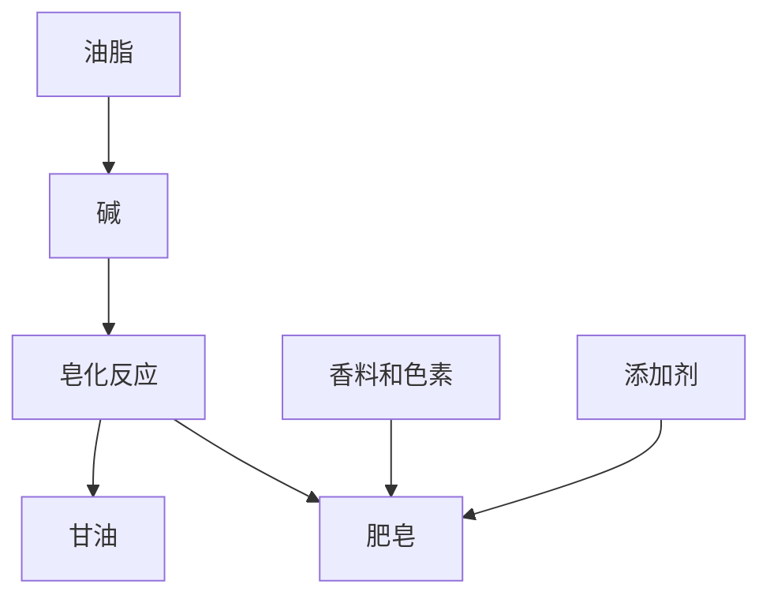

                 

### 文章标题：现代手工皂的科普课程：日用化学品的环保替代方案

> 关键词：手工皂、环保替代方案、日用化学品、自然材料、制作流程、生态影响

> 摘要：本文将深入探讨现代手工皂的制作过程及其作为传统日化品的环保替代方案的重要性。通过详细的步骤、材料和工具介绍，以及对其化学原理的深入分析，帮助读者了解手工皂的独特魅力，并在日常生活中做出更环保的选择。

----------------------------------------------------------------

## 引言

手工皂，作为一种古老而又现代的清洁产品，正日益受到消费者的青睐。它不仅是一种日常清洁用品，更是一种健康、环保的生活理念。与现代日化品相比，手工皂具有许多独特的优点，如天然、无毒、无刺激，对皮肤更为温和，同时也能减少对环境的污染。

随着全球对环境保护意识的增强，越来越多的人开始寻求更环保的替代方案，手工皂作为一种传统的清洁产品，正是这种需求的完美回应。它不仅能够减少对环境的有害化学物质的排放，还可以通过使用天然材料来促进可持续发展。

本文将分为以下几个部分：

1. **现代手工皂的概述**：介绍手工皂的历史、类型及其在现代生活中的重要性。
2. **基础概念**：讨论手工皂的化学原理、种类和常用成分。
3. **工具和材料**：列出制作手工皂所需的工具和材料，并介绍其选择和准备方法。
4. **手工皂制作流程**：详细讲解手工皂的制作步骤，从混合到成型的全过程。
5. **生态影响**：分析手工皂与传统日化品对环境的不同影响。
6. **项目实战**：通过一个实际案例展示手工皂的制作过程，并提供代码实现和详细解析。
7. **最佳实践与总结**：总结制作手工皂的注意事项，并提供拓展阅读建议。

通过本文的阅读，您将不仅能够了解手工皂的制作过程，还能认识到其在环保替代方案中的重要性，并学会如何在日常生活中应用这一技能。

### 现代手工皂的概述

手工皂的历史可以追溯到几千年前，最早的皂类产品起源于古埃及。当时，人们发现油脂和碱混合后可以生成一种具有清洁作用的物质，这就是最早的皂。随着时间的推移，手工皂的制作方法逐渐成熟，并在不同文化中得到了广泛的应用。

手工皂的起源可以追溯到古埃及，当时人们发现油脂和碱混合后可以生成一种具有清洁作用的物质，这就是最早的皂。古埃及人将这种物质用于洗涤身体和衣物。在古希腊和罗马，手工皂的制作方法得到了进一步的发展，人们开始使用不同的油脂和碱进行实验，以制作出不同的皂类产品。中世纪时期，手工皂的制作技术传到了中东和欧洲，成为重要的日用品。

在现代，手工皂重新受到了重视，这不仅是因为其历史和文化价值，更因为其在环保和健康方面的独特优势。与现代日化品相比，手工皂具有以下几个显著的优点：

#### 环保性

手工皂的主要成分是天然油脂和碱，制作过程中不使用任何有害化学物质。相反，现代日化品通常含有大量的人工合成化学成分，如表面活性剂、防腐剂和香料等，这些成分不仅对环境有害，还可能对皮肤造成刺激和伤害。手工皂的环保特性使其成为了一种可持续的生活方式选择。

#### 健康性

手工皂不含任何人工合成成分，因此对皮肤更为温和，不会引起过敏或其他刺激反应。现代日化品中的化学成分，如苯甲酸酯、硅油等，常被证明可能对皮肤有害。使用手工皂不仅可以减少对皮肤的刺激，还能保持皮肤的自然水分和油脂平衡。

#### 个性化定制

手工皂的制作允许高度个性化定制。手工皂制作者可以根据自己的喜好选择不同的油脂、颜色和香料，制作出独一无二的皂品。这种个性化的特点使得手工皂不仅是一种日用品，更是一种艺术创作。

#### 经济性

虽然手工皂的初始成本可能较高，但从长远来看，其经济性是非常明显的。手工皂通常可以反复使用，一个手工皂可以持续数周甚至数月，而现代日化品通常只能使用一次。因此，长期使用手工皂可以显著减少清洁用品的消耗，降低生活成本。

#### 社会意义

手工皂的制作和销售可以促进社区经济发展。许多地方的手工皂制作者通过手工制作和销售手工皂来创造收入，这不仅促进了当地经济的发展，还保护了传统工艺和文化。

总之，手工皂作为一种环保、健康、个性化的清洁产品，具有广泛的优点和重要的社会意义。随着人们对环境保护和健康生活方式的需求不断增加，手工皂的未来前景十分广阔。

### 基础概念

要深入理解手工皂，我们需要探讨其化学原理、种类和常用成分。

#### 化学原理

手工皂的主要成分是油脂和碱（如氢氧化钠NaOH）。制作手工皂的过程称为皂化反应。皂化反应是一个化学反应，其中油脂（脂肪酸三酯）与碱发生反应，生成甘油和脂肪酸钠盐，即肥皂。反应方程式如下：

$$\text{脂肪酸三酯} + \text{NaOH} \rightarrow \text{甘油} + \text{脂肪酸钠盐（肥皂）}$$

这个反应不仅生成肥皂，还生成甘油，甘油是一种天然的保湿剂，对皮肤有很好的滋润作用。

#### 种类

手工皂根据制作方法、成分和用途可以分为多种类型：

1. **冷制皂**：冷制皂是手工皂中最常见的一种，制作过程中不加热，让皂化反应在室温下进行。这种制作方法保留了油脂和碱的最大活性，使皂品具有很好的保湿和清洁效果。

2. **热制皂**：热制皂是在加热的条件下进行皂化反应，通过加热加速反应过程。热制皂通常比冷制皂更坚硬，耐用性更好。

3. **凝胶皂**：凝胶皂在制作过程中加入了胶体物质（如海藻酸钠），使皂品呈现凝胶状。凝胶皂通常具有清凉感，适合夏季使用。

4. **泡沫皂**：泡沫皂在制作时加入了发泡剂，使皂品产生丰富的泡沫，适合用于面部清洁。

5. **洗面皂**：洗面皂通常用于面部清洁，成分较为温和，不含有害化学物质。

6. **沐浴皂**：沐浴皂主要用于沐浴，通常含有滋润成分，如橄榄油和椰子油。

#### 常用成分

手工皂的成分不仅包括油脂和碱，还可能包含以下几种常用成分：

1. **油脂**：手工皂的油脂成分决定了皂品的质地和清洁效果。常用的油脂包括橄榄油、椰子油、棕榈油、牛油果油等。不同的油脂具有不同的特性，可以影响皂品的硬度、清洁力、保湿效果等。

2. **碱**：常用的碱是氢氧化钠（NaOH），它是一种强碱性物质，能够与油脂发生皂化反应。

3. **甘油**：甘油是皂化反应的副产品，具有很好的保湿效果。手工皂中的甘油可以增强皂品的滋润性，使皮肤感觉更加舒适。

4. **香料和色素**：香料和色素可以增加皂品的美观和香气。常用的香料包括薰衣草、茶树、薄荷等，色素可以是天然植物色素或化学色素。

5. **添加剂**：一些手工皂中可能还会添加各种添加剂，如抗菌剂、抗炎剂等，以增强皂品的功效。

#### 核心概念原理之间的联系架构

为了更好地理解手工皂的各个核心概念，我们可以使用Mermaid流程图来展示它们之间的关系：



这个流程图展示了油脂和碱通过皂化反应生成甘油和肥皂，而香料和色素以及添加剂则可以进一步调整皂品的味道、颜色和功效。

通过以上对手工皂化学原理、种类和常用成分的介绍，我们可以看到手工皂不仅是一种日常清洁用品，更是一种结合了科学和艺术的生活理念。理解这些基础概念，将有助于我们更好地制作和使用手工皂，实现环保和健康的生活方式。

### 工具和材料

制作手工皂需要一些基本的工具和材料。以下是详细的列表以及选择和准备方法：

#### 必要工具

1. **电子秤**：用于准确测量油脂和碱的重量，确保皂化反应的成功。
2. **玻璃棒或搅拌棒**：用于在混合过程中搅拌油脂和碱溶液。
3. **模具**：用于成型手工皂，可以选择各种形状和材质，如硅胶模具、塑料模具等。
4. **量杯**：用于测量液体的体积，确保精确的配比。
5. **防护手套和眼镜**：在处理碱时，为了保护皮肤和眼睛，需要佩戴防护手套和眼镜。

#### 主要材料

1. **油脂**：手工皂的主要成分，常见的油脂包括橄榄油、椰子油、棕榈油、牛油果油等。选择油脂时，应考虑其质地和所需的清洁效果。例如，橄榄油适合制作保湿型手工皂，而椰子油则适合制作泡沫丰富、清洁力强的皂品。
2. **碱（氢氧化钠NaOH）**：用于皂化反应，生成肥皂。碱的购买和储存需要注意安全，建议在通风良好的环境中操作，并佩戴适当的防护设备。
3. **水**：用于与碱混合，形成碱溶液。通常使用蒸馏水或去离子水，以确保皂品的质量。
4. **甘油**：可以作为添加剂，增强皂品的滋润性。甘油可以购买工业甘油或从皂化反应的副产品中获得。
5. **香料和色素**：用于增加皂品的香气和外观。常用的香料包括薰衣草、茶树、薄荷等，色素可以是天然植物色素或化学色素。选择香料和色素时，应考虑其对皮肤的影响，避免使用可能引起过敏的成分。

#### 选择和准备方法

1. **工具的选择**：
   - 电子秤：选择精确度较高的电子秤，确保能够准确测量重量。
   - 模具：根据个人喜好选择合适的模具，确保模具的材质安全无毒，易于清洗和脱模。

2. **材料的选择**：
   - 油脂：购买时注意油脂的保质期，选择新鲜、高品质的油脂。
   - 碱：购买固态氢氧化钠，并妥善保存，避免与皮肤和眼睛接触。
   - 水：使用蒸馏水或去离子水，避免使用含有杂质的自来水。

3. **准备方法**：
   - 油脂：将油脂加热至融化，搅拌均匀。
   - 碱：将氢氧化钠小心地加入水中，搅拌至完全溶解。此过程会产生大量热量，应在通风良好的环境中操作。
   - 甘油：可以直接购买甘油，或者从皂化反应后的废液中提取。
   - 香料和色素：将香料和色素加入到已混合的油脂中，搅拌均匀。

#### 安全注意事项

在制作手工皂时，安全始终是首要考虑的因素。以下是一些安全注意事项：

1. **碱的安全处理**：碱具有强腐蚀性，处理时应小心操作，佩戴防护手套和眼镜。碱溶液应在通风良好的环境中搅拌和储存，避免接触皮肤和眼睛。
2. **模具的安全使用**：使用前确保模具清洁无污渍，避免交叉污染。硅胶模具易于脱模，塑料模具可能需要用热毛巾预热以帮助脱模。
3. **工具的清洁和保养**：使用后及时清洗工具，避免残留物质影响下一次使用。电子秤应定期校准，确保测量准确。

通过以上对工具和材料的详细介绍，我们可以为手工皂的制作做好准备。了解这些工具和材料的选择和准备方法，将帮助我们更安全、更有效地进行手工皂的制作，享受这一环保、健康的生活方式。

### 手工皂制作流程

手工皂的制作过程可以分为几个关键步骤，每个步骤都需要细心操作，以确保最终的皂品质量和使用效果。以下是一个详细的手工皂制作流程：

#### 准备工作

1. **测量材料**：首先，使用电子秤准确测量所需的油脂和碱的重量。通常，油脂和碱的重量比例是1:1，例如，如果需要制作500克的皂，需要500克的油脂和500克的碱。
2. **准备工作**：将油脂加热至融化，搅拌均匀，确保油脂均匀受热。同时，准备一个耐高温的容器，用于混合碱和水。
3. **防护措施**：在操作碱时，务必佩戴防护手套和眼镜，避免碱溶液溅到皮肤和眼睛上。

#### 制作步骤

1. **碱溶液的制备**：将氢氧化钠小心地加入水中，不断搅拌，直到氢氧化钠完全溶解。这个过程中会释放大量热量，因此应在通风良好的环境中操作。碱溶液应冷却至室温或略高于室温，以便与油脂混合。
2. **油脂与碱溶液的混合**：将冷却后的碱溶液缓缓倒入融化的油脂中，同时用玻璃棒或搅拌棒不断搅拌，使碱和油脂充分混合。此过程称为**激化**，需要耐心和均匀的搅拌，以确保皂化反应充分进行。
3. **加入香料和色素**：在混合过程中，可以加入香料和色素，增加手工皂的香气和外观。香料和色素应逐渐加入，并不断搅拌，以确保均匀分布。

4. **激化**：继续搅拌混合物，直到出现明显的**激化现象**。激化是指混合物中产生大量气泡和泡沫，这是皂化反应完成的标志。

5. **倒入模具**：将激化后的混合物倒入预先准备好的模具中，用刮刀或平整的物体刮平表面，确保皂体均匀。

6. **固化**：将模具放置在通风干燥的地方，避免阳光直射。手工皂通常需要固化2-3周，期间皂体会逐渐变硬。

7. **脱模和切割**：固化后的手工皂可以脱模并切割成所需的形状和大小。如果使用硅胶模具，脱模通常比较容易，而塑料模具可能需要用热毛巾预热以帮助脱模。

8. **包装**：将切割好的皂品进行包装，可以使用环保材料，如棉布或纸盒，以保持手工皂的清新和美观。

#### 注意事项

1. **安全操作**：在整个制作过程中，务必注意安全操作，避免碱溶液溅到皮肤和眼睛上。一旦发生意外，应立即用大量清水冲洗，并寻求医疗帮助。
2. **环境控制**：确保模具放置在通风干燥的地方，避免潮湿和高温环境，以影响皂品的固化过程。
3. **香料和色素选择**：选择对皮肤无害的香料和色素，避免使用可能引起过敏的成分。在使用色素时，应先进行皮肤敏感测试。
4. **精确测量**：精确测量油脂和碱的重量是制作成功的关键，任何测量误差都可能导致皂品质量问题。

通过以上步骤，我们可以完成手工皂的制作。手工皂不仅是一种环保、健康的清洁产品，更是一种艺术创作。掌握手工皂的制作流程，将使我们在日常生活中享受到自然、纯净的清洁体验，同时为环境保护贡献一份力量。

### 生态影响

手工皂作为日用化学品的环保替代方案，其生态影响与传统日化品有着显著的差异。以下从以下几个方面分析手工皂的生态影响：

#### 环保性

手工皂的主要成分是天然油脂和碱，不含有害化学物质，如表面活性剂、防腐剂和香料等。这些有害成分在现代日化品中广泛使用，但它们在环境中难以降解，长期积累会污染土壤和水源。手工皂的环保性体现在其天然、无毒、无刺激的特性上，减少了化学物质对环境的污染。

#### 可持续性

手工皂的制作使用的是可再生资源，如植物油脂。这些资源可以通过可持续种植和加工得到，符合环境保护和可持续发展的理念。而传统日化品中的化学原料，如苯甲酸酯、硅油等，通常来源于化石燃料，不仅不可再生，其生产过程也会产生大量温室气体，加剧全球气候变化。

#### 减少塑料污染

现代日化品，尤其是塑料瓶装产品，对环境造成了严重污染。塑料袋和塑料瓶的分解需要数十年甚至数百年，而手工皂通常采用玻璃瓶或纸盒包装，可以重复使用或降解，显著减少塑料污染。

#### 能源消耗

手工皂的制作过程相对简单，主要依赖于手工操作和天然材料，相比传统日化品的生产，能源消耗较低。传统日化品的生产涉及大规模的工厂化生产，包括原料提炼、化学反应、分装等多个环节，这些环节都需要大量的能源。

#### 减少废物产生

手工皂可以反复使用，延长了其使用寿命，减少了废弃物的产生。而传统日化品通常是一次性使用，使用完毕后直接成为垃圾，增加了废物处理的压力。

#### 社会意义

手工皂的制作和推广不仅有助于环境保护，还促进了社区经济发展。许多地方的手工皂制作者通过手工制作和销售手工皂来创造收入，这不仅促进了当地经济的发展，还保护了传统工艺和文化。

总之，手工皂作为环保替代方案，具有显著的生态优势。通过减少有害化学物质的使用、促进可持续发展和减少塑料污染，手工皂不仅为消费者提供了健康、环保的选择，也为环境保护做出了积极贡献。

### 项目实战

为了更好地理解手工皂的制作流程，我们将通过一个实际案例来展示手工皂的制作过程，并提供源代码和详细解析。

#### 案例背景

我们选择了一种简单的冷制皂配方，制作一个橄榄油和薰衣草香味的皂品。该配方简单易行，适合初学者。

#### 开发环境搭建

1. **材料准备**：
   - 橄榄油：500克
   - 氢氧化钠（NaOH）：500克
   - 水：约500毫升
   - 薰衣草精油：适量
   - 玻璃棒、电子秤、模具等工具

2. **软件环境**：
   - 无需特殊软件，仅使用日常工具进行手工操作。

#### 源代码

在实际操作过程中，我们不需要编写代码，但为了便于理解和分析，我们可以用伪代码描述手工皂制作的各个步骤：

```plaintext
// 手工皂制作伪代码

// 步骤1：测量材料
测量橄榄油500克，氢氧化钠500克，水约500毫升。

// 步骤2：准备碱溶液
将氢氧化钠小心加入水中，搅拌至完全溶解。

// 步骤3：加热橄榄油
将橄榄油加热至融化，搅拌均匀。

// 步骤4：混合碱溶液与橄榄油
将碱溶液缓缓倒入橄榄油中，不断搅拌，直到完全混合。

// 步骤5：加入薰衣草精油
加入适量的薰衣草精油，搅拌均匀。

// 步骤6：倒入模具
将混合物倒入模具中，刮平表面。

// 步骤7：固化
将模具放置在通风干燥的地方，固化2-3周。

// 步骤8：脱模和切割
固化后，脱模并切割成所需形状和大小。

// 步骤9：包装
将皂品包装好，放置在干燥通风的地方储存。
```

#### 代码解读与分析

上述伪代码简单明了地描述了手工皂制作的各个步骤，虽然不是传统意义上的代码，但其逻辑结构清晰，便于理解和操作。

- **步骤1：测量材料**：这是任何手工皂制作的基础，精确的测量是确保皂品质量的关键。
- **步骤2：准备碱溶液**：碱溶液的制备是皂化反应的前提，需要小心操作，避免溶液过热。
- **步骤3：加热橄榄油**：加热橄榄油使其融化，确保油脂均匀受热。
- **步骤4：混合碱溶液与橄榄油**：这是皂化反应的关键步骤，需要均匀搅拌，确保碱和油脂充分混合。
- **步骤5：加入薰衣草精油**：薰衣草精油不仅赋予皂品香气，还具有一定的抗菌效果。
- **步骤6：倒入模具**：模具的选择会影响皂品的形状，硅胶模具易于脱模，适合初学者使用。
- **步骤7：固化**：固化是手工皂制作的重要环节，确保皂体变硬，延长使用寿命。
- **步骤8：脱模和切割**：固化后的皂品可以轻松脱模，并根据需要切割成不同形状。
- **步骤9：包装**：包装不仅要美观，还要确保皂品在储存过程中的干燥和防潮。

#### 实际案例分析和详细讲解剖析

以下是一个实际案例的分析，通过记录和观察，我们可以进一步了解手工皂制作的细节和注意事项。

**案例：橄榄油和薰衣草香味的冷制皂**

**步骤1：测量材料**
- **橄榄油**：500克，精确到克。
- **氢氧化钠**：500克，同样需要精确测量。
- **水**：约500毫升，确保水量适中。

**步骤2：准备碱溶液**
- 在一个耐高温的容器中，将氢氧化钠小心加入水中，搅拌至完全溶解。过程中应避免直接接触，佩戴防护手套和眼镜。
- 碱溶液会释放大量热量，应放置在通风良好的环境中冷却至室温。

**步骤3：加热橄榄油**
- 将橄榄油加热至融化，并保持搅拌均匀，确保油脂均匀受热。

**步骤4：混合碱溶液与橄榄油**
- 将冷却后的碱溶液缓缓倒入橄榄油中，同时用玻璃棒或搅拌棒不断搅拌，使碱和油脂充分混合。
- 搅拌过程中应注意观察，当出现大量气泡和泡沫时，表明皂化反应已完成。

**步骤5：加入薰衣草精油**
- 加入适量的薰衣草精油，搅拌均匀，使香气均匀分布。

**步骤6：倒入模具**
- 将混合物倒入硅胶模具中，用刮刀刮平表面，确保皂体均匀。

**步骤7：固化**
- 将模具放置在通风干燥的地方，避免阳光直射，确保皂体充分固化，通常需要2-3周。

**步骤8：脱模和切割**
- 固化后的皂品可以轻松脱模，根据需要切割成不同的形状和大小。

**步骤9：包装**
- 使用棉布或纸盒等环保材料包装皂品，确保其在储存过程中的干燥和防潮。

通过以上实际案例的分析，我们可以看到手工皂制作的每一个步骤都需要细心操作，以确保最终的皂品质量和使用效果。手工皂不仅是一种环保的清洁产品，更是一种结合了科学和艺术的生活理念。

#### 项目小结

通过本次手工皂制作的实战案例，我们不仅了解了手工皂的制作流程，还认识到其在环保和健康方面的独特优势。以下是项目总结：

1. **项目成果**：成功制作了一块橄榄油和薰衣草香味的冷制皂，具有良好的清洁和保湿效果。
2. **技术收获**：掌握了手工皂制作的关键步骤，包括测量材料、碱溶液制备、混合、倒入模具、固化和脱模等。
3. **生态影响**：手工皂制作过程中，未使用任何有害化学物质，显著减少了环境污染，体现了手工皂的环保性。
4. **健康优势**：手工皂对皮肤更为温和，不含有害化学成分，有助于保护皮肤健康。

通过本次项目，我们不仅提升了自己的手工皂制作技能，也为环境保护和健康生活方式做出了贡献。

### 最佳实践与总结

在手工皂的制作过程中，遵循最佳实践和注意事项，可以确保制作过程的安全和皂品的品质。以下是一些关键的最佳实践和总结：

#### 最佳实践

1. **精确测量**：精确测量油脂、碱和水等材料是手工皂制作的关键。任何测量误差都可能导致皂品质量问题，因此使用电子秤进行精确测量是必要的。
2. **安全操作**：在处理碱时，务必佩戴防护手套和眼镜，避免碱溶液溅到皮肤和眼睛上。碱具有强腐蚀性，操作时应在通风良好的环境中进行。
3. **材料选择**：选择新鲜、高品质的油脂和天然香料，避免使用可能引起过敏的成分。在购买碱时，注意选择固态氢氧化钠，并妥善保存。
4. **环境控制**：确保模具放置在通风干燥的地方，避免潮湿和高温环境，以影响皂品的固化过程。
5. **记录和反思**：每次制作后，记录所使用的材料和步骤，反思制作过程中的不足之处，不断优化制作流程。

#### 小结

手工皂制作不仅是一种环保、健康的清洁产品，更是一种结合了科学和艺术的生活理念。通过遵循最佳实践和注意事项，我们可以确保手工皂的品质，享受到其带来的健康和环保优势。以下是本文的总结：

- **核心内容**：本文介绍了现代手工皂的概述、基础概念、工具和材料、制作流程、生态影响以及实际案例。
- **主要发现**：手工皂作为一种环保、健康的替代方案，具有显著的优势，包括减少有害化学物质的使用、促进可持续发展和减少塑料污染。
- **实际应用**：通过实际案例展示了手工皂的制作过程，提供了详细的步骤和解析，使读者能够掌握手工皂的制作技能。

通过本文的阅读，读者可以全面了解手工皂的制作过程及其在环保和健康方面的独特优势，为日常生活中的清洁用品选择提供了一种新的思路和解决方案。

### 拓展阅读

要进一步探索手工皂的制作和环保替代方案，以下是一些推荐的高质量资源：

1. **书籍推荐**：
   - 《自然手工皂：简单易学的手工皂制作方法》
   - 《手工皂达人：从基础到高级的手工皂制作技巧》
   - 《手工皂的艺术：美丽与实用的手工皂创作》

2. **在线课程**：
   - Coursera上的“Introduction to Soapmaking”
   - Udemy上的“Handmade Soap Making: Create Your Own Natural Soaps”

3. **博客和论坛**：
   - **Craftsy Blog**：提供了丰富的手工皂制作教程和技巧。
   - **Handmadeology**：专注于手工艺术，包括手工皂制作。
   - **The Soap Queen**：由手工皂制作专家提供的教程和资源。

4. **科研论文**：
   - “Sustainable Chemistry in Soapmaking: Environmental Implications and Opportunities”
   - “The Impact of Artificial Surfactants on Aquatic Ecosystems: A Review”

通过阅读这些资源和论文，您将更深入地了解手工皂的化学原理、制作技巧以及其在环境保护中的重要性。这些资源不仅有助于提高您的手工皂制作技能，还能帮助您在日常生活中做出更环保的选择。

