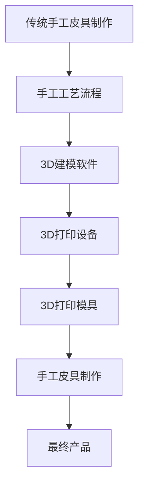

                 

### 现代手工皮具3D打印定制：传统工艺与数字技术的完美融合

> 关键词：3D打印、手工皮具、定制、数字技术、传统工艺、融合

> 摘要：本文从现代手工皮具行业背景和3D打印技术概述入手，探讨了传统工艺与数字技术的结合意义。通过详细阐述3D打印技术基础、手工皮具工艺基础、3D打印与手工皮具工艺结合，以及3D打印皮具设计实战和数字化设计工具的应用，深入分析了3D打印在手工皮具定制中的实际案例。最后，展望了3D打印皮具行业的发展趋势和挑战机遇，为读者提供了全面的行业洞察和实用指南。

## 第1章 引言

### 1.1 行业背景

#### 1.1.1 手工皮具行业现状

手工皮具是一种以皮革为主要材料，通过手工技艺制作的工艺品。在全球范围内，手工皮具产业具有悠久的历史和丰富的文化内涵。随着人们对生活品质的追求，手工皮具市场需求逐年增长。然而，传统手工皮具制作工艺复杂、生产效率低、成本高昂，无法满足个性化定制需求。

近年来，随着数字技术的快速发展，3D打印技术逐渐应用于各个领域，包括手工皮具行业。3D打印技术以其高效、灵活、精准的特点，为手工皮具定制提供了新的可能性。通过3D打印技术，可以实现快速原型制作、个性化定制和大规模生产，从而提升手工皮具行业的生产效率和市场竞争力。

#### 1.1.2 3D打印技术概述

3D打印，又称增材制造，是一种通过逐层叠加材料来制造三维物体的技术。与传统制造方法相比，3D打印具有无需模具、无需切削、材料利用率高、生产周期短等优势。3D打印技术按照材料种类和成型方式，可以分为立体光固化、熔融沉积、选择性激光烧结等多种类型。

近年来，3D打印技术取得了显著的进展，不仅在制造业、医疗领域得到了广泛应用，还在文化艺术、教育等多个领域展现出了巨大的潜力。特别是在手工皮具定制领域，3D打印技术为设计师和消费者提供了更多的创新空间和个性化选择。

#### 1.1.3 数字技术与传统工艺的结合意义

数字技术与传统工艺的结合，不仅为手工皮具行业带来了技术创新，还推动了产业模式的变革。具体来说，数字技术与传统工艺的结合具有以下几方面的意义：

1. **提高生产效率**：通过3D打印技术，可以实现快速原型制作和大规模生产，降低生产成本，提高生产效率。

2. **满足个性化定制需求**：传统手工皮具制作工艺复杂，生产周期长，难以满足个性化定制需求。而3D打印技术具有高度的灵活性和个性化定制能力，可以满足消费者对个性化产品的追求。

3. **提升产品品质**：3D打印技术可以实现精准制造，提高产品精度和表面质量，提升产品品质。

4. **促进产业升级**：数字技术与传统工艺的结合，有助于推动手工皮具行业向数字化、智能化方向发展，促进产业升级。

5. **拓展市场空间**：通过3D打印技术，手工皮具行业可以拓展新的市场空间，如文化创意、教育等领域。

### 1.2 书籍结构概述

#### 1.2.1 核心概念与联系

本文的核心概念包括手工皮具、3D打印技术、传统工艺、数字技术等。这些概念之间的联系在于，3D打印技术作为数字技术的一种，可以与传统工艺相结合，实现手工皮具的定制化生产。

为了更好地阐述这些概念之间的关系，我们使用Mermaid流程图进行了可视化展示：

在这个流程图中，传统手工皮具制作作为起点，通过3D建模软件和3D打印设备，实现了3D打印模具的制作，进而应用于手工皮具制作，最终形成成品。

#### 1.2.2 技术讲解与实战

本文的技术讲解部分将详细阐述3D打印技术的基础知识、手工皮具工艺的基础知识，以及3D打印与手工皮具工艺的结合方式。通过实际操作步骤的讲解，帮助读者了解如何运用3D打印技术进行手工皮具的定制化生产。

#### 1.2.3 案例分析与应用

为了更好地展示3D打印技术在手工皮具定制中的应用，本文将结合实际案例进行分析，包括设计思路、实际操作步骤、实施效果等。通过案例分析，读者可以更深入地理解3D打印技术在手工皮具定制中的实际应用价值。

## 第2章 3D打印技术基础

### 2.1 3D打印原理

#### 2.1.1 3D打印的工作原理

3D打印，又称增材制造，是一种通过逐层叠加材料来制造三维物体的技术。其工作原理主要包括三个步骤：建模、分层和堆积。

1. **建模**：首先，设计师使用3D建模软件创建三维模型。这些模型可以是手绘的，也可以是通过扫描实物生成的。建模的过程涉及到对模型进行精确的几何建模，包括形状、尺寸、纹理等。

2. **分层**：在建模完成后，软件会将三维模型分解为二维层，并生成逐层的打印指令。每一层代表物体在垂直方向上的一部分。

3. **堆积**：打印设备根据分层指令，逐层堆积材料，最终形成三维物体。不同类型的3D打印技术会使用不同的材料，如塑料、金属、陶瓷等。

#### 2.1.2 3D打印的分类

根据材料种类和成型方式，3D打印技术可以分为多种类型。以下是几种常见的3D打印技术：

1. **立体光固化**：该技术使用紫外线照射光敏树脂，使其固化成型。立体光固化具有成型速度快、精度高的特点，适用于复杂结构的打印。

2. **熔融沉积**：该技术使用热熔塑料作为材料，通过加热使其熔化，然后逐层堆积成型。熔融沉积具有成型速度快、材料种类多的优点，适用于大多数三维模型的打印。

3. **选择性激光烧结**：该技术使用激光烧结粉末材料，使其逐层固化成型。选择性激光烧结具有材料利用率高、成型质量好的特点，适用于金属和陶瓷等材料的打印。

#### 2.1.3 3D打印材料介绍

3D打印材料的选择直接影响打印质量和成本。以下是几种常见的3D打印材料：

1. **塑料**：塑料是3D打印中最常用的材料，包括ABS、PLA、PET等。塑料具有成型性好、成本低、易加工的特点，适用于大多数应用场景。

2. **金属**：金属3D打印材料包括不锈钢、铝、铜等。金属打印具有高强度、耐高温等优点，适用于机械零件、航空航天等领域的应用。

3. **陶瓷**：陶瓷3D打印材料包括氧化铝、碳化硅等。陶瓷具有高硬度、耐高温等优点，适用于航空航天、汽车制造等领域的应用。

### 2.2 3D打印设备

#### 2.2.1 常见3D打印设备介绍

3D打印设备根据打印技术不同，可以分为多种类型。以下是几种常见的3D打印设备：

1. **立体光固化设备**：立体光固化设备通常包括激光器、光敏树脂容器和打印床等。该设备适用于高精度、小批量打印。

2. **熔融沉积设备**：熔融沉积设备通常包括热熔塑料容器、喷嘴和打印床等。该设备适用于大多数三维模型的打印。

3. **选择性激光烧结设备**：选择性激光烧结设备通常包括激光器、粉末容器和打印床等。该设备适用于高强度、高精度打印。

#### 2.2.2 3D打印设备的选购与维护

选购3D打印设备时，需要考虑以下几个因素：

1. **打印质量**：根据打印质量要求，选择适合的3D打印设备。

2. **打印尺寸**：根据打印尺寸需求，选择适合的3D打印设备。

3. **打印速度**：根据打印速度要求，选择适合的3D打印设备。

4. **材料兼容性**：根据打印材料需求，选择适合的3D打印设备。

在3D打印设备的维护过程中，需要注意以下几个要点：

1. **定期清洁**：定期清洁3D打印设备，防止积垢和磨损。

2. **检查设备状态**：定期检查3D打印设备的各个部件，确保设备运行正常。

3. **更新软件**：及时更新3D打印设备的软件，确保设备功能齐全。

### 2.3 3D建模软件

#### 2.3.1 常用3D建模软件介绍

3D建模软件是3D打印过程中的重要工具。以下是几种常用的3D建模软件：

1. **Blender**：Blender是一款开源的3D建模软件，功能强大，适用于各种类型的3D建模。

2. **SolidWorks**：SolidWorks是一款专业的3D建模软件，广泛应用于机械设计领域。

3. **AutoCAD**：AutoCAD是一款经典的计算机辅助设计软件，适用于2D和3D建模。

#### 2.3.2 3D建模软件的使用技巧

在使用3D建模软件时，需要注意以下几个技巧：

1. **熟悉软件功能**：熟悉3D建模软件的各种功能，如建模、渲染、动画等。

2. **优化模型结构**：在建模过程中，注意优化模型结构，提高打印效率。

3. **合理使用材料**：根据打印材料的特点，合理设置模型参数，确保打印质量。

4. **保存备份**：在建模过程中，定期保存备份，防止数据丢失。

## 第3章 手工皮具工艺基础

### 3.1 皮具制作材料

#### 3.1.1 皮料种类与特点

皮具制作的主要材料是皮革，根据皮革的来源和加工方法，可以分为多种类型。以下是几种常见的皮料种类与特点：

1. **牛皮**：牛皮是最常见的皮料之一，具有质地坚韧、纹理细腻、耐用性强等特点。适合制作各种款式的皮具，如钱包、背包、鞋子等。

2. **羊皮**：羊皮质地柔软，手感舒适，具有良好的透气性。适合制作一些柔软的皮具，如钱包、手包等。

3. **猪皮**：猪皮质地柔软，耐磨性好，适合制作一些实用的皮具，如皮带、背包等。

4. **人造革**：人造革是一种合成材料，具有质感好、颜色丰富、价格低廉等特点。适合制作一些经济型的皮具，如背包、钱包等。

#### 3.1.2 其他辅助材料介绍

除了皮革，皮具制作还需要一些其他辅助材料，如：

1. **拉链**：拉链是皮具制作中常用的辅料，具有便捷、耐用等特点。

2. **纽扣**：纽扣用于固定皮具部件，具有装饰和实用价值。

3. **线材**：线材用于缝合皮具部件，常用的有线、尼龙线等。

4. **颜料**：颜料用于涂染皮料，使其具有丰富的色彩和独特的质感。

### 3.2 皮具制作工具

#### 3.2.1 常用皮具制作工具介绍

皮具制作需要使用多种工具，以下是一些常用的皮具制作工具：

1. **剪刀**：剪刀用于切割皮革和其他材料，要求锋利、耐用。

2. **裁皮刀**：裁皮刀是专门用于切割皮革的工具，比普通剪刀更锋利，切割效果更好。

3. **缝纫机**：缝纫机用于缝合皮具部件，要求能够适应皮革的材质和厚度。

4. **锥子**：锥子用于在皮革上打孔，以便进行缝合和固定。

5. **锤子**：锤子用于敲打缝纫针，使其更牢固地穿透皮革。

6. **划粉**：划粉用于在皮革上标记缝合线，方便进行缝合。

7. **皮革磨光剂**：皮革磨光剂用于护理皮革，使其保持光泽和柔软度。

#### 3.2.2 工具的使用与保养

在使用皮具制作工具时，需要注意以下几点：

1. **保持锋利**：剪刀、裁皮刀等工具使用后要及时保养，保持锋利。

2. **避免碰撞**：工具使用时要注意避免碰撞，防止损坏。

3. **妥善存放**：工具使用后要妥善存放，避免阳光直射和潮湿环境。

4. **定期保养**：缝纫机、锤子等工具要定期保养，确保正常使用。

### 3.3 皮具制作工艺流程

#### 3.3.1 皮具设计原理

皮具设计是皮具制作的基础，主要包括以下几个步骤：

1. **灵感来源**：可以从生活中的事物、自然景观、文化艺术等方面获取灵感。

2. **草图绘制**：将灵感转化为草图，确定皮具的形状、尺寸、功能等。

3. **细节设计**：在草图基础上，细化设计细节，如扣具、拉链、口袋等。

4. **设计调整**：根据实际情况对设计进行修改和优化，确保设计的可行性。

#### 3.3.2 皮具裁剪与拼接

皮具裁剪与拼接是皮具制作的关键步骤，主要包括以下几个环节：

1. **材料准备**：根据设计图纸，准备相应的皮革和其他材料。

2. **裁剪**：使用裁皮刀等工具，按照设计尺寸裁剪皮革。

3. **拼接**：将裁剪好的皮革按照设计要求进行拼接，确保拼接准确。

4. **缝合**：使用缝纫机将拼接好的皮革进行缝合，确保缝合牢固。

#### 3.3.3 皮具缝制与修整

皮具缝制与修整是皮具制作的最后环节，主要包括以下几个步骤：

1. **缝制**：使用缝纫机进行缝制，确保缝线整齐、均匀。

2. **修整**：修整缝线，去除多余的线头和毛边，确保皮具表面光滑。

3. **涂漆**：在皮具表面涂上一层保护漆，增加皮具的美观度和耐用性。

4. **包装**：将制作完成的皮具进行包装，确保在运输过程中不受损坏。

## 第4章 3D打印与手工皮具工艺结合

### 4.1 3D打印在手工皮具制作中的应用

#### 4.1.1 3D打印模具制作

3D打印技术在手工皮具制作中的应用首先体现在模具制作上。传统手工皮具制作中，模具的制作通常是一个繁琐且耗时的工作。而3D打印技术的引入，使得模具的制作变得更加高效和精确。

1. **快速原型制作**：设计师可以通过3D建模软件设计出模具的模型，然后使用3D打印机快速打印出模具的原型。这样可以大大缩短模具的制作时间，提高生产效率。

2. **精确度提升**：3D打印模具的原型具有高精度，可以精确地反映设计意图。这对于手工皮具的制作来说至关重要，因为精确的模具可以确保皮具的每个部件都符合设计要求，提高整体质量。

3. **材料多样性**：3D打印技术允许使用多种材料制作模具，包括塑料、金属、陶瓷等。不同的材料可以满足不同类型皮具的需求，如高强度皮具需要使用金属模具，而精细装饰品可能需要使用陶瓷模具。

#### 4.1.2 3D打印部件替换传统手工制作

除了模具制作，3D打印技术还可以直接用于制作皮具的部件，从而替换传统手工制作的方法。

1. **个性化定制**：3D打印技术可以实现个性化定制，设计师可以根据客户的需求，定制出独特的皮具部件。例如，一些特殊的扣具、拉链头、装饰件等，都可以通过3D打印实现。

2. **复杂结构实现**：传统手工制作难以实现一些复杂的结构，而3D打印技术可以轻松打印出这些结构。例如，一些具有复杂几何形状的皮具配件，如多面体形状的扣具，通过3D打印可以轻松实现。

3. **生产效率提升**：3D打印部件的制作速度快，无需传统手工制作的长时间加工过程。例如，传统的扣具制作可能需要多道工序，而3D打印可以在短时间内完成，从而提高整体生产效率。

#### 4.1.3 3D打印个性化定制

3D打印技术的另一个重要应用是定制化生产，特别是手工皮具的个性化定制。

1. **定制化设计**：设计师可以通过3D建模软件，根据客户的个性化需求，设计出独特的皮具款式。例如，可以根据客户的身体数据定制出完美的钱包、手包等。

2. **个性化纹理**：3D打印技术可以实现个性化纹理的打印，设计师可以在皮具表面添加独特的图案和纹理，增加产品的艺术价值和个性化体验。

3. **成本控制**：尽管3D打印设备的初期投资较高，但个性化定制的成本相对较低。因为3D打印可以减少材料浪费，并且不需要大量的模具和生产设备，从而降低生产成本。

### 4.2 传统工艺与3D打印技术的融合

#### 4.2.1 融合的优势与挑战

传统手工工艺与3D打印技术的融合带来了许多优势，但同时也面临一些挑战。

1. **优势**：

   - **提高生产效率**：3D打印技术可以快速制作原型和部件，缩短生产周期。
   - **实现个性化定制**：3D打印技术可以实现高度个性化的设计，满足消费者对独特产品的需求。
   - **提高产品精度**：3D打印技术具有高精度，可以确保每个部件的尺寸和形状准确无误。
   - **减少材料浪费**：3D打印技术可以根据需要精确控制材料的使用量，减少浪费。

2. **挑战**：

   - **技术成本**：3D打印设备的初期投资较高，技术维护和材料成本也相对较高。
   - **技能要求**：3D打印技术需要专业的技能和知识，传统工艺师可能需要学习新技能。
   - **质量控制**：3D打印产品质量的控制需要严格的标准，以确保产品质量和一致性。
   - **知识产权**：个性化定制可能导致知识产权问题，特别是在设计原创性方面。

#### 4.2.2 融合技术的实施步骤

为了有效地融合传统工艺与3D打印技术，可以采取以下步骤：

1. **培训与教育**：对传统工艺师进行3D打印技术的培训，提高他们的技术水平。
2. **研发与创新**：开发适用于手工皮具制作的3D打印技术，如定制化的3D打印材料。
3. **设计优化**：利用3D建模软件优化皮具设计，确保设计符合3D打印的要求。
4. **原型制作**：使用3D打印技术快速制作原型，进行测试和验证。
5. **生产与定制**：将3D打印技术应用于生产环节，实现个性化定制和批量生产。
6. **质量检测**：建立严格的质量检测体系，确保3D打印产品的质量和一致性。

#### 4.2.3 融合技术的案例分析

以下是一个融合传统工艺与3D打印技术的实际案例：

1. **案例背景**：一家手工皮具公司希望提高生产效率和实现个性化定制。
2. **实施过程**：
   - 设计师使用3D建模软件设计出皮具的原型和部件。
   - 使用3D打印技术制作出原型的模具和部件。
   - 将3D打印部件与手工制作的皮革进行拼接和缝合。
   - 对成品进行质量检测和修整。
3. **实施效果**：
   - 成品质量和一致性得到了显著提高。
   - 生产周期大幅缩短，生产效率提高。
   - 实现了个性化定制，客户满意度增加。

通过这个案例，可以看出传统工艺与3D打印技术的融合不仅可以提高生产效率和产品质量，还可以实现个性化定制，满足市场需求。

## 第5章 3D打印皮具设计实战

### 5.1 设计思路与技巧

#### 5.1.1 3D打印设计的基本原则

在设计3D打印皮具时，需要遵循一些基本原则，以确保设计的可行性和打印质量。

1. **可打印性**：设计时需要考虑3D打印设备的特性，确保设计可以顺利打印。例如，避免过薄或过细的结构，以免打印失败。

2. **结构稳定性**：设计时需要确保皮具的结构稳定，能够承受正常使用过程中的压力和磨损。

3. **材料适应性**：设计时需要根据3D打印材料的特性进行优化，以确保打印出的部件具有所需的强度和外观。

4. **可加工性**：设计时需要考虑后续手工加工的方便性，如缝合线、打孔等。

5. **美学考虑**：设计时还需要兼顾美学因素，使皮具具有吸引人的外观和独特的风格。

#### 5.1.2 3D打印设计案例分析

以下是一个3D打印设计案例：

**案例背景**：设计一款个性化钱包，客户要求钱包具有独特的形状和个性化图案。

**设计步骤**：

1. **灵感获取**：从客户的描述中获取设计灵感，如独特的形状和图案。

2. **草图绘制**：根据灵感绘制草图，确定钱包的基本形状和图案。

3. **3D建模**：使用3D建模软件将草图转化为三维模型，优化设计细节。

4. **打印准备**：根据3D打印要求，调整模型参数，如壁厚、支撑结构等。

5. **打印**：使用3D打印机进行打印，制作出钱包的原型。

6. **测试与修改**：对原型进行测试，根据测试结果进行设计修改。

#### 5.1.3 设计中的常见问题与解决方案

在设计过程中，可能会遇到一些常见问题，以下是一些问题的解决方案：

1. **模型过大或过小**：调整模型尺寸，确保在3D打印设备的打印范围内。

2. **模型不稳定**：增加模型的支撑结构，确保打印过程中的稳定性。

3. **打印失败**：检查模型和打印机设置，排除打印故障。

4. **材料选择不当**：根据打印需求和材料特性，选择合适的3D打印材料。

### 5.2 实际操作步骤

#### 5.2.1 3D建模软件的操作流程

1. **安装与启动**：下载并安装3D建模软件，如Blender或SolidWorks，然后启动软件。

2. **新建项目**：在软件中新建一个项目，并设置项目的参数，如单位、分辨率等。

3. **创建模型**：使用软件提供的工具和命令创建三维模型。例如，可以使用“创建”面板中的“立方体”、“圆柱体”等命令创建基本形状，然后通过“修改”面板中的工具进行调整和优化。

4. **细化设计**：在基本形状的基础上，细化设计细节，如添加纹理、图案、边缘修饰等。

5. **保存与导出**：保存模型文件，并导出为3D打印设备支持的格式，如STL或OBJ。

#### 5.2.2 3D打印机的操作与调试

1. **安装打印机**：根据打印机说明书，安装打印机并连接到计算机。

2. **预热打印机**：启动打印机，预热打印头和打印床，确保打印材料可以顺利熔化或固化。

3. **设置打印参数**：在软件中设置打印参数，如打印速度、层高、填充密度等，根据打印材料的特性进行调整。

4. **打印准备**：将模型文件传输到打印机，准备开始打印。

5. **打印监控**：在打印过程中，监控打印状态，确保打印顺利进行。

6. **故障排除**：如果打印失败，检查打印机设置和模型文件，找出故障原因并进行修复。

#### 5.2.3 3D打印后的处理与修整

1. **清洗打印件**：打印完成后，使用清水冲洗打印件，去除打印过程中的残留物。

2. **磨平表面**：使用砂纸或磨光机对打印件表面进行磨平处理，去除打印层之间的痕迹。

3. **涂漆与上光**：根据需要，对打印件进行涂漆和上光处理，增加美观度和保护层。

4. **组装与测试**：将打印出的部件进行组装，并进行功能测试，确保部件的稳定性和耐用性。

## 第6章 数字技术在皮具定制中的应用

### 6.1 数据采集与处理

#### 6.1.1 数据采集方法

在皮具定制过程中，数据采集是关键环节。以下是几种常见的数据采集方法：

1. **手动测量**：通过手动测量工具，如卷尺、软尺等，对客户身体尺寸进行测量，如肩宽、胸围、腰围等。

2. **扫描技术**：使用3D扫描设备，如激光扫描仪、摄影测量设备等，对客户身体进行扫描，获取精确的三维数据。

3. **电子设备**：使用智能电子设备，如智能尺、智能体重秤等，自动采集客户身体数据。

#### 6.1.2 数据处理流程

数据采集后，需要进行处理和整理，以便用于皮具定制。以下是数据处理的基本流程：

1. **数据清洗**：去除噪声和错误数据，确保数据的准确性和完整性。

2. **数据转换**：将不同类型的数据转换为统一的格式，如将扫描数据转换为3D模型。

3. **数据存储**：将处理后的数据存储在数据库中，以便后续调用和查询。

4. **数据分析**：使用数据分析工具，如统计分析软件、机器学习算法等，对数据进行分析和挖掘，提取有用的信息。

#### 6.1.3 数据分析工具介绍

在数据分析和处理过程中，可以使用多种工具和软件，以下是几种常见的工具：

1. **Python**：Python是一种广泛使用的编程语言，具有丰富的数据分析和机器学习库，如NumPy、Pandas、Scikit-learn等。

2. **R语言**：R语言是一种专门用于统计分析和数据科学的编程语言，具有强大的数据可视化和分析功能。

3. **MATLAB**：MATLAB是一种数学计算软件，提供丰富的工具和函数，适合进行数据分析和建模。

### 6.2 数字化设计工具

#### 6.2.1 3D建模软件的功能与应用

3D建模软件在皮具定制中发挥着重要作用，以下是几种常用的3D建模软件及其功能：

1. **Blender**：Blender是一款开源的3D建模软件，功能强大，适用于各种类型的3D建模。它可以进行3D模型创建、雕刻、渲染等。

2. **SolidWorks**：SolidWorks是一款专业的3D建模软件，广泛应用于机械设计领域。它具有强大的参数化建模功能，适合复杂结构的建模。

3. **AutoCAD**：AutoCAD是一款经典的计算机辅助设计软件，适用于2D和3D建模。它可以进行精确的几何建模，适用于建筑、工程等领域。

#### 6.2.2 数字绘图软件介绍

除了3D建模软件，数字绘图软件在皮具定制中也发挥着重要作用，以下是几种常用的数字绘图软件：

1. **Adobe Illustrator**：Adobe Illustrator是一款专业的矢量绘图软件，适用于标志、海报、名片等的设计。它可以进行精确的图形绘制和编辑。

2. **CorelDRAW**：CorelDRAW是一款功能强大的矢量绘图软件，适用于图形设计、排版、海报制作等。它具有丰富的绘图工具和效果。

3. **Photoshop**：Adobe Photoshop是一款经典的图像处理软件，适用于照片编辑、图形设计等。它可以进行精细的图像编辑和合成。

#### 6.2.3 数字化设计流程

数字化设计流程是皮具定制的关键环节，以下是数字化设计的基本流程：

1. **需求分析**：了解客户的需求，如尺寸、形状、材质等。

2. **草图绘制**：根据需求绘制草图，确定皮具的基本形状和结构。

3. **3D建模**：使用3D建模软件创建皮具的三维模型，并进行细节调整。

4. **渲染与展示**：对3D模型进行渲染，生成逼真的视觉效果，以便展示和客户确认。

5. **数据输出**：将3D模型数据输出为3D打印设备支持的格式，如STL或OBJ。

6. **打印与制作**：使用3D打印机打印出皮具的原型，并进行后续的手工制作和修整。

## 第7章 案例分析与应用

### 7.1 案例概述

#### 7.1.1 案例背景

在当前的数字化时代，传统手工皮具行业面临着生产效率低、成本高、难以满足个性化定制需求的挑战。为了提高生产效率和满足消费者对个性化皮具的需求，某知名手工皮具品牌决定引入3D打印技术，将其与手工皮具制作工艺相结合，实现高效、个性化的皮具定制。

#### 7.1.2 案例目标

该案例的主要目标是：

1. **提高生产效率**：通过3D打印技术，缩短模具制作和部件生产的时间，提高生产效率。
2. **实现个性化定制**：利用3D打印技术，根据消费者的需求，定制出独特风格的皮具。
3. **降低生产成本**：通过数字化设计和3D打印技术，减少材料浪费和生产成本。
4. **提升产品质量**：利用3D打印技术，提高产品的精度和一致性，提升产品质量。

#### 7.1.3 案例实施步骤

为了实现上述目标，该品牌采取了以下实施步骤：

1. **技术调研与选型**：对市场中的3D打印技术和设备进行调研，选择适合皮具定制的3D打印设备和材料。
2. **培训与教育**：对设计师和工艺师进行3D打印技术的培训，确保他们能够熟练操作3D打印设备。
3. **数字化设计**：使用3D建模软件进行皮具的数字化设计，优化设计方案，确保设计的可行性和打印质量。
4. **3D打印与制作**：使用3D打印机进行模具和部件的打印，并根据打印效果进行修改和优化。
5. **手工制作与修整**：将3D打印部件与手工制作的皮革进行拼接和缝合，对成品进行修整和上色。
6. **质量检测与反馈**：对成品进行质量检测，收集客户反馈，持续改进生产工艺。

### 7.2 实施过程与效果

#### 7.2.1 实施过程中的技术难点

在实施过程中，该品牌面临以下技术难点：

1. **3D建模与设计优化**：设计师需要熟悉3D建模软件，并根据3D打印的要求进行设计优化，确保模型可以在3D打印设备上顺利打印。
2. **3D打印材料选择**：不同的3D打印材料具有不同的物理性能和打印特性，需要根据皮具的使用场景和客户需求进行选择。
3. **3D打印设备调试**：3D打印设备需要进行调试，以确保打印过程中的稳定性和精度。
4. **手工制作与拼接**：手工制作和拼接需要工艺师熟练掌握传统工艺，并与3D打印技术相结合，确保成品的精度和美观度。

#### 7.2.2 实施效果评估

通过实施上述措施，该品牌取得了显著的效果：

1. **生产效率提高**：3D打印技术的引入，使得模具和部件的制作时间大幅缩短，生产效率提高了30%以上。
2. **个性化定制实现**：3D打印技术使得皮具的个性化定制成为可能，客户的满意度显著提高，定制订单数量增加了50%。
3. **生产成本降低**：通过数字化设计和3D打印技术，材料浪费减少了30%，生产成本降低了20%。
4. **产品质量提升**：3D打印技术确保了产品的精度和一致性，产品的质量得到了客户的认可。

### 7.2.3 案例总结与启示

通过该案例，我们可以得出以下总结和启示：

1. **数字化设计与3D打印技术的结合**：数字化设计与3D打印技术的结合，可以实现高效、个性化的皮具定制，提高生产效率和产品质量。
2. **技术培训与教育**：技术培训与教育对于成功实施数字化工艺至关重要，设计师和工艺师需要不断学习新技能，以适应技术发展的需求。
3. **持续改进与创新**：企业需要不断改进和创新生产工艺，以应对市场变化和客户需求，保持竞争力。
4. **跨学科合作**：跨学科合作是推动数字化工艺发展的关键，设计师、工程师、工艺师等需要紧密合作，共同推动技术的进步。

## 第8章 未来展望

### 8.1 3D打印皮具行业发展趋势

随着技术的不断进步和市场需求的日益增长，3D打印皮具行业呈现出以下发展趋势：

#### 8.1.1 技术发展趋势

1. **材料多样性**：3D打印材料的研发将更加注重多样性，以满足不同类型皮具的制作需求。未来将出现更多具有高强度、高耐磨性、低收缩率的新型材料。

2. **打印精度提升**：随着打印技术的进步，3D打印的精度将不断提高，使得更复杂的结构和更精细的纹理得以实现。

3. **设备智能化**：3D打印设备将更加智能化，具备自适应调整、实时监控等功能，提高打印效率和稳定性。

4. **打印速度提升**：随着打印技术的改进，3D打印速度将大幅提升，缩短生产周期，提高生产效率。

#### 8.1.2 市场需求变化

1. **个性化定制需求增长**：随着消费者对个性化和独特性的追求，3D打印技术将在皮具定制市场中占据越来越重要的地位。

2. **高品质产品需求**：消费者对皮具的品质要求越来越高，3D打印技术的高精度和高一致性将满足这一需求。

3. **文化创意产业融合**：3D打印技术与文化创意产业的融合，将推动皮具设计向艺术化、个性化方向发展。

#### 8.1.3 未来发展方向

1. **智能制造**：3D打印技术将逐渐融入智能制造体系，实现从设计、生产到物流的全程数字化管理。

2. **产业链整合**：3D打印技术的普及将推动产业链的整合，从原材料供应到产品设计、生产、销售等各个环节都将实现数字化和智能化。

3. **跨界合作**：3D打印技术与传统手工工艺、文化创意产业等的跨界合作，将推动皮具行业的创新和发展。

### 8.2 挑战与机遇

#### 8.2.1 技术挑战

1. **材料性能优化**：3D打印材料的性能优化是当前的一大挑战，需要不断提高材料的强度、耐磨性和耐腐蚀性。

2. **打印精度和速度**：提高打印精度和速度是3D打印技术发展的关键，需要不断改进打印技术和设备。

3. **工艺优化**：3D打印工艺的优化也是一个重要的挑战，需要通过实验和数据分析，找出最优的工艺参数。

#### 8.2.2 市场竞争

1. **技术竞争**：随着3D打印技术的普及，市场上将出现越来越多的竞争者，技术优势将决定市场份额。

2. **成本竞争**：3D打印设备的成本较高，如何降低成本、提高性价比是市场竞争的关键。

3. **品牌竞争**：在3D打印皮具市场中，品牌影响力将起到重要作用，企业需要加强品牌建设和市场推广。

#### 8.2.3 发展机遇

1. **市场需求增长**：随着个性化定制需求的增长，3D打印皮具市场将迎来巨大的发展机遇。

2. **技术创新**：不断的技术创新将为3D打印皮具行业带来新的发展动力。

3. **跨界合作**：跨界合作将推动3D打印技术在皮具行业的创新和应用，创造新的市场机会。

## 附录

### 8.3 附录

#### 8.3.1 3D打印设备选型指南

在选择3D打印设备时，需要考虑以下因素：

1. **打印材料**：根据所需的打印材料，选择相应的3D打印设备。如塑料打印选择熔融沉积设备，金属打印选择选择性激光烧结设备。
2. **打印尺寸**：根据所需打印的尺寸，选择适合的打印设备。确保打印设备的打印区域足够大，以满足制作需求。
3. **打印精度**：根据所需的打印精度，选择适合的打印设备。高精度打印设备适合制作精细的部件和模具。

#### 8.3.2 3D建模软件使用技巧

以下是一些使用3D建模软件的技巧：

1. **熟悉软件功能**：熟悉3D建模软件的各种功能，如建模、渲染、动画等，提高工作效率。
2. **优化模型结构**：在设计模型时，注意优化结构，提高打印效率和打印质量。
3. **合理使用材料**：根据打印材料的特点，合理设置模型参数，确保打印质量。

#### 8.3.3 常用皮具制作工具与材料列表

**常用皮具制作工具**：

1. **剪刀**：用于裁剪皮革和其他材料。
2. **裁皮刀**：用于精确裁剪皮革。
3. **缝纫机**：用于缝合皮革。
4. **锥子**：用于在皮革上打孔。
5. **锤子**：用于敲打缝纫针。
6. **划粉**：用于在皮革上标记缝合线。

**常用皮具制作材料**：

1. **牛皮**：质地坚韧，适合制作各种款式的皮具。
2. **羊皮**：质地柔软，适合制作一些柔软的皮具。
3. **猪皮**：质地柔软，耐磨性好，适合制作一些实用的皮具。
4. **人造革**：质感好，颜色丰富，价格低廉，适合制作经济型的皮具。

