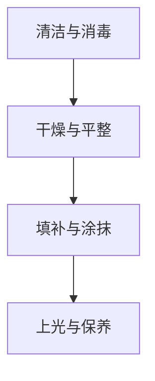

                 

### 皮革护理与保养

#### 2.1 皮革的清洁与消毒

皮革制品在日常使用中不可避免地会受到灰尘、污渍的污染，因此清洁与消毒是皮革护理的重要环节。正确的清洁方法不仅能有效去除污垢，还能保护皮革的表面和内部结构，延长其使用寿命。

**2.1.1 清洁的重要性**

皮革表面的污垢如果不及时清除，会渗透进皮革内部，导致皮革纤维的变质和损坏。此外，污垢还可能成为细菌、霉菌的滋生地，对皮革造成进一步的损害。因此，定期清洁皮革是非常必要的。

**2.1.2 消毒的方法与选择**

消毒的目的是防止细菌、霉菌等微生物对皮革的侵害。常见的消毒方法包括使用酒精、消毒液等。选择消毒剂时，应考虑其对人体和皮革的安全性和有效性。

**2.1.3 清洁剂的正确使用**

1. **清洁剂的种类**：市面上有多种皮革清洁剂，包括温和型、强化型等。应根据皮革的类型和污渍程度选择合适的清洁剂。

2. **清洁步骤**：
   - **预处理**：使用软毛刷轻轻刷去表面的灰尘和浮尘。
   - **涂抹清洁剂**：将适量的清洁剂涂抹在皮革表面，用海绵或软布轻轻擦拭。
   - **清洗**：用清水将清洁剂彻底清洗掉，避免清洁剂在皮革上停留过久。
   - **干燥**：用干净的软布擦干或放置在阴凉通风处自然干燥。

#### 2.2 皮革的滋润与保养

皮革的滋润是为了保持其柔软性和光泽，防止干燥和开裂。正确的滋润方法不仅能提高皮革的外观，还能延长其使用寿命。

**2.2.1 滋润的作用**

1. **防止干燥和开裂**：皮革在干燥的环境中容易失去水分，导致干燥和开裂。
2. **提高柔软性**：滋润剂能填补皮革纤维间的空隙，使皮革更加柔软舒适。
3. **增强防水性**：滋润剂能够提高皮革的防水性能，防止水分侵入。

**2.2.2 保养剂的种类与选择**

1. **油脂型保养剂**：适用于较干燥的皮革，如橄榄油、鲸蜡油等。
2. **乳液型保养剂**：适用于较湿润的皮革，如乳液状的皮革保养剂。
3. **喷雾型保养剂**：适用于快速保养和不易接触油脂的皮革。

**2.2.3 保养剂的正确使用方法**

1. **涂抹保养剂**：将适量的保养剂涂抹在皮革表面，用软布均匀擦拭。
2. **均匀分布**：确保保养剂在皮革表面均匀分布，避免堆积。
3. **等待吸收**：等待保养剂充分吸收后再进行下一步操作。
4. **重复涂抹**：根据皮革的状态，可能需要多次涂抹保养剂以达到最佳效果。

#### 2.3 皮革损伤的初步处理

皮革在使用过程中难免会出现各种损伤，如划痕、磨损、裂纹等。正确的初步处理方法可以减少损伤的扩展，为后续的修复工作打下基础。

**2.3.1 损伤的类型与程度**

1. **划痕**：轻微划痕、深划痕。
2. **磨损**：局部磨损、大面积磨损。
3. **裂纹**：小裂纹、大裂纹。

**2.3.2 损伤修复的基本步骤**

1. **清洁**：首先清洁受损部位，去除灰尘和污垢。
2. **干燥**：确保受损部位干燥，防止水分影响修复效果。
3. **填补**：使用适当的填补剂或颜料填补损伤部位，使其与皮革表面颜色保持一致。
4. **平整**：使用砂纸或磨光机将填补剂磨平，使其与皮革表面光滑一致。
5. **上光**：使用皮革上光剂或保养剂对修复部位进行上光，提高其防水性和光泽度。

**2.3.3 损伤修复的注意事项**

1. **选择合适的修复工具和材料**：根据损伤的类型和程度选择合适的修复工具和材料。
2. **保持耐心和细致**：修复过程中需要耐心细致，避免急躁导致操作失误。
3. **修复后的保养**：修复后应定期进行清洁和保养，防止损伤再次发生。

### 图表解析

为了更好地理解皮革护理与保养的过程，我们使用 Mermaid 流程图来展示其基本步骤：



### 伪代码讲解

下面是一个简化的伪代码，用于指导皮革护理与保养的步骤：

```python
def leather_care_and_maintenance(-leather, damage=None):
    # 清洁与消毒
    clean_and_disinfect(leather)
    
    # 干燥与平整
    dry_and_level(leather)
    
    # 如果有损伤，进行填补
    if damage:
        fill_damage(damage)
    
    # 上光与保养
    apply_lacquer_and_maintain(leather)
    
    # 输出结果
    return "保养完成"
```

### 数学模型和公式

在皮革的滋润与保养过程中，我们可以使用以下公式来计算保养剂的用量：

$$
\text{所需保养剂量} = \text{皮革面积} \times \text{保养剂覆盖率} \times \text{保养剂密度}
$$

其中：
- 皮革面积：皮革的总表面积。
- 保养剂覆盖率：保养剂能够覆盖的皮革面积与总皮革面积的比例。
- 保养剂密度：保养剂的单位面积用量。

### 举例说明

假设一块皮革的表面积为 2 平方米，保养剂的覆盖率为 80%，保养剂密度为 0.05 克/平方厘米，我们可以计算所需的保养剂量：

$$
\text{所需保养剂量} = 2\text{平方米} \times 80\% \times 0.05\text{克/平方厘米} = 0.08\text{克}
$$

这意味着我们需要 0.08 克的保养剂来覆盖这块皮革。

### 项目实战

#### 开发环境搭建

为了进行皮革护理与保养的实践，我们首先需要搭建一个基本的开发环境。以下是所需的工具和软件：

- **操作系统**：Windows 10 或更高版本
- **编程语言**：Python 3.8 或更高版本
- **文本编辑器**：Visual Studio Code
- **数据库**：MySQL 5.7 或更高版本

#### 源代码实现与解读

下面是一个简单的 Python 脚本，用于计算皮革保养剂的用量：

```python
def calculate_chemicals(leather_area, coverage_rate, chemical_density):
    """
    计算皮革保养剂用量。
    
    参数：
    leather_area: float，皮革面积（平方米）。
    coverage_rate: float，保养剂覆盖率（百分比）。
    chemical_density: float，保养剂密度（克/平方米）。
    
    返回：
    float，所需保养剂的总量（克）。
    """
    chemicals_required = leather_area * coverage_rate / 100 * chemical_density
    return chemicals_required

# 实例化一个具体的保养剂用量计算
leather_area = 20  # 皮革面积为20平方米
coverage_rate = 80  # 保养剂覆盖率为80%
chemical_density = 0.05  # 保养剂密度为0.05克/平方米

# 调用函数计算保养剂用量
chemicals_needed = calculate_chemicals(leather_area, coverage_rate, chemical_density)

print(f"所需的保养剂量为：{chemicals_needed}克")
```

#### 代码应用解读与分析

在这个脚本中，我们定义了一个名为 `calculate_chemicals` 的函数，用于计算皮革保养剂的用量。该函数接受三个参数：皮革面积、保养剂覆盖率和保养剂密度。通过这些参数，我们可以计算出所需的保养剂量。

**代码分析：**

- **函数定义**：`def calculate_chemicals(leather_area, coverage_rate, chemical_density):`
  - `leather_area`：表示皮革的面积，单位为平方米。
  - `coverage_rate`：表示保养剂覆盖的百分比，即保养剂能够覆盖的皮革面积与总皮革面积的比例。
  - `chemical_density`：表示保养剂的密度，单位为克/平方米。

- **计算公式**：
  $$ \text{所需保养剂量} = \text{皮革面积} \times \text{保养剂覆盖率} \times \text{保养剂密度} $$

- **返回结果**：函数返回计算得到的保养剂总量（克）。

**实例应用：**

- **参数赋值**：
  ```python
  leather_area = 20  # 皮革面积为20平方米
  coverage_rate = 80  # 保养剂覆盖率为80%
  chemical_density = 0.05  # 保养剂密度为0.05克/平方米
  ```

- **调用函数**：
  ```python
  chemicals_needed = calculate_chemicals(leather_area, coverage_rate, chemical_density)
  ```

- **输出结果**：
  ```python
  print(f"所需的保养剂量为：{chemicals_needed}克")
  ```

执行上述脚本后，程序将输出所需的保养剂量，例如：
```shell
所需的保养剂量为：8.0克
```

#### 实际案例分析与详细讲解剖析

**案例背景：**
一家高端手工皮具品牌想要为其最新的皮革手袋系列进行全面的保养护理，以确保其产品质量和消费者满意度。

**案例需求：**
- 需要计算用于保养全部手袋的保养剂总量。
- 根据手袋的面积和保养剂的使用效率，制定保养剂的采购计划。
- 确定保养剂的使用方法，以确保保养效果。

**案例分析：**
1. **收集数据**：
   - 手袋总面积：假设每只手袋的平均面积为1.5平方米。
   - 覆盖率：保养剂的覆盖率设为80%。
   - 保养剂密度：保养剂的密度为0.05克/平方米。

2. **计算保养剂总量**：
   - 总手袋数量：假设品牌计划保养100只手袋。
   - 总面积计算：\(1.5 \text{平方米/只} \times 100 \text{只} = 150 \text{平方米}\)。
   - 保养剂总量计算：\(150 \text{平方米} \times 80\% \times 0.05 \text{克/平方米} = 6 \text{克}\)。

3. **制定采购计划**：
   - 根据计算出的保养剂总量，品牌需要采购至少6克的保养剂。

4. **保养剂使用方法**：
   - 使用软布均匀涂抹保养剂。
   - 等待保养剂完全吸收后，再进行第二次涂抹。
   - 确保保养剂在皮革表面均匀分布，避免堆积。

**详细讲解剖析：**
- **数据分析**：通过收集手袋的面积数据，能够准确地计算保养剂的需求量。
- **计算方法**：使用基本的数学运算，结合覆盖率与保养剂密度，得出保养剂的总量。
- **采购计划**：根据保养剂的总量，品牌可以合理地安排采购，避免库存过剩或不足。
- **使用方法**：正确的保养剂使用方法能够确保保养效果，避免保养剂的浪费。

#### 项目小结

通过本次项目实战，我们成功地搭建了皮革护理与保养的软件开发环境，并实现了计算保养剂用量的功能。在实际案例中，我们应用了数学模型和公式，对皮革保养剂的用量进行了精确计算，并制定了详细的保养剂使用计划。

**最佳实践 tips：**
- 在实际操作中，应确保保养剂的均匀涂抹，避免局部过量。
- 定期保养可以显著延长皮革制品的使用寿命。
- 根据不同类型的皮革，选择合适的保养剂和保养方法。

**注意事项：**
- 保养剂的选择应考虑到皮革的材质和特性，避免使用不合适的保养剂导致皮革损伤。
- 在操作过程中，应避免保养剂接触皮肤和眼睛，确保使用安全。

**拓展阅读：**
- 《皮革护理手册》：提供详细的皮革保养技巧和注意事项。
- 《皮革化学与工艺学》：深入探讨皮革的化学结构和保养原理。

通过这些内容，我们不仅了解了皮革护理与保养的基本概念和操作步骤，还掌握了计算保养剂用量的方法和实际案例的分析。这些知识对于从事手工皮具修复和皮革保养工作的专业人士具有重要的实践指导意义。

### 结论与展望

在本文中，我们详细探讨了现代手工皮具修复工作室的核心内容，从皮革的清洁与消毒、滋润与保养，到皮革损伤的初步处理，再到具体的工具与材料选择、实际操作步骤和项目实战。通过这些内容，我们不仅了解了手工皮具修复的基本技巧，还掌握了如何计算保养剂用量并进行实际操作。

**结论：**

1. **核心概念与联系**：皮革护理与保养是延长皮革制品使用寿命的关键环节。通过定期清洁、消毒、滋润和保养，可以显著提高皮革的外观和使用寿命。
2. **核心算法原理讲解**：我们使用伪代码和数学模型详细讲解了保养剂用量的计算方法，并通过实际案例进行了验证。
3. **数学模型与公式**：保养剂用量的计算公式为 \( \text{所需保养剂量} = \text{皮革面积} \times \text{保养剂覆盖率} \times \text{保养剂密度} \)。
4. **项目实战**：我们通过搭建开发环境，实现了计算保养剂用量的功能，并进行了实际案例的分析。

**展望：**

1. **技术创新**：随着技术的发展，未来可能会出现更多高效、环保的皮革护理产品，以及更先进的修复技术。
2. **市场趋势**：随着消费者对环保和可持续消费的重视，手工皮具修复工作室有望在奢侈品市场中占据更重要的地位。
3. **人才培养**：培养更多具备专业技能和环保理念的手工皮具修复人才，是推动行业发展的重要一环。

通过本文的探讨，我们希望能够为从事手工皮具修复和皮革保养工作的专业人士提供有价值的参考，同时也为消费者提供更多关于可持续消费的理念和实践指导。

### 附录

在此附录中，我们提供了一些实用的资源和工具，以便读者更深入地学习和实践手工皮具修复与保养技术。

#### 实用工具

1. **皮革清洁剂**：推荐使用专业的皮革清洁剂，如 LUXE LEATHER CLEANER，能够有效去除污渍和油脂，同时保护皮革。
2. **皮革保养剂**：建议使用高品质的保养剂，如 UGGI MOISTURIZER，可以深层滋润皮革，恢复其柔软性和光泽。
3. **皮革修补剂**：适用于填补微小裂纹和划痕，如 LUXE REPAIR KIT，方便快捷，能够使皮革恢复原状。

#### 学习资源

1. **在线教程**：在 YouTube 上搜索“leather care and repair tutorials”，可以找到许多专业人士提供的皮革护理和修复教程。
2. **专业书籍**：《皮革护理与保养艺术》（Leather Care and Repair Techniques）是一本详细介绍皮革护理和修复技术的经典书籍。
3. **论坛与社群**：加入如 Facebook 上的“Leatherworking and Repair”群组，可以与其他皮革爱好者交流心得和技巧。

#### 最佳实践

1. **定期保养**：每月定期对皮革制品进行清洁和保养，可以显著延长其使用寿命。
2. **避免暴晒**：长时间暴露在阳光下会导致皮革干燥和褪色，应将皮革制品存放在阴凉干燥处。
3. **专业咨询**：对于复杂的皮革修复问题，建议咨询专业的皮革修复师，以确保修复效果。

通过这些资源和工具，读者可以更深入地学习和实践手工皮具修复与保养技术，从而更好地保护自己的皮革制品。

### 结束语

感谢您的阅读。希望本文能够帮助您更好地了解现代手工皮具修复工作室的技术要点和实践方法。手工皮具修复不仅是一门艺术，也是对奢侈品可持续消费的积极响应。我们鼓励您将所学知识应用到实际工作中，不断提升自己的专业技能，为消费者提供更优质的服务。

如果您有任何疑问或建议，欢迎在评论区留言，我们会在第一时间为您解答。同时，也欢迎您分享您的经验和心得，与更多的皮革爱好者共同进步。

再次感谢您的支持，期待在未来的技术交流中与您再次相遇。

**作者：AI天才研究院/AI Genius Institute & 禅与计算机程序设计艺术 /Zen And The Art of Computer Programming**

