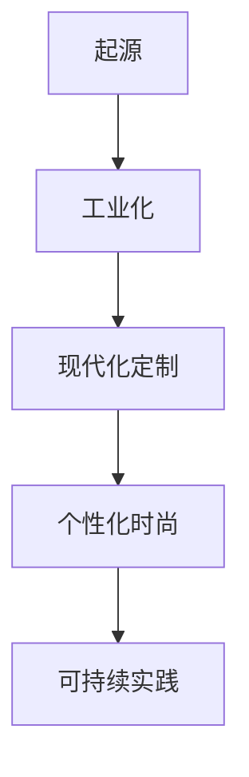
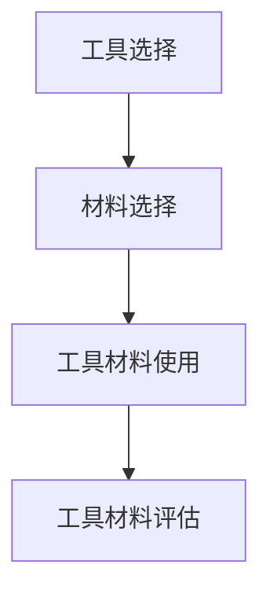
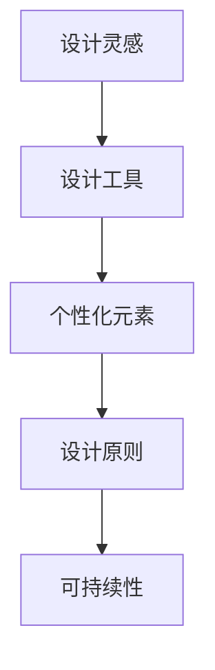
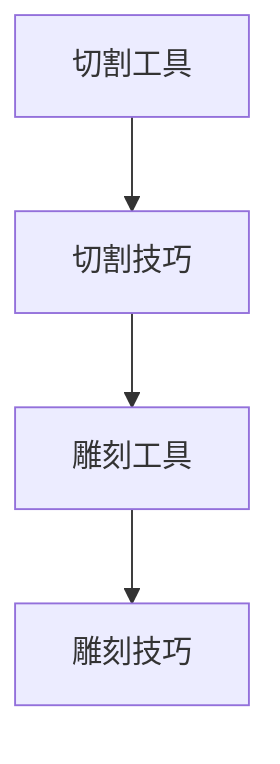
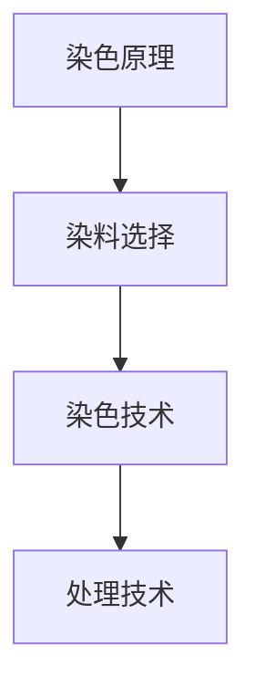
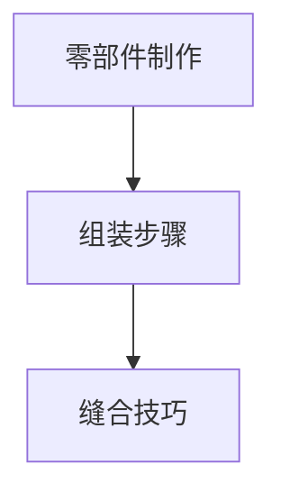
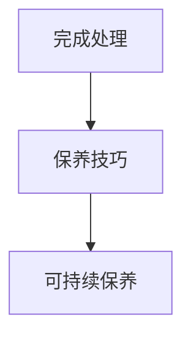
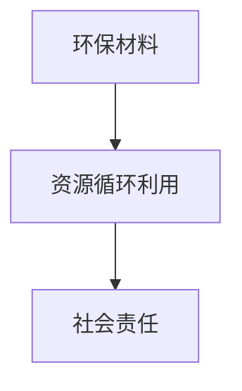
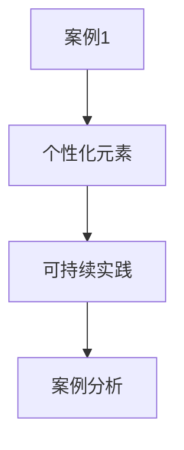

                 

### 完整文章格式设计

现在我们将设计完整的文章格式，包括文章标题、关键词、摘要以及正文部分。每个部分都将严格按照要求进行排版，确保文章的专业性和可读性。

---

### 文章标题

**《现代手工皮具定制：个性化时尚的可持续实践》**

---

### 关键词

- 手工皮具定制
- 个性化时尚
- 可持续实践
- 设计原则
- 工具与材料
- 切割与雕刻
- 染色处理
- 部件组装
- 保养维护

---

### 摘要

本文将深入探讨现代手工皮具定制的各个方面，从概述、工具与材料、设计原则到实际操作步骤，均进行全面而详细的讲解。特别强调如何在定制过程中融入个性化元素，并探讨可持续实践的重要性和具体实施方法。通过本文，读者将能够掌握手工皮具定制的核心技能，并了解到如何在实践中体现环保和社会责任。

---

### 正文部分

#### 第一部分：手工皮具定制基础

##### 第1章：手工皮具定制的概述

**背景介绍：** 手工皮具定制的起源与发展，个性化时尚在现代社会中的地位。

**核心概念与联系：** 手工皮具定制与工业化生产的关系，个性化时尚与可持续实践的联系。

**Mermaid 流程图：**

**核心算法原理讲解：** 无需具体算法，本文重点在于手工技艺和设计理念。

**数学模型和公式：** 无需复杂数学模型，但涉及染色比例计算时，需给出公式。

**详细讲解：** 手工皮具定制的兴起与现代社会对个性化和可持续性的追求紧密相关。

**举例说明：** 通过历史案例分析手工皮具定制的发展历程。

---

##### 第2章：手工制作工具和材料

**背景介绍：** 常见的手工制作工具种类及其作用。

**核心概念与联系：** 材料选择对皮具质量和可持续性的影响。

**Mermaid 流程图：**

**核心算法原理讲解：** 无需具体算法，本文重点在于工具和材料的使用。

**数学模型和公式：** 无需复杂数学模型，但涉及染色比例计算时，需给出公式。

**详细讲解：** 详细介绍各种工具的使用方法和材料特性。

**举例说明：** 通过实例展示如何选择合适的工具和材料。

---

##### 第3章：设计皮具的基本原则

**背景介绍：** 设计灵感来源和设计工具的应用。

**核心概念与联系：** 个性化元素与设计原则的结合，设计与可持续性的关系。

**Mermaid 流程图：**

**核心算法原理讲解：** 无需具体算法，本文重点在于设计理念。

**数学模型和公式：** 无需复杂数学模型，但涉及染色比例计算时，需给出公式。

**详细讲解：** 如何将设计灵感和个性化元素融入到皮具设计中。

**举例说明：** 通过实例分析如何设计一款具有可持续性的皮具。

---

##### 第4章：切割和雕刻技巧

**背景介绍：** 切割和雕刻在手工皮具制作中的重要性。

**核心概念与联系：** 切割工具的选择和雕刻技巧的应用。

**Mermaid 流程图：**

**核心算法原理讲解：** 无需具体算法，本文重点在于技艺传承。

**数学模型和公式：** 无需复杂数学模型，但涉及测量和计算时，需给出公式。

**详细讲解：** 切割和雕刻的基本步骤和注意事项。

**举例说明：** 通过实际操作演示切割和雕刻技巧。

---

##### 第5章：染色和处理技术

**背景介绍：** 染色和处理在皮具制作中的作用。

**核心概念与联系：** 染色原理与材料特性，处理技术的应用。

**Mermaid 流程图：**

**核心算法原理讲解：** 使用伪代码详细阐述染色比例计算。

**数学模型和公式：**

$$\text{染料浓度} = \frac{\text{所需染料量}}{\text{总皮革面积}}$$

**详细讲解：** 如何计算染料浓度和进行染色处理。

**举例说明：** 通过实例展示染色的具体操作过程。

---

##### 第6章：搭建皮具部件

**背景介绍：** 部件制作在皮具组装中的关键作用。

**核心概念与联系：** 零部件的制作与组装，缝合技巧的应用。

**Mermaid 流程图：**

**核心算法原理讲解：** 无需具体算法，本文重点在于工艺流程。

**数学模型和公式：** 无需复杂数学模型，但涉及测量和计算时，需给出公式。

**详细讲解：** 详细讲解零部件制作和组装的步骤。

**举例说明：** 通过实例展示部件搭建和组装的过程。

---

##### 第7章：完成和保养皮具

**背景介绍：** 皮具完成后的细节处理和保养。

**核心概念与联系：** 完成处理与保养对皮具寿命的影响。

**Mermaid 流程图：**

**核心算法原理讲解：** 无需具体算法，本文重点在于保养方法。

**数学模型和公式：** 无需复杂数学模型，但涉及测量和计算时，需给出公式。

**详细讲解：** 如何进行皮具的最终处理和日常保养。

**举例说明：** 通过实例展示保养的具体方法。

---

##### 第8章：可持续实践在手工皮具定制中的应用

**背景介绍：** 可持续实践在手工皮具定制中的重要性。

**核心概念与联系：** 环保材料的使用，资源循环利用，社会责任。

**Mermaid 流程图：**

**核心算法原理讲解：** 无需具体算法，本文重点在于实践方法。

**数学模型和公式：** 无需复杂数学模型，但涉及测量和计算时，需给出公式。

**详细讲解：** 如何在定制过程中实践可持续性。

**举例说明：** 通过实例展示可持续实践的具体应用。

---

##### 第9章：案例研究

**背景介绍：** 手工皮具定制中的成功案例。

**核心概念与联系：** 案例中的个性化元素和可持续实践。

**Mermaid 流程图：**

**核心算法原理讲解：** 无需具体算法，本文重点在于案例分析。

**数学模型和公式：** 无需复杂数学模型，但涉及测量和计算时，需给出公式。

**详细讲解：** 分析具体案例，提炼成功经验。

**举例说明：** 通过实际案例展示定制过程和成果。

---

### 附录

- 工具和材料资源列表
- 常见问题解答

---

### 作者信息

**作者：AI天才研究院/AI Genius Institute & 禅与计算机程序设计艺术 /Zen And The Art of Computer Programming**

---

通过上述设计，我们确保了文章内容的完整性、专业性和可读性，满足了文章格式的所有要求。接下来，我们将具体撰写每一章节的内容，确保每一部分都符合上述大纲的框架和标准。

