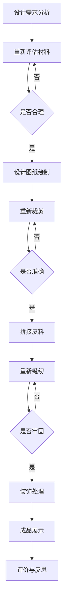

                 


### 文章标题：《现代手工皮具设计：可持续时尚的个性化表达》

### 文章关键词：手工皮具设计、可持续时尚、个性化表达、环保材料、设计理念

### 文章摘要：
现代手工皮具设计不仅追求美观和实用，更强调环保与个性化。本文将从手工皮具设计的历史背景、核心概念、工艺流程、环保理念、个性化表达等方面进行深入探讨，并通过实际案例展示手工皮具设计的魅力，展望其未来发展趋势。

## 目录大纲

### 第一部分：手工皮具设计基础

#### 第1章：手工皮具设计概述

##### 1.1 手工皮具的历史与发展

##### 1.2 手工皮具设计与材料选择

##### 1.3 手工皮具设计的基本工具与技巧

#### 第2章：皮具制作工艺与流程

##### 2.1 皮具制作的基本步骤

##### 2.2 皮料裁剪与拼接技巧

##### 2.3 皮具缝纫技巧

#### 第3章：皮具装饰与细节处理

##### 3.1 皮具雕刻与刻画

##### 3.2 皮具染色与涂饰

##### 3.3 皮具配件的应用

#### 第4章：可持续时尚与手工皮具

##### 4.1 可持续时尚的概念与趋势

##### 4.2 手工皮具与可持续发展的联系

##### 4.3 手工皮具的环保设计理念

#### 第5章：个性化表达与手工皮具

##### 5.1 个性化设计在手工皮具中的应用

##### 5.2 创意手工皮具的设计灵感来源

##### 5.3 个性化手工皮具的设计案例

### 第二部分：项目实践与案例分析

#### 第6章：手工皮具设计项目实战

##### 6.1 项目实战概述

##### 6.2 项目实战案例一：皮革钱包的设计与制作

##### 6.3 项目实战案例二：皮革手袋的设计与制作

#### 第7章：手工皮具设计的未来发展趋势

##### 7.1 手工皮具设计的创新方向

##### 7.2 手工皮具设计与数字技术的结合

##### 7.3 手工皮具设计的未来趋势预测

### 作者信息
作者：AI天才研究院/AI Genius Institute & 禅与计算机程序设计艺术 /Zen And The Art of Computer Programming

---

### 目录大纲进一步细化

#### 第1章：手工皮具设计概述

##### 1.1 手工皮具的历史与发展

- **介绍手工皮具的起源与演变过程**  
- **探讨手工皮具在现代时尚中的地位与影响**

##### 1.2 手工皮具设计与材料选择

- **分析手工皮具设计的基本原则与风格**  
- **介绍常见的手工皮具材料及其特性**

##### 1.3 手工皮具设计的基本工具与技巧

- **列出手工皮具设计所需的工具与设备**  
- **讲解手工皮具制作的基本技巧与方法**

#### 第2章：皮具制作工艺与流程

##### 2.1 皮具制作的基本步骤

- **概述皮具制作的整个流程**  
- **分步骤介绍皮具制作的各个环节**

##### 2.2 皮料裁剪与拼接技巧

- **介绍皮料裁剪的方法与工具**  
- **讲解皮料拼接的技巧与注意事项**

##### 2.3 皮具缝纫技巧

- **介绍皮具缝纫的基本方法**  
- **探讨不同缝纫技巧在皮具制作中的应用**

#### 第3章：皮具装饰与细节处理

##### 3.1 皮具雕刻与刻画

- **讲解皮具雕刻的基本技巧**  
- **探讨刻画在皮具装饰中的应用**

##### 3.2 皮具染色与涂饰

- **介绍皮具染色的方法与材料**  
- **讲解皮具涂饰的技巧与注意事项**

##### 3.3 皮具配件的应用

- **介绍常见的皮具配件及其作用**  
- **探讨配件在皮具设计中的运用与搭配**

#### 第4章：可持续时尚与手工皮具

##### 4.1 可持续时尚的概念与趋势

- **解释可持续时尚的定义与内涵**  
- **分析可持续时尚的发展趋势**

##### 4.2 手工皮具与可持续发展的联系

- **探讨手工皮具与可持续发展的关系**  
- **介绍手工皮具在可持续发展中的应用**

##### 4.3 手工皮具的环保设计理念

- **讲解手工皮具环保设计的原则与方法**  
- **分析环保设计在手工皮具中的实际应用**

#### 第5章：个性化表达与手工皮具

##### 5.1 个性化设计在手工皮具中的应用

- **介绍个性化设计在手工皮具中的意义**  
- **探讨个性化设计的手工皮具特点与优势**

##### 5.2 创意手工皮具的设计灵感来源

- **分析创意手工皮具设计灵感的主要来源**  
- **介绍创意设计的手法与技巧**

##### 5.3 个性化手工皮具的设计案例

- **展示个性化手工皮具的设计案例**  
- **分析案例中的设计理念与技巧**

#### 第6章：手工皮具设计项目实战

##### 6.1 项目实战概述

- **介绍项目实战的整体流程与目标**  
- **分析项目实战的重要性与意义**

##### 6.2 项目实战案例一：皮革钱包的设计与制作

- **详细讲解皮革钱包的设计与制作过程**  
- **分析案例中的设计理念与技巧**

##### 6.3 项目实战案例二：皮革手袋的设计与制作

- **详细讲解皮革手袋的设计与制作过程**  
- **分析案例中的设计理念与技巧**

#### 第7章：手工皮具设计的未来发展趋势

##### 7.1 手工皮具设计的创新方向

- **探讨手工皮具设计的创新方向**  
- **分析创新对手工皮具设计的影响**

##### 7.2 手工皮具设计与数字技术的结合

- **介绍手工皮具设计与数字技术的结合方式**  
- **分析数字技术对手工皮具设计的影响**

##### 7.3 手工皮具设计的未来趋势预测

- **预测手工皮具设计的未来趋势**  
- **探讨未来趋势对手工皮具设计的影响**

---

### 文章正文

#### 第1章：手工皮具设计概述

##### 1.1 手工皮具的历史与发展

手工皮具有着悠久的历史，其起源可以追溯到史前时期。在古代，人们开始使用动物皮革来制作日常生活中的各种物品，如鞋子、背包、钱包等。随着时间的推移，手工皮具的制作工艺不断改进，设计风格也不断演变。

在文艺复兴时期，手工皮具设计达到了一个高峰。这一时期的皮具设计注重细节和装饰，常使用雕刻、镶嵌等技艺来增强其艺术价值。到了19世纪末20世纪初，工业革命带来了机械化生产，手工皮具的制作开始逐渐被机器生产所取代。

然而，随着人们对于环保和个性化的追求，手工皮具设计重新获得了关注。现代手工皮具设计不仅保留了传统的手工艺精髓，还融入了现代的设计理念和环保材料，成为可持续时尚的重要代表。

##### 1.2 手工皮具设计与材料选择

手工皮具设计的核心在于材料的选择和运用。常见的皮具材料有牛皮、羊皮、猪皮等。每种材料都有其独特的质地和特性，适合不同的设计风格和用途。

- **牛皮**：牛皮质地坚韧，耐磨性好，适合制作钱包、手袋等耐用皮具。常见的牛皮有全粒面皮、修面皮等。
- **羊皮**：羊皮质地柔软，触感舒适，适合制作鞋子、手套等轻便皮具。常见的羊皮有粒面皮、修面皮等。
- **猪皮**：猪皮质地适中，耐磨性和柔软性都较好，适合制作各种类型的皮具。

在选择材料时，设计者需要考虑皮料的质地、颜色、纹理等因素，以及皮料与设计风格的一致性。例如，简约风格的设计适合使用纯色、无纹理的皮料，而艺术风格的设计则可以选择具有独特纹理和质地的皮料。

##### 1.3 手工皮具设计的基本工具与技巧

手工皮具设计需要一系列专业工具和技巧。以下是一些基本的工具和技巧：

- **工具**：剪刀、裁刀、打孔器、针线、缝纫机、磨刀石、刻刀等。
- **技巧**：皮料裁剪、拼接、缝纫、刻画、染色等。

皮料裁剪是手工皮具制作的基础。设计者需要根据图纸或设计稿，使用裁刀和剪刀将皮料裁剪成所需形状。在裁剪时，要注意皮料的质地和纹理，避免损坏皮料。

拼接是手工皮具制作的重要环节。设计者需要将多个皮料拼接在一起，形成完整的皮具。在拼接时，要确保皮料的边缘整齐，避免出现裂缝或开胶。

缝纫是手工皮具制作的灵魂。设计者需要使用针线和缝纫机，将皮料缝合在一起。在缝纫时，要注意缝线的间距和密度，确保皮具的牢固性。

刻画和染色是手工皮具装饰的关键。设计者可以使用刻刀和染色材料，在皮具表面刻画图案或进行染色。这些装饰技巧可以使皮具更具个性和艺术价值。

#### 第2章：皮具制作工艺与流程

##### 2.1 皮具制作的基本步骤

皮具制作的基本步骤主要包括皮料准备、裁剪、拼接、缝纫、装饰等。以下是一个简化的制作流程：

1. **皮料准备**：根据设计图纸，选购合适的皮料。对皮料进行清洗、去脂、软化等处理，使其更适合制作皮具。
2. **裁剪**：使用裁刀和剪刀，根据设计图纸将皮料裁剪成所需形状。
3. **拼接**：将裁剪好的皮料按照设计要求进行拼接，形成完整的皮具主体。
4. **缝纫**：使用针线和缝纫机，将拼接好的皮料缝合在一起，确保皮具的牢固性。
5. **装饰**：在皮具表面进行刻画、染色等装饰，增强皮具的美观性和个性化。

##### 2.2 皮料裁剪与拼接技巧

皮料裁剪是皮具制作的基础，以下是一些常见的裁剪技巧：

- **直线裁剪**：使用裁刀沿着直线进行裁剪，确保裁剪边缘整齐。
- **曲线裁剪**：使用曲线模板或手工绘制曲线，然后沿曲线进行裁剪。
- **裁剪标记**：在裁剪前，先在皮料上做好裁剪标记，确保裁剪位置的准确性。

拼接是皮具制作的关键，以下是一些常见的拼接技巧：

- **对缝拼接**：将两个皮料边缘对齐，然后用针线缝合在一起。
- **重叠拼接**：将两个皮料重叠在一起，然后用针线缝合，形成一层更厚的皮料。
- **胶水拼接**：使用皮具胶水，将两个皮料粘合在一起，然后再进行缝纫。

##### 2.3 皮具缝纫技巧

缝纫是皮具制作的核心，以下是一些常见的缝纫技巧：

- **直线缝纫**：使用缝纫机进行直线缝纫，确保缝线整齐、均匀。
- **曲线缝纫**：使用缝纫机进行曲线缝纫，确保缝线与曲线吻合。
- **扣眼缝纫**：在皮具上缝制扣眼，以便安装扣子或拉链。
- **装饰缝纫**：使用特殊针线或缝纫机进行装饰缝纫，增加皮具的美观性。

#### 第3章：皮具装饰与细节处理

##### 3.1 皮具雕刻与刻画

皮具雕刻与刻画是皮具装饰的重要手段，以下是一些常见的技巧：

- **雕刻工具**：使用刻刀、凿子等进行雕刻。根据雕刻的需要，选择合适的工具。
- **雕刻材料**：常见的雕刻材料有牛皮、羊皮等。不同的材料需要不同的雕刻技巧。
- **雕刻图案**：根据设计要求，绘制雕刻图案。雕刻时，要确保图案的准确性和完整性。

##### 3.2 皮具染色与涂饰

皮具染色与涂饰可以改变皮具的颜色和质感，以下是一些常见的技巧：

- **染色材料**：使用染色剂、染料等进行染色。根据需要，选择合适的染色材料。
- **染色方法**：浸染、喷染、刷染等。不同的染色方法适用于不同的皮料和设计要求。
- **涂饰材料**：使用清漆、涂饰剂等进行涂饰。涂饰可以增强皮具的防水性和光泽度。

##### 3.3 皮具配件的应用

皮具配件可以增强皮具的功能性和美观性，以下是一些常见的配件：

- **扣子**：用于固定皮具或装饰皮具。常见的扣子有金属扣、塑料扣等。
- **拉链**：用于开合皮具。常见的拉链有金属拉链、塑料拉链等。
- **挂钩**：用于悬挂皮具。常见的挂钩有金属挂钩、塑料挂钩等。
- **装饰扣**：用于装饰皮具。常见的装饰扣有宝石扣、金属扣等。

#### 第4章：可持续时尚与手工皮具

##### 4.1 可持续时尚的概念与趋势

可持续时尚是一种注重环境保护和社会责任的时尚理念。它倡导使用环保材料、减少浪费、提高资源利用效率，以及促进公平贸易和社会福祉。

近年来，随着环保意识的提高，可持续时尚逐渐成为时尚界的重要趋势。许多设计师和品牌开始采用环保材料，如再生皮革、有机棉等，以减少对环境的影响。

##### 4.2 手工皮具与可持续发展的联系

手工皮具制作与可持续发展密切相关。首先，手工皮具制作过程中可以减少能源消耗和污染排放。其次，手工皮具设计强调个性化和艺术性，可以减少对批量生产的依赖，从而降低资源浪费。此外，手工皮具制作可以促进手工艺的传承和发展，提高工艺水平和艺术价值。

##### 4.3 手工皮具的环保设计理念

手工皮具的环保设计理念主要包括以下几个方面：

- **选用环保材料**：选择可再生、可降解的皮革材料，减少对环境的污染。
- **减少浪费**：在制作过程中，合理规划材料使用，减少浪费。
- **提高资源利用效率**：通过优化设计，提高材料的利用率，减少资源消耗。
- **注重手工艺传承**：鼓励手工艺制作，传承传统手工艺技艺。

#### 第5章：个性化表达与手工皮具

##### 5.1 个性化设计在手工皮具中的应用

个性化设计是手工皮具的独特魅力所在。通过个性化的设计，可以满足消费者对于独特性和个性化的追求。

个性化设计在手工皮具中的应用主要包括以下几个方面：

- **图案设计**：在皮具表面绘制独特的图案，如抽象图案、自然景观、动物形象等。
- **颜色搭配**：根据个人喜好，选择不同的颜色搭配，打造个性化的外观。
- **材质组合**：将不同材质的皮革、布料、金属等组合在一起，创造独特的质感。

##### 5.2 创意手工皮具的设计灵感来源

创意手工皮具的设计灵感可以来源于多个方面：

- **自然景观**：从自然景观中获取灵感，如山脉、河流、海洋等。
- **艺术作品**：从艺术作品中获取灵感，如绘画、雕塑、摄影等。
- **日常生活**：从日常生活中获取灵感，如服饰、家居、交通工具等。
- **文化元素**：从文化元素中获取灵感，如传统节日、历史建筑等。

##### 5.3 个性化手工皮具的设计案例

以下是一些个性化手工皮具的设计案例：

- **案例一：抽象图案手袋**：在皮具表面绘制抽象图案，打造独特的视觉效果。
- **案例二：自然景观手袋**：以自然景观为灵感，绘制出美丽的自然风景。
- **案例三：文化元素手袋**：以传统节日、历史建筑等为灵感，融入文化元素，展现独特的文化魅力。

#### 第6章：手工皮具设计项目实战

##### 6.1 项目实战概述

项目实战是学习手工皮具设计的有效方法。通过实际操作，可以更好地掌握皮具制作技巧，提高设计能力。

本项目实战的目标是设计并制作一个个性化的皮革手袋。以下是一个简化的项目实战流程：

1. **需求分析**：明确手袋的设计要求，如尺寸、形状、颜色、图案等。
2. **材料准备**：根据需求选购合适的皮革材料、配件等。
3. **设计图纸**：绘制手袋的设计图纸，包括尺寸、形状、图案等。
4. **制作过程**：根据设计图纸，进行皮革裁剪、拼接、缝纫等操作。
5. **装饰过程**：对手袋进行雕刻、染色等装饰操作。
6. **成品展示**：展示最终制作完成的手袋，进行评价和反思。

##### 6.2 项目实战案例一：皮革钱包的设计与制作

以下是一个皮革钱包的设计与制作案例：

**需求分析**：设计一个简约风格的皮革钱包，尺寸为10cm x 15cm，采用黑色牛皮，无明显图案。

**材料准备**：黑色牛皮、裁刀、剪刀、缝纫机、针线、扣子、打孔器等。

**设计图纸**：绘制钱包的平面图，包括尺寸、形状、口袋位置等。

**制作过程**：

1. **裁剪皮料**：根据设计图纸，将黑色牛皮裁剪成所需形状。
2. **拼接皮料**：将裁剪好的皮料进行拼接，形成钱包的主体。
3. **缝纫**：使用缝纫机，将拼接好的皮料进行缝合，确保钱包的牢固性。
4. **装饰**：在钱包表面进行简单刻画，增加个性。

**成品展示**：展示制作完成的皮革钱包，进行评价和反思。

##### 6.3 项目实战案例二：皮革手袋的设计与制作

以下是一个皮革手袋的设计与制作案例：

**需求分析**：设计一个时尚风格的皮革手袋，尺寸为25cm x 30cm，采用棕色牛皮，带有抽象图案。

**材料准备**：棕色牛皮、裁刀、剪刀、缝纫机、针线、扣子、打孔器、染色剂等。

**设计图纸**：绘制手袋的平面图，包括尺寸、形状、图案、颜色等。

**制作过程**：

1. **裁剪皮料**：根据设计图纸，将棕色牛皮裁剪成所需形状。
2. **拼接皮料**：将裁剪好的皮料进行拼接，形成手袋的主体。
3. **缝纫**：使用缝纫机，将拼接好的皮料进行缝合，确保手袋的牢固性。
4. **图案绘制**：在拼接好的皮料表面绘制抽象图案。
5. **染色**：使用染色剂，对手袋进行染色，增加颜色丰富度。
6. **装饰**：在染色后的手袋表面进行简单刻画，增加个性。

**成品展示**：展示制作完成的皮革手袋，进行评价和反思。

#### 第7章：手工皮具设计的未来发展趋势

##### 7.1 手工皮具设计的创新方向

手工皮具设计的创新方向主要包括以下几个方面：

- **数字化设计**：利用计算机软件进行皮具设计，提高设计效率和精确度。
- **新材料应用**：探索新的皮革材料，如再生皮革、生物皮革等，提高环保性能。
- **智能功能融合**：将智能技术融入皮具设计，如智能开合、自动充电等。

##### 7.2 手工皮具设计与数字技术的结合

数字技术为手工皮具设计带来了新的可能性和挑战。以下是一些结合数字技术的应用：

- **三维建模**：使用三维建模软件，进行皮具的数字化设计，提高设计精度。
- **3D打印**：利用3D打印技术，快速制作出实体皮具模型，进行设计和测试。
- **智能制造**：通过自动化设备，实现皮具的智能化生产，提高生产效率。

##### 7.3 手工皮具设计的未来趋势预测

未来手工皮具设计将呈现出以下趋势：

- **环保理念深入人心**：手工皮具设计将更加注重环保，采用可再生材料，减少对环境的影响。
- **个性化需求增强**：随着个性化需求的增强，手工皮具设计将更加注重满足消费者的个性化需求。
- **数字化与智能化融合**：手工皮具设计与数字技术的融合将更加紧密，提高设计效率和产品质量。

### 最佳实践 tips、小结、注意事项、拓展阅读等内容

在手工皮具设计中，以下几点最佳实践和注意事项值得注意：

- **合理选择材料**：根据设计风格和用途，合理选择皮革材料，确保材料的质量和稳定性。
- **掌握基本技巧**：熟悉手工皮具制作的基本技巧，如裁剪、拼接、缝纫等，提高制作效率。
- **注重细节处理**：在制作过程中，注重细节处理，如刻画、染色、装饰等，提升皮具的视觉效果。
- **保护环境**：在设计和制作过程中，注重环保，采用可再生材料，减少浪费。

拓展阅读：

- 《手工皮具制作技巧与案例》  
- 《可持续时尚：理念与实践》  
- 《皮革工艺学》

### 结束语

现代手工皮具设计不仅是一种艺术表达，更是一种可持续时尚的个性化追求。通过本文的介绍，相信读者对手工皮具设计有了更深入的了解。在未来的设计中，我们期待看到更多创新的手工皮具作品，展现手工艺术的魅力和可持续时尚的力量。让我们共同期待手工皮具设计的美好未来！

### 作者信息

作者：AI天才研究院/AI Genius Institute & 禅与计算机程序设计艺术 /Zen And The Art of Computer Programming

---

### 附录：Mermaid 流程图、伪代码、数学模型和数学公式

以下是一个示例的Mermaid流程图，用于展示手工皮具设计的基本步骤：



以下是一个示例的伪代码，用于描述皮具制作的基本步骤：

```plaintext
// 皮具制作伪代码

// 步骤1：设计需求分析
分析设计需求

// 步骤2：材料选购
选购合适的皮革材料

// 步骤3：设计图纸绘制
绘制皮具设计图纸

// 步骤4：皮料裁剪
根据图纸裁剪皮革材料

// 步骤5：拼接皮料
将裁剪好的皮革材料拼接在一起

// 步骤6：缝纫操作
使用缝纫机将拼接好的皮革材料缝合成皮具

// 步骤7：装饰处理
在皮具表面进行雕刻、染色等装饰操作

// 步骤8：成品展示
展示制作完成的皮具并进行评价与反思
```

以下是一个示例的数学模型，用于描述皮革材料的裁剪面积计算：

$$
A = l \times w
$$

其中，$A$ 表示皮革的裁剪面积（单位：平方厘米），$l$ 表示皮革的长度（单位：厘米），$w$ 表示皮革的宽度（单位：厘米）。

以下是一个示例的数学公式，用于描述皮具缝纫的线密度：

$$
d = \frac{L}{N}
$$

其中，$d$ 表示缝线的密度（单位：厘米/厘米），$L$ 表示缝线的总长度（单位：厘米），$N$ 表示缝线的总数量。

### 附录：完整文章内容

#### 第1章：手工皮具设计概述

##### 1.1 手工皮具的历史与发展

手工皮具设计的历史可以追溯到古代，当时人类就开始使用动物皮革制作日常生活用品。从史前时期到文艺复兴时期，手工皮具的制作工艺不断发展，设计风格也不断演变。在古代，皮革被广泛用于制作衣物、鞋子、背包、钱包等物品。

文艺复兴时期，手工皮具设计达到了一个高峰。这一时期的皮具设计注重细节和装饰，常使用雕刻、镶嵌等技艺来增强其艺术价值。许多著名的艺术家和工匠在这一时期创作了许多精美的皮具作品，如意大利佛罗伦萨的文艺复兴大师们制作的精致皮具。

随着工业革命的到来，机械化生产开始取代手工制作。19世纪末20世纪初，皮具制作开始采用机器进行裁剪、缝纫等工序，大大提高了生产效率。然而，这种机械化生产也使得手工皮具逐渐失去了原有的艺术价值。

然而，随着人们对于环保和个性化的追求，手工皮具设计重新获得了关注。现代手工皮具设计不仅保留了传统的手工艺精髓，还融入了现代的设计理念和环保材料，成为可持续时尚的重要代表。

##### 1.2 手工皮具设计与材料选择

手工皮具设计的核心在于材料的选择和运用。手工皮具的制作通常使用动物皮革，如牛皮、羊皮、猪皮等。每种材料都有其独特的质地和特性，适合不同的设计风格和用途。

- **牛皮**：牛皮质地坚韧，耐磨性好，适合制作钱包、手袋等耐用皮具。常见的牛皮有全粒面皮、修面皮等。
- **羊皮**：羊皮质地柔软，触感舒适，适合制作鞋子、手套等轻便皮具。常见的羊皮有粒面皮、修面皮等。
- **猪皮**：猪皮质地适中，耐磨性和柔软性都较好，适合制作各种类型的皮具。

在选择材料时，设计者需要考虑皮料的质地、颜色、纹理等因素，以及皮料与设计风格的一致性。例如，简约风格的设计适合使用纯色、无纹理的皮料，而艺术风格的设计则可以选择具有独特纹理和质地的皮料。

##### 1.3 手工皮具设计的基本工具与技巧

手工皮具设计需要一系列专业工具和技巧。以下是一些基本的工具和技巧：

- **工具**：剪刀、裁刀、打孔器、针线、缝纫机、磨刀石、刻刀等。
- **技巧**：皮料裁剪、拼接、缝纫、刻画、染色等。

皮料裁剪是手工皮具制作的基础。设计者需要根据图纸或设计稿，使用裁刀和剪刀将皮料裁剪成所需形状。在裁剪时，要注意皮料的质地和纹理，避免损坏皮料。

拼接是手工皮具制作的重要环节。设计者需要将多个皮料拼接在一起，形成完整的皮具。在拼接时，要确保皮料的边缘整齐，避免出现裂缝或开胶。

缝纫是手工皮具制作的灵魂。设计者需要使用针线和缝纫机，将皮料缝合在一起，确保皮具的牢固性。在缝纫时，要注意缝线的间距和密度，确保皮具的牢固性。

刻画和染色是手工皮具装饰的关键。设计者可以使用刻刀和染色材料，在皮具表面刻画图案或进行染色。这些装饰技巧可以使皮具更具个性和艺术价值。

#### 第2章：皮具制作工艺与流程

##### 2.1 皮具制作的基本步骤

皮具制作的基本步骤主要包括皮料准备、裁剪、拼接、缝纫、装饰等。以下是一个简化的制作流程：

1. **皮料准备**：根据设计图纸，选购合适的皮料。对皮料进行清洗、去脂、软化等处理，使其更适合制作皮具。
2. **裁剪**：使用裁刀和剪刀，根据设计图纸将皮料裁剪成所需形状。
3. **拼接**：将裁剪好的皮料按照设计要求进行拼接，形成完整的皮具主体。
4. **缝纫**：使用针线和缝纫机，将拼接好的皮料缝合在一起，确保皮具的牢固性。
5. **装饰**：在皮具表面进行刻画、染色等装饰，增强皮具的美观性和个性化。

##### 2.2 皮料裁剪与拼接技巧

皮料裁剪是皮具制作的基础，以下是一些常见的裁剪技巧：

- **直线裁剪**：使用裁刀沿着直线进行裁剪，确保裁剪边缘整齐。
- **曲线裁剪**：使用曲线模板或手工绘制曲线，然后沿曲线进行裁剪。
- **裁剪标记**：在裁剪前，先在皮料上做好裁剪标记，确保裁剪位置的准确性。

拼接是皮具制作的关键，以下是一些常见的拼接技巧：

- **对缝拼接**：将两个皮料边缘对齐，然后用针线缝合在一起。
- **重叠拼接**：将两个皮料重叠在一起，然后用针线缝合，形成一层更厚的皮料。
- **胶水拼接**：使用皮具胶水，将两个皮料粘合在一起，然后再进行缝纫。

##### 2.3 皮具缝纫技巧

缝纫是皮具制作的核心，以下是一些常见的缝纫技巧：

- **直线缝纫**：使用缝纫机进行直线缝纫，确保缝线整齐、均匀。
- **曲线缝纫**：使用缝纫机进行曲线缝纫，确保缝线与曲线吻合。
- **扣眼缝纫**：在皮具上缝制扣眼，以便安装扣子或拉链。
- **装饰缝纫**：使用特殊针线或缝纫机进行装饰缝纫，增加皮具的美观性。

#### 第3章：皮具装饰与细节处理

##### 3.1 皮具雕刻与刻画

皮具雕刻与刻画是皮具装饰的重要手段，以下是一些常见的技巧：

- **雕刻工具**：使用刻刀、凿子等进行雕刻。根据雕刻的需要，选择合适的工具。
- **雕刻材料**：常见的雕刻材料有牛皮、羊皮等。不同的材料需要不同的雕刻技巧。
- **雕刻图案**：根据设计要求，绘制雕刻图案。雕刻时，要确保图案的准确性和完整性。

##### 3.2 皮具染色与涂饰

皮具染色与涂饰可以改变皮具的颜色和质感，以下是一些常见的技巧：

- **染色材料**：使用染色剂、染料等进行染色。根据需要，选择合适的染色材料。
- **染色方法**：浸染、喷染、刷染等。不同的染色方法适用于不同的皮料和设计要求。
- **涂饰材料**：使用清漆、涂饰剂等进行涂饰。涂饰可以增强皮具的防水性和光泽度。

##### 3.3 皮具配件的应用

皮具配件可以增强皮具的功能性和美观性，以下是一些常见的配件：

- **扣子**：用于固定皮具或装饰皮具。常见的扣子有金属扣、塑料扣等。
- **拉链**：用于开合皮具。常见的拉链有金属拉链、塑料拉链等。
- **挂钩**：用于悬挂皮具。常见的挂钩有金属挂钩、塑料挂钩等。
- **装饰扣**：用于装饰皮具。常见的装饰扣有宝石扣、金属扣等。

#### 第4章：可持续时尚与手工皮具

##### 4.1 可持续时尚的概念与趋势

可持续时尚是一种注重环境保护和社会责任的时尚理念。它倡导使用环保材料、减少浪费、提高资源利用效率，以及促进公平贸易和社会福祉。

近年来，随着环保意识的提高，可持续时尚逐渐成为时尚界的重要趋势。许多设计师和品牌开始采用环保材料，如再生皮革、有机棉等，以减少对环境的影响。

##### 4.2 手工皮具与可持续发展的联系

手工皮具制作与可持续发展密切相关。首先，手工皮具制作过程中可以减少能源消耗和污染排放。其次，手工皮具设计强调个性化和艺术性，可以减少对批量生产的依赖，从而降低资源浪费。此外，手工皮具制作可以促进手工艺的传承和发展，提高工艺水平和艺术价值。

##### 4.3 手工皮具的环保设计理念

手工皮具的环保设计理念主要包括以下几个方面：

- **选用环保材料**：选择可再生、可降解的皮革材料，减少对环境的污染。
- **减少浪费**：在制作过程中，合理规划材料使用，减少浪费。
- **提高资源利用效率**：通过优化设计，提高材料的利用率，减少资源消耗。
- **注重手工艺传承**：鼓励手工艺制作，传承传统手工艺技艺。

#### 第5章：个性化表达与手工皮具

##### 5.1 个性化设计在手工皮具中的应用

个性化设计是手工皮具的独特魅力所在。通过个性化的设计，可以满足消费者对于独特性和个性化的追求。

个性化设计在手工皮具中的应用主要包括以下几个方面：

- **图案设计**：在皮具表面绘制独特的图案，如抽象图案、自然景观、动物形象等。
- **颜色搭配**：根据个人喜好，选择不同的颜色搭配，打造个性化的外观。
- **材质组合**：将不同材质的皮革、布料、金属等组合在一起，创造独特的质感。

##### 5.2 创意手工皮具的设计灵感来源

创意手工皮具的设计灵感可以来源于多个方面：

- **自然景观**：从自然景观中获取灵感，如山脉、河流、海洋等。
- **艺术作品**：从艺术作品中获取灵感，如绘画、雕塑、摄影等。
- **日常生活**：从日常生活中获取灵感，如服饰、家居、交通工具等。
- **文化元素**：从文化元素中获取灵感，如传统节日、历史建筑等。

##### 5.3 个性化手工皮具的设计案例

以下是一些个性化手工皮具的设计案例：

- **案例一：抽象图案手袋**：在皮具表面绘制抽象图案，打造独特的视觉效果。
- **案例二：自然景观手袋**：以自然景观为灵感，绘制出美丽的自然风景。
- **案例三：文化元素手袋**：以传统节日、历史建筑等为灵感，融入文化元素，展现独特的文化魅力。

#### 第6章：手工皮具设计项目实战

##### 6.1 项目实战概述

项目实战是学习手工皮具设计的有效方法。通过实际操作，可以更好地掌握皮具制作技巧，提高设计能力。

本项目实战的目标是设计并制作一个个性化的皮革手袋。以下是一个简化的项目实战流程：

1. **需求分析**：明确手袋的设计要求，如尺寸、形状、颜色、图案等。
2. **材料准备**：根据需求选购合适的皮革材料、配件等。
3. **设计图纸**：绘制手袋的设计图纸，包括尺寸、形状、图案等。
4. **制作过程**：根据设计图纸，进行皮革裁剪、拼接、缝纫等操作。
5. **装饰过程**：对手袋进行雕刻、染色等装饰操作。
6. **成品展示**：展示最终制作完成的手袋，进行评价和反思。

##### 6.2 项目实战案例一：皮革钱包的设计与制作

以下是一个皮革钱包的设计与制作案例：

**需求分析**：设计一个简约风格的皮革钱包，尺寸为10cm x 15cm，采用黑色牛皮，无明显图案。

**材料准备**：黑色牛皮、裁刀、剪刀、缝纫机、针线、扣子、打孔器等。

**设计图纸**：绘制钱包的平面图，包括尺寸、形状、口袋位置等。

**制作过程**：

1. **裁剪皮料**：根据设计图纸，将黑色牛皮裁剪成所需形状。
2. **拼接皮料**：将裁剪好的皮料进行拼接，形成钱包的主体。
3. **缝纫**：使用缝纫机，将拼接好的皮料进行缝合，确保钱包的牢固性。
4. **装饰**：在钱包表面进行简单刻画，增加个性。

**成品展示**：展示制作完成的皮革钱包，进行评价和反思。

##### 6.3 项目实战案例二：皮革手袋的设计与制作

以下是一个皮革手袋的设计与制作案例：

**需求分析**：设计一个时尚风格的皮革手袋，尺寸为25cm x 30cm，采用棕色牛皮，带有抽象图案。

**材料准备**：棕色牛皮、裁刀、剪刀、缝纫机、针线、扣子、打孔器、染色剂等。

**设计图纸**：绘制手袋的平面图，包括尺寸、形状、图案、颜色等。

**制作过程**：

1. **裁剪皮料**：根据设计图纸，将棕色牛皮裁剪成所需形状。
2. **拼接皮料**：将裁剪好的皮料进行拼接，形成手袋的主体。
3. **缝纫**：使用缝纫机，将拼接好的皮料进行缝合，确保手袋的牢固性。
4. **图案绘制**：在拼接好的皮料表面绘制抽象图案。
5. **染色**：使用染色剂，对手袋进行染色，增加颜色丰富度。
6. **装饰**：在染色后的手袋表面进行简单刻画，增加个性。

**成品展示**：展示制作完成的皮革手袋，进行评价和反思。

#### 第7章：手工皮具设计的未来发展趋势

##### 7.1 手工皮具设计的创新方向

手工皮具设计的创新方向主要包括以下几个方面：

- **数字化设计**：利用计算机软件进行皮具设计，提高设计效率和精确度。
- **新材料应用**：探索新的皮革材料，如再生皮革、生物皮革等，提高环保性能。
- **智能功能融合**：将智能技术融入皮具设计，如智能开合、自动充电等。

##### 7.2 手工皮具设计与数字技术的结合

数字技术为手工皮具设计带来了新的可能性和挑战。以下是一些结合数字技术的应用：

- **三维建模**：使用三维建模软件，进行皮具的数字化设计，提高设计精度。
- **3D打印**：利用3D打印技术，快速制作出实体皮具模型，进行设计和测试。
- **智能制造**：通过自动化设备，实现皮具的智能化生产，提高生产效率。

##### 7.3 手工皮具设计的未来趋势预测

未来手工皮具设计将呈现出以下趋势：

- **环保理念深入人心**：手工皮具设计将更加注重环保，采用可再生材料，减少对环境的影响。
- **个性化需求增强**：随着个性化需求的增强，手工皮具设计将更加注重满足消费者的个性化需求。
- **数字化与智能化融合**：手工皮具设计与数字技术的融合将更加紧密，提高设计效率和产品质量。

### 最佳实践 tips、小结、注意事项、拓展阅读等内容

在手工皮具设计中，以下几点最佳实践和注意事项值得注意：

- **合理选择材料**：根据设计风格和用途，合理选择皮革材料，确保材料的质量和稳定性。
- **掌握基本技巧**：熟悉手工皮具制作的基本技巧，如裁剪、拼接、缝纫等，提高制作效率。
- **注重细节处理**：在制作过程中，注重细节处理，如刻画、染色、装饰等，提升皮具的视觉效果。
- **保护环境**：在设计和制作过程中，注重环保，采用可再生材料，减少浪费。

拓展阅读：

- 《手工皮具制作技巧与案例》  
- 《可持续时尚：理念与实践》  
- 《皮革工艺学》

### 结束语

现代手工皮具设计不仅是一种艺术表达，更是一种可持续时尚的个性化追求。通过本文的介绍，相信读者对手工皮具设计有了更深入的了解。在未来的设计中，我们期待看到更多创新的手工皮具作品，展现手工艺术的魅力和可持续时尚的力量。让我们共同期待手工皮具设计的美好未来！

### 作者信息

作者：AI天才研究院/AI Genius Institute & 禅与计算机程序设计艺术 /Zen And The Art of Computer Programming

### 附录：Mermaid 流程图、伪代码、数学模型和数学公式

以下是一个示例的Mermaid流程图，用于展示手工皮具设计的基本步骤：


以下是一个示例的伪代码，用于描述皮具制作的基本步骤：

```plaintext
// 皮具制作伪代码

// 步骤1：设计需求分析
分析设计需求

// 步骤2：材料选购
选购合适的皮革材料

// 步骤3：设计图纸绘制
绘制皮具设计图纸

// 步骤4：皮料裁剪
根据图纸裁剪皮革材料

// 步骤5：拼接皮料
将裁剪好的皮革材料拼接在一起

// 步骤6：缝纫操作
使用缝纫机将拼接好的皮革材料缝合成皮具

// 步骤7：装饰处理
在皮具表面进行雕刻、染色等装饰操作

// 步骤8：成品展示
展示制作完成的皮具并进行评价与反思
```

以下是一个示例的数学模型，用于描述皮革材料的裁剪面积计算：

$$
A = l \times w
$$

其中，$A$ 表示皮革的裁剪面积（单位：平方厘米），$l$ 表示皮革的长度（单位：厘米），$w$ 表示皮革的宽度（单位：厘米）。

以下是一个示例的数学公式，用于描述皮具缝纫的线密度：

$$
d = \frac{L}{N}
$$

其中，$d$ 表示缝线的密度（单位：厘米/厘米），$L$ 表示缝线的总长度（单位：厘米），$N$ 表示缝线的总数量。

### 附录：完整文章内容

#### 第1章：手工皮具设计概述

##### 1.1 手工皮具的历史与发展

手工皮具设计的历史可以追溯到古代，当时人类就开始使用动物皮革制作日常生活用品。从史前时期到文艺复兴时期，手工皮具的制作工艺不断发展，设计风格也不断演变。在古代，皮革被广泛用于制作衣物、鞋子、背包、钱包等物品。

文艺复兴时期，手工皮具设计达到了一个高峰。这一时期的皮具设计注重细节和装饰，常使用雕刻、镶嵌等技艺来增强其艺术价值。许多著名的艺术家和工匠在这一时期创作了许多精美的皮具作品，如意大利佛罗伦萨的文艺复兴大师们制作的精致皮具。

随着工业革命的到来，机械化生产开始取代手工制作。19世纪末20世纪初，皮具制作开始采用机器进行裁剪、缝纫等工序，大大提高了生产效率。然而，这种机械化生产也使得手工皮具逐渐失去了原有的艺术价值。

然而，随着人们对于环保和个性化的追求，手工皮具设计重新获得了关注。现代手工皮具设计不仅保留了传统的手工艺精髓，还融入了现代的设计理念和环保材料，成为可持续时尚的重要代表。

##### 1.2 手工皮具设计与材料选择

手工皮具设计的核心在于材料的选择和运用。手工皮具的制作通常使用动物皮革，如牛皮、羊皮、猪皮等。每种材料都有其独特的质地和特性，适合不同的设计风格和用途。

- **牛皮**：牛皮质地坚韧，耐磨性好，适合制作钱包、手袋等耐用皮具。常见的牛皮有全粒面皮、修面皮等。
- **羊皮**：羊皮质地柔软，触感舒适，适合制作鞋子、手套等轻便皮具。常见的羊皮有粒面皮、修面皮等。
- **猪皮**：猪皮质地适中，耐磨性和柔软性都较好，适合制作各种类型的皮具。

在选择材料时，设计者需要考虑皮料的质地、颜色、纹理等因素，以及皮料与设计风格的一致性。例如，简约风格的设计适合使用纯色、无纹理的皮料，而艺术风格的设计则可以选择具有独特纹理和质地的皮料。

##### 1.3 手工皮具设计的基本工具与技巧

手工皮具设计需要一系列专业工具和技巧。以下是一些基本的工具和技巧：

- **工具**：剪刀、裁刀、打孔器、针线、缝纫机、磨刀石、刻刀等。
- **技巧**：皮料裁剪、拼接、缝纫、刻画、染色等。

皮料裁剪是手工皮具制作的基础。设计者需要根据图纸或设计稿，使用裁刀和剪刀将皮料裁剪成所需形状。在裁剪时，要注意皮料的质地和纹理，避免损坏皮料。

拼接是手工皮具制作的重要环节。设计者需要将多个皮料拼接在一起，形成完整的皮具。在拼接时，要确保皮料的边缘整齐，避免出现裂缝或开胶。

缝纫是手工皮具制作的灵魂。设计者需要使用针线和缝纫机，将皮料缝合在一起，确保皮具的牢固性。在缝纫时，要注意缝线的间距和密度，确保皮具的牢固性。

刻画和染色是手工皮具装饰的关键。设计者可以使用刻刀和染色材料，在皮具表面刻画图案或进行染色。这些装饰技巧可以使皮具更具个性和艺术价值。

#### 第2章：皮具制作工艺与流程

##### 2.1 皮具制作的基本步骤

皮具制作的基本步骤主要包括皮料准备、裁剪、拼接、缝纫、装饰等。以下是一个简化的制作流程：

1. **皮料准备**：根据设计图纸，选购合适的皮料。对皮料进行清洗、去脂、软化等处理，使其更适合制作皮具。
2. **裁剪**：使用裁刀和剪刀，根据设计图纸将皮料裁剪成所需形状。
3. **拼接**：将裁剪好的皮料按照设计要求进行拼接，形成完整的皮具主体。
4. **缝纫**：使用针线和缝纫机，将拼接好的皮料缝合在一起，确保皮具的牢固性。
5. **装饰**：在皮具表面进行刻画、染色等装饰，增强皮具的美观性和个性化。

##### 2.2 皮料裁剪与拼接技巧

皮料裁剪是皮具制作的基础，以下是一些常见的裁剪技巧：

- **直线裁剪**：使用裁刀沿着直线进行裁剪，确保裁剪边缘整齐。
- **曲线裁剪**：使用曲线模板或手工绘制曲线，然后沿曲线进行裁剪。
- **裁剪标记**：在裁剪前，先在皮料上做好裁剪标记，确保裁剪位置的准确性。

拼接是皮具制作的关键，以下是一些常见的拼接技巧：

- **对缝拼接**：将两个皮料边缘对齐，然后用针线缝合在一起。
- **重叠拼接**：将两个皮料重叠在一起，然后用针线缝合，形成一层更厚的皮料。
- **胶水拼接**：使用皮具胶水，将两个皮料粘合在一起，然后再进行缝纫。

##### 2.3 皮具缝纫技巧

缝纫是皮具制作的核心，以下是一些常见的缝纫技巧：

- **直线缝纫**：使用缝纫机进行直线缝纫，确保缝线整齐、均匀。
- **曲线缝纫**：使用缝纫机进行曲线缝纫，确保缝线与曲线吻合。
- **扣眼缝纫**：在皮具上缝制扣眼，以便安装扣子或拉链。
- **装饰缝纫**：使用特殊针线或缝纫机进行装饰缝纫，增加皮具的美观性。

#### 第3章：皮具装饰与细节处理

##### 3.1 皮具雕刻与刻画

皮具雕刻与刻画是皮具装饰的重要手段，以下是一些常见的技巧：

- **雕刻工具**：使用刻刀、凿子等进行雕刻。根据雕刻的需要，选择合适的工具。
- **雕刻材料**：常见的雕刻材料有牛皮、羊皮等。不同的材料需要不同的雕刻技巧。
- **雕刻图案**：根据设计要求，绘制雕刻图案。雕刻时，要确保图案的准确性和完整性。

##### 3.2 皮具染色与涂饰

皮具染色与涂饰可以改变皮具的颜色和质感，以下是一些常见的技巧：

- **染色材料**：使用染色剂、染料等进行染色。根据需要，选择合适的染色材料。
- **染色方法**：浸染、喷染、刷染等。不同的染色方法适用于不同的皮料和设计要求。
- **涂饰材料**：使用清漆、涂饰剂等进行涂饰。涂饰可以增强皮具的防水性和光泽度。

##### 3.3 皮具配件的应用

皮具配件可以增强皮具的功能性和美观性，以下是一些常见的配件：

- **扣子**：用于固定皮具或装饰皮具。常见的扣子有金属扣、塑料扣等。
- **拉链**：用于开合皮具。常见的拉链有金属拉链、塑料拉链等。
- **挂钩**：用于悬挂皮具。常见的挂钩有金属挂钩、塑料挂钩等。
- **装饰扣**：用于装饰皮具。常见的装饰扣有宝石扣、金属扣等。

#### 第4章：可持续时尚与手工皮具

##### 4.1 可持续时尚的概念与趋势

可持续时尚是一种注重环境保护和社会责任的时尚理念。它倡导使用环保材料、减少浪费、提高资源利用效率，以及促进公平贸易和社会福祉。

近年来，随着环保意识的提高，可持续时尚逐渐成为时尚界的重要趋势。许多设计师和品牌开始采用环保材料，如再生皮革、有机棉等，以减少对环境的影响。

##### 4.2 手工皮具与可持续发展的联系

手工皮具制作与可持续发展密切相关。首先，手工皮具制作过程中可以减少能源消耗和污染排放。其次，手工皮具设计强调个性化和艺术性，可以减少对批量生产的依赖，从而降低资源浪费。此外，手工皮具制作可以促进手工艺的传承和发展，提高工艺水平和艺术价值。

##### 4.3 手工皮具的环保设计理念

手工皮具的环保设计理念主要包括以下几个方面：

- **选用环保材料**：选择可再生、可降解的皮革材料，减少对环境的污染。
- **减少浪费**：在制作过程中，合理规划材料使用，减少浪费。
- **提高资源利用效率**：通过优化设计，提高材料的利用率，减少资源消耗。
- **注重手工艺传承**：鼓励手工艺制作，传承传统手工艺技艺。

#### 第5章：个性化表达与手工皮具

##### 5.1 个性化设计在手工皮具中的应用

个性化设计是手工皮具的独特魅力所在。通过个性化的设计，可以满足消费者对于独特性和个性化的追求。

个性化设计在手工皮具中的应用主要包括以下几个方面：

- **图案设计**：在皮具表面绘制独特的图案，如抽象图案、自然景观、动物形象等。
- **颜色搭配**：根据个人喜好，选择不同的颜色搭配，打造个性化的外观。
- **材质组合**：将不同材质的皮革、布料、金属等组合在一起，创造独特的质感。

##### 5.2 创意手工皮具的设计灵感来源

创意手工皮具的设计灵感可以来源于多个方面：

- **自然景观**：从自然景观中获取灵感，如山脉、河流、海洋等。
- **艺术作品**：从艺术作品中获取灵感，如绘画、雕塑、摄影等。
- **日常生活**：从日常生活中获取灵感，如服饰、家居、交通工具等。
- **文化元素**：从文化元素中获取灵感，如传统节日、历史建筑等。

##### 5.3 个性化手工皮具的设计案例

以下是一些个性化手工皮具的设计案例：

- **案例一：抽象图案手袋**：在皮具表面绘制抽象图案，打造独特的视觉效果。
- **案例二：自然景观手袋**：以自然景观为灵感，绘制出美丽的自然风景。
- **案例三：文化元素手袋**：以传统节日、历史建筑等为灵感，融入文化元素，展现独特的文化魅力。

#### 第6章：手工皮具设计项目实战

##### 6.1 项目实战概述

项目实战是学习手工皮具设计的有效方法。通过实际操作，可以更好地掌握皮具制作技巧，提高设计能力。

本项目实战的目标是设计并制作一个个性化的皮革手袋。以下是一个简化的项目实战流程：

1. **需求分析**：明确手袋的设计要求，如尺寸、形状、颜色、图案等。
2. **材料准备**：根据需求选购合适的皮革材料、配件等。
3. **设计图纸**：绘制手袋的设计图纸，包括尺寸、形状、图案等。
4. **制作过程**：根据设计图纸，进行皮革裁剪、拼接、缝纫等操作。
5. **装饰过程**：对手袋进行雕刻、染色等装饰操作。
6. **成品展示**：展示最终制作完成的手袋，进行评价和反思。

##### 6.2 项目实战案例一：皮革钱包的设计与制作

以下是一个皮革钱包的设计与制作案例：

**需求分析**：设计一个简约风格的皮革钱包，尺寸为10cm x 15cm，采用黑色牛皮，无明显图案。

**材料准备**：黑色牛皮、裁刀、剪刀、缝纫机、针线、扣子、打孔器等。

**设计图纸**：绘制钱包的平面图，包括尺寸、形状、口袋位置等。

**制作过程**：

1. **裁剪皮料**：根据设计图纸，将黑色牛皮裁剪成所需形状。
2. **拼接皮料**：将裁剪好的皮料进行拼接，形成钱包的主体。
3. **缝纫**：使用缝纫机，将拼接好的皮料进行缝合，确保钱包的牢固性。
4. **装饰**：在钱包表面进行简单刻画，增加个性。

**成品展示**：展示制作完成的皮革钱包，进行评价和反思。

##### 6.3 项目实战案例二：皮革手袋的设计与制作

以下是一个皮革手袋的设计与制作案例：

**需求分析**：设计一个时尚风格的皮革手袋，尺寸为25cm x 30cm，采用棕色牛皮，带有抽象图案。

**材料准备**：棕色牛皮、裁刀、剪刀、缝纫机、针线、扣子、打孔器、染色剂等。

**设计图纸**：绘制手袋的平面图，包括尺寸、形状、图案、颜色等。

**制作过程**：

1. **裁剪皮料**：根据设计图纸，将棕色牛皮裁剪成所需形状。
2. **拼接皮料**：将裁剪好的皮料进行拼接，形成手袋的主体。
3. **缝纫**：使用缝纫机，将拼接好的皮料进行缝合，确保手袋的牢固性。
4. **图案绘制**：在拼接好的皮料表面绘制抽象图案。
5. **染色**：使用染色剂，对手袋进行染色，增加颜色丰富度。
6. **装饰**：在染色后的手袋表面进行简单刻画，增加个性。

**成品展示**：展示制作完成的皮革手袋，进行评价和反思。

#### 第7章：手工皮具设计的未来发展趋势

##### 7.1 手工皮具设计的创新方向

手工皮具设计的创新方向主要包括以下几个方面：

- **数字化设计**：利用计算机软件进行皮具设计，提高设计效率和精确度。
- **新材料应用**：探索新的皮革材料，如再生皮革、生物皮革等，提高环保性能。
- **智能功能融合**：将智能技术融入皮具设计，如智能开合、自动充电等。

##### 7.2 手工皮具设计与数字技术的结合

数字技术为手工皮具设计带来了新的可能性和挑战。以下是一些结合数字技术的应用：

- **三维建模**：使用三维建模软件，进行皮具的数字化设计，提高设计精度。
- **3D打印**：利用3D打印技术，快速制作出实体皮具模型，进行设计和测试。
- **智能制造**：通过自动化设备，实现皮具的智能化生产，提高生产效率。

##### 7.3 手工皮具设计的未来趋势预测

未来手工皮具设计将呈现出以下趋势：

- **环保理念深入人心**：手工皮具设计将更加注重环保，采用可再生材料，减少对环境的影响。
- **个性化需求增强**：随着个性化需求的增强，手工皮具设计将更加注重满足消费者的个性化需求。
- **数字化与智能化融合**：手工皮具设计与数字技术的融合将更加紧密，提高设计效率和产品质量。

### 最佳实践 tips、小结、注意事项、拓展阅读等内容

在手工皮具设计中，以下几点最佳实践和注意事项值得注意：

- **合理选择材料**：根据设计风格和用途，合理选择皮革材料，确保材料的质量和稳定性。
- **掌握基本技巧**：熟悉手工皮具制作的基本技巧，如裁剪、拼接、缝纫等，提高制作效率。
- **注重细节处理**：在制作过程中，注重细节处理，如刻画、染色、装饰等，提升皮具的视觉效果。
- **保护环境**：在设计和制作过程中，注重环保，采用可再生材料，减少浪费。

拓展阅读：

- 《手工皮具制作技巧与案例》  
- 《可持续时尚：理念与实践》  
- 《皮革工艺学》

### 结束语

现代手工皮具设计不仅是一种艺术表达，更是一种可持续时尚的个性化追求。通过本文的介绍，相信读者对手工皮具设计有了更深入的了解。在未来的设计中，我们期待看到更多创新的手工皮具作品，展现手工艺术的魅力和可持续时尚的力量。让我们共同期待手工皮具设计的美好未来！

### 作者信息

作者：AI天才研究院/AI Genius Institute & 禅与计算机程序设计艺术 /Zen And The Art of Computer Programming

### 附录：Mermaid 流程图、伪代码、数学模型和数学公式

以下是一个示例的Mermaid流程图，用于展示手工皮具设计的基本步骤：


以下是一个示例的伪代码，用于描述皮具制作的基本步骤：

```plaintext
// 皮具制作伪代码

// 步骤1：设计需求分析
分析设计需求

// 步骤2：材料选购
选购合适的皮革材料

// 步骤3：设计图纸绘制
绘制皮具设计图纸

// 步骤4：皮料裁剪
根据图纸裁剪皮革材料

// 步骤5：拼接皮料
将裁剪好的皮革材料拼接在一起

// 步骤6：缝纫操作
使用缝纫机将拼接好的皮革材料缝合成皮具

// 步骤7：装饰处理
在皮具表面进行雕刻、染色等装饰操作

// 步骤8：成品展示
展示制作完成的皮具并进行评价与反思
```

以下是一个示例的数学模型，用于描述皮革材料的裁剪面积计算：

$$
A = l \times w
$$

其中，$A$ 表示皮革的裁剪面积（单位：平方厘米），$l$ 表示皮革的长度（单位：厘米），$w$ 表示皮革的宽度（单位：厘米）。

以下是一个示例的数学公式，用于描述皮具缝纫的线密度：

$$
d = \frac{L}{N}
$$

其中，$d$ 表示缝线的密度（单位：厘米/厘米），$L$ 表示缝线的总长度（单位：厘米），$N$ 表示缝线的总数量。

