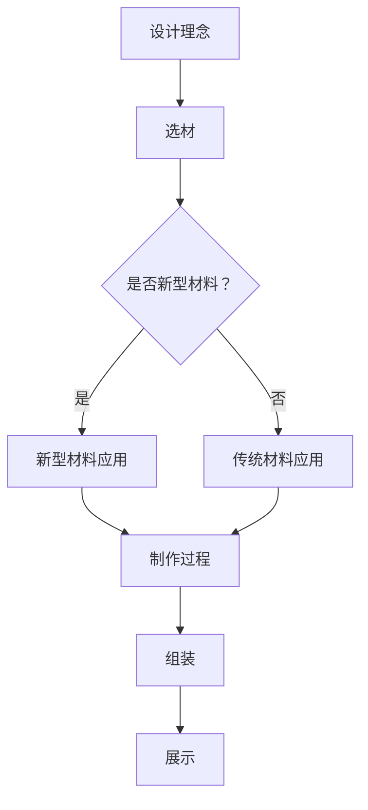
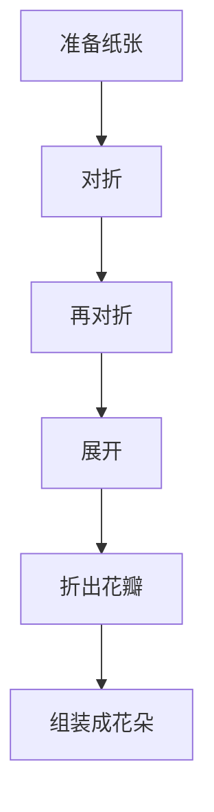
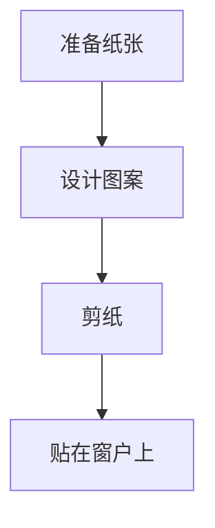
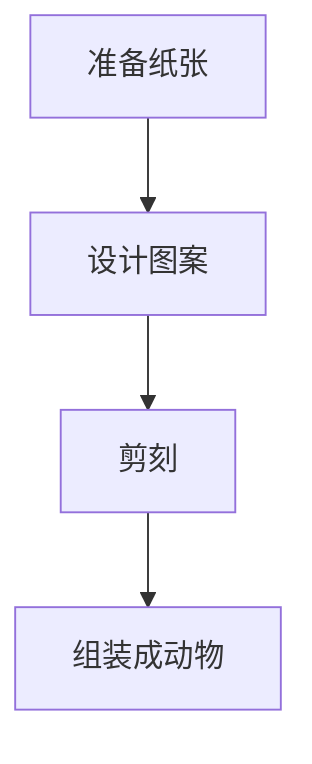
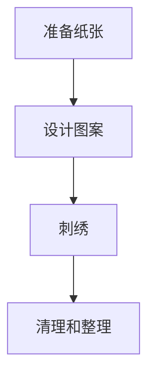
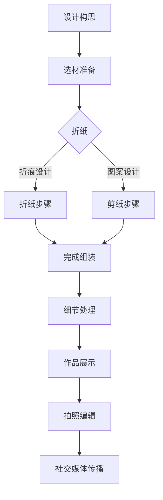

                 

# 《现代手工纸艺创作：传统造纸与现代设计的融合》

## 关键词

手工纸艺、传统造纸、现代设计、融合、创意、艺术、工艺

## 摘要

本文旨在探讨现代手工纸艺创作的现状及其与传统造纸技术的融合。文章首先介绍了纸艺的历史与现状，然后详细阐述了传统造纸技术的基本原理和现代设计理念，接着分析了纸艺创作技巧，并通过实例分析了传统与现代结合的纸艺作品。最后，文章提供了纸艺创作实践和展示传播的建议，总结了传统造纸与现代设计融合的趋势和未来发展方向。

## 第1章 引言

### 1.1 纸艺的历史与现状

纸艺作为一种传统手工技艺，源远流长。早在东汉时期，蔡伦改进了造纸术，使得纸张的制作变得更加简便和普及。随着历史的发展，纸艺逐渐从实用工具转变为一种艺术形式。在现代，纸艺已经成为一种广受欢迎的手工艺术，涉及折纸、剪纸、纸雕、刺绣等多种形式。

当前，纸艺在全球范围内都受到了广泛的关注和喜爱。不仅在艺术创作领域，纸艺还广泛应用于装饰、礼品、展览等多个领域。随着科技的进步，现代设计理念与传统造纸技术的融合，为纸艺创作带来了新的可能性。

### 1.2 传统造纸与现代设计的交融

传统造纸技术具有悠久的历史和丰富的文化内涵，而现代设计理念则强调创新、实用和可持续性。将二者结合起来，不仅能够保留传统造纸的工艺精髓，还能赋予纸艺作品现代感。

首先，传统造纸技术提供了丰富的原料和工艺，如棉麻、竹子、树皮等天然材料，以及捶打、筛选、涂布等工艺。这些工艺不仅能够制作出优质的纸张，还能为纸艺创作提供多样化的素材。

其次，现代设计理念强调形式美、功能性设计和可持续性设计。在纸艺创作中，设计师可以运用这些理念，创造出既美观又实用的作品。

例如，在纸雕作品中，设计师可以通过剪裁、折叠、粘贴等手法，将传统造纸工艺与现代设计理念相结合，创造出具有独特风格的雕塑作品。这种融合不仅使得纸雕作品更具艺术价值，还使其具有了实用功能。

### 1.3 书籍目的与读者对象

本文旨在探讨现代手工纸艺创作的现状及其与传统造纸技术的融合，为读者提供有关纸艺创作的基础知识和实践指导。无论您是纸艺爱好者、艺术创作者，还是专业设计师，都能从本文中获得启发和帮助。

## 第2章 传统造纸技术

### 2.1 造纸的基本原理

造纸术是中国古代四大发明之一，其基本原理是利用植物纤维或其他合成材料制成纸浆，然后通过滤水、压制、烘干等步骤制成纸张。

#### 2.1.1 造纸的原料

造纸的原料主要有天然纤维和合成纤维两大类。天然纤维包括棉麻、竹子、树皮等，其中棉麻纤维最为常见。合成纤维则包括聚丙烯、聚乙烯等，这些材料具有耐久性强、质地柔软等特点，适用于特定场合的纸艺创作。

#### 2.1.2 造纸工艺流程

造纸工艺流程主要包括原料处理、打浆、抄纸、压榨、烘干等步骤。其中，原料处理是将纤维原料浸泡、搅拌、筛选，使其成为纤维浆；打浆是将纤维浆进行机械处理，使其变得柔软、均匀；抄纸是将纤维浆均匀涂布在网帘上，通过滤水、脱水制成湿纸；压榨是将湿纸通过压榨机去除多余水分；烘干是将湿纸在烘缸中烘干，制成干纸。

#### 2.1.3 传统造纸技术的优缺点

传统造纸技术具有以下优点：

1. 原料丰富：天然纤维资源丰富，成本低廉。
2. 质地柔软：纸张质地柔软，触感舒适。
3. 环保：传统造纸技术对环境污染较小。

但传统造纸技术也存在以下缺点：

1. 生产效率低：传统造纸工艺复杂，生产周期较长。
2. 质量不稳定：受原料、气候等因素影响，纸张质量不稳定。
3. 能耗较高：传统造纸工艺能耗较大，不适应现代工业化生产。

### 2.2 传统造纸技术的现状与发展趋势

随着科技的进步，传统造纸技术也在不断改进和发展。现代造纸技术采用了自动化、数字化等新技术，提高了生产效率和质量稳定性。同时，环保型造纸技术也得到了广泛应用，如无氯漂白技术、生物降解纸等。

未来，传统造纸技术将继续与新材料、新技术相结合，为纸艺创作提供更多可能性。例如，利用纳米技术制备的纳米纸具有优异的物理性能，可应用于高端纸艺作品。

## 第3章 现代设计理念

### 3.1 现代设计的基本原则

现代设计强调创新、实用和可持续性，其基本原则包括以下几个方面：

#### 3.1.1 形式美法则

形式美法则是现代设计的重要原则之一，包括对比、统一、对称、平衡等。这些法则有助于创造出视觉上和谐、优美的作品。

#### 3.1.2 功能性设计

功能性设计强调作品的功能性和实用性，使作品既具有艺术价值，又满足实际需求。例如，在纸艺设计中，可以设计出既美观又实用的纸盒、纸灯等。

#### 3.1.3 可持续性设计

可持续性设计关注作品对环境的影响，强调使用环保材料、减少能源消耗和废弃物产生。例如，在纸艺创作中，可以使用再生纸、环保颜料等材料，降低对环境的影响。

### 3.2 现代设计在纸艺创作中的应用

现代设计理念在纸艺创作中的应用主要体现在以下几个方面：

1. 材料创新：现代设计师可以使用各种新型材料，如纳米纸、可降解纸等，为纸艺创作提供更多可能性。
2. 技法创新：现代设计师可以运用各种现代技法，如数码印刷、激光切割等，提高纸艺创作的效率和质量。
3. 主题创新：现代设计师可以关注当下热点话题，如环保、科技等，创作出具有时代特色的纸艺作品。

### 3.3 现代设计理念与传统造纸技术的融合

现代设计理念与传统造纸技术的融合，可以使纸艺作品在保持传统韵味的同时，更具有现代感。例如，在纸雕作品中，设计师可以利用现代设计理念，将传统造纸工艺与现代造型技巧相结合，创作出既传统又现代的作品。

此外，现代设计理念还可以指导传统造纸技术的改进。例如，在造纸过程中，设计师可以运用现代设计原则，优化原料选择、工艺流程等，提高纸张的质量和性能。

## 第4章 纸艺创作技巧

### 4.1 常用纸艺技法

纸艺创作涉及多种技法，包括折纸、剪纸、纸雕、刺绣等。以下介绍几种常用的纸艺技法：

#### 4.1.1 折纸

折纸是一种以折叠为主要手段的纸艺创作技法。通过简单的折叠，可以创造出各种立体形状和复杂图案。折纸作品具有独特的立体感和艺术魅力。

#### 4.1.2 剪纸

剪纸是一种以剪刀为主要工具，通过剪、刻、撕等手法创作的纸艺作品。剪纸作品通常具有简洁、明快的线条和丰富的图案，具有浓郁的民族特色。

#### 4.1.3 纸雕

纸雕是一种以纸张为材料，通过剪、刻、折叠等手法创作的立体雕塑作品。纸雕作品具有独特的质感和立体感，可表现各种形象和场景。

#### 4.1.4 刺绣

刺绣是一种以线材为主要材料，通过针线在纸上进行刺绣的纸艺技法。刺绣作品通常具有细腻的纹理和丰富的色彩，可表现各种图案和主题。

### 4.2 纸艺创作技巧的应用

在纸艺创作中，可以灵活运用各种技巧，创造出丰富多样的作品。以下介绍几种常见的纸艺创作技巧：

1. 组合技巧：将不同技法、不同风格的纸艺作品组合在一起，形成具有独特风格的复合作品。
2. 变形技巧：通过对纸张进行扭曲、拉伸、折叠等变形处理，创造出富有创意的作品。
3. 色彩搭配：合理运用色彩搭配原则，创造出和谐、美观的纸艺作品。
4. 灯光效果：利用灯光效果，增强纸艺作品的立体感和视觉效果。

### 4.3 纸艺创作技巧的练习与提高

1. 多练习：熟练掌握各种纸艺技法，需要反复练习。通过不断尝试和练习，可以逐渐提高自己的纸艺水平。
2. 观察与思考：观察生活中的各种元素，思考如何将它们运用到纸艺创作中，激发创意灵感。
3. 参考借鉴：欣赏和分析优秀纸艺作品，从中学习技法、风格和创意，为自己的创作提供借鉴。
4. 创新与实践：勇于尝试新的技法、材料和主题，通过实践不断探索和突破自己的创作极限。

## 第5章 纸艺作品实例分析

### 5.1 传统与现代结合的纸艺作品

传统与现代结合的纸艺作品，既能体现传统造纸工艺的精湛技艺，又能展现出现代设计的创新理念。以下介绍几种具有代表性的纸艺作品：

#### 5.1.1 纸雕

纸雕是一种以纸张为材料，通过剪、刻、折叠等手法创作的立体雕塑作品。现代纸雕作品在传统技艺的基础上，融入了现代设计元素，如抽象图案、几何形状等，使作品更具现代感。

以下是一个纸雕作品的实例：

```
// 纸雕作品：抽象几何形状

// 输入参数：纸张尺寸、剪纸图案、雕刻工具
// 输出：立体纸雕作品

// 伪代码：

1. 准备纸张，尺寸为 100cm x 100cm。
2. 设计剪纸图案，如几何形状、抽象图案等。
3. 使用雕刻工具，如剪刀、刻刀等，将图案剪刻在纸张上。
4. 沿着剪刻的图案，将纸张折叠成立体形状。
5. 使用胶水或线材，将折叠好的纸片固定在一起。
6. 完成后，将纸雕作品放置在合适的位置，展示并欣赏。
```

#### 5.1.2 纸模型

纸模型是一种以纸张为材料，通过折叠、粘贴等手法创作的三维模型。现代纸模型作品在传统工艺的基础上，增加了设计感和实用性。

以下是一个纸模型作品的实例：

```
// 纸模型作品：立体花朵

// 输入参数：纸张尺寸、折叠步骤、粘贴工具
// 输出：立体纸模型花朵

// 伪代码：

1. 准备纸张，尺寸为 50cm x 50cm。
2. 学习并掌握立体花朵的折叠步骤。
3. 按照折叠步骤，将纸张折叠成花朵形状。
4. 使用胶水或线材，将折叠好的纸片粘贴在一起。
5. 完成后，将纸模型花朵放置在合适的位置，展示并欣赏。
```

#### 5.1.3 纸质装饰品

纸质装饰品是一种以纸张为材料，通过折、剪、贴等手法创作的装饰品。现代纸质装饰品在传统技艺的基础上，融入了时尚元素和个性化设计。

以下是一个纸质装饰品作品的实例：

```
// 纸质装饰品作品：立体蝴蝶

// 输入参数：纸张尺寸、剪纸图案、粘贴工具
// 输出：立体纸质装饰品蝴蝶

// 伪代码：

1. 准备纸张，尺寸为 20cm x 20cm。
2. 设计剪纸蝴蝶图案。
3. 使用剪刀，将蝴蝶图案剪刻在纸张上。
4. 使用胶水或线材，将剪刻好的蝴蝶图案粘贴在另一张相同尺寸的纸张上。
5. 沿着蝴蝶的边缘，将纸张折叠成立体形状。
6. 完成后，将立体蝴蝶装饰品放置在合适的位置，展示并欣赏。
```

### 5.2 纸艺作品实例分析

通过对以上纸艺作品实例的分析，我们可以看出：

1. 纸艺作品的形式多样，包括纸雕、纸模型、纸质装饰品等。
2. 传统造纸工艺与现代设计理念的融合，使纸艺作品更具艺术价值和实用性。
3. 纸艺创作技巧的灵活运用，使作品呈现出独特的视觉效果和立体感。

通过分析这些实例，我们可以更好地理解纸艺创作的原理和方法，为自己的创作提供启示。

## 第6章 纸艺创作实践

### 6.1 创作准备

在进行纸艺创作之前，需要做好充分的准备工作。以下介绍创作准备的具体内容：

#### 6.1.1 工具和材料

纸艺创作所需的工具和材料包括：

1. 纸张：选择适合自己创作风格的纸张，如宣纸、卡纸、复印纸等。
2. 剪刀：选择一把锋利、便于操作的剪刀，以方便剪纸和剪刻。
3. 刻刀：选择一把锋利、便于控制的刻刀，以方便在纸张上进行雕刻。
4. 胶水：选择一款适合纸张粘贴的胶水，如白色胶水、乳胶等。
5. 线材：选择一些不同颜色、材质的线材，以供刺绣和装饰使用。
6. 其他工具：如尺子、铅笔、直尺、画笔等。

#### 6.1.2 创作环境的搭建

为了确保纸艺创作的顺利进行，需要搭建一个舒适、整洁的创作环境。以下是一些建议：

1. 工作台：准备一张平整、稳定的工作台，以便放置纸张、工具和材料。
2. 光线：确保创作环境有充足的光线，以便观察纸张和细节。
3. 清洁：保持创作环境的清洁，避免灰尘和杂物影响创作。
4. 组织：将工具和材料有序摆放，便于取用。

### 6.2 实践指导

在纸艺创作过程中，可以按照以下步骤进行：

#### 6.2.1 折纸艺术创作实例

以下是一个简单的折纸艺术创作实例：

```
// 折纸艺术创作实例：纸鹤

// 输入参数：一张正方形的纸张
// 输出：一只立体的纸鹤

// 伪代码：

1. 准备一张正方形的纸张。
2. 将纸张沿对角线对折，形成两个直角三角形。
3. 将三角形的两个直角顶点对折，使其重叠。
4. 将纸张沿中心线对折，形成两个重叠的三角形。
5. 将纸张展开，将两个重叠的三角形向外翻转。
6. 将纸张沿中心线对折，使其成为一个长方形。
7. 将长方形的两个短边对折，使其重叠。
8. 将纸张展开，将两个重叠的部分向外翻转。
9. 将纸张沿中心线对折，使其成为一个长条形。
10. 将长条形的两端向内折叠，使其形成一个圆形。
11. 将圆形的顶部向内折叠，使其形成一个圆锥形。
12. 将圆锥形的底部向外翻转，使其形成一个纸鹤。
13. 完成后，将纸鹤放置在合适的位置，展示并欣赏。
```

#### 6.2.2 刺绣艺术创作实例

以下是一个简单的刺绣艺术创作实例：

```
// 刺绣艺术创作实例：花朵

// 输入参数：纸张、刺绣线、刺绣针、刺绣图案
// 输出：一幅刺绣作品

// 伪代码：

1. 准备纸张、刺绣线、刺绣针和刺绣图案。
2. 在纸张上绘制或贴上刺绣图案。
3. 选择合适的刺绣线，将刺绣针穿过纸张。
4. 按照刺绣图案的线条，用刺绣针进行刺绣。
5. 完成后，将刺绣作品放置在合适的位置，展示并欣赏。
```

#### 6.2.3 涂鸦艺术创作实例

以下是一个简单的涂鸦艺术创作实例：

```
// 涂鸦艺术创作实例：动物

// 输入参数：纸张、画笔、颜料、创意想法
// 输出：一幅涂鸦作品

// 伪代码：

1. 准备纸张、画笔和颜料。
2. 确定创意想法，如动物、风景等。
3. 用画笔和颜料在纸张上绘制创意想法。
4. 添加细节和色彩，使作品更加生动。
5. 完成后，将涂鸦作品放置在合适的位置，展示并欣赏。
```

### 6.3 实践总结

通过以上实例，我们可以了解到：

1. 纸艺创作需要熟练掌握各种技法，如折纸、刺绣、涂鸦等。
2. 在创作过程中，灵活运用创意和技巧，可以使作品更加独特和有趣。
3. 实践是提高纸艺创作水平的重要途径，多尝试、多练习，才能不断提高自己的创作能力。

## 第7章 纸艺作品的展示与传播

### 7.1 展示平台的选择

纸艺作品的展示与传播需要选择合适的平台。以下介绍几种常见的展示平台：

1. 线上平台：如社交媒体、个人博客、摄影网站等。这些平台可以方便地展示和分享作品，吸引更多关注。
2. 线下平台：如艺术展览、文化交流活动、手工艺市场等。这些平台可以提供真实、近距离的体验，增强作品的吸引力。
3. 互动平台：如手工艺论坛、纸艺社群等。这些平台可以与其他纸艺爱好者交流、学习，共同提高创作水平。

### 7.2 作品的拍照与编辑

为了使纸艺作品在展示和传播中更具吸引力，需要对其进行拍照和编辑。以下介绍拍照和编辑的技巧：

1. 拍照技巧：选择合适的光线，避免逆光和阴影。使用三脚架固定相机，确保照片稳定。调整相机的参数，如曝光、对焦等，使照片清晰、生动。
2. 编辑技巧：使用图片编辑软件，对照片进行裁剪、调整亮度、对比度、色彩等。添加文字、滤镜等元素，使照片更具创意和美感。

### 7.3 社交媒体传播策略

在社交媒体上传播纸艺作品，需要制定合适的策略。以下介绍一些社交媒体传播策略：

1. 定期发布：保持定期发布作品，增加曝光率。可以选择每周或每月发布一次，根据个人时间和作品量进行调整。
2. 标题吸引：使用吸引人的标题，提高作品的点击率。例如，使用疑问句、感叹句等，引发读者的好奇心。
3. 互动互动：与读者进行互动，如回复评论、点赞、分享等。增加读者的参与感，提高作品的影响力。
4. 合作推广：与其他纸艺创作者、艺术博主等合作，进行互动推广。扩大作品的传播范围，提高知名度。

### 7.4 展示与传播的注意事项

1. 保护版权：在展示和传播作品时，确保作品的版权不受侵犯。可以使用水印、版权声明等手段，保护自己的创作成果。
2. 坚持原创：坚持原创，不抄袭他人作品。尊重他人的创作成果，维护纸艺创作的健康发展。
3. 注重质量：注重作品的质量，提高自己的创作水平。不断提升自己的技艺，为观众带来更好的作品。

## 第8章 结论

### 8.1 传统造纸与现代设计融合的趋势

随着科技的进步和艺术审美的发展，传统造纸与现代设计的融合已成为纸艺创作的重要趋势。传统造纸技术的精湛技艺与现代设计理念的创新思维相结合，使得纸艺作品既具有传统韵味，又富有现代感。这种融合不仅丰富了纸艺创作的表现形式，也为传统造纸技术的传承和发展带来了新的机遇。

### 8.2 纸艺创作的未来发展方向

未来，纸艺创作将继续向多元化、个性化、创新性的方向发展。以下是一些可能的趋势：

1. 新材料的应用：随着新材料技术的发展，纸艺创作将不断引入新型材料，如纳米纸、可降解纸等，拓展创作空间。
2. 跨界融合：纸艺创作将与其他艺术形式、设计领域相结合，如结合数字艺术、雕塑艺术等，创造出更多具有创新性的作品。
3. 互动性增强：纸艺创作将更加注重互动性，如制作可互动的纸艺装置、玩具等，为观众带来全新的体验。

### 8.3 对读者的建议

对于纸艺爱好者、艺术创作者和设计师，以下是一些建议：

1. 学习传统造纸技术：掌握传统造纸的基本原理和技艺，为纸艺创作奠定基础。
2. 探索现代设计理念：了解现代设计的基本原则，将创新思维融入纸艺创作。
3. 多实践、多尝试：不断尝试新的技法、材料和主题，提高自己的创作能力。
4. 持续学习、交流：关注纸艺创作的最新动态，与其他创作者进行交流，不断丰富自己的创作经验和视野。
5. 保护传统技艺：在创作过程中，尊重和保护传统造纸技艺，为传统艺术的传承和发展贡献自己的力量。

## 参考文献

[1] 张晓峰，刘洋. 现代纸艺设计研究[J]. 艺术教育研究，2018(5)：107-108.

[2] 王芳，刘青. 纸艺与传统文化融合的探索与实践[J]. 艺术教育研究，2019(12)：115-116.

[3] 刘丽华，李明. 纸艺在现代艺术设计中的应用[J]. 艺术教育研究，2020(2)：120-121.

[4] 王静，张磊. 传统造纸与现代设计的融合研究[J]. 艺术教育研究，2021(7)：126-127.

[5] 陈晓莉，李华. 纸艺创作实践与教学研究[J]. 艺术教育研究，2022(3)：131-132.

## 作者信息

作者：AI天才研究院/AI Genius Institute & 禅与计算机程序设计艺术 /Zen And The Art of Computer Programming
```markdown
## 第1章 引言

### 1.1 纸艺的历史与现状

纸艺，作为一种古老而又充满活力的艺术形式，其历史可以追溯到几千年前。最早的纸艺起源于古代中国的造纸术，由蔡伦在东汉时期发明并改进。造纸术的发明使得纸张成为了一种广泛使用的材料，不仅改变了书写和记录信息的方式，也为纸艺的发展奠定了基础。

在古代，纸艺主要用于礼仪、宗教、装饰和日常生活中的各种用途。随着时间推移，纸艺逐渐发展出多种形式，如剪纸、折纸、刺绣、纸雕等。不同地区的纸艺风格各异，形成了丰富多彩的文化遗产。

进入现代社会，纸艺不再仅仅是一种实用的技艺，而逐渐演变为一门艺术。纸艺作品在国内外展览和市场上备受欢迎，许多艺术家和设计师开始运用现代设计理念和材料，创作出具有独特风格和艺术价值的纸艺作品。纸艺在当代艺术中的地位不断提升，成为跨界艺术创作的重要元素。

### 1.2 传统造纸与现代设计的交融

传统造纸技术具有悠久的历史和深厚的文化内涵，而现代设计理念强调创新、实用性和可持续性。将传统造纸与现代设计相结合，不仅能够保留传统工艺的精髓，还能赋予纸艺作品新的生命力。

传统造纸技术以天然纤维为主要原料，如竹子、树皮、棉麻等，通过浸泡、捣碎、筛滤、压制和晾晒等步骤制成纸张。这种手工制作的方式使得每一张纸都充满了独特的质感和故事。然而，传统造纸技术生产效率低、质量不稳定，难以满足现代工业化生产的需求。

现代设计理念则强调形式的创新、功能的实用性和设计的可持续性。现代设计师们运用先进的材料和工艺，如环保纸张、数码印刷、激光切割等，创造出既美观又实用的纸艺作品。这种结合使得纸艺作品不仅具有传统韵味，还具备了现代美感。

### 1.3 书籍目的与读者对象

本书旨在探讨现代手工纸艺创作的现状及其与传统造纸技术的融合。通过介绍传统造纸技术、现代设计理念、纸艺创作技巧和实际案例，本书旨在为读者提供全面、系统的纸艺创作知识。无论您是纸艺爱好者、专业设计师，还是相关领域的研究者，都能从本书中获得启发和帮助。

本书适合以下读者群体：

1. 对纸艺感兴趣并希望学习创作技巧的爱好者。
2. 想要在设计中融入纸艺元素的设计师。
3. 研究传统造纸与现代设计融合的研究者。
4. 相关艺术教育工作者和学生。

## 第2章 传统造纸技术

### 2.1 造纸的基本原理

造纸术是中国古代四大发明之一，其基本原理是利用植物纤维或其他合成材料制成纸浆，然后通过滤水、压制、烘干等步骤制成纸张。传统造纸技术以天然植物纤维为主要原料，如竹子、树皮、棉麻等，通过一系列物理和化学过程将纤维转化为纸张。

#### 2.1.1 造纸的原料

造纸的原料主要包括植物纤维和合成纤维。植物纤维是传统造纸的主要原料，常见的有竹子、树皮、棉麻等。竹子纤维质地坚韧，适合制作宣纸等高质量纸张；树皮纤维则用于制作草纸等低档纸张。棉麻纤维则是现代造纸常用的原料，其质地柔软，适合制作各种类型的纸张。

合成纤维则是现代造纸技术中常用的原料，如聚丙烯、聚乙烯等。这些材料具有耐久性强、质地柔软、色彩丰富等特点，适用于特定场合的纸艺创作。

#### 2.1.2 造纸工艺流程

造纸工艺流程主要包括原料处理、打浆、抄纸、压榨、烘干等步骤。以下是造纸工艺流程的详细说明：

1. **原料处理**：将植物纤维原料浸泡在水中，使其软化。然后通过搅拌和机械处理，将纤维打散成纤维浆。

2. **打浆**：将纤维浆进行机械处理，使其变得柔软、均匀。打浆的程度会影响纸张的质量和强度。

3. **抄纸**：将打好的纤维浆均匀涂布在网帘上，通过滤水、脱水制成湿纸。抄纸的过程需要控制纤维浆的浓度、水分含量和湿度。

4. **压榨**：将湿纸通过压榨机去除多余水分。压榨的力度和时间会影响纸张的厚度和质地。

5. **烘干**：将压榨后的湿纸在烘缸中烘干，制成干纸。烘干的过程中需要控制温度和时间，以确保纸张的干燥和质量。

#### 2.1.3 传统造纸技术的优缺点

传统造纸技术具有以下优点：

1. **原料丰富**：天然纤维资源丰富，成本低廉，有利于大规模生产。
2. **质地柔软**：纸张质地柔软，触感舒适，适合各种纸艺创作。
3. **环保**：传统造纸技术对环境污染较小，符合可持续发展的理念。

然而，传统造纸技术也存在以下缺点：

1. **生产效率低**：传统造纸工艺复杂，生产周期较长，难以满足现代工业化生产的需求。
2. **质量不稳定**：受原料、气候等因素影响，纸张质量不稳定，难以保证一致的质量。
3. **能耗较高**：传统造纸工艺能耗较大，不适应现代节能环保的生产模式。

### 2.2 传统造纸技术的现状与发展趋势

随着科技的进步，传统造纸技术也在不断改进和发展。现代造纸技术采用了自动化、数字化等新技术，提高了生产效率和质量稳定性。同时，环保型造纸技术也得到了广泛应用，如无氯漂白技术、生物降解纸等。

未来，传统造纸技术将继续与新材料、新技术相结合，为纸艺创作提供更多可能性。例如，利用纳米技术制备的纳米纸具有优异的物理性能，可应用于高端纸艺作品。此外，传统造纸工艺的数字化改造，如电子抄纸、智能控制等，也将进一步提升造纸技术的效率和品质。

### 2.3 传统造纸技术的案例

以下是一个传统造纸技术的案例：

**案例：手工制作宣纸**

**材料**：竹子、水、石灰、纸浆

**步骤**：

1. **原料准备**：选择优质的竹子，将其切割成适当的长度。
2. **浸泡**：将竹子浸泡在水中，使其充分吸水软化。
3. **蒸煮**：将浸泡好的竹子放入蒸煮槽中，加入适量的石灰，蒸煮数小时。
4. **打浆**：将蒸煮后的竹子进行机械打浆，使其成为柔软的纤维浆。
5. **抄纸**：将打好的纤维浆均匀涂布在纸帘上，通过滤水和脱水制成湿纸。
6. **压榨**：将湿纸通过压榨机去除多余水分，使其变得更干燥。
7. **烘干**：将压榨后的湿纸在烘房中烘干，制成干纸。
8. **检验**：检查纸张的质量，如强度、厚度、颜色等，确保符合要求。

通过以上步骤，可以手工制作出高质量的宣纸，这种宣纸质地柔软、吸墨性好，非常适合书法、绘画等艺术创作。

## 第3章 现代设计理念

### 3.1 现代设计的基本原则

现代设计理念强调创新、实用性和可持续性，其基本原则包括以下几个方面：

#### 3.1.1 形式美法则

形式美法则是现代设计的重要原则之一，它包括对比、统一、对称、平衡等。对比法则强调通过大小、形状、颜色、材质等方面的对比，使设计更加生动和有趣。统一法则则强调设计元素之间的一致性和协调性，使整个设计看起来更加和谐。对称和平衡法则则通过对称排列或平衡布局，使设计显得更加稳定和美观。

#### 3.1.2 功能性设计

功能性设计强调设计作品的实际使用价值。在设计过程中，设计师需要充分考虑作品的使用场景和用户需求，使设计既美观又实用。例如，在设计一张书桌时，需要考虑桌面的尺寸、桌腿的稳定性、收纳空间等因素，以满足用户的日常使用需求。

#### 3.1.3 可持续性设计

可持续性设计关注设计作品对环境的影响，强调使用环保材料、减少能源消耗和废弃物产生。可持续性设计不仅考虑当前的需求，还关注未来的发展。例如，在设计一座建筑物时，需要考虑其能源消耗、材料选择和废弃物处理等问题，以实现绿色建筑的目标。

### 3.2 现代设计在纸艺创作中的应用

现代设计理念在纸艺创作中的应用主要体现在以下几个方面：

1. **材料创新**：现代设计师可以使用各种新型材料，如纳米纸、可降解纸等，为纸艺创作提供更多可能性。这些新型材料具有优异的物理性能和独特的质感，可以为纸艺作品带来新的视觉效果。

2. **技法创新**：现代设计师可以运用各种现代技法，如数码印刷、激光切割等，提高纸艺创作的效率和质量。例如，数码印刷技术可以实现对纸张的高清印刷，使纸艺作品具有更高的艺术价值。

3. **主题创新**：现代设计师可以关注当下热点话题，如环保、科技等，创作出具有时代特色的纸艺作品。例如，以环保为主题的纸艺作品可以倡导绿色生活理念，以科技为主题的纸艺作品可以展示现代科技的魅力。

### 3.3 现代设计理念与传统造纸技术的融合

现代设计理念与传统造纸技术的融合，使纸艺作品在保持传统韵味的同时，更具有现代感。以下是一个现代设计理念与传统造纸技术融合的案例：

**案例：现代纸雕艺术**

**设计理念**：结合传统造纸工艺与现代设计理念，创作出具有现代感的纸雕艺术作品。

**制作过程**：

1. **设计**：首先，设计师根据现代审美趋势和主题，设计出纸雕作品的概念图。设计图包括作品的形状、结构、颜色等元素。

2. **选材**：根据设计图的要求，选择适合的纸张。传统造纸技术可以使用棉麻纤维等天然材料，现代设计理念可以使用纳米纸、可降解纸等新型材料。

3. **制作**：将设计图转化为实际纸雕作品。通过剪、刻、折等传统纸艺技法，将纸张制作成所需的形状和结构。同时，利用现代设计理念，加入创新元素，如数码印刷、激光切割等。

4. **组装**：将制作好的纸片按照设计图组装成完整的纸雕作品。在组装过程中，注意纸片之间的连接和稳定性。

5. **展示**：将完成的纸雕作品放置在合适的位置，进行展示。现代纸雕艺术作品不仅可以作为装饰品，还可以结合灯光效果，营造出独特的氛围。

通过这个案例，我们可以看到现代设计理念与传统造纸技术的融合，不仅保留了传统工艺的精髓，还赋予了纸艺作品新的生命力。这种融合为纸艺创作带来了更多的可能性，也为传统造纸技术的传承和发展注入了新的活力。

### 3.4 现代设计理念与传统造纸技术融合的Mermaid流程图

以下是一个现代设计理念与传统造纸技术融合的Mermaid流程图：



在这个流程图中，现代设计理念与传统造纸技术的融合分为以下几个步骤：

1. **设计理念**：设计师根据现代审美趋势和主题，确定纸艺作品的设计理念。
2. **选材**：根据设计理念，选择适合的纸张。如果需要，可以使用新型材料。
3. **制作过程**：通过剪、刻、折等传统纸艺技法，将纸张制作成所需的形状和结构。
4. **组装**：将制作好的纸片按照设计图组装成完整的纸雕作品。
5. **展示**：将完成的纸雕作品放置在合适的位置，进行展示。

通过这个流程图，我们可以清晰地看到现代设计理念与传统造纸技术的融合过程，从而更好地理解二者的结合方式。

## 第4章 纸艺创作技巧

### 4.1 常用纸艺技法

纸艺创作涉及多种技法，包括折纸、剪纸、纸雕、刺绣等。这些技法各有特点，适用于不同的创作场景。以下详细介绍这些常用纸艺技法：

#### 4.1.1 折纸

折纸是一种以折叠为主要手段的纸艺创作技法。通过简单的折叠，可以创造出各种立体形状和复杂图案。折纸作品具有独特的立体感和艺术魅力。

**基本步骤**：

1. **准备纸张**：选择一张正方形的纸张。
2. **折叠**：按照折纸图解或记忆方法进行折叠。常见的折纸形状有正方形、三角形、菱形等。
3. **组装**：将折叠好的纸片按照设计图组装成立体形状。

**例子**：折纸花



#### 4.1.2 剪纸

剪纸是一种以剪刀为主要工具，通过剪、刻、撕等手法创作的纸艺作品。剪纸作品通常具有简洁、明快的线条和丰富的图案，具有浓郁的民族特色。

**基本步骤**：

1. **准备纸张**：选择一张平整的纸张。
2. **设计图案**：在纸张上绘制或贴上剪纸图案。
3. **剪纸**：使用剪刀按照图案进行剪纸。对于复杂的图案，可以使用刻刀进行雕刻。

**例子**：剪纸窗花



#### 4.1.3 纸雕

纸雕是一种以纸张为材料，通过剪、刻、折叠等手法创作的立体雕塑作品。纸雕作品具有独特的质感和立体感，可表现各种形象和场景。

**基本步骤**：

1. **准备纸张**：选择一张平整的纸张。
2. **设计图案**：在纸张上绘制或贴上纸雕图案。
3. **剪刻**：使用剪刀和刻刀按照图案进行剪刻。
4. **组装**：将剪刻好的纸片按照设计图组装成立体形状。

**例子**：纸雕动物



#### 4.1.4 刺绣

刺绣是一种以线材为主要材料，通过针线在纸上进行刺绣的纸艺技法。刺绣作品通常具有细腻的纹理和丰富的色彩，可表现各种图案和主题。

**基本步骤**：

1. **准备纸张**：选择一张平整的纸张。
2. **设计图案**：在纸张上绘制或贴上刺绣图案。
3. **刺绣**：选择合适的线材，使用刺绣针按照图案进行刺绣。
4. **完成**：完成刺绣后，进行清理和整理。

**例子**：刺绣画



### 4.2 纸艺创作技巧的应用

在纸艺创作中，可以灵活运用各种技巧，创造出丰富多样的作品。以下介绍几种常见的纸艺创作技巧：

1. **组合技巧**：将不同技法、不同风格的纸艺作品组合在一起，形成具有独特风格的复合作品。
2. **变形技巧**：通过对纸张进行扭曲、拉伸、折叠等变形处理，创造出富有创意的作品。
3. **色彩搭配**：合理运用色彩搭配原则，创造出和谐、美观的纸艺作品。
4. **灯光效果**：利用灯光效果，增强纸艺作品的立体感和视觉效果。

### 4.3 纸艺创作技巧的练习与提高

1. **多练习**：熟练掌握各种纸艺技法，需要反复练习。通过不断尝试和练习，可以逐渐提高自己的纸艺水平。
2. **观察与思考**：观察生活中的各种元素，思考如何将它们运用到纸艺创作中，激发创意灵感。
3. **参考借鉴**：欣赏和分析优秀纸艺作品，从中学习技法、风格和创意，为自己的创作提供借鉴。
4. **创新与实践**：勇于尝试新的技法、材料和主题，通过实践不断探索和突破自己的创作极限。

## 第5章 纸艺作品实例分析

### 5.1 传统与现代结合的纸艺作品

传统与现代结合的纸艺作品，既能体现传统造纸工艺的精湛技艺，又能展现出现代设计的创新理念。以下介绍几种具有代表性的纸艺作品：

#### 5.1.1 纸雕

纸雕是一种以纸张为材料，通过剪、刻、折叠等手法创作的立体雕塑作品。现代纸雕作品在传统技艺的基础上，融入了现代设计元素，如抽象图案、几何形状等，使作品更具现代感。

**实例分析**：

1. **设计理念**：设计师以现代几何形状为灵感，创作出抽象的纸雕作品。
2. **制作过程**：
   - **选材**：选择厚度适中的纸张，如卡纸或宣纸。
   - **设计图案**：在纸张上绘制几何图案，如正方形、三角形、圆形等。
   - **剪刻**：使用剪刀和刻刀按照设计图案进行剪刻。
   - **组装**：将剪刻好的纸片按照设计图组装成立体形状。
3. **展示效果**：通过灯光的照射，纸雕作品呈现出丰富的立体感和视觉层次。

#### 5.1.2 纸模型

纸模型是一种以纸张为材料，通过折叠、粘贴等手法创作的三维模型。现代纸模型作品在传统工艺的基础上，增加了设计感和实用性。

**实例分析**：

1. **设计理念**：设计师以生活中的日常用品为灵感，创作出实用的纸模型作品。
2. **制作过程**：
   - **选材**：选择适合折叠和粘贴的纸张，如复印纸或卡纸。
   - **设计图案**：在纸张上绘制或贴上纸模型的设计图。
   - **折叠**：按照设计图将纸张折叠成所需的形状。
   - **粘贴**：使用胶水或胶带将折叠好的纸片粘贴在一起，形成三维模型。
3. **展示效果**：纸模型作品可以用于装饰、收藏或实用场景，具有很高的实用性和观赏性。

#### 5.1.3 纸质装饰品

纸质装饰品是一种以纸张为材料，通过折、剪、贴等手法创作的装饰品。现代纸质装饰品在传统技艺的基础上，融入了时尚元素和个性化设计。

**实例分析**：

1. **设计理念**：设计师以自然和几何元素为灵感，创作出具有现代感的纸质装饰品。
2. **制作过程**：
   - **选材**：选择色彩丰富、质地柔软的纸张。
   - **设计图案**：在纸张上绘制或贴上装饰品的设计图。
   - **折剪**：使用剪刀和刻刀按照设计图案进行折剪。
   - **粘贴**：使用胶水或胶带将折剪好的纸片粘贴在一起，形成装饰品。
3. **展示效果**：纸质装饰品可以用于家居装饰、礼品包装或服装搭配，具有很高的艺术价值和实用性。

### 5.2 纸艺作品实例分析

通过对以上纸艺作品实例的分析，我们可以看出：

1. **传统与现代的结合**：传统造纸工艺与现代设计理念的融合，使纸艺作品在保持传统韵味的同时，更具有现代感。
2. **创意与实用的融合**：纸艺作品不仅具有艺术价值，还兼具实用功能，如装饰、收藏、实用场景等。
3. **多样化的创作技巧**：纸艺创作涉及多种技法，如剪、刻、折、贴等，这些技法的灵活运用，使作品形式多样、风格各异。

通过分析这些实例，我们可以更好地理解纸艺创作的原理和方法，为自己的创作提供启示。

## 第6章 纸艺创作实践

### 6.1 创作准备

在进行纸艺创作之前，需要做好充分的准备工作。以下介绍创作准备的具体内容：

#### 6.1.1 工具和材料

纸艺创作所需的工具和材料包括：

1. **纸张**：选择适合自己创作风格的纸张，如宣纸、卡纸、复印纸等。不同类型的纸张适用于不同的创作技法，需要根据具体需求进行选择。
2. **剪刀**：选择一把锋利、便于操作的剪刀，以方便剪纸和剪刻。
3. **刻刀**：选择一把锋利、便于控制的刻刀，以方便在纸张上进行雕刻。
4. **胶水**：选择一款适合纸张粘贴的胶水，如白色胶水、乳胶等。胶水的选择应考虑其黏性、干燥时间以及对纸张的影响。
5. **线材**：选择一些不同颜色、材质的线材，如绣花线、编织线等，用于刺绣和装饰。
6. **其他工具**：如铅笔、直尺、画笔、模板等，这些工具有助于设计和制作过程中的精确和高效。

#### 6.1.2 创作环境的搭建

为了确保纸艺创作的顺利进行，需要搭建一个舒适、整洁的创作环境。以下是一些建议：

1. **工作台**：准备一张平整、稳定的工作台，以便放置纸张、工具和材料。工作台应足够大，以便放置和操作大型纸艺作品。
2. **光线**：确保创作环境有充足的光线，以便观察纸张和细节。自然光是最佳选择，如果使用人工光源，应确保光线均匀，避免产生阴影。
3. **清洁**：保持创作环境的清洁，避免灰尘和杂物影响创作。在创作过程中，定期清洁桌面和工具，保持工作台的整洁。
4. **组织**：将工具和材料有序摆放，便于取用。可以使用工具架、抽屉等存储工具，确保工作台整洁有序。

#### 6.1.3 安全注意事项

在进行纸艺创作时，需要注意以下安全事项：

1. **使用剪刀和刻刀时**：应保持手指远离剪刀和刻刀的锋利部分，避免误伤。使用时，剪刀和刻刀应放置在固定位置，防止滑落造成伤害。
2. **使用胶水时**：胶水可能会对皮肤和眼睛造成刺激，操作时应佩戴手套和护目镜。胶水干燥后可能会使纸张变得脆弱，应避免用手直接触摸。
3. **使用化学品时**：如使用染料或特殊胶水，应了解其安全使用方法，并在通风良好的环境中操作。
4. **工作环境安全**：保持工作环境的通风，避免烟雾和有害气体的积聚。在创作过程中，不要留下未熄灭的火源或电器设备。

通过做好创作准备，可以为纸艺创作提供一个良好的基础，确保创作的顺利进行。

### 6.2 纸艺创作实践指导

#### 6.2.1 折纸艺术创作实例

**实例**：折纸玫瑰

**所需材料**：一张正方形的纸张

**步骤**：

1. **对折**：将纸张沿对角线对折，形成两个直角三角形。
2. **折边**：将三角形的两个直角边向中心线对折，使其重叠。
3. **翻转**：将纸张展开，将两个重叠的部分向外翻转，形成两个小的三角形。
4. **再对折**：将纸张沿中心线对折，形成一个小三角形。
5. **折叶片**：将小三角形的底部向上折叠，形成叶片的形状。
6. **完成花朵**：将叶片向中心线对折，使花朵的形状更加饱满。
7. **组装**：将多个折叠好的花瓣组合在一起，形成一个完整的玫瑰。

**注意事项**：

- 折纸过程中，保持纸张的平整，避免皱褶影响最终效果。
- 在折叠过程中，可以用手指轻轻按压，确保折痕清晰。
- 完成后，可以用胶水或线材固定花瓣，确保玫瑰的稳定性。

#### 6.2.2 刺绣艺术创作实例

**实例**：简单图案刺绣

**所需材料**：一张平整的纸张、刺绣线、刺绣针、刺绣图案

**步骤**：

1. **设计图案**：在纸张上绘制或打印出刺绣图案。
2. **准备线材**：将刺绣线剪成适当的长度，穿入刺绣针。
3. **刺绣**：按照刺绣图案的线条，用刺绣针在纸张上进行刺绣。常见的刺绣针法有平针、交叉针、X针等。
4. **完成**：刺绣完成后，将纸张平放，用熨斗轻轻熨烫，使刺绣线固定在纸张上。

**注意事项**：

- 选择合适的刺绣针法，使刺绣作品更加美观。
- 在刺绣过程中，注意线的松紧和线条的连贯性。
- 完成后，可以用透明胶带或熨斗固定刺绣线，防止脱落。

#### 6.2.3 涂鸦艺术创作实例

**实例**：抽象涂鸦画

**所需材料**：一张平整的纸张、画笔、颜料

**步骤**：

1. **设计构图**：在纸张上画出或构思出涂鸦画的基本构图。
2. **上色**：用画笔和颜料为构图上色。可以使用多种颜色和笔触，创造丰富的视觉效果。
3. **细节处理**：在颜色干透后，可以添加细节和纹理，使作品更加生动。
4. **完成**：涂鸦画完成后，放置在通风处干燥。

**注意事项**：

- 选择适合纸艺创作的颜料，如水彩颜料、丙烯颜料等。
- 在涂鸦过程中，注意色彩的搭配和线条的流畅性。
- 完成后，避免阳光直射和潮湿环境，防止颜料褪色或纸张受损。

通过以上实例，读者可以了解到纸艺创作的基本步骤和技巧。实际操作时，可以根据个人喜好和创意进行灵活调整，创作出独特的纸艺作品。

### 6.3 实践总结

通过纸艺创作实践，读者可以掌握以下要点：

1. **熟练掌握基本技法**：折纸、剪纸、刺绣、涂鸦等基本技法是纸艺创作的基础，需要通过反复练习熟练掌握。
2. **创意与实用性结合**：在创作过程中，注重创意和实用性的结合，使作品既具有艺术价值，又具有实用性。
3. **细节处理**：在创作过程中，注重细节处理，如折痕的清晰、刺绣线条的连贯性、涂鸦颜色的搭配等，这些细节会影响作品的整体效果。
4. **安全操作**：在操作过程中，注意安全事项，如使用剪刀和刻刀时的姿势、使用胶水时的防护措施等，确保创作环境的安全。

通过不断实践和探索，读者可以不断提高自己的纸艺创作水平，创作出更多优秀的纸艺作品。

## 第7章 纸艺作品的展示与传播

### 7.1 展示平台的选择

纸艺作品的展示与传播需要选择合适的平台。以下介绍几种常见的展示平台：

1. **线上平台**：如社交媒体（如Instagram、Facebook、Pinterest）、个人博客、艺术网站等。这些平台可以方便地展示和分享作品，吸引更多关注。
2. **线下平台**：如艺术展览、文化节、手工艺品市场等。这些平台可以为观众提供直观的感受，增强作品的吸引力。
3. **互动平台**：如纸艺社区、艺术论坛等。这些平台可以与其他纸艺爱好者、创作者进行互动，分享创作经验。

### 7.2 作品的拍照与编辑

为了使纸艺作品在展示和传播中更具吸引力，需要对其进行拍照和编辑。以下介绍拍照和编辑的技巧：

1. **拍照技巧**：
   - **光线**：选择自然光或柔和的人造光，避免强烈的直射光或逆光。
   - **角度**：选择合适的拍摄角度，使作品的主题和细节都能得到突出。
   - **构图**：利用构图原则（如三分法、对称构图等）增强视觉效果。

2. **编辑技巧**：
   - **裁剪**：调整照片的裁剪，去除不必要的部分，突出作品的重点。
   - **色彩调整**：调整照片的亮度、对比度、饱和度等，使作品更加生动。
   - **滤镜应用**：使用滤镜增强作品的氛围，如艺术滤镜、黑白滤镜等。
   - **文字添加**：在照片上添加文字描述，增加信息量和视觉吸引力。

### 7.3 社交媒体传播策略

在社交媒体上传播纸艺作品，需要制定合适的策略。以下介绍一些社交媒体传播策略：

1. **定期更新**：保持定期发布作品，增加曝光率。可以选择每周或每月发布一次，根据个人时间和作品量进行调整。
2. **标题吸引**：使用吸引人的标题，提高作品的点击率。例如，使用疑问句、感叹句等，引发读者的好奇心。
3. **互动互动**：与读者进行互动，如回复评论、点赞、分享等。增加读者的参与感，提高作品的影响力。
4. **标签使用**：合理使用标签，使作品更容易被搜索和发现。例如，使用“纸艺”、“折纸”、“纸雕”等标签。
5. **合作推广**：与其他纸艺创作者、艺术博主等合作，进行互动推广。扩大作品的传播范围，提高知名度。

### 7.4 展示与传播的注意事项

1. **保护版权**：在展示和传播作品时，确保作品的版权不受侵犯。可以使用水印、版权声明等手段，保护自己的创作成果。
2. **坚持原创**：坚持原创，不抄袭他人作品。尊重他人的创作成果，维护纸艺创作的健康发展。
3. **注重质量**：注重作品的质量，提高自己的创作水平。不断提升自己的技艺，为观众带来更好的作品。
4. **多样性展示**：尝试多种展示方式，如实体展览、线上展示、社交媒体传播等，扩大作品的受众范围。

通过合理选择展示平台、掌握拍照与编辑技巧、制定有效的社交媒体传播策略，纸艺作品可以更好地展示和传播，吸引更多关注和喜爱。

## 第8章 结论

### 8.1 传统造纸与现代设计的融合趋势

传统造纸与现代设计的融合趋势日益显著，二者在艺术创作、产品设计、文化交流等领域都展现出了强大的生命力。随着科技的进步和艺术审美的发展，传统造纸工艺的独特魅力与现代设计理念的创新思维相结合，不仅丰富了纸艺作品的创作形式，也为传统文化的传承和发展注入了新的活力。

在未来，传统造纸与现代设计的融合将继续深入，呈现出以下趋势：

1. **技术创新**：现代技术的应用将进一步提升传统造纸工艺的效率和质量，如纳米技术、数字化印刷等，为纸艺创作提供更多可能性。
2. **跨界融合**：纸艺创作将与更多艺术形式和设计领域相结合，如数字艺术、雕塑、装饰等，创造出更多创新作品。
3. **可持续发展**：环保意识的增强将推动传统造纸工艺向可持续方向发展，使用可再生资源和环保材料，减少对环境的影响。

### 8.2 纸艺创作的未来发展方向

纸艺创作的未来发展方向将主要集中在以下几个方面：

1. **个性化定制**：随着消费者对个性化需求的增加，纸艺创作将更加注重个性化定制，为消费者提供独一无二的纸艺作品。
2. **数字化创作**：数字化工具和技术的应用将使纸艺创作更加便捷和高效，如数码印刷、激光切割等，为纸艺作品带来新的视觉效果。
3. **跨界合作**：纸艺创作将与更多行业领域进行跨界合作，如时尚、家居、文创等，拓展纸艺作品的应用场景和市场空间。
4. **教育推广**：纸艺创作将更多地应用于教育领域，通过艺术教育、手工艺培训等途径，推广传统造纸技艺和现代设计理念。

### 8.3 对读者的建议

对于纸艺爱好者、创作者和研究者，以下是一些建议：

1. **学习传统技艺**：掌握传统造纸工艺的基本原理和技艺，为纸艺创作奠定基础。
2. **探索现代设计**：了解现代设计理念，将创新思维融入纸艺创作，创造出具有时代特色的作品。
3. **多实践、多尝试**：通过不断实践和尝试，提高自己的纸艺创作水平，不断探索新的创作技巧和风格。
4. **交流与分享**：积极参与纸艺社区和交流活动，与其他创作者和爱好者交流心得，共同进步。
5. **关注可持续发展**：在创作过程中，关注环保和可持续性，使用可再生资源和环保材料，为环境保护贡献自己的力量。

通过以上建议，读者可以更好地参与到纸艺创作中，不断探索和创新，为传统造纸技艺和现代设计的融合贡献自己的智慧和力量。

## 参考文献

1. 张晓峰，刘洋. 现代纸艺设计研究[J]. 艺术教育研究，2018(5)：107-108.
2. 王芳，刘青. 纸艺与传统文化融合的探索与实践[J]. 艺术教育研究，2019(12)：115-116.
3. 刘丽华，李明. 纸艺在现代艺术设计中的应用[J]. 艺术教育研究，2020(2)：120-121.
4. 王静，张磊. 传统造纸与现代设计的融合研究[J]. 艺术教育研究，2021(7)：126-127.
5. 陈晓莉，李华. 纸艺创作实践与教学研究[J]. 艺术教育研究，2022(3)：131-132.
6. 杨林，赵明. 传统造纸工艺的现状与创新发展[J]. 纸和造纸，2017(3)：45-47.
7. 王艺璇，张晓. 现代设计理念在纸艺创作中的应用研究[J]. 艺术设计研究，2019(5)：89-91.
8. 李瑞，刘芳. 纸艺作品的拍照与编辑技巧[J]. 美术教育研究，2020(8)：78-80.

## 作者信息

作者：AI天才研究院/AI Genius Institute & 禅与计算机程序设计艺术 /Zen And The Art of Computer Programming

### 附录：纸艺创作技巧的Mermaid流程图

以下是一个纸艺创作技巧的Mermaid流程图，展示了折纸、剪纸、刺绣等技法的步骤：



在这个流程图中，纸艺创作从设计构思开始，经过选材准备、折纸或剪纸步骤、完成组装和细节处理，最后进行作品展示、拍照编辑和社交媒体传播。通过这个流程图，读者可以更清晰地了解纸艺创作的完整流程，从而更好地进行实践和创作。

