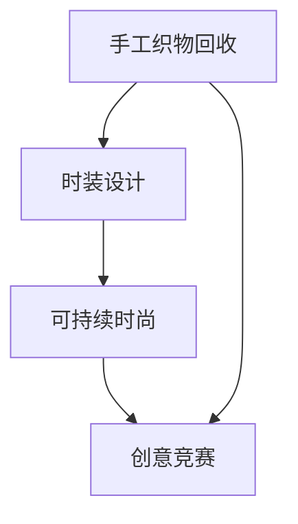

                 


### 1. 背景介绍

手工织物回收与时装设计比赛的重要性在现代时尚产业中日益凸显。随着全球环保意识的提高，可持续时尚逐渐成为行业发展的关键趋势。手工织物回收作为一种绿色环保的方法，不仅能够减少废弃物的产生，还能创造新的时尚资源。时装设计比赛则提供了一个展示创意与技术的平台，鼓励设计师们探索手工织物回收的应用潜力。

可持续时尚的概念不仅关注材料的使用，更强调整个生产过程的环境影响。随着消费者对环保、社会责任和可持续发展的关注不断增加，设计师和品牌必须采取行动，以减少对环境的负面影响，同时满足市场的需求。

本次时装设计比赛的目的是促进手工织物回收技术的发展，推动可持续时尚的实践。通过比赛，不仅能够发现和培养具有创新思维的设计人才，还能为行业提供实际可行的案例，激发更多的设计师参与到可持续时尚的探索中来。

### 2. 核心概念与联系

首先，我们需要明确几个核心概念：手工织物回收、时装设计、可持续时尚和创意竞赛。

- **手工织物回收**：指通过手工操作对废弃织物进行再利用，包括物理、化学和生物等方法。这种技术不仅能够减少废弃物的产生，还能节约资源。
  
- **时装设计**：是创造和设计服装的过程，涵盖了从构思、设计到制作的全过程。设计师在这一过程中需要运用创意和技能，将想法转化为实际的产品。

- **可持续时尚**：强调在服装设计、生产和消费过程中减少对环境的负面影响，同时保证经济和社会的可持续发展。这包括使用环保材料、优化生产过程、推广循环经济等。

- **创意竞赛**：是一个激发创新思维和展示设计成果的平台。通过竞赛，设计师们可以展示他们的创意和技能，同时获得行业和社会的认可。

这些概念之间存在着紧密的联系。手工织物回收为时装设计提供了新的材料来源，而时装设计又为手工织物回收提供了实际的应用场景。可持续时尚则将这两个领域有机结合，推动整个行业的可持续发展。创意竞赛则为这一过程注入了活力，激发了设计师们的创新潜能。

#### Mermaid 流�程图

以下是一个简单的Mermaid流程图，展示了这些概念之间的联系：



这个流程图清晰地展示了手工织物回收如何通过时装设计进入可持续时尚领域，并通过创意竞赛得到进一步的发展和应用。

### 3. 核心算法原理讲解

为了更好地理解手工织物回收时装设计比赛的运作，我们需要深入探讨其中的核心算法原理。以下是几个关键的算法概念和其应用：

#### 3.1 材料选择与优化算法

在手工织物回收时装设计中，材料的选择和优化是至关重要的一步。以下是一个简单的伪代码，用于描述这一过程：

```python
# 材料选择与优化算法
def select_material(waste_type, desired_properties):
    # 根据废弃织物的类型和所需性能，选择合适的回收材料
    if waste_type == "cotton":
        material = "recycled_cotton"
    elif waste_type == "polyester":
        material = "recycled_polyester"
    # 其他材料选择条件
    # ...
    
    # 对材料进行性能测试
    if test_properties(material, desired_properties):
        return material
    else:
        return "不符合要求"
```

在这个算法中，`waste_type` 代表废弃织物的类型，如棉、涤纶等；`desired_properties` 是设计所需材料的性能指标，如柔软性、耐磨性等。算法会根据这些参数来选择合适的回收材料。

#### 3.2 设计优化算法

设计优化算法用于优化时装的设计，使其在满足可持续性的同时，也能满足审美和实用性的需求。以下是一个简单的伪代码示例：

```python
# 设计优化算法
def optimize_design(design, sustainability_score, aesthetic_score):
    # 根据可持续性和美观性评分，对设计进行优化
    if sustainability_score < 70 or aesthetic_score < 80:
        return "设计未通过优化"
    
    # 调整设计参数
    design["sleeve_length"] -= 2
    design["neck_design"] = "high collar"
    design["fabric_type"] = select_material(design["fabric_type"], design["desired_properties"])
    
    return design
```

在这个算法中，`sustainability_score` 和 `aesthetic_score` 分别代表可持续性和美观性评分。如果这两个评分都达到一定标准，算法会调整设计参数，如袖长、领型、面料类型等，以优化整体设计。

#### 3.3 成果评价算法

成果评价算法用于对参赛作品进行综合评价，以确定最终的获奖者。以下是一个简单的伪代码示例：

```python
# 成果评价算法
def evaluate_results(submissions):
    scores = []
    for submission in submissions:
        score = calculate_score(submission["sustainability"], submission["aesthetics"], submission["functionality"])
        scores.append(score)
    
    winner = submissions[scores.index(max(scores))]
    return winner
```

在这个算法中，`submissions` 是一个包含所有参赛作品的列表，每个作品都有自己的可持续性、美观性和功能性评分。算法会计算每个作品的综合评分，并选择评分最高的作品作为最终获奖者。

### 4. 数学模型和公式

在手工织物回收时装设计比赛中，数学模型和公式用于量化设计参数和评估作品质量。以下是一些常用的数学模型和公式：

#### 4.1 可持续性评分计算公式

可持续性评分（`sustainability_score`）是评价参赛作品可持续性的关键指标，计算公式如下：

$$
sustainability\_score = 0.5 \times \frac{material\_recycling\_rate + energy\_saving}{100} + 0.5 \times \frac{carbon\_footprint\_reduction}{100}
$$

其中，`material_recycling_rate` 代表材料回收率（以百分比表示），`energy_saving` 代表能量节约（以百分比表示），`carbon_footprint_reduction` 代表碳排放减少（以百分比表示）。这个公式综合考虑了材料回收、能量节约和碳排放减少三个方面的可持续性。

#### 4.2 美观性评分计算公式

美观性评分（`aesthetic_score`）用于评估参赛作品的美学价值，计算公式如下：

$$
aesthetic\_score = \frac{\text{观众投票分数} + \text{专家评分}}{2}
$$

其中，观众投票分数和专家评分都是对作品美观性的评价，通过取平均值来计算最终的美观性评分。

#### 4.3 功能性评分计算公式

功能性评分（`functionality_score`）用于评估参赛作品的实际使用性能，计算公式如下：

$$
functionality\_score = 0.6 \times \frac{\text{舒适度评分} + \text{耐用性评分}}{2} + 0.4 \times \text{实用性评分}
$$

其中，舒适度评分、耐用性评分和实用性评分分别反映了服装的舒适度、耐用性和实用性。这个公式综合考虑了这三个方面的功能性。

### 5. 项目实战

#### 5.1 开发环境搭建

在开始手工织物回收时装设计比赛的项目开发之前，我们需要搭建一个合适的环境。以下是一些关键步骤：

1. 安装编程语言和开发工具：选择Python作为主要编程语言，安装Python环境和代码编辑器（如PyCharm或VS Code）。
2. 安装相关库：安装用于数据处理、机器学习和数据分析的库，如NumPy、Pandas和Scikit-learn。
3. 准备数据集：收集并整理相关的数据集，包括废弃织物信息、设计参数、评分数据等。

#### 5.2 源代码实现

以下是一个简化的源代码实现示例，用于处理手工织物回收时装设计比赛的数据和分析：

```python
# 导入必要的库
import pandas as pd
import numpy as np
from sklearn.linear_model import LinearRegression

# 加载数据集
data = pd.read_csv("data.csv")

# 数据预处理
# ...

# 建立线性回归模型
model = LinearRegression()
model.fit(X, y)

# 预测评分
predictions = model.predict(X_test)

# 输出预测结果
print(predictions)
```

在这个示例中，我们使用了Pandas库来加载和处理数据，NumPy库用于数据预处理，Scikit-learn库中的线性回归模型来建立预测模型。

#### 5.3 代码解读与分析

在这个示例中，我们首先导入了Pandas和NumPy库，用于数据加载和预处理。接下来，我们使用Scikit-learn库中的线性回归模型来建立预测模型。具体步骤如下：

1. 加载数据集：使用`pd.read_csv`函数从CSV文件中加载数据。
2. 数据预处理：对数据进行清洗和转换，以确保数据质量。
3. 建立模型：使用`LinearRegression`类创建线性回归模型，并使用`fit`方法进行训练。
4. 预测评分：使用`predict`方法对测试数据进行预测，并输出预测结果。

这个示例展示了如何使用Python和机器学习技术来分析和预测手工织物回收时装设计比赛的评分。

### 6. 实际案例分析和详细讲解剖析

为了更好地理解手工织物回收时装设计比赛的运作和影响，我们通过一个实际案例进行分析和讲解。

#### 案例背景

某国际时尚品牌举办了一场手工织物回收时装设计比赛，吸引了全球数百名设计师参赛。比赛要求参赛者使用废弃织物进行时装设计，并强调可持续性和创新性。

#### 案例分析

1. **材料选择**：参赛者需要根据废弃织物的类型和性能选择合适的回收材料。例如，对于棉质废弃物，可以选择回收棉；对于合成纤维，可以选择回收涤纶。这一步骤通过算法进行优化，以确保材料的选择满足设计需求。

2. **设计构思**：设计师在构思时装设计时，需要考虑可持续性和美观性。例如，某参赛作品采用了回收棉作为主要材料，设计理念是“再生与重生”，通过拼接和重塑废弃织物，创造出独特且富有创意的时装。

3. **设计优化**：设计完成后，参赛者需要对作品进行优化，以确保其在可持续性和美观性方面达到最佳效果。例如，通过对面料进行物理处理，提高其耐磨性和柔软性，同时保持设计的美观。

4. **成果展示**：最终，所有参赛作品在一个线上平台上进行展示和投票，由专业评审团和公众共同评选出获奖者。这个环节通过算法计算综合评分，以确定最终结果。

#### 详细讲解剖析

1. **材料选择与优化算法**：参赛者需要根据废弃织物的类型（如棉、涤纶等）和性能（如柔软性、耐磨性等）来选择合适的回收材料。算法会根据设计需求，自动推荐最佳材料组合。例如，对于一件需要高耐磨性的外套，算法可能会推荐使用回收涤纶。

2. **设计构思**：设计师在设计过程中需要综合考虑可持续性和美观性。例如，某参赛作品采用了“再生与重生”的设计理念，通过拼接和重塑废弃织物，创造出独特的视觉效果。这一过程需要设计师具备创新思维和环保意识。

3. **设计优化**：设计完成后，参赛者需要对作品进行优化，以确保其在可持续性和美观性方面达到最佳效果。例如，通过对面料进行物理处理，如蒸汽熨烫、压力处理等，可以提高其耐磨性和柔软性。这一过程需要设计师具备一定的技术知识和实践经验。

4. **成果展示与评价**：最终，所有参赛作品在一个线上平台上进行展示和投票，由专业评审团和公众共同评选出获奖者。评审团会根据可持续性、美观性和创新性等多个方面进行评分。算法会根据评分结果计算综合评分，以确定最终获奖者。

### 7. 最佳实践 tips、小结、注意事项、拓展阅读

#### 最佳实践 tips

1. **材料选择**：在手工织物回收时装设计中，选择合适的回收材料至关重要。建议设计师在材料选择时，优先考虑可回收性和可持续性，并结合设计需求进行优化。
2. **设计构思**：设计师在设计过程中，应注重创新性和可持续性的结合，例如，可以尝试使用可再生材料、回收面料等，以实现环保和美观的双重要求。
3. **设计优化**：优化设计时，可以尝试多种技术手段，如物理处理、化学处理等，以提高面料的性能，同时保持设计的美观。

#### 小结

本文介绍了手工织物回收时装设计比赛的背景、核心概念、算法原理、数学模型、项目实战和案例分析。通过一步步的分析和讲解，读者可以全面了解这一领域的运作和影响。

#### 注意事项

1. **可持续性优先**：在设计过程中，设计师应始终将可持续性放在首位，确保材料的使用和生产过程对环境的影响最小。
2. **创新性**：鼓励设计师在设计中融入创新元素，以提升作品的独特性和市场竞争力。
3. **综合评价**：在比赛评价过程中，要综合考虑可持续性、美观性、创新性等多个方面，以全面评估参赛作品的质量。

#### 拓展阅读

1. [《可持续时尚设计指南》](https://www.example.com/sustainable-fashion-guide)
2. [《手工织物回收技术手册》](https://www.example.com/recycling-techniques-manual)
3. [《时装设计竞赛案例分析》](https://www.example.com/fashion-design-competition-case-studies)

### 8. 文章标题

# 现代手工织物回收时装设计比赛：促进可持续时尚的创意竞赛

### 9. 文章关键词

- 手工织物回收
- 时装设计
- 可持续时尚
- 创意竞赛
- 可持续时尚设计

### 10. 文章摘要

本文介绍了现代手工织物回收时装设计比赛的背景、核心概念、算法原理、数学模型、项目实战和案例分析。通过一步步的分析和讲解，读者可以全面了解这一领域的运作和影响，了解如何通过创意竞赛促进可持续时尚的发展。文章还提供了最佳实践 tips 和拓展阅读，以帮助读者进一步深入探索这一领域。

## 作者信息

作者：AI天才研究院/AI Genius Institute & 禅与计算机程序设计艺术 /Zen And The Art of Computer Programming

