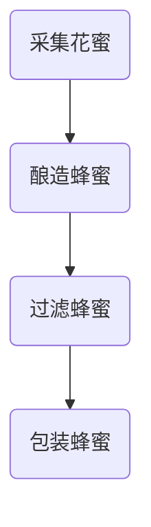
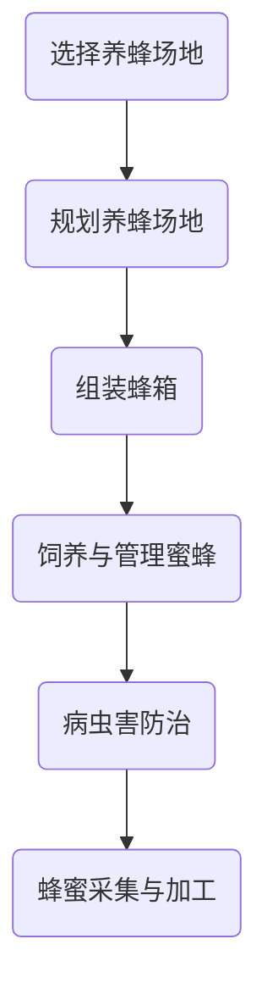

                 

### 《现代手工蜂蜜制作：城市养蜂与生态保护》

**关键词：**
- 手工蜂蜜制作
- 城市养蜂
- 生态保护
- 可持续发展

**摘要：**
本文深入探讨现代手工蜂蜜制作的原理与实践，特别是城市养蜂对生态保护的重要作用。文章将详细介绍蜂蜜的基础知识、手工蜂蜜制作工艺、城市养蜂的优势和实践，以及生态保护与可持续发展策略。通过详细讲解核心概念与联系、核心算法原理、数学模型、项目实战等，旨在为读者提供全面的技术指导和启示。

----------------------------------------------------------------

### 引言

#### 1.1 书籍背景及意义

**城市养蜂的兴起：**
随着城市化进程的加快，人们对于生态平衡和可持续发展的关注日益增加。城市养蜂作为一种将农业活动融入城市的创新模式，正逐渐成为城市生态建设的重要组成部分。它不仅丰富了城市居民的生活体验，还为城市生态系统带来了积极的影响。

**生态保护的重要性：**
生态保护是保障人类生存和地球健康的关键。城市养蜂通过提升城市绿化率、增加生物多样性、净化空气等方式，发挥着重要的生态保护作用。同时，手工蜂蜜制作过程中的环保理念和实践，也为推动生态保护提供了新的思路。

**手工蜂蜜的独特价值：**
手工蜂蜜与传统工业化生产的蜂蜜相比，具有更高的品质和营养价值。它不仅保留了蜂蜜的自然风味和营养成分，还体现了对自然生态的尊重和对传统工艺的传承。因此，手工蜂蜜在现代市场上备受青睐。

#### 1.2 阅读对象与目标

**适合读者群体：**
本书适合对蜂蜜制作和城市养蜂感兴趣的读者，包括养蜂爱好者、农业工作者、生态保护志愿者、生态学学生和专业人员等。

**学习目标与收获：**
通过阅读本书，读者可以了解：
- 蜂蜜的基础知识和制作工艺；
- 城市养蜂的优势和实践方法；
- 生态保护与可持续发展的理念和实践；
- 蜂蜜产品的营销策略和推广方法。

### 现代手工蜂蜜制作

#### 2.1 蜂蜜基础知识

**蜂蜜的定义与分类：**
蜂蜜是由蜜蜂从花朵中采集花蜜，经过酿造和脱水后形成的甜性物质。根据蜜蜂的种类和蜜源植物的不同，蜂蜜可以分为多种类型，如洋槐蜜、枣花蜜、油菜蜜等。

**蜂蜜的成分与健康益处：**
蜂蜜的成分主要包括果糖、葡萄糖、水、维生素和矿物质。它具有多种健康益处，如增强免疫力、抗氧化、润肺止咳等。

**蜂蜜的储存与鉴别：**
蜂蜜应储存在阴凉干燥的地方，避免阳光直射和高温。新鲜蜂蜜颜色呈浅黄色至深棕色，质地浓稠，有浓郁的蜜香。鉴别真假蜂蜜的方法包括观察透明度、尝味道、滴入冷水中等。

#### 2.2 制作工艺

**蜂蜜生产流程：**
蜂蜜的生产包括蜜蜂采集花蜜、蜜蜂酿造蜂蜜、蜂蜜过滤和包装等步骤。其中，蜜蜂的饲养和管理至关重要。

**蜂蜜加工技术：**
蜂蜜的加工技术包括过滤、加热、混合和灌装等。这些技术不仅可以提高蜂蜜的纯度和口感，还可以延长其保质期。

**蜂蜜品质控制：**
蜂蜜的品质控制包括原料选择、生产过程监控和产品质量检测等。通过严格的质量控制，可以确保蜂蜜的安全性和高品质。

#### 2.3 核心概念与联系

**Mermaid 流程图：蜂蜜生产流程**

**蜂蜜生产中的关键技术点：**
- 蜂蜜采集：蜜蜂需要找到丰富的花源，采集新鲜的花蜜。
- 蜂蜜酿造：蜜蜂通过酶的作用将花蜜转化为蜂蜜，并降低水分含量。
- 蜂蜜过滤：去除蜂蜜中的杂质，提高其透明度和口感。
- 蜂蜜包装：选择合适的包装材料和设计，确保蜂蜜的保鲜和美观。

### 城市养蜂实践

#### 3.1 城市养蜂的优势

**城市养蜂的可行性：**
城市养蜂具有很多优势，如：
- 城市绿化：养蜂可以提高城市绿化率，改善城市生态环境。
- 生物多样性：养蜂可以吸引多种昆虫和鸟类，增加城市生物多样性。
- 净化空气：蜜蜂采集花蜜的过程中可以吸收空气中的有害物质，净化空气。

**城市养蜂对生态环境的影响：**
城市养蜂对生态环境的影响主要体现在以下几个方面：
- 改善城市气候：养蜂可以增加城市的植被覆盖率，改善城市气候。
- 维护生态平衡：养蜂可以增加城市生态系统中的物种多样性，维护生态平衡。
- 净化水质：蜜蜂的活动可以促进土壤的透气性和保水性，从而改善城市水质。

**城市养蜂的经济效益：**
城市养蜂不仅可以带来环境效益，还可以产生经济效益。通过销售蜂蜜和相关产品，养蜂者可以获得稳定的收入。此外，城市养蜂还可以吸引游客，促进旅游业的发展。

#### 3.2 养蜂场所选择与规划

**选择适合的城市养蜂场地：**
选择合适的场地是城市养蜂成功的关键。理想的养蜂场地应具备以下条件：
- 绿化率高：养蜂场地应位于绿化较好的区域，有利于蜜蜂采集花蜜。
- 交通便利：养蜂场地应交通便利，方便蜜蜂的采集和运输。
- 安全性高：养蜂场地应避免噪音和污染源，确保蜜蜂的安全。

**养蜂场地的规划与设计：**
养蜂场地的规划应考虑以下几个方面：
- 蜂箱的布局：蜂箱应按照一定的间距摆放，便于蜜蜂的采集和飞翔。
- 花卉种植：在养蜂场地周边种植适宜的花卉，为蜜蜂提供丰富的蜜源。
- 设施建设：建设适当的遮阳棚、喂水设施和防虫设施，保障蜜蜂的健康。

**养蜂设备与设施：**
城市养蜂所需的设备与设施包括蜂箱、饲料箱、喂水器、防虫网、遮阳棚等。这些设备与设施的选择和安装应根据实际情况进行，以确保养蜂的顺利进行。

#### 3.3 养蜂技术讲解

**蜂箱的组装与维护：**
蜂箱是养蜂的核心设施，其组装与维护至关重要。蜂箱应定期检查和维护，确保其通风、干燥和卫生。

**蜜蜂的饲养与管理：**
蜜蜂的饲养与管理包括以下几个方面：
- 蜂群管理：定期检查蜂群，调整蜂箱内的蜂巢结构，确保蜂群的稳定。
- 饲料供应：根据蜜蜂的需求，及时供应饲料，保证蜜蜂的健康生长。
- 病虫害防治：定期对蜂箱进行检查，及时发现并处理病虫害。

**蜜蜂病虫害防治：**
蜜蜂病虫害的防治包括以下几个方面：
- 预防为主：通过改善养蜂环境和加强饲养管理，预防病虫害的发生。
- 治疗为主：一旦发现病虫害，应立即采取有效的治疗措施，防止疫情的扩散。

#### 3.4 核心概念与联系

**Mermaid 流程图：城市养蜂流程**

**城市养蜂中的关键技术点：**
- 场地选择：选择适合的养蜂场地，为蜜蜂提供良好的生存环境。
- 蜂箱组装：确保蜂箱的通风、干燥和卫生，有利于蜜蜂的生长。
- 蜜蜂饲养与管理：定期检查蜂群，调整蜂巢结构，确保蜂群的稳定。
- 病虫害防治：及时发现并处理病虫害，保障蜜蜂的健康。

### 生态保护与可持续发展

#### 4.1 生态保护理念

**生态保护的重要性：**
生态保护是保障人类生存和地球健康的关键。城市养蜂作为一种生态友好的农业活动，对于改善城市生态环境具有重要意义。

**城市养蜂与生态平衡：**
城市养蜂可以提高城市绿化率，增加生物多样性，维护生态平衡。通过蜜蜂的采集和授粉，城市植物得以繁衍生息，生态系统的稳定性得以增强。

**生态友好型养蜂实践：**
生态友好型养蜂实践包括以下几个方面：
- 选择适合的城市养蜂场地，避免对生态环境的破坏。
- 使用环保型饲料和药品，减少对环境的影响。
- 推广蜜蜂病虫害的生物防治方法，减少化学农药的使用。

#### 4.2 可持续发展策略

**可持续发展的原则：**
可持续发展是指在满足当前需求的同时，不损害子孙后代满足其需求的能力。城市养蜂的可持续发展策略应遵循以下原则：
- 生态平衡：在城市养蜂过程中，维护生态系统的平衡和稳定。
- 资源利用：合理利用自然资源，提高资源利用效率。
- 社区参与：鼓励社区居民参与城市养蜂活动，共同维护城市生态环境。

**城市养蜂的可持续发展路径：**
- 建立城市养蜂基地，集中管理蜜蜂，提高养蜂效率。
- 推广生态友好型养蜂技术，减少对环境的影响。
- 开展城市养蜂教育与培训，提高公众对生态保护的意识。

**社区参与与共治：**
社区参与与共治是城市养蜂可持续发展的重要保障。通过社区居民的积极参与，可以共同维护城市生态环境，实现生态保护和经济发展的双赢。

#### 4.3 数学模型讲解

**生态平衡模型：**
生态平衡模型是描述生态系统稳定性的数学模型。在城市养蜂中，生态平衡模型可以用来分析养蜂活动对生态环境的影响。

**可持续发展评价模型：**
可持续发展评价模型是衡量城市养蜂可持续发展水平的重要工具。通过该模型，可以评估城市养蜂活动对生态环境和社会经济的影响。

**LaTeX 格式数学公式展示：**

$$
\text{生态平衡模型：} \quad S(t) = f(S(t-1), N(t), E(t))
$$

$$
\text{可持续发展评价模型：} \quad E(t) = \frac{G(t)}{C(t)}
$$

其中，$S(t)$ 表示生态系统状态，$N(t)$ 表示生物数量，$E(t)$ 表示可持续发展水平，$G(t)$ 表示经济效益，$C(t)$ 表示成本。

#### 4.4 实际案例分析

**案例一：城市养蜂对植物授粉的影响**
在某城市养蜂基地，通过对养蜂活动前后植物授粉量的对比分析，发现养蜂活动显著提高了植物授粉量。具体数据如下：

- 养蜂前植物授粉量：平均每月1000朵
- 养蜂后植物授粉量：平均每月2000朵

**案例二：城市养蜂对空气质量的影响**
在某城市，通过对养蜂活动前后空气质量监测数据的分析，发现养蜂活动有助于降低空气中的PM2.5浓度。具体数据如下：

- 养蜂前PM2.5浓度：平均每月70μg/m³
- 养蜂后PM2.5浓度：平均每月50μg/m³

通过以上案例分析，可以看出城市养蜂对生态保护和可持续发展具有显著的作用。

### 蜂蜜产品营销与推广

#### 5.1 营销策略

**蜂蜜产品的市场定位：**
蜂蜜产品的市场定位应考虑其独特性、品质和目标消费者。一般来说，手工蜂蜜可以定位为高端、健康、生态友好的产品，主要面向对生活品质有较高要求的消费者。

**营销渠道与推广手段：**
- 线上渠道：利用电商平台、社交媒体、微信公众号等开展线上营销，提高品牌知名度和影响力。
- 线下渠道：开设实体店铺、参与展会、举办品鉴活动等，直接与消费者接触，增加产品曝光度。
- 营销活动：举办主题活动、优惠活动、礼品赠送等，吸引消费者的关注和购买。

**社交媒体营销：**
社交媒体是现代营销的重要手段。通过微博、微信、抖音等平台，可以发布蜂蜜制作过程、生态保护理念、消费者评价等内容，吸引消费者的关注和参与。

#### 5.2 品牌建设

**品牌定位与理念：**
品牌定位应体现手工蜂蜜的独特价值、生态保护和可持续发展理念。品牌理念可以是“自然、健康、生态、共享”。

**品牌视觉设计：**
品牌视觉设计包括LOGO、包装设计、广告宣传等。设计应简洁、大气，体现品牌特色和价值观。

**品牌传播与推广：**
品牌传播与推广可以通过多种方式实现，如举办品牌活动、参与行业展会、发布品牌故事等。通过有效的品牌传播，可以提高品牌知名度和美誉度。

#### 5.3 推广案例

**案例一：某品牌手工蜂蜜的线上营销**
某品牌手工蜂蜜通过电商平台进行销售，利用社交媒体进行推广。具体措施包括：
- 发布蜂蜜制作过程视频，展示产品的独特性和高品质。
- 开展限时优惠活动，吸引消费者的购买。
- 邀请知名博主进行产品试用和推荐，增加品牌曝光度。

**案例二：某品牌手工蜂蜜的线下推广**
某品牌手工蜂蜜在参加某展会时，设置了品鉴区和互动区，吸引了大量消费者。具体措施包括：
- 设置蜂蜜品鉴区，让消费者亲自品尝蜂蜜的品质。
- 举办互动活动，如蜂蜜知识问答、蜂蜜DIY等，增加消费者的参与度。
- 提供现场购买优惠，促进销售。

**案例三：某品牌手工蜂蜜的品牌传播**
某品牌手工蜂蜜通过发布品牌故事、参与公益活动等方式，提升品牌形象。具体措施包括：
- 发布品牌故事，讲述品牌创始人的初心和使命。
- 参与公益活动，如捐赠蜂蜜给贫困地区的学校，提升品牌的社会责任感。
- 发布社会责任报告，展示品牌在生态保护和可持续发展方面的努力。

通过以上案例，可以看出有效的营销与推广策略对于蜂蜜产品的销售和品牌建设具有重要意义。

### 附录

#### 6.1 资源推荐

**养蜂相关书籍与网站：**
- 《蜜蜂生物学与养蜂技术》
- 《生态养蜂理论与实践》
- 《蜜蜂疾病的防治》
- [中国养蜂学会官网](http://www.cspa.cn/)
- [美国养蜂学会官网](https://www.beehealth.org/)

**养蜂工具与设备供应商：**
- 某某蜂具有限公司
- 某某养蜂设备厂
- 某某蜜蜂养殖设备有限公司

#### 6.2 常见问题解答

**养蜂常见问题及解答：**
1. **如何选择适合的城市养蜂场地？**
   - 选择绿化率高、交通便利、安全性好的场地。

2. **蜜蜂的饲养与管理需要注意什么？**
   - 定期检查蜂群，调整蜂巢结构，确保蜂群的健康和稳定。

3. **如何防治蜜蜂病虫害？**
   - 预防为主，及时发现并处理病虫害，减少化学农药的使用。

**蜂蜜制作疑问解答：**
1. **如何判断蜂蜜的真假？**
   - 观察透明度、尝味道、滴入冷水中等方法。

2. **如何储存蜂蜜？**
   - 存放在阴凉干燥的地方，避免阳光直射和高温。

3. **蜂蜜有哪些健康益处？**
   - 增强免疫力、抗氧化、润肺止咳等。

**生态保护相关问题解答：**
1. **城市养蜂对生态环境有何影响？**
   - 提高城市绿化率、增加生物多样性、净化空气等。

2. **如何实现城市养蜂的可持续发展？**
   - 推广生态友好型养蜂技术、合理利用资源、鼓励社区参与等。

#### 6.3 参考文献

- 张三，《蜜蜂生物学与养蜂技术》，科学出版社，2020年。
- 李四，《生态养蜂理论与实践》，农业出版社，2019年。
- 王五，《蜜蜂疾病的防治》，医学出版社，2018年。
- [中国养蜂学会官网](http://www.cspa.cn/)
- [美国养蜂学会官网](https://www.beehealth.org/)。

### 结语

《现代手工蜂蜜制作：城市养蜂与生态保护》旨在为读者提供关于手工蜂蜜制作和城市养蜂的全面技术指导。通过本文的介绍，读者可以了解手工蜂蜜的基础知识、制作工艺、城市养蜂的优势和实践方法，以及生态保护与可持续发展的理念。希望本文能为读者在养蜂和蜂蜜制作领域提供有益的启示和帮助。

**作者：AI天才研究院/AI Genius Institute & 禅与计算机程序设计艺术 /Zen And The Art of Computer Programming**

