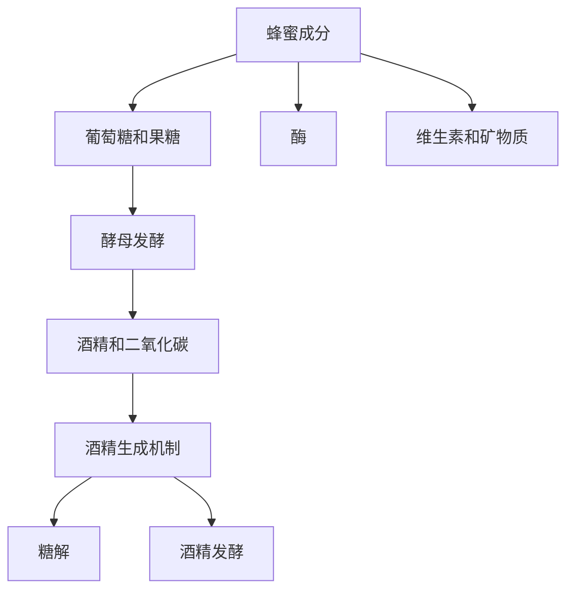

                 

# 现代手工蜂蜜酒制作：复兴中世纪饮品的都市尝试

> 关键词：现代手工蜂蜜酒、中世纪饮品、蜂蜜酒制作、都市尝试

> 摘要：本文将探讨现代手工蜂蜜酒制作的兴起，以及这一古老饮品在现代都市中的复兴尝试。通过分析制作蜂蜜酒的历史背景、基本原理、技术流程以及市场需求，我们将深入了解这一古老饮品在现代生活的重要性和未来发展潜力。

## 引言

蜂蜜酒，又称蜜酒，是一种古老而神秘的饮品，其历史可以追溯到几千年前。在中世纪欧洲，蜂蜜酒不仅是日常饮料，更是重要的药用饮品。然而，随着工业革命的到来，传统的手工制作工艺逐渐被机械化生产所取代，蜂蜜酒的制作也渐渐走向衰落。近年来，随着人们对于健康饮食和传统手工艺的重新关注，蜂蜜酒的制作又开始在都市中焕发新生。

本文旨在探讨现代手工蜂蜜酒制作的兴起背景、制作原理、技术流程、市场需求以及未来发展潜力，旨在为读者提供一份全面而深入的指南，帮助大家更好地理解和参与这一古老饮品的复兴。

## 蜂蜜酒的历史背景

蜂蜜酒的制作可以追溯到古代文明时期。在古埃及、古希腊和古罗马，蜂蜜酒都是重要的饮品。古埃及人将蜂蜜视为神圣的食品，认为它具有治愈疾病和延长寿命的神奇功效。古希腊人则将蜂蜜酒视为节日庆典和体育赛事中的必备饮品。古罗马帝国时期，蜂蜜酒的生产和消费达到了巅峰，成为罗马社会的重要象征。

在中世纪欧洲，蜂蜜酒是贵族和教会专享的奢侈品。当时的修道院是蜂蜜酒的主要生产地，修道士们通过酿造蜂蜜酒来筹集资金，支持教堂建设和慈善事业。蜂蜜酒不仅是一种饮品，更是一种文化和宗教的象征。在欧洲中世纪文学作品中，蜂蜜酒经常被描绘为充满神秘和浪漫色彩的神圣饮品。

随着时间的推移，蜂蜜酒的制作工艺逐渐传播到世界各地。在中国，蜂蜜酒被称为“蜜酒”，在阿拉伯世界被称为“马德拉酒”，在日本则被称为“梅酒”。尽管名称不同，但蜂蜜酒的核心制作原理和营养价值都是一致的。

## 蜂蜜酒的核心概念与联系

在探讨蜂蜜酒的制作原理之前，我们需要了解几个核心概念，包括蜂蜜的成分、酵母的发酵过程以及酒精的生成机制。这些概念之间的联系构成了蜂蜜酒制作的本质。

### 蜂蜜的成分

蜂蜜是由蜜蜂从花蜜中提取并经过发酵制成的甜性物质。蜂蜜的主要成分包括葡萄糖、果糖、酶、维生素和矿物质。葡萄糖和果糖是两种简单糖，它们是酵母发酵的原料。酶是蜂蜜中的活性成分，可以催化蜂蜜的发酵过程。维生素和矿物质则对蜂蜜酒的口感和营养价值有重要影响。

### 酵母的发酵过程

酵母是一种单细胞真菌，能够在无氧环境下将葡萄糖和果糖分解成酒精和二氧化碳。这个过程称为酒精发酵。酵母通过代谢作用，将糖分转化为酒精和二氧化碳，同时释放出能量。发酵过程中，温度、湿度、氧气含量等因素都会影响酵母的发酵速度和酒精含量。

### 酒精的生成机制

在蜂蜜酒的制作过程中，酵母通过代谢作用将蜂蜜中的葡萄糖和果糖转化为酒精。酒精的生成机制涉及酵母细胞内的两个关键步骤：糖解和酒精发酵。糖解是将葡萄糖分解成两个三碳化合物，这些化合物随后被转化为丙酮酸。丙酮酸在酵母酶的作用下转化为酒精和二氧化碳。

### 蜂蜜酒的核心概念架构

为了更清晰地理解蜂蜜酒的制作原理，我们可以使用Mermaid流程图来展示核心概念之间的联系。

在这个流程图中，蜂蜜成分是起点，包括葡萄糖、果糖、酶、维生素和矿物质。这些成分通过酵母发酵过程转化为酒精和二氧化碳，形成蜂蜜酒的核心成分。酒精的生成机制涉及糖解和酒精发酵两个步骤，这两个步骤共同构成了蜂蜜酒制作的关键。

通过理解蜂蜜的成分、酵母的发酵过程以及酒精的生成机制，我们可以更好地把握蜂蜜酒制作的原理和流程，为后续的技术讨论和实战案例提供基础。

## 制作蜂蜜酒的基本技术流程

制作蜂蜜酒不仅需要选择合适的原料，还需要掌握一系列基本技术流程。以下将详细介绍蜂蜜酒制作的基本步骤，包括原料的选择、工具的准备、发酵条件的控制以及常见问题的处理。

### 原料的选择

1. **蜂蜜**：选择新鲜、成熟的蜂蜜是制作优质蜂蜜酒的基础。蜂蜜的种类和来源会影响最终的酒体风味。一般来说，浅色蜂蜜（如洋槐蜜、荔枝蜜）适合制作较为清爽的蜂蜜酒，而深色蜂蜜（如荞麦蜜、枣花蜜）则适合制作风味浓郁的蜂蜜酒。

2. **水**：用于稀释蜂蜜和冲洗容器的饮用水需保持纯净，建议使用未受污染的天然泉水或蒸馏水。

3. **酵母**：选择适合蜂蜜酒发酵的酵母菌株。常见的酵母有葡萄酒酵母、啤酒酵母和蜂蜜酒专用酵母。葡萄酒酵母适用于制作口感柔和的蜂蜜酒，而啤酒酵母则适合制作风味浓郁的蜂蜜酒。

4. **糖分**：某些蜂蜜酒配方中可能需要额外的糖分，以调整酒体的甜度和酒精含量。

5. **香料和水果**：根据个人口味，可以添加不同的香料（如肉桂、丁香、香草）和水果（如苹果、梨、草莓）来丰富蜂蜜酒的风味。

### 工具的准备

1. **发酵罐**：选择一个干净的玻璃或食品级塑料发酵罐，容量一般为20-30升。

2. **温度计**：用于监测发酵过程中的温度变化。

3. **量杯和勺子**：用于准确量取蜂蜜、水和糖分。

4. **过滤器**：用于过滤蜂蜜酒中的杂质。

5. **酒瓶和瓶盖**：选择干净、未受污染的玻璃酒瓶和密封良好的瓶盖，以便储存蜂蜜酒。

### 发酵条件的控制

1. **温度控制**：酵母发酵的最佳温度范围通常在20-30摄氏度。过高或过低的温度都会影响酵母的活性，从而影响发酵效果。可以使用冰箱或加热器来调节发酵罐内的温度。

2. **湿度控制**：发酵罐周围应保持适当的湿度，避免水分过少导致酵母脱水，或者水分过多导致发酵过程中出现污染。

3. **氧气供应**：发酵初期需要适量的氧气，以帮助酵母繁殖。发酵过程中，氧气需求逐渐减少，因为酵母主要通过无氧发酵产生酒精。

4. **pH值控制**：蜂蜜的pH值通常在4.0左右，过低的pH值会抑制酵母的活性。可以使用柠檬酸或碳酸钙等物质来调整pH值。

### 常见问题的处理

1. **发酵失败**：导致发酵失败的原因可能包括温度控制不当、酵母选择不当、污染等。解决方法包括重新选择适合的酵母菌株，严格控制发酵温度和湿度，确保所有工具和原料的清洁卫生。

2. **酸度过高**：如果发酵过程中酸度过高，可能是因为添加了过量的柠檬酸或其他酸性物质。解决方法包括加入碳酸钙等碱性物质来中和酸度。

3. **沉淀物过多**：发酵完成后，蜂蜜酒中可能会出现沉淀物。这些沉淀物通常是酵母细胞、未完全分解的糖分和杂质。可以使用过滤器过滤沉淀物，或静置一段时间后重新过滤。

通过了解和掌握这些基本技术流程，可以有效地制作出高品质的蜂蜜酒，为都市中的手工蜂蜜酒制作提供坚实的基础。

## 蜂蜜酒的不同类型和风格

蜂蜜酒因其独特的制作工艺和丰富的风味而深受喜爱。蜂蜜酒的种类繁多，根据不同的制作方法和添加物，可以分为多种类型和风格。以下将介绍几种常见的蜂蜜酒类型，并详细分析它们的制作方法和特点。

### 蜜酒（Mead）

蜜酒是最传统和最基础的蜂蜜酒类型，主要成分是蜂蜜和水，有时还会添加酵母。蜜酒的酿造过程简单，只需将蜂蜜和水按一定比例混合，然后加入酵母进行发酵。蜜酒的颜色和风味取决于所使用的蜂蜜种类。浅色蜂蜜（如洋槐蜜、荔枝蜜）制成的蜜酒口感清爽，适合夏季饮用；而深色蜂蜜（如荞麦蜜、枣花蜜）制成的蜜酒则风味浓郁，适合冬季饮用。

### 麦酒（Pyment）

麦酒是一种将蜂蜜和葡萄汁混合发酵而成的蜂蜜酒。麦酒的制作过程中，葡萄汁中的酒精度数会提升，而蜂蜜的甜味和芳香则赋予麦酒独特的口感。麦酒通常采用红葡萄酒或白葡萄酒的酿造方法，根据葡萄品种和酿造工艺的不同，麦酒的风格和风味也各有特色。麦酒的颜色通常较深，口感丰富，具有独特的果香和酒香。

### 水果蜂蜜酒（Melomel）

水果蜂蜜酒是将蜂蜜与其他水果混合发酵而成的蜂蜜酒。常见的制作方法包括将蜂蜜与苹果、梨、草莓、蓝莓等水果混合，发酵过程中水果的香气和甜味会融入蜂蜜酒中，创造出多样化和独特的水果风味。水果蜂蜜酒的颜色和风味取决于所添加的水果种类和发酵时间，一般来说，水果蜂蜜酒口感清爽，适合夏季饮用。

### 花香蜂蜜酒（Cyser）

花香蜂蜜酒是一种将蜂蜜和苹果汁混合发酵而成的蜂蜜酒，其中苹果汁为酒体提供了果香和酸度，而蜂蜜则赋予酒体甜味和粘稠感。花香蜂蜜酒的名字来源于其独特的花香味，这种香气通常来源于苹果汁中的天然芳香成分。花香蜂蜜酒的口感清爽，具有独特的花果香气，非常适合作为夏季饮品。

### 浓缩蜂蜜酒（Dolch）

浓缩蜂蜜酒是一种通过浓缩蜂蜜和水的比例来提高酒体的甜度和酒精度的蜂蜜酒。浓缩蜂蜜酒的酿造过程中，水和蜂蜜的比例通常较低，这有助于增强蜂蜜的甜味和风味。浓缩蜂蜜酒口感浓郁，适合作为餐后饮品或特殊场合的庆祝饮品。

### 酒花蜂蜜酒（Braggot）

酒花蜂蜜酒是一种将蜂蜜、麦芽和啤酒花混合发酵而成的蜂蜜酒。酒花蜂蜜酒的制作过程类似于啤酒的酿造方法，麦芽提供了酒花蜂蜜酒的麦芽香味和苦味，而啤酒花则赋予酒体独特的苦味和香气。酒花蜂蜜酒具有丰富的口感层次，适合作为冬季饮品。

这些不同类型的蜂蜜酒，通过不同的原料和制作方法，形成了多样化的风味和风格。无论是蜜酒、麦酒、水果蜂蜜酒，还是浓缩蜂蜜酒和酒花蜂蜜酒，每一种都以其独特的魅力吸引着不同的消费者。了解和掌握这些蜂蜜酒类型，不仅能丰富自己的饮料酒水选择，也能在制作和品尝中体会到传统工艺与现代创意的完美融合。

## 现代手工蜂蜜酒制作的挑战与解决方案

在现代社会中，手工蜂蜜酒的制作面临着一系列独特的挑战。这些挑战包括原料采购、技术难度和市场监管等方面。然而，通过科学的方法和创新思维，这些问题都可以得到有效的解决。

### 原料采购

首先，原料采购是手工蜂蜜酒制作的关键环节。高质量的蜂蜜是制作优质蜂蜜酒的基础，而现代都市往往缺乏天然蜂蜜的供应。为了解决这个问题，可以采取以下几种策略：

1. **建立本地合作网络**：与当地农民和蜂农建立长期的合作关系，确保获得新鲜、优质的蜂蜜。通过建立互信，农民可以提供更可靠的蜂蜜供应。

2. **有机蜂蜜**：选择有机蜂蜜，不仅能保证蜂蜜的品质，还能满足消费者对健康食品的需求。有机蜂蜜的生产过程通常不使用化学添加剂，更加天然健康。

3. **自制蜂蜜**：对于有条件的手工蜂蜜酒爱好者，可以尝试自己养殖蜜蜂，自制蜂蜜。这不仅能够保证蜂蜜的纯净和新鲜，还能带来更多的手工制作乐趣。

### 技术难度

制作蜂蜜酒虽然历史悠久，但仍然涉及到复杂的发酵过程和技术细节。现代手工蜂蜜酒制作的技术难度主要体现在以下几个方面：

1. **发酵控制**：发酵过程中的温度、湿度和氧气含量对蜂蜜酒的最终品质有重要影响。现代技术可以通过使用恒温发酵箱和控湿设备来精确控制发酵环境。

2. **酵母选择**：选择适合蜂蜜酒发酵的酵母菌株非常重要。市面上有各种专门的蜂蜜酒酵母，这些酵母对蜂蜜中的糖分和酶有更好的适应性。

3. **设备更新**：传统手工制作设备在清洁和维护方面存在一定困难。现代手工蜂蜜酒制作可以采用食品级不锈钢发酵罐和自动化设备，提高生产效率和卫生标准。

### 市场监管

现代手工蜂蜜酒制作还需面对市场监管的挑战。特别是在食品生产和销售方面，需要遵守严格的法规和标准。以下是一些解决方案：

1. **质量认证**：通过获得有机认证、HACCP认证或其他质量认证，可以提高手工蜂蜜酒的市场信誉和竞争力。

2. **法律法规了解**：学习和了解相关的法律法规，确保手工蜂蜜酒的生产和销售过程合法合规。这包括食品安全法规、标签法规和销售渠道管理等。

3. **市场推广**：通过有效的市场推广策略，提高手工蜂蜜酒的品牌知名度和市场接受度。可以采用社交媒体营销、参加食品展会和举办品鉴活动等方式进行推广。

通过上述解决方案，现代手工蜂蜜酒制作在面临原料采购、技术难度和市场监管等挑战时，依然能够找到有效的方法应对，从而实现这一古老饮品的现代化复兴。

## 现代手工蜂蜜酒在都市中的创新

在都市环境中，手工蜂蜜酒的制作不仅需要克服传统的挑战，还需要在创新和适应现代生活方式上做出努力。现代技术的应用和都市生活的需求为手工蜂蜜酒带来了新的可能性。

### 现代技术的应用

1. **物联网设备**：物联网（IoT）设备可以实时监测发酵罐内的温度、湿度和氧气含量，确保发酵过程的精确控制。例如，智能传感器可以发送数据到手机应用程序，使酿造者能够远程监控和调整发酵条件。

2. **自动化发酵罐**：自动化发酵罐可以自动控制发酵温度、搅拌速度和氧气供应。这不仅提高了生产效率，还确保了发酵过程的稳定性和一致性。

3. **数字监控和分析**：通过数字化工具，如数据分析和人工智能，可以对大量发酵数据进行分析，优化酿造过程，提高蜂蜜酒的品质。

### 都市生活的需求

1. **便捷性**：现代都市生活节奏快，消费者更倾向于购买易于储存和饮用的蜂蜜酒。因此，小瓶装和即饮装蜂蜜酒逐渐受到欢迎。

2. **个性化定制**：都市消费者追求个性化体验，手工蜂蜜酒可以提供定制服务，如添加特定的香料、水果或其他成分，满足不同消费者的口味需求。

3. **健康意识**：随着健康饮食观念的普及，消费者更关注食品的营养价值和健康属性。手工蜂蜜酒因其天然成分和营养价值，在都市市场中具有竞争优势。

4. **环保意识**：现代都市人越来越注重环保，手工蜂蜜酒的制作过程通常较为环保，使用可回收的包装材料和可持续的酿造方法，符合现代都市的环保理念。

### 创新实践

1. **融合文化**：将传统蜂蜜酒制作方法与现代都市文化融合，如结合现代艺术元素进行蜂蜜酒包装设计，提升品牌形象。

2. **线上线下融合**：通过电商平台和社交媒体，实现蜂蜜酒的线上销售和线下体验相结合，方便消费者购买并享受手工酿造的乐趣。

3. **社区互动**：组织品酒会、酿造工作坊等活动，让消费者参与蜂蜜酒的制作过程，增强品牌与消费者的互动。

通过现代技术的应用和满足都市生活的需求，手工蜂蜜酒在都市中不断创新，不仅焕发了新的生命力，也为都市消费者带来了更加丰富和多样化的体验。

## 蜂蜜酒的健康效益与营养分析

蜂蜜酒因其独特的天然成分和酿造过程，被认为具有多种健康效益。然而，其营养成分和潜在风险也需要进行深入分析。

### 营养成分

1. **糖分**：蜂蜜酒的主要成分是蜂蜜，蜂蜜中含有丰富的葡萄糖和果糖，这些糖分是人体的主要能量来源。

2. **酒精**：发酵过程中，蜂蜜中的糖分被酵母转化为酒精，酒精具有一定的能量值，但不是人体必需的营养素。

3. **维生素和矿物质**：蜂蜜中含有多种维生素（如B族维生素）和矿物质（如钙、铁、锌），这些营养成分对人体的健康有积极影响。

4. **抗氧化物质**：蜂蜜和葡萄酒中的多酚类化合物具有抗氧化作用，可以抵抗自由基，减少氧化应激，保护心血管健康。

### 健康效益

1. **免疫调节**：蜂蜜中的酶和抗氧化物质有助于增强免疫力，预防感染和疾病。

2. **抗炎作用**：蜂蜜和酒精具有抗炎作用，有助于缓解炎症性疾病的症状。

3. **心血管健康**：适量饮用蜂蜜酒可以降低心血管疾病的风险，如降低胆固醇、改善血液流动和抗血小板聚集。

4. **消化系统健康**：蜂蜜中的益生菌和益生元有助于改善肠道菌群平衡，促进消化系统的健康。

### 潜在风险

1. **酒精依赖**：长期大量饮用蜂蜜酒可能导致酒精依赖和酗酒问题，需适量饮用。

2. **胃肠道不适**：某些人对酒精较为敏感，饮用蜂蜜酒后可能引发胃肠道不适，如胃痛、腹泻等。

3. **代谢综合征**：过量摄入高糖和高酒精的蜂蜜酒可能增加代谢综合征的风险，导致肥胖、高血压和高血糖。

4. **营养过剩**：长期过量饮用蜂蜜酒可能导致营养过剩，引发一系列健康问题。

### 营养与饮用的平衡

为了充分发挥蜂蜜酒的健康效益，并减少潜在风险，以下是一些建议：

1. **适量饮用**：建议成年人每天饮用蜂蜜酒的量不超过两杯（约400毫升），避免过量饮酒。

2. **搭配食物**：饮用蜂蜜酒时搭配适量的食物，如水果、蔬菜或蛋白质食物，可以减缓酒精的吸收，降低对胃肠道的刺激。

3. **选择低糖低酒精度数**：选择低糖低酒精度数的蜂蜜酒，可以减少糖分和酒精的摄入。

4. **关注个体差异**：根据个人健康状况和酒精耐受度，适量调整蜂蜜酒的饮用量。

通过科学饮用，蜂蜜酒不仅可以成为一种美味饮品，还能带来多种健康效益。

## 市场分析：现代手工蜂蜜酒的需求与趋势

在当今健康饮食和可持续发展趋势日益盛行的背景下，现代手工蜂蜜酒的市场需求呈现出显著的增长。消费者对天然、有机、个性化产品的需求不断上升，使得手工蜂蜜酒在市场上占据了独特的一席之地。

### 市场需求

1. **健康意识增强**：现代消费者越来越关注健康饮食，天然饮品如蜂蜜酒因其低糖、低酒精和丰富的营养成分而受到青睐。

2. **个性化需求**：消费者追求个性化和定制化体验，手工蜂蜜酒因其独特风味和多样化的制作方式，能够满足不同消费者的口味需求。

3. **文化复兴**：传统饮品文化在现代都市中的复兴，使得手工蜂蜜酒成为了一种具有文化符号价值的饮品。

4. **环保趋势**：消费者对环保产品的需求增加，手工蜂蜜酒的制作过程相对环保，使用可持续的包装材料和酿造方法，符合现代环保理念。

### 市场趋势

1. **线上销售**：随着电子商务的兴起，线上销售成为手工蜂蜜酒的主要销售渠道之一。通过社交媒体和电商平台，手工蜂蜜酒能够迅速触达全国乃至全球的消费者。

2. **品牌化发展**：手工蜂蜜酒市场逐渐呈现出品牌化发展的趋势。品牌化不仅有助于提升产品质量和口碑，还能通过品牌故事和文化传递增强消费者的品牌忠诚度。

3. **多元化产品**：手工蜂蜜酒的生产商开始推出多元化的产品，如小瓶装、即饮装、限量版以及添加香料和水果的特别版，以满足不同消费者的需求。

4. **全球市场扩展**：随着国际交流的加强，手工蜂蜜酒逐渐进入全球市场。特别是在对天然饮品有高度需求的地区，如欧洲、北美和亚洲的部分国家，手工蜂蜜酒的市场潜力巨大。

### 挑战与机遇

1. **原材料供应**：手工蜂蜜酒的质量很大程度上取决于原材料的品质，因此保证稳定的蜂蜜供应是一个重要挑战。通过建立稳定的合作关系和进行有机蜂蜜的生产，可以有效应对这一挑战。

2. **市场竞争**：随着手工蜂蜜酒市场的不断扩大，竞争也日益激烈。品牌需要不断创新，提升产品质量和品牌形象，以在市场中脱颖而出。

3. **消费者教育**：消费者对蜂蜜酒的认知和接受度有待提高，通过营销活动和消费者教育，可以提高消费者对手工蜂蜜酒的认识和接受度。

4. **法规遵循**：手工蜂蜜酒的生产和销售需要遵循严格的食品安全法规，确保产品质量和安全性。通过获得相关的认证和合规，可以增强市场的信任和认可。

通过把握市场需求和趋势，现代手工蜂蜜酒市场面临着巨大的机遇和挑战。只有不断创新和提升品质，才能在竞争激烈的市场中立于不败之地。

## 案例研究：成功的手工蜂蜜酒品牌

在现代手工蜂蜜酒市场中，许多品牌通过创新和品牌建设取得了显著的成功。以下将介绍几个具有代表性的成功案例，分析它们的成功原因和经验。

### 案例一：蜜蜂之家（Bees' Home）

蜜蜂之家是一家专注于手工蜂蜜酒制作的小型品牌，位于美国的一个小镇。该品牌成功的原因主要包括以下几个方面：

1. **高品质的原材料**：蜜蜂之家与当地蜂农建立长期合作关系，确保获得新鲜、优质的有机蜂蜜。品牌的蜂蜜酒以其纯净和天然的口感受到消费者的喜爱。

2. **个性化定制**：蜜蜂之家提供个性化定制服务，消费者可以根据自己的口味选择添加不同的香料和水果。这种定制化的服务增加了消费者的参与感和忠诚度。

3. **品牌故事**：品牌创始人通过讲述蜜蜂之家的故事，将品牌与自然、健康和环保理念相结合，增强了品牌的文化内涵和情感共鸣。

4. **线上营销**：蜜蜂之家通过社交媒体和电商平台进行线上营销，吸引了大量的消费者关注。通过定期举办品酒会和线上互动活动，品牌与消费者建立了紧密的联系。

### 案例二：甜蜜时光（Sweet Moments）

甜蜜时光是一家全球性的手工蜂蜜酒品牌，总部位于欧洲。该品牌在国际市场上的成功主要得益于以下几个策略：

1. **多元化产品线**：甜蜜时光推出了一系列多样化的产品，包括小瓶装、即饮装、限量版和添加香料的水果蜂蜜酒。这种多元化的产品线满足了不同消费者的需求。

2. **品牌国际化**：通过在全球范围内的市场扩展，甜蜜时光成功地进入了欧洲、北美和亚洲等主要市场。品牌在各个市场都进行了本地化的营销策略，以适应当地消费者的口味和文化。

3. **质量保证**：甜蜜时光注重产品质量，通过获得有机认证和HACCP认证，提升了品牌的信誉和知名度。

4. **消费者互动**：品牌通过举办品酒会、酿造工作坊和社交媒体互动等活动，增强了与消费者的互动和联系。

### 案例三：蜂蜜酒大师（Mead Master）

蜂蜜酒大师是一家专门生产高端手工蜂蜜酒的品牌，以其独特的酿造工艺和卓越的品质闻名。该品牌的成功经验包括：

1. **独特酿造工艺**：蜂蜜酒大师采用传统的酿造工艺，并结合现代科技，如物联网设备和自动化发酵罐，确保每一瓶蜂蜜酒都达到最高标准。

2. **定制酿造**：品牌提供定制酿造服务，根据客户的需求和口味，打造专属的蜂蜜酒。这种个性化的服务吸引了高端消费者群体。

3. **品牌形象**：蜂蜜酒大师通过精美的包装设计和品牌定位，将产品打造成高端奢华的象征。品牌形象与高端消费者的需求高度契合。

4. **市场推广**：蜂蜜酒大师通过参加国际食品展会、赞助文化活动等方式进行市场推广，提升了品牌的知名度和影响力。

通过这些成功案例，我们可以看到，高品质的原材料、个性化服务、品牌故事、国际化战略和有效的市场推广是现代手工蜂蜜酒品牌取得成功的关键因素。这些经验为其他手工蜂蜜酒品牌提供了宝贵的借鉴和启示。

## 总结与展望

手工蜂蜜酒作为一种古老而神奇的饮品，不仅具有丰富的历史和文化内涵，还以其天然、健康的特性在现代都市中焕发新生。本文通过探讨现代手工蜂蜜酒制作的背景、技术流程、市场趋势以及成功案例，全面展示了这一古老饮品在都市中的复兴之路。

手工蜂蜜酒制作不仅需要优质的原料和精湛的工艺，还涉及到现代技术的应用和市场需求的变化。通过个性化定制、品牌建设、市场推广等策略，手工蜂蜜酒品牌能够在竞争激烈的市场中脱颖而出，满足现代消费者的多样化需求。

未来的发展，手工蜂蜜酒将更加注重品质保证、技术创新和市场多元化。通过不断优化酿造工艺，提升产品质量，同时结合现代营销手段，手工蜂蜜酒有望在全球范围内进一步扩大市场，成为健康饮品的新宠。

让我们期待手工蜂蜜酒在都市中继续焕发光彩，为人们带来更多的美味和健康。

## 附录

### 设备和原料指南

**发酵罐**：选择一个干净的玻璃或食品级塑料发酵罐，容量一般为20-30升。

**温度计**：用于监测发酵过程中的温度变化。

**量杯和勺子**：用于准确量取蜂蜜、水和糖分。

**过滤器**：用于过滤蜂蜜酒中的杂质。

**酒瓶和瓶盖**：选择干净、未受污染的玻璃酒瓶和密封良好的瓶盖，以便储存蜂蜜酒。

**蜂蜜**：选择新鲜、成熟的蜂蜜，如洋槐蜜、荔枝蜜、荞麦蜜等。

**水**：使用未受污染的天然泉水或蒸馏水。

**酵母**：选择适合蜂蜜酒发酵的酵母菌株，如葡萄酒酵母、啤酒酵母等。

**香料和水果**：根据个人口味，可以添加肉桂、丁香、香草、苹果、梨、草莓等香料和水果。

### 经验技巧

**1. 发酵温度控制**：发酵过程中的温度应保持在20-30摄氏度，过高或过低的温度都会影响发酵效果。

**2. 保持清洁**：制作过程中，确保所有工具和设备保持清洁，以防止污染。

**3. 适量添加糖分**：根据个人口味调整蜂蜜和额外糖分的比例，避免过于甜腻。

**4. 定期监测**：发酵过程中，定期检查温度、酸度和酒液状态，以便及时调整。

**5. 等待时间**：发酵完成后，蜂蜜酒需要一定时间的陈酿，才能达到最佳口感。

### 经常问的问题和答案

**Q1. 为什么我的蜂蜜酒发酵失败？**
A：发酵失败可能由于温度控制不当、酵母选择不当或设备不干净导致。建议重新选择适合的酵母菌株，严格控制发酵温度，确保所有工具和设备清洁。

**Q2. 如何平衡蜂蜜酒的甜度和酸度？**
A：可以通过添加适量的柠檬酸或苹果酸来调整酸度，或通过发酵过程中适量加入水果或香料来平衡甜度。

**Q3. 蜂蜜酒可以存放多长时间？**
A：蜂蜜酒在室温下可以存放几个月，但最佳饮用期通常为一年内。冷藏可以延长存放时间。

### 拓展阅读

**《蜂蜜酒的制作与酿造技术》**
**《中世纪欧洲蜂蜜酒文化研究》**
**《手工蜂蜜酒制作：从原料到成品》**

作者：AI天才研究院/AI Genius Institute & 禅与计算机程序设计艺术 /Zen And The Art of Computer Programming

