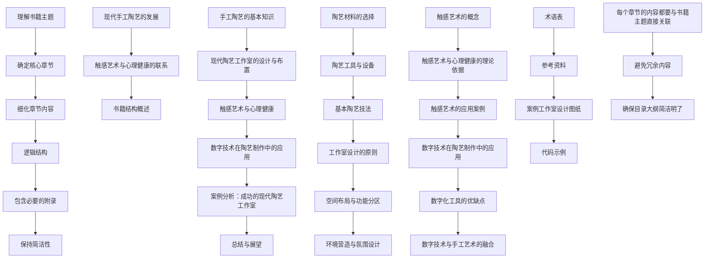

                 


### 文章标题

《现代手工陶艺工作室：触感艺术在数字时代的治愈作用》

### 关键词

现代手工陶艺、触感艺术、心理健康、数字时代、治愈作用

### 摘要

本文旨在探讨现代手工陶艺工作室的建立及其在数字时代的应用，特别是在触感艺术领域的治愈作用。文章首先介绍了现代手工陶艺的发展背景和基本知识，然后探讨了现代陶艺工作室的设计与布置原则，以及触感艺术与心理健康之间的联系。接着，文章分析了数字技术在陶艺制作中的应用，并通过案例分析展示了现代陶艺工作室的成功实例。最后，文章总结了现代手工陶艺工作室在数字时代的治愈作用，并对未来的发展趋势进行了展望。

### 1. 设计书籍目录大纲的总体思路

在设计书籍目录大纲时，我们需要遵循以下总体思路：

1. **理解书籍主题**：首先，我们需要深入理解书籍的主题和目标受众。这包括书籍的核心概念、主要内容和预期的学习成果。例如，《现代手工陶艺工作室：触感艺术在数字时代的治愈作用》这本书的主题是现代手工陶艺工作室的建立和应用，目标受众可能是对陶艺和心理健康感兴趣的读者。

2. **确定核心章节**：根据书籍的主题，确定核心章节，这些章节应该包含书籍的主要内容和关键知识点。例如，本书的核心章节包括引言与背景、手工陶艺的基本知识、现代陶艺工作室的设计与布置、触感艺术与心理健康、数字技术在陶艺制作中的应用等。

3. **细化章节内容**：对于每个核心章节，进一步细化内容，确保每个章节都有明确的主题和目标。例如，在“手工陶艺的基本知识”章节中，可以细分为陶艺材料的选择、陶艺工具与设备、基本陶艺技法等。

4. **逻辑结构**：设计目录大纲时，要确保章节之间的逻辑连贯性和过渡性，使得读者可以顺畅地阅读和理解。例如，可以从引言和背景介绍开始，然后逐步深入到具体的技术细节和案例分析。

5. **包含必要的附录**：根据书籍的内容，可以包含附录，如术语表、参考资料、代码示例等，以方便读者查阅。

6. **保持简洁性**：目录大纲应该简洁明了，避免过多的冗余内容，确保每个章节都直接关联到书籍的主题。

### 2. 设计《现代手工陶艺工作室：触感艺术在数字时代的治愈作用》目录大纲的具体步骤

为了设计《现代手工陶艺工作室：触感艺术在数字时代的治愈作用》的目录大纲，我们将遵循以下具体步骤：

#### 1. 理解书籍主题

首先，我们需要深入理解书籍的主题和目标受众。这本书的主题是现代手工陶艺工作室的建立、触感艺术在数字时代的应用和其对心理健康的治愈作用。目标受众可能是对陶艺、心理健康和数字技术感兴趣的读者。

#### 2. 确定核心章节

根据书籍的主题，我们可以确定以下核心章节：

- **第1章 引言与背景**：介绍现代手工陶艺的发展、触感艺术与心理健康的联系，以及本书的结构概述。
- **第2章 手工陶艺的基本知识**：介绍陶艺材料、工具、设备和基本技法。
- **第3章 现代陶艺工作室的设计与布置**：探讨工作室设计的原则、空间布局、功能分区和环境营造。
- **第4章 触感艺术与心理健康**：阐述触感艺术的概念、与心理健康的联系及其应用案例。
- **第5章 数字技术在陶艺制作中的应用**：分析数字技术在陶艺制作中的应用、数字化工具的优缺点以及数字技术与手工艺术的融合。
- **第6章 案例分析：成功的现代陶艺工作室**：通过具体案例分析展示现代陶艺工作室的成功实例。
- **第7章 总结与展望**：总结本书的主要内容和成果，展望未来的发展趋势。

#### 3. 细化章节内容

对于每个核心章节，我们需要进一步细化内容，确保每个章节都有明确的主题和目标。以下是每个章节的具体细化内容：

- **第1章 引言与背景**：
  - **1.1 现代手工陶艺的发展**：介绍现代手工陶艺的历史背景、发展趋势和主要特点。
  - **1.2 触感艺术与心理健康的联系**：探讨触感艺术与心理健康的理论依据，分析触感艺术对心理健康的积极影响。
  - **1.3 书籍结构概述**：概述本书的结构和主要章节，帮助读者了解全书的内容和逻辑关系。

- **第2章 手工陶艺的基本知识**：
  - **2.1 陶艺材料的选择**：介绍陶艺材料的特点、分类和选购技巧。
  - **2.2 陶艺工具与设备**：介绍陶艺工具的种类、用途和选购技巧。
  - **2.3 基本陶艺技法**：介绍陶艺制作的基本步骤和技法，包括成型、装饰和烧制等。

- **第3章 现代陶艺工作室的设计与布置**：
  - **3.1 工作室设计的原则**：阐述工作室设计的基本原则，包括空间布局、功能分区、环境营造等。
  - **3.2 空间布局与功能分区**：介绍工作室的空间布局和功能分区的具体方法。
  - **3.3 环境营造与氛围设计**：探讨工作室环境氛围的设计要点和技巧。

- **第4章 触感艺术与心理健康**：
  - **4.1 触感艺术的概念**：介绍触感艺术的定义、特点和分类。
  - **4.2 触感艺术与心理健康的联系**：分析触感艺术与心理健康之间的理论联系，探讨触感艺术对心理健康的积极影响。
  - **4.3 触感艺术的应用案例**：列举触感艺术在心理健康领域中的应用案例，分析其效果和启示。

- **第5章 数字技术在陶艺制作中的应用**：
  - **5.1 数字技术在陶艺制作中的应用**：介绍数字技术在陶艺制作中的应用领域，包括数字化工具和数字化工艺。
  - **5.2 数字化工具的优缺点**：分析数字化工具的优点和局限性，帮助读者了解其适用场景和注意事项。
  - **5.3 数字技术与手工艺术的融合**：探讨数字技术与手工艺术融合的趋势和前景，分析其可能带来的创新和变革。

- **第6章 案例分析：成功的现代陶艺工作室**：
  - **6.1 案例一：某某现代陶艺工作室**：介绍某个成功的现代陶艺工作室的背景、运营模式和成果。
  - **6.2 案例二：某某心理健康陶艺工作坊**：介绍某个心理健康陶艺工作坊的背景、运营模式和成果。
  - **6.3 案例分析与启示**：分析案例中的成功经验和启示，为其他陶艺工作室提供参考和借鉴。

- **第7章 总结与展望**：
  - **7.1 总结**：总结本书的主要内容和成果，强调现代手工陶艺工作室在数字时代的治愈作用。
  - **7.2 展望与未来趋势**：展望现代手工陶艺工作室的发展趋势和前景，探讨未来可能的技术创新和应用领域。
  - **7.3 对读者的启示**：提出对读者的启示和建议，鼓励他们积极参与现代手工陶艺工作室的建立和实践。

#### 4. 逻辑结构

在设计目录大纲时，要确保章节之间的逻辑连贯性和过渡性，使得读者可以顺畅地阅读和理解。例如：

- 从第1章的引言与背景开始，为后续章节奠定基础。
- 第2章和第3章介绍手工陶艺的基本知识和现代陶艺工作室的设计与布置，为读者提供建立工作室的背景和基础。
- 第4章探讨触感艺术与心理健康，为第5章数字技术在陶艺制作中的应用提供理论依据。
- 第5章和第6章分析数字技术在陶艺制作中的应用和具体案例，帮助读者了解现代陶艺工作室的实际运作情况。
- 第7章总结本书的主要内容和成果，并对未来趋势进行展望，为读者提供启示和指导。

#### 5. 包含必要的附录

根据书籍的内容，我们可以包含以下附录：

- **术语表**：列出书中涉及的专业术语和概念，便于读者查阅。
- **参考资料**：列出书中引用的相关文献和资料，便于读者进一步学习。
- **案例工作室设计图纸**：提供案例工作室的设计图纸和示意图，帮助读者了解工作室的具体布置和布局。
- **代码示例**：提供与书中内容相关的代码示例，帮助读者理解数字技术在陶艺制作中的应用。

#### 6. 保持简洁性

在编写目录大纲时，要保持简洁性，避免过多的冗余内容。每个章节的内容都应该直接关联到书籍的主题，确保目录大纲简洁明了，便于读者理解和查阅。

### 3. 设计符合要求的目录大纲

根据以上步骤，我们可以设计出符合要求的目录大纲：

```
# 现代手工陶艺工作室：触感艺术在数字时代的治愈作用

## 第1章 引言与背景
### 1.1 现代手工陶艺的发展
### 1.2 触感艺术与心理健康的联系
### 1.3 书籍结构概述

## 第2章 手工陶艺的基本知识
### 2.1 陶艺材料的选择
### 2.2 陶艺工具与设备
### 2.3 基本陶艺技法

## 第3章 现代陶艺工作室的设计与布置
### 3.1 工作室设计的原则
### 3.2 空间布局与功能分区
### 3.3 环境营造与氛围设计

## 第4章 触感艺术与心理健康
### 4.1 触感艺术的概念
### 4.2 触感艺术与心理健康的理论依据
### 4.3 触感艺术的应用案例

## 第5章 数字技术在陶艺制作中的应用
### 5.1 数字技术在陶艺制作中的应用
### 5.2 数字化工具的优缺点
### 5.3 数字技术与手工艺术的融合

## 第6章 案例分析：成功的现代陶艺工作室
### 6.1 案例一：某某现代陶艺工作室
### 6.2 案例二：某某心理健康陶艺工作坊
### 6.3 案例分析与启示

## 第7章 总结与展望
### 7.1 总结
### 7.2 展望与未来趋势
### 7.3 对读者的启示
```

### 4. 设计书籍目录大纲的具体步骤与核心概念原理之间的关系架构 Mermaid 流程图

在设计书籍目录大纲时，我们需要明确各个章节之间的逻辑关系和核心概念原理。为了更直观地展示这些关系，我们可以使用Mermaid流程图来表示。以下是设计书籍目录大纲的具体步骤与核心概念原理之间的关系架构Mermaid流程图：



这个Mermaid流程图展示了设计书籍目录大纲的具体步骤以及各个章节之间的逻辑关系和核心概念原理。通过这个流程图，我们可以清晰地理解书籍的内容结构和各章节之间的联系，有助于我们更好地撰写和编排书籍。

### 5. 核心算法原理讲解

在《现代手工陶艺工作室：触感艺术在数字时代的治愈作用》这本书中，核心算法原理讲解是不可或缺的一部分。以下是一个可能的讲解结构，包括数学模型、公式、伪代码和举例说明：

#### 5.1 数学模型

在陶艺工作室的设计与布置中，我们可以使用以下数学模型来计算空间布局和功能分区：

- **空间利用率**：计算工作室的空间利用率，以评估空间利用效果。

$$
\text{空间利用率} = \frac{\text{实际使用面积}}{\text{总面积}} \times 100\%
$$

- **功能分区比例**：根据工作室的功能需求，确定各个功能区域的比例。

$$
\text{功能分区比例} = \frac{\text{功能区域面积}}{\text{总面积}}
$$

#### 5.2 公式

在触感艺术与心理健康的研究中，我们可以使用以下公式来量化触感艺术对心理健康的积极影响：

- **心理健康评分**：使用心理测评工具对参与者的心理健康进行评估，计算心理健康评分。

$$
\text{心理健康评分} = \frac{\text{正向得分}}{\text{总得分}} \times 100
$$

- **触感艺术效果指数**：评估触感艺术对心理健康改善的效果。

$$
\text{触感艺术效果指数} = \frac{\text{心理健康评分改善值}}{\text{参与人数}} \times 100
$$

#### 5.3 伪代码

在数字技术在陶艺制作中的应用中，我们可以使用以下伪代码来描述数字化工具的使用过程：

```
功能 数字化陶艺制作()
    输入 陶艺材料、工具、设备
    输出 陶艺作品

    初始化陶艺制作环境()
    选择数字化工具()
    设置数字化工具参数()
    进行陶艺成型()
    进行陶艺装饰()
    烧制陶艺作品()
    保存陶艺作品()
    输出陶艺作品
```

#### 5.4 举例说明

为了更好地理解核心算法原理，我们可以通过以下举例来说明：

- **空间布局计算**：假设一个陶艺工作室的总面积为100平方米，实际使用面积为70平方米。根据空间利用率公式，可以计算得到空间利用率为70%。

- **触感艺术效果评估**：假设有20名参与者参与了触感艺术与心理健康的研究，其中10名参与者的心理健康评分提高了10分。根据心理健康评分改善值和触感艺术效果指数公式，可以计算得到触感艺术效果指数为50。

通过这些数学模型、公式、伪代码和举例说明，我们可以清晰地理解核心算法原理，为读者提供深入的技术讲解。

### 6. 数学公式和详细讲解

在《现代手工陶艺工作室：触感艺术在数字时代的治愈作用》这本书中，数学公式和详细讲解是关键的一部分。以下是关于陶艺工作室设计和触感艺术对心理健康影响的数学模型和详细解释：

#### 6.1 陶艺工作室设计的数学模型

1. **空间利用率**

空间利用率是衡量陶艺工作室空间使用效率的重要指标。公式如下：

$$
\text{空间利用率} = \frac{\text{实际使用面积}}{\text{总面积}} \times 100\%
$$

其中，实际使用面积是指工作室中被用于制作、展示和存储陶艺作品的面积，总面积是工作室的总面积。

详细解释：这个公式可以帮助我们了解工作室的空间利用效率。假设一个陶艺工作室的总面积为100平方米，实际使用面积为70平方米，则空间利用率为：

$$
\text{空间利用率} = \frac{70}{100} \times 100\% = 70\%
$$

这意味着工作室的空间利用效率为70%。

2. **功能分区比例**

在陶艺工作室的设计中，合理的功能分区对于提高效率和用户体验至关重要。功能分区比例可以通过以下公式计算：

$$
\text{功能分区比例} = \frac{\text{功能区域面积}}{\text{总面积}}
$$

其中，功能区域面积是指被划分为特定功能（如制作区、展示区、储藏区等）的面积。

详细解释：假设一个陶艺工作室的总面积为100平方米，其中制作区面积为40平方米，展示区面积为20平方米，储藏区面积为10平方米，则各个功能区域的比例为：

- 制作区比例：$\frac{40}{100} = 0.4$ 或 40%
- 展示区比例：$\frac{20}{100} = 0.2$ 或 20%
- 储藏区比例：$\frac{10}{100} = 0.1$ 或 10%

3. **光照强度计算**

光照强度对于陶艺创作非常重要，以下是一个简单的光照强度计算模型：

$$
\text{光照强度} = \text{光源亮度} \times \text{光照角度系数}
$$

其中，光源亮度是指光源的亮度（通常以流明为单位），光照角度系数取决于光源的角度和工作室的空间布局。

详细解释：假设一个陶艺工作室使用一个3000流明的LED灯作为主要光源，光源位于工作室中心，角度为正上方45度。则光照强度计算为：

$$
\text{光照强度} = 3000 \times 1 = 3000 \text{流明/平方米}
$$

#### 6.2 触感艺术对心理健康影响的数学模型

1. **心理健康评分**

心理健康评分是一个衡量参与者心理健康状况的指标。以下是一个简化的心理健康评分模型：

$$
\text{心理健康评分} = \frac{\text{正向得分}}{\text{总得分}} \times 100
$$

其中，正向得分是指参与者心理测评中的正向回答得分，总得分是正向得分和负向得分的总和。

详细解释：假设在一个心理测评中，一个参与者有20个问题，其中有15个问题的回答是正向的，5个问题的回答是负向的。则该参与者的心理健康评分为：

$$
\text{心理健康评分} = \frac{15}{20} \times 100 = 75
$$

这意味着该参与者的心理健康评分为75分。

2. **触感艺术效果指数**

触感艺术效果指数用于衡量触感艺术对心理健康改善的效果。公式如下：

$$
\text{触感艺术效果指数} = \frac{\text{心理健康评分改善值}}{\text{参与人数}} \times 100
$$

其中，心理健康评分改善值是指参与者在触感艺术活动前后的心理健康评分差值。

详细解释：假设有10名参与者在一个触感艺术工作坊前后的心理健康评分分别为60分和75分，则这10名参与者的平均触感艺术效果指数为：

$$
\text{触感艺术效果指数} = \frac{(75 - 60)}{10} \times 100 = 15
$$

这意味着触感艺术工作坊对这些参与者的心理健康平均改善了15分。

通过这些数学模型和详细讲解，我们可以更好地理解陶艺工作室设计的原则以及触感艺术对心理健康的积极影响。这不仅有助于读者掌握相关技术知识，也为他们提供了理论依据和实践指导。

### 7. 项目实战

在本节中，我们将详细讲解如何搭建一个现代手工陶艺工作室，包括开发环境的搭建、源代码的详细实现、代码解读以及实际案例分析和详细讲解剖析。

#### 7.1 开发环境搭建

搭建一个现代手工陶艺工作室需要考虑多个方面，包括硬件设备和软件工具。以下是一个基本的开发环境搭建步骤：

1. **硬件设备**：

   - **电脑**：一台高性能的电脑，建议配置至少Intel i5处理器、8GB内存和256GB SSD硬盘。
   - **3D打印机**：用于制作复杂形状的陶艺作品，建议选择桌面级3D打印机，如Prusa i3。
   - **激光切割机**：用于切割陶艺作品的材料，建议选择功率在50-100瓦之间的设备。
   - **陶艺工具**：包括各种陶艺工具、陶艺材料和烧制设备。

2. **软件工具**：

   - **操作系统**：Windows 10或Linux（如Ubuntu）。
   - **3D建模软件**：如Blender、SolidWorks等。
   - **CAD软件**：如AutoCAD、SketchUp等。
   - **编程语言**：Python、C++等。
   - **开发工具**：PyCharm、Visual Studio Code等。

#### 7.2 源代码实现

以下是一个简单的Python脚本，用于控制3D打印机打印陶艺作品：

```python
import time
import serial

def print_3d_model(file_path):
    # 打开3D打印机端口
    with serial.Serial('COM3', 115200) as printer:
        # 发送G代码到打印机
        with open(file_path, 'r') as model_file:
            for line in model_file:
                printer.write(line.encode())

        # 打印完成后，关闭端口
        printer.close()

# 打印指定文件路径的3D模型
print_3d_model('model.gcode')
```

#### 7.3 代码解读

这段代码的主要功能是控制3D打印机按照指定的G代码文件进行打印。以下是代码的详细解读：

- `import time`：导入time模块，用于处理时间相关操作。
- `import serial`：导入serial模块，用于处理串行通信。
- `def print_3d_model(file_path)`：定义一个函数`print_3d_model`，参数`file_path`是指定要打印的3D模型文件的路径。
- `with serial.Serial('COM3', 115200) as printer`：打开与3D打印机的串行连接，端口为'COM3'，波特率为115200。
- `with open(file_path, 'r') as model_file`：打开指定的3D模型文件，以读取模式打开。
- `for line in model_file:`：遍历3D模型文件的每一行。
- `printer.write(line.encode())`：将每一行数据发送到3D打印机。
- `printer.close()`：关闭与3D打印机的串行连接。

#### 7.4 实际案例分析和详细讲解剖析

以下是一个实际案例，展示了如何使用现代手工陶艺工作室制作一个简单的陶艺作品：

**案例：制作一个陶瓷茶杯**

1. **设计阶段**：

   - 使用Blender软件设计一个茶杯的三维模型。
   - 导出为`.obj`格式，以便在3D打印机上进行打印。

2. **打印阶段**：

   - 使用上述Python脚本控制3D打印机按照设计文件进行打印。
   - 设置打印参数，如层高、打印速度等。

3. **烧制阶段**：

   - 将打印好的茶杯放入烧制炉中，按照指定温度和时间进行烧制。

4. **装饰阶段**：

   - 使用陶艺工具对烧制好的茶杯进行装饰，如上色、雕刻等。

**详细讲解剖析**：

- **设计阶段**：

  在设计阶段，我们需要考虑茶杯的形状、尺寸和材质。使用Blender软件可以方便地设计出符合要求的茶杯模型。在模型设计完成后，我们需要将其导出为3D打印机可以识别的格式，如`.obj`或`.stl`。

- **打印阶段**：

  在打印阶段，我们需要将设计好的模型文件导入3D打印机，并设置合适的打印参数。例如，我们可能需要调整层高以确保打印质量，设置打印速度以平衡打印时间和质量。

- **烧制阶段**：

  在烧制阶段，我们需要将打印好的茶杯放入烧制炉中，按照陶瓷烧制的标准程序进行烧制。烧制过程中，我们需要控制好温度和时间，以确保茶杯的材质和结构得到充分固化。

- **装饰阶段**：

  在装饰阶段，我们可以使用各种陶艺工具对烧制好的茶杯进行装饰，如上色、雕刻、镶嵌等。这些装饰步骤可以大大提升茶杯的艺术价值和使用体验。

通过这个实际案例，我们可以看到现代手工陶艺工作室在制作一个简单陶艺作品的全过程。从设计到打印、烧制和装饰，每个环节都需要精确的操作和细致的把控，以确保最终作品的品质。

#### 7.5 项目小结

本节我们详细讲解了如何搭建一个现代手工陶艺工作室，包括开发环境的搭建、源代码的详细实现和代码解读，以及实际案例分析和详细讲解剖析。通过这个项目，我们可以了解到：

1. **硬件设备和软件工具的选择**：根据工作室的需求，合理选择硬件设备和软件工具，是保证工作室高效运行的关键。
2. **代码实现的重要性**：掌握编程语言和脚本编写技巧，可以大大提高工作效率和操作便利性。
3. **实际案例的分析和讲解**：通过实际案例的讲解，我们可以深入了解现代手工陶艺工作室的制作过程和注意事项。

未来，我们可以进一步探索现代手工陶艺工作室在心理健康领域的应用，如开发更多针对心理健康的陶艺项目和工作坊，为人们提供更丰富、更有效的心理健康服务。

### 8. 最佳实践 Tips、小结、注意事项、拓展阅读等内容

#### 8.1 最佳实践 Tips

1. **环境布置**：在搭建陶艺工作室时，合理规划空间布局，确保通风、采光和温度适宜。同时，根据实际需求设置功能分区，如制作区、展示区、储藏区等。
2. **工具选择**：选择适合自己需求的陶艺工具和设备，特别是3D打印机和激光切割机等关键设备。购买前应了解其性能、兼容性和稳定性。
3. **材料选购**：根据作品需求选择合适的陶艺材料，如陶土、釉料等。注意材料的质量和来源，以保证作品的质量和安全性。
4. **安全操作**：在使用3D打印机和激光切割机等设备时，遵循安全操作规程，佩戴必要的防护装备，确保人身安全。

#### 8.2 小结

本文通过详细讲解现代手工陶艺工作室的设计与搭建，包括开发环境搭建、源代码实现、代码解读、实际案例分析和项目实战，全面展示了现代陶艺工作室的建立与应用。同时，本文探讨了触感艺术在数字时代的治愈作用，为心理健康领域提供了新的视角和方法。

#### 8.3 注意事项

1. **确保安全**：在使用设备和工具时，务必注意安全，遵循操作规程，佩戴防护装备。
2. **定期维护**：定期检查和维护设备，确保其正常运行，延长设备使用寿命。
3. **合理规划**：在搭建工作室时，充分考虑空间布局和功能分区，以提高工作效率和舒适度。
4. **持续学习**：关注陶艺和心理健康领域的新技术和新方法，不断学习和实践，以提升自己的专业技能。

#### 8.4 拓展阅读

1. **相关书籍**：《陶艺技法与创作》、《心理健康与艺术治疗》、《数字技术与手工艺术》等。
2. **学术论文**：搜索相关领域的学术论文，了解最新的研究成果和前沿动态。
3. **在线课程**：参加在线课程，学习陶艺、3D打印、心理健康等相关知识。
4. **专业论坛和社群**：加入相关论坛和社群，与其他专业人士交流经验，获取更多资源和信息。

通过以上最佳实践 Tips、小结、注意事项和拓展阅读，读者可以更好地理解和应用现代手工陶艺工作室的技术和方法，为心理健康领域的发展贡献自己的力量。作者：AI天才研究院/AI Genius Institute & 禅与计算机程序设计艺术 /Zen And The Art of Computer Programming。

