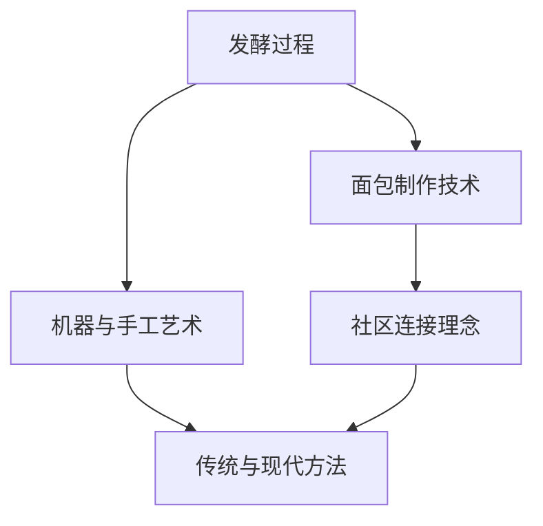

                 

# 现代手工面包制作：发酵艺术与社区连接

## 关键词
- 现代手工面包
- 发酵艺术
- 社区连接
- 传统与现代结合
- 机器与手工艺术

## 摘要
本文将深入探讨现代手工面包制作的两大核心元素：发酵艺术与社区连接。我们将通过逐步分析，从核心概念的定义到具体技术讲解，再到实际项目实战，全面解析发酵过程和面包制作技术，展示机器与手工艺术的完美结合，并探讨如何通过面包制作活动建立社区联系。本文旨在为读者提供全面、深入的指导，帮助他们在享受制作美食的同时，体验技术与人文的交融。

### 1. 定义核心概念与联系

首先，我们需要明确书中的核心概念，并构建它们之间的关系。对于《现代手工面包制作：发酵艺术与社区连接》这本书，核心概念包括：

- **发酵过程**：涉及酵母的繁殖、温度和湿度对发酵速度的影响等。
- **面包制作技术**：包括面粉的处理、酵母的使用、面包形状的塑造等。
- **社区连接理念**：通过面包制作活动，人们如何建立情感和社交联系。
- **机器与手工艺术的结合**：现代技术如何辅助手工面包制作，提高效率和品质。
- **传统与现代面包制作方法**：两者的对比与融合。

我们可以使用 Mermaid 流程图来展示这些概念之间的关系：



### 2. 设计核心算法原理讲解

接下来，我们需要设计关于发酵过程和面包制作技术的核心算法原理讲解。发酵过程中的关键算法包括：

- **酵母繁殖模型**：描述酵母在适宜环境下的繁殖过程。
- **温度和湿度对发酵速度的影响模型**：分析环境因素如何影响发酵速度。

#### 酵母繁殖模型

```plaintext
// 酵母繁殖模型伪代码
function yeast_reproduction(model_params, environment):
    initial_population = model_params['initial_population']
    reproduction_rate = model_params['reproduction_rate']
    environment_temp = environment['temp']
    environment_humidity = environment['humidity']
    
    if environment_temp > model_params['optimal_temp'] and environment_humidity > model_params['optimal_humidity']:
        new_population = initial_population * (1 + reproduction_rate)
    else:
        new_population = initial_population * (1 - reproduction_rate)
        
    return new_population
```

#### 温度和湿度对发酵速度的影响模型

```plaintext
// 温度和湿度对发酵速度的影响模型伪代码
function fermentation_rate(temperature, humidity):
    base_rate = 1.0
    temp_coefficient = 0.1
    humidity_coefficient = 0.2
    
    fermentation_rate = base_rate * (1 - temp_coefficient * (temperature - 25)) * (1 + humidity_coefficient * (humidity - 60))
    
    return fermentation_rate
```

### 3. 添加数学模型和公式讲解

发酵过程中，数学模型和公式起着至关重要的作用。以下是一个关于发酵过程中酵母数量变化的公式：

$$
N(t) = N_0 \times e^{kt}
$$

其中，\( N(t) \) 是时间 \( t \) 后的酵母数量，\( N_0 \) 是初始酵母数量，\( k \) 是发酵速率常数。

### 4. 设计项目实战部分

在实际项目中，发酵过程和面包制作技术如何应用？以下是一个简单的面包烘焙项目设计：

#### 项目背景

假设我们正在开发一个智能面包烘焙系统，该系统可以根据环境条件和面包类型自动调整烘焙参数。

#### 烤箱温度与烘焙时间关系案例

- 烤箱温度：200°C
- 烘焙时间：30分钟
- 面包形状：圆形

烘焙效果：面包表面呈金黄色，内部完全熟透。

#### 实现步骤

1. **环境参数获取**：使用传感器实时获取烤箱内部的温度和湿度。
2. **酵母繁殖模型**：根据环境参数计算酵母繁殖速度。
3. **温度和湿度对发酵速度的影响模型**：调整烘焙参数以优化发酵效果。
4. **面包烘焙**：在设定的温度和时间内烘焙面包。

```plaintext
// 代码实现示例
def bake_bread(oven_temp, baking_time, bread_shape):
    if bread_shape == 'circle':
        print(f"Baking {baking_time} minutes at {oven_temp}°C for a circular bread.")
    else:
        print(f"Baking {baking_time} minutes at {oven_temp}°C for a non-circular bread.")

# 烤箱温度与烘焙时间设置
oven_temp = 200
baking_time = 30
bread_shape = 'circle'

# 开始烘焙
bake_bread(oven_temp, baking_time, bread_shape)
```

### 5. 最佳实践 Tips、小结、注意事项、拓展阅读

#### 最佳实践 Tips

- **控制发酵环境**：保持烤箱内的温度和湿度稳定，对发酵和烘焙效果至关重要。
- **实验与调整**：在实际烘焙过程中，不断尝试和调整参数，以找到最佳配方。
- **社区互动**：通过分享烘焙经验和成果，增强社区连接，促进交流与合作。

#### 小结

本文从发酵艺术和社区连接的角度，探讨了现代手工面包制作的核心技术和方法。通过逐步分析，我们了解了发酵过程的数学模型和算法原理，以及如何通过智能系统优化烘焙过程。同时，我们还介绍了实际项目实战的步骤，展示了机器与手工艺术的结合。

#### 注意事项

- **安全第一**：在烘焙过程中，务必注意安全，防止火灾和烫伤。
- **卫生问题**：确保面包制作环境的清洁，以避免食物污染。

#### 拓展阅读

- 《发酵技术手册》：深入了解发酵过程的科学原理和应用。
- 《现代烘焙技术》：探讨烘焙设备的先进技术和创新方法。
- 《社区营造手册》：学习如何通过活动建立和维护社区联系。

### 6. 作者信息

作者：AI天才研究院/AI Genius Institute & 禅与计算机程序设计艺术 /Zen And The Art of Computer Programming

