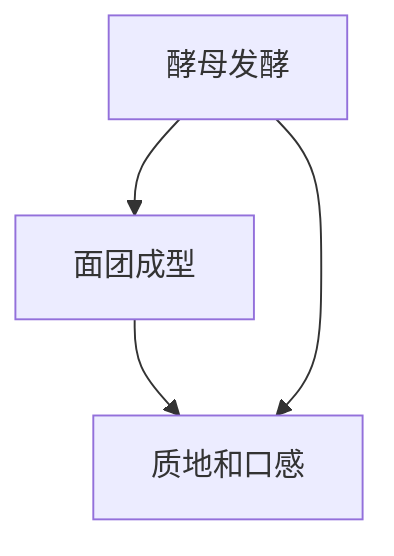

                 

### 引言与概述

#### 1.1 书籍背景与目的

在现代饮食文化中，面包作为一种基础且多样化的食品，已经远远超越了其单一的食用功能，成为了艺术与工艺结合的载体。随着科技的进步和人们对健康饮食的重视，现代手工面包艺术在近几年得到了迅速的发展。本篇文章旨在探讨现代手工面包艺术，特别是面包形状与口感的创新可能，为烘焙爱好者、专业面包师以及食品工艺研究者提供一份系统、详尽的技术指南。

##### 1.1.1 现代手工面包艺术的兴起

近年来，手工面包艺术在全球范围内得到了广泛认可。它不仅保留了传统面包的精髓，还融入了现代科技与创意，使得面包的形状和口感更加丰富多样。这种趋势从专业烘焙大赛、流行文化、到家庭烘焙中都可以明显感受到。

##### 1.1.2 探索面包形状与口感的创新意义

面包形状的创新不仅丰富了面包的艺术表现力，还能提高消费者的购买欲望和体验。而口感的创新则直接影响到面包的口感品质，进而影响消费者的满意度。因此，探索面包形状与口感的创新，对于提升面包市场竞争力具有重要意义。

##### 1.1.3 面包艺术对饮食文化的贡献

面包艺术在饮食文化中具有独特的地位。它不仅是一种美食，更是一种文化象征和艺术表现形式。通过创新面包的形状与口感，可以促进不同文化之间的交流与融合，丰富饮食文化的内涵。

#### 1.2 面包制作的基础知识

##### 1.2.1 面包的制作流程

面包的制作流程主要包括原料准备、面团揉制、面团发酵、成型、烘烤和冷却等几个步骤。每个步骤都对面包的最终品质有着重要影响，需要严格把控。

##### 1.2.2 常见面包类型及其特点

常见的面包类型包括法式长棍、全麦面包、丹麦面包等，每种面包都有其独特的风味和制作工艺。了解不同面包的特点，有助于我们在创新过程中选择合适的面包类型。

##### 1.2.3 面包制作的工具和材料

面包制作的工具和材料多种多样，从传统的石板烤箱到现代化的发酵设备，从面粉、酵母到各种添加剂，这些工具和材料都在面包制作中发挥着重要作用。选择合适的工具和材料，是确保面包品质的关键。

### 摘要

本文将详细探讨现代手工面包艺术的背景与意义，从基础原理、形状创新、口感提升、制作技巧、应用与创新等多个方面，全面解析面包艺术的奥妙。通过本文，读者可以了解到面包制作的科学原理和实践技巧，掌握面包形状与口感创新的方法，为烘焙领域的研究和实践提供有益的参考。

### 关键词

- 现代手工面包艺术
- 面包形状创新
- 口感提升
- 制作技巧
- 应用与创新

## 手工面包艺术的基本原理

### 2.1 面包的化学原理

在探索手工面包艺术的过程中，理解面包的化学原理至关重要。这包括酵母发酵的机制、酵母活性影响因素以及面包成型原理。

#### 2.1.1 酵母发酵机制

酵母发酵是面包制作过程中最关键的一步。酵母是一种单细胞真菌，通过分解面粉中的糖类产生二氧化碳气体，从而使面团膨胀。这一过程可以分为三个阶段：糖发酵、醇发酵和酸发酵。

- **糖发酵**：酵母首先将面粉中的糖类分解成酒精和二氧化碳。这个过程通常在25-30摄氏度下进行，并且需要充足的水分和氧气。
  
  $$ C_6H_{12}O_6 \rightarrow 2 C_2H_5OH + 2 CO_2 $$

- **醇发酵**：酒精继续被酵母分解成二氧化碳和水。

  $$ C_2H_5OH + O_2 \rightarrow 2 CO_2 + 2 H_2O $$

- **酸发酵**：在较低的温度下，剩余的酒精会继续分解，产生醋酸和二氧化碳。这一阶段的酸味有助于提升面包的风味。

  $$ C_2H_5OH + O_2 \rightarrow CH_3COOH + CO_2 $$

#### 2.1.2 酵母活性影响因素

酵母的活性受到多种因素的影响，包括温度、水分、pH值和添加剂等。

- **温度**：酵母在不同温度下的活性不同。通常，酵母在25-30摄氏度的温度下活性最高。过高或过低的温度都会影响酵母的发酵效果。

- **水分**：适量的水分是酵母发酵的必要条件。水分过多会导致面团过于湿润，不利于成型；水分过少则会影响酵母的活性。

- **pH值**：酵母在不同pH值下的活性也不同。通常，pH值在5.5到7之间最适宜酵母的发酵。

- **添加剂**：某些添加剂，如盐、糖和油脂，会影响酵母的发酵速度和面包的风味。例如，盐可以抑制酵母的生长，从而延长发酵时间，使面包风味更浓郁。

#### 2.1.3 面包成型原理

面包的成型原理涉及到面团在发酵和烘烤过程中的变化。面团中的水分和酵母在发酵过程中产生气体，使面团体积膨胀。在烘烤过程中，面团中的水分蒸发，气体膨胀，使面包形成独特的质地和形状。

- **面团拉伸与折叠**：在面团发酵过程中，通过反复的拉伸和折叠，可以使面团形成均匀的网络结构，有利于气体的均匀分布。

- **面包形状的稳定性**：面包的形状稳定性取决于面团的质地和烘烤条件。适当的水分和蛋白质含量可以增强面团的弹性，从而提高面包的形状稳定性。

### 2.2 面包的物理特性

#### 2.2.1 面包的质地与结构

面包的质地和结构直接影响其口感。面包的质地主要由气孔大小、气孔分布和蛋白质网络结构决定。

- **气孔的形成**：在酵母发酵过程中，面团中的酵母分解糖类产生二氧化碳气体，这些气体在面团中形成气孔。气孔的大小和分布会影响面包的松软度和口感。

- **质地控制因素**：面粉的种类和比例、酵母的用量和活性、发酵时间和温度等因素都会影响面包的质地。

#### 2.2.2 口感

口感是面包品质的重要指标。面包的口感主要受到以下几个因素的影响：

- **气体含量**：适当的气体含量可以使面包松软多孔。
- **水分含量**：水分含量过高或过低都会影响面包的口感。
- **淀粉糊化**：淀粉的糊化程度会影响面包的质地和口感。

#### 2.2.3 口感的评价方法

口感的评价方法主要包括以下几种：

- **主观评价**：通过品尝和观察来评价面包的口感。
- **物理测量**：使用物理仪器测量面包的松软度、弹性等指标。
- **化学分析**：通过化学方法分析面包中的成分和化学反应。

### 2.3 面包制作的核心概念

在手工面包制作中，核心概念包括酵母发酵、面团成型、质地和口感控制等。这些概念相互关联，共同决定了面包的品质。

- **酵母发酵**：是面包制作的基础，直接影响面包的体积和口感。
- **面团成型**：决定了面包的形状和结构。
- **质地和口感控制**：决定了面包的最终品质。

#### 2.3.1 核心概念之间的联系

这些核心概念之间的联系可以用以下Mermaid流程图表示：



#### 2.3.2 伪代码与数学模型

为了更好地理解面包制作的核心概念，我们可以使用伪代码和数学模型来描述这些过程。

```python
# 酵母发酵伪代码
def yeast发酵(面团，温度，水分，pH值):
    if 温度在25-30摄氏度之间 and 水分适宜 and pH值适宜:
        面团体积膨胀
        生成二氧化碳气体
    else:
        发酵效果不佳

# 面包成型伪代码
def 面包成型(面团，拉伸与折叠次数，烘烤温度):
    面团形成均匀的网络结构
    面包形状稳定

# 质地与口感控制伪代码
def 控制质地和口感(面团，气体含量，水分含量，淀粉糊化程度):
    if 气体含量适宜 and 水分含量适宜 and 淀粉糊化程度适宜:
        面包质地松软，口感佳
    else:
        面包质地不佳，口感差
```

### 总结

手工面包艺术的基本原理涉及到化学和物理两个方面。理解酵母发酵机制、面团成型原理以及面包的质地和口感控制，是成功制作优质面包的关键。通过运用伪代码和数学模型，我们可以更清晰地描述这些过程，从而提高面包制作的效率和品质。

### 2.4 面包的科学原理：面粉和酵母的作用

在探索手工面包艺术的过程中，了解面粉和酵母的科学原理至关重要。这两种原料不仅决定了面包的基本结构和口感，还直接影响面包的质地和风味。

#### 2.4.1 面粉的组成和作用

面粉是面包制作的主要原料，其组成和特性对面包的品质有着重要影响。面粉主要由淀粉、蛋白质、脂肪、矿物质和维生素组成。

- **淀粉**：淀粉是面粉中的主要成分，占面粉重量的70%至80%。淀粉在面团发酵过程中会发生糊化，糊化后的淀粉能够吸收水分，形成凝胶状物质，为面团提供弹性和韧性。

- **蛋白质**：面粉中的蛋白质主要来自面筋蛋白，包括谷蛋白和醇溶蛋白。面筋蛋白在面团吸水后会形成网络结构，赋予面团弹性。谷蛋白在面团中起到骨架作用，醇溶蛋白则赋予面团水分保持能力。

- **脂肪**：面粉中的脂肪含量较低，主要来源于胚芽和麸皮。脂肪在面团发酵过程中能够提供额外的风味，并有助于面团保持柔软和湿润。

- **矿物质和维生素**：面粉中的矿物质和维生素对面包的口感和营养品质有重要作用，如铁、锌、钙等矿物质可以增强面包的风味，维生素B群则有助于面包的发酵过程。

#### 2.4.2 酵母的作用

酵母是面包发酵的关键，它通过代谢面粉中的糖类产生二氧化碳气体，使面团膨胀。酵母的主要作用包括：

- **产生二氧化碳**：酵母在面团中分解糖类，通过发酵过程产生二氧化碳气体。二氧化碳气体在烘烤过程中膨胀，使面包形成多孔的结构。

- **调节面团温度**：酵母的发酵过程会产生一定的热量，有助于调节面团温度，使其保持在适宜的发酵范围内。

- **产生风味物质**：酵母在发酵过程中还会产生一系列风味物质，如醇类、酸类和酯类，这些物质为面包提供了独特的风味。

#### 2.4.3 面粉与酵母的相互作用

面粉和酵母的相互作用决定了面包的最终品质。以下是一些关键因素：

- **水分含量**：适量的水分是酵母发酵的必要条件。水分过多会导致面团过于湿润，影响成型；水分过少则会影响酵母的活性。

- **温度**：酵母在不同温度下的活性不同。通常，酵母在25-30摄氏度的温度下活性最高。过高或过低的温度都会影响酵母的发酵效果。

- **时间**：发酵时间的长短会影响面团的质地和口感。适当的发酵时间可以使面团充分膨胀，产生足够的气体，形成理想的质地。

- **pH值**：酵母在不同pH值下的活性也不同。通常，pH值在5.5到7之间最适宜酵母的发酵。

#### 2.4.4 面粉与酵母的科学解释

为了更好地理解面粉与酵母的相互作用，我们可以从分子水平上分析它们的化学反应。

- **淀粉糊化**：在面团发酵过程中，淀粉会吸水膨胀并发生糊化。糊化后的淀粉形成凝胶状物质，赋予面团弹性。

- **蛋白质网络**：面筋蛋白在面团吸水后会形成网络结构。谷蛋白和醇溶蛋白共同作用，使面团具有弹性。

- **酵母代谢**：酵母在面团中分解糖类，通过发酵过程产生二氧化碳气体。这个过程可以用以下化学方程式表示：

  $$ C_6H_{12}O_6 \rightarrow 2 C_2H_5OH + 2 CO_2 $$

- **风味物质**：酵母在发酵过程中还会产生一系列风味物质，如醇类、酸类和酯类。这些物质为面包提供了独特的风味。

#### 2.4.5 举例说明

为了更直观地理解面粉与酵母的相互作用，我们可以通过以下例子来阐述：

- **法式长棍面包**：法式长棍面包具有外脆内软、口感酥脆的特点。这种面包的制作关键在于面团的拉伸和折叠，以及适当的发酵时间和温度。面粉中的面筋蛋白在拉伸和折叠过程中形成网络结构，使面团具有弹性。酵母在发酵过程中产生二氧化碳气体，使面团膨胀，形成多孔的结构。

- **全麦面包**：全麦面包具有丰富的膳食纤维和营养成分。这种面包的制作关键在于全麦面粉的选用和适当的酵母发酵。全麦面粉中的面筋蛋白含量较低，但富含膳食纤维。酵母在发酵过程中分解糖类，产生二氧化碳气体，使面团膨胀。同时，全麦面粉中的膳食纤维为面包提供了独特的口感。

### 总结

面粉和酵母是面包制作的核心原料，它们的相互作用决定了面包的最终品质。通过理解面粉的组成和酵母的发酵机制，我们可以更科学地控制面包的制作过程，从而制作出口感丰富、质地独特的面包。掌握这些科学原理，不仅有助于提升烘焙技能，还能为面包艺术的发展提供新的思路。

### 2.5 面包形状的创新设计

在现代手工面包艺术中，形状的创新设计是提升面包吸引力和艺术价值的重要手段。通过独特的形状设计，不仅可以增加面包的美学价值，还能提升消费者的购买欲望和体验。本节将探讨面包形状创新的设计原则、灵感来源及实现方法。

#### 2.5.1 设计原则

在面包形状的创新设计中，以下原则至关重要：

- **实用性**：面包的形状应便于使用和食用，确保消费者在食用过程中不会感到不便。
- **美观性**：形状设计应具备较高的美学价值，能够吸引消费者的目光。
- **创意性**：形状设计应具有独特的创意，避免与市场上常见的面包形状雷同。
- **文化性**：形状设计可以融入当地文化元素，提升面包的文化内涵。

#### 2.5.2 灵感来源

面包形状的创新设计灵感可以来源于多个方面：

- **自然形态**：模仿自然界的动植物形态，如蝴蝶、花朵等，可以创造出独特而美丽的面包形状。
- **建筑与艺术品**：借鉴建筑和艺术品的线条和形状，可以创造出具有艺术感的面包。
- **传统文化**：结合当地传统文化元素，如传统节日的象征物、民族图案等，可以赋予面包丰富的文化内涵。
- **现代科技**：利用现代科技手段，如3D打印技术，可以创造出复杂的几何形状和独特的设计。

#### 2.5.3 实现方法

实现面包形状的创新设计可以通过以下几种方法：

- **面团折叠技巧**：通过不同的折叠方式，可以将简单的面团变成复杂的形状。例如，可以使用“千层折叠法”制作多层夹心的面包，使用“螺旋折叠法”制作螺旋形状的面包。
- **模具制作**：使用各种模具可以制作出特定的形状。例如，可以使用饼干模具制作出各种图案的面包，使用特殊形状的烤盘制作出独特的设计。
- **烘烤技术**：通过控制烘烤温度和时间，可以使面包在烘烤过程中变形，形成特定的形状。例如，通过高温烘烤可以制作出脆脆的边缘和柔软的中心，通过低温烘烤可以保持面团的形状。
- **3D打印技术**：利用3D打印技术可以制作出复杂的形状。例如，可以使用3D打印制作出具有复杂纹理的面包外壳，或者打印出带有特定图案的面团。

#### 2.5.4 案例分析

以下是一些具体的案例分析：

- **蝴蝶形状的面包**：通过千层折叠法，将面团折叠成蝴蝶的形状，并在烘烤前进行适当的装饰，可以制作出精美的蝴蝶形状面包。
- **花朵形状的面包**：使用模具制作出花朵形状的面团，并在烘烤前撒上巧克力碎片和彩色糖粉，可以制作出花朵形状的面包。
- **建筑形状的面包**：利用3D打印技术，可以制作出具有独特建筑线条的面包。例如，可以打印出巴黎铁塔、埃菲尔铁塔等著名建筑的形状。

通过这些案例可以看出，面包形状的创新设计不仅可以提升面包的艺术价值，还可以丰富消费者的体验。设计师可以根据不同的需求和灵感，运用不同的方法和技术，创造出各种独特的面包形状。

### 总结

面包形状的创新设计是现代手工面包艺术的重要一环。通过合理的形状设计，可以提升面包的美观性和艺术价值，增加消费者的购买欲望和体验。设计师可以根据不同的设计原则和灵感来源，运用多种方法和技术，创造出丰富多彩的面包形状。这不仅丰富了面包艺术的表现形式，也为食品工艺的创新提供了新的思路。

### 3.2.1 面包形状设计的创意来源

在面包形状的设计过程中，创意来源是激发创新思维的关键。设计师可以从多个方面寻找灵感，包括自然形态、文化元素和现代科技，这些元素不仅丰富了面包的形状设计，还赋予了面包独特的艺术价值和文化内涵。

#### 自然形态的模仿

自然界的动植物、风景和气候条件为面包形状设计提供了丰富的灵感来源。通过模仿自然形态，设计师可以创造出与大自然和谐共生的面包形状。

- **动植物形态**：蝴蝶、蜜蜂、鱼、花朵等动植物形态的模仿是面包形状设计中的常见手法。例如，通过面团的折叠和塑形，可以将简单的面团变成蝴蝶的翅膀或蜜蜂的身体，为面包赋予生动的形象。
- **风景和气候**：海洋波浪、森林景观、山脉轮廓等自然风景也是面包形状设计的重要灵感来源。例如，可以使用面团的折叠和雕刻技术，制作出模拟海浪纹理或山脉形状的面包。

#### 文化元素的融入

面包作为一种具有悠久历史和文化内涵的食品，不同文化背景下的传统节日、习俗和象征物为面包形状设计提供了丰富的创意来源。

- **地域文化**：不同地区的传统文化元素，如中国传统的吉祥图案、欧洲的宗教符号等，可以融入面包形状设计中。例如，春节的福字、中秋的月亮等图案可以制作成装饰在面包上的装饰物。
- **节日庆典**：各种节日的庆祝活动为面包形状设计提供了丰富的灵感。例如，圣诞节时期的圣诞树、圣诞老人等元素可以制作成独特的面包形状，为节日氛围增添色彩。

#### 现代科技的应用

现代科技的发展为面包形状设计带来了新的可能性，特别是3D打印技术的应用，使得复杂的形状设计变得触手可及。

- **3D打印技术**：3D打印技术可以在短时间内制作出复杂的形状，为面包形状设计提供了无限的创意空间。例如，可以使用3D打印制作出具有独特几何形状的面包外壳，或者将复杂图案直接打印在面团表面。
- **新材料和添加剂**：现代科技的进步还带来了新材料的开发和应用，如可食用墨水、可降解模具等，这些新材料和添加剂为面包形状设计提供了新的可能性。

#### 创意来源的应用

设计师可以根据不同的创意来源，将灵感融入面包形状设计，创造出丰富多彩的面包作品。

- **结合自然形态与文化元素**：可以设计出既具有自然美感又富含文化内涵的面包。例如，将中国传统的莲花图案与自然形态的螺旋形状结合，制作出具有独特风格的莲花面包。
- **现代科技与传统工艺的结合**：通过将3D打印技术与传统面包制作工艺相结合，可以创造出既具有现代科技感又具有传统工艺特色的面包。例如，使用3D打印技术制作出复杂的面包模具，然后通过传统工艺进行烘烤。

通过以上各种创意来源的应用，面包形状设计不仅丰富了面包的艺术表现力，还为食品工艺的创新提供了新的思路。设计师可以充分发挥创意，结合不同的元素，创造出独具特色的面包形状，为消费者带来独特的美食体验。

### 3.2.2 形状设计的实现方法

在面包形状的创新设计中，实现复杂形状的方法和技巧至关重要。以下将详细讨论面团折叠技巧和烘烤技术的运用，以及这些方法在形状设计中的应用。

#### 面团折叠技巧

面团折叠技巧是面包形状设计中的核心环节之一，通过不同的折叠方式，可以将简单的面团变成复杂而独特的形状。以下是一些常见的面团折叠技巧：

1. **千层折叠法**：
   - **原理**：千层折叠法通过将面团反复折叠，形成多层结构，使面包具有丰富的层次感。
   - **步骤**：首先将面团揉至光滑，然后将其擀开成薄片。接着，将薄片卷起，对折成一半，再将其擀开，再次卷起并折叠。重复此过程，每折叠一次都会增加面团的层次。
   - **应用**：这种折叠方式常用于制作夹心面包，如千层酥面包，通过不同的夹心材料，可以创造出多种口味和视觉效果。

2. **螺旋折叠法**：
   - **原理**：螺旋折叠法通过将面团旋转并折叠，形成螺旋形状，使面包具有独特的线条美。
   - **步骤**：首先将面团揉至光滑，然后将其擀成一个矩形。将矩形的一端向中心折叠，然后旋转90度，再次将另一端向中心折叠。重复这个过程，每次旋转时使面团的旋转方向相反，最终形成螺旋形状。
   - **应用**：螺旋折叠法常用于制作螺旋形状的面包，如螺旋丹麦面包，其独特的形状和层次感使其成为餐桌上的一道亮点。

3. **层叠折叠法**：
   - **原理**：层叠折叠法通过将面团多次层叠，形成多层的复杂结构，使面包具有丰富的口感和纹理。
   - **步骤**：首先将面团揉至光滑，然后将其擀成薄片。将薄片卷起，对折成一半，然后擀开，再次卷起并折叠。重复这个过程，每次折叠都会增加面团的层次，最终形成多层结构。
   - **应用**：层叠折叠法常用于制作多层夹心的面包，如千层酥面包，通过不同的夹心材料，可以创造出多种口味和视觉效果。

#### 烘烤技术的运用

烘烤技术是决定面包形状和质地的重要因素。通过调整烘烤温度和时间，可以控制面包的膨胀和成型，从而实现复杂形状的设计。

1. **烘烤温度**：
   - **原理**：烘烤温度直接影响面团的膨胀速度和面包的质地。较高的温度会使面团迅速膨胀，而较低的温度则使面团缓慢膨胀。
   - **应用**：在制作复杂形状的面包时，可以通过控制烘烤温度来调整面团的膨胀速度。例如，在烘烤初期使用较低的温度，使面团缓慢膨胀，形成稳定的结构，然后在烘烤后期逐渐提高温度，使面包表面迅速膨胀，形成丰富的层次感。

2. **烘烤时间**：
   - **原理**：烘烤时间直接影响面包的熟度和质地。适当的烘烤时间可以使面包内外均匀受热，形成理想的质地。
   - **应用**：在制作复杂形状的面包时，可以通过调整烘烤时间来控制面包的熟度。例如，在烘烤初期，可以适当延长烘烤时间，使面团充分发酵，形成稳定的形状；在烘烤后期，可以缩短烘烤时间，防止面包过度膨胀，影响形状。

#### 技巧的应用

以下是一些具体的形状设计案例，展示了面团折叠技巧和烘烤技术在面包形状设计中的应用：

1. **千层酥面包**：
   - **设计理念**：通过千层折叠法，使面包具有丰富的层次感。
   - **实现方法**：将面团多次折叠，形成多层结构，并在每个层次之间加入不同的夹心材料，如巧克力、果酱等，使面包具有多种口味。
   - **烘烤技术**：在烘烤过程中，逐渐提高温度，使面包表面迅速膨胀，形成酥脆的外层。

2. **螺旋丹麦面包**：
   - **设计理念**：通过螺旋折叠法，使面包具有独特的线条美。
   - **实现方法**：将面团擀成矩形，通过螺旋折叠法将其卷起，形成螺旋形状。
   - **烘烤技术**：在烘烤过程中，逐渐提高温度，使面团均匀受热，形成柔软的内部和酥脆的外层。

3. **花形面包**：
   - **设计理念**：通过简单的折叠和塑形，制作出花形面包。
   - **实现方法**：将面团擀成薄片，然后通过简单的折叠和塑形，形成花瓣形状。
   - **烘烤技术**：在烘烤过程中，控制烘烤时间和温度，使面包表面迅速膨胀，形成饱满的花形。

通过以上案例可以看出，面团折叠技巧和烘烤技术的灵活运用，可以实现各种复杂形状的面包设计。设计师可以根据不同的创意和需求，运用这些技巧，创造出丰富多彩的面包形状，为食品工艺的创新提供新的思路。

### 3.2.3 形状设计的实例分析

在面包形状的创新设计中，有许多成功的案例展示了如何通过独特的形状设计吸引消费者，提升面包的艺术价值和市场竞争力。以下将分析几个具有代表性的案例，详细探讨它们的创意来源、设计过程以及成功之处。

#### 案例一：蝴蝶结面包

**创意来源**：蝴蝶结面包的设计灵感来源于传统的蝴蝶结装饰，这种小巧精致且充满活力的形状非常适合用于面包装饰。

**设计过程**：
1. **面团准备**：首先，将面团揉至光滑，并进行基本发酵。
2. **分割与塑形**：将发酵好的面团分割成若干小面团，每个小面团擀成圆形薄片。
3. **折叠**：将每个圆形薄片对折，形成半圆形，然后将两个半圆形交叉叠放，形成蝴蝶结形状。
4. **烘焙**：将蝴蝶结面团放入预热的烤箱中，以适当温度烘烤至表面呈金黄色。

**成功之处**：
- **美观性**：蝴蝶结面包的外观精致、可爱，具有很强的视觉吸引力。
- **创意性**：传统的蝴蝶结元素与面包的结合，使面包具有独特的艺术风格。
- **实用性**：蝴蝶结面包不仅美观，还便于食用，适合作为节日或庆祝活动中的装饰食品。

#### 案例二：树形面包

**创意来源**：树形面包的设计灵感来源于大自然中的树木，这种形状适合表达生命的力量和自然的美丽。

**设计过程**：
1. **面团准备**：将面团揉至光滑，并进行基本发酵。
2. **分割与塑形**：将发酵好的面团分割成若干小面团，每个小面团擀成条状。
3. **编织**：将条状面团编织成树形，形成树干和树枝的形状。
4. **装饰**：在面包表面撒上各种装饰物，如巧克力碎片、彩色糖粉等，增加视觉效果。

**成功之处**：
- **文化性**：树形面包融入了自然元素，具有浓厚的文化内涵。
- **艺术性**：树形面包的编织过程和最终形态都展现出独特的艺术风格。
- **多样性**：通过不同的装饰物和编织方式，可以制作出多种风格的树形面包，满足不同消费者的需求。

#### 案例三：几何图形面包

**创意来源**：几何图形面包的设计灵感来源于现代艺术的几何美学，这种形状适合表达简约和现代感。

**设计过程**：
1. **面团准备**：将面团揉至光滑，并进行基本发酵。
2. **分割与塑形**：将发酵好的面团分割成小块，然后使用模具或手工塑形，制作出各种几何图形，如圆形、方形、三角形等。
3. **组合**：将不同形状的面包组合在一起，形成复杂的几何图案。
4. **烘焙**：将组合好的面包放入预热的烤箱中，以适当温度烘烤。

**成功之处**：
- **现代性**：几何图形面包的简约风格符合现代审美趋势。
- **创意性**：通过几何图形的组合，可以创造出独特的视觉效果，激发消费者的兴趣。
- **多样性**：几何图形面包的种类繁多，可以满足不同消费者的需求。

#### 案例四：动物形状面包

**创意来源**：动物形状面包的设计灵感来源于可爱的动物形象，这种形状适合吸引儿童的注意，增加他们的兴趣。

**设计过程**：
1. **面团准备**：将面团揉至光滑，并进行基本发酵。
2. **分割与塑形**：将发酵好的面团分割成小块，然后使用模具或手工塑形，制作出各种动物形状，如兔子、狗、猫等。
3. **装饰**：在面包表面绘制或粘贴装饰物，如眼睛、耳朵等，使面包形象更加生动。
4. **烘焙**：将动物形状面包放入预热的烤箱中，以适当温度烘烤。

**成功之处**：
- **趣味性**：动物形状面包具有强烈的趣味性，能够吸引儿童的兴趣。
- **创意性**：通过不同动物的形状和装饰，可以创造出多种有趣的面包作品。
- **教育性**：动物形状面包不仅有趣，还可以作为儿童教育的一种工具，帮助他们认识不同的动物。

通过以上案例的分析可以看出，面包形状的创新设计不仅丰富了面包的艺术表现力，还增强了其市场竞争力。设计师可以通过不同的创意来源和设计技巧，创造出各种独特的面包形状，为消费者带来丰富的视觉和味觉体验。

### 3.2.4 形状设计的实战经验与技巧

在面包形状的创新设计中，积累实战经验与掌握实用技巧是成功的关键。以下将分享一些具体的实战经验与技巧，帮助设计师在面包形状设计中更加得心应手。

#### 实践经验

1. **多次试验**：在面包形状设计过程中，多次试验是非常重要的。通过不断尝试和调整，可以找到最适合的形状设计和烘烤条件。

2. **记录数据**：在试验过程中，记录重要的数据，如面团配方、折叠方式、烘烤温度和时间等。这些数据可以为后续的设计提供参考，帮助优化设计效果。

3. **团队协作**：面包形状设计是一个需要团队协作的过程。设计师、面包师和技术人员之间的紧密合作可以确保设计理念的顺利实现。

4. **保持创新**：面包形状设计需要不断创新，以适应市场的需求和消费者的喜好。设计师应时刻关注行业动态，不断探索新的设计元素和技巧。

#### 技巧分享

1. **面团的柔软度**：面团柔软度对形状设计至关重要。适当的软化面团可以使其更容易折叠和塑形。可以使用黄油或植物油来增加面团的柔软度。

2. **折叠技巧**：掌握不同的折叠技巧可以创造出丰富多彩的形状。例如，千层折叠法、螺旋折叠法、层叠折叠法等，都是常用的折叠技巧。

3. **模具的使用**：模具是面包形状设计的重要工具。选择合适的模具可以快速制作出复杂形状的面包。同时，模具的使用也可以减少手工操作的复杂度。

4. **烘烤控制**：烘烤是决定面包形状和质地的重要环节。通过控制烘烤温度和时间，可以调整面包的膨胀速度和熟度，从而实现理想的设计效果。

5. **装饰技巧**：装饰是提升面包形状设计美观性的关键。可以使用巧克力、糖粉、水果等材料进行装饰，创造出丰富的视觉效果。

6. **创意思维**：创意思维是面包形状设计的灵魂。设计师应不断尝试新的想法，打破常规，创造出独特的形状设计。

通过积累实战经验与掌握实用技巧，设计师可以在面包形状设计中更加自如地发挥创意，为消费者带来独特的美食体验。

### 总结

面包形状的创新设计是现代手工面包艺术的重要组成部分。通过从自然形态、文化元素和现代科技中汲取灵感，结合面团折叠技巧和烘烤技术的运用，设计师可以创造出丰富多样的面包形状。成功的形状设计不仅提升了面包的艺术价值，还增强了其市场竞争力。设计师应不断积累实践经验，掌握实用技巧，发挥创意思维，为面包艺术的发展贡献自己的力量。

## 面包口感的提升技巧

面包的口感是评价其品质的重要指标，一口酥软、层次丰富、香气扑鼻的面包往往更能俘获消费者的心。要提升面包的口感，需要从发酵、配料的调整和烘烤技术等多个方面进行综合优化。以下将详细探讨这些方面的技巧，帮助读者制作出更加美味的面包。

### 4.1 面包发酵的优化

发酵是面包制作过程中至关重要的一步，直接影响到面包的体积、质地和口感。优化发酵过程，可以显著提升面包的口感。

#### 4.1.1 发酵温度的控制

发酵温度是影响酵母活性的关键因素。通常，酵母在25-30摄氏度的温度下活性最高，最适合进行发酵。过高或过低的温度都会影响酵母的发酵效果。

- **适宜温度**：将发酵温度控制在25-30摄氏度，可以保证酵母的正常代谢，产生足够的二氧化碳气体，使面包体积膨胀，形成多孔结构。

- **温度控制方法**：可以使用发酵箱或温湿度控制器来精确控制发酵温度。在家庭烘焙中，可以将面团放在温暖的环境中，如靠近暖气片或使用热水袋来维持适宜的发酵温度。

#### 4.1.2 发酵时间的管理

发酵时间也是影响面包口感的关键因素。发酵时间过长或过短都会影响面包的品质。

- **发酵时间**：通常，面包的初次发酵时间约为1-2小时，具体时间取决于温度、湿度和酵母的活性。发酵时间不足，面团未充分发酵，面包体积较小，质地偏硬；发酵时间过长，面团过度发酵，面包内部可能产生酸味。

- **发酵时间调整方法**：根据不同的发酵条件，可以适当调整发酵时间。在温度较低的环境中，可以延长发酵时间；在温度较高且湿度适宜的环境中，可以缩短发酵时间。

#### 4.1.3 发酵环境的控制

发酵环境的湿度和二氧化碳浓度也会影响面包的发酵过程。

- **湿度**：适宜的湿度可以保持面团的湿润，防止面团表面干燥，影响发酵。可以在发酵箱中放置一碗水或使用湿布覆盖面团，以增加湿度。

- **二氧化碳浓度**：发酵过程中，面团内的二氧化碳浓度过高会导致面包内部结构不均匀。可以使用风扇或通风设备来调节发酵箱内的二氧化碳浓度，使其保持在一个适宜的水平。

### 4.2 面包配料的调整

面包的配料直接影响到面包的口感和风味。通过调整面粉、酵母、水、盐、糖等原料的用量，可以显著改善面包的口感。

#### 4.2.1 面粉的选择

面粉是面包的主要原料，其种类和品质直接影响面包的口感。不同类型的面粉在蛋白质含量、淀粉含量和吸水率等方面有所不同，选择合适的面粉是提升面包口感的关键。

- **低蛋白面粉**：低蛋白面粉适合制作质地松软的面包，如法式长棍面包。这类面粉的面筋结构较弱，不易形成紧密的面团，使面包内部更加多孔。

- **高蛋白面粉**：高蛋白面粉适合制作质地较为韧性的面包，如全麦面包。这类面粉的面筋结构较强，能够形成更有弹性的面团，使面包具有更好的韧性和结构。

#### 4.2.2 酵母的用量

酵母的用量直接影响面包的发酵效果。适量增加或减少酵母的用量，可以调整面包的发酵程度和口感。

- **增加酵母用量**：在保持其他原料不变的情况下，适量增加酵母的用量，可以缩短发酵时间，使面包体积膨胀更迅速，口感更松软。

- **减少酵母用量**：在保持其他原料不变的情况下，适量减少酵母的用量，可以延长发酵时间，使面团发酵更充分，口感更浓郁。

#### 4.2.3 水和盐的比例

水和盐的比例是影响面包口感的重要参数。

- **水的用量**：适量的水分是面团发酵的必要条件。过多或过少的水都会影响面团的质地和发酵效果。一般而言，水的用量应占面粉重量的60%至70%。

- **盐的比例**：盐不仅能够提升面包的风味，还能够抑制酵母的活性，延长发酵时间，使面包口感更浓郁。盐的用量一般为面粉重量的1.5%至2%。

#### 4.2.4 糖的添加

糖在面包中具有多重作用，不仅可以提升风味，还可以影响面包的质地和烘烤效果。

- **糖的用量**：适量添加糖可以提升面包的甜度和风味，同时有助于面团发酵。糖的用量一般为面粉重量的3%至5%。

- **糖的类型**：不同类型的糖在面包中的应用也有所不同。蔗糖在面包中较为常见，其甜味温和，有助于面团发酵。而蜂蜜、枫糖浆等天然糖源则可以为面包带来更丰富的风味。

### 4.3 烘烤技术的运用

烘烤技术是决定面包口感和质地的重要因素。通过控制烘烤温度、时间和烘烤方式，可以创造出各种口感和风味的面包。

#### 4.3.1 烘烤温度的控制

烘烤温度对面包的成熟度和质地有重要影响。

- **起始温度**：在烘烤初期，较高的温度有助于面团快速膨胀，形成多孔结构。通常，起始温度控制在200-220摄氏度。

- **保温温度**：在烘烤过程中，随着面团的成熟，需要逐渐降低烘烤温度，以防止面包表面过度焦糊。保温温度通常控制在180-200摄氏度。

#### 4.3.2 烘烤时间的控制

烘烤时间直接影响面包的成熟度和质地。

- **烘烤时间**：面包的烘烤时间取决于面包的体积、形状和厚度。通常，面包的烘烤时间在15-30分钟之间。可以适时观察面包的表面颜色和内部熟度，以确保烘烤均匀。

- **烘烤时间调整方法**：根据面包的不同种类和形状，可以适当调整烘烤时间。例如，厚面包需要更长的烘烤时间，而薄面包则需较短的时间。

#### 4.3.3 烘烤方式的运用

不同的烘烤方式可以创造出不同口感的面包。

- **直接烘烤**：直接烘烤可以使面包表面迅速上色，形成酥脆的外层。适用于制作表面需要上色的面包。

- **间接烘烤**：间接烘烤通过热量从烤箱底部传递到面包，使面包受热更加均匀。适用于制作厚面包或需要长时间烘烤的面包。

### 4.4 提升面包口感的其他技巧

除了发酵、配料和烘烤技术外，还有一些其他技巧可以提升面包的口感。

- **面团揉制**：充分的揉制可以使面团中的气体均匀分布，形成更细腻的质地。使用面包机和专业的揉面工具可以提高揉制效果。

- **冷藏发酵**：将面团放入冰箱进行冷藏发酵，可以延长发酵时间，使面包风味更浓郁。同时，冷藏发酵还可以防止面团过度发酵，保持面包的口感。

- **蒸汽烘烤**：在烘烤过程中加入蒸汽，可以提高面包的湿度，使其更松软。适用于制作需要特别柔软口感的面包。

通过以上方法和技巧，可以全面提升面包的口感和风味，制作出口感丰富、层次分明的优质面包。在烘焙过程中，不断实践和调整，可以找到最适合自己口味和需求的方法，为消费者带来美好的美食体验。

### 4.4.1 发酵时间的调整与影响

在面包制作过程中，发酵时间的调整是影响面包口感和质量的关键因素。发酵时间的长短直接关系到面包的体积、质地和风味。以下将详细讨论发酵时间对面包的影响以及如何调整发酵时间。

#### 4.4.1.1 发酵时间对面包的影响

- **发酵时间不足**：当发酵时间不足时，面团中的酵母未能充分发酵，面包体积较小，质地偏硬，口感不佳。此外，发酵时间不足可能导致面团内部气体分布不均匀，面包内部结构不理想。

  - **影响**：面团体积小，内部气孔较少，面包质地紧实。
  - **改进方法**：适当延长发酵时间，确保面团充分发酵。

- **发酵时间过长**：发酵时间过长会导致面团过度发酵，产生酸味，面包口感不佳。此外，过度发酵的面团可能变得过于柔软，难以成型。

  - **影响**：面团酸味过重，口感不佳；面团过度发酵，结构松散。
  - **改进方法**：根据温度和湿度等条件适当缩短发酵时间，或控制酵母的用量。

- **发酵时间适宜**：发酵时间适宜可以使面团发酵恰到好处，面包体积适中，质地松软，口感最佳。

  - **影响**：面团体积适中，内部气孔均匀，面包质地松软，口感丰富。
  - **改进方法**：保持现有的发酵时间，或通过调整发酵环境来维持适宜的发酵时间。

#### 4.4.1.2 调整发酵时间的方法

- **温度调整**：发酵温度对发酵时间有显著影响。在低温环境下，酵母活性较低，发酵时间较长；在高温环境下，酵母活性较高，发酵时间较短。

  - **方法**：在低温环境下，适当延长发酵时间；在高温环境下，适当缩短发酵时间。

- **湿度调整**：发酵湿度对发酵时间也有影响。较高湿度可以保持面团湿润，有助于发酵；较低湿度可能导致面团干燥，影响发酵。

  - **方法**：在干燥环境下，增加发酵环境的湿度；在湿润环境下，适当降低湿度。

- **酵母活性调整**：酵母活性对发酵时间有直接影响。活性较高的酵母发酵速度快，发酵时间短；活性较低的酵母发酵速度慢，发酵时间长。

  - **方法**：选择活性适宜的酵母，或通过调整酵母用量来调整发酵时间。

- **发酵箱控制**：使用发酵箱可以精确控制发酵温度和湿度，从而调整发酵时间。

  - **方法**：根据面团的要求，设置适宜的发酵温度和湿度，确保发酵时间适宜。

#### 4.4.1.3 实例分析

以下是一个具体的实例，说明如何根据发酵条件调整发酵时间：

- **实例**：制作法式长棍面包。
- **初始条件**：面团配方包括高蛋白面粉、酵母、水、盐和糖，发酵温度为28摄氏度，湿度为70%。
- **目标**：发酵时间为2小时。

- **调整方法**：
  - **温度调整**：如果发酵箱温度高于28摄氏度，可以适当降低温度，或缩短发酵时间。
  - **湿度调整**：如果发酵箱湿度较低，可以增加湿度，或延长发酵时间。
  - **酵母活性调整**：使用活性较高的酵母，或适当减少酵母用量，以缩短发酵时间。

通过以上调整方法，可以确保发酵时间适宜，使面包达到最佳口感和质地。

### 总结

发酵时间对面包的口感和质量具有重要影响。通过调整发酵温度、湿度和酵母活性，可以精确控制发酵时间，使面包达到理想的口感和质地。在实践中，应根据具体条件和目标，灵活调整发酵时间，为消费者带来美味的面包体验。

### 4.5 配料调整与口感提升

在面包制作中，配料的调整是提升口感的关键因素之一。通过合理调整面粉、酵母、水、盐和糖等主要原料的用量，可以显著改善面包的口感和风味。以下将详细讨论这些配料对口感的影响及调整方法。

#### 4.5.1 面粉的选择

面粉是面包的主要原料，其种类和品质直接影响面包的口感。不同类型的面粉在蛋白质含量、淀粉含量和吸水率等方面有所不同。

- **高蛋白面粉**：高蛋白面粉适合制作有嚼劲的面包，如全麦面包和全麦面包。高蛋白面粉中的面筋结构较强，能够形成有弹性的面团，使面包具有较好的韧性和口感。
  
  - **影响**：增加高蛋白面粉的用量，可以使面包质地更有嚼劲。
  - **调整方法**：将普通面粉替换部分高蛋白面粉，根据所需口感调整比例。

- **低蛋白面粉**：低蛋白面粉适合制作松软的面包，如法式长棍面包。低蛋白面粉中的面筋结构较弱，不易形成紧密的面团，使面包内部更加多孔。

  - **影响**：增加低蛋白面粉的用量，可以使面包质地更加松软。
  - **调整方法**：将普通面粉替换部分低蛋白面粉，根据所需口感调整比例。

#### 4.5.2 酵母的用量

酵母是面包发酵的关键，其用量直接影响面包的发酵程度和口感。

- **适量酵母**：适量增加酵母的用量，可以加速发酵过程，使面包体积膨胀，口感松软。

  - **影响**：适量增加酵母，可以使面包发酵更充分，内部结构更加多孔。
  - **调整方法**：根据面团的大小和发酵环境，适量增加酵母用量。

- **过量酵母**：过量使用酵母会导致面团过度发酵，产生酸味，影响口感。

  - **影响**：过量酵母会导致面包酸味过重，质地松散。
  - **调整方法**：减少酵母用量，或通过延长发酵时间来中和酸味。

- **不足酵母**：不足的酵母量会导致面团发酵不足，面包体积较小，质地偏硬。

  - **影响**：不足的酵母量会导致面包体积小，内部气孔少。
  - **调整方法**：增加酵母用量，或通过调整发酵环境来促进发酵。

#### 4.5.3 水和盐的比例

水和盐的比例是影响面团质地和口感的重要因素。

- **水**：适量的水分是面团发酵的必要条件。过多或过少的水都会影响面团的质地和发酵效果。

  - **影响**：适量的水分可以使面团柔软，易于操作；过多水分会导致面团过于湿润，难以成型；过少水分会导致面团干燥，影响发酵。
  - **调整方法**：根据面粉的吸水率和所需口感，适量调整水的用量。

- **盐**：盐不仅能提升面包的风味，还能调节面团的酸碱度，影响酵母的发酵速度。

  - **影响**：适量的盐可以提升面包的风味，抑制酵母的活性，延长发酵时间；过多盐会抑制酵母活性，影响发酵效果；过少盐会使面包口感平淡。
  - **调整方法**：根据面团的大小和所需口感，适量调整盐的用量。

#### 4.5.4 糖的添加

糖在面包中具有多重作用，不仅可以提升风味，还可以影响面包的质地和烘烤效果。

- **适量糖**：适量的糖可以提升面包的甜度，增加风味，有助于面团发酵。

  - **影响**：适量糖可以使面包口感更加香甜，有助于发酵过程。
  - **调整方法**：根据个人口味和面包类型，适量增加糖的用量。

- **过量糖**：过量的糖会导致面包口感过于甜腻，并可能影响面团的发酵效果。

  - **影响**：过量糖会使面包口感过于甜腻，发酵速度可能减慢。
  - **调整方法**：减少糖的用量，或通过调整其他原料的用量来平衡糖的浓度。

- **不足糖**：过少的糖会使面包口感平淡，缺乏吸引力。

  - **影响**：过少糖会使面包口感平淡，风味不足。
  - **调整方法**：增加糖的用量，或通过调整其他原料的用量来平衡糖的浓度。

#### 4.5.5 其他配料的作用

除了上述主要原料外，其他配料如黄油、牛奶、蜂蜜等也对面包的口感有显著影响。

- **黄油**：黄油能够增加面包的柔软度和风味。

  - **影响**：适量的黄油可以使面包质地更加柔软，口感更加丰富。
  - **调整方法**：根据所需口感，适量增加黄油用量。

- **牛奶**：牛奶可以为面包提供额外的蛋白质和水分，有助于发酵。

  - **影响**：适量的牛奶可以使面包更加柔软，口感更加丰富。
  - **调整方法**：根据所需口感，适量增加牛奶用量。

- **蜂蜜**：蜂蜜可以为面包带来独特的甜味和香气。

  - **影响**：适量的蜂蜜可以使面包口感更加香甜，风味更加独特。
  - **调整方法**：根据所需口感，适量增加蜂蜜用量。

通过合理调整面粉、酵母、水、盐、糖等原料的用量，可以显著提升面包的口感和风味。在面包制作过程中，应根据具体的口味需求和面包类型，灵活调整配料比例，为消费者带来美味的面包体验。

### 4.6 面包烘烤技巧与口感提升

面包的烘烤技巧对面包的口感和外观有着至关重要的影响。正确的烘烤时间和温度不仅能确保面包熟透，还能使其具备最佳的质地和风味。以下将详细探讨面包烘烤的关键技巧以及如何根据不同类型面包调整烘烤参数。

#### 4.6.1 烤箱温度的设定

烤箱温度的设定是影响面包烘烤效果的关键因素之一。不同类型的面包需要不同的初始温度和保温温度。

- **初始温度**：在烘烤初期，较高的温度有助于面团快速膨胀，形成多孔结构。通常，初始温度控制在200-220摄氏度之间。

  - **影响**：较高的初始温度可以使面团迅速发酵，形成多孔结构，使面包体积增大。
  - **调整方法**：根据面包类型和大小，适当调整初始温度。

- **保温温度**：在烘烤过程中，随着面团的成熟，需要逐渐降低温度，以防止面包表面过度焦糊。保温温度通常控制在180-200摄氏度。

  - **影响**：适当的保温温度可以使面包内部熟透，同时防止表面过度上色。
  - **调整方法**：根据面包的烘烤时间和熟度，适当调整保温温度。

#### 4.6.2 烤箱预热

烤箱预热是烘烤过程的重要步骤。预热烤箱可以确保面包在烘烤时受到均匀的热量，从而实现理想的烘烤效果。

- **预热时间**：通常，烤箱预热时间为15-20分钟。预热时间应根据烤箱类型和大小进行调整。

  - **影响**：充分的预热可以使烤箱内部温度均匀，从而确保面包在烘烤时受热均匀。
  - **调整方法**：根据烤箱性能和所需烘烤温度，适当调整预热时间。

#### 4.6.3 烤箱位置

烤箱内的位置也会影响面包的烘烤效果。正确的位置可以确保面包受热均匀，防止出现烤焦或不熟的情况。

- **顶部加热**：顶部加热主要影响面包的表面。对于需要表面烤焦的面包，如法式长棍面包，应将面包放置在烤箱顶部。

  - **影响**：顶部加热可以使面包表面迅速上色，形成酥脆的外层。
  - **调整方法**：根据面包类型和所需表面效果，调整烤箱顶部加热功能。

- **底部加热**：底部加热主要影响面包的底部。对于需要底部烤焦的面包，如烤面包片，应将面包放置在烤箱底部。

  - **影响**：底部加热可以使面包底部形成酥脆的底部。
  - **调整方法**：根据面包类型和所需底部效果，调整烤箱底部加热功能。

#### 4.6.4 烤盘的选择

烤盘的选择也会影响面包的烘烤效果。不同材质的烤盘在导热性和保温性方面有所不同。

- **金属烤盘**：金属烤盘具有良好的导热性和保温性，可以使面包受热更加均匀。

  - **影响**：金属烤盘可以使面包受热均匀，内部熟透。
  - **调整方法**：选择适合面包类型的金属烤盘，确保烤盘干净且预热。

- **石板烤盘**：石板烤盘具有良好的保温性和导热性，适合制作需要长时间烘烤的面包。

  - **影响**：石板烤盘可以使面包受热均匀，内部熟透，形成酥脆的外层。
  - **调整方法**：选择适合的石板烤盘，确保石板烤盘干净且预热。

#### 4.6.5 烘烤时间的控制

烘烤时间是确保面包熟透的关键。不同的面包类型和大小需要不同的烘烤时间。

- **烘烤时间**：烘烤时间通常在15-30分钟之间，具体取决于面包的厚度、大小和类型。

  - **影响**：适量的烘烤时间可以使面包熟透，形成理想的质地和口感。
  - **调整方法**：根据面包类型和大小，适当调整烘烤时间。

#### 4.6.6 烤后的处理

烤后的处理也对面包的口感和保存时间有重要影响。

- **冷却**：烤后的面包应放置在冷却架上自然冷却，避免直接接触湿气，防止面包变软。

  - **影响**：自然冷却可以使面包内部水分均匀分布，避免面包变软。
  - **调整方法**：使用专门的冷却架，确保面包充分冷却。

- **储存**：冷却后的面包可以放置在密封袋或保鲜盒中保存，以延长保质期。

  - **影响**：密封保存可以防止面包吸收空气中的湿气，延长保质期。
  - **调整方法**：选择适合的密封袋或保鲜盒，确保密封良好。

通过合理调整烤箱温度、预热时间、烤箱位置、烤盘选择、烘烤时间和烤后处理，可以显著提升面包的口感和外观。在面包制作过程中，应根据具体的面包类型和需求，灵活运用这些烘烤技巧，为消费者带来美味的烘焙体验。

### 4.7 面包烘焙技巧与工具

面包烘焙不仅仅是一门艺术，也是一种技术。掌握正确的烘焙技巧和选择合适的工具是成功制作美味面包的关键。以下将详细介绍面包烘焙的基本技巧和常用工具，并提供一些建议和注意事项。

#### 4.7.1 面包烘焙的基本技巧

1. **面团揉制**：
   - **技巧**：揉面时要均匀用力，避免过度用力或方向不一致，导致面团内部出现裂缝或结构不均匀。
   - **注意事项**：揉面时间不宜过长，以免面团过度发热，影响发酵效果。

2. **发酵**：
   - **技巧**：发酵环境应保持温暖、湿润和通风，有助于面团发酵。
   - **注意事项**：避免将面团直接暴露在阳光下或放置在过于干燥的环境中，以免影响发酵效果。

3. **成型**：
   - **技巧**：成型时要确保面团表面光滑，避免出现气泡或裂缝，影响烘烤效果。
   - **注意事项**：成型后应进行适当的松弛，使面团中的气体均匀分布。

4. **烘烤**：
   - **技巧**：烘烤时要控制好温度和时间，避免面包过度烘烤或不足烘烤。
   - **注意事项**：烤箱应预热至指定温度，烘烤过程中避免频繁打开烤箱门，以免影响烘烤效果。

5. **冷却**：
   - **技巧**：烤好的面包应在冷却架上自然冷却，避免直接接触湿气，以免面包变软。
   - **注意事项**：冷却过程中避免将面包放在塑料袋或保鲜膜中，以免影响口感。

#### 4.7.2 面包烘焙的常用工具

1. **面包机**：
   - **作用**：面包机可以自动完成面包制作的整个过程，包括揉面、发酵、烘烤等。
   - **建议**：选择具有预约功能和高性价比的面包机，确保制作过程更加便捷。

2. **发酵箱**：
   - **作用**：发酵箱可以提供恒定的温度和湿度，有助于面团发酵。
   - **建议**：选择控温精度高、容量合适的发酵箱，确保发酵效果稳定。

3. **烤箱**：
   - **作用**：烤箱用于烘烤面包，提供所需的热量和温度。
   - **建议**：选择带有预热功能、控温精度高的烤箱，确保烘烤效果稳定。

4. **烤盘**：
   - **作用**：烤盘用于放置面团，便于烘烤。
   - **建议**：选择耐高温、易清洗的烤盘，确保烤盘的使用寿命和清洁方便。

5. **面包模具**：
   - **作用**：面包模具用于制作各种形状的面包，提升面包的美观度。
   - **建议**：选择材质稳定、易于脱模的面包模具，确保面包形状美观且易于操作。

6. **面包切割器**：
   - **作用**：面包切割器用于切割面包，使面包更加整齐美观。
   - **建议**：选择切割线清晰、易于操作的面包切割器，确保切割效果良好。

#### 4.7.3 常见问题与解决方案

1. **面包发酵不足**：
   - **原因**：面团温度过低、发酵时间不足、酵母活性差等。
   - **解决方案**：调整发酵环境温度，延长发酵时间，使用活性好的酵母。

2. **面包烘烤不均匀**：
   - **原因**：烤箱预热不足、烤箱内温度不均匀、烘烤时间不当等。
   - **解决方案**：确保烤箱预热至指定温度，使用烤箱中心位置，适当调整烘烤时间。

3. **面包表面过度烤焦**：
   - **原因**：烤箱温度过高、烘烤时间过长等。
   - **解决方案**：降低烤箱温度，缩短烘烤时间，适当调整烘烤位置。

4. **面包内部不足烘烤**：
   - **原因**：烤箱温度过低、烘烤时间不足等。
   - **解决方案**：提高烤箱温度，延长烘烤时间，确保面包内部熟透。

通过掌握这些基本的烘焙技巧和工具的使用，结合常见的解决方案，可以有效地提高面包烘焙的质量，为家人和亲友带来美味的面包享受。

### 4.8 面包烘焙实战案例

为了更好地理解面包烘焙的技巧和过程，以下将提供一个具体的面包烘焙实战案例，详细描述从面团制作到成品出炉的整个过程，并分析其中涉及的技术细节和关键步骤。

#### 实战案例：经典法式长棍面包

**材料准备**：
- 高蛋白面粉：500克
- 干酵母：7克
- 温水：300毫升
- 盐：10克
- 糖：10克

**工具准备**：
- 面包机
- 发酵箱
- 烤箱
- 烤盘
- 面包模具

**步骤**：

1. **面团揉制**：
   - 将面粉、盐和糖混合均匀。
   - 将温水逐渐加入混合物中，同时使用面包机揉面功能，揉至面团表面光滑、有弹性。
   - 揉面时间约10-15分钟，确保面团内部均匀混合。

2. **发酵**：
   - 将揉好的面团放入发酵箱，设置温度为28摄氏度，湿度为75%，发酵1.5-2小时，或直至面团体积翻倍。
   - 发酵过程中，注意保持发酵环境的湿度，防止面团表面干燥。

3. **分割与松弛**：
   - 将发酵好的面团取出，分割成10-12个大小相等的小面团。
   - 将每个小面团搓成长条形，并松弛15-20分钟，使面团中的气体均匀分布。

4. **成型**：
   - 将松弛好的长条面团放入面包模具中，轻轻按压使其贴合模具。
   - 将面包模具放入烤箱中，进行二次发酵30分钟，直至面团再次膨胀。

5. **烘烤**：
   - 预热烤箱至220摄氏度。
   - 将发酵好的面团放入烤箱中，烘烤15-20分钟，或直至表面呈金黄色。
   - 烤烤过程中，注意观察面包的颜色和熟度，避免过度烘烤。

6. **冷却与脱模**：
   - 将烤好的面包取出，放在冷却架上自然冷却，避免直接接触湿气。
   - 等待面包完全冷却后，小心脱模，使面包保持完整形状。

**技术细节与关键步骤分析**：

- **面团揉制**：面团揉制是面包制作的基础，确保面团内部均匀混合，形成良好的弹性结构。揉面时间不宜过长，以免面团过度发热，影响发酵效果。

- **发酵**：发酵是面团膨胀的关键步骤。适当的发酵温度和湿度可以促进酵母活性，使面团充分膨胀。发酵过程中，保持湿度非常重要，防止面团表面干燥。

- **分割与松弛**：分割与松弛可以使面团中的气体均匀分布，形成稳定的长条形状。松弛时间不宜过长，以免面团过度发酵，影响成型。

- **成型**：成型是面包形状美观的关键步骤。将松弛好的长条面团放入模具中，使其贴合模具，有助于保持形状。

- **烘烤**：烘烤是面包熟透和形成独特质地的关键步骤。适当的烘烤温度和时间可以使面包表面迅速上色，内部熟透。注意观察面包的颜色和熟度，避免过度烘烤。

- **冷却与脱模**：冷却可以使面包内部水分均匀分布，保持最佳的口感。脱模时，要小心操作，避免损坏面包形状。

通过以上实战案例，可以清楚地了解面包烘焙的整个过程，掌握各个步骤的技术细节和关键步骤。在实际操作中，根据具体条件和需求，灵活调整材料和工具的使用，可以制作出美味的法式长棍面包。

### 4.9 面包烘焙中的常见问题与解决方案

在面包烘焙过程中，经常会遇到一些常见问题，如发酵不足、烘烤不均匀等。以下将详细列举这些问题，并提供相应的解决方案，帮助烘焙爱好者解决实际操作中的难题。

#### 4.9.1 发酵不足

**问题现象**：面团体积较小，内部气孔较少，面包质地偏硬。

**可能原因**：
- 温度过低：发酵温度低于酵母最适温度（25-30摄氏度），导致酵母活性降低。
- 发酵时间不足：发酵时间不够，面团未充分发酵。
- 酵母活性差：使用过期或活性较低的酵母。

**解决方案**：
- 提高发酵温度：将发酵箱温度设置在25-30摄氏度之间，或使用温水代替冷水来加速发酵。
- 延长发酵时间：根据实际情况适当延长发酵时间，确保面团充分发酵。
- 使用活性好的酵母：购买新鲜活性较高的酵母，或使用干酵母，避免使用过期酵母。

#### 4.9.2 烘烤不均匀

**问题现象**：面包表面或底部出现烤焦或未烤熟的情况。

**可能原因**：
- 烤箱预热不足：烤箱未充分预热，导致面包在烘烤过程中受热不均。
- 烤盘位置不当：面包放置在烤箱内温度较低的位置，导致烘烤不均匀。
- 烤箱温度波动：烤箱内部温度不稳定，导致面包受热不均。

**解决方案**：
- 确保烤箱预热：在烘烤前将烤箱预热至指定温度，确保烤箱内部温度均匀。
- 调整烤盘位置：将面包放置在烤箱中心位置，避免靠近烤箱壁或底部。
- 选择稳定温度的烤箱：购买带有恒温功能的烤箱，确保烤箱内部温度稳定。

#### 4.9.3 面包表面过度烤焦

**问题现象**：面包表面出现过度烤焦的情况。

**可能原因**：
- 烤箱温度过高：烤箱温度设置过高，导致面包表面迅速上色。
- 烤箱门频繁开启：烘烤过程中频繁开启烤箱门，导致热量流失，面包表面迅速烤焦。

**解决方案**：
- 调整烤箱温度：根据面包类型和烘烤时间，适当降低烤箱温度，避免过度烤焦。
- 减少烤箱门开启次数：在烘烤过程中，尽量避免频繁开启烤箱门，确保热量集中在烤箱内。

#### 4.9.4 面包内部不足烘烤

**问题现象**：面包表面呈金黄色，但内部未完全烤熟。

**可能原因**：
- 烤箱温度过低：烤箱温度设置过低，导致面包内部无法充分烤熟。
- 烤箱预热时间不足：烤箱预热不足，导致面包在烘烤过程中受热不均。
- 烤箱使用时间过长：面包在烤箱中烘烤时间过长，导致表面过度烤焦。

**解决方案**：
- 提高烤箱温度：适当提高烤箱温度，确保面包内部充分烤熟。
- 确保烤箱预热：在烘烤前充分预热烤箱，确保烤箱内部温度均匀。
- 控制烘烤时间：根据面包类型和大小，适当调整烘烤时间，避免过度烘烤。

#### 4.9.5 面包表面裂痕

**问题现象**：面包表面出现裂痕。

**可能原因**：
- 面团过度发酵：面团发酵过度，导致内部气体压力过大，形成裂痕。
- 成型不当：面团在成型过程中未完全贴合模具，导致表面张力不均匀。

**解决方案**：
- 控制发酵时间：适当缩短发酵时间，避免面团过度发酵。
- 改善成型技巧：在成型过程中确保面团完全贴合模具，减少表面张力不均匀。

通过以上常见问题及解决方案的分析，可以有效地解决面包烘焙过程中遇到的问题，提高烘焙质量，为消费者带来更美味的面包。

### 4.10 面包烘焙的最佳实践

在面包烘焙过程中，掌握一些最佳实践技巧可以大大提升烘焙质量和成功率。以下将列举一些实用的最佳实践技巧，帮助读者在烘焙过程中更加得心应手。

#### 4.10.1 面团揉制的最佳实践

1. **使用面包机**：面包机具有揉面、发酵、烘烤等多种功能，能够确保面团均匀揉制，提高烘焙质量。使用面包机时，建议选择具有高筋度揉面功能的机型，以确保面团充分揉制。

2. **揉面时间**：揉面时间应根据面团状态和面粉类型进行调整。一般而言，揉面时间应控制在10-15分钟之间。揉面时间过短可能导致面团未充分混合，而揉面时间过长则可能导致面团过度发热，影响发酵效果。

3. **揉面温度**：揉面过程中，保持适当的温度有助于面团的混合和发酵。建议将面团揉至表面光滑、有弹性，内部无干粉，且温度适宜手摸不烫手。

#### 4.10.2 发酵的最佳实践

1. **发酵温度**：发酵温度对酵母活性有显著影响。一般来说，酵母的最适发酵温度在25-30摄氏度之间。如果发酵环境温度较低，可以考虑使用发酵箱或热水袋来增加温度。

2. **发酵时间**：发酵时间应根据面团温度和酵母活性进行调整。通常，初次发酵时间为1-2小时，或直至面团体积翻倍。在发酵过程中，避免将面团暴露在阳光下或过于干燥的环境中，以免影响发酵效果。

3. **保持湿度**：发酵过程中，保持适当的湿度有助于面团保持湿润，避免表面干燥。可以在发酵箱内放置一碗水或使用湿布覆盖面团。

#### 4.10.3 成型的最佳实践

1. **面团松弛**：在成型前，应将面团进行适当的松弛。松弛时间一般为15-20分钟，使面团中的气体均匀分布，有助于成型。

2. **成型技巧**：成型过程中，确保面团表面光滑，避免出现气泡或裂缝。对于需要模具成型的面包，应确保面团完全贴合模具，减少表面张力不均匀。

3. **避免过度成型**：在成型过程中，避免过度用力按压面团，以免破坏面团内部结构，影响烘烤效果。

#### 4.10.4 烘烤的最佳实践

1. **烤箱预热**：在烘烤前，应将烤箱预热至指定温度，确保烤箱内部温度均匀。预热时间一般为15-20分钟。

2. **烘烤温度**：烘烤温度应根据面包类型和大小进行调整。通常，初始温度控制在200-220摄氏度，保温温度控制在180-200摄氏度。

3. **烘烤时间**：烘烤时间应根据面包的厚度、大小和类型进行调整。一般情况下，烘烤时间为15-30分钟。在烘烤过程中，避免频繁打开烤箱门，以免影响烘烤效果。

#### 4.10.5 冷却与储存的最佳实践

1. **自然冷却**：烤好的面包应在冷却架上自然冷却，避免直接接触湿气，以免面包变软。

2. **密封保存**：冷却后的面包应放置在密封袋或保鲜盒中保存，以延长保质期。密封保存可以防止面包吸收空气中的湿气，保持面包的口感和质地。

3. **冷藏保存**：如果面包需长时间保存，可以将其放入冰箱冷藏，以延长保质期。冷藏后的面包口感会略有变化，但仍然可以保持新鲜。

通过以上最佳实践技巧，可以有效地提高面包烘焙的质量，为消费者带来美味的烘焙体验。

### 总结

面包烘焙不仅是一门艺术，更是一种技术。掌握正确的烘焙技巧和工具使用是成功制作美味面包的关键。通过合理的面团揉制、发酵、成型、烘烤和冷却，可以制作出口感丰富、质地优良的面包。同时，掌握常见问题的解决方案和最佳实践技巧，可以帮助烘焙爱好者在烘焙过程中更加得心应手，提升烘焙质量。不断实践和调整，找到适合自己的烘焙方法，为家人和亲友带来美味的面包享受。

### 4.11 面包艺术在餐饮服务中的应用

在现代餐饮服务中，面包艺术的应用不仅丰富了菜单的多样性，还提升了消费者的用餐体验。通过巧妙的设计和创新的制作方法，面包不仅可以作为主食，还能成为餐桌上的艺术作品，为餐饮服务增添独特的魅力。

#### 4.11.1 面包的艺术摆盘

艺术摆盘是面包艺术在餐饮服务中的核心应用之一。通过独特的摆盘技巧，可以将面包塑造成各种形状，使餐桌上的每一份食物都充满艺术感。

- **造型摆盘**：利用面团折叠、塑形技巧，将面包制作成各种动物、花卉、几何图形等形状，增加视觉吸引力。例如，将面包制作成狮子、兔子、花朵等形象，摆放在餐盘中央，形成视觉焦点。

- **色彩搭配**：在面包摆盘时，通过巧妙的色彩搭配，可以提升整个餐盘的美感。例如，使用不同颜色的面包搭配各种蔬菜、水果和酱汁，使餐盘色彩丰富，提升食欲。

- **层次感**：通过层次感的摆盘，可以增加面包的美感和吸引力。例如，将不同质地的面包层层叠放，形成丰富的口感层次，同时搭配新鲜蔬菜和酱汁，提升整体口感。

#### 4.11.2 面包在宴会中的应用

在宴会服务中，面包艺术的应用更加广泛，不仅提升了宴会的整体氛围，还增加了用餐的仪式感。

- **定制造型**：根据宴会的主题和客人的需求，定制独特的面包造型。例如，在婚礼宴会中，可以定制成心形、花朵形等装饰物，与婚礼的氛围相呼应。

- **互动体验**：通过面包艺术，增加宴会的互动体验。例如，在婚礼宴会中，可以安排宾客亲手制作面包，使宾客在享受美食的同时，也能参与其中，增加互动乐趣。

- **装饰点缀**：在宴会中，面包可以用于装饰整个用餐环境。例如，在餐桌上摆放各种艺术形状的面包，作为桌布或装饰物，提升整体氛围。

#### 4.11.3 创新探索

随着科技的发展，面包艺术在餐饮服务中的应用也不断创新。

- **3D打印技术**：利用3D打印技术，可以制作出复杂的面包形状，实现个性化定制。例如，为特殊场合定制具有独特形状的面包，提升宴会档次。

- **新型材料**：探索新型材料在面包制作中的应用，例如可食用墨水、生物降解材料等，使面包不仅美味，还具有环保特性。

- **互动装置**：利用现代科技，开发互动装置，使宾客能够参与面包的制作和装饰过程。例如，开发智能烤箱，通过手机APP控制烤箱温度和烘烤时间，让宾客亲自体验面包制作的全过程。

通过这些创新探索，面包艺术在餐饮服务中的应用不仅丰富了菜单，提升了用餐体验，还推动了餐饮服务的发展，为消费者带来更加丰富多彩的美食体验。

### 4.12 面包艺术的创新探索

在现代烘焙领域，面包艺术正不断迎来新的创新和变革。随着科技的进步和消费者需求的多样化，面包制作不再仅仅局限于传统的手法，而开始融入了更多的创新元素和技术手段，推动着面包艺术的不断演进。

#### 4.12.1 新材料的尝试

新材料的尝试是面包艺术创新的重要方向之一。传统面包主要依赖面粉、酵母、水等基本原料，而现代烘焙开始探索更多的新材料，以丰富面包的口感和营养价值。

- **有机食材**：有机食材的广泛应用为面包制作提供了新的选择。例如，有机面粉、有机酵母和有机橄榄油等，不仅提升了面包的营养价值，还赋予了面包独特的风味。

- **功能性食材**：功能性食材，如燕麦、藜麦、黑豆粉等，逐渐被引入面包制作中。这些食材不仅富含膳食纤维和蛋白质，还能为面包带来丰富的口感和营养价值。

- **天然添加剂**：天然添加剂，如香草提取物、果汁、蜂蜜等，被广泛用于面包制作。这些添加剂不仅可以提升面包的风味，还能增强其营养价值和健康属性。

#### 4.12.2 新技术的应用

新技术的应用为面包艺术带来了前所未有的创新空间。以下是一些代表性的新技术：

- **3D打印技术**：3D打印技术在面包制作中的应用，使面包形状的设计和制作更加灵活和个性化。通过3D打印，可以制作出复杂的几何形状和精细的图案，为消费者带来独特的视觉体验。

  ```python
  # 3D打印面包的伪代码示例
  def print_bread(shape, material):
      # 设定打印参数
      print("Starting 3D printer setup...")
      set_printer_temperature(220)  # 设置打印机温度
      set_printing_speed(40)         # 设置打印速度
      set_material(material)        # 设置打印材料
  
      # 开始打印
      print("Starting to print bread...")
      print_3D_shape(shape)
      print("Bread printing completed.")
  ```

- **智能烤箱**：智能烤箱结合了物联网技术，通过手机APP或智能设备远程控制烤箱的温度、时间和功能，使面包制作更加便捷和精准。

  ```python
  # 智能烤箱控制代码示例
  def control_oven(temperature, time, mode):
      print("Connecting to smart oven...")
      send_oven_command("set_temperature", temperature)
      send_oven_command("set_time", time)
      send_oven_command("set_mode", mode)
      print("Oven settings updated.")
  
  # 烘烤面包
  control_oven(200, 25, "preheat")
  control_oven(180, 15, "bake")
  ```

- **生物发酵技术**：生物发酵技术在面包制作中的应用，不仅提高了面包的口感和营养价值，还减少了传统发酵过程中对环境的污染。例如，使用益生菌发酵剂代替传统酵母，可以生产出更加健康和美味的面包。

  ```mermaid
  graph TD
      A[面粉] --> B[水]
      B --> C[酵母]
      C --> D[发酵剂]
      D --> E[面包]
  ```

#### 4.12.3 创新案例

以下是一些创新面包艺术案例，展示了新技术和新材料在面包制作中的应用：

- **生物发酵面包**：某品牌面包店推出了一系列生物发酵面包，使用益生菌发酵剂代替传统酵母，生产出的面包具有更好的口感和更高的营养价值。

  ```python
  # 生物发酵面包的制作流程
  def make_biofermented_bread():
      # 准备有机食材
      flour = "organic"
      water = "filtered"
      ferments = "probiotic"
  
      # 进行发酵
      mix.ingredients = [flour, water, ferments]
      mix.time = 2  # 发酵时间
      mix.temperature = 28  # 发酵温度
      ferment_bread(mix)
  ```

- **3D打印装饰面包**：某餐厅使用3D打印技术为宴会定制了独特的装饰面包，如3D打印的狮子头、花朵等，为宴会增添了浓厚的艺术氛围。

  ```mermaid
  graph TD
      A[3D打印机] --> B[面团]
      B --> C[装饰面包]
      C --> D[宴会餐桌]
  ```

- **智能烤箱面包**：某家庭烘焙爱好者使用智能烤箱制作了个性化的生日蛋糕面包，通过手机APP远程控制烤箱温度和时间，成功制作出完美形状的生日蛋糕面包。

  ```python
  # 智能烤箱生日蛋糕面包制作
  def make_smart_oven_bread_cake():
      # 设置烤箱参数
      set_oven_temp(180)
      set_bake_time(20)
      set_cake_shape("heart")
  
      # 开始制作
      print("Baking birthday cake bread...")
      bake_cake()
      print("Birthday cake bread is ready!")
  ```

通过这些创新案例可以看出，新技术和新材料在面包艺术中的应用不仅提升了面包的口感和品质，还为烘焙领域带来了新的发展机遇。未来的面包艺术将继续沿着创新的道路前进，为消费者带来更加丰富和独特的美食体验。

### 总结

面包艺术在餐饮服务中的应用展示了其无穷的创新潜力和艺术价值。通过新材料的尝试和新技术的应用，面包不再局限于传统的制作方式，而是变得更加多样化和个性化。无论是生物发酵技术、3D打印技术，还是智能烤箱的应用，都为面包制作带来了新的可能性，使面包成为餐桌上的艺术品。未来的面包艺术将继续沿着创新的道路前进，为消费者带来更加丰富和独特的美食体验。通过不断探索和实践，我们可以期待面包艺术在餐饮服务中展现出更加绚丽的风采。

### 文章小结

通过本文的探讨，我们系统地了解了现代手工面包艺术的基本原理、形状与口感的创新设计、制作技巧以及面包在餐饮服务中的应用和创新探索。以下是对全文内容的简要总结：

1. **基本原理**：我们详细分析了面包的化学原理，包括酵母发酵机制和面团成型原理，以及面包的物理特性，如质地与结构、口感影响因素等。

2. **形状创新**：探讨了面包形状设计的创意来源和实现方法，包括自然形态的模仿、文化元素的融入以及现代科技的应用。

3. **口感提升**：介绍了发酵时间、配料调整、烘烤技术等提升面包口感的技巧，并通过具体实例展示了如何优化面包的口感。

4. **制作技巧**：详细描述了面包制作的技巧与工具，包括面团揉制、发酵、成型、烘烤和冷却等环节，以及常见问题与解决方案。

5. **应用与创新**：分析了面包艺术在餐饮服务中的应用，展示了艺术摆盘、宴会定制、互动体验等实际案例，并探讨了新材料和新技术在面包艺术中的应用。

通过本文的学习，读者不仅可以掌握现代手工面包艺术的各个方面，还能够激发创意，在实际操作中尝试新的方法和技巧，为烘焙领域带来新的突破和发展。

### 注意事项与拓展阅读

在制作面包时，有一些关键注意事项需要遵循，以确保面包的成功制作：

1. **发酵环境**：确保发酵环境温暖、湿润且通风良好，这对酵母的活性至关重要。避免将面团暴露在阳光直射或过于干燥的环境中，以免影响发酵效果。

2. **烘烤温度**：在烘烤过程中，准确控制烤箱温度和时间，避免面包过度烘烤或不足烘烤。不同的面包类型和大小需要不同的烘烤条件，需要根据具体情况调整。

3. **工具选择**：选择合适的烘焙工具，如面包机、发酵箱、烤箱等，确保它们能够正常工作，并定期清洁和保养，以保证烘焙效果。

4. **配料比例**：精确控制配料比例，尤其是面粉、酵母、水和盐的比例，这些都会直接影响面包的口感和质地。

5. **实践与调整**：面包制作过程中，需要不断实践和调整，通过多次尝试找到最适合自己口味和需求的方法。

对于想要进一步深入学习和探索面包艺术的读者，以下是一些建议的拓展阅读资源：

- **书籍推荐**：
  - 《面包制作大全》
  - 《手工面包艺术》
  - 《面包科学与技术》
  - 《面包烘焙圣经》

- **在线课程与教程**：
  - Coursera上的“Baking Arts and Science”
  - YouTube上的面包烘焙教程频道，如“Breadtopia”和“Joy of Baking”

- **专业网站与论坛**：
  - 美国面包师协会（ABBA）官网
  - 烘焙之友论坛

通过这些资源，读者可以系统地学习和实践面包制作技巧，提升自己的烘焙水平，为面包艺术的发展贡献自己的力量。

