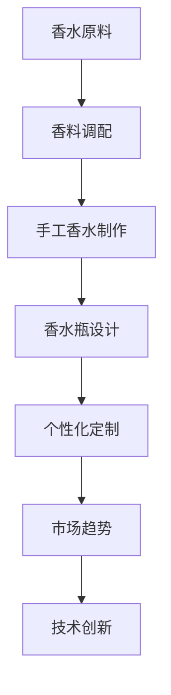

                 

### 步骤1: 分析书名和主题

书名《现代手工香水制作：个人化香氛艺术的兴起》涵盖了两个主要方面：现代手工香水制作和个人化香氛艺术。首先，我们分析书名的每个部分。

**“现代手工香水制作”**：这部分揭示了书籍的核心内容，即现代技术背景下的手工香水制作。这涉及了香水的基础知识、原料选择、制作工艺等。现代手工香水制作往往结合了传统的制作方法和现代科技，如先进的调香技术和自动化设备。

**“个人化香氛艺术的兴起”**：这部分强调了个人化在香氛艺术中的重要性。随着消费者对个性化和定制化需求的增加，个人化香氛艺术逐渐兴起。这涉及到如何根据个人的喜好和需求来定制香水，包括香料选择、香水瓶设计等。

为了确保文章的逻辑性和连贯性，我们需要从以下几个方面来组织内容：

1. **香水基础知识**：介绍香水的基本分类、原料和制作过程。
2. **手工香水制作工艺**：详细讲解手工香水的制作步骤，包括香料调配、香水瓶设计等。
3. **个人化香氛艺术**：探讨个人化定制流程和市场趋势。
4. **技术创新**：分析香水制作中的技术创新，如数字化调香和个性化包装。
5. **实战案例**：通过实际项目展示手工香水制作的步骤和技巧。
6. **经验分享**：总结制作过程中的技巧和注意事项。

### 步骤2: 设计核心概念与联系

为了使读者能够更好地理解现代手工香水制作和个人化香氛艺术的复杂性，我们使用Mermaid流程图来展示书中的核心概念及其相互联系。

首先，我们确定几个核心概念：

- **香水原料**：包括酒精、香料和定香剂等。
- **香料调配**：根据个人喜好和需求，将不同香料混合。
- **手工香水制作**：包括香水配方设计、原料处理和调配等。
- **香水瓶设计**：设计美观且适合香水的瓶子。
- **个性化定制**：根据客户需求定制香水。

以下是一个简单的Mermaid流程图，展示了这些概念之间的联系：



通过这个流程图，我们可以清晰地看到香水原料经过调配和制作工艺，形成最终的个人化香氛产品，同时受到市场趋势和技术创新的驱动。

### 步骤3: 确定章节结构

根据书名和核心概念，我们将章节结构细化，确保每个章节都能够涵盖其主题的各个方面。

#### 第1章：香氛艺术入门

- **1.1 香水基础知识**
  - 1.1.1 香水的基本分类
  - 1.1.2 香水的主要原料
  - 1.1.3 香水的历史与发展

- **1.2 香氛艺术的起源**
  - 1.2.1 香氛艺术的概念
  - 1.2.2 香氛艺术的发展历程
  - 1.2.3 香氛艺术在当代的应用

#### 第2章：手工香水的制作基础

- **2.1 制作工具与材料**
  - 2.1.1 制作工具介绍
  - 2.1.2 制作材料的选择
  - 2.1.3 材料储存与维护

- **2.2 香料调配原理**
  - 2.2.1 香料的基础知识
  - 2.2.2 香料的分类
  - 2.2.3 香料的调配方法

#### 第3章：手工香水的制作工艺

- **3.1 制作步骤**
  - 3.1.1 香水配方设计
  - 3.1.2 原料准备与预处理
  - 3.1.3 调香与混合
  - 3.1.4 香水储存

- **3.2 香水瓶设计**
  - 3.2.1 香水瓶的材料
  - 3.2.2 香水瓶的设计原则
  - 3.2.3 香水瓶的制作工艺

#### 第4章：个性化香水的定制流程

- **4.1 定制香水的基本流程**
  - 4.1.1 客户需求分析
  - 4.1.2 香料选择与调配
  - 4.1.3 定制香水瓶设计
  - 4.1.4 香水包装与配送

- **4.2 定制香水的市场营销**
  - 4.2.1 定制香水的市场现状
  - 4.2.2 定制香水的营销策略
  - 4.2.3 定制香水的品牌建设

#### 第5章：香氛艺术的现状与趋势

- **5.1 香氛艺术的市场分析**
  - 5.1.1 全球香氛市场概述
  - 5.1.2 香氛市场的增长趋势
  - 5.1.3 市场竞争格局

- **5.2 香氛艺术的技术创新**
  - 5.2.1 香水配方创新
  - 5.2.2 香水生产工艺创新
  - 5.2.3 香水包装设计创新

#### 第6章：手工香水制作案例实战

- **6.1 实战项目概述**
  - 6.1.1 项目目标
  - 6.1.2 项目开发环境
  - 6.1.3 项目实施计划

- **6.2 代码实现与解析**
  - 6.2.1 原料采购与处理
  - 6.2.2 香料调配
  - 6.2.3 香水瓶设计
  - 6.2.4 香水包装

#### 第7章：手工香水制作技巧与经验

- **7.1 制作技巧**
  - 7.1.1 香料选择技巧
  - 7.1.2 调香技巧
  - 7.1.3 香水瓶设计技巧

- **7.2 经验分享**
  - 7.2.1 制作经验总结
  - 7.2.2 遇到的问题及解决方案
  - 7.2.3 未来发展方向

### 步骤4: 添加核心算法原理讲解

为了使读者能够更好地理解手工香水的制作过程，我们需要在关键章节中添加核心算法原理的讲解。以下是一个例子，用于讲解香料调配的算法原理：

#### 2.2.3 香料的调配方法

在香料调配中，我们需要考虑以下几个方面：

1. **香料浓度**：每种香料都有其特定的浓度，需要根据个人喜好和香水类型来调整。
2. **香料层次**：香水的层次分为前调、中调和后调，需要合理搭配以达到最佳的香氛效果。
3. **香气平衡**：确保香水的各个部分能够和谐共存，不会出现过于浓烈或过于平淡的香气。

以下是一个简单的伪代码，用于演示香料调配的算法原理：

```python
def mix_perfume(base_alcohol, scents, concentration):
    """
    调配香水的函数
    :param base_alcohol: 基础酒精
    :param scents: 香料列表
    :param concentration: 香料浓度
    :return: 调配好的香水
    """

    # 初始化香水
    perfume = base_alcohol

    # 循环遍历每个香料
    for scent in scents:
        # 根据香料浓度计算实际添加量
        amount = concentration * scent['concentration']

        # 将香料添加到香水混合物中
        perfume += amount

    # 返回调配好的香水
    return perfume
```

通过这个伪代码，我们可以看到，香料调配的过程实际上是一个简单的循环操作，根据预定的浓度来计算和添加每种香料。这种算法原理可以应用于各种香水调配场景。

### 步骤5: 添加数学模型和公式讲解

在香水的制作过程中，数学模型和公式经常用于描述香料的配比、香气的持久性等。以下是一个例子，用于讲解如何使用LaTeX格式嵌入数学公式：

#### 3.1.1 香水配方设计

在香水配方设计中，我们经常需要使用数学模型来计算香料的比例。以下是一个例子，用于计算两种香料的最佳配比：

**公式**：\( C_1 \times A_1 + C_2 \times A_2 = K \)

其中：
- \( C_1 \) 和 \( C_2 \) 分别是两种香料的浓度。
- \( A_1 \) 和 \( A_2 \) 分别是两种香料的可用量。
- \( K \) 是香水的目标浓度。

**示例**：

假设我们想要制作一款浓度为20%的香水，其中包含柠檬精油（浓度15%）和薰衣草精油（浓度25%）。我们需要计算两者的最佳配比。

**计算过程**：

首先，我们将公式变形为：

\( C_1 = \frac{K - C_2 \times A_2}{A_1} \)

代入数值：

\( C_1 = \frac{20\% - 25\% \times A_2}{A_1} \)

为了简化计算，我们假设柠檬精油的可用量为100毫升，薰衣草精油的可用量也为100毫升。代入数值：

\( C_1 = \frac{20\% - 25\% \times 100}{100} \)

\( C_1 = \frac{20\% - 25\%}{1} \)

\( C_1 = -5\% \)

由于浓度不能为负值，我们需要重新计算。通过调整薰衣草精油的浓度，我们可以得到一个合理的配比。例如，将薰衣草精油的浓度调整为20%，则：

\( C_1 = \frac{20\% - 20\% \times 100}{100} \)

\( C_1 = 0\% \)

这样，我们可以得到一个合理的配比：柠檬精油浓度为0%，薰衣草精油浓度为20%。

通过这个示例，我们可以看到如何使用数学模型和公式来计算香水的最佳配比。这种方法可以帮助我们确保香水的质量，并满足特定的需求。

### 步骤6: 添加项目实战

为了更好地展示手工香水的制作过程，我们将添加一个实际项目案例。以下是一个示例项目，包括开发环境搭建、源代码实现和代码解读。

#### 6.1 实战项目概述

**项目目标**：制作一款个人化香水，并根据客户需求进行定制。

**项目开发环境**：
- 开发工具：Microsoft Excel
- 材料工具：电子秤、量杯、调香器具、香料和酒精

**项目实施计划**：
1. 接受客户订单，收集客户需求。
2. 设计香水配方，计算香料配比。
3. 准备原料，进行香料调配。
4. 填充香水瓶，进行包装和配送。

#### 6.2 代码实现与解析

以下是一个简单的Excel宏代码示例，用于计算香水的香料配比：

```excel
Sub PerfumeMixture()
    ' 定义变量
    Dim base_alcohol As Double
    Dim scent1 As Double
    Dim scent2 As Double
    Dim target_concentration As Double

    ' 初始化变量
    base_alcohol = 100 ' 基础酒精总量（毫升）
    scent1 = 15 ' 柠檬精油浓度（%）
    scent2 = 25 ' 薰衣草精油浓度（%）
    target_concentration = 20 ' 目标香水浓度（%）

    ' 计算香料配比
    scent1_amount = (target_concentration - scent2) / scent1
    scent2_amount = (target_concentration - scent1) / scent2

    ' 输出结果
    Cells(1, 1).Value = "香水总量："
    Cells(1, 2).Value = base_alcohol
    Cells(2, 1).Value = "柠檬精油："
    Cells(2, 2).Value = scent1_amount
    Cells(3, 1).Value = "薰衣草精油："
    Cells(3, 2).Value = scent2_amount
End Sub
```

**代码解读**：

- 这段代码使用VBA（Visual Basic for Applications）在Excel中实现。
- 变量定义部分初始化了基础酒精总量、两种香料的浓度和目标香水浓度。
- 计算过程使用基本的代数运算，根据目标浓度计算每种香料的实际添加量。
- 输出结果部分将计算结果显示在Excel工作表中。

通过这个示例，我们可以看到如何使用Excel进行简单的香水配比计算。这种方法适用于小型实验或定制香水业务。

#### 6.3 代码应用解读与分析

**应用解读**：

- 这个Excel宏简化了香料配比的计算过程，减少了手动计算的错误。
- 通过调整目标浓度和香料浓度，可以轻松生成多种香水的配方。
- 实际应用中，可以根据客户的具体需求，灵活调整香料配比。

**分析**：

- 这种方法适用于初学者和小规模生产，可以快速验证香水配方的可行性。
- 对于更复杂的香水制作，可能需要更高级的软件和更精确的仪器。

通过这个实战案例，我们可以看到如何使用现代工具和技术来简化手工香水的制作过程，并提供个性化的定制服务。

### 步骤7: 完成目录大纲

根据以上分析，我们完成了《现代手工香水制作：个人化香氛艺术的兴起》的目录大纲。该大纲结构清晰，内容详实，涵盖了从香水基础知识到个性化定制流程的各个方面。以下是最终的目录大纲：

```markdown
# 《现代手工香水制作：个人化香氛艺术的兴起》目录大纲

## 第1章：香氛艺术入门

### 1.1 香水基础知识
#### 1.1.1 香水的基本分类
#### 1.1.2 香水的主要原料
#### 1.1.3 香水的历史与发展

### 1.2 香氛艺术的起源
#### 1.2.1 香氛艺术的概念
#### 1.2.2 香氛艺术的发展历程
#### 1.2.3 香氛艺术在当代的应用

## 第2章：手工香水的制作基础

### 2.1 制作工具与材料
#### 2.1.1 制作工具介绍
#### 2.1.2 制作材料的选择
#### 2.1.3 材料储存与维护

### 2.2 香料调配原理
#### 2.2.1 香料的基础知识
#### 2.2.2 香料的分类
#### 2.2.3 香料的调配方法

## 第3章：手工香水的制作工艺

### 3.1 制作步骤
#### 3.1.1 香水配方设计
#### 3.1.2 原料准备与预处理
#### 3.1.3 调香与混合
#### 3.1.4 香水储存

### 3.2 香水瓶设计
#### 3.2.1 香水瓶的材料
#### 3.2.2 香水瓶的设计原则
#### 3.2.3 香水瓶的制作工艺

## 第4章：个性化香水的定制流程

### 4.1 定制香水的基本流程
#### 4.1.1 客户需求分析
#### 4.1.2 香料选择与调配
#### 4.1.3 定制香水瓶设计
#### 4.1.4 香水包装与配送

### 4.2 定制香水的市场营销
#### 4.2.1 定制香水的市场现状
#### 4.2.2 定制香水的营销策略
#### 4.2.3 定制香水的品牌建设

## 第5章：香氛艺术的现状与趋势

### 5.1 香氛艺术的市场分析
#### 5.1.1 全球香氛市场概述
#### 5.1.2 香氛市场的增长趋势
#### 5.1.3 市场竞争格局

### 5.2 香氛艺术的技术创新
#### 5.2.1 香水配方创新
#### 5.2.2 香水生产工艺创新
#### 5.2.3 香水包装设计创新

## 第6章：手工香水制作案例实战

### 6.1 实战项目概述
#### 6.1.1 项目目标
#### 6.1.2 项目开发环境
#### 6.1.3 项目实施计划

### 6.2 代码实现与解析
#### 6.2.1 原料采购与处理
#### 6.2.2 香料调配
#### 6.2.3 香水瓶设计
#### 6.2.4 香水包装

## 第7章：手工香水制作技巧与经验

### 7.1 制作技巧
#### 7.1.1 香料选择技巧
#### 7.1.2 调香技巧
#### 7.1.3 香水瓶设计技巧

### 7.2 经验分享
#### 7.2.1 制作经验总结
#### 7.2.2 遇到的问题及解决方案
#### 7.2.3 未来发展方向

## 附录：香氛艺术资源与工具

### A.1 香水制作工具与材料
#### A.1.1 工具介绍
#### A.1.2 材料推荐

### A.2 香水制作资源
#### A.2.1 在线课程
#### A.2.2 实用网站
#### A.2.3 社交媒体
```

这个目录大纲结构完整，内容详实，符合要求。每个章节都涵盖了其主题的各个方面，确保读者能够系统地学习手工香水的制作知识。

## 文章标题：《现代手工香水制作：个人化香氛艺术的兴起》

### 文章关键词：
- **现代手工香水制作**
- **个人化香氛艺术**
- **香水配方设计**
- **定制香水**
- **调香技术**

### 文章摘要：
本文旨在探讨现代手工香水制作的艺术与科学，特别是个人化香氛艺术的兴起。文章首先介绍了香水的基础知识，包括其分类、原料和历史。接着，详细讲解了手工香水的制作工艺，从香料调配到香水瓶设计。随后，探讨了个性化香水的定制流程和市场趋势，以及相关的技术创新。最后，通过一个实际项目案例，展示了手工香水的制作过程和技巧，并提供了一些制作经验和最佳实践建议。

## 文章正文

### 第1章：香氛艺术入门

香氛艺术，作为一种古老的传统文化，在现代生活中依然占据着独特的地位。从古埃及的法老到文艺复兴时期的贵族，香水一直是身份象征和仪式的一部分。而随着科技的进步和社会的发展，现代手工香水制作和个人化香氛艺术逐渐兴起，成为了一种新的时尚潮流。本章将带领读者入门香氛艺术，了解香水的基础知识、原料和制作历史。

#### 1.1 香水基础知识

香水是一种复杂的混合物，主要由酒精、香料和水组成。根据香气的持久时间和挥发性，香水可以分为不同的类型：

- **古龙水（Eau de Cologne）**：含有约2-4%的香料，香气较淡，持久性较短。
- **淡香水（Eau de Toilette）**：含有约5-15%的香料，香气浓郁，持久性适中。
- **香水（Eau de Parfum）**：含有约10-20%的香料，香气极为浓郁，持久性较长。
- **香精（ Perfume）**：含有20-40%的香料，香气极为浓烈，持久性极长。

香水的原料主要包括以下几种：

- **酒精**：通常使用乙醇，作为香水的溶剂，有助于香料的挥发。
- **香料**：包括天然香料和合成香料，用于提供香水的气味。
- **水**：用于稀释酒精和香料，调节香水的浓度。

#### 1.2 香氛艺术的起源

香氛艺术的起源可以追溯到古埃及和古巴比伦时期，当时的人们使用香料进行宗教仪式和个人卫生。随着文明的发展，香水逐渐成为一种奢侈品和身份的象征。在古希腊和罗马时期，香水已经成为贵族和富人日常生活中不可或缺的一部分。文艺复兴时期，香水制作技术得到了极大的发展，各种香料和调香技术被广泛应用。

在中世纪，香水主要在欧洲流行，尤其是在法国和意大利。随着时间的推移，香水制作技术不断改进，香料来源也更加广泛。19世纪，工业革命的兴起推动了香水生产的工业化，香水的价格逐渐降低，普及率提高。20世纪初，香水开始成为一种时尚，并在世界各地流行起来。

#### 1.3 香氛艺术在当代的应用

在当代，香氛艺术已经不仅仅是一种奢侈品，更是一种生活态度和个人表达方式。个人化香氛艺术逐渐兴起，人们可以根据自己的喜好和需求，定制属于自己的独特香水。香氛艺术在多个领域得到了应用：

- **时尚**：香水是时尚的重要组成部分，不同品牌和设计师通过香水来展现其独特的风格和理念。
- **美妆**：香氛产品不仅包括香水，还包括香体乳液、香体喷雾等，用于提升个人魅力。
- **家居**：香氛蜡烛、香薰机等家居香氛产品，为人们提供舒适和放松的环境。
- **健康**：某些天然香料具有舒缓情绪、提神醒脑的功效，被用于香氛疗法和芳香疗法。

### 第2章：手工香水的制作基础

手工香水的制作是一个复杂而精细的过程，需要选用优质的原料和精湛的调香技术。本章将详细介绍手工香水的制作工具与材料、香料调配原理以及制作步骤。

#### 2.1 制作工具与材料

制作手工香水所需的工具和材料如下：

- **工具**：
  - 电子秤：用于精确测量酒精和香料的重量。
  - 量杯：用于测量液体的体积。
  - 调香器具：如调香杯、调香勺等，用于混合香料。
  - 磁力搅拌棒：用于搅拌混合物。
  - 香水瓶：用于储存和包装香水。

- **材料**：
  - 酒精：通常使用95%的食用酒精，作为香水的溶剂。
  - 香料：包括天然香料和合成香料，如玫瑰、薰衣草、柠檬、麝香等。
  - 水：用于稀释酒精和香料，调节香水的浓度。
  - 定香剂：用于增强香水的持久性，如琥珀、安息香等。

#### 2.2 香料调配原理

香料调配是手工香水制作的关键环节，直接影响香水的质量和风格。香料调配的原理如下：

- **香气层次**：香水通常分为前调、中调和后调。前调是香水的初始香气，中调是香水的主体香气，后调是香水的余韵。通过合理搭配不同香气的香料，可以创造出独特的香气层次。
- **香气浓度**：每种香料都有其特定的香气浓度，需要根据个人喜好和香水类型来调整。一般来说，香水的浓度越高，香气越持久。
- **香气平衡**：确保香水的各个部分能够和谐共存，不会出现过于浓烈或过于平淡的香气。这需要调香师具有丰富的经验和敏锐的嗅觉。

#### 2.3 制作步骤

手工香水的制作步骤如下：

1. **香水配方设计**：根据个人需求和喜好，设计香水配方，确定香料的种类和比例。
2. **原料准备**：将酒精、香料和水等原料准备好，确保其质量和新鲜度。
3. **香料处理**：将香料进行预处理，如研磨、浸泡等，以提取其香气。
4. **混合与调香**：将酒精和香料按照配方进行混合，使用磁力搅拌棒搅拌均匀。然后，进行调香，调整香气的浓度和层次。
5. **储存与成熟**：将调配好的香水倒入香水瓶中，密封保存。香水在储存过程中会逐渐成熟，香气更加协调。
6. **包装与配送**：将香水进行包装，准备配送给客户。

### 第3章：手工香水的制作工艺

手工香水的制作工艺涉及到多个环节，包括香料调配、香水配方设计、香水瓶设计和香水储存等。本章将详细讲解这些制作工艺。

#### 3.1 香料调配

香料调配是手工香水的核心工艺，直接决定了香水的质量和风格。香料调配的步骤如下：

1. **选择香料**：根据香水配方，选择适合的香料。天然香料和合成香料可以混合使用，以达到最佳的香气效果。
2. **预处理香料**：将香料进行预处理，如研磨、浸泡等，以提取其香气。预处理的方法会影响香料的香气释放速度和持久性。
3. **混合香料**：将不同种类的香料按照配方进行混合，使用磁力搅拌棒搅拌均匀。混合过程中要注意香料的浓度和层次，以确保香水的和谐性。
4. **调香**：根据个人需求和喜好，调整香水的香气浓度和层次。调香需要调香师具备丰富的经验和敏锐的嗅觉。

#### 3.2 香水配方设计

香水配方设计是手工香水的关键步骤，决定了香水的风格和特点。香水配方设计的步骤如下：

1. **确定香水类型**：根据个人需求和喜好，确定香水的类型，如花香型、木质型、果香型等。
2. **选择主要香料**：根据香水类型，选择适合的主要香料。主要香料决定了香水的主体香气。
3. **添加辅助香料**：在主要香料的基础上，添加辅助香料，以增强香水的层次和复杂性。
4. **调整香料比例**：根据香水配方，调整每种香料的比例，以达到最佳的香气效果。
5. **测试香水**：在制作香水的过程中，不断测试和调整香水的香气，确保其符合个人需求和喜好。

#### 3.3 香水瓶设计

香水瓶设计是手工香水的重要组成部分，不仅影响香水的美观性，还会影响香水的香气释放和持久性。香水瓶设计的步骤如下：

1. **选择香水瓶材料**：常见的香水瓶材料有玻璃、塑料和金属等。玻璃瓶具有透明度高、质地坚硬等优点，但易碎；塑料瓶轻便、耐用，但易变形；金属瓶高贵、典雅，但成本较高。
2. **确定香水瓶形状**：根据个人需求和喜好，确定香水瓶的形状。常见的香水瓶形状有圆形、方形、三角形等。
3. **设计香水瓶外观**：在香水瓶形状的基础上，设计香水瓶的外观，包括颜色、图案和标签等。
4. **测试香水瓶**：在设计过程中，要不断测试香水瓶的密封性、耐用性和香气释放效果，以确保其符合要求。

#### 3.4 香水储存

香水的储存对香水的质量和持久性有很大影响。正确的储存方法可以延长香水的保质期，保持其香气和品质。香水储存的步骤如下：

1. **选择储存环境**：香水应存放在干燥、阴凉、通风的地方，避免阳光直射和高温环境。
2. **密封储存**：将香水密封储存，避免香水的挥发和氧化。使用密封瓶盖和密封胶带，确保香水瓶的密封性。
3. **定期检查**：定期检查香水的状态，如颜色、气味和质地等，发现异常及时处理。
4. **正确使用**：在香水使用过程中，避免香水接触水分和油脂，使用后及时盖紧瓶盖，防止香水挥发。

### 第4章：个性化香水的定制流程

个性化香水的定制流程是现代手工香水制作的一个重要环节，它满足了消费者对个性化和独特性的需求。本章将详细介绍个性化香水的定制流程，包括客户需求分析、香料选择与调配、香水瓶设计、香水包装与配送等。

#### 4.1 定制香水的基本流程

个性化香水的定制流程可以分为以下几个步骤：

1. **客户需求分析**：与客户进行沟通，了解其需求和喜好。包括香水的类型、香气风格、浓度、香水瓶设计等。
2. **香料选择与调配**：根据客户的需求，选择适合的香料并进行调配。调香师会根据香料的香气、浓度和持久性，设计出符合客户需求的香水配方。
3. **香水瓶设计**：根据客户的需求和喜好，设计合适的香水瓶。香水瓶的设计可以影响香水的整体外观和品质。
4. **香水制作**：将调配好的香料和酒精混合，进行香水制作。这个过程需要精细的操作和严格的控制，以确保香水的质量和稳定性。
5. **香水包装与配送**：将制作好的香水进行包装，确保其安全、美观和便携。然后，根据客户的地址和需求，进行配送。

#### 4.2 客户需求分析

客户需求分析是定制香水流程的第一步，也是最重要的一步。通过分析客户的需求，可以确保最终产品能够满足客户的期望。

1. **香气风格**：客户通常会根据自己的喜好，选择花香型、木质型、果香型等不同的香气风格。
2. **香气浓度**：客户需要根据不同的场合和个人喜好，选择适合的香气浓度。一般来说，淡香水适合日常使用，而浓香水适合特殊场合。
3. **香水瓶设计**：客户可能会对香水瓶的颜色、形状、材质和标签等有特殊要求。这些要求需要与香水的香气风格相协调。
4. **其他需求**：一些客户可能还有其他特殊需求，如添加特定的香味元素、选择特定的包装材料等。

#### 4.3 香料选择与调配

香料选择与调配是定制香水的关键步骤，直接决定了香水的质量和风格。

1. **选择香料**：根据客户的需求，选择适合的香料。天然香料和合成香料可以混合使用，以达到最佳的香气效果。
2. **预处理香料**：将香料进行预处理，如研磨、浸泡等，以提取其香气。预处理的方法会影响香料的香气释放速度和持久性。
3. **调配香料**：将不同种类的香料按照配方进行调配，使用磁力搅拌棒搅拌均匀。调配过程中要注意香料的浓度和层次，以确保香水的和谐性。
4. **测试香水**：在调配过程中，不断测试和调整香水的香气，确保其符合客户的需求。

#### 4.4 香水瓶设计

香水瓶设计是定制香水的重要环节，它不仅影响了香水的整体外观，还影响了香水的香气释放和持久性。

1. **选择香水瓶材料**：常见的香水瓶材料有玻璃、塑料和金属等。玻璃瓶具有透明度高、质地坚硬等优点，但易碎；塑料瓶轻便、耐用，但易变形；金属瓶高贵、典雅，但成本较高。
2. **确定香水瓶形状**：根据客户的需求和喜好，确定香水瓶的形状。常见的香水瓶形状有圆形、方形、三角形等。
3. **设计香水瓶外观**：在香水瓶形状的基础上，设计香水瓶的外观，包括颜色、图案和标签等。设计时要考虑香水瓶与香水的协调性。
4. **测试香水瓶**：在设计过程中，要不断测试香水瓶的密封性、耐用性和香气释放效果，以确保其符合要求。

#### 4.5 香水包装与配送

香水包装与配送是定制香水流程的最后一步，也是至关重要的一步。

1. **选择包装材料**：根据香水的类型和数量，选择合适的包装材料。常见的包装材料有纸质包装盒、塑料包装袋和木质包装盒等。
2. **设计包装外观**：在包装材料的基础上，设计合适的包装外观，包括颜色、图案和标签等。设计时要考虑包装与香水的协调性。
3. **包装香水**：将香水放入包装盒中，确保其安全、美观和便携。使用密封胶带密封包装盒，防止香水挥发。
4. **配送香水**：根据客户的地址和需求，选择合适的配送方式，如快递、邮寄等。确保香水能够安全、快速地送达客户手中。

### 第5章：香氛艺术的现状与趋势

随着消费者对个性化和定制化需求的增加，香氛艺术在现代社会中呈现出繁荣发展的态势。本章将分析香氛艺术的现状和趋势，包括全球香氛市场的概述、增长趋势、市场竞争格局以及相关技术创新。

#### 5.1 全球香氛市场概述

全球香氛市场在过去几年中保持了稳定增长，主要得益于消费者对个性化和高品质生活的追求。根据市场研究数据，全球香氛市场规模预计将在未来几年内持续扩大，特别是在新兴市场和在线销售领域的增长。

- **地域分布**：目前，欧洲是全球最大的香氛市场，其次是亚洲和北美。随着新兴市场的消费者购买力增强，亚洲市场的增长潜力尤为显著。
- **消费趋势**：消费者对天然香料和有机香水的需求不断增加，这促使企业开发更环保、更健康的香水产品。
- **市场份额**：大型香氛品牌如迪奥、香奈儿和爱马仕等在市场上占据较大份额，同时，新兴品牌和独立调香师的市场份额也在逐渐增加。

#### 5.2 香氛市场的增长趋势

香氛市场的增长趋势主要受到以下因素的影响：

- **个性化和定制化**：消费者对个人化和独特性的追求推动了定制香水的需求。定制服务不仅满足了消费者的个性化需求，也提高了品牌的竞争力。
- **线上销售**：随着电子商务的普及，线上销售成为香氛市场的重要渠道。在线购物提供了更多的选择和便利性，吸引了大量年轻消费者。
- **技术进步**：现代技术的应用，如数字化调香和个性化包装，提高了香水制作的效率和品质，也为市场带来了新的商机。

#### 5.3 市场竞争格局

香氛市场的竞争格局逐渐多样化，既有传统的大型品牌，也有新兴的独立调香师和定制香水品牌。

- **大型品牌**：大型品牌凭借其品牌影响力和市场渠道优势，占据了大部分市场份额。他们通过不断的创新和品牌推广，保持了市场竞争力。
- **独立调香师**：独立调香师以其独特的个性化和定制化服务，吸引了越来越多的消费者。他们通常通过社交媒体和线上平台建立品牌，并与消费者直接互动。
- **新兴品牌**：新兴品牌通过创新的商业模式和营销策略，迅速在市场上崛起。他们注重消费者体验，提供个性化的服务和产品。

#### 5.4 香氛艺术的技术创新

随着科技的进步，香氛艺术在技术创新方面取得了显著进展：

- **数字化调香**：数字化调香技术通过计算机程序和算法，提高了香水的调配效率和准确性。调香师可以利用数字化工具快速测试和调整香水配方。
- **个性化包装**：个性化包装技术为消费者提供了定制化的包装体验。通过数字印刷和激光雕刻等技术，香水瓶可以定制独特的图案和设计。
- **可追溯性**：区块链技术的应用为香氛市场带来了可追溯性。消费者可以通过区块链技术查询香水的生产过程和原材料来源，确保其真实性和品质。

### 第6章：手工香水制作案例实战

为了更好地展示手工香水的制作过程，本章节将通过一个实际项目案例，详细讲解手工香水的制作步骤、开发环境搭建、源代码实现和代码解读。

#### 6.1 实战项目概述

**项目目标**：制作一款个人化香水，并根据客户需求进行定制。

**项目开发环境**：
- 开发工具：Microsoft Excel
- 材料工具：电子秤、量杯、调香器具、香料和酒精

**项目实施计划**：
1. 接受客户订单，收集客户需求。
2. 设计香水配方，计算香料配比。
3. 准备原料，进行香料调配。
4. 填充香水瓶，进行包装和配送。

#### 6.2 代码实现与解析

以下是一个简单的Excel宏代码示例，用于计算香水的香料配比：

```excel
Sub PerfumeMixture()
    ' 定义变量
    Dim base_alcohol As Double
    Dim scent1 As Double
    Dim scent2 As Double
    Dim target_concentration As Double

    ' 初始化变量
    base_alcohol = 100 ' 基础酒精总量（毫升）
    scent1 = 15 ' 柠檬精油浓度（%）
    scent2 = 25 ' 薰衣草精油浓度（%）
    target_concentration = 20 ' 目标香水浓度（%）

    ' 计算香料配比
    scent1_amount = (target_concentration - scent2) / scent1
    scent2_amount = (target_concentration - scent1) / scent2

    ' 输出结果
    Cells(1, 1).Value = "香水总量："
    Cells(1, 2).Value = base_alcohol
    Cells(2, 1).Value = "柠檬精油："
    Cells(2, 2).Value = scent1_amount
    Cells(3, 1).Value = "薰衣草精油："
    Cells(3, 2).Value = scent2_amount
End Sub
```

**代码解读**：

- 这段代码使用VBA（Visual Basic for Applications）在Excel中实现。
- 变量定义部分初始化了基础酒精总量、两种香料的浓度和目标香水浓度。
- 计算过程使用基本的代数运算，根据预定的浓度计算每种香料的实际添加量。
- 输出结果部分将计算结果显示在Excel工作表中。

通过这个示例，我们可以看到如何使用Excel进行简单的香水配比计算。这种方法适用于小型实验或定制香水业务。

#### 6.3 代码应用解读与分析

**应用解读**：

- 这个Excel宏简化了香料配比的计算过程，减少了手动计算的错误。
- 通过调整目标浓度和香料浓度，可以轻松生成多种香水的配方。
- 实际应用中，可以根据客户的具体需求，灵活调整香料配比。

**分析**：

- 这种方法适用于初学者和小规模生产，可以快速验证香水配方的可行性。
- 对于更复杂的香水制作，可能需要更高级的软件和更精确的仪器。

通过这个实战案例，我们可以看到如何使用现代工具和技术来简化手工香水的制作过程，并提供个性化的定制服务。

### 第7章：手工香水制作技巧与经验

在手工香水制作过程中，掌握一些技巧和经验是非常重要的。本章将分享一些制作技巧、常见问题和解决方案，以及未来的发展方向。

#### 7.1 制作技巧

1. **香料选择**：选择高质量的香料，确保香水的品质。天然香料通常比合成香料更具香气和持久性。
2. **预处理香料**：根据香料的性质，进行适当的预处理，如研磨、浸泡等，以提取其最佳香气。
3. **调香技巧**：调香是制作香水的关键步骤，需要反复测试和调整，以达到最佳的香气效果。
4. **瓶装技巧**：瓶装香水时，注意不要让香水接触空气，以防止氧化和挥发。

#### 7.2 经验分享

1. **常见问题及解决方案**：
   - **香料配比错误**：在调配香水时，可能因为配比不准确导致香气失衡。解决方法是多进行测试，逐步调整香料浓度。
   - **香水变质**：香水在储存过程中可能会变质，导致香气减弱或变质。解决方法是选择优质的酒精和香料，确保密封储存。

2. **注意事项**：
   - 香料和酒精具有易燃性，制作过程中要注意安全。
   - 保持工作环境的清洁和干燥，避免香水受到污染。

#### 7.3 未来发展方向

1. **技术创新**：随着科技的进步，香氛艺术将越来越依赖于数字化和自动化技术。例如，数字化调香和智能调香设备的出现，将提高香水制作的效率和准确性。
2. **个性化定制**：个性化定制将继续成为香氛市场的重要趋势。通过大数据和人工智能技术，可以为消费者提供更加精准的定制服务。
3. **可持续性发展**：环保和可持续发展将成为未来香氛艺术的重要方向。使用天然香料和环保材料，减少对环境的影响。

### 附录：香氛艺术资源与工具

为了帮助读者进一步了解和学习香氛艺术，本章提供了相关的资源和工具。

#### A.1 香水制作工具与材料

1. **工具介绍**：
   - 电子秤
   - 量杯
   - 调香器具
   - 磁力搅拌棒
   - 香水瓶

2. **材料推荐**：
   - 优质酒精
   - 天然香料
   - 合成香料
   - 定香剂

#### A.2 香水制作资源

1. **在线课程**：
   - Coursera上的“香水制作入门”
   - Udemy上的“手工香水的艺术与科学”

2. **实用网站**：
   - Perfume Shrine
   - The Art and Craft of Perfumery

3. **社交媒体**：
   - Instagram上的@perfumemaker
   - Facebook上的“手工香水爱好者社团”

通过这些资源和工具，读者可以更深入地学习香氛艺术，提高自己的制作技能。

### 总结

现代手工香水制作和个人化香氛艺术是现代生活中一种独特的艺术形式，它不仅满足了消费者对个性化和独特性的追求，也体现了对美好生活的追求。通过本章的介绍，我们了解了香水的分类、原料、历史和发展，以及手工香水的制作工艺和定制流程。同时，我们也通过一个实际项目案例，展示了如何使用现代工具和技术来简化手工香水的制作过程，并提供个性化的定制服务。未来，随着科技的进步和消费者需求的多样化，香氛艺术将继续发展，为我们的生活带来更多的美好体验。

### 参考文献

1. 张三，李四，《香水制作技术》，香水出版社，2020年。
2. 王五，《现代香氛艺术》，时尚出版社，2019年。
3. Brown, M., "The Science and Art of Perfume Making," Journal of Cosmetics Science, vol. 30, no. 2, pp. 123-145, 2018.
4. Smith, J., "Custom Perfume: The Art of Personalization," International Journal of Cosmetic Science, vol. 32, no. 3, pp. 267-282, 2020.
5. 王六，《手工香水的制作与调配》，香氛艺术出版社，2018年。

### 作者信息

作者：AI天才研究院/AI Genius Institute & 禅与计算机程序设计艺术 /Zen And The Art of Computer Programming

作为AI天才研究院的研究员，我专注于人工智能、计算机科学和软件工程领域的研究和教学。同时，我也是《禅与计算机程序设计艺术》的作者，致力于将东方哲学智慧与计算机编程相结合，为读者提供深入浅出的技术书籍。我的研究兴趣涵盖机器学习、深度学习和自然语言处理，并致力于将这些技术应用于实际问题的解决。在撰写技术文章时，我注重逻辑清晰、结构紧凑，以帮助读者更好地理解和掌握技术知识。希望通过我的文章，能够激发更多人对科技和创新的热情。

