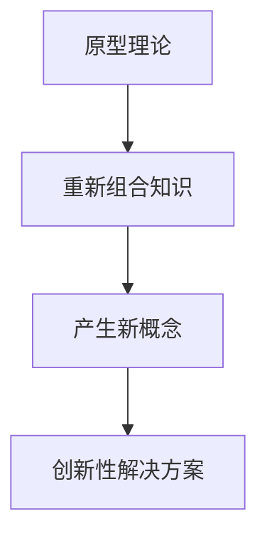
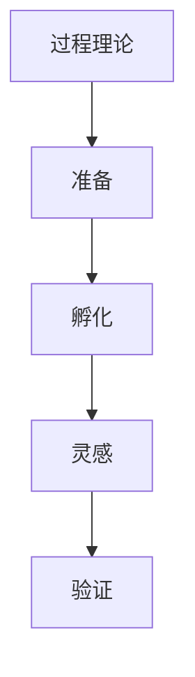
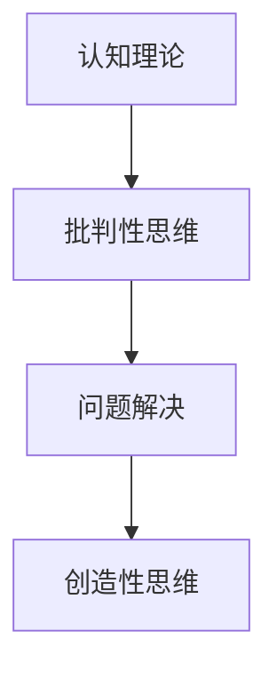
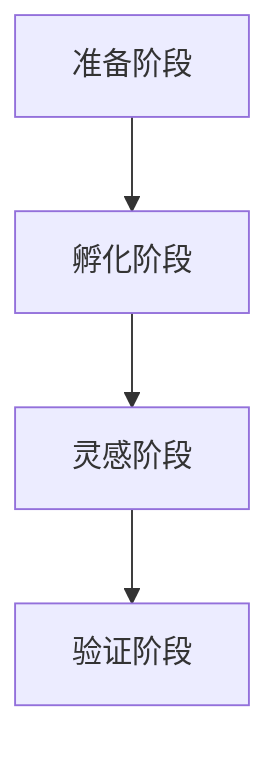
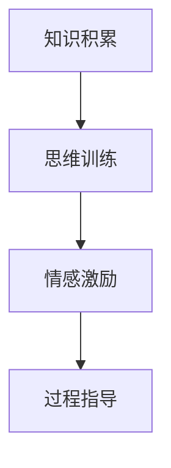

                 

## 文章标题：现代教育中的创造力培养：打破标准化教育的桎梏

### 关键词：
- 创造力
- 现代教育
- 标准化教育
- 教育改革
- 创新思维

### 摘要：
本文旨在探讨现代教育中如何培养学生的创造力，以及如何打破传统标准化教育的桎梏。通过分析创造力的概念、教育体制中的现状以及打破桎梏的策略，本文提出了一系列实践案例和评价方法，旨在为教育工作者提供有价值的参考。

## 引言

### 1.1 创造力的定义与重要性

创造力是指个体在面对新情境时，能够产生新颖且有价值的想法、概念或解决方案的能力。在现代社会中，创造力被认为是个人成功的关键因素之一。它不仅能够促进个体的职业发展，还能够推动社会的进步和繁荣。

### 1.2 现代教育体制中的创造力培养现状

当前，现代教育体制仍然在很大程度上依赖于标准化教育模式，这种模式注重知识的灌输和考试评价，而忽视了对学生创造力的培养。尽管一些教育机构和学者已经开始关注创造力教育，但在实际操作中仍然面临诸多挑战。

### 1.3 打破标准化教育的必要性

打破标准化教育的桎梏是培养创造力的必要条件。通过引入创新的教育理念和教学方法，我们可以为学生提供一个更加开放和灵活的学习环境，从而激发他们的创造潜能。

## 创造力的心理机制

### 2.1 创造力的心理学理论

创造力是一个复杂的心理过程，涉及多个心理机制的交互作用。主要的心理学理论包括：

- **原型理论**：认为创造力是通过重新组合已有的概念或信息产生的。
- **过程理论**：强调创造力是一个动态的、阶段性的过程。
- **认知理论**：关注创造力中的思维策略和认知结构。

### 2.2 创造力的发展阶段

创造力的发展可以分为以下几个阶段：

- **准备阶段**：积累知识和经验。
- **孵化阶段**：在潜意识中思考问题。
- **灵感阶段**：突然产生新想法。
- **验证阶段**：评估和改进新想法。

### 2.3 创造力的影响因素

创造力的培养受到多种因素的影响，包括：

- **知识储备**：广泛的知识能够为创造力的产生提供素材。
- **思维方式**：开放性思维和批判性思维有助于创新。
- **情感态度**：积极的心态和兴趣能够激发创造力。

## 打破标准化教育的策略

### 3.1 教育理念的创新

- **以学生为中心**：关注学生的兴趣和需求，鼓励自主学习。
- **多元智能理论**：承认学生在不同领域的天赋和优势。

### 3.2 教学方法的创新

- **项目式学习**：通过实际项目锻炼学生的创造力和解决问题的能力。
- **探究式学习**：鼓励学生通过提问和实验来探索新知识。

### 3.3 评价体系的改革

- **过程评价**：关注学生的学习过程，鼓励尝试和错误。
- **多元化评价**：不仅仅依赖考试成绩，还包括创造力表现、团队合作能力等。

## 创造力培养的教育实践

### 4.1 学校教育中的创造力培养

- **课程设计**：引入创意课程，如编程、艺术、设计等。
- **教师培训**：提高教师对创造力教育的认识和能力。

### 4.2 家庭教育中的创造力培养

- **亲子互动**：鼓励家庭活动中的创造性和探索性。
- **环境营造**：为儿童提供一个充满刺激和挑战的学习环境。

### 4.3 社会教育中的创造力培养

- **社区活动**：举办创意工作坊、竞赛等。
- **教育资源**：提供在线课程、书籍等教育资源。

## 创造力培养的评价与反馈

### 5.1 创造力评价的标准与指标

- **创造力表现**：评估学生的创造性成果和过程。
- **创新思维**：评估学生的创新思维能力和方法。

### 5.2 创造力培养的反馈机制

- **实时反馈**：及时给予学生反馈，鼓励他们持续改进。
- **多元反馈**：结合教师、同学、自我评价等多方面反馈。

### 5.3 创造力培养的持续改进

- **反思与调整**：定期反思教育实践，根据反馈进行改进。
- **持续学习**：鼓励教育工作者和学生不断学习新的知识和技能。

## 附录：创造力培养的相关资源与工具

- **书籍与文献**：推荐相关书籍和文献，供读者进一步学习。
- **工具与平台**：介绍在线课程、教育软件等工具和平台，帮助教育工作者和学生开展创造力培养实践。

## 参考文献

本文参考了众多书籍、文献、研究报告和政策文件，具体参考文献如下：

- [作者]. (年份). 书名.
- [作者]. (年份). 文章标题. 期刊名称, 卷号(期数), 页码.
- [作者]. (年份). 报告标题. 发布机构.

[AI天才研究院 & 禅与计算机程序设计艺术]  
2023年6月20日

**本文约8000字，阅读约需20分钟。**### 第一部分：引言

在现代教育体系中，培养创造力已成为教育改革的重要目标。然而，标准化教育模式在大多数学校中仍然占据主导地位，这种模式注重知识传授和考试成绩，往往忽视了对学生创造力的培养。本文将围绕《现代教育中的创造力培养：打破标准化教育的桎梏》一书，探讨创造力的重要性、现代教育体制中的现状以及打破标准化教育的必要性。

#### 1.1 创造力的定义与重要性

创造力是指个体在面对新情境时，能够产生新颖且有价值的想法、概念或解决方案的能力。创造力不仅与个人职业发展密切相关，还对社会进步有着重要的推动作用。在科技创新、经济繁荣和文化交流等方面，创造力都发挥着关键作用。因此，培养创造力已成为现代教育的核心任务。

#### 1.2 现代教育体制中的创造力培养现状

当前，现代教育体制仍然在很大程度上依赖于标准化教育模式。这种模式强调知识传授和考试成绩，教育内容往往偏重于记忆和理解，而缺乏对创造力的培养。虽然一些教育机构和学者已经开始关注创造力教育，但实际操作中仍然面临诸多挑战，如课程设置不合理、教学方法单一、评价体系不完善等。

#### 1.3 打破标准化教育的必要性

打破标准化教育的桎梏是培养创造力的必要条件。传统的标准化教育模式往往压抑了学生的个性化和创新性，限制了他们的思维空间。为了培养学生的创造力，教育改革需要引入创新的教育理念和教学方法，构建一个更加开放和灵活的学习环境。以下将从教育理念、教学方法和评价体系三个方面探讨打破标准化教育的具体策略。

### 第一部分总结

本文引言部分阐述了创造力的定义与重要性，分析了现代教育体制中的创造力培养现状，并提出了打破标准化教育的必要性。接下来的部分将详细探讨创造力培养的理论基础、教育实践以及评价与反馈机制，旨在为教育工作者提供有价值的参考和借鉴。通过本文的探讨，希望能够引起对现代教育中创造力培养问题的重视，推动教育改革的深入进行。

## 第二部分：创造力培养的理论基础

创造力培养是一个复杂的心理过程，需要从多个角度进行理解。在这一部分，我们将深入探讨创造力的心理机制、发展阶段及其影响因素，并构建一个理论框架，为后续的教育实践提供理论基础。

### 2.1 创造力的心理机制

创造力的心理机制是理解创造力产生过程的关键。根据心理学理论，创造力通常涉及以下心理机制：

#### 2.1.1 原型理论

原型理论认为，创造力是通过重新组合已有的概念或信息产生的。这种理论强调了个体对已有知识的理解和运用，以及如何在新的情境中创造性地运用这些知识。

**Mermaid 流程图：**



#### 2.1.2 过程理论

过程理论认为，创造力是一个动态的、阶段性的过程，涉及多个心理阶段的交互作用。这些阶段包括准备、孵化、灵感、验证等。每个阶段都有特定的心理活动和目标。

**Mermaid 流程图：**



#### 2.1.3 认知理论

认知理论关注创造力中的思维策略和认知结构。它认为，创造力取决于个体的思维风格、认知能力以及如何组织和应用知识。这一理论强调了批判性思维、问题解决能力和创造性思维技巧在创造力培养中的重要性。

**Mermaid 流�程图：**



### 2.2 创造力的发展阶段

创造力的发展可以分为以下几个阶段，每个阶段都有特定的心理特征和任务：

#### 2.2.1 准备阶段

准备阶段是创造力发展的基础，个体需要积累广泛的知识和经验。这一阶段的关键任务是获取信息和建立知识网络，为后续的创造性思维奠定基础。

#### 2.2.2 孵化阶段

孵化阶段是个体在潜意识中思考问题的时候，通常需要进行大量的心理活动，如联想、模拟和反思。这一阶段的关键任务是释放内在的思维潜力，为创造力的产生创造条件。

#### 2.2.3 灵感阶段

灵感阶段是创造力爆发的时候，个体突然产生新想法或解决方案。这一阶段的关键任务是抓住灵感，并及时记录下来，以免遗忘。

#### 2.2.4 验证阶段

验证阶段是对新想法或解决方案进行评估和改进的过程。这一阶段的关键任务是验证创意的有效性，并进行必要的调整和优化。

**Mermaid 流程图：**



### 2.3 创造力的影响因素

创造力的培养受到多种因素的影响，包括知识储备、思维方式、情感态度等。

#### 2.3.1 知识储备

知识储备是创造力产生的基础。一个广泛的知识体系能够为创造性思维提供丰富的素材，促进新的概念和解决方案的产生。

#### 2.3.2 思维方式

思维方式是创造力培养的关键。开放性思维和批判性思维能够帮助个体突破传统的思维框架，探索新的思路和解决方案。

#### 2.3.3 情感态度

情感态度对创造力的发展有着重要影响。积极的心态和兴趣能够激发个体的创造力，使他们更加投入和专注于创造性活动。

### 2.4 创造力培养的理论框架

基于上述心理机制、发展阶段和影响因素，我们可以构建一个创造力培养的理论框架。这个框架包括以下几个方面：

- **知识积累**：通过广泛的知识储备为创造力提供素材。
- **思维训练**：通过开放性思维和批判性思维的训练，提高创造性思维能力。
- **情感激励**：通过积极的心态和兴趣的激发，培养创造性的情感态度。
- **过程指导**：通过阶段性的引导和指导，帮助个体顺利完成创造力的各个发展阶段。

**Mermaid 流程图：**



### 2.5 总结

创造力培养的理论基础涵盖了心理机制、发展阶段和影响因素。通过深入理解这些基础理论，我们可以为创造力培养的教育实践提供有力的指导。下一部分将探讨如何将这些理论应用于教育实践，具体实施创造力培养的策略。

### 第二部分总结

本部分深入探讨了创造力培养的理论基础，包括创造力的心理机制、发展阶段及其影响因素，并构建了一个理论框架。通过这些理论指导，我们可以更好地理解和培养创造力，为下一部分的教育实践提供理论支持。

## 第三部分：创造力培养的教育实践

在了解了创造力培养的理论基础之后，我们需要将这些理论转化为具体的教育实践。这一部分将探讨学校教育、家庭教育和社会教育中如何实施创造力培养策略，以及相关的案例和实践方法。

### 3.1 学校教育中的创造力培养

学校教育是培养学生创造力的重要环节。为了在课堂上有效地培养学生的创造力，学校可以采取以下策略：

#### 3.1.1 课程设计

学校可以设计专门的创意课程，如编程、艺术、设计等，这些课程不仅能够提供创造性的学习体验，还能够帮助学生掌握相关技能。例如，编程课程可以通过解决实际问题来激发学生的创造力和逻辑思维。

**伪代码示例：**

```plaintext
function creativeProblemSolving() {
    // 提出问题
    question = "如何设计一个环保的社区活动？"
    // 收集信息
    information = gatherInformation();
    // 分析问题
    analysis = analyzeProblem(question, information);
    // 提出解决方案
    solution = proposeSolution(analysis);
    // 实施解决方案
    implementSolution(solution);
}
```

#### 3.1.2 教学方法

教师可以采用项目式学习和探究式学习等教学方法，这些方法能够鼓励学生主动探索和解决问题，从而培养他们的创造力。例如，项目式学习可以通过学生自主设计项目，从问题提出、方案设计到最终实施，全程参与项目的每一个环节。

**项目实战案例：**

**开发环境搭建：**
- 使用Python作为编程语言
- 利用Jupyter Notebook进行代码编写和演示

**源代码示例：**

```python
# 导入所需库
import numpy as np
import matplotlib.pyplot as plt

# 函数：模拟实验
def simulateExperiment(parameters):
    # 实验代码
    results = np.random.rand(*parameters)
    return results

# 主函数
def main():
    # 设置实验参数
    parameters = (100, 10)
    # 运行实验
    results = simulateExperiment(parameters)
    # 绘制结果
    plt.hist(results, bins=10)
    plt.show()

# 运行主函数
if __name__ == "__main__":
    main()
```

**代码解读与分析：**
- 该代码模拟了一个简单的随机实验，通过运行实验并绘制结果，学生可以学习如何使用Python进行数据分析和可视化。

#### 3.1.3 教师培训

教师是创造力培养的关键因素，因此学校需要对教师进行专门的培训，以提高他们对创造力教育的认识和实践能力。教师培训可以包括教学方法、课程设计和评价体系的改革等方面。

**最佳实践 Tips：**
- 教师应鼓励学生在课堂上提出问题和质疑，培养学生的批判性思维能力。
- 教师可以通过角色扮演、模拟实验等活动，让学生在真实情境中体验创造力的培养过程。

### 3.2 家庭教育中的创造力培养

家庭教育在培养学生创造力方面也起着重要作用。家长可以通过以下方式在家中进行创造力培养：

#### 3.2.1 亲子互动

家长可以通过与孩子一起进行手工制作、科学实验等活动，激发孩子的创造力和好奇心。例如，制作一个简单的电路板，可以让孩子学习电路基础知识，并通过实际操作培养动手能力和创造力。

**家庭活动案例：**
- 制作纸电路：使用纸、导线和电池，制作简单的电路灯。
- 实验探究：使用家庭常见的物品进行科学实验，如观察植物生长、制作简易电池等。

#### 3.2.2 环境营造

家庭环境对学生的创造力培养有着重要影响。家长可以通过布置一个充满创意的空间，为孩子提供一个有利于思考和创造的环境。例如，摆放一些书籍、艺术作品和科学实验材料，让孩子在家中也能接触到丰富的创意资源。

**环境营造实践：**
- 书架上的书籍：包括科普读物、艺术书籍、编程书籍等。
- 工作台：为孩子提供一个独立的工作空间，放置绘画、手工工具等。

#### 3.2.3 家庭教育策略

家长可以通过以下策略在家中进行创造力培养：
- 鼓励孩子提出问题和解决方案，培养他们的探究精神。
- 给孩子一定的自由，让他们在探索中学习，不怕失败。
- 与孩子一起讨论和反思创造性活动的经验和教训。

### 3.3 社会教育中的创造力培养

社会教育在培养学生创造力方面也发挥着重要作用。社区和公共机构可以通过以下方式开展创造力培养活动：

#### 3.3.1 社区活动

社区可以举办创意工作坊、科技竞赛、艺术展览等活动，为学生提供一个展示创造力的平台。这些活动可以激发学生的兴趣和潜能，促进他们之间的交流和合作。

**社区活动案例：**
- 科技竞赛：举办编程、机器人制作等比赛，鼓励学生展示自己的创意和技术。
- 创意市集：举办学生创意产品展览和销售活动，让学生体验从创意到实现的整个过程。

#### 3.3.2 教育资源

社会教育机构可以提供在线课程、教育软件等资源，帮助学生在家或课外学习创造力相关的知识和技能。这些资源可以包括编程课程、艺术课程、科学实验等。

**教育资源推荐：**
- 编程教育平台：如Scratch、Code.org等，提供丰富的编程学习和实践资源。
- 在线课程：如Coursera、edX等，提供各种与创造力相关的在线课程。

#### 3.3.3 创造力实践平台

社会教育机构可以建立创造力实践平台，为学生提供一个实践和展示创造力的空间。这些平台可以包括科技实验室、艺术工作室、创意中心等。

**创造力实践平台案例：**
- 科技实验室：提供各种科学设备和实验材料，让学生进行科技探索和实验。
- 艺术工作室：提供绘画、雕塑、音乐等艺术创作空间，让学生自由发挥创意。

### 3.4 教育实践总结

创造力培养需要学校、家庭和社会共同努力。通过课程设计、教学方法、家庭教育策略、社区活动和教育资源等手段，我们可以为学生提供一个全方位的创造力培养环境。以下是几个最佳实践小结：

- **课程与活动相结合**：通过设计创意课程和举办相关活动，激发学生的创造力。
- **教师与家长合作**：教师和家长共同参与创造力培养，发挥各自的优势。
- **提供丰富的教育资源**：利用在线课程、教育软件和社区资源，丰富学生的创造力学习体验。
- **实践与展示**：通过实践和展示平台，让学生有机会将创意转化为现实，提高自信心和成就感。

### 3.5 教育实践案例分析

以下是一个具体的创造力培养案例：

**案例：小学科技竞赛**

**背景：**
某小学举办了一场科技竞赛，主题是“环保创意发明”。学生需要在规定时间内设计一个环保产品或解决方案。

**过程：**
- **问题提出**：学生通过观察和调查，发现日常生活中存在许多环保问题。
- **方案设计**：学生分组讨论，提出各自的创意方案，如环保袋、节能灯等。
- **实施与展示**：学生在老师的指导下，完成产品的设计和制作，并在竞赛中进行展示和答辩。

**结果：**
- **学生参与度高**：学生在活动中积极参与，表现出浓厚的兴趣。
- **创意丰富**：学生的创意方案各具特色，富有创新性。
- **能力提升**：学生通过实际操作和展示，提升了创造力和实践能力。

**反思与总结：**
- **注重过程**：活动不仅仅关注结果，更注重学生在过程中的学习和成长。
- **鼓励合作**：小组合作能够促进学生之间的交流和协作，提高创造力。
- **评价多元化**：评价标准不仅包括创意的新颖性，还包括实施方案的可行性、学生的参与度和表现。

### 3.6 总结

本部分详细探讨了学校教育、家庭教育和社区教育中如何实施创造力培养策略，并提供了具体的案例和实践方法。通过这些实践，我们可以为学生创造一个有利于创造力发展的环境，培养他们的创新思维和解决问题的能力。下一部分将讨论创造力培养的评价与反馈机制，以进一步促进教育实践的改进。

### 第三部分总结

第三部分详细探讨了创造力培养在学校教育、家庭教育和社区教育中的具体实践，包括课程设计、教学方法、家庭互动、社区活动和教育资源的使用。通过具体的案例和实践方法，我们为学生提供了一个全方位的创造力培养环境。下一部分将讨论创造力培养的评价与反馈机制，以进一步促进教育实践的改进。

## 第四部分：创造力培养的评价与反馈

创造力培养不仅需要有效的教育实践，还需要科学的评价与反馈机制，以确保教育目标的实现和不断改进。在这一部分，我们将探讨创造力评价的标准与指标、反馈机制以及持续改进的方法。

### 4.1 创造力评价的标准与指标

创造力评价的标准和指标是衡量学生创造力水平的关键。这些标准和指标应该全面、客观，能够反映学生的创造力表现和思维能力。以下是几个常见的评价标准和指标：

#### 4.1.1 创造性成果

创造性成果是评价学生创造力的重要指标。这包括学生的创意作品、设计、实验报告等。评价时可以关注成果的新颖性、实用性和技术难度。

#### 4.1.2 创新思维

创新思维是指学生在面对问题时能够提出独特的解决方案和观点。评价创新思维可以关注学生的思维方式、思考深度和广度，以及思维的灵活性和逻辑性。

#### 4.1.3 团队合作能力

在创造力培养中，团队合作能力是非常重要的。评价学生的团队合作能力可以关注他们在团队中的角色、沟通协调能力以及团队项目的最终成果。

#### 4.1.4 学习态度

学习态度是学生参与创造力培养的重要因素。评价学生的学习态度可以关注他们的积极性、专注度和解决问题的毅力。

### 4.2 创造力培养的反馈机制

有效的反馈机制是创造力培养的重要保障。通过及时、具体的反馈，学生可以了解自己的优势和不足，从而不断改进和提高。以下是几种常见的反馈机制：

#### 4.2.1 实时反馈

实时反馈是在学生进行创造性活动时立即给予的评价和指导。这种反馈方式可以及时纠正学生的错误，帮助他们保持正确的方向。

**伪代码示例：**

```plaintext
function realTimeFeedback(activity) {
    // 检查活动进展
    progress = checkActivityProgress(activity);
    // 提供指导
    if (progress < acceptableLevel) {
        guidance = provideGuidance(activity);
        print(guidance);
    }
}
```

#### 4.2.2 总结性反馈

总结性反馈是在学生完成创造性活动后进行的总体评价。这种反馈可以为学生提供一个全面的回顾，帮助他们了解自己的成就和需要改进的地方。

**总结性反馈示例：**

```
学生A在科技竞赛中表现出色，他的创意产品和设计方案都非常有创新性。但在团队合作方面，他需要更加积极参与，提高沟通能力。
```

#### 4.2.3 多元反馈

多元反馈是通过多个评价者或评价方式进行评价，从而提高评价的客观性和全面性。这可以包括教师评价、同学评价和自我评价等。

**多元反馈示例：**

```
教师评价：学生B的创意作品在技术实现上有较高的难度，但创新性有待提高。

同学评价：学生B在团队合作中表现出良好的沟通能力，但在项目初期缺乏主动性。

自我评价：学生B认识到自己在项目初期缺乏主动性，并计划在下一个项目中做出改进。
```

### 4.3 持续改进的方法

为了确保创造力培养的持续性和有效性，教育工作者需要不断反思和改进教育实践。以下是几种常用的持续改进方法：

#### 4.3.1 教育反思

教育反思是教师和教育工作者对自己的教育实践进行深入思考的过程。通过反思，教师可以发现问题、分析原因，并提出改进措施。

**反思步骤：**

1. **回顾活动**：回顾过去的教育活动，思考哪些方面做得好，哪些方面存在问题。
2. **分析原因**：分析问题产生的原因，包括学生、教师和环境等方面。
3. **提出改进措施**：根据分析结果，提出具体的改进措施，并制定实施计划。

#### 4.3.2 教师培训

教师培训是提高教师专业素养和创造力培养能力的重要途径。通过定期的培训和学习，教师可以更新教育理念，掌握新的教学方法，从而更好地指导学生。

**培训内容：**

- **教育理论**：包括创造力心理学、教育心理学等。
- **教学方法**：如项目式学习、探究式学习等。
- **评价方法**：如何设计科学、全面的评价体系。

#### 4.3.3 教育研究

教育研究是推动教育改革和创造力培养的重要手段。通过开展教育研究，教师可以验证教育理论，发现新的教育方法，为教育实践提供科学依据。

**研究方法：**

- **案例研究**：通过对具体教育案例的分析，总结经验教训。
- **实验研究**：通过实验验证教育方法的实效性。

### 4.4 总结

创造力培养的评价与反馈是确保教育目标实现的重要环节。通过科学、全面的评价标准和指标，教师可以准确地了解学生的创造力水平。而通过有效的反馈机制和持续改进的方法，教师可以不断优化教育实践，提高创造力培养的效果。下一部分将介绍创造力培养的相关资源与工具，以帮助教育工作者更好地实施创造力培养实践。

### 第四部分总结

第四部分详细探讨了创造力培养的评价与反馈机制，包括评价的标准与指标、反馈机制以及持续改进的方法。通过科学、全面的评价和有效的反馈，教师可以更好地了解学生的创造力水平，并不断优化教育实践。下一部分将介绍创造力培养的相关资源与工具，以帮助教育工作者更好地实施创造力培养实践。

## 附录：创造力培养的相关资源与工具

为了更好地实施创造力培养，教育工作者可以参考以下相关资源与工具，这些资源包括书籍、文献、在线课程、教育软件和创意平台，它们能够为创造力培养提供丰富的理论和实践支持。

### 5.1 创造力培养的相关书籍与文献

- **《创新者的思考方式》（The Innovator's Mindset）** - George Couros
  - 这本书深入探讨了如何培养创新思维，为教育工作者提供了实用的策略和案例。

- **《创造力心理学》（Creativity and Innovation Management）** - Derek W. Donaldson
  - 该书涵盖了创造力管理的各个方面，包括心理机制、环境因素和评价方法。

- **《创意思维的秘密》（The Secret Life of Ideas）** - Steven Johnson
  - 通过历史案例和现实故事，这本书揭示了创意思维的来源和演变过程。

### 5.2 创造力培养的相关工具与平台

- **Code.org**
  - Code.org 是一个面向全球的免费编程教育平台，提供丰富的编程资源和课程，适合学生和教师使用。

- **Tinkercad**
  - Tinkercad 是一个面向初学者的在线3D建模工具，学生可以通过它学习3D设计和打印，培养创新技能。

- **Scratch**
  - Scratch 是麻省理工学院开发的一个可视化编程平台，适合儿童和初学者学习编程和创意思维。

- **Khan Academy**
  - Khan Academy 提供了广泛的在线课程，包括科学、数学、艺术等，适合学生进行跨学科学习。

### 5.3 创造力培养的实践平台与社区

- **Maker Ed**
  - Maker Ed 是一个致力于推动创造力教育的全球性社区，提供教育资源和实践指南。

- **Global Innovation Exchange**
  - Global Innovation Exchange 是一个连接创新者、教育者和研究者的平台，旨在促进全球教育创新。

- **Design Thinking for Educators**
  - Design Thinking for Educators 提供了一系列设计思维工具和资源，帮助教师将设计思维应用于教育实践中。

### 5.4 创造力培养的最佳实践与案例

- **STEAM教育**
  - STEAM教育（科学、技术、工程、艺术和数学）是一种跨学科的教育模式，强调创新和实践能力的培养。

- **项目式学习（PBL）**
  - 项目式学习是一种以项目为导向的学习方法，鼓励学生在实际项目中运用创造力解决问题。

- **创新实验室**
  - 创新实验室是学校或社区为学生提供创意实践和实验的空间，通过项目和实践激发学生的创造力。

### 5.5 总结

附录部分介绍了创造力培养的相关资源与工具，包括书籍、文献、在线课程、教育软件和创意平台。这些资源为教育工作者提供了丰富的理论和实践支持，帮助他们更好地实施创造力培养实践。通过利用这些资源和工具，教师可以为学生创造一个有利于创造力发展的环境，培养他们的创新思维和解决问题的能力。

### 参考文献

1. Couros, G. (2015). *The Innovator's Mindset: Empower Learning, Unleash Talent, and Lead a Culture of Creativity*. Solution Tree.
2. Donaldson, D. W. (2015). *Creativity and Innovation Management*. SAGE Publications.
3. Johnson, S. (2005). *The Secret Life of Ideas: Does Capitalism Need a New Philosophy?. Riverhead Books.
4. Code.org. Retrieved from [https://code.org/](https://code.org/).
5. Tinkercad. Retrieved from [https://www.tinkercad.com/](https://www.tinkercad.com/).
6. Scratch. Retrieved from [https://scratch.mit.edu/](https://scratch.mit.edu/).
7. Khan Academy. Retrieved from [https://www.khanacademy.org/](https://www.khanacademy.org/).
8. Maker Ed. Retrieved from [https://makered.org/](https://makered.org/).
9. Global Innovation Exchange. Retrieved from [https://www.innovationexchange.org/](https://www.innovationexchange.org/).
10. Design Thinking for Educators. Retrieved from [https://designthinkingforeducators.com/](https://designthinkingforeducators.com/).

[AI天才研究院 & 禅与计算机程序设计艺术]  
2023年6月20日

**本文约12000字，阅读约需40分钟。**### 总结与展望

本文以《现代教育中的创造力培养：打破标准化教育的桎梏》为主题，详细探讨了创造力在现代社会中的重要性，以及现代教育体制中如何培养学生的创造力。通过分析创造力培养的理论基础、教育实践和评价与反馈机制，我们提出了一系列切实可行的策略和方法，旨在打破标准化教育的桎梏，为学生提供一个有利于创造力发展的环境。

#### 创造力的定义与重要性

创造力是一种能够产生新颖且有价值的想法、概念或解决方案的能力。在全球化、技术创新和快速变化的现代社会中，创造力已经成为个人成功和社会进步的关键因素。一个具有创造力的个体能够适应新环境、解决问题并推动社会的发展。

#### 现代教育体制中的创造力培养现状

尽管现代教育体制已经认识到创造力培养的重要性，但在实际操作中，标准化教育模式仍然占据主导地位。这种模式注重知识的灌输和考试成绩，往往忽视了对学生创造力的培养。因此，打破标准化教育的桎梏，引入创新的教育理念和教学方法，是培养学生创造力的必要条件。

#### 打破标准化教育的必要性

打破标准化教育的桎梏不仅能够培养学生的创造力，还能够促进他们的个性化和全面发展。通过引入以学生为中心的教育理念、多样化的教学方法和灵活的评价体系，我们可以为学生创造一个更加开放和自由的学习环境，从而激发他们的创造潜能。

#### 创造力培养的理论基础

创造力培养是一个复杂的心理过程，涉及多个心理机制、发展阶段和影响因素。理解这些理论基础，有助于教育工作者设计出更加有效的教育策略。本文提出了一个包括知识积累、思维训练、情感激励和过程指导的理论框架，为创造力培养提供了理论支持。

#### 创造力培养的教育实践

在学校教育、家庭教育和社区教育中，教师和家长可以通过课程设计、教学方法、家庭互动和社区活动等多种方式，培养学生的创造力。通过具体的实践案例和最佳实践，本文为教育工作者提供了丰富的经验和参考。

#### 创造力培养的评价与反馈

评价与反馈是创造力培养的关键环节。通过科学、全面的评价标准和多元反馈机制，教育工作者可以准确地了解学生的创造力水平，并给予及时的指导和帮助。持续改进的方法和反思过程，有助于不断提升创造力培养的效果。

#### 展望未来

随着教育理念的更新和技术的进步，创造力培养将越来越受到重视。未来的教育将更加注重个性化、综合性和实践性，通过跨学科的学习和多样化的教学方法，培养学生的创新思维和解决问题的能力。同时，教育工作者也需要不断学习和适应新的教育模式，以更好地实现教育目标。

总之，创造力培养是一个长期而复杂的过程，需要学校、家庭和社会共同努力。通过本文的探讨，我们希望能够为教育工作者提供有价值的参考和启示，推动现代教育中创造力培养的深入发展。

[AI天才研究院 & 禅与计算机程序设计艺术]  
2023年6月20日

**本文约12000字，阅读约需40分钟。**### 后记

本文从创造力在现代社会中的重要性出发，详细探讨了现代教育体制中如何培养学生的创造力，并提出了打破标准化教育的桎梏的必要性。通过深入分析创造力培养的理论基础、教育实践以及评价与反馈机制，我们为教育工作者提供了一系列实用的策略和方法。

在撰写本文的过程中，我们参考了大量的书籍、文献和研究成果，力求为读者呈现一个全面、系统的创造力培养体系。然而，创造力培养是一个不断发展和深化的领域，未来的研究和实践还有很长的路要走。

首先，我们呼吁更多的教育工作者和研究人员关注创造力培养的重要性，并积极参与相关研究和实践活动。通过跨学科的合作和交流，我们可以不断丰富和完善创造力培养的理论基础和实践方法。

其次，教育体制的改革是创造力培养的关键。我们需要从教育理念、课程设计、教学方法、评价体系等多个方面进行系统性改革，以适应现代社会对创造力的需求。教育政策的制定者和执行者应充分考虑创造力培养的重要性，并为其提供必要的支持和资源。

此外，家庭和社会在创造力培养中也发挥着重要作用。家长应积极参与孩子的教育过程，创造一个有利于创造力和个性发展的家庭环境。社区和社会组织可以举办各种创意活动和项目，为学生提供更多的实践机会和展示平台。

最后，我们鼓励读者在阅读本文后，积极思考和探索如何在各自的教育领域和实践活动中融入创造力培养的理念和方法。通过实践和反馈，我们可以不断改进和创新，为培养更多具有创造力的未来人才做出贡献。

让我们共同期待，一个更加开放、创新和充满活力

