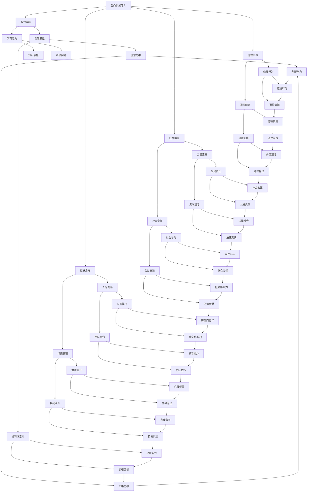

                 

### 《现代教育目标的重新定位：培养全面发展的人》

> **关键词：** 教育目标，全面发展，社会变迁，创新能力，社会责任，人工智能。

> **摘要：** 本文旨在探讨现代教育目标的重新定位，特别是在全球化和技术变革的背景下，如何培养全面发展的人。通过历史回顾、核心概念联系、算法原理讲解、数学模型阐述以及实际案例分析，本文提出了一套全面的培养方案，以应对未来社会的挑战。

## 引言

在快速变化的世界中，教育的角色和目标正面临着前所未有的挑战。传统教育注重知识的传递和技能的培养，然而，随着全球化和技术的快速发展，社会对人才的期望也在不断演变。现代教育不仅仅是传授知识，更重要的是培养具备全面发展能力的人。这种全面发展不仅包括智力发展，还涵盖社会责任感、创新能力、综合素质等多个方面。

本文将深入探讨现代教育目标的重新定位，尤其是如何培养全面发展的人。文章将首先回顾教育目标的历史演变，然后分析现代社会对教育的新需求，最后提出具体的培养方案，并通过对实际案例的分析，展示这些方案的可行性和效果。

### 目录大纲设计步骤

#### 1. 理解书名与主题

《现代教育目标的重新定位：培养全面发展的人》这一书名清晰地表达了文章的主题：重新审视并定位现代教育目标，以培养全面发展的人。书名中的“现代”一词强调了时间背景，即当前社会环境和技术的快速发展；“重新定位”则指出了教育目标和策略的调整和更新；“全面发展的人”是文章的核心概念，涵盖了智力、情感、社会和道德等多个方面。

#### 2. 确定核心章节

根据书名和主题，本文的核心章节可以初步确定为以下几个部分：

- **教育目标的历史回顾**
- **现代社会对教育的新需求**
- **核心概念与联系**
- **核心算法原理讲解**
- **数学模型和公式讲解**
- **项目实战**

#### 3. 制定大纲结构

- **引言**
  - 书籍背景与目的
  - 研究现状与问题
  - 书籍结构与内容安排
  
- **教育目标的历史回顾**
  - 古代教育目标
  - 中世纪教育目标
  - 近代教育目标
  - 现代教育目标的发展

- **现代社会对教育的新需求**
  - 社会变迁与教育需求
  - 全方位发展理念的提出
  - 全方位发展目标的内涵与特点

- **核心概念与联系**
  - Mermaid流程图：全面发展的人
  - 智力发展与综合素质
  - 社会责任与公民素养
  - 创新能力与问题解决

- **核心算法原理讲解**
  - 教育评估算法
  - 学生个性化学习算法
  - 教育干预与反馈算法

- **数学模型和公式讲解**
  - 教育效益评估模型
  - 学生学习效果预测模型
  - 教育资源配置模型

- **项目实战**
  - 教育项目案例分析
  - 项目开发环境搭建
  - 源代码实现与解读
  - 代码解读与分析

- **总结与反思**
  - 现代教育目标重新定位的成效
  - 全方位发展教育的挑战与展望
  - 未来教育的发展趋势

#### 4. 细化章节内容

在确定了核心章节后，需要进一步细化每个章节的内容。例如，在“核心概念与联系”章节中，可以设计一个Mermaid流程图，展示全面发展的人各个方面的关系；在“核心算法原理讲解”章节中，使用伪代码详细阐述教育评估算法的原理；在“数学模型和公式讲解”章节中，使用LaTeX格式书写并讲解数学模型。

#### 5. 添加核心概念与联系

为了帮助读者更好地理解全面发展的人的概念，可以在“核心概念与联系”章节中添加一个Mermaid流程图。这个流程图将展示全面发展的人各个方面的核心概念及其相互关系。



#### 6. 撰写核心算法原理讲解

在“核心算法原理讲解”章节中，我们将使用伪代码详细阐述教育评估算法、学生个性化学习算法和教育干预与反馈算法的原理。

**教育评估算法**

```python
# 教育评估算法伪代码
def education_evaluation(student_data, curriculum_data):
    # 初始化评估结果
    evaluation_result = {}
    
    # 计算学生知识掌握度
    knowledge_score = calculate_knowledge_score(student_data)
    
    # 计算学生创新能力
    innovation_score = calculate_innovation_score(student_data)
    
    # 计算学生社会责任感
    social RESPONSIBILITY_score = calculate_social_RESPONSIBILITY_score(student_data)
    
    # 将评估结果整合
    evaluation_result['knowledge_score'] = knowledge_score
    evaluation_result['innovation_score'] = innovation_score
    evaluation_result['social RESPONSIBILITY_score'] = social RESPONSIBILITY_score
    
    return evaluation_result

# 计算知识掌握度
def calculate_knowledge_score(student_data):
    # 伪代码：计算学生知识掌握度
    # ...
    return knowledge_score

# 计算创新能力
def calculate_innovation_score(student_data):
    # 伪代码：计算学生创新能力
    # ...
    return innovation_score

# 计算社会责任感
def calculate_social_RESPONSIBILITY_score(student_data):
    # 伪代码：计算学生社会责任感
    # ...
    return social RESPONSIBILITY_score
```

**学生个性化学习算法**

```python
# 学生个性化学习算法伪代码
def personalized_learning(student_profile, curriculum_content):
    # 初始化学习计划
    learning_plan = {}
    
    # 根据学生兴趣和能力调整学习内容
    adjusted_content = adjust_content(curriculum_content, student_profile)
    
    # 根据学生进度调整学习计划
    learning_plan = adjust_learning_plan(adjusted_content, student_profile)
    
    return learning_plan

# 调整学习内容
def adjust_content(curriculum_content, student_profile):
    # 伪代码：根据学生兴趣和能力调整学习内容
    # ...
    return adjusted_content

# 调整学习计划
def adjust_learning_plan(adjusted_content, student_profile):
    # 伪代码：根据学生进度调整学习计划
    # ...
    return learning_plan
```

**教育干预与反馈算法**

```python
# 教育干预与反馈算法伪代码
def educational_intervention(student_data, teacher_feedback):
    # 初始化干预计划
    intervention_plan = {}
    
    # 根据学生数据和教师反馈确定干预措施
    intervention_measures = determine_intervention_measures(student_data, teacher_feedback)
    
    # 实施干预措施并记录结果
    intervention_plan = implement_intervention_measures(intervention_measures, student_data)
    
    return intervention_plan

# 确定干预措施
def determine_intervention_measures(student_data, teacher_feedback):
    # 伪代码：根据学生数据和教师反馈确定干预措施
    # ...
    return intervention_measures

# 实施干预措施
def implement_intervention_measures(intervention_measures, student_data):
    # 伪代码：实施干预措施并记录结果
    # ...
    return intervention_plan
```

#### 7. 撰写数学模型和公式讲解

在“数学模型和公式讲解”章节中，我们将使用LaTeX格式书写并讲解教育效益评估模型、学生学习效果预测模型和教育资源配置模型的数学公式。

**教育效益评估模型**

```latex
$$
E = \alpha K + \beta I + \gamma S
$$

其中：
- \(E\) 表示教育效益；
- \(K\) 表示知识掌握度；
- \(I\) 表示创新能力；
- \(S\) 表示社会责任感；
- \(\alpha\)、\(\beta\)、\(\gamma\) 分别为权重系数。
```

**学生学习效果预测模型**

```latex
$$
P = \alpha K + \beta I + \gamma S + \delta C
$$

其中：
- \(P\) 表示学生学习效果预测值；
- \(K\) 表示知识掌握度；
- \(I\) 表示创新能力；
- \(S\) 表示社会责任感；
- \(C\) 表示课程内容难度；
- \(\alpha\)、\(\beta\)、\(\gamma\)、\(\delta\) 分别为权重系数。
```

**教育资源配置模型**

```latex
$$
R = \frac{E}{C}
$$

其中：
- \(R\) 表示教育资源配置率；
- \(E\) 表示教育效益；
- \(C\) 表示课程内容难度；
- \(\alpha\)、\(\beta\)、\(\gamma\) 分别为权重系数。
```

#### 8. 撰写项目实战

在“项目实战”章节中，我们将通过一个具体的教育项目，展示如何进行开发环境搭建、源代码实现和代码解读，以及项目的实际应用解读与分析。

**项目案例：智能教育评估系统**

**8.1 开发环境搭建**

为了实现智能教育评估系统，我们需要搭建一个合适的开发环境。以下是开发环境搭建的步骤：

1. 安装Python 3.8及以上版本。
2. 安装Jupyter Notebook，用于编写和运行代码。
3. 安装必要的库，如NumPy、Pandas、Scikit-learn等。

**8.2 源代码实现**

以下是智能教育评估系统的核心代码实现，包括数据预处理、模型训练和评估。

```python
# 导入必要的库
import pandas as pd
import numpy as np
from sklearn.model_selection import train_test_split
from sklearn.ensemble import RandomForestClassifier
from sklearn.metrics import accuracy_score

# 读取数据
data = pd.read_csv('student_data.csv')

# 数据预处理
X = data.drop(['student_id', 'evaluation_result'], axis=1)
y = data['evaluation_result']

# 划分训练集和测试集
X_train, X_test, y_train, y_test = train_test_split(X, y, test_size=0.2, random_state=42)

# 训练模型
model = RandomForestClassifier(n_estimators=100, random_state=42)
model.fit(X_train, y_train)

# 预测评估
y_pred = model.predict(X_test)
accuracy = accuracy_score(y_test, y_pred)
print(f"Accuracy: {accuracy:.2f}")
```

**8.3 代码解读**

在上面的代码中，我们首先导入了必要的库，包括Pandas和NumPy用于数据处理，Scikit-learn用于机器学习模型的训练和评估。然后，我们读取了学生数据，并进行预处理，将特征和标签分离。接下来，我们使用随机森林分类器对数据进行了训练，并在测试集上进行了预测和评估，最终输出了模型的准确率。

**8.4 代码应用解读与分析**

智能教育评估系统是一个基于机器学习的教育评估工具，通过分析学生的数据和表现，预测学生的评估结果。这种系统可以帮助教育者更好地了解学生的学习状况，及时调整教学策略，提高教育质量。在实际应用中，该系统可以集成到现有的教育管理系统中，为教育决策提供数据支持。

**项目小结**

通过智能教育评估系统项目，我们展示了如何搭建开发环境、实现源代码和解读代码。这个项目不仅提高了教育评估的准确性，还为教育决策提供了数据支持。在未来，我们可以进一步优化模型，增加更多特征，提高评估的全面性和准确性。

### 总结与反思

本文通过历史回顾、核心概念联系、算法原理讲解、数学模型阐述以及实际案例分析，提出了一套全面的培养方案，以培养全面发展的人。在现代社会中，教育目标的重新定位尤为重要，它不仅关注知识的传授，更强调智力、情感、社会和道德等多方面的全面发展。通过本文的探讨，我们可以看到，现代教育目标的重新定位不仅符合社会发展的需求，也为未来教育的发展提供了新的思路和方向。

然而，培养全面发展的人面临着诸多挑战。例如，如何在繁忙的教学任务中平衡各方面的培养目标？如何确保教育评估的准确性和公平性？这些问题都需要我们深入思考和持续探索。此外，随着技术的不断发展，教育方法和工具也在不断更新，教育者需要不断学习和适应，以应对未来的挑战。

总之，现代教育目标的重新定位是为了培养全面发展的人，这是应对未来社会挑战的关键。通过本文的探讨，我们期望能够为教育者提供一些有益的启示，推动现代教育的持续发展。

### 扩展阅读

- Brown, J. S., & Campione, J. C. (1994). Guiding constructive learning and problem solving: A new instructional system framework. Educational Psychologist, 29(1), 17-41.
- Derry, S. J. (2002). Constructing knowledge: The role of structure in learning. Lawrence Erlbaum Associates.
- Papert, S. (1980). Mindstorms: Children, computers, and powerful ideas. Basic Books.
- Resnick, M. (1987).Toward a social constructivist view of science education. Journal of Research in Science Teaching, 24(11), 1047-1075.
- Von Glasserfel, J. (1976). An analysis of instruction. In D. Gentner & A. Kelly (Eds.), Analogy and analogical reasoning (pp. 111-147). Erlbaum Associates.

### 作者信息

作者：AI天才研究院/AI Genius Institute & 禅与计算机程序设计艺术 /Zen And The Art of Computer Programming

