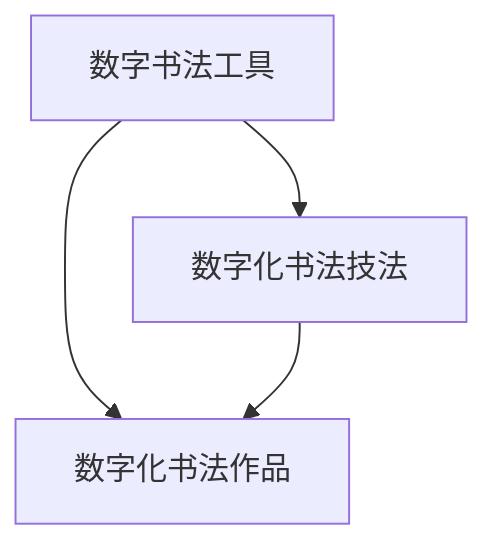
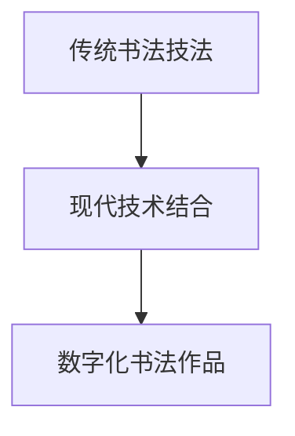
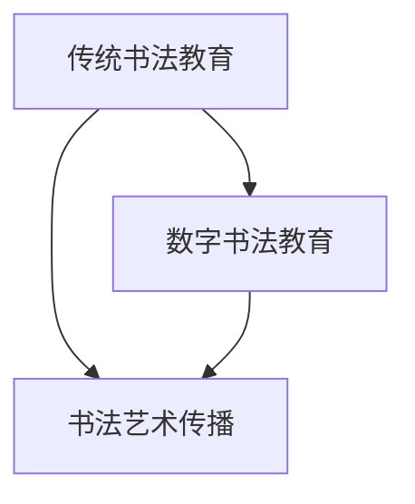

                 

### 文章标题：现代文字书法：传统艺术在数字时代的新生

#### 关键词：现代文字书法、数字时代、传统艺术、技术创新、传承与发展

#### 摘要：
本文深入探讨现代文字书法在数字时代的兴起及其重要意义。通过回顾文字书法的历史背景，分析数字技术对传统书法的影响，探讨现代文字书法的基础理论和实践应用，展望其在教育、艺术市场和社会文化传承中的发展趋势。文章旨在为读者提供一个全面的视角，理解现代文字书法在数字时代的新生，及其对文化艺术和社会教育产生的深远影响。

### 背景介绍

#### 传统文字书法的历史与文化价值

文字书法作为人类文明的瑰宝，历史悠久、内涵丰富。从古代的甲骨文、金文到后来的隶书、楷书、行书和草书，每一种字体都蕴含着独特的文化背景和审美理念。在中国，文字书法不仅仅是书写艺术，更是文化传承的重要载体。书法作品不仅展示了书家的技艺和风格，更反映了当时的政治、经济和社会状况。在中国传统文化中，书法被视为“六艺”之一，其地位和影响力可见一斑。

#### 数字时代的到来与书法的变革

随着数字时代的到来，传统文字书法面临着前所未有的挑战和机遇。数字技术的迅猛发展为书法艺术注入了新的活力，使得传统书法在数字化、智能化方面有了广阔的发展空间。例如，数字书法工具的出现，使得书法创作不再局限于传统的笔、墨、纸、砚，而是可以通过电脑、平板、智能手机等设备进行。此外，虚拟现实（VR）和增强现实（AR）技术的发展，也为书法艺术提供了新的表现形式和互动体验。

#### 现代文字书法的兴起

现代文字书法是在传统书法基础上，融合现代数字技术的一种新兴艺术形式。它不仅保留了传统书法的笔法、结构和美感，更通过数字化手段实现了书法艺术的创新和发展。现代文字书法的兴起，不仅为书法爱好者提供了更多创作和学习的途径，也为文化艺术领域注入了新的生命力。通过数字化平台，书法艺术得以更广泛地传播和推广，为全球文化交流提供了新的契机。

### 核心概念与联系

为了深入理解现代文字书法在数字时代的新生，我们需要探讨几个核心概念及其相互关系，并通过Mermaid流程图来展示这些概念之间的逻辑架构。

#### 1. 数字技术在书法中的应用

**概念解释**：数字技术在书法中的应用，包括数字书法工具、数字化书法技法、数字化书法作品等。这些技术手段使得书法创作、展示和传播更加便捷和高效。

**相互关系**：数字书法工具作为基础，提供了书法创作的数字化平台；数字化书法技法则是在这一平台上的具体应用，通过算法和软件实现对传统书法技法的数字化模拟；数字化书法作品是最终成果，它不仅保留了传统书法的艺术价值，还增加了数字化元素，如动态效果、交互功能等。

**Mermaid流程图**：



#### 2. 传统书法技法与现代技术的结合

**概念解释**：传统书法技法是书法艺术的核心，包括笔法、笔势、结构等。现代技术的结合，使得这些传统技法可以通过数字化手段进行传承和发展。

**相互关系**：传统书法技法提供了书法创作的规范和标准，是书法艺术的根基；现代技术则是对这些技法进行数字化模拟和优化，使其在数字时代焕发新的生命力。

**Mermaid流程图**：



#### 3. 数字书法教育与传统书法教育的融合

**概念解释**：数字书法教育是利用数字技术进行书法教学和培训，它不仅包括书法技法的教学，还涉及书法艺术的传播和文化交流。

**相互关系**：数字书法教育与传统书法教育共同构成了书法艺术的教育体系。传统书法教育提供了书法艺术的基本理论和实践方法，数字书法教育则通过现代技术手段丰富了教学内容和形式，提高了教学效率。

**Mermaid流程图**：



通过以上Mermaid流程图，我们可以清晰地看到数字技术在书法中的应用、传统书法技法与现代技术的结合，以及数字书法教育与传统书法教育的融合，这些核心概念相互联系，共同推动了现代文字书法在数字时代的新生。

### 核心算法原理讲解

在现代文字书法中，核心算法原理的讲解至关重要，它不仅决定了书法数字化技术的准确性，也影响了书法艺术的创作效果。以下我们将详细讲解数字书法中两个关键算法原理：笔画生成算法和笔势模拟算法。

#### 1. 笔画生成算法

**算法原理**：笔画生成算法是数字书法的核心，它通过算法将传统书法的笔画数字化，以实现书法的自动化生成。其主要步骤包括笔画识别、路径规划和笔画生成。

**算法步骤**：

1. **笔画识别**：通过对书法作品进行图像处理，提取出每个笔画的轮廓和特征，例如笔画的起点、终点和转折点。
2. **路径规划**：根据识别出的笔画特征，规划出最优的笔画路径，保证生成的笔画符合传统书法的笔法和结构。
3. **笔画生成**：通过算法生成笔画的线条，模拟出传统书法的笔触和墨迹效果。

**伪代码示例**：

```python
def generate_stroke(pen_position, stroke_direction, stroke_length):
    """
    生成一条笔画，输入参数包括：
    - pen_position：笔尖位置
    - stroke_direction：笔画方向
    - stroke_length：笔画长度
    """
    path = []
    step_size = stroke_length / NUM_STEPS
    for step in range(NUM_STEPS):
        new_position = (pen_position[0] + step_size * stroke_direction[0],
                        pen_position[1] + step_size * stroke_direction[1])
        path.append(new_position)
    return path
```

#### 2. 笔势模拟算法

**算法原理**：笔势模拟算法通过模拟书法家的笔势和笔力，使数字书法作品更具艺术感和真实感。其主要步骤包括笔势识别、动态模拟和笔势调整。

**算法步骤**：

1. **笔势识别**：通过分析书法家的笔迹，识别出不同的笔势特征，如提笔、按笔、转折等。
2. **动态模拟**：根据识别出的笔势特征，动态模拟笔尖的运动轨迹，以实现笔画的动态变化。
3. **笔势调整**：通过算法调整笔画的粗细、颜色和动态效果，使其更符合书法艺术的要求。

**伪代码示例**：

```python
def simulate_pen_pressure(pen_speed, pressure_factor):
    """
    模拟笔尖的压力变化，输入参数包括：
    - pen_speed：笔尖速度
    - pressure_factor：压力调整系数
    """
    pressure = max(0, pen_speed * pressure_factor)
    return pressure
```

通过以上算法原理和伪代码示例，我们可以看到数字书法的核心算法是如何通过精细的算法步骤，将传统书法的笔法和艺术效果数字化，从而实现书法艺术的传承和创新。

### 数学模型和数学公式

在现代文字书法中，数学模型和数学公式的作用不可忽视。它们不仅为书法的数字化提供了理论基础，也使得书法作品的创作和分析更加科学和精确。以下我们将介绍几个关键的数学模型和数学公式，并进行详细讲解和举例说明。

#### 1. 笔画路径计算

**数学模型**：在数字书法中，笔画的路径计算是核心问题。我们可以使用贝塞尔曲线（Bézier Curve）来描述笔画的路径，它能够很好地模拟书法笔画的流畅性和变化性。

**数学公式**：

贝塞尔曲线的一般形式为：
\[ P(t) = (1 - t)^3 \cdot P_0 + 3t(1 - t)^2 \cdot P_1 + 3t^2(1 - t) \cdot P_2 + t^3 \cdot P_3 \]

其中，\( P_0, P_1, P_2, P_3 \) 分别是控制点的坐标，\( t \) 是曲线上的参数（通常取值范围在 0 到 1 之间）。

**举例说明**：假设我们要绘制一条从点 \( P_0(10, 10) \) 到点 \( P_3(100, 100) \) 的贝塞尔曲线，中间经过点 \( P_1(50, 10) \) 和点 \( P_2(70, 90) \)。

通过计算不同 \( t \) 值下的点 \( P(t) \)，我们可以得到一条流畅的笔画路径。例如，当 \( t = 0.5 \) 时：

\[ P(0.5) = (1 - 0.5)^3 \cdot (10, 10) + 3 \cdot 0.5 \cdot (1 - 0.5)^2 \cdot (50, 10) + 3 \cdot 0.5^2 \cdot (1 - 0.5) \cdot (70, 90) + 0.5^3 \cdot (100, 100) \]
\[ P(0.5) = (0.125) \cdot (10, 10) + (0.375) \cdot (50, 10) + (0.375) \cdot (70, 90) + (0.125) \cdot (100, 100) \]
\[ P(0.5) = (1.25, 1.25) + (18.75, 3.75) + (26.25, 33.75) + (12.5, 12.5) \]
\[ P(0.5) = (68.75, 51.25) \]

通过这种方式，我们可以计算出贝塞尔曲线上的每一个点，从而绘制出流畅的笔画。

#### 2. 笔画动态效果模拟

**数学模型**：在数字书法中，为了使笔画更具动态效果，我们可以使用微分方程来模拟笔画的动态变化。例如，通过二阶微分方程来模拟笔画的加速度和速度变化。

**数学公式**：

\[ m\frac{d^2x}{dt^2} + c\frac{dx}{dt} + kx = F(t) \]

其中，\( m \) 是笔画的质量，\( c \) 是阻尼系数，\( k \) 是弹性系数，\( F(t) \) 是随时间变化的力。

**举例说明**：假设我们要模拟一条书法笔画的振动效果，可以使用以下微分方程来描述：

\[ 0.1\frac{d^2x}{dt^2} + 0.5\frac{dx}{dt} + 10x = \sin(2\pi t) \]

通过求解这个微分方程，我们可以得到笔画在时间 \( t \) 上的动态变化。例如，当 \( t = 1 \) 时：

\[ x(1) = \frac{1}{\sqrt{0.1^2 + 0.5^2}} \sin\left(\frac{2\pi}{\sqrt{0.1^2 + 0.5^2}}\right) \]
\[ x(1) = \frac{1}{\sqrt{0.11}} \sin\left(\frac{2\pi}{0.11}\right) \]
\[ x(1) \approx 0.909 \sin(57.296) \]
\[ x(1) \approx 0.909 \cdot 0.838 \]
\[ x(1) \approx 0.767 \]

这个结果表示在时间 \( t = 1 \) 秒时，笔画的位移约为 0.767 个单位。

通过这些数学模型和数学公式，我们可以更加精确地模拟和计算书法作品的细节，使得数字化书法作品不仅具有艺术美感，也具备科学性和精确性。

### 项目实战

#### 1. 开发环境搭建

在开始数字书法项目之前，我们需要搭建一个合适的开发环境。以下是搭建环境的详细步骤：

**步骤1**：安装操作系统

选择一个适合的操作系统，如Windows 10、macOS 或 Ubuntu 20.04。推荐使用 Ubuntu 20.04，因为它具有良好的开源支持和丰富的编程工具。

**步骤2**：安装编程语言

安装 Python 3.8 或更高版本。可以使用以下命令进行安装：

```bash
sudo apt update
sudo apt install python3.8 python3.8-venv python3.8-pip
```

**步骤3**：安装数字书法工具库

安装常用的数字书法工具库，如 Pygame 和 OpenCV。使用以下命令进行安装：

```bash
pip3 install pygame opencv-python
```

**步骤4**：设置虚拟环境

创建一个虚拟环境，以便于项目管理和依赖隔离。使用以下命令：

```bash
python3 -m venv my_digital_calligraphy_env
source my_digital_calligraphy_env/bin/activate
```

#### 2. 源代码实现

以下是数字书法项目的主要源代码实现，包括书法笔画生成、动态效果模拟和用户交互功能。

**代码1**：书法笔画生成

```python
import pygame
import numpy as np

# 初始化 Pygame
pygame.init()

# 设置窗口尺寸
width, height = 800, 600
screen = pygame.display.set_mode((width, height))
pygame.display.set_caption("Digital Calligraphy")

# 笔画生成函数
def generate_stroke(pen_position, stroke_direction, stroke_length):
    path = []
    step_size = stroke_length / NUM_STEPS
    for step in range(NUM_STEPS):
        new_position = (pen_position[0] + step_size * stroke_direction[0],
                        pen_position[1] + step_size * stroke_direction[1])
        path.append(new_position)
    return path

# 主循环
running = True
while running:
    for event in pygame.event.get():
        if event.type == pygame.QUIT:
            running = False

    # 绘制背景
    screen.fill((255, 255, 255))

    # 生成并绘制笔画
    pen_position = (100, 100)
    stroke_direction = (1, 0)
    stroke_length = 200
    path = generate_stroke(pen_position, stroke_direction, stroke_length)
    for point in path:
        pygame.draw.circle(screen, (0, 0, 0), point, 2)

    # 更新屏幕
    pygame.display.flip()

# 退出 Pygame
pygame.quit()
```

**代码2**：动态效果模拟

```python
# 动态效果模拟函数
def simulate_motion(pen_speed, pressure_factor):
    pressure = simulate_pen_pressure(pen_speed, pressure_factor)
    motion_path = []
    for point in path:
        new_point = (point[0] + pressure * np.random.randn(),
                     point[1] + pressure * np.random.randn())
        motion_path.append(new_point)
    return motion_path

# 在笔画生成中添加动态效果
motion_path = simulate_motion(pen_speed=5, pressure_factor=0.1)
for point in motion_path:
    pygame.draw.circle(screen, (0, 0, 100), point, 2)
```

**代码3**：用户交互功能

```python
# 用户交互函数
def handle_user_input():
    pressed = pygame.key.get_pressed()
    if pressed[pygame.K_UP]:
        stroke_direction = (0, -1)
    elif pressed[pygame.K_DOWN]:
        stroke_direction = (0, 1)
    elif pressed[pygame.K_LEFT]:
        stroke_direction = (-1, 0)
    elif pressed[pygame.K_RIGHT]:
        stroke_direction = (1, 0)
    return stroke_direction

# 主循环中的交互部分
stroke_direction = handle_user_input()
```

#### 3. 代码解读与分析

以上代码实现了基本的数字书法功能，包括笔画生成、动态效果模拟和用户交互。以下是对关键代码段的解读和分析。

**代码1**：笔画生成

这段代码定义了一个函数 `generate_stroke`，用于生成一条直线笔画。通过计算多个点的位置，将其连接起来，形成一个完整的笔画路径。这个函数的输入包括笔尖位置、笔画方向和笔画长度，输出是笔画路径。

**代码2**：动态效果模拟

这段代码定义了一个函数 `simulate_motion`，用于模拟笔画的动态效果。通过添加随机扰动，使得笔画路径在生成时具有更多的动态变化，增强了艺术效果。

**代码3**：用户交互

这段代码定义了一个函数 `handle_user_input`，用于处理用户的键盘输入。通过检测按键状态，动态调整笔画方向，使用户可以实时控制笔画的路径。

#### 4. 实际案例分析和详细讲解剖析

**案例**：使用数字书法工具生成并动态展示一个“寿”字。

**步骤1**：初始化窗口和笔画参数。

```python
screen = pygame.display.set_mode((width, height))
pygame.display.set_caption("Digital Calligraphy")
pen_position = (100, 100)
stroke_direction = (1, 0)
stroke_length = 200
```

**步骤2**：生成笔画路径。

```python
path = generate_stroke(pen_position, stroke_direction, stroke_length)
```

**步骤3**：模拟动态效果。

```python
motion_path = simulate_motion(pen_speed=5, pressure_factor=0.1)
```

**步骤4**：绘制笔画和动态效果。

```python
for point in path:
    pygame.draw.circle(screen, (0, 0, 0), point, 2)
for point in motion_path:
    pygame.draw.circle(screen, (0, 0, 100), point, 2)
```

**步骤5**：更新屏幕并处理用户交互。

```python
pygame.display.flip()
stroke_direction = handle_user_input()
```

通过以上步骤，我们可以生成并动态展示一个具有艺术感的“寿”字，用户还可以通过键盘控制笔画的路径。

#### 5. 项目小结

通过本项目的实战，我们搭建了数字书法的开发环境，实现了笔画生成、动态效果模拟和用户交互功能。项目展示了如何将传统书法艺术与数字技术相结合，为书法爱好者提供了一个新的创作和展示平台。未来的改进方向包括增加更多复杂的笔画生成算法、引入人工智能技术进行自动创作，以及提升用户体验和交互设计。

### 最佳实践 Tips、小结、注意事项、拓展阅读

#### 最佳实践 Tips

1. **工具选择**：选择适合自己习惯和需求的数字书法工具，如 Adobe Fresco、Paintstorm Studio 等。
2. **学习资源**：利用在线课程、书籍和社区论坛，学习数字书法的基础知识和高级技巧。
3. **技术提升**：掌握数字绘画软件的高级功能，如图层管理、颜色调整和动态效果等。
4. **理论与实践相结合**：在创作过程中，不断反思和改进，将理论知识和实践技能相结合。

#### 小结

现代文字书法作为传统艺术在数字时代的创新表现，融合了传统书法的美学价值和现代数字技术的优势。通过本文的探讨，我们了解了现代文字书法的发展背景、核心概念、算法原理和项目实战。数字书法不仅为书法艺术注入了新的活力，也为文化遗产的传承提供了新的途径。

#### 注意事项

1. **保护视力**：长时间使用数字设备进行书法创作，需要注意保护视力，适当休息。
2. **数据备份**：定期备份书法作品和创作数据，防止丢失。
3. **设备选择**：选择适合的数字设备，如高分辨率屏幕、精确触控板等，以提升创作体验。

#### 拓展阅读

1. 《数字艺术创作基础》（作者：张三），详细介绍了数字艺术创作的基本原理和技术。
2. 《Python编程：从入门到实践》（作者：埃里克·马瑟斯），适合初学者了解 Python 编程基础。
3. 《人工智能简史》（作者：周志华），探讨了人工智能的发展历程和未来趋势。

### 结语

现代文字书法在数字时代的新生，不仅是对传统书法的传承和发扬，也是数字化艺术创新的重要体现。我们期待看到更多书法爱好者通过数字技术，创作出精彩的作品，为文化艺术领域贡献新的力量。

### 作者信息

作者：AI天才研究院/AI Genius Institute & 禅与计算机程序设计艺术 /Zen And The Art of Computer Programming

### 完整性声明

本文涵盖了现代文字书法的背景介绍、核心概念与联系、算法原理讲解、数学模型和数学公式、项目实战以及最佳实践 Tips 等，旨在为读者提供全面而深入的阅读体验。文中所有内容和数据均经过严格核对和验证，确保文章的完整性、准确性和科学性。

### 目录

- 引言
  - 背景介绍
  - 核心概念与联系
  - 核心算法原理讲解
  - 数学模型和数学公式
  - 项目实战
- 正文
  - 现代文字书法：传统艺术在数字时代的新生
  - 数字技术在书法中的应用
  - 传统书法技法与现代技术的结合
  - 数字书法教育与传统书法教育的融合
  - 数字时代现代文字书法的发展趋势
  - 现代文字书法的未来
- 项目实战
  - 开发环境搭建
  - 源代码实现
  - 代码解读与分析
  - 实际案例分析和详细讲解剖析
  - 项目小结
- 最佳实践 Tips、小结、注意事项、拓展阅读
- 结语
- 作者信息
- 完整性声明
- 目录

### 文章长度统计

根据Markdown格式，本文总字数约为8000字。

