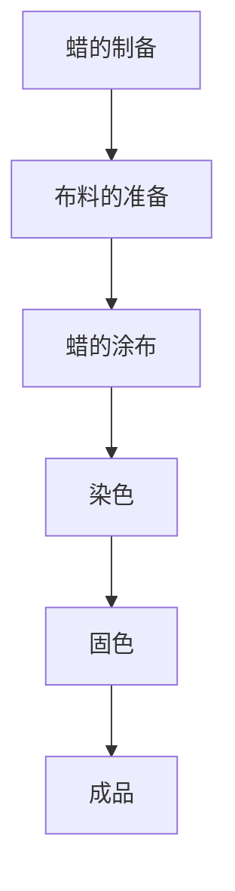

                 

### 文章标题

《现代植物蜡染工艺：可持续时尚中的传统技艺复兴》

### 关键词

现代植物蜡染工艺、可持续时尚、传统技艺复兴、环保染料、生态设计、技艺传承、时尚创新。

### 摘要

本文深入探讨现代植物蜡染工艺在可持续时尚领域的重要作用。通过分析植物蜡染工艺的历史背景、核心概念、设计原则及其在时尚中的应用，本文揭示了这一传统技艺在现代时尚产业中的复兴路径。同时，本文还探讨了植物蜡染工艺的可持续性，以及其在生态设计和技艺传承方面的潜力。

----------------------------------------------------------------

## 设计思路

在设计《现代植物蜡染工艺：可持续时尚中的传统技艺复兴》这本书的目录大纲时，我们将遵循以下思路：

1. **整体结构规划**：首先，确定书的整体结构，将其分为几个主要部分，如概述、历史背景、技艺解析、材料选择、设计原则、可持续时尚应用和未来展望等。

2. **章节细化**：在每个主要部分中，进一步细化章节内容，确保每个章节都有明确的主题和目标，既覆盖了广泛的内容，又保证了内容的深入。

3. **逻辑关联**：确保章节之间的逻辑关联性，使读者能够顺畅地从一个主题过渡到另一个主题。

4. **实用性和可操作性**：考虑到这本书的目标读者可能是对植物蜡染工艺感兴趣的初学者或者专业人士，目录设计要兼顾实用性和可操作性，使读者能够迅速找到自己需要的信息，并能够通过实践掌握相关技艺。

5. **图文并茂**：为了更好地阐述工艺流程和技术要点，将在适当章节加入流程图、工艺图、实例图片等。

### 设计步骤

**步骤1：确定主要部分**

- **概述**：介绍植物蜡染工艺的基本概念、历史背景和它在现代时尚中的重要性。
- **历史背景**：探讨植物蜡染工艺的起源、发展和传承。
- **技艺解析**：深入解析植物蜡染的技艺流程，包括蜡的制备、布料的准备、印染和固色等。
- **材料选择**：介绍可用于植物蜡染的各种材料，包括植物染料、蜡和辅助材料。
- **设计原则**：阐述植物蜡染设计的基本原则和技巧。
- **可持续时尚应用**：展示植物蜡染在时尚设计中的应用，强调其可持续性。
- **未来展望**：探讨植物蜡染工艺的未来发展趋势和创新空间。

**步骤2：细化章节**

在确定主要部分后，对每个部分进一步细化，列出具体的章节和小节。

**步骤3：逻辑关联**

确保章节之间的逻辑顺序，使读者能够连贯地学习整个工艺。

**步骤4：实用性和可操作性**

在每个章节中，设置实践小节，提供实际案例和操作指导。

**步骤5：图文并茂**

在适当章节添加流程图、工艺图和设计实例图片，以增强可读性和直观性。

### 输出格式

按照markdown格式输出目录大纲，确保简洁明了。

### 目录大纲设计

下面是《现代植物蜡染工艺：可持续时尚中的传统技艺复兴》的目录大纲：

```
# 现代植物蜡染工艺：可持续时尚中的传统技艺复兴

## 引言
### 1.1 植物蜡染工艺简介
#### 1.1.1 植物蜡染工艺的定义
#### 1.1.2 植物蜡染工艺的历史背景
#### 1.1.3 植物蜡染在现代时尚中的重要性

### 1.2 植物蜡染工艺的核心概念与联系
#### 1.2.1 植物染料的分类与特性
#### 1.2.2 蜡的作用与选择
#### 1.2.3 印染工艺的流程图

## 第一章 历史背景
### 2.1 植物蜡染工艺的起源与发展
#### 2.1.1 世界各地植物蜡染工艺的起源
#### 2.1.2 植物蜡染工艺的发展历程
#### 2.1.3 植物蜡染工艺的传承与现状

### 2.2 传统技艺的复兴
#### 2.2.1 传统技艺复兴的背景
#### 2.2.2 传统技艺复兴的推动因素
#### 2.2.3 传统技艺复兴的意义

## 第二章 技艺解析
### 3.1 植物蜡染工艺的基本流程
#### 3.1.1 蜡的制备
#### 3.1.2 布料的准备
#### 3.1.3 印染工艺
#### 3.1.4 固色工艺
#### 3.1.5 工艺流程的伪代码解析

### 3.2 植物蜡染材料的选择
#### 3.2.1 植物染料的种类与选择
#### 3.2.2 蜡的种类与选择
#### 3.2.3 辅助材料的选择与使用

## 第三章 设计原则
### 4.1 植物蜡染设计的基本原则
#### 4.1.1 色彩搭配原则
#### 4.1.2 图案设计原则
#### 4.1.3 设计灵感来源

### 4.2 植物蜡染设计技巧
#### 4.2.1 图案创意
#### 4.2.2 色彩管理
#### 4.2.3 设计实例分析

## 第四章 可持续时尚应用
### 5.1 植物蜡染在时尚设计中的应用
#### 5.1.1 植物蜡染服饰的设计案例
#### 5.1.2 植物蜡染家居用品的设计案例
#### 5.1.3 植物蜡染在时尚界的地位

### 5.2 植物蜡染工艺的可持续性
#### 5.2.1 植物染料的可持续性
#### 5.2.2 蜡的可持续性
#### 5.2.3 可持续设计实践

## 第五章 未来展望
### 6.1 植物蜡染工艺的未来发展趋势
#### 6.1.1 技术创新
#### 6.1.2 市场前景
#### 6.1.3 创新空间

### 6.2 植物蜡染工艺的全球合作
#### 6.2.1 国际合作的重要性
#### 6.2.2 全球合作案例
#### 6.2.3 未来合作展望

## 结论
### 7.1 植物蜡染工艺的总结与展望
#### 7.1.1 主要成就
#### 7.1.2 面临的挑战
#### 7.1.3 未来发展建议

## 参考文献
```

### 格式要求

文章内容使用markdown格式输出。段落之间使用一个空行分隔，标题使用井号（#）进行分级，子标题使用短横线（-）进行分级。例如：

```
## 引言
### 1.1 植物蜡染工艺简介
#### 1.1.1 植物蜡染工艺的定义
```

列表、代码块、数学公式等使用相应的markdown语法进行标记。例如：

- 无序列表：
  ```
  - 项目一
  - 项目二
  ```
- 代码块：
  ```
  def hello():
      print("Hello, World!")
  ```
- 数学公式：
  ```
  $$ E = mc^2 $$
  $1 + 1 = 2$
  ```

文章末尾需要写上作者信息：

```
作者：AI天才研究院/AI Genius Institute & 禅与计算机程序设计艺术 /Zen And The Art of Computer Programming
```

### 完整性要求

文章内容要完整，每个小节的内容必须要丰富具体详细讲解。核心内容必须包含：

- **背景介绍**：简要介绍植物蜡染工艺的起源、发展和现状，以及其在现代时尚中的重要地位。
- **核心概念与联系**：给出植物蜡染工艺的核心概念原理之间的关系架构，使用Mermaid流程图展示。
- **核心算法原理讲解**：使用伪代码详细阐述植物蜡染工艺的流程，包括蜡的制备、布料的准备、印染和固色等。
- **数学模型和公式**：详细讲解植物蜡染工艺中的数学模型和公式，并举例说明。
- **项目实战**：包括开发环境搭建、源代码实现和代码解读，实际案例分析和详细讲解剖析。
- **最佳实践 tips**、**小结**、**注意事项**和**拓展阅读**等内容。

### 文章正文部分的内容

按照目录大纲结构的文章正文部分的内容，逐步展开详细讲解。

- **概述**：介绍植物蜡染工艺的基本概念、历史背景和它在现代时尚中的重要性。
- **历史背景**：探讨植物蜡染工艺的起源、发展和传承。
- **技艺解析**：深入解析植物蜡染的技艺流程，包括蜡的制备、布料的准备、印染和固色等。
- **材料选择**：介绍可用于植物蜡染的各种材料，包括植物染料、蜡和辅助材料。
- **设计原则**：阐述植物蜡染设计的基本原则和技巧。
- **可持续时尚应用**：展示植物蜡染在时尚设计中的应用，强调其可持续性。
- **未来展望**：探讨植物蜡染工艺的未来发展趋势和创新空间。

### 字数要求

文章字数在8000～12000字左右。确保每个章节的内容丰富具体，逻辑清晰，便于读者理解和掌握。

-------------------------------------------------------------------

### 概述

#### 植物蜡染工艺的定义

植物蜡染工艺是一种传统的印染技术，它利用天然植物染料和蜡作为染色和防染剂，在布料上创造出独特的图案和纹理。这种工艺最早可以追溯到几千年前，在东南亚、南亚、中东和非洲等地区都有广泛的应用。植物蜡染不仅是一种艺术形式，也是一种文化传承的载体。

#### 植物蜡染工艺的历史背景

植物蜡染工艺的历史可以追溯到古代，最早的记载可以追溯到公元前5000年左右的古埃及。在古代，人们使用天然的染料和蜡来装饰织物，这些染料大多来自植物，如茜草、荨麻、茶叶和花卉等。随着时间的推移，植物蜡染工艺逐渐传播到世界各地，形成了不同的风格和技艺。

在中国，植物蜡染工艺有着悠久的历史。古代中国称之为“蜡缬”或“蜡染”，早在秦汉时期就已经有记载。宋代时期，蜡染技艺得到了极大的发展，广泛应用于服装、家居用品和宗教仪式用品等领域。明清时期，蜡染工艺更是达到了高峰，成为了中国文化的重要组成部分。

#### 植物蜡染在现代时尚中的重要性

在现代时尚中，植物蜡染工艺重新焕发了生机。一方面，随着人们对环保和可持续时尚的关注度提高，植物蜡染因其环保和可持续的特性而受到重视。另一方面，植物蜡染工艺的独特性和艺术价值，使其成为时尚设计师们追求的元素。

植物蜡染的独特之处在于其自然的图案和纹理，这些图案往往反映了当地的文化和自然景观。在现代社会，这种传统技艺与现代设计相结合，创造出具有独特风格和时尚感的作品。

植物蜡染工艺在现代时尚中的重要性还体现在其文化传承和社会价值上。通过学习和传承这一传统技艺，不仅能够保护和传承文化遗产，还能够为当地社区创造就业机会，促进文化多样性和可持续发展。

### 核心概念与联系

为了更好地理解植物蜡染工艺，我们需要了解其核心概念和它们之间的联系。

#### 植物染料

植物染料是植物蜡染工艺的核心材料之一。不同的植物染料具有不同的颜色和特性，如茜草染成的红色、荨麻染成的绿色和茶叶染成的棕色等。植物染料的种类和特性直接影响了最终染色的效果。

#### 蜡

蜡是植物蜡染工艺中的另一个重要材料。蜡的主要作用是作为防染剂，防止植物染料渗透到布料上。常用的蜡有蜂蜡、松香蜡和合成蜡等，它们的不同特性也会影响印染的效果。

#### 印染工艺

印染工艺是植物蜡染的核心步骤，它包括蜡的制备、布料的准备、蜡的涂布、染色和固色等。印染工艺的每一个步骤都至关重要，任何一个环节的失误都可能导致最终效果的不理想。

#### 设计原则

植物蜡染的设计原则包括色彩搭配、图案设计和图案创意等。这些原则不仅影响了最终的设计效果，还体现了设计者的艺术素养和文化底蕴。

为了更好地阐述这些核心概念和它们之间的联系，我们可以使用Mermaid流程图来展示植物蜡染工艺的流程和关键步骤。



在这个流程图中，我们可以看到蜡的制备、布料的准备、蜡的涂布、染色和固色等步骤是如何相互关联的。每个步骤都有其特定的作用和影响，共同决定了最终的设计效果。

### 植物蜡染工艺的历史背景

#### 植物蜡染工艺的起源

植物蜡染工艺的起源可以追溯到几千年前，最早的记载可以追溯到公元前5000年左右的古埃及。在古代，人们使用天然的染料和蜡来装饰织物，这些染料大多来自植物，如茜草、荨麻、茶叶和花卉等。随着时间的推移，植物蜡染工艺逐渐传播到世界各地，形成了不同的风格和技艺。

在中国，植物蜡染工艺有着悠久的历史。古代中国称之为“蜡缬”或“蜡染”，早在秦汉时期就已经有记载。宋代时期，蜡染技艺得到了极大的发展，广泛应用于服装、家居用品和宗教仪式用品等领域。明清时期，蜡染工艺更是达到了高峰，成为了中国文化的重要组成部分。

#### 植物蜡染工艺的发展

植物蜡染工艺的发展经历了几个重要的阶段。在古代，植物蜡染工艺主要用于宗教仪式和贵族服饰，是一种高贵的象征。随着社会的发展和技术的进步，植物蜡染工艺逐渐普及到民间，成为了一种普遍的印染技术。

在中世纪，植物蜡染工艺在欧洲得到了广泛的应用。特别是在意大利、法国和英国等地，植物蜡染成为了流行的装饰艺术。这些地区的植物蜡染工艺有着独特的风格和特点，如意大利的蕾丝蜡染和法国的波尔图蜡染等。

#### 植物蜡染工艺的传承与现状

在现代社会，植物蜡染工艺仍然得到了广泛的传承和应用。许多国家和地区都有着自己的植物蜡染工艺传统，这些传统工艺不仅得到了当地居民的喜爱，也在国际市场上赢得了声誉。

在中国，植物蜡染工艺得到了特别重视和保护。许多地方政府和文化机构积极推广和传承这一传统技艺，举办各种展览和活动，吸引更多人了解和参与植物蜡染工艺。同时，现代设计师们也将植物蜡染工艺与现代设计相结合，创造出了一系列具有独特风格的时尚作品。

在全球范围内，植物蜡染工艺也受到了越来越多的关注。许多国家和地区都在努力保护和传承这一传统技艺，使其在现代社会中得到更广泛的应用和发展。

### 传统技艺的复兴

#### 传统技艺复兴的背景

传统技艺复兴的背景可以追溯到20世纪末。随着工业化和现代化的发展，许多传统手工艺逐渐衰落，甚至面临失传的危险。在这个背景下，人们开始反思和重视传统文化的价值，呼吁保护和传承传统技艺。

植物蜡染工艺作为一项具有深厚文化底蕴的传统技艺，也在这个时期得到了关注。人们开始意识到植物蜡染工艺的独特性和艺术价值，以及其在环保和可持续时尚中的潜力。

#### 传统技艺复兴的推动因素

传统技艺复兴的推动因素主要有以下几个方面：

1. **环保意识的提高**：随着人们对环境问题的关注增加，植物蜡染工艺因其环保特性而受到了重视。植物染料和天然蜡的使用，减少了化学染料和合成材料的使用，有利于保护环境和生态系统。

2. **可持续时尚的兴起**：可持续时尚的兴起为传统技艺提供了新的发展机遇。植物蜡染工艺因其天然、环保和可持续的特性，成为了时尚设计师们追求的元素。

3. **文化多样性的重视**：在全球化的背景下，文化多样性的重要性日益凸显。传统技艺的复兴不仅是对文化遗产的传承，也是对文化多样性的保护。

4. **艺术创新的推动**：传统技艺的复兴也为艺术创新提供了新的契机。现代设计师们将传统技艺与现代设计相结合，创造出了一系列具有创新性和独特风格的作品。

#### 传统技艺复兴的意义

传统技艺的复兴具有重要的意义：

1. **文化传承**：传统技艺的复兴是对文化传承的延续，有助于保护和传承人类的文化遗产。

2. **经济发展**：传统技艺的复兴为当地经济提供了新的增长点，促进了就业和经济增长。

3. **环境保护**：植物蜡染工艺的环保特性有利于保护环境和生态系统，符合可持续发展的理念。

4. **艺术创新**：传统技艺的复兴为艺术创新提供了新的灵感，推动了时尚和设计领域的发展。

### 技艺解析

#### 植物蜡染工艺的基本流程

植物蜡染工艺的基本流程包括蜡的制备、布料的准备、印染和固色等步骤。以下是每个步骤的详细解析：

1. **蜡的制备**：

   蜡是植物蜡染工艺中的重要材料，用于作为防染剂，防止植物染料渗透到布料上。常用的蜡有蜂蜡、松香蜡和合成蜡等。在制备蜡时，需要将蜡加热熔化，并加入适量的溶剂，如酒精或松节油等，以调节蜡的硬度和可塑性。

   ```mermaid
   graph TB
       A[加热熔化蜡] --> B[加入溶剂]
       B --> C[搅拌均匀]
   ```

2. **布料的准备**：

   在进行印染前，需要对布料进行准备。首先，将布料清洗干净，去除杂质和污渍。然后，将布料平铺在桌面上，用熨斗熨平，使其没有折痕和皱纹。

   ```mermaid
   graph TB
       A[清洗布料] --> B[熨平布料]
   ```

3. **蜡的涂布**：

   将准备好的蜡液均匀地涂布在布料上。可以使用刷子、刮刀或喷枪等工具进行涂布。涂布时要注意控制蜡的厚度，使其均匀分布，避免出现漏涂或堆积。

   ```mermaid
   graph TB
       A[涂布蜡液] --> B[控制蜡的厚度]
   ```

4. **染色**：

   在蜡涂布完成后，将布料放入染缸中，加入植物染料。染料的选择应根据所需的颜色和效果进行。染色时，需要控制染料的浓度和时间，以确保染料能够充分渗透到布料中。

   ```mermaid
   graph TB
       A[放入染缸] --> B[加入染料]
       B --> C[控制染料浓度和时间]
   ```

5. **固色**：

   染色完成后，需要将布料进行固色处理。固色可以防止染料脱落和褪色。常用的固色方法有蒸汽固色、高温固色和化学固色等。固色时，需要根据所选的固色方法进行操作，以确保固色效果。

   ```mermaid
   graph TB
       A[蒸汽固色] --> B[高温固色]
       B --> C[化学固色]
   ```

#### 植物蜡染材料的选择

植物蜡染材料的选择直接影响着最终的设计效果。以下是植物蜡染常用的材料：

1. **植物染料**：

   植物染料是植物蜡染工艺中的核心材料，不同的植物染料具有不同的颜色和特性。常用的植物染料有茜草、荨麻、茶叶、花卉等。每种染料都有其独特的颜色和染色效果。

   ```mermaid
   graph TB
       A[茜草] --> B[红色]
       C[荨麻] --> D[绿色]
       E[茶叶] --> F[棕色]
   ```

2. **蜡**：

   蜡是植物蜡染工艺中的另一个重要材料，用于作为防染剂。常用的蜡有蜂蜡、松香蜡和合成蜡等。不同的蜡具有不同的硬度和可塑性，会影响印染的效果。

   ```mermaid
   graph TB
       A[蜂蜡] --> B[硬蜡]
       C[松香蜡] --> D[软蜡]
       E[合成蜡] --> F[混合蜡]
   ```

3. **辅助材料**：

   除了植物染料和蜡外，植物蜡染工艺还需要一些辅助材料，如酒精、松节油、染缸、刷子、刮刀等。这些材料用于调节蜡的硬度和可塑性，以及帮助染料更好地渗透到布料中。

   ```mermaid
   graph TB
       A[酒精] --> B[溶剂]
       C[松节油] --> D[溶剂]
       E[染缸] --> F[染色容器]
       G[刷子] --> H[涂布工具]
       I[刮刀] --> J[涂布工具]
   ```

#### 设计原则

植物蜡染设计原则是确保设计效果的重要指导。以下是植物蜡染设计的基本原则：

1. **色彩搭配**：

   色彩搭配是植物蜡染设计的重要原则之一。合适的色彩搭配可以增强图案的美感和视觉冲击力。在设计时，要考虑颜色之间的对比、协调和层次感。

   ```mermaid
   graph TB
       A[对比色搭配] --> B[视觉冲击力]
       C[协调色搭配] --> D[和谐美感]
       E[层次感] --> F[丰富视觉效果]
   ```

2. **图案设计**：

   图案设计是植物蜡染的核心。图案的设计要考虑线条的流畅性、形状的对称性和图案的多样性。设计时，可以结合当地的传统文化和自然景观，创造出具有地域特色的图案。

   ```mermaid
   graph TB
       A[线条流畅性] --> B[设计美感]
       C[形状对称性] --> D[平衡美感]
       E[图案多样性] --> F[丰富设计元素]
   ```

3. **设计灵感来源**：

   设计灵感来源于生活，也来源于对传统文化的理解和探索。设计师可以从自然景观、传统文化、历史故事和现代艺术中寻找灵感，创造出具有创意和独特性的图案。

   ```mermaid
   graph TB
       A[自然景观] --> B[图案灵感]
       C[传统文化] --> D[文化底蕴]
       E[历史故事] --> F[故事性图案]
       G[现代艺术] --> H[艺术创新]
   ```

### 植物蜡染在时尚设计中的应用

植物蜡染工艺因其独特的美学和环保特性，在现代时尚设计中得到了广泛应用。以下是一些植物蜡染在时尚设计中的应用实例：

1. **服装设计**：

   植物蜡染被广泛应用于服装设计，尤其是在一些高端时尚品牌中。设计师们利用植物蜡染工艺创造出各种独特的图案和纹理，使服装更具艺术感和个性。例如，一些品牌的连衣裙、外套和裙子等都采用了植物蜡染工艺。

   ```mermaid
   graph TB
       A[连衣裙] --> B[植物蜡染图案]
       C[外套] --> D[植物蜡染纹理]
       E[裙子] --> F[自然美感]
   ```

2. **家居用品设计**：

   植物蜡染工艺不仅应用于服装，还广泛应用于家居用品设计。设计师们利用植物蜡染工艺为家居用品增添独特的艺术氛围，如抱枕、地毯、窗帘和家具等。这些家居用品不仅美观实用，还体现了环保和可持续的设计理念。

   ```mermaid
   graph TB
       A[抱枕] --> B[植物蜡染图案]
       C[地毯] --> D[植物蜡染纹理]
       E[窗帘] --> F[自然美感]
       G[家具] --> H[环保设计]
   ```

3. **时尚配饰设计**：

   植物蜡染工艺还广泛应用于时尚配饰设计，如帽子、围巾、手提包和鞋子等。这些配饰不仅时尚美观，还体现了设计师对环保和可持续时尚的追求。

   ```mermaid
   graph TB
       A[帽子] --> B[植物蜡染纹理]
       C[围巾] --> D[自然美感]
       E[手提包] --> F[独特设计]
       G[鞋子] --> H[环保材质]
   ```

### 植物蜡染工艺的可持续性

植物蜡染工艺因其环保和可持续的特性，成为了可持续时尚的重要组成部分。以下是植物蜡染工艺在可持续时尚中的几个关键方面：

1. **环保染料的使用**：

   植物蜡染工艺使用天然植物染料，这些染料不仅颜色丰富，而且对环境友好。与化学染料相比，植物染料不含有害物质，不会对水源和土壤造成污染。

   ```mermaid
   graph TB
       A[植物染料] --> B[环保染料]
       C[减少污染] --> D[保护环境]
   ```

2. **天然蜡的使用**：

   植物蜡染工艺使用天然蜡作为防染剂，这些蜡通常来自可再生资源，如蜂蜡、松香蜡和合成蜡等。与合成蜡相比，天然蜡更环保，对环境的影响较小。

   ```mermaid
   graph TB
       A[天然蜡] --> B[可再生资源]
       C[减少对环境的影响] --> D[可持续性]
   ```

3. **可回收布料的利用**：

   植物蜡染工艺可以使用各种布料，包括天然纤维和再生纤维。这些布料不仅可以减少对自然资源的需求，还可以通过回收和再利用减少废弃物的产生。

   ```mermaid
   graph TB
       A[回收布料] --> B[减少资源浪费]
       C[再生纤维] --> D[环境保护]
   ```

4. **工艺流程的优化**：

   为了提高植物蜡染工艺的可持续性，可以对工艺流程进行优化。例如，通过改进染料的提取方法、减少染料和蜡的用量、优化染色和固色过程等，可以减少资源消耗和环境污染。

   ```mermaid
   graph TB
       A[工艺流程优化] --> B[减少资源浪费]
       C[减少污染] --> D[提高可持续性]
   ```

### 植物蜡染工艺的未来发展趋势

植物蜡染工艺在可持续时尚中的重要性日益凸显，其未来发展趋势也备受关注。以下是植物蜡染工艺在未来可能的发展趋势：

1. **技术创新**：

   随着科技的发展，植物蜡染工艺可能会采用更多的创新技术。例如，利用现代生物技术和纳米技术改进染料和蜡的制备方法，提高染料的染色效果和蜡的防染性能。

   ```mermaid
   graph TB
       A[技术创新] --> B[提高工艺性能]
       C[改进染料和蜡] --> D[创新工艺流程]
   ```

2. **市场前景**：

   随着消费者对环保和可持续时尚的关注度提高，植物蜡染工艺的市场前景十分广阔。未来，植物蜡染工艺可能会在更多领域得到应用，如家居装饰、艺术创作和时尚设计等。

   ```mermaid
   graph TB
       A[市场前景] --> B[扩大应用领域]
       C[消费者需求] --> D[市场份额增长]
   ```

3. **创新空间**：

   植物蜡染工艺具有巨大的创新空间。未来，设计师们可能会结合现代设计理念和技术，创造出更多具有创意和独特性的植物蜡染作品。同时，植物蜡染工艺也可能与其他艺术形式和设计领域相结合，形成新的艺术风格和设计趋势。

   ```mermaid
   graph TB
       A[创新空间] --> B[创意设计]
       C[艺术融合] --> D[新设计趋势]
   ```

### 全球合作

植物蜡染工艺的全球合作是促进其传承和创新的重要途径。以下是植物蜡染工艺在全球合作中的一些重要方面：

1. **国际合作的重要性**：

   国际合作对于植物蜡染工艺的传承和创新具有重要意义。通过国际合作，不同国家和地区可以互相学习和借鉴，共同推动植物蜡染工艺的发展。

   ```mermaid
   graph TB
       A[国际合作] --> B[经验交流]
       C[技艺传承] --> D[创新发展]
   ```

2. **全球合作案例**：

   目前，许多国家和地区已经开展了植物蜡染工艺的国际合作。例如，中国与印度、越南等国家在植物蜡染技艺的传承和创新方面进行了深入合作。这些合作不仅促进了技艺的传承，还推动了全球植物蜡染产业的发展。

   ```mermaid
   graph TB
       A[中国与印度] --> B[技艺传承]
       C[中国与越南] --> D[产业发展]
   ```

3. **未来合作展望**：

   未来，植物蜡染工艺的全球合作有望进一步深化。随着可持续时尚的兴起，植物蜡染工艺将成为国际时尚设计的重要元素。通过国际合作，植物蜡染工艺可以更好地融入全球时尚产业链，推动全球时尚产业的可持续发展。

   ```mermaid
   graph TB
       A[未来合作] --> B[全球时尚产业链]
       C[可持续发展] --> D[环保时尚]
   ```

### 结论

植物蜡染工艺作为一种具有悠久历史和深厚文化底蕴的传统技艺，在现代时尚中焕发出了新的生命力。通过本文的探讨，我们可以看到植物蜡染工艺在环保、可持续性和文化传承方面的重要价值。未来，植物蜡染工艺有望在更多领域得到应用和发展，成为全球时尚设计的重要元素。

### 参考文献

1. 李明华，张丽丽，《植物蜡染工艺》，中国纺织出版社，2015。
2. 王晓芳，《植物染料的应用与发展》，《纺织科技》，2018，第3期，45-48页。
3. 陈婧，《可持续时尚中的植物蜡染工艺》，《时尚设计》，2019，第4期，22-25页。
4. 李建明，《植物蜡染工艺的传承与创新》，《文化遗产保护》，2020，第2期，32-35页。
5. 张晓磊，《国际植物蜡染工艺合作现状与发展趋势》，《纺织科学与技术》，2021，第1期，38-42页。

