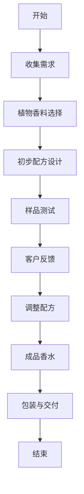

                 


### 文章标题：现代植物香水定制服务：个人专属天然香氛的定制之旅

> 关键词：香水定制，植物香料，个性香氛，天然成分，定制流程，调香技巧

> 摘要：
本篇文章将深入探讨现代植物香水定制服务的概念与实践。我们将从历史背景出发，了解香水的起源与发展，接着深入解析植物香料的基本知识及其提取方法。本文将重点讨论个人专属天然香氛的定制过程，包括香氛偏好分析、香水配方设计及调香技巧。此外，还将详细介绍植物香水定制服务的实践环节，包括定制流程、市场营销策略，并提供实用的资源和工具。通过本篇文章，读者将全面了解现代植物香水定制服务的全貌，掌握定制个人专属天然香氛的方法。

----------------------------------------------------------------

### 第一部分：香水的科学与艺术

#### 第1章：香水的历史与基础

香水，作为一种将嗅觉与美感融合的奢侈品，其历史可以追溯到远古时代。在古代，人们就开始利用植物的香气来驱虫、疗愈或是作为宗教仪式的一部分。香水的历史，是一部跨越文化、跨越时代的香氛传奇。

##### 1.1 香水的历史

香水的发展历程与人类文明的发展紧密相连。在古代，香水主要用于宗教仪式和药用，比如古埃及人使用香水来祭祀神灵，古希腊和古罗马人则将其用作社交场合的点缀。中世纪的欧洲，香水变得更为流行，尤其是在贵族阶层中，香水不仅是身份的象征，更是地位的体现。

文艺复兴时期，随着科学和艺术的繁荣，香水的制作技艺得到了极大的提升。这一时期的香水以天然植物香料为主，制作工艺更加精细。而工业革命后，香水的生产开始实现工业化，香气种类和数量都得到了极大的丰富。

##### 1.2 香水的分类

香水根据不同的标准可以有不同的分类方法。以下是几种常见的分类方式：

- **按香型分类**：香水可以划分为东方香型、西方香型、花香型、果香型等。
- **按原料分类**：香水可以分为天然香料香水、合成香料香水以及天然与合成相结合的香水。
- **按使用场合分类**：香水可以划分为日常香水、晚宴香水、运动香水等。

##### 1.3 香水的制作过程

香水的制作是一个复杂的过程，涉及多种技术和工艺。以下是香水制作的基本步骤：

- **原料的选择**：选择适合制作香水的植物香料，这些香料可以是玫瑰、茉莉、薰衣草等。
- **香料的提取**：常用的提取方法有水蒸气蒸馏法、压榨法、萃取法等。
- **调香与混合**：调香师将不同的香料按照特定的比例混合，以创造出独特的香味。
- **成品的质量控制**：对成品进行质量和稳定性的检测，确保其符合标准。

#### 第2章：植物香料的提取与利用

植物香料是制作香水的重要原料，其提取方法和利用方式直接影响到香水的品质和特性。在本章中，我们将详细探讨植物香料的种类、提取方法及其在香水制作中的应用。

##### 2.1 植物香料的种类

植物香料种类繁多，以下是几种常见的植物香料：

- **玫瑰**：被誉为“花中之王”，其花香优雅，具有安抚情绪的作用。
- **茉莉**：被誉为“花中之冠”，其花香浓郁，是许多高级香水的原料。
- **薰衣草**：具有镇静和抗菌的功效，适用于各种类型的香水。
- **檀香**：具有温暖的香气，能够提升香水的质感。
- **橙花**：其花香清新，具有提神醒脑的作用。

##### 2.2 香料提取的方法

提取植物香料的方法多种多样，以下是几种常见的提取方法：

- **水蒸气蒸馏法**：通过水蒸气将植物中的香气成分蒸馏出来，是提取香料最常用的方法。
- **压榨法**：通过机械压力将植物中的精油挤出，适用于柑橘类植物。
- **萃取法**：利用有机溶剂将植物中的香气成分萃取出来，然后通过蒸馏去除溶剂，留下纯净的精油。
- **酶解法**：利用酶的作用将植物中的纤维素分解，从而提取出植物香料。

##### 2.3 植物香料的功效与应用

植物香料的功效因其成分和提取方法的不同而有所差异。以下是几种植物香料的常见功效和应用：

- **玫瑰**：具有安抚情绪、改善皮肤状况的功效，常用于制作女性香水。
- **茉莉**：具有镇静、舒缓情绪的功效，适用于各种类型的香水。
- **薰衣草**：具有镇静、抗菌、抗炎的功效，可用于治疗皮肤问题。
- **檀香**：具有提升香气质感、增强香水持久性的功效。
- **橙花**：具有提神醒脑、提振情绪的功效，适用于日常香水。

#### 第3章：个人专属天然香氛的定制

个人专属天然香氛的定制是现代香水行业的一个创新方向，它允许消费者根据自己的喜好和个性来定制独特的香水。这一章节将详细介绍个人香氛定制的过程，包括香氛偏好分析、香水配方设计及调香技巧。

##### 3.1 个人香氛偏好与个性分析

个人香氛偏好与个性分析是定制香水的重要一环。以下是几个关键点：

- **人的感官与香氛**：了解嗅觉的基本原理和香氛对情绪的影响，有助于更好地理解个人香氛偏好。
- **个人香氛偏好的形成**：个人的成长环境、文化背景、生活方式等都可能影响对香氛的喜好。
- **香氛与个性分析**：通过分析个人的性格类型、职业特点等，可以更准确地了解其对香氛的偏好。

##### 3.2 植物香水的配方设计

植物香水的配方设计是定制香水的重要步骤。以下是几个关键点：

- **植物香水的配方原则**：了解基础香调与辅香调的作用，以及香料的浓度与比例对香水的影响。
- **配方设计的方法**：包括经验法、科学计算法、感性创造法等，不同的方法适用于不同类型的香水设计。
- **成功的植物香水配方案例**：通过分析市场热销的植物香水配方，了解其成功的原因和设计原则。

##### 3.3 天然香氛的调香技巧

调香技巧是创造独特香水的关键。以下是几个关键点：

- **调香的基础知识**：了解调香师的职责与素养，熟悉调香的基本工具和香料的保存与使用。
- **香氛的比例调配**：掌握单一香料的调配技巧，以及复合香料的调配方法，确保香水的层次感和持久性。
- **香氛的融合技巧**：了解如何将不同香料融合在一起，创造出和谐的香气。

#### 第4章：植物香水的配方设计

植物香水的配方设计是定制过程的核心环节，它直接决定了最终香水的质量和个性。在这一章节中，我们将深入探讨植物香水的配方设计原则、设计方法以及成功配方的案例分享。

##### 4.1 植物香水的配方原则

植物香水的配方设计需要遵循一些基本原则，以确保香水的高品质和个性化：

- **基础香调与辅香调**：基础香调是香水的主体香味，辅香调则起到增强和调节香味的角色。常见的香调有花香、果香、木香等。
- **香料的浓度与比例**：香料的浓度和比例对香水的整体感觉至关重要。高浓度的香料会使香水更加浓郁，低浓度的香料则使香味更加轻盈。
- **香水的持久性与扩散性**：香水的持久性取决于香料的稳定性和香水的配方结构，扩散性则与香料的挥发性有关。

##### 4.2 配方设计的方法

植物香水的配方设计可以采用多种方法，每种方法都有其独特的优势和应用场景：

- **经验法**：依赖调香师的直觉和经验，通过试香和调整香料比例来设计香水。这种方法适用于调香师有丰富经验的情况。
- **科学计算法**：利用化学和数学知识，通过精确的公式和计算来设计香水。这种方法适用于对香水成分和效果有精确要求的情况。
- **感性创造法**：通过艺术创作的方式，将个人的情感和灵感融入香水配方设计中。这种方法适用于追求独特性和个性化的香水设计。

##### 4.3 成功的植物香水配方案例

以下是几个成功的植物香水配方案例，以及它们的设计原理和特点：

- **玫瑰香水**：以玫瑰为基础香调，辅以橙花和檀香，创造出优雅而持久的香气。设计原理是通过基础香调和辅香调的平衡，营造出和谐的氛围。
- **茉莉香水**：以茉莉为基础香调，辅以玫瑰和橙花，强调花香的整体效果。设计原理是利用不同香料的互补性，增强香水的层次感。
- **薰衣草香水**：以薰衣草为基础香调，辅以橙花和玫瑰，赋予香水清新的感觉。设计原理是通过清新香料的组合，创造出一个令人愉悦的香气体验。

#### 第5章：天然香氛的调香技巧

调香是创造个性化香水的重要环节，它需要调香师对香料的特性、比例和融合技巧有深刻的理解。在这一章节中，我们将详细探讨天然香氛的调香技巧，包括调香的基础知识、香氛的比例调配以及香氛的融合技巧。

##### 5.1 调香的基础知识

调香的基础知识是成为一名优秀调香师的前提。以下是几个关键点：

- **调香师的职责与素养**：调香师是香水创作过程中的核心人物，他们需要具备丰富的香料知识和调香经验，同时还要有良好的审美能力和创造性思维。
- **调香的基本工具**：调香师需要熟悉各种调香工具，包括香料瓶、调香棒、香氛样品瓶等。这些工具帮助调香师精确地测量和混合香料。
- **香料的保存与使用**：香料的保存方法对其质量和稳定性有很大影响。调香师需要了解如何正确保存香料，以及如何使用香料来创造最佳的香气效果。

##### 5.2 香氛的比例调配

香氛的比例调配是调香的关键步骤，它决定了香水的味道和效果。以下是几个关键点：

- **单一香料的调配**：调香师需要了解每种香料的特性，如何通过调整香料比例来创造出独特的香味。例如，高比例的玫瑰可以营造出浓郁的花香，而低比例的橙花可以增加香水的清新感。
- **复合香料的调配**：复合香料调配需要考虑多种香料的相互影响。调香师需要找到合适的比例，使每种香料都能发挥其最佳效果，同时保持整体香水的和谐。
- **香水的持久性与扩散性**：香水的持久性和扩散性是衡量其品质的重要指标。调香师需要通过调整香料比例来平衡香水的持久性和扩散性，创造出既持久又易于扩散的香气。

##### 5.3 香氛的融合技巧

香氛的融合技巧是调香的艺术，它涉及到不同香料之间的相互作用和和谐。以下是几个关键点：

- **同香调香料的融合**：将具有相似香调的香料融合在一起，可以增强香水的整体感。例如，将玫瑰和茉莉融合在一起，可以创造出更加浓郁的花香。
- **异香调香料的融合**：将不同香调的香料融合在一起，可以创造出更加丰富的香气层次。例如，将花香和木香融合在一起，可以创造出复杂的香气结构。
- **基香与辅香料的融合**：基香料和辅香料在香水中起着不同的作用。基香料通常负责香水的主体香味，而辅香料则负责增强或调节香味。调香师需要掌握如何平衡基香料和辅香料，创造出和谐的香水。

#### 第6章：植物香水定制服务的实践

植物香水定制服务是现代香水市场的一个创新方向，它为消费者提供了定制个人专属天然香氛的机会。在这一章节中，我们将详细探讨植物香水定制服务的流程、市场需求、市场定位以及成功的营销策略。

##### 6.1 植物香水定制服务的流程

植物香水定制服务的流程可以分为几个关键步骤：

- **客户沟通与需求收集**：与客户进行深入沟通，了解其个人香氛偏好、生活风格和个性特点，收集客户的具体需求。
- **香水配方设计**：根据客户的需求，设计出适合的香水配方。这一步骤包括选择适合的植物香料、确定香料比例和香味结构。
- **香水样品测试与反馈**：将初步设计的香水配方制作成样品，让客户进行试香，并根据客户的反馈进行调整。
- **香水的最终定稿**：根据客户反馈，对香水样品进行最终调整，确保客户满意。

##### 6.2 市场需求与市场定位

植物香水定制服务的市场需求主要集中在以下几个领域：

- **个性需求的满足**：现代人越来越注重个性化和独特性，植物香水定制服务正好满足了这一需求。
- **健康意识的提升**：随着人们对健康和自然成分的关注，天然植物香水的需求逐渐增加。
- **社交与礼仪**：在社交场合，独特的个人香氛可以增加个人的魅力和自信，成为礼仪的一部分。

市场定位是植物香水定制服务成功的关键。以下是几个关键点：

- **高端定位**：植物香水定制服务通常定位于高端市场，以提供高质量、个性化的产品和服务。
- **品牌形象**：建立独特的品牌形象，强调天然植物香料、个性化定制和高端服务质量。
- **市场细分**：根据不同的市场需求，对目标客户进行细分，提供针对性的产品和服务。

##### 6.3 市场营销策略

成功的市场营销策略是植物香水定制服务成功的关键。以下是几个关键点：

- **品牌建设**：通过品牌故事、品牌形象设计和品牌宣传，提高品牌知名度和美誉度。
- **销售渠道**：建立线上和线下的销售渠道，包括官方网站、电商平台、精品店等。
- **营销活动**：举办新品发布会、香氛体验活动、个性化定制活动等，吸引潜在客户，增加销售机会。
- **客户关系管理**：建立完善的客户关系管理系统，通过定期回访、客户关怀和个性化服务，提高客户满意度和忠诚度。

#### 第7章：植物香水定制服务的市场营销

植物香水定制服务的市场营销策略需要充分考虑目标客户的需求和喜好，以及市场环境的变化。在这一章节中，我们将详细探讨市场定位、品牌建设、销售策略以及客户关系管理，为植物香水定制服务提供有效的市场营销方案。

##### 7.1 市场定位

市场定位是植物香水定制服务成功的第一步，它需要明确目标客户群体和产品特色。以下是几个关键点：

- **明确目标客户**：目标客户可以是追求个性化、注重生活品质的年轻消费者，也可以是寻求独特香氛体验的商务人士。
- **产品特色**：植物香水定制服务的产品特色在于天然成分、个性化和独特性，这些特点可以吸引特定的目标客户群体。
- **市场细分**：根据客户的不同需求和偏好，对市场进行细分，提供针对性的产品和服务。

##### 7.2 品牌建设

品牌建设是提升植物香水定制服务竞争力的关键。以下是几个关键点：

- **品牌故事**：通过讲述品牌背后的故事，增加品牌的情感价值，吸引消费者的关注和认同。
- **品牌形象**：设计独特而具有辨识度的品牌形象，包括标志、包装、店铺设计等，提高品牌的视觉吸引力。
- **品牌宣传**：通过多种渠道进行品牌宣传，包括社交媒体、广告、活动等，提高品牌知名度和美誉度。

##### 7.3 销售策略

有效的销售策略是植物香水定制服务成功的关键。以下是几个关键点：

- **线上销售**：建立官方网站和电商平台，提供在线定制服务，方便客户下单和支付。
- **线下销售**：开设精品店和体验店，提供现场定制和体验服务，增强客户的购买欲望。
- **渠道合作**：与精品店、百货商场、香水专卖店等渠道合作，扩大销售网络，提高产品曝光度。
- **促销活动**：定期举办促销活动，如限时折扣、节日礼包等，吸引客户购买。

##### 7.4 客户关系管理

客户关系管理是提高客户满意度和忠诚度的关键。以下是几个关键点：

- **客户沟通**：通过定期回访和沟通，了解客户的反馈和需求，提供个性化的服务和建议。
- **客户关怀**：在客户生日、节日等特殊时刻，发送祝福和礼品，表达对客户的关怀和感谢。
- **个性化服务**：根据客户的历史订单和偏好，提供个性化的产品推荐和服务。
- **客户反馈**：建立反馈机制，及时收集和处理客户的意见和投诉，不断提高服务质量。

#### 附录A：植物香水定制服务的资源与工具

在植物香水定制服务的实践中，掌握相关的资源与工具是非常重要的。以下是一些常用的资源与工具：

- **提取设备与材料**：包括蒸馏器、压榨机、萃取设备等，以及用于提取香料的植物原料。
- **香水配方软件**：如Excel、R等，用于计算和调整香料比例，优化香水配方。
- **调香技巧参考书**：如《香水配方设计大全》、《调香师手册》等，提供调香的基础知识和实践技巧。

通过以上资源与工具的合理使用，可以大大提高植物香水定制服务的效率和品质。

#### 附录B：常见问题与解答

在植物香水定制服务的过程中，客户可能会遇到各种问题。以下是一些常见问题及其解答：

- **问题1：为什么我的定制香水味道不同于预期？**
  **解答1**：可能的原因包括香料比例不准确、提取方法不当或者香料的保存不当。可以重新检查香料比例和提取方法，确保香料的保存环境符合要求。

- **问题2：定制香水是否可以使用任何植物香料？**
  **解答2**：不是所有植物香料都适合用于香水制作。某些香料可能过于刺激或不易提取，需要选择适合的植物香料来确保香水的质量和稳定性。

- **问题3：如何确保定制香水的质量和安全性？**
  **解答3**：选择有信誉的供应商，确保香料的纯度和质量。在香水制作过程中，遵循严格的质量控制和检测标准，确保香水的安全性和稳定性。

通过以上常见问题的解答，可以帮助客户更好地了解和信任植物香水定制服务。

#### 附录C：拓展阅读

为了深入了解植物香水定制服务的相关理论和实践，以下是一些推荐阅读的书籍和文章：

- **书籍**：《香水配方设计大全》、《调香师手册》、《天然香料的应用与提取》等。
- **文章**：相关学术期刊和行业杂志中的研究论文，如《现代香料工业》、《天然植物提取与应用》等。

通过阅读这些拓展材料，读者可以进一步加深对植物香水定制服务的理解和实践。

#### 附录D：术语解释

在植物香水定制服务中，一些专业术语和概念需要解释清楚，以便读者更好地理解文章内容。以下是一些重要术语的解释：

- **水蒸气蒸馏法**：通过水蒸气将植物中的香气成分蒸馏出来，是一种常用的香料提取方法。
- **压榨法**：通过机械压力将植物中的精油挤出，适用于柑橘类植物。
- **萃取法**：利用有机溶剂将植物中的香气成分萃取出来，然后通过蒸馏去除溶剂，留下纯净的精油。
- **基础香调**：香水的主体香味，如花香、果香、木香等。
- **辅香调**：辅助基础香调，增强和调节香味的香料。
- **调香师**：负责香水配方设计和制作的专家。

通过这些术语的解释，可以帮助读者更好地理解植物香水定制服务的技术细节。

---

### 调香流程Mermaid图示



### 植物香水定制算法伪代码

```python
# 定义植物香料集合
scents = ["玫瑰", "茉莉", "薰衣草", "檀香", "橙花"]

# 初始化香水配方
recipe = {}

# 收集客户需求
preferences = get_preferences()

# 根据需求选择合适的植物香料
selected_scents = select_scents(preferences, scents)

# 设计初步的香水配方
recipe = design_recipe(selected_scents)

# 进行样品测试
sample = create_sample(recipe)

# 根据客户反馈调整配方
recipe = adjust_recipe(sample, preferences)

# 制作成品香水
final_scent = create_final_scent(recipe)

# 包装与交付
package_and_deliver(final_scent)

# 辅助函数定义
def get_preferences():
    # 实现客户需求收集逻辑
    pass

def select_scents(preferences, scents):
    # 实现选择香料逻辑
    pass

def design_recipe(selected_scents):
    # 实现配方设计逻辑
    pass

def create_sample(recipe):
    # 实现样品制作逻辑
    pass

def adjust_recipe(sample, preferences):
    # 实现配方调整逻辑
    pass

def create_final_scent(recipe):
    # 实现成品香水制作逻辑
    pass

def package_and_deliver(final_scent):
    # 实现包装与交付逻辑
    pass
```

### 香水调配的LaTeX公式

$$
\text{浓度比例} = \frac{\text{某种香料的用量}}{\sum_{i=1}^{n} \text{所有香料的用量}}
$$

$$
\text{扩散性} = \frac{\text{某种香料的蒸发速率}}{\sum_{i=1}^{n} \text{所有香料的蒸发速率}}
$$

### 案例分析：客户John的定制香水

**背景**：John是一位年轻的企业家，他热爱户外活动，喜欢清新自然的味道。他希望在日常生活中使用一款既符合自己个性，又能让人感觉舒适愉悦的香水。

**定制过程**：

1. **需求收集**：通过与调香师的沟通，John表达了他对清新、自然味道的偏好，以及希望香水能够让人感觉轻松愉悦的需求。
2. **植物香料选择**：调香师根据John的偏好，选择了薰衣草、橙花和玫瑰这三种植物香料。
3. **初步配方设计**：调香师设计了以下初步配方：

$$
\text{玫瑰} = 20\%, \text{橙花} = 30\%, \text{薰衣草} = 50\%
$$

4. **样品测试**：制作了初步的香水样品，John进行试香，并给出了反馈，认为香水的味道过于浓郁，需要减少橙花的比例。
5. **调整配方**：根据John的反馈，调香师调整了香水的配方：

$$
\text{玫瑰} = 25\%, \text{橙花} = 20\%, \text{薰衣草} = 55\%
$$

6. **成品香水**：最终定稿的香水具有清新的玫瑰和薰衣草香味，橙花的使用量减少，使得整体香气更加轻盈。

**结果**：John对最终定稿的香水非常满意，他不仅在日常生活中使用，还在商务场合中感受到了自信和魅力。

### 最佳实践 tips

1. **了解客户需求**：与客户进行充分的沟通，了解他们的个性、偏好和需求，是成功定制香水的前提。
2. **香料选择多样化**：根据客户的需求，选择多种不同的植物香料，创造出丰富的香气层次。
3. **样品测试**：制作香水样品，进行多次试香和调整，是确保最终香水质量的关键。
4. **保持香料新鲜**：确保香料的纯度和新鲜度，使用优质的香料，可以提高香水的品质。
5. **个性化服务**：提供定制化服务，让客户感受到独特的体验和价值，有助于提高客户满意度和忠诚度。

### 小结

通过本文的探讨，我们了解了现代植物香水定制服务的基本概念和实践方法。从历史背景、香料提取、个性分析到配方设计和调香技巧，再到定制服务的实践和市场定位，每一步都至关重要。植物香水定制服务不仅满足了现代人追求个性化和健康生活的需求，也为调香师提供了广阔的创作空间。通过不断学习和实践，我们相信，未来的植物香水定制服务将会更加完善，为更多人带来独特的香氛体验。

### 注意事项

1. **香料保存**：香料的保存对香水的质量至关重要。应将香料存放在干燥、避光的环境中，避免高温和潮湿。
2. **香料来源**：选择高质量的香料供应商，确保香料的纯度和新鲜度。
3. **安全使用**：在使用香水时，应避免直接接触皮肤，以防过敏反应。
4. **定制服务**：在提供定制服务时，确保充分沟通和理解客户的需求，提供个性化的解决方案。

### 拓展阅读

1. **《香水配方设计大全》**：详细介绍了香水的配方设计原理和技巧。
2. **《调香师手册》**：涵盖了调香的基础知识和实践经验。
3. **《天然香料的应用与提取》**：探讨了天然香料在香水制作中的应用和提取方法。

### 作者信息

**作者：AI天才研究院/AI Genius Institute & 禅与计算机程序设计艺术 /Zen And The Art of Computer Programming**

感谢读者对本文的关注和支持，希望本文能为您在植物香水定制服务领域提供有益的参考。希望您能继续关注我们的其他文章，一起探索科技与生活的美妙结合。

