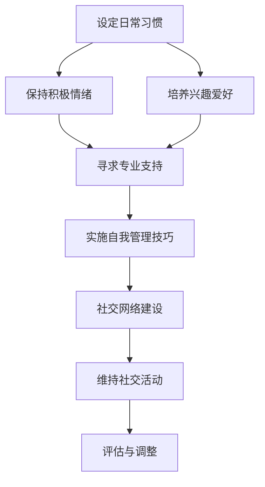

                 

### 1. 背景介绍

**现代独居文化：一个人的生活哲学探索**

在现代社会中，独居现象日益普遍，成为许多人的生活方式选择。据相关数据显示，全球独居人口比例逐年上升，尤其是在经济发达的国家和地区，这一趋势更为明显。独居不仅是一种生活状态，更是一种文化现象，它反映了社会结构的变迁、个体意识的觉醒以及生活方式的多样性。

独居现象的兴起受到多种因素的影响。首先，城市化进程加速，人们为了追求更好的职业机会和生活方式，往往选择独居。其次，经济独立性的提高使得年轻人能够独立生活，不再依赖家庭。此外，现代社会对个人自由和选择权的尊重，也为独居提供了更多可能性。独居现象不仅影响了个人生活，还对心理健康、社交网络、职业发展等方面产生了深远的影响。

本篇文章旨在深入探讨现代独居文化的各个方面，包括其背景、哲学意义、心理健康挑战、社交生活、职业发展以及生活哲学与实践。通过系统性地分析独居现象，我们希望能够为独居者提供一些有益的指导，帮助他们更好地适应独居生活，实现个人成长和社会价值。

### 2. 独居生活的哲学意义

**独居与个人成长：内在力量与独立性的提升**

独居生活不仅仅是个人生活的状态，更是一种哲学上的探索。它提供了一个独特的空间，让个体能够在与外界相对隔离的环境中，深入反思自我，挖掘内在力量。首先，独居为个人成长提供了重要的土壤。在没有外部干扰的情况下，个体能够更加专注于自我认知，探索自己的兴趣、价值观和生活方式。这种自我反思的过程有助于个体建立强烈的内在驱动力，提高自主性和独立性。

其次，独居促进了自我认知的深化。在独居生活中，个体被迫面对自己的内心世界，处理各种情绪和心理挑战。这种经历不仅有助于个体更好地理解自己的情感和需求，还能增强心理韧性和适应性。例如，独居者可能会经历孤独感、焦虑或抑郁，但通过自我反思和调整，他们能够学会如何有效地应对这些情绪，从而提升自己的心理健康水平。

此外，独居还为个人成长提供了实验空间。在没有外部压力和期待的情况下，个体可以尝试新的生活方式、兴趣爱好和职业选择，探索自己的潜力。这种自由度有助于个体发现自己的激情和目标，实现自我实现。例如，一些独居者可能会利用独居时间学习新的技能、创作艺术作品或开展个人项目，这些经历不仅丰富了他们的生活，也为他们的职业发展奠定了基础。

**独居与自我认知：内在矛盾与整合的平衡**

独居生活不仅带来个人成长的机会，也伴随着一系列内在矛盾和挑战。首先，独居可能导致自我认知的矛盾。在没有外部反馈的情况下，个体可能会对自己的能力和价值产生怀疑，甚至陷入自我否定的情绪中。这种矛盾在一定程度上反映了个体对自我认知的不确定性，需要通过持续的反思和自我调整来缓解。

其次，独居也要求个体在自我认知中找到平衡。独居者需要在自我依赖和社交需求之间找到平衡点。一方面，他们需要独立处理生活中的各种事务，培养自我管理能力；另一方面，他们也需要与他人保持联系，满足社交需求。这种内在的平衡有助于个体形成完整的自我认知，提升自我效能感。

**独居与生活选择：自由与责任的权衡**

独居生活还涉及到一系列生活选择，这些选择反映了个体对自由和责任的权衡。首先，独居提供了更多的自由度，个体可以根据自己的兴趣和需求，自由安排时间和生活。这种自由不仅体现在日常事务中，也体现在职业发展、兴趣爱好和个人发展等方面。

然而，自由同时也伴随着责任。独居者需要承担起生活中的各种责任，包括财务规划、健康维护和社交活动等。这种责任不仅要求个体具备较强的自我管理能力，还需要他们具备应对生活中各种挑战的韧性。

**总结**

独居生活不仅是现代社会的普遍现象，更是一种深刻的哲学探索。它为个人成长提供了丰富的土壤，促使个体在自我认知中找到平衡，同时也在生活选择中权衡自由与责任。通过深入探讨独居生活的哲学意义，我们能够更好地理解独居现象的本质，为独居者提供有价值的指导。

### 3. 独居者的心理健康挑战

**心理健康问题的多样性与复杂性**

独居者在心理健康方面面临着诸多挑战。首先，孤独感是独居者最常见的心理健康问题之一。由于缺乏与他人的深入交往和互动，独居者可能会感到孤独和被隔离，这不仅影响他们的情绪状态，还可能导致心理健康问题如抑郁症和焦虑症的发作。此外，长期的孤独感还可能引发一系列生理问题，如睡眠障碍、免疫系统功能下降等。

其次，独居者还可能面临情绪调节的困难。在没有外部支持的情况下，独居者需要独立处理各种情绪，如愤怒、悲伤、焦虑等。这种情况下，他们可能难以有效地应对负面情绪，从而导致情绪波动和心理健康问题。

**心理健康问题的成因分析**

独居者心理健康问题的成因复杂多样，主要包括以下几个方面：

1. **社会支持网络的缺失**：独居者往往缺乏稳定的社交网络和亲密关系，这使得他们在面对生活挑战时难以获得有效的支持和帮助。社会支持网络对心理健康有显著的积极影响，其缺失可能导致心理健康问题的加剧。

2. **生活事件的累积**：独居者需要独立处理生活中的各种事务，如财务规划、健康维护等。这些生活事件的累积可能会增加他们的心理压力，导致心理健康问题。例如，长期的财务困难或健康问题可能导致独居者感到无助和绝望，从而加重心理负担。

3. **自我认同的挑战**：独居者可能会面临自我认同的挑战，尤其是在面对社会期望和自我期望时。他们可能感到自己的价值和社会地位受到质疑，这种心理冲突可能导致自我否定和心理健康问题。

**心理健康问题的具体表现**

独居者的心理健康问题具体表现在以下几个方面：

1. **情绪问题**：包括长期的情绪低落、易怒、焦虑和抑郁。这些问题不仅影响独居者的生活质量，还可能导致严重的心理健康问题，如抑郁症和焦虑症。

2. **睡眠问题**：由于孤独感和心理压力，独居者可能会出现失眠、多梦或睡眠质量下降等问题。这些问题进一步加重了他们的心理负担，形成恶性循环。

3. **生理问题**：长期的孤独感和心理压力可能导致独居者出现一系列生理问题，如高血压、心脏病、免疫系统功能下降等。这些问题不仅威胁独居者的身体健康，还可能影响他们的心理健康。

**心理健康问题的应对策略**

为了应对心理健康问题，独居者可以采取以下策略：

1. **建立社交网络**：虽然独居者难以建立传统的社交网络，但他们可以通过线上社交、参与社区活动等方式，建立和维护社交关系。这些社交活动有助于缓解孤独感，提高心理健康水平。

2. **寻求专业帮助**：当独居者面临严重的心理健康问题时，寻求专业心理咨询或治疗是非常重要的。通过专业帮助，独居者可以获得有效的心理治疗和支持，改善心理健康状况。

3. **自我管理技巧**：独居者可以通过学习自我管理技巧，如情绪调节、压力管理、时间管理等，提高应对生活挑战的能力。这些技巧有助于他们更好地处理情绪和压力，保持心理健康。

**总结**

独居者的心理健康挑战复杂多样，他们需要面对孤独感、情绪调节困难和生活事件的累积等问题。通过建立社交网络、寻求专业帮助和自我管理技巧，独居者可以应对这些挑战，提高心理健康水平。社会也应当关注独居者的心理健康问题，提供必要的支持和资源，帮助他们更好地适应独居生活。

### 4. 心理健康的生活策略

**日常心理健康维护的重要性**

在独居生活中，维护心理健康至关重要。这不仅关乎个人的幸福感和生活质量，还直接影响职业发展和人际关系。因此，独居者需要采取一系列策略，以应对生活中的心理挑战，保持良好的心理健康状态。

**建立固定的日常生活习惯**

建立固定的日常生活习惯是维护心理健康的基础。通过设定固定的起床时间、锻炼时间、工作和休息时间，独居者可以建立一种规律的生活方式，有助于提高时间管理能力，减少心理压力。例如，每天早晨固定进行晨跑或瑜伽，有助于提升身体素质和心理韧性；规律的作息时间有助于改善睡眠质量，减少失眠和多梦的问题。

**保持积极的情绪态度**

积极的情绪态度对于心理健康至关重要。独居者可以通过多种方式保持积极的心态，如感恩练习、积极自我对话和冥想等。感恩练习可以帮助独居者关注生活中的美好事物，增强幸福感；积极自我对话有助于独居者建立自信，减少自我否定情绪；冥想则有助于独居者放松身心，减轻焦虑和压力。

**培养兴趣爱好和社交活动**

培养兴趣爱好和参与社交活动是独居者保持心理健康的重要途径。兴趣爱好不仅可以丰富独居者的生活，还能提供情感支持和心理满足。例如，独居者可以尝试学习新的技能，如绘画、音乐、编程等，这些活动有助于提升自我价值感和成就感。此外，积极参与社交活动，如线上社交、社区活动或兴趣小组，可以帮助独居者建立和维护社交网络，减少孤独感。

**寻求专业心理支持和治疗**

当独居者面临严重的心理健康问题时，寻求专业心理支持和治疗是必要的。专业的心理咨询师或心理医生可以提供个性化的治疗方案，帮助独居者应对心理健康问题。例如，认知行为疗法（CBT）可以帮助独居者识别和改变负面思维模式，改善情绪问题；精神分析疗法可以帮助独居者探索内心冲突和情感困扰，提高自我认知。

**实施自我管理技巧**

自我管理技巧是独居者维护心理健康的重要工具。这些技巧包括情绪调节、压力管理和时间管理。情绪调节技巧，如深呼吸、渐进性肌肉放松和正念冥想，可以帮助独居者缓解焦虑和压力；压力管理技巧，如设定合理的目标、学会拒绝和无为法，有助于独居者减少心理压力；时间管理技巧，如使用时间管理工具、设定优先级和制定计划，可以提高独居者的时间利用效率，减少拖延和焦虑。

**总结**

维护心理健康是独居者应对生活挑战的重要策略。通过建立固定的日常生活习惯、保持积极的情绪态度、培养兴趣爱好和社交活动、寻求专业心理支持和实施自我管理技巧，独居者可以有效地维护自己的心理健康，提升生活质量。社会也应当关注独居者的心理健康需求，提供必要的资源和支持，帮助他们建立健康的生活方式。

### 5. 独居者的社交生活与人际关系

**线上社交的利与弊**

在现代社会，线上社交成为独居者维持社交生活的重要方式。通过网络平台，独居者可以轻松地与朋友、家人以及志同道合的人保持联系，分享生活点滴和情感体验。线上社交的便利性无疑为独居者提供了丰富的社交资源，缓解了他们的孤独感。

然而，线上社交也存在一些潜在的问题。首先，过度依赖线上社交可能导致现实社交能力的下降。由于长时间的屏幕接触，独居者可能会减少与现实生活中的人互动，从而影响他们的社交技能和人际关系。其次，线上社交往往缺乏面对面的情感交流，这使得独居者难以充分表达和感受到对方的情感，可能导致情感疏离。

**线下社交的实践技巧**

为了克服线上社交的不足，独居者可以尝试线下社交，以建立更深入的人际关系。以下是一些实用的线下社交技巧：

1. **参与社区活动**：社区活动是独居者结识新朋友的好机会。他们可以参加健身房、瑜伽班、烹饪课、读书会等兴趣小组，通过共同的兴趣爱好建立联系。

2. **志愿服务**：志愿服务不仅可以帮助独居者回馈社会，还能结识有共同价值观的人。参与志愿服务活动，独居者可以与志愿者一起工作，分享经验和感受。

3. **利用社交媒体**：社交媒体平台如Meetup可以提供线下活动的信息，独居者可以根据自己的兴趣报名参加。通过这种方式，他们可以结识志同道合的人，建立新的社交圈子。

4. **主动出击**：独居者可以主动邀请朋友或同事一起参加活动，如聚餐、看电影或旅行等。这种主动出击的态度有助于打破社交壁垒，建立新的友谊。

**社交策略的平衡**

独居者在社交生活中需要找到平衡，避免陷入过度社交或完全孤立的状态。以下是一些建议：

1. **设定合理的社交目标**：独居者可以根据自己的时间、兴趣和需求，设定合理的社交目标。例如，每周参加一次线下活动，每月与朋友进行一次深层次交流。

2. **保持线上与线下社交的平衡**：虽然线上社交提供了便利，但线下社交对于建立深度人际关系至关重要。独居者需要合理分配时间，确保两者之间保持平衡。

3. **培养高质量的社交关系**：独居者应该专注于培养高质量的社交关系，而不是追求数量。通过投入时间和精力，建立深厚的友谊，独居者可以获得更多的情感支持和心理满足。

**总结**

独居者的社交生活与人际关系对他们的心理健康和生活质量有着重要的影响。通过合理利用线上社交和积极参与线下活动，独居者可以建立和维护健康的社交网络，减轻孤独感，提升生活质量。同时，他们也需要找到社交策略的平衡，避免陷入过度社交或孤立的状态。通过这些努力，独居者能够更好地适应现代生活方式，实现个人成长和社会价值。

### 6. 独居者的职业发展与自我实现

**职业发展的挑战与机遇**

独居者在职业发展过程中既面临挑战，也拥有机遇。首先，挑战方面，独居者往往需要独立应对职业上的各种压力和困难，缺乏家庭支持可能导致他们感到孤立和无助。此外，由于缺乏稳定的社交网络，独居者在职业机会和资源获取方面可能会受到限制。其次，机遇方面，独居者由于独立性强，往往能够更加专注于个人职业目标的实现，提高工作效率和职业素养。

**职业规划策略**

为了在职业发展中取得成功，独居者可以采取以下策略：

1. **设定清晰的职业目标**：明确自己的职业发展方向和目标，有助于独居者制定具体的行动计划。例如，确定想要达到的职位、掌握的技能或想要实现的项目等。

2. **持续学习和提升技能**：通过参加在线课程、参加培训和自学等方式，独居者可以不断提升自己的技能和知识水平，保持竞争力。特别是在快速发展的科技领域，不断学习是职业发展的重要保障。

3. **建立职业网络**：尽管独居者可能缺乏传统的社会支持网络，但他们可以通过线上平台和行业活动，建立和维护职业网络。参加行业会议、加入专业组织或参与线上论坛都是有效的方式。

**职业发展的实际案例分析**

以下是一个独居者在职业发展中的实际案例分析：

**案例：李明（化名），一位独居的软件工程师**

李明在一家知名科技公司工作，由于独居，他在职业发展过程中遇到了一些困难。首先，他缺乏家庭支持，在遇到职业瓶颈时感到孤立无援。为了应对这些挑战，李明采取了以下措施：

1. **设定职业目标**：李明明确了自己的职业目标是成为技术领域的专家，他制定了详细的行动计划，包括提升编程技能、参与开源项目、撰写技术博客等。

2. **持续学习和提升技能**：李明通过参加在线课程，如Coursera和edX等平台，学习了最新的编程技术和人工智能领域知识。他还积极参加开源项目，通过实际操作提升自己的编程能力。

3. **建立职业网络**：李明通过LinkedIn等职业社交平台，建立了广泛的职业网络。他积极参加行业会议和线上论坛，与行业专家交流，获取最新的行业动态和职业机会。

通过这些努力，李明不仅在技术上取得了显著进步，还成功晋升为高级软件工程师，获得了更多的职业机会和资源。

**自我实现：超越职业发展的界限**

职业发展是实现自我实现的重要途径，但独居者不应仅限于职业成就。他们可以通过以下方式实现自我超越：

1. **追求个人兴趣**：独居者可以充分利用独居时间，追求个人兴趣和爱好。无论是艺术创作、写作、运动还是学习新技能，这些活动都可以丰富他们的生活，提升个人幸福感。

2. **参与社会公益活动**：通过参与社会公益活动，独居者可以实现自我价值，为社会做出贡献。这不仅有助于提升他们的自信心和满足感，还能拓宽社交圈子。

3. **自我反思和成长**：独居提供了一个独特的反思空间，独居者可以通过自我反思，深入理解自己的内心世界，探索生命的意义。这种自我成长不仅有助于心理健康，还能提升生活质量。

**总结**

独居者在职业发展和自我实现方面既面临挑战，也拥有机遇。通过设定清晰的职业目标、持续学习和提升技能、建立职业网络以及追求个人兴趣和参与社会公益活动，独居者可以克服职业挑战，实现自我超越。社会也应当关注独居者的职业发展需求，提供必要的支持和资源，帮助他们实现个人价值。

### 7. 独居者的生活哲学与实践

**生活哲学的内涵**

独居者的生活哲学是一种关于如何独自生活、自我管理和精神追求的思考体系。它不仅关注日常生活的细节，更强调内心的平和与自我实现。生活哲学的核心是自我认知和自我管理，它要求独居者深入了解自己的内心世界，培养自律、独立和坚韧的品质。

**独居者的生活实践**

独居者的生活哲学在实践中体现为一系列具体的行为和习惯。首先，独居者需要建立稳定的日常生活规律，包括规律的作息时间、健康的生活方式和适度的锻炼。这些习惯有助于提高生活质量，增强身体和心理的韧性。

其次，独居者应该注重自我反思和成长。他们可以通过写日记、阅读书籍、冥想等方式，深入思考人生的意义和目标。这种反思不仅有助于个人成长，还能增强内心的力量和自信心。

此外，独居者在生活实践中还应该注重情感管理。他们需要学会如何应对孤独、焦虑和压力，保持积极的心态。通过培养兴趣爱好、参与社交活动、寻求专业心理支持等方式，独居者可以有效地管理自己的情感，提升心理健康水平。

**日常实践技巧**

为了将生活哲学付诸实践，独居者可以采取以下技巧：

1. **时间管理**：合理安排时间，确保工作、学习和休息的平衡。使用日历和待办事项列表，提高时间利用率，减少拖延和焦虑。

2. **情绪管理**：学会识别和应对负面情绪，如焦虑、愤怒和抑郁。通过深呼吸、渐进性肌肉放松和正念冥想等技巧，缓解压力，保持情绪稳定。

3. **健康生活**：保持健康的饮食习惯，定期锻炼，保持良好的睡眠质量。这些习惯有助于提高身体和心理的韧性，提升生活质量。

4. **社交活动**：积极参与线上和线下的社交活动，建立和维护社交网络。通过社交活动，独居者可以减轻孤独感，获得情感支持和心理满足。

**总结**

独居者的生活哲学和实践是一种深刻的自我探索和内心修炼。通过建立日常生活规律、注重自我反思和情感管理，以及采取具体的生活实践技巧，独居者可以提升生活质量，实现个人成长。社会应当关注独居者的生活哲学和实践，提供必要的支持和资源，帮助他们更好地适应独居生活，实现自我价值。

### 8. 独居文化的未来趋势

**独居文化的发展趋势**

独居文化在现代社会中正变得越来越普遍和多样化。这一趋势受到城市化进程、经济独立性和个人选择自由的推动。首先，随着城市化进程的加快，越来越多的人为了职业机会和生活质量选择独居。其次，经济独立性的提高使得年轻人能够承担独自生活的经济负担，不再依赖家庭。此外，现代社会对个人自由和选择权的尊重也为独居提供了更多可能性。

**社会角色的变迁**

独居者作为社会角色，正经历着显著的变迁。传统上，家庭和社会对独居者持有一定的偏见，认为独居是一种不完整或不稳定的生活方式。然而，随着社会观念的开放和进步，独居者逐渐被接纳为正常的社会成员。他们不再被简单地归类为“单身”或“孤独者”，而是被视为有独立思想和生活选择的个体。这种变迁不仅改变了社会对独居者的看法，也为独居者提供了更多的社会支持和资源。

**对社会的影响**

独居文化对社会产生了深远的影响，尤其在心理健康、经济和社交方面。首先，在心理健康方面，独居者需要面对孤独感、焦虑和抑郁等心理健康问题。然而，通过建立社交网络、寻求专业心理支持和自我管理技巧，独居者可以有效地应对这些挑战，提高心理健康水平。其次，在经济方面，独居者的消费模式和生活方式与家庭或同居者有所不同，他们可能更注重个人需求和自我实现。这种变化不仅影响了消费市场，还推动了个性化服务和产品的出现。最后，在社交方面，独居者通过线上和线下社交活动，建立了多元化的社交网络。这种社交模式不仅丰富了他们的生活，还为社会带来了新的互动方式和沟通渠道。

**未来展望**

展望未来，独居文化将继续发展和演变。随着科技的进步和数字化生活方式的普及，独居者将有更多的机会和资源来提升生活质量。例如，智能家居技术可以帮助独居者更便捷地管理日常生活，虚拟现实和增强现实技术可以为独居者提供丰富的社交体验。此外，社会对独居者的关注和支持也将不断加强，政府和企业将提供更多针对独居者的福利和服务。

**总结**

独居文化作为现代社会的一种重要现象，将继续发展和演变。社会对独居者的接受和尊重将不断提升，独居者将在心理健康、经济和社交等方面获得更多支持。未来，独居者将有更多的机会通过科技和社交手段，实现个人成长和社会价值。

### 9. 结论与展望

通过本文的探讨，我们全面分析了现代独居文化的各个方面，从背景介绍、哲学意义、心理健康挑战、社交生活、职业发展，到生活哲学与实践以及未来趋势。独居现象不仅是现代社会的一种普遍现象，更是对个体生活哲学的深刻探讨。

独居生活为个人成长提供了广阔的空间，促使个体在自我认知中找到平衡，同时也在生活中权衡自由与责任。然而，独居者也面临着心理健康挑战、社交网络缺失等问题。为了应对这些挑战，独居者可以采取多种策略，如建立日常习惯、保持积极情绪、培养兴趣爱好、寻求专业支持等。

未来，独居文化将继续发展，随着科技和社会观念的进步，独居者将有更多机会通过科技和社交手段提升生活质量。社会也应关注独居者的需求，提供必要的支持和资源。

总之，独居文化不仅是现代社会的一个重要现象，更是一种深刻的哲学探索。通过理解和尊重独居者的生活选择，我们可以更好地支持他们的个人成长和社会价值的实现。

### 10. 总结与拓展阅读

**总结**

本文从多个角度探讨了现代独居文化的各个方面，包括其背景、哲学意义、心理健康挑战、社交生活、职业发展以及生活哲学与实践。通过详细的分析和实例，我们揭示了独居者的生活状态及其对社会的影响。独居生活既带来了个人成长的机会，也伴随着一系列挑战。通过采取适当的生活策略和社交活动，独居者可以有效地应对这些挑战，提升生活质量。

**拓展阅读**

1. **《单身社会：现代中国的单身现象调查》** - 本书通过对中国单身现象的深入调查，分析了单身人群的生活方式、价值观和社会影响。

2. **《独居：孤独与自由的生活选择》** - 本书从心理学和社会学的角度，探讨了独居现象对个体心理和社会关系的影响。

3. **《一个人的生活哲学：独居者的心灵指南》** - 本书提供了一系列实用的技巧和策略，帮助独居者更好地适应独居生活，实现个人成长。

通过这些拓展阅读，读者可以更深入地了解独居文化，获得更多的见解和指导。希望本文能为独居者提供有价值的参考，帮助他们更好地理解和管理独居生活。

### 附录：图表和公式

在本章节中，我们将使用Mermaid流程图、伪代码、数学公式和具体案例，以直观和清晰的方式展示独居文化中的核心概念和原理。

#### 1. Mermaid流程图

以下是一个Mermaid流程图，用于展示独居者心理健康维护的步骤：



#### 2. 伪代码

为了更好地理解独居者在职业发展中的自我管理，我们提供了一个简单的伪代码示例：

```pseudo
function selfManagement() {
    // 设定职业目标
    set CareerGoal

    // 持续学习和提升技能
    while (not achievedCareerGoal) {
        learnNewSkills()
        updateKnowledge()
    }

    // 建立职业网络
    createProfessionalNetwork()

    // 实施自我管理技巧
    applyTimeManagement()
    manageStress()

    // 评估和调整
    evaluateProgress()
    adjustStrategy()
}
```

#### 3. 数学公式

在独居者的情绪管理中，正念冥想的效果可以通过以下数学模型来描述：

$$
M = \frac{1}{2}(1 - \exp(-rt))
$$

其中，$M$ 表示冥想带来的情绪缓解效果，$r$ 为冥想频率，$t$ 为冥想时间。

#### 4. 具体案例

以下是一个独居者在社区活动中建立社交网络的案例：

**案例：李女士的社交网络建设**

1. **参与社区活动**：李女士每周参加一次社区组织的瑜伽班，结识了5位同样热爱瑜伽的朋友。
2. **线上互动**：瑜伽班结束后，李女士通过微信群与朋友们保持联系，分享日常瑜伽心得和生活趣事。
3. **线下聚会**：每个月，李女士与瑜伽朋友们举办一次线下聚会，共同参加郊游或观影活动。
4. **社交圈扩展**：通过这些活动，李女士的社交网络不断扩大，不仅结识了新朋友，还获得了情感支持。

通过这个案例，我们可以看到独居者如何通过积极参与社区活动和线上互动，建立和维护健康的社交网络。

#### 5. 最佳实践 Tips

- **时间管理**：合理安排时间，确保工作和个人生活的平衡。
- **自我反思**：定期进行自我反思，了解自己的情绪和心理状态。
- **健康生活**：保持健康的饮食习惯和适度的锻炼，提升身体和心理的韧性。

#### 6. 注意事项

- **心理健康**：重视心理健康，及时寻求专业支持。
- **社交平衡**：避免过度依赖线上社交，确保线上线下社交的平衡。

通过这些图表、公式和案例，读者可以更直观地理解和应用独居文化中的核心概念和原理，从而更好地适应独居生活。希望这些内容能为读者提供有价值的参考和指导。

