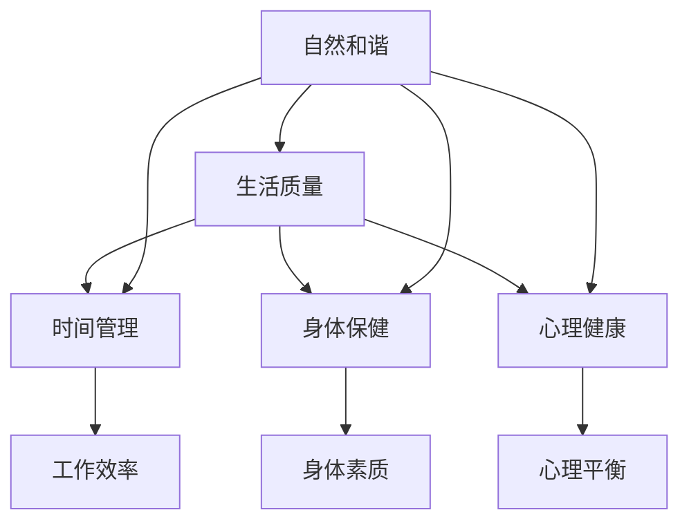
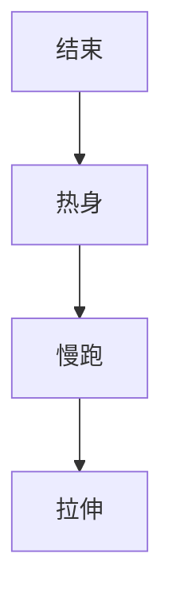
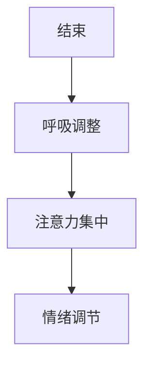
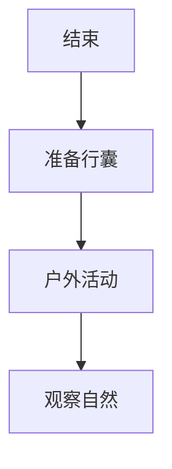

                 

### 文章关键词

- 慢生活运动
- 快节奏生活
- 生活哲学
- 身心健康
- 时间管理
- 自然和谐
- 生活质量提升

### 文章摘要

本文深入探讨了现代生活中的慢生活运动，分析了其起源、理论框架及其在现代生活中的重要性。文章首先介绍了慢生活运动的起源和背景，然后详细阐述了其核心概念及相互联系，包括生活质量、时间管理、身体保健、心理健康和自然和谐。通过Mermaid流程图和伪代码，文章展示了慢生活运动的理论基础和算法原理，并结合实际案例进行了详细解读。文章最后对慢生活运动进行了总结与展望，提出了实践慢生活运动的最佳实践建议，并给出了拓展阅读资源。

---

# 现代生活中的慢生活运动：对抗快节奏的生活哲学

慢生活运动（Slow Life Movement）作为一种哲学和生活方式，逐渐成为现代生活的一股潮流。它起源于意大利，旨在对抗现代社会快节奏的生活方式，强调在生活各个方面放慢节奏，追求更高的生活质量。本文将深入探讨慢生活运动的起源、核心概念、理论框架、实践案例及其对身体和心理健康的影响，并展望其未来的发展。

## 引言：慢生活运动的起源和现代生活的必要性

慢生活运动起源于20世纪80年代的意大利，由作家卡洛·皮诺（Carlo Petrini）首次提出。当时，皮诺关注到快速食物文化的兴起，并对“快餐化”的生活方式提出了质疑。他主张回归自然、享受食物的原始美味，并提出了“慢食运动”（Slow Food Movement）。这一理念逐渐演变成一场广泛的运动，呼吁人们从快节奏的生活中慢下来，享受生活本身。

在现代社会，快节奏的生活方式已经成为一种普遍现象。随着科技的进步和信息的爆炸，人们面临着巨大的工作压力和生活节奏。长时间的工作、过度的压力、不规律的生活习惯等，都对人们的身体和心理健康产生了负面影响。因此，慢生活运动成为了一种对抗现代快节奏生活的哲学和生活方式。

慢生活运动的核心理念是“慢工出细活”（“ slower pace for a better life ”），强调在生活各个方面放慢节奏，注重质量而非数量。慢生活运动不仅仅是一种生活态度，更是一种哲学，它鼓励人们重新审视自己的生活方式，寻找内心的平静和幸福。

### 核心概念与联系

慢生活运动涉及多个核心概念，包括生活质量、时间管理、身体保健、心理健康和自然和谐。这些概念之间存在着紧密的联系，共同构成了慢生活运动的理论框架。

1. **生活质量**：慢生活运动强调提高生活质量，追求更加健康、幸福的生活状态。生活质量不仅仅是指物质生活的富足，更重要的是精神层面的满足和幸福感。

2. **时间管理**：时间管理是慢生活运动的核心概念之一。通过合理安排时间，平衡工作与生活，人们可以减少不必要的压力和焦虑，提高生活质量。时间管理不仅仅是技术问题，更是一种生活态度。

3. **身体保健**：慢生活运动强调身体保健，通过适当的运动、饮食和休息，保持身体的健康和活力。身体保健不仅有助于预防疾病，还能提高生活质量。

4. **心理健康**：心理健康是慢生活运动的另一个重要方面。通过冥想、瑜伽、读书等方式调节情绪，保持心理平衡，人们可以更好地应对生活中的压力和挑战。

5. **自然和谐**：自然和谐是慢生活运动的基本理念，倡导与自然和谐相处，回归自然，减少对环境的破坏。自然和谐不仅是身体上的健康，更是精神上的富足。

下面是一个Mermaid流程图，展示了这些核心概念之间的联系：



通过这个流程图，我们可以清晰地看到，慢生活运动不仅仅是关于放慢生活节奏，而是一个全面的生活哲学，它涵盖了一个人的工作、生活、身体和心理健康，并与自然和谐共处。

### 慢生活运动的理论框架

慢生活运动的理论框架基于对现代生活节奏的批判和对生活质量的追求。这一理论框架主要包括以下几个方面：

1. **批判现代生活节奏**：慢生活运动认为，现代社会的生活节奏过快，人们被各种任务和责任所压迫，导致压力过大、焦虑增加。这一批判揭示了现代生活模式的弊端，为慢生活运动提供了理论依据。

2. **生活质量优先**：慢生活运动强调，生活质量应该放在首位，而非单纯追求物质财富和效率。这意味着，人们应该更加关注自己的身心健康，追求真正的幸福和满足。

3. **时间管理**：时间管理是慢生活运动的核心概念之一。通过合理安排时间，平衡工作与生活，人们可以减少不必要的压力和焦虑，提高生活质量。时间管理不仅仅是技术问题，更是一种生活态度。

4. **身体保健**：慢生活运动强调身体保健，通过适当的运动、饮食和休息，保持身体的健康和活力。身体保健不仅有助于预防疾病，还能提高生活质量。

5. **心理健康**：心理健康是慢生活运动的另一个重要方面。通过冥想、瑜伽、读书等方式调节情绪，保持心理平衡，人们可以更好地应对生活中的压力和挑战。

6. **自然和谐**：自然和谐是慢生活运动的基本理念，倡导与自然和谐相处，回归自然，减少对环境的破坏。自然和谐不仅是身体上的健康，更是精神上的富足。

下面是一个Mermaid流程图，展示了慢生活运动的理论框架：


通过这个流程图，我们可以清晰地看到，慢生活运动是一个全面的生活哲学，它涵盖了生活、工作、身体和心理健康，并与自然和谐共处。

### 慢生活运动在实践中的运用

慢生活运动不仅是一种理论，更是一种实践。在日常生活中，人们可以通过多种方式来实践慢生活运动，提高生活质量。以下是一些具体的实践案例：

#### 1. 慢跑

慢跑是一种简单的身体锻炼方式，它有助于提高身体素质，减少压力。通过每天慢跑30分钟，人们可以享受运动的乐趣，同时提高心肺功能。以下是一个简单的慢跑流程图：



#### 2. 冥想

冥想是一种调节情绪、保持心理平衡的有效方法。通过每天冥想10分钟，人们可以放松心情，减少焦虑。以下是一个简单的冥想流程图：



#### 3. 自然体验

与自然和谐相处是慢生活运动的核心之一。通过花时间在自然环境中，如公园、山林，人们可以放松身心，享受大自然的美好。以下是一个简单的自然体验流程图：



### 核心算法原理讲解

慢生活运动的理论框架中，核心算法原理涉及时间管理、身心健康、自然和谐等多个方面。以下使用伪代码详细阐述这些算法原理：

#### 时间管理算法

```python
def time_management():
    # 确定每日工作时间
    work_hours = 8
    
    # 确定每日休息时间
    rest_hours = 8
    
    # 确定每日锻炼时间
    exercise_hours = 0.5
    
    # 计算工作时间、休息时间和锻炼时间
    total_hours = work_hours + rest_hours + exercise_hours
    
    # 调整工作时间、休息时间和锻炼时间，使其符合个人需求
    if total_hours > 24:
        # 减少工作时间或休息时间
        work_hours -= 1
        rest_hours -= 1
    else:
        # 增加锻炼时间
        exercise_hours += 0.5
    
    # 输出时间安排
    print("每日时间安排：")
    print("工作时间：", work_hours, "小时")
    print("休息时间：", rest_hours, "小时")
    print("锻炼时间：", exercise_hours, "小时")
```

#### 身心健康算法

```python
def health_management():
    # 确定每日锻炼时间
    exercise_time = 30
    
    # 确定每周冥想时间
    meditation_time = 10
    
    # 计算每周锻炼总时间
    weekly_exercise_time = exercise_time * 7
    
    # 计算每周冥想总时间
    weekly_meditation_time = meditation_time * 7
    
    # 输出健康安排
    print("健康安排：")
    print("每周锻炼总时间：", weekly_exercise_time, "分钟")
    print("每周冥想总时间：", weekly_meditation_time, "分钟")
```

### 数学模型和数学公式讲解

在慢生活运动中，数学模型和公式可以用来量化生活质量、时间管理和身心健康。以下是一些常见的数学模型和公式：

#### 生活质量模型

$$
Q = f(L, T, S, M)
$$

其中，$Q$ 表示生活质量，$L$ 表示生活质量水平，$T$ 表示时间管理能力，$S$ 表示身体健康状况，$M$ 表示心理健康水平。

#### 时间管理公式

$$
T = \frac{W + R + E}{24}
$$

其中，$T$ 表示时间管理能力，$W$ 表示工作时间，$R$ 表示休息时间，$E$ 表示锻炼时间。

#### 身体健康公式

$$
S = f(E, D, R)
$$

其中，$S$ 表示身体健康状况，$E$ 表示锻炼时间，$D$ 表示饮食状况，$R$ 表示休息时间。

#### 心理健康公式

$$
M = f(M, C)
$$

其中，$M$ 表示心理健康水平，$M$ 表示冥想时间，$C$ 表示心理辅导时间。

通过上述数学模型和公式，我们可以更科学地管理生活、工作和健康，从而提高生活质量。

### 实践案例：慢生活运动在个人生活中的应用

为了更好地理解慢生活运动在实际生活中的应用，我们将通过一个具体的案例来展示其如何影响个人生活。假设张先生是一位忙碌的软件工程师，工作压力大，生活习惯不规律。在接触到慢生活运动后，他开始尝试将其融入自己的日常生活，以期提高生活质量。

#### 案例背景

- **工作时间**：每天工作10小时，一周工作6天。
- **生活习惯**：晚睡晚起，缺乏运动，饮食不规律。
- **健康状况**：身体疲劳，易感焦虑。
- **心理健康**：长时间面对屏幕，心理压力大。

#### 实践过程

1. **时间管理**：张先生开始使用时间管理工具，将每天的工作时间限制在8小时，确保每天有足够的休息时间。他通过调整工作计划，减少不必要的加班，从而平衡工作与生活。

   ```mermaid
   graph TD
       A[工作日计划] --> B[8小时工作]
       B --> C[4小时休息]
       C --> D[4小时锻炼和休闲]
   ```

2. **身体保健**：张先生每周安排3次慢跑，每次30分钟，同时加入了瑜伽课程，每周2次，每次1小时。通过这些运动，他提高了身体素质，减少了身体疲劳。

   ```mermaid
   graph TD
       A[周一] --> B[慢跑30分钟]
       B --> C[周二]
       A --> D[瑜伽1小时]
   ```

3. **心理健康**：张先生每天晚上进行冥想，每次10分钟，通过冥想调节情绪，缓解工作压力。此外，他每两周参加一次心理咨询，提升心理健康水平。

   ```mermaid
   graph TD
       A[每天晚上] --> B[冥想10分钟]
       B --> C[每周心理咨询]
   ```

4. **自然体验**：张先生每月安排一次户外活动，如徒步、野餐，与自然和谐相处，放松身心。

   ```mermaid
   graph TD
       A[每月一次] --> B[户外活动]
   ```

#### 实践效果

通过一段时间的实践，张先生的生活质量有了显著提升：

- **时间管理**：工作与生活平衡，工作效率提高，减少了不必要的加班。
- **身体保健**：身体素质提升，身体疲劳减少，精神更加饱满。
- **心理健康**：情绪调节能力增强，心理压力减轻，心理状态更加稳定。
- **自然和谐**：与自然和谐相处，提高了生活满意度。

#### 项目小结

张先生的实践案例展示了慢生活运动在实际生活中的应用效果。通过合理的时间管理、身体保健和心理健康调节，他成功提高了生活质量。这一实践案例为其他人提供了一个可行的慢生活运动模式，鼓励大家尝试并实践这一生活方式。

### 慢生活运动的重要性与未来展望

慢生活运动在现代生活中的重要性不言而喻。它不仅帮助我们应对快节奏带来的压力和焦虑，还为我们提供了一种更健康、更有意义的生活方式。通过慢生活运动，我们可以在繁忙的日常生活中找到平衡，提高生活质量，增强身心健康。

从长远来看，慢生活运动具有广阔的发展前景。随着人们对生活质量的追求不断提高，慢生活运动的理念将逐渐深入人心。未来，我们可以预见以下几个方面的发展趋势：

1. **技术融合**：随着科技的进步，慢生活运动将更加智能化、个性化。例如，智能设备可以为我们提供个性化的健康建议和生活方式指导。

2. **教育培训**：慢生活运动将成为一项重要的教育培训内容。学校和培训机构将开设相关的课程和培训，帮助人们更好地理解和实践慢生活运动。

3. **政策支持**：政府和企业将逐渐意识到慢生活运动的重要性，出台相关政策，鼓励和支持人们采取慢生活的方式。这将进一步推动慢生活运动的发展。

4. **国际合作**：慢生活运动的理念将跨越国界，成为全球性的生活方式。各国将分享经验，共同推进慢生活运动的全球化发展。

总之，慢生活运动不仅是一种生活态度，更是一种全面的哲学。它将引领我们走向更加健康、和谐、幸福的生活，成为未来生活的重要组成部分。

### 最佳实践建议、注意事项与拓展阅读

为了更好地实践慢生活运动，以下是一些最佳实践建议、注意事项以及拓展阅读资源，帮助您在日常生活中有效应用慢生活理念。

#### 最佳实践建议：

1. **制定个人慢生活计划**：根据自己的生活习惯和需求，制定一个可行的慢生活计划，包括时间管理、身体保健和心理健康调节。

2. **定期反思与调整**：定期反思自己的慢生活实践效果，并根据实际情况进行调整，确保计划的持续性和有效性。

3. **培养习惯**：将慢生活运动融入到日常生活中，培养健康的生活习惯，如规律的作息时间、适当的运动和饮食。

4. **寻求支持**：与家人、朋友分享慢生活理念，寻求他们的支持和理解，共同营造慢生活的环境。

#### 注意事项：

1. **避免过度追求**：虽然慢生活运动强调质量而非数量，但不应过度追求，以免带来新的压力和焦虑。

2. **合理规划时间**：合理安排工作和休息时间，避免工作过度或休息不足，保持生活的平衡。

3. **适度运动**：根据自己的身体状况选择适当的运动方式，避免过度运动导致的身体损伤。

4. **心理健康**：关注心理健康，避免因为慢生活运动带来的心理压力，必要时寻求专业心理咨询。

#### 拓展阅读：

1. **《慢生活的艺术》（The Art of Slow Living）》**：作者详细介绍了慢生活运动的理念和实践方法，适合初学者阅读。

2. **《慢食运动：回归自然的饮食文化》（Slow Food: Return to the Table）**：这本书探讨了慢食运动的历史和理念，对理解慢生活运动有很好的辅助作用。

3. **《时间管理的艺术》（The Art of Time Management）》**：作者提供了实用的时间管理技巧，有助于更好地实践慢生活运动。

4. **《自然和谐：人类与自然的关系》（Harmony with Nature: The Human-Nature Connection）**：这本书深入探讨了自然和谐的理念，有助于提升慢生活运动中的自然体验。

通过这些最佳实践建议和注意事项，以及拓展阅读资源，相信您将能够更好地实践慢生活运动，提升生活质量。

### 总结

慢生活运动作为一种对抗现代快节奏生活的哲学和生活方式，具有重要意义。它不仅帮助我们提高生活质量，增强身心健康，还引领我们走向更加和谐、幸福的生活。通过合理的时间管理、身体保健和心理健康调节，我们可以找到生活的平衡，减少压力和焦虑，享受生活的每一个瞬间。

在未来的发展中，慢生活运动将继续深化和扩展，成为全球范围内的一种生活方式。我们鼓励每个人从现在开始，尝试实践慢生活运动，为自己的生活带来积极的变化。相信通过这一努力，我们将共同创造一个更加健康、和谐、美好的未来。

### 作者信息

作者：AI天才研究院/AI Genius Institute & 禅与计算机程序设计艺术 /Zen And The Art of Computer Programming

