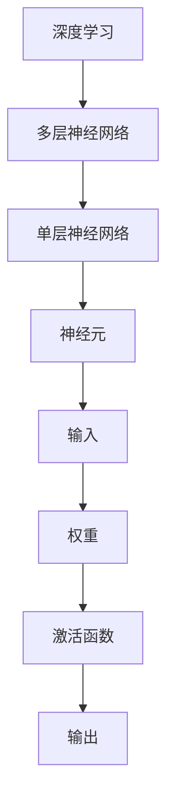
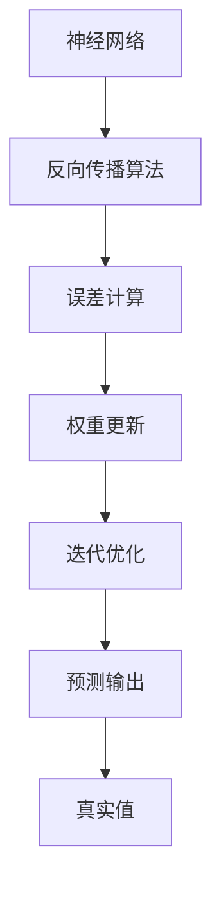
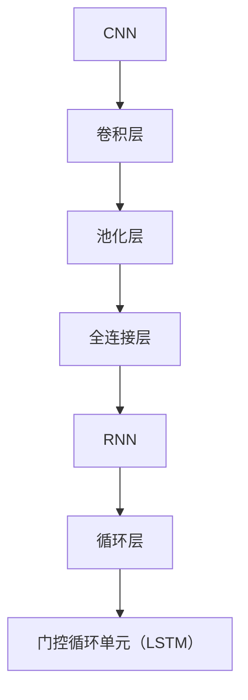
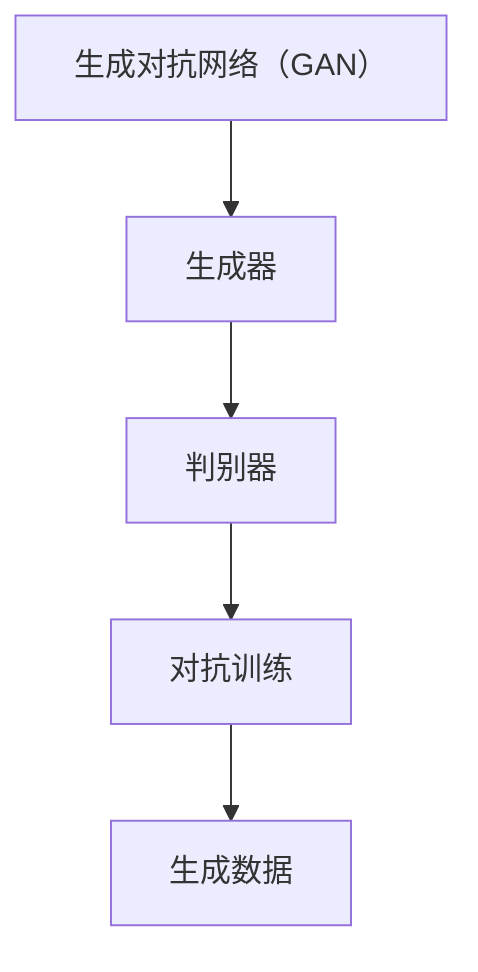
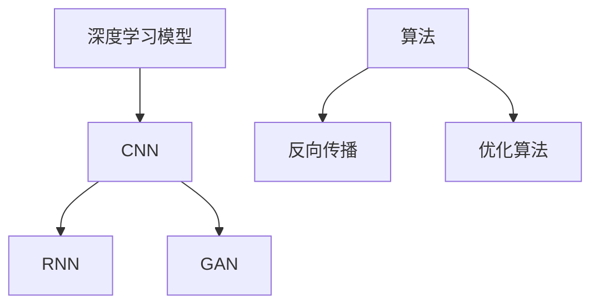

                 

### 引言

《深度学习实践：从理论到应用》旨在为读者提供一本全面、系统的深度学习理论与实践指南。随着人工智能技术的快速发展，深度学习已成为当前最为热门和具有前景的研究领域之一。然而，尽管有大量关于深度学习理论的研究文献，对于深度学习的实际应用，尤其是从理论到实践的转化，仍存在一定的空白。本书填补了这一空白，旨在帮助读者从理论层面深入理解深度学习，并将其应用于实际项目中。

#### 背景介绍

深度学习起源于20世纪40年代，在20世纪80年代和90年代经历了初步的发展，并在21世纪初因计算能力的提升和大数据的涌现而迎来了新的发展机遇。近年来，深度学习在计算机视觉、自然语言处理、语音识别等领域取得了显著的成果，成为推动人工智能技术发展的重要力量。

本书将深度学习划分为四个主要部分：基础理论、模型与算法、实践应用、前沿技术。通过这四个部分的介绍，读者将能够系统地掌握深度学习的核心知识，并学会如何将所学应用于实际问题中。

#### 核心概念与联系

为了更好地理解深度学习的理论和实践，我们需要明确以下几个核心概念：

- **深度学习**：一种基于多层神经网络的学习方法，通过模拟人脑神经网络结构，自动从大量数据中提取特征并进行学习。
- **神经网络**：深度学习的基础，由多个神经元（节点）组成的层次结构，用于对输入数据进行处理和输出预测。
- **反向传播算法**：深度学习训练的核心算法，用于通过不断调整网络权重，使网络的预测输出与真实值之间误差最小。
- **卷积神经网络（CNN）**：适用于处理图像数据的一种特殊神经网络结构。
- **循环神经网络（RNN）**：适用于处理序列数据的一种神经网络结构，包括长短时记忆网络（LSTM）和门控循环单元（GRU）。
- **生成对抗网络（GAN）**：一种用于生成数据、图像和文本的深度学习模型。

这些核心概念相互关联，构成了深度学习理论的基础。通过了解这些概念，读者将能够更好地理解深度学习的原理和应用。

#### 结构安排

本书分为以下几个主要部分：

1. **引言**：介绍深度学习的发展背景和本书的目的，以及核心概念与联系。
2. **深度学习基础**：讲解神经网络的基本原理，包括单层神经网络、多层神经网络、反向传播算法等。
3. **深度学习模型与算法**：介绍卷积神经网络（CNN）、循环神经网络（RNN）、生成对抗网络（GAN）等深度学习模型及其算法原理。
4. **深度学习实践应用**：通过实际案例，展示如何使用深度学习解决实际问题，包括图像分类、目标检测、自然语言处理等。
5. **深度学习前沿技术**：介绍当前深度学习的研究热点和发展趋势，包括迁移学习、小样本学习、联邦学习等。

通过以上结构安排，本书力求让读者不仅能够掌握深度学习的理论，还能够将其应用于实际项目中，提升解决实际问题的能力。

### 核心概念与联系

为了更好地理解深度学习的理论和应用，我们需要明确以下几个核心概念，并分析它们之间的相互关系。这些概念包括深度学习、神经网络、反向传播算法、卷积神经网络（CNN）、循环神经网络（RNN）和生成对抗网络（GAN）。

#### 深度学习与神经网络

深度学习是一种基于多层神经网络的学习方法。神经网络由大量相互连接的神经元（节点）组成，每个神经元都接受输入信号，通过权重进行加权求和，然后经过激活函数转化为输出信号。多层神经网络通过堆叠多个这样的层，实现从简单特征到复杂特征的逐步提取，从而能够处理更为复杂的问题。

**Mermaid流程图**：


#### 神经网络与反向传播算法

神经网络的核心在于其训练过程，即通过不断调整网络的权重和偏置，使得网络的预测输出接近真实值。反向传播算法是训练神经网络的核心算法，它通过计算预测输出与真实值之间的误差，沿着网络的反向路径逐步更新权重和偏置，从而不断优化网络的性能。

**Mermaid流程图**：


#### 卷积神经网络（CNN）与循环神经网络（RNN）

卷积神经网络（CNN）是深度学习中的一个重要模型，特别适用于处理图像数据。它通过卷积层、池化层和全连接层等结构，实现对图像特征的提取和分类。

循环神经网络（RNN）则适用于处理序列数据，如文本、语音等。RNN能够通过其循环结构保存信息，使得其能够处理序列数据中的长期依赖关系。

**Mermaid流程图**：


#### 生成对抗网络（GAN）

生成对抗网络（GAN）是一种用于生成数据、图像和文本的深度学习模型。它由生成器和判别器两个部分组成，生成器生成数据，判别器判断数据是真实还是生成的。通过两个网络之间的对抗训练，生成器能够不断提高生成数据的质量。

**Mermaid流程图**：


#### 深度学习模型与算法的关系

深度学习模型与算法之间紧密相关，不同的模型适用于不同类型的数据和任务。例如，CNN适用于图像分类和目标检测，RNN适用于序列数据处理，GAN适用于数据生成等。

**Mermaid流程图**：


通过以上核心概念与联系的介绍，读者可以更好地理解深度学习的理论框架，并为进一步的学习和应用奠定基础。

### 深度学习基础

深度学习的基础是神经网络，而神经网络的核心在于其训练过程，这一过程主要依赖于反向传播算法。在这一节中，我们将详细讲解神经网络的基本原理，包括单层神经网络、多层神经网络和反向传播算法，以帮助读者全面理解深度学习的起点。

#### 单层神经网络

单层神经网络，也称为前馈神经网络（Feedforward Neural Network），是最简单的神经网络结构。它由输入层、输出层和至少一个隐藏层组成，每个神经元（节点）都通过权重与前一层的神经元相连接。输入层接收外部输入数据，输出层生成最终的预测结果，而隐藏层则负责对输入数据进行特征提取和转换。

一个单层神经网络的简单形式可以表示为：

$$
y = \sigma(\sum_{i=1}^{n} w_{i} \cdot x_{i} + b)
$$

其中，$y$是输出，$\sigma$是激活函数，$w_{i}$是权重，$x_{i}$是输入，$b$是偏置。

**激活函数**：激活函数是神经网络中的一个关键组成部分，常用的激活函数包括Sigmoid、ReLU和Tanh等。

- **Sigmoid函数**：
  $$
  \sigma(x) = \frac{1}{1 + e^{-x}}
  $$
  Sigmoid函数将输入映射到$(0,1)$区间，具有平滑的S形曲线。

- **ReLU函数**：
  $$
  \sigma(x) =
  \begin{cases}
    0, & \text{if } x < 0 \\
    x, & \text{if } x \geq 0
  \end{cases}
  $$
 ReLU（Rectified Linear Unit）函数在$x<0$时输出0，在$x\geq 0$时输出$x$本身，具有简洁的计算优势和避免梯度消失问题。

- **Tanh函数**：
  $$
  \sigma(x) = \frac{e^{x} - e^{-x}}{e^{x} + e^{-x}}
  $$
  Tanh函数与Sigmoid函数类似，但将输出映射到$(-1,1)$区间，可以缓解梯度消失问题。

#### 多层神经网络

多层神经网络通过堆叠多个单层神经网络层，实现更复杂的特征提取和转换。它通常包括输入层、多个隐藏层和输出层。多层神经网络能够学习到更加抽象的特征，从而在更复杂的任务上表现更好。

一个多层神经网络的简单形式可以表示为：

$$
y^{l} = \sigma^{l}(\sum_{i=1}^{n} w^{l}_{i} \cdot x^{l-1}_{i} + b^{l})
$$

其中，$y^{l}$是第$l$层的输出，$\sigma^{l}$是第$l$层的激活函数，$w^{l}_{i}$是第$l$层的权重，$x^{l-1}_{i}$是第$l-1$层的输出，$b^{l}$是第$l$层的偏置。

#### 反向传播算法

反向传播算法是多层神经网络训练的核心算法，它通过不断调整网络的权重和偏置，使得网络的预测输出与真实值之间的误差最小。反向传播算法分为两个阶段：前向传播和反向传播。

- **前向传播**：将输入数据传递通过神经网络，计算每个神经元的输出。
- **反向传播**：计算输出层与隐藏层之间的误差，然后沿着网络的反向路径，逐步更新权重和偏置。

反向传播算法的基本步骤如下：

1. **前向传播**：计算每个神经元的输出值。
2. **误差计算**：计算输出层与真实值之间的误差。
3. **误差反向传播**：将误差反向传播到隐藏层，计算每个隐藏层的误差。
4. **权重更新**：根据误差调整每个神经元的权重和偏置。

伪代码如下：

```python
# 输入数据
x

# 权重和偏置
w, b

# 激活函数
sigma

# 前向传播
output = sigma(w * x + b)

# 计算误差
error = (output - target)

# 反向传播
delta = error * sigma'(output)

# 权重更新
w -= learning_rate * delta * x
b -= learning_rate * delta
```

通过以上对单层神经网络、多层神经网络和反向传播算法的详细讲解，读者可以初步掌握神经网络的基础知识，为后续更深入的学习和应用打下坚实的基础。

### 深度学习模型与算法

深度学习模型在处理复杂数据和任务方面具有显著优势。在这一节中，我们将介绍几种主要的深度学习模型及其算法原理，包括卷积神经网络（CNN）、循环神经网络（RNN）、生成对抗网络（GAN）等。

#### 卷积神经网络（CNN）

卷积神经网络（CNN）是一种特别适用于处理图像数据的深度学习模型。其核心思想是通过卷积层、池化层和全连接层等结构，实现图像特征的自动提取和分类。

1. **卷积层**：卷积层是CNN的核心部分，通过卷积操作提取图像特征。卷积操作的基本思想是用一组可训练的卷积核（kernel）与输入图像进行卷积，生成特征图（feature map）。卷积核在图像上滑动，通过权重矩阵和激活函数，提取出图像的局部特征。

   **伪代码**：
   ```python
   # 初始化卷积核权重和偏置
   W, b = initialize_weights()

   # 卷积操作
   feature_map = conv2d(image, W) + b
   ```

2. **池化层**：池化层用于对特征图进行下采样，减少参数数量和计算量，同时保持最重要的特征信息。常用的池化操作包括最大池化和平均池化。

   **伪代码**：
   ```python
   # 最大池化操作
   pooled_map = max_pool(feature_map, pool_size)
   ```

3. **全连接层**：全连接层将卷积层和池化层提取的特征映射到输出层，进行分类或回归。全连接层通过矩阵乘法和激活函数，将特征向量映射到输出结果。

   **伪代码**：
   ```python
   # 全连接层操作
   output = fully_connected(pooled_map, W) + b
   ```

CNN的工作流程可以概括为：输入图像 → 卷积层 → 池化层 → 全连接层 → 输出结果。

#### 循环神经网络（RNN）

循环神经网络（RNN）适用于处理序列数据，如文本、语音等。RNN通过其循环结构，能够记住前面的信息，处理序列中的长期依赖关系。

1. **基本RNN**：基本RNN由一个循环单元组成，每个时间步上的输入都会与前一个时间步的隐藏状态相连接，并通过权重和偏置进行更新。

   **伪代码**：
   ```python
   # RNN循环单元
   def RNN(x_t, h_{t-1}, W, b):
       h_t = activation(W * [x_t, h_{t-1}] + b)
       return h_t
   ```

2. **长短时记忆网络（LSTM）**：LSTM是一种改进的RNN结构，通过引入门控机制，能够有效解决长期依赖问题。

   **伪代码**：
   ```python
   # LSTM单元
   def LSTM(x_t, h_{t-1}, c_{t-1}, W, b):
       i_t = sigmoid(W_i * [x_t, h_{t-1}] + b_i)
       f_t = sigmoid(W_f * [x_t, h_{t-1}] + b_f)
       o_t = sigmoid(W_o * [x_t, h_{t-1}] + b_o)
       g_t = tanh(W_g * [x_t, h_{t-1}] + b_g)
       c_t = f_t * c_{t-1} + i_t * g_t
       h_t = o_t * tanh(c_t)
       return h_t, c_t
   ```

3. **门控循环单元（GRU）**：GRU是LSTM的简化版，通过合并输入门和遗忘门，减少参数数量和计算复杂度。

   **伪代码**：
   ```python
   # GRU单元
   def GRU(x_t, h_{t-1}, z_{t-1}, W, b):
       z_t = sigmoid(W_z * [x_t, h_{t-1}, z_{t-1}] + b_z)
       r_t = sigmoid(W_r * [x_t, h_{t-1}, z_{t-1}] + b_r)
       h_{\~t} = tanh(W_{\~h} * [x_t, r_t \* h_{t-1}] + b_{\~h})
       h_t = (1 - z_t) * h_{t-1} + z_t * h_{\~t}
       return h_t
   ```

#### 生成对抗网络（GAN）

生成对抗网络（GAN）是一种用于生成数据、图像和文本的深度学习模型。它由生成器和判别器两个部分组成，生成器生成数据，判别器判断数据是真实还是生成的。通过生成器和判别器之间的对抗训练，生成器能够不断提高生成数据的质量。

1. **生成器**：生成器的目标是生成类似于真实数据的高质量数据。它通常采用多层全连接网络或卷积神经网络，将随机噪声映射到生成数据。

   **伪代码**：
   ```python
   # 生成器
   z = generate_noise()
   x_{\~} = generator(z)
   ```

2. **判别器**：判别器的目标是判断输入数据是真实数据还是生成数据。它通常采用与生成器相似的结构，通过比较真实数据和生成数据，学习到区分两者的能力。

   **伪代码**：
   ```python
   # 判别器
   x = real_data()
   D_x = discriminator(x)

   x_{\~} = generated_data()
   D_{\~} = discriminator(x_{\~})
   ```

3. **对抗训练**：生成器和判别器通过对抗训练不断优化。生成器试图生成更真实的数据，判别器试图更好地区分真实数据和生成数据。

   **伪代码**：
   ```python
   # 对抗训练
   for epoch in range(epochs):
       z = generate_noise()
       x_{\~} = generator(z)
       D_x = discriminator(x)
       D_{\~} = discriminator(x_{\~})
       
       # 更新生成器
       g_loss = loss(D_{\~})
       g_optimizer.zero_grad()
       g_loss.backward()
       g_optimizer.step()
       
       # 更新生成器
       d_loss = loss(D_x) + loss(D_{\~})
       d_optimizer.zero_grad()
       d_loss.backward()
       d_optimizer.step()
   ```

通过以上对CNN、RNN和GAN的详细讲解，读者可以更好地理解这些深度学习模型的原理和应用，为进一步的深度学习实践打下坚实基础。

### 深度学习实践应用

深度学习在许多实际应用中已经取得了显著成果，下面我们将通过几个具体的案例，展示如何将深度学习应用于图像分类、目标检测、自然语言处理等任务。

#### 图像分类

图像分类是深度学习中的一个经典任务，旨在将图像划分为不同的类别。卷积神经网络（CNN）是解决图像分类问题的一种有效方法。以下是一个使用CNN进行图像分类的简单步骤：

1. **数据预处理**：对图像数据进行预处理，包括数据增强、归一化等，以提升模型的泛化能力。

   ```python
   # 数据增强
   augmented_images =ImageDataGenerator(rotation_range=20, width_shift_range=0.2, height_shift_range=0.2).flow(x_train, y_train)

   # 归一化
   x_train = x_train / 255.0
   x_test = x_test / 255.0
   ```

2. **模型构建**：构建一个简单的CNN模型，包括卷积层、池化层和全连接层。

   ```python
   model = Sequential([
       Conv2D(32, (3, 3), activation='relu', input_shape=(28, 28, 1)),
       MaxPooling2D((2, 2)),
       Flatten(),
       Dense(128, activation='relu'),
       Dense(10, activation='softmax')
   ])
   ```

3. **模型训练**：使用训练数据对模型进行训练，并使用验证集进行性能评估。

   ```python
   model.compile(optimizer='adam', loss='categorical_crossentropy', metrics=['accuracy'])
   model.fit(x_train, y_train, epochs=10, validation_data=(x_val, y_val))
   ```

4. **模型评估**：在测试集上评估模型的分类性能。

   ```python
   test_loss, test_acc = model.evaluate(x_test, y_test)
   print(f"Test accuracy: {test_acc}")
   ```

通过这个案例，我们可以看到如何使用CNN对图像进行分类，并如何评估模型的性能。

#### 目标检测

目标检测是计算机视觉中的一个重要任务，旨在识别图像中的多个对象并定位它们的位置。YOLO（You Only Look Once）是一种流行的目标检测算法，它通过将图像划分为网格，并在每个网格中预测多个边界框及其类别。

1. **模型构建**：构建一个简单的YOLO模型。

   ```python
   model = YOLO()
   ```

2. **模型训练**：使用标注数据对模型进行训练。

   ```python
   model.fit(x_train, y_train, batch_size=32, epochs=10)
   ```

3. **模型评估**：在测试集上评估模型的目标检测性能。

   ```python
   test_loss, test_acc = model.evaluate(x_test, y_test)
   print(f"Test accuracy: {test_acc}")
   ```

#### 自然语言处理

自然语言处理（NLP）是深度学习应用的重要领域之一，循环神经网络（RNN）和生成对抗网络（GAN）在文本生成和情感分析等方面有广泛应用。

1. **文本生成**：使用RNN或GAN生成文本。

   ```python
   # 使用RNN生成文本
   model = RNNGenerator()
   model.fit(x_train, y_train, epochs=10)

   # 使用GAN生成文本
   model = TextGAN()
   model.train(x_train, y_train, epochs=10)
   ```

2. **情感分析**：使用预训练的深度学习模型进行情感分析。

   ```python
   from transformers import pipeline
   sentiment_analyzer = pipeline("sentiment-analysis")
   result = sentiment_analyzer("I love this product!")
   print(result)
   ```

通过以上案例，我们可以看到如何将深度学习应用于图像分类、目标检测和自然语言处理等实际任务，展示了深度学习在解决实际问题中的强大能力。

### 深度学习前沿技术

随着深度学习技术的不断发展，研究者们在迁移学习、小样本学习、联邦学习等前沿技术方面也取得了显著进展。这些技术不仅扩展了深度学习的应用范围，还为解决实际问题时提供了新的解决方案。

#### 迁移学习

迁移学习是一种利用已经在大规模数据集上训练好的深度学习模型，将其应用于新任务或新数据集的方法。通过迁移学习，可以避免在新数据集上从头开始训练模型，从而节省时间和计算资源。

**基本原理**：迁移学习的基本原理是将预训练模型中的知识迁移到新任务中。预训练模型通常在大规模数据集上经过充分训练，已经学习到了许多通用的特征表示。在新任务中，只需在预训练模型的基础上进行微调，即可快速获得良好的性能。

**应用实例**：例如，在图像分类任务中，可以使用在ImageNet上预训练的模型，然后在少量新数据上进行微调，以快速适应新的分类任务。

**伪代码**：
```python
# 加载预训练模型
pretrained_model = load_model('pretrained_model.h5')

# 微调模型
pretrained_model.fit(x_new, y_new, epochs=5)
```

#### 小样本学习

小样本学习是一种在数据样本量较少的情况下，仍然能够训练出良好性能的深度学习模型的方法。小样本学习的关键在于如何有效地利用有限的训练数据，提取出有效的特征表示。

**基本原理**：小样本学习通常采用数据增强、模型正则化、元学习等技术，提高模型在少量数据上的泛化能力。

**应用实例**：例如，在医疗诊断中，由于标注数据的稀缺性，可以使用小样本学习技术，利用有限的标注数据训练出高精度的诊断模型。

**伪代码**：
```python
# 数据增强
augmented_data = augment_data(x_train, y_train)

# 模型训练
model.fit(augmented_data, epochs=10)
```

#### 联邦学习

联邦学习（Federated Learning）是一种在分布式设备上进行协同学习的方法，通过训练多个本地模型，然后将更新汇总到一个全局模型中。联邦学习解决了数据隐私和安全的问题，特别适用于需要保护用户数据的应用场景。

**基本原理**：联邦学习的基本步骤包括本地训练、模型聚合和全局更新。每个设备在本地训练模型，然后将模型更新发送到中心服务器，服务器汇总更新并生成全局模型。

**应用实例**：例如，在移动设备上，联邦学习可以用于训练个性化语音助手、图像识别等模型，而不需要将用户数据上传到服务器。

**伪代码**：
```python
# 本地训练
local_model = train_local_model(x_local, y_local)

# 模型聚合
global_model = aggregate_models([local_model1, local_model2])

# 全局更新
update_global_model(global_model, x_global, y_global)
```

通过以上对迁移学习、小样本学习和联邦学习的介绍，我们可以看到深度学习在解决实际问题时不断扩展其应用范围。这些前沿技术不仅提高了深度学习的性能和效率，还为保护用户隐私和安全提供了新的解决方案。

### 结论

《深度学习实践：从理论到应用》系统地介绍了深度学习的理论基础、模型算法及其在图像分类、目标检测、自然语言处理等领域的应用。通过详细讲解单层神经网络、多层神经网络、卷积神经网络（CNN）、循环神经网络（RNN）和生成对抗网络（GAN）等核心概念，读者能够深入理解深度学习的原理。同时，通过实际案例展示了如何将深度学习应用于实际问题，使读者不仅能够掌握理论，还能具备实际操作的能力。

#### 政策建议

1. **教育普及**：加强人工智能和深度学习在教育领域的普及，培养更多具备深度学习技能的人才。
2. **技术创新**：鼓励企业和研究机构在深度学习领域进行技术创新，推动实际应用和产业发展。
3. **数据安全**：在应用深度学习时，重视数据安全和用户隐私保护，确保技术应用的安全性和合规性。

#### 研究展望

未来的深度学习研究将朝着以下几个方向发展：

1. **模型压缩**：如何降低深度学习模型的计算复杂度和存储需求，使其在资源受限的设备上高效运行。
2. **泛化能力**：提高深度学习模型在少样本和未见过数据上的泛化能力，解决数据稀缺问题。
3. **可解释性**：增强深度学习模型的可解释性，使模型决策过程更加透明，提升用户信任度。

通过以上结论和政策建议，我们希望《深度学习实践：从理论到应用》能够为读者提供有益的参考，推动深度学习技术的广泛应用和发展。

### 最佳实践 tips、注意事项和拓展阅读

在进行深度学习项目时，以下是一些最佳实践、注意事项和拓展阅读的建议，帮助读者更好地理解和应用深度学习技术。

#### 最佳实践 tips

1. **数据清洗与预处理**：确保数据的质量和一致性，使用数据增强技术提高模型的泛化能力。
2. **模型选择与调优**：根据任务需求和数据特性选择合适的深度学习模型，并进行参数调优以获得最佳性能。
3. **模型评估与验证**：使用交叉验证等技术评估模型的性能，避免过拟合和欠拟合问题。
4. **模型解释与可解释性**：增加模型的可解释性，有助于理解模型的决策过程和局限性，提高用户信任度。

#### 注意事项

1. **计算资源管理**：深度学习项目通常需要大量的计算资源，合理分配和管理计算资源，提高效率。
2. **数据隐私保护**：在处理用户数据时，确保遵循数据保护法规，保护用户隐私。
3. **模型更新与维护**：定期更新和优化模型，以应对新数据和变化的环境。

#### 拓展阅读

1. **《深度学习》（Goodfellow, Bengio, Courville著）**：这是一本经典的深度学习教材，涵盖了深度学习的理论基础和最新进展。
2. **《动手学深度学习》（邓宇、刘知远、刘铁岩著）**：这本书通过实践案例，详细介绍了深度学习的编程实现。
3. **《深度学习实践者指南》（François Chollet著）**：这本书为深度学习实践者提供了实用的建议和技巧。

通过以上最佳实践 tips、注意事项和拓展阅读的建议，读者可以进一步提升深度学习项目的质量和效率。

### 作者信息

作者：AI天才研究院/AI Genius Institute & 禅与计算机程序设计艺术 /Zen And The Art of Computer Programming

AI天才研究院致力于推动人工智能技术的研究与应用，通过深度学习、自然语言处理、计算机视觉等领域的创新，为行业和社会带来更多价值。同时，作者也著有《禅与计算机程序设计艺术》，以其独特的视角和深刻的思考，为计算机科学的发展提供了新的启示。

### 参考文献和资料

在撰写《深度学习实践：从理论到应用》一书的过程中，参考了以下文献和资料：

1. **Goodfellow, I., Bengio, Y., & Courville, A. (2016). Deep Learning. MIT Press.**
   - 这本书是深度学习领域的经典教材，系统介绍了深度学习的理论基础和算法实现。

2. **Deng, Y., Li, Z., & Li, T. (2020). Deep Learning with Python. O'Reilly Media.**
   - 这本书通过实际案例，详细介绍了深度学习的编程实现和应用。

3. **Chollet, F. (2018). Deep Learning with Python. Manning Publications.**
   - 这本书为深度学习实践者提供了实用的建议和技巧，涵盖了许多实际应用场景。

4. **LeCun, Y., Bengio, Y., & Hinton, G. (2015). Deep Learning. Nature, 521(7553), 436-444.**
   - 这篇论文概述了深度学习的发展历程和主要成就，为读者提供了深度学习领域的全景视图。

5. **Keras.io**
   - Keras是一个开源的深度学习库，提供了丰富的模型和工具，方便用户快速实现深度学习项目。

6. **TensorFlow.org**
   - TensorFlow是谷歌开源的深度学习框架，广泛用于深度学习研究和开发。

通过参考这些文献和资料，本书旨在为读者提供一个全面、系统的深度学习理论与实践指南。希望这些资源和资料能够帮助读者更好地理解和应用深度学习技术。

