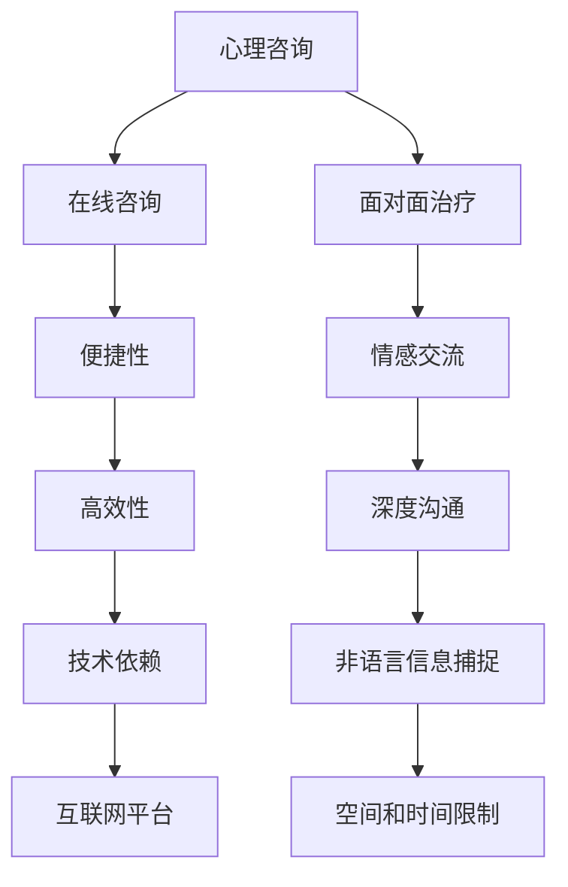

                 

### 引言

#### 背景介绍

在现代社会的快节奏生活压力下，心理健康问题日益突出。心理咨询作为一种重要的心理健康服务，其需求不断增加。然而，随着信息技术的快速发展，心理咨询的形式也发生了重大变革。在线咨询和面对面治疗作为心理咨询的两种主要形式，各自有着独特的优势和局限性。

在线咨询凭借其便捷性和高效性，迅速成为心理健康服务的新宠。患者可以在任何时间、任何地点通过网络平台预约咨询，不再受到地域和时间的限制。此外，在线咨询还可以利用各种技术手段，如视频通话、文字聊天和语音识别，提高咨询的互动性和效率。

相比之下，面对面治疗则更加注重咨询师与患者之间的情感交流和深度沟通。面对面的互动可以更好地捕捉患者的非语言信息，如表情、姿态和语调，从而提供更准确的诊断和治疗方案。然而，面对面治疗在时间和空间上具有较大的限制，患者需要亲自前往咨询场所，这在一定程度上影响了咨询的便捷性和可及性。

本文旨在通过对在线咨询和面对面治疗的深入比较，探讨它们在现代心理咨询中的应用和局限性，以期为心理健康服务的发展提供有益的参考。

#### 核心概念与联系

要全面理解在线咨询和面对面治疗，首先需要掌握以下几个核心概念：

1. **心理咨询**：心理咨询是一种以帮助个人解决心理问题、提高心理健康为目标的专业服务。它包括评估、诊断、咨询和治疗等多个环节。

2. **在线咨询**：在线咨询是指通过互联网平台提供的心理咨询服务，包括视频通话、文字聊天和邮件咨询等形式。

3. **面对面治疗**：面对面治疗是指咨询师与患者面对面进行的心理治疗，强调情感交流和深度沟通。

这些概念之间有着密切的联系和区别：

- **共同点**：无论是在线咨询还是面对面治疗，它们都是心理咨询的一种形式，旨在帮助患者解决心理问题。
- **区别**：在线咨询利用互联网技术，具有便捷性和高效性；面对面治疗则注重情感交流和深度沟通，但受时间和空间限制。

为了更好地展示这些概念之间的关系，我们可以使用Mermaid流程图来表示：



通过这个流程图，我们可以清晰地看到心理咨询、在线咨询和面对面治疗之间的联系和区别，为后续内容的分析提供了直观的参考。

#### 核心算法原理讲解

在深入探讨在线咨询和面对面治疗之前，我们需要了解它们背后的核心算法原理。这些原理不仅决定了心理咨询的效率和效果，还影响了咨询服务的用户体验。

1. **在线咨询的算法原理**：

   - **匹配算法**：在线咨询平台通常会使用匹配算法来匹配咨询师和患者。这种算法基于患者的需求、咨询师的专业领域和患者的历史咨询记录进行优化。
   - **互动算法**：在线咨询中，平台会利用互动算法来优化用户交互体验。例如，通过实时聊天、视频通话和语音识别等技术，提高沟通的流畅性和互动性。

2. **面对面治疗的算法原理**：

   - **情感识别算法**：面对面治疗中，咨询师需要通过观察患者的非语言行为，如表情、姿态和语调，来识别患者的情绪状态。这通常涉及到情感识别算法，如面部表情识别和语调分析。
   - **诊断算法**：在诊断过程中，咨询师会使用诊断算法来分析患者的症状和行为，从而做出准确的诊断。

为了更详细地阐述这些算法原理，我们可以使用伪代码来描述：

```python
# 在线咨询匹配算法伪代码
def match_consultant(patient, consultants):
    matched_consultants = []
    for consultant in consultants:
        if consultant.field == patient.field and consultant.history_matches(patient.history):
            matched_consultants.append(consultant)
    return matched_consultants

# 在线咨询互动算法伪代码
def interactive_session(patient, consultant):
    while patient.has_questions():
        patient_question = patient.get_question()
        consultant_answer = consultant.answer_question(patient_question)
        patient.receive_answer(consultant_answer)
    return patient.satisfaction

# 面对面治疗情感识别算法伪代码
def recognize_emotion(face_image):
    emotions = ["happy", "sad", "angry", "neutral"]
    emotion_scores = []
    for emotion in emotions:
        score = emotion_recognition(face_image, emotion)
        emotion_scores.append(score)
    return emotions[emotion_scores.index(max(emotion_scores))]

# 面对面治疗诊断算法伪代码
def diagnose_patient(symptoms, behavior):
    diagnosis = []
    for condition in conditions:
        if condition.matches_symptoms(symptoms) and condition.matches_behavior(behavior):
            diagnosis.append(condition)
    return diagnosis
```

通过这些伪代码，我们可以看到在线咨询和面对面治疗的核心算法原理是如何工作的，这为我们后续内容的分析提供了技术层面的深度。

### 摘要

本文从现代社会心理健康需求的背景出发，探讨了在线咨询和面对面治疗两种心理咨询形式的优劣。通过对心理咨询、在线咨询和面对面治疗的核心概念和算法原理的详细分析，我们明确了在线咨询的便捷性和高效性，以及面对面治疗的情感交流和深度沟通优势。文章还通过Mermaid流程图和伪代码展示了这些概念之间的关系和工作原理。通过对这两种咨询形式的对比与综合评估，本文提出了一些实际应用中的选择与考虑，并展望了心理咨询行业的未来发展趋势。通过本文的研究，我们期望为心理健康服务的发展提供有益的参考。

