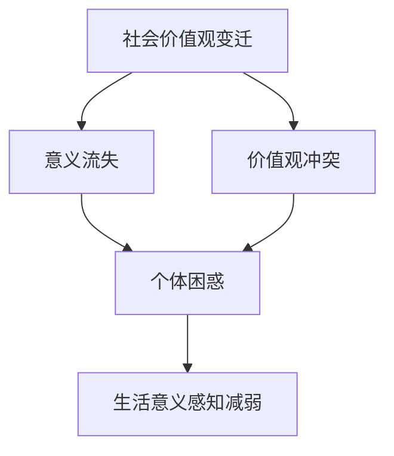
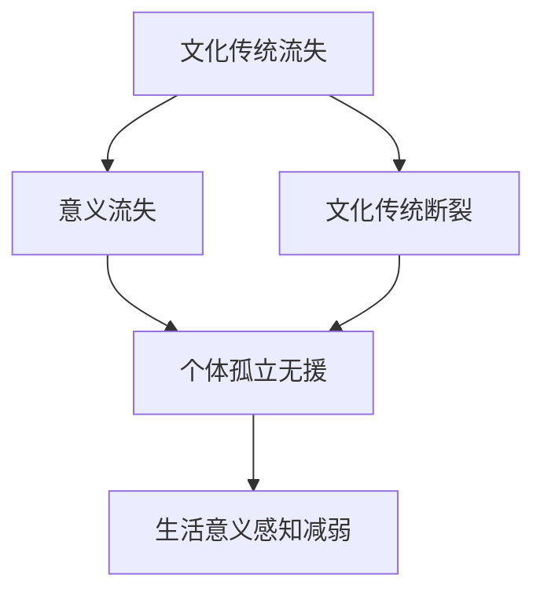
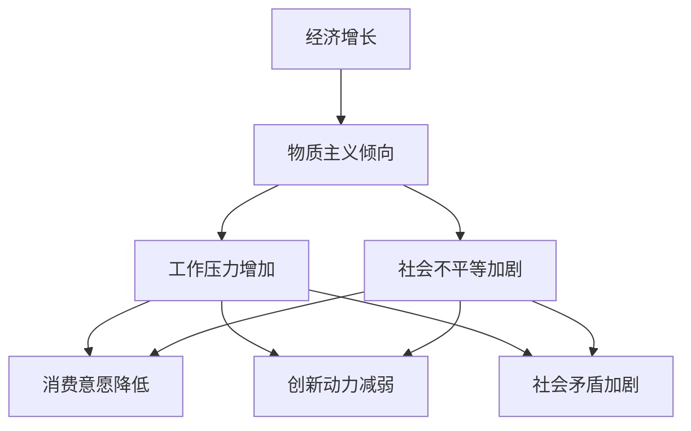
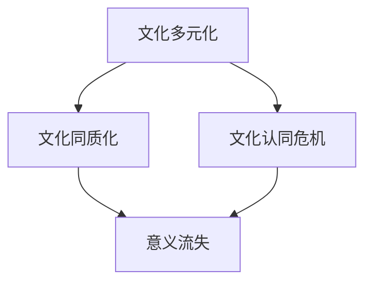

                 

### 1.1.1 社会现象的观察

在现代社会，意义流失的现象无处不在。从工作场所到日常生活，从教育体系到文化娱乐，人们似乎越来越难以找到生活的意义。首先，在工作中，人们越来越感到工作机械化和无意义化。工业革命以来，生产力的提高和劳动分工的细化使得工作内容变得高度专业化，但这也导致了人们对自己的工作缺乏整体认知，感到自己在工作中的角色仅仅是完成任务的机器。其次，在日常生活中，消费主义盛行，人们被物质财富和短期快感所迷惑，忽视了更深层次的人生意义和价值追求。

教育领域同样面临着意义流失的挑战。传统的教育体系注重知识的传授和技能的培养，但往往忽略了学生的情感和价值观教育。学生常常感到学习枯燥乏味，仅仅是为了应付考试，而缺乏对知识的真正兴趣和理解。这种教育模式培养出来的学生，往往缺乏独立思考和创新精神，难以在面对复杂的社会问题时找到真正的解决之道。

文化领域也面临着意义流失的困境。现代社会中，文化的多元化和全球化带来了文化的繁荣，但同时也导致了文化同质化和浅薄化。人们越来越倾向于追求流行和时尚，而忽视了文化传统的深厚内涵。文化消费主义盛行，人们更多地关注于文化产品的商业价值，而忽略了文化产品所蕴含的精神价值和意义。

### 1.1.2 意义流失的影响

意义流失对个体、社会和文化的影响是深远且广泛的。首先，对个体而言，意义流失会导致价值观危机和心理问题。个体在寻找生命意义的过程中，可能会感到迷茫和无助，甚至产生抑郁和焦虑。当人们感到自己的生活缺乏意义时，他们可能会对生命失去希望，从而影响他们的心理健康和生活质量。

对社会而言，意义流失可能导致社会不公和社会矛盾的加剧。当人们感到自己的生活缺乏意义时，他们可能会对社会产生不满和抵触情绪，从而导致社会信任危机。此外，意义流失还可能影响社会的发展和进步。当一个社会的成员缺乏共同的目标和价值追求时，社会很难形成统一的方向和动力，从而影响社会的稳定和发展。

对文化而言，意义流失可能导致文化的断层和衰退。文化是社会的精神支柱，是民族的精神家园。当文化失去其深刻内涵和独特性时，它将变得苍白无力，难以继续发挥其传承和引领社会发展的作用。文化的意义流失还可能导致文化多样性的丧失，从而影响人类文明的进步和发展。

### 1.2 研究意义与目标

研究现代社会中的意义流失具有重要的理论和实践意义。首先，从理论层面来看，意义流失现象反映了现代社会中价值观的变迁和文化的失落，这是对现代社会运行机制和人类生活方式的重要反思。通过深入研究意义流失的原因和影响，我们可以更好地理解现代社会的发展趋势和挑战，为社会的未来发展提供理论支持。

其次，从实践层面来看，研究意义流失有助于我们找到解决现代社会问题的有效途径。无论是从个体的心理健康、社会的稳定发展，还是从文化的传承和创新角度来看，意义流失都是一个亟待解决的问题。通过研究意义流失，我们可以提出有针对性的应对策略和解决方案，从而帮助个体和社会找回生活的意义，促进社会的和谐与进步。

本研究的目标是：1）明确意义流失的定义和核心概念，建立一套系统化的理论框架；2）深入分析意义流失的原因，探讨社会、文化、经济等多个方面的因素；3）评估意义流失对个体、社会和文化的影响，提出相应的应对策略和解决方案；4）通过实际案例研究，验证理论框架和策略的有效性。

## 2. 意义流失的定义与核心概念

### 2.1 意义流失的定义

意义流失，即“意义感的丧失”或“意义真空”现象，是指在现代社会中，个体或群体逐渐失去对生命、生活、工作、学习等方面的意义感知和追求。这种现象不仅体现在个体层面，也渗透到社会和文化层面，表现为社会成员对生活意义和价值追求的普遍缺失。

意义流失的定义可以从以下几个方面来理解：

1. **个体层面**：个体在经历从出生到成长的过程中，可能会逐渐失去对生活意义的认知和追求。这种丧失可能是由于外部环境的影响，如社会变革、文化多元化、经济压力等，也可能是由于个体的内在因素，如个人价值观的迷失、心理健康问题等。

2. **社会层面**：整个社会可能会出现普遍的意义流失现象，表现为社会成员对共同价值观和目标的缺乏认同，以及对生活意义的普遍淡漠。这种流失可能导致社会信任危机、社会矛盾加剧和社会发展停滞。

3. **文化层面**：文化意义的流失体现在传统文化价值的弱化、文化同质化以及文化消费主义的盛行。这可能导致文化断层和文化认同危机，从而影响文化多样性和文化创新。

### 2.2 核心概念介绍

为了深入理解意义流失，我们需要明确几个核心概念，包括社会意义、文化意义和经济意义。

1. **社会意义**：社会意义是指个体在社会中扮演的角色及其对社会的作用和贡献。社会意义不仅是个人自我认同的基础，也是社会稳定和发展的重要保障。当个体感到自己的存在对社会有意义时，他们更可能积极参与社会活动，承担社会责任。

2. **文化意义**：文化意义是指文化在历史长河中积累的精神价值和社会认知。文化意义包括传统价值观、习俗、信仰和艺术等，它们是民族文化的重要组成部分，也是民族身份认同的基石。文化意义的流失可能导致文化断层和文化认同危机。

3. **经济意义**：经济意义是指经济活动对个体和社会的作用和价值。经济意义不仅体现在物质财富的创造和分配，还体现在对个体生活质量和社会发展的影响。经济意义的流失可能导致经济不平等和社会矛盾的加剧。

### 2.3 意义流失与相关概念的关联

意义流失与多个相关概念密切相关，包括价值观、意义感、动机和幸福感等。

1. **价值观**：价值观是人们对生活中重要事务的态度和评价标准。意义流失往往伴随着价值观的迷失，即个体或社会对某些重要事务的价值观发生动摇或消失。

2. **意义感**：意义感是指个体对自己生活意义的感知和体验。意义流失意味着个体对生活意义的感知减弱或丧失，可能导致心理上的不满足和迷茫。

3. **动机**：动机是推动个体行为的力量和原因。意义流失可能导致个体缺乏动机，从而影响他们的工作和生活表现。

4. **幸福感**：幸福感是个体对自身生活满意度的主观感受。意义流失可能会影响个体的幸福感，导致他们感到生活缺乏意义和满足感。

通过上述分析，我们可以看出，意义流失不仅仅是一个简单的现象，它涉及到多个层面和多个核心概念。理解这些概念之间的关系，有助于我们更全面地认识意义流失的本质，并为解决这一问题提供理论基础和实践指导。

### 2.3.1 意义流失与社会价值观的关系

意义流失与社会价值观之间存在着密切的联系和互动。社会价值观是指导社会成员行为和决策的基本准则，它们不仅塑造了社会的文化和制度，也深刻影响了个体对生活意义的感知。当社会价值观发生变迁或出现冲突时，可能会导致意义流失现象的加剧。

首先，社会价值观的变迁是导致意义流失的重要原因之一。随着全球化、信息化和现代化进程的加速，传统的社会价值观逐渐被新的价值观念所取代。例如，过去强调集体主义和社会责任的社会价值观，在现代社会中可能被个人主义和自我实现的价值观念所取代。这种变迁使得个体在寻找生活意义时面临更大的困惑和挑战，因为他们不再能够清晰地认识到自己在社会中的角色和责任。

其次，社会价值观的冲突也是意义流失的一个重要因素。在社会变革过程中，不同价值观之间的冲突可能导致个体内心的混乱和不安。例如，现代社会中，消费主义价值观和传统道德价值观之间的冲突，可能导致个体在追求物质享受和道德规范之间感到矛盾和困惑，从而影响他们对生活意义的认知。

此外，社会价值观的变化也影响了人们对生活意义的追求方式。传统社会中，生活意义往往通过参与集体活动、履行社会责任和家庭角色来体现。而在现代社会，个体更多地追求自我实现和个人价值，这使得人们在追求意义时更加关注个人体验和自我满足。然而，这种追求方式也可能导致个体对生活意义的感知变得浅薄和短暂。

为了更好地理解意义流失与社会价值观的关系，我们可以借助Mermaid流程图来展示核心概念之间的关系架构。以下是关于意义流失与社会价值观关系的Mermaid流程图：

在这个流程图中，社会价值观的变迁和冲突是导致意义流失的主要原因，而意义流失又进一步加剧了个体对生活意义的感知减弱，形成一个恶性循环。

通过分析意义流失与社会价值观的关系，我们可以看到，社会价值观不仅影响个体的生活意义感知，也对社会整体的和谐与稳定产生深远影响。因此，在解决意义流失问题时，我们需要重视社会价值观的建设和引导，通过培育积极健康的社会价值观，帮助个体和社会找回生活的意义。

### 2.3.2 意义流失与文化传统的关系

意义流失与文化传统之间存在着深刻的互动关系。文化传统是民族文化的重要组成部分，是历史和社会经验的积淀，它不仅塑造了人们的价值观和行为准则，也深深影响了个体对生活意义的感知。当文化传统受到冲击或改变时，意义流失现象往往随之加剧。

首先，文化传统的流失是导致意义流失的重要原因之一。文化传统中蕴含的深厚意义和价值，为个体提供了生活方向和精神支撑。然而，在现代社会中，随着全球化、现代化和城市化的加速，许多传统文化形式和价值观正逐渐消失。例如，传统手工艺的衰败、传统节日的淡化，都可能导致人们对传统意义的感知减弱，从而感到生活缺乏深度和内涵。

其次，文化传统的断裂也是意义流失的一个重要表现。文化传统是一个连续的过程，每一代人都在传承和创造中不断丰富和发展。然而，当文化传统的断裂发生时，个体会失去与历史和民族的联系，从而感到自己处于一种孤立无援的状态。例如，随着现代教育体系的变革，许多学生可能不再接受传统的历史和文化教育，这可能导致他们对文化传统的认知和认同感减弱，从而影响他们对生活意义的理解。

此外，文化传统与意义流失的关系还体现在文化多样性的减少上。文化多样性不仅是人类社会进步的重要动力，也是个体寻找生活意义的重要资源。然而，在全球化背景下，文化同质化现象日益严重，这可能导致文化多样性的减少。当个体面临单一化的文化环境时，他们可能难以找到与自己价值观和生活方式相契合的意义，从而导致意义流失。

为了更好地理解意义流失与文化传统的关系，我们可以借助Mermaid流程图来展示核心概念之间的联系。以下是关于意义流失与文化传统关系的Mermaid流程图：

在这个流程图中，文化传统的流失和断裂是导致意义流失的主要原因，而意义流失又进一步加剧了个体对生活意义的感知减弱，形成一个恶性循环。

通过分析意义流失与文化传统的关系，我们可以看到，文化传统不仅为个体提供了精神支撑和价值观，也是社会和谐与稳定的重要基础。因此，在应对意义流失问题时，我们需要重视文化传统的传承和弘扬，通过强化文化教育和文化保护，帮助个体和社会找回生活的意义。

### 2.3.3 意义流失与经济增长的关系

意义流失与经济增长之间存在着复杂而微妙的关系。一方面，经济增长可能带来物质财富的积累和社会进步，但另一方面，它也可能导致意义流失，影响个体和社会的幸福感和满足感。理解这种关系对于全面认识现代社会问题具有重要意义。

首先，经济增长对意义流失的影响可以从以下几个方面进行分析：

1. **物质主义倾向**：随着经济的快速发展，人们的生活水平不断提高，物质财富的积累成为许多人的主要目标。这种物质主义倾向可能导致人们对生活的意义产生误解，认为只有通过追求物质财富和消费才能实现幸福。然而，这种追求往往忽视了精神层面的需求，导致个体感到生活空虚和无意义。

2. **工作压力增加**：经济增长往往伴随着工作压力的增加。现代工作环境的竞争激烈，工作时间和强度不断增加，导致个体面临巨大的压力和焦虑。当个体将大量时间和精力投入到工作中，而忽视了生活的其他方面时，他们可能会感到生活的意义在于工作，进而导致意义流失。

3. **社会不平等加剧**：经济增长可能带来社会财富的重新分配，但也可能导致社会不平等现象的加剧。在贫富差距较大的社会中，个体可能会感到自己的生活缺乏意义，因为他们难以实现自我价值和社会认同。社会不平等不仅影响个体的幸福感，也可能削弱社会的整体凝聚力，进一步加剧意义流失。

其次，意义流失对经济增长的影响也是一个值得关注的课题。意义流失可能导致以下后果：

1. **消费意愿降低**：当个体感到生活缺乏意义时，他们可能对消费持消极态度，减少不必要的开支。这可能导致消费市场疲软，影响经济增长。

2. **创新动力减弱**：意义流失可能削弱个体的创造力和创新精神。在一个缺乏生活意义的环境中，个体可能缺乏对未来的期望和动力，从而影响社会整体的创新能力和竞争力。

3. **社会矛盾加剧**：意义流失可能导致社会成员之间的信任和合作减少，社会矛盾和冲突增多。这种不和谐的社会氛围不仅影响个体和集体的幸福感，也可能对经济增长产生负面影响。

为了更好地理解意义流失与经济增长之间的关系，我们可以借助Mermaid流程图来展示核心概念之间的联系。以下是关于意义流失与经济增长关系的Mermaid流程图：

在这个流程图中，经济增长可能导致物质主义倾向、工作压力增加和社会不平等加剧，这些因素共同作用，可能引发消费意愿降低、创新动力减弱和社会矛盾加剧，从而影响经济增长。同时，意义流失可能进一步加剧这些负面影响，形成恶性循环。

通过分析意义流失与经济增长的关系，我们可以得出结论：经济增长不仅是社会发展的动力，也是意义流失的重要诱因。为了实现可持续发展和个体幸福，我们需要在追求经济增长的同时，关注意义流失问题，通过政策调整、文化教育和心理健康支持等措施，帮助个体和社会找回生活的意义，实现经济与社会的协调发展。

### 3.1.1 社会变革

社会变革是导致意义流失的重要原因之一。随着全球化、信息化和现代化进程的不断推进，社会结构和生活方式发生了深刻变化，这些变化在一定程度上削弱了个体对生活意义的感知。

首先，全球化的加速使得不同文化、价值观和生活方式之间的互动日益频繁。全球化不仅带来了经济和科技的快速发展，也引发了文化同质化现象。在这种背景下，个体可能感到自己无法融入全球化社会，从而产生认同危机。例如，当本土文化和传统价值观受到全球文化潮流的冲击时，个体可能会感到自己的文化身份和生活意义受到威胁。

其次，信息化技术的迅猛发展改变了人们的生活方式。互联网、社交媒体和移动设备的普及使得信息获取和传播更加便捷，但也导致了信息过载和注意力分散。个体在信息爆炸的环境中，可能难以找到真正有意义的信息和活动，从而导致生活意义的流失。此外，虚拟社交的兴起虽然提供了更多的社交机会，但同时也使得个体在现实生活中的交往和互动减少，进而影响他们对生活的真实感知和意义追求。

最后，现代化进程的加速带来了工作生活方式的改变。现代社会对个体效率、绩效和成就的要求越来越高，这导致工作压力和生活节奏的加快。在快节奏的生活中，个体可能无法充分体验生活的细节和美好，从而感到生活缺乏意义。此外，现代化进程中的社会结构变化，如家庭结构的变化、人口老龄化和城市化进程的加快，也影响了个体对生活意义的认知和追求。

总之，社会变革通过全球化、信息化和现代化等多方面的影响，加剧了意义流失现象。为了应对这一挑战，我们需要在政策制定、文化教育和心理健康支持等方面采取综合措施，帮助个体和社会找回生活的意义。

### 3.1.2 科技进步

科技进步在现代社会中的作用无可忽视，它不仅改变了人们的生活方式，也在一定程度上影响了意义流失现象。一方面，科技进步带来了便利和效率的提升，使得生活更加快捷和舒适；另一方面，它也可能导致意义流失，影响个体对生活意义的感知。

首先，互联网和社交媒体的普及是科技进步导致意义流失的一个重要方面。互联网使得信息获取和传播变得前所未有的便捷，人们可以随时随地获取各种信息。然而，信息过载和注意力分散的问题也随之而来。在互联网的世界里，人们可能被大量的信息和娱乐内容所淹没，难以聚焦于有意义的活动和深层次的思考。此外，社交媒体的兴起使得虚拟社交成为现实社交的重要补充，但这种虚拟互动往往缺乏深度和真实性，难以满足个体对人际关系和归属感的深层需求。

其次，自动化和人工智能技术的进步也对社会和个体产生了深远的影响。自动化技术的广泛应用，使得许多传统行业的工作岗位被机器取代，导致大量劳动者失业或面临职业转型的压力。这不仅影响了他们的经济状况，也可能削弱他们对生活意义的感知。人工智能技术的发展，虽然提高了生产效率和创新能力，但也可能导致个体在职业发展和自我实现方面的困扰，从而影响他们对生活意义的追求。

此外，科技进步还改变了人们的价值观和生活方式。在科技驱动的消费主义文化中，人们越来越注重物质享受和短期快感，而忽视了精神层面的需求。科技带来的便利和娱乐，使得人们更容易陷入浮躁和浅薄的生活方式，难以体验到生活的深度和意义。

为了应对科技进步带来的意义流失，我们需要采取一系列措施。首先，应加强科技伦理教育，引导人们正确认识和使用科技，避免科技对生活的过度影响。其次，应推动科技与人文教育的融合，培养个体的批判性思维和人文素养，帮助他们找到生活的意义。最后，应鼓励科技企业和政府出台相关政策，保障劳动者的就业权益，减轻他们的生活压力，从而帮助个体在社会变革中找回生活的意义。

### 3.1.3 社会结构变化

社会结构变化是导致意义流失的重要原因之一，这些变化包括城市化进程的加快、家庭结构的变化以及人口老龄化的加剧等。这些变化不仅影响了人们的生活方式，也在一定程度上削弱了他们对生活意义的感知。

首先，城市化进程的加快使得许多人从农村迁往城市，生活环境和社会关系发生了巨大的变化。在城市中，人们面临着更高的生活节奏和工作压力，社会联系变得更为疏离。城市居民可能感到自己与社区和社会的联系减少，从而缺乏归属感和生活意义。此外，城市化的过程也导致了自然环境的丧失，许多人失去了与自然的联系，这使得他们在寻找生活意义时面临更多的困难。

其次，家庭结构的变化也是导致意义流失的重要因素。在传统社会中，家庭是人们生活和情感的重要支撑，但随着现代化进程的推进，核心家庭和小家庭变得越来越普遍，家庭纽带变得相对脆弱。家庭成员之间的互动和交流减少，可能导致个体感到孤独和失落，从而影响他们对生活的意义感知。此外，随着离婚率的上升和家庭功能的弱化，许多人可能无法在家庭中找到情感支持和生活意义。

最后，人口老龄化的加剧也对社会结构和个体的生活产生了深远的影响。随着人口结构的变化，老年人口比例逐渐增加，这给社会和个体带来了诸多挑战。老年人可能面临孤独、健康问题和经济压力，这些因素可能导致他们感到生活缺乏意义。对于年轻一代来说，人口老龄化可能影响他们的就业机会和福利待遇，从而削弱他们对未来的信心和对生活的期望。

为了应对社会结构变化带来的意义流失，我们需要采取一系列措施。首先，应加强社区建设，促进居民之间的互动和交流，帮助他们在城市生活中找到归属感。其次，应推动家庭关系的重建，鼓励家庭成员之间的沟通和关爱，为他们提供情感支持。最后，应制定相关政策，保障老年人口的生活质量和权益，帮助他们找到生活的意义和乐趣。通过这些措施，我们可以帮助个体和社会在面对社会结构变化时，更好地找回生活的意义。

### 3.2.1 文化多元化

文化多元化是现代社会的一个显著特征，它带来了文化繁荣和多样性，但同时也引发了意义流失的问题。文化多元化指的是不同文化背景、价值观和生活方式在同一社会中共存和互动的现象。这种多元化不仅体现在文化产品的消费上，也渗透到教育、工作和社会交往等多个方面。

首先，文化多元化导致文化同质化现象。尽管文化多元化为人们提供了更多的选择和机会，但这也可能导致文化产品和内容的同质化。为了迎合大众口味和市场需求，许多文化产品可能逐渐失去其独特性和深刻内涵，变得浅薄和单一。这种同质化现象使得个体在寻找有意义的文化体验时面临更大的困难，从而感到生活缺乏深度和意义。

其次，文化多元化也可能导致文化认同危机。在一个多元文化共存的社会中，个体可能感到自己的文化身份和价值观受到冲击和挑战。文化认同是人们自我认同的重要组成部分，当个体面临文化认同危机时，他们可能感到迷茫和无助，从而影响他们对生活意义的感知。此外，文化多元化还可能导致文化冲突和矛盾，这进一步加剧了个体对社会和生活的认同感减弱。

为了更好地理解文化多元化与意义流失的关系，我们可以借助Mermaid流程图来展示核心概念之间的联系。以下是关于文化多元化与意义流失关系的Mermaid流程图：

在这个流程图中，文化多元化可能导致文化同质化，进而引发意义流失。同时，文化多元化也可能导致文化认同危机，进一步加剧意义流失。

为了应对文化多元化带来的意义流失，我们需要采取一系列措施。首先，应加强文化教育和文化保护，帮助个体理解和尊重不同文化的多样性。其次，应推动文化创新和多样性发展，鼓励文化产品和内容保持独特性和深刻性。最后，应加强社会融合和文化交流，促进不同文化之间的理解和认同，从而帮助个体和社会在多元文化环境中找回生活的意义。

### 3.2.2 文化商品化

文化商品化是现代社会中一个显著的现象，它对意义流失产生了深远的影响。文化商品化指的是将文化元素转化为商品和服务，通过市场化手段进行生产和消费的过程。这种现象不仅改变了文化产品的生产和传播方式，也在一定程度上改变了人们的文化体验和价值观。

首先，文化商品化导致了文化内容的浅薄化。为了迎合市场需求和消费者口味，许多文化产品在创作和传播过程中可能追求商业利益，而忽视了文化内涵的深度和广度。这导致文化内容逐渐变得单一和浅薄，难以满足个体对丰富和深刻文化体验的需求。例如，影视作品的商业化和流水线生产，可能使内容失去独特的艺术性和思想性，变得千篇一律，从而削弱了文化产品的教育意义和人文价值。

其次，文化商品化可能影响个体对文化意义的感知。在商品化的文化环境中，个体可能更关注文化产品的商业价值，而忽视了其精神内涵和意义。文化商品化使得文化消费变得表面化和功利化，个体在追求文化消费时可能更注重物质享受和短期快感，而忽视了文化产品所蕴含的深层价值和意义。例如，流行音乐的消费可能更多关注旋律和节奏，而忽视了歌词所传递的情感和思考。

此外，文化商品化还可能导致文化同质化现象。为了吸引更广泛的消费者，文化产品可能趋于迎合大众口味，导致文化内容逐渐失去多样性和独特性。文化同质化使得个体在文化体验中难以找到与自己价值观和兴趣相契合的内容，从而影响他们对生活意义的理解和追求。

为了应对文化商品化带来的意义流失，我们需要采取一系列措施。首先，应加强文化教育和文化保护，提高公众对文化商品化现象的认识和批判能力。其次，应鼓励文化创新和多样性发展，支持具有独特性和深刻性的文化产品和内容。最后，应推动文化产业的可持续发展，注重文化产品的精神内涵和社会价值，从而帮助个体和社会在商品化浪潮中找回文化的意义。

### 3.2.3 文化消费主义

文化消费主义是现代社会中的一种文化现象，它指的是个体在追求文化产品和服务时，将消费行为视为实现自我价值和身份认同的主要途径。文化消费主义不仅影响了人们的生活方式，也在一定程度上加剧了意义流失的问题。

首先，文化消费主义导致了对文化产品的过度追求。在消费主义文化的影响下，个体可能将文化消费视为提升生活品质和满足精神需求的重要手段。例如，通过购买昂贵的艺术品、参加高端的文化活动或订阅各种文化产品，个体试图通过消费来获得心理上的满足和认同感。然而，这种过度追求可能导致个体对文化产品的过度依赖，忽视了更深层次的生活意义和价值追求。

其次，文化消费主义可能影响个体对文化意义的感知。在消费主义文化中，文化产品往往被简化为商品和服务，其精神内涵和意义被忽视。个体在消费文化产品时可能更注重其表面的外在价值，而忽视了其内在的文化意义和思想深度。例如，购买一本昂贵的书籍可能更多是出于炫耀和展示财富的动机，而不是真正对书籍内容的兴趣和思考。

此外，文化消费主义还可能导致文化同质化现象。为了迎合市场需求和消费者口味，文化产品在创作和传播过程中可能追求商业利益，导致文化内容的单一化和浅薄化。文化同质化使得个体在文化消费中难以找到与自己价值观和兴趣相契合的内容，从而影响他们对生活意义的理解和追求。

为了应对文化消费主义带来的意义流失，我们需要采取一系列措施。首先，应加强文化教育和文化保护，提高公众对文化消费主义现象的认识和批判能力。其次，应鼓励文化创新和多样性发展，支持具有独特性和深刻性的文化产品和内容。最后，应推动文化产业的可持续发展，注重文化产品的精神内涵和社会价值，从而帮助个体和社会在消费主义浪潮中找回文化的意义。

### 3.3.1 经济发展模式

经济发展模式是导致意义流失的一个重要因素。传统的经济发展模式主要依赖于资源开采、工业化和大量消费，这种模式在带来经济增长的同时，也带来了诸多社会问题，其中包括意义流失。

首先，传统的经济发展模式可能导致环境破坏和资源枯竭。在追求经济增长的过程中，许多国家过度依赖自然资源，导致森林砍伐、水资源短缺和大气污染等问题。这些环境问题不仅影响了人们的生存条件，也削弱了人们对生活的满意度和幸福感，从而加剧了意义流失现象。

其次，传统的经济发展模式可能导致社会不平等和贫富差距的加剧。经济增长往往集中在少数人和行业，而忽视了广大普通民众的利益。这导致社会两极分化，贫富差距加大，许多人感到自己无法享受到经济增长的红利，从而产生不满和失落情绪，影响他们对生活意义的感知。

此外，传统的经济发展模式还可能导致工作压力和生活节奏的加快。在工业化进程中，人们面临的工作压力越来越大，工作时间越来越长，生活节奏也越来越快。这种快节奏的生活方式使得人们难以找到时间反思和体验生活的意义，从而感到生活缺乏深度和意义。

为了应对传统经济发展模式带来的意义流失，我们需要探索新的经济发展模式，如可持续发展模式、绿色经济和创新经济等。这些新模式强调环境保护、社会公平和可持续性，旨在实现经济、社会和环境的协调发展，从而帮助个体和社会找回生活的意义。

### 3.3.2 全球化

全球化是现代社会中一个不可逆转的趋势，它深刻地影响了全球经济、文化和社会结构。然而，全球化进程也带来了一系列挑战，其中之一就是意义流失。全球化对意义流失的影响主要体现在以下几个方面：

首先，全球化加速了文化的同质化。在全球化背景下，西方文化特别是美国文化在全球范围内广泛传播，导致许多国家和地区的本土文化受到冲击。这种文化同质化现象使得个体在寻找生活意义时面临更大的困惑，因为他们难以找到与自己文化背景和价值观相契合的意义来源。

其次，全球化加剧了社会不平等。全球化进程往往伴随着资本的流动和经济的快速发展，但这种发展并不均衡。发达国家和发展中国家之间的贫富差距不断扩大，导致许多人在全球化进程中感到被边缘化和忽视。社会不平等不仅影响个体的幸福感，也削弱了他们对生活意义的感知。

此外，全球化还改变了人们的就业和生活方式。全球化带来了跨国公司和全球供应链，许多传统产业和职业面临转型和失业的风险。个体在全球化进程中可能面临职业不稳定和生活压力增加的问题，这进一步加剧了他们对生活意义的困惑和失落。

为了应对全球化带来的意义流失，我们需要采取一系列措施。首先，应加强文化保护和多样性发展，帮助个体在多元文化环境中找到自己的文化认同和意义。其次，应推动全球经济的公平和可持续发展，减少社会不平等现象。最后，应鼓励个体在全球化背景下寻找新的生活意义和价值观，通过培养创新精神和跨文化沟通能力，帮助他们在全球化社会中找到自己的位置和意义。

### 3.3.3 资本主义经济体制

资本主义经济体制是现代经济体系的主要形式之一，它在推动经济增长和技术创新方面发挥了重要作用。然而，资本主义经济体制也带来了一些负面效应，其中之一就是意义流失。资本主义经济体制对意义流失的影响主要体现在以下几个方面：

首先，资本主义经济体制强调利润最大化，这可能导致个体和社会忽视生活的意义。在追求经济利益的过程中，人们可能将物质财富和消费作为生活的唯一目标，而忽视了精神层面的需求和价值观。这种以利润为中心的生活观念可能导致意义流失，使个体感到生活空虚和缺乏意义。

其次，资本主义经济体制可能导致社会不平等和贫富差距的加剧。资本主义经济体制中，财富和资源往往集中在少数人手中，导致社会两极分化。贫富差距的扩大不仅影响社会的稳定，也削弱了个体对生活意义的感知，使他们感到自己无法通过努力改变命运，从而产生失落感和无助感。

此外，资本主义经济体制还可能导致工作压力和生活节奏的加快。在资本主义经济体制下，工作成为个体实现自我价值和收入来源的主要途径。然而，高强度的劳动和不断的工作压力可能导致个体身心健康受损，使他们难以找到生活的意义。快节奏的生活也使得人们难以有时间进行深度思考和体验生活的美好，进一步加剧了意义流失。

为了应对资本主义经济体制带来的意义流失，我们需要采取一系列措施。首先，应推动经济政策的调整，注重社会公平和可持续发展，减少贫富差距。其次，应鼓励个体在追求物质财富的同时，关注精神层面的需求和价值观，培养对生活的深刻理解和热爱。最后，应推动社会整体价值观的转变，从以利润为中心转向以人为中心，帮助个体和社会在资本主义经济体制中找回生活的意义。

### 4.1.1 价值观危机

价值观危机是意义流失的一个重要表现，尤其在现代社会中，这一问题尤为突出。价值观危机指的是个体或社会在面临快速变化的环境时，传统价值观受到挑战，而新的价值观尚未确立，导致价值观的混乱和迷茫。价值观危机不仅影响个体的心理健康和生活质量，也对社会的稳定和发展产生负面影响。

首先，现代社会中的价值观危机体现在传统价值观的动摇和消失。在传统社会中，家庭、宗教、文化和社会习俗为个体提供了明确的价值观和行为准则。然而，随着全球化、现代化和信息化的发展，这些传统价值观受到了前所未有的冲击。例如，传统家庭观念的弱化，宗教信仰的多元化，以及文化习俗的变迁，都可能导致个体对生活意义和价值观的困惑。

其次，价值观危机还体现在对现代价值观的质疑和矛盾。在现代社会中，许多新兴的价值观，如个人主义、自由主义和消费主义等，虽然为个体提供了新的选择和自由，但也带来了一系列问题。例如，个人主义可能导致个体过度追求自我实现，忽视社会责任和集体利益；消费主义则可能导致个体陷入物质主义的泥淖，忽视精神层面的需求。

此外，价值观危机还可能引发心理健康问题。当个体面临价值观的混乱和迷茫时，他们可能感到无方向、无目标，从而产生焦虑、抑郁等心理问题。长期处于价值观危机中，个体可能会失去对生活的热情和动力，影响他们的生活质量和幸福感。

为了应对价值观危机，我们需要采取一系列措施。首先，应加强价值观教育，帮助个体树立正确和健康的价值观。其次，应推动社会价值观的多元化发展，尊重不同价值观的共存。最后，应鼓励个体在价值观的探索和实践中，找到符合自身特点和时代需求的价值取向，从而帮助个体和社会找回生活的意义。

### 4.1.2 心理健康问题

意义流失对心理健康问题的影响是深远且广泛的。在现代社会，当个体感到自己的生活缺乏意义时，他们可能会经历一系列心理健康问题，如焦虑、抑郁、孤独和自尊心下降等。

首先，焦虑是意义流失常见的心理反应之一。当个体面对生活无意义和未来迷茫时，他们可能会感到紧张、不安和担忧。焦虑不仅影响个体的情绪状态，也可能影响他们的日常生活和工作表现。长期的焦虑可能导致心理健康问题的加剧，如失眠、头痛和肠胃问题等。

其次，抑郁是意义流失带来的另一个严重心理问题。抑郁是一种情感障碍，表现为持续的悲伤、失去兴趣和动力，以及消极的自我评价。当个体感到自己的生活缺乏意义时，他们可能会对生活失去兴趣，对未来的期望降低，从而陷入抑郁的恶性循环。抑郁不仅影响个体的心理健康，还可能导致一系列身体疾病，如心脏病、高血压和免疫系统功能下降等。

此外，意义流失还可能导致个体的孤独感增强。在现代社会，尽管人们拥有丰富的社交网络，但许多人仍然感到孤独。这种孤独感源于个体在寻找生活意义的过程中缺乏支持和认同。当个体感到自己的生活缺乏目标和价值时，他们可能会感到与他人疏离，难以建立深厚的社交关系，从而进一步加剧孤独感。

最后，意义流失还可能导致个体的自尊心下降。自尊心是自我价值感的重要组成部分，当个体感到自己的生活缺乏意义时，他们可能会对自己的能力和价值产生怀疑。自尊心的下降不仅影响个体的心理健康，还可能导致他们在面对挑战和困难时缺乏信心和勇气。

为了应对意义流失带来的心理健康问题，我们需要采取一系列措施。首先，应加强心理健康教育和心理咨询服务，帮助个体树立正确的价值观和应对策略。其次，应鼓励个体在日常生活中寻找有意义的活动和人际关系，从而增强他们的生活满意度和幸福感。最后，应推动社会支持系统的建设，为个体提供情感和心理上的支持和帮助，从而帮助他们在面对意义流失时保持心理健康。

### 4.1.3 社交问题

意义流失不仅影响个体的心理健康，也对社交问题产生深远的影响。在现代社会中，当个体感到自己的生活缺乏意义时，他们可能会面临一系列社交问题，如社交障碍、人际关系紧张和社交网络破裂等。

首先，社交障碍是意义流失带来的一个显著问题。当个体缺乏对生活的意义感知时，他们可能会感到与他人疏离，难以融入社交环境。社交障碍不仅影响个体的社交互动，也限制了他们获取社会支持和资源的机会。长期的社交障碍可能导致个体陷入孤独和孤立的状态，进一步加剧他们的心理健康问题。

其次，意义流失可能导致人际关系紧张。当个体对生活的意义感到迷茫时，他们可能会对周围的人产生不满和抱怨。这种不满和抱怨可能表现为对家人、朋友和同事的指责和批评，从而影响人际关系和谐。例如，当个体感到自己的生活缺乏意义时，他们可能会将这种焦虑和不满转移到他人身上，导致与他人产生冲突和矛盾。

此外，意义流失还可能导致社交网络的破裂。在现代社会，社交网络对个体的生活具有重要意义，它们不仅提供情感支持，也是个体获取信息和资源的重要渠道。然而，当个体感到自己的生活缺乏意义时，他们可能会对社交网络产生消极态度，从而减少社交互动。长期的社交网络破裂可能导致个体失去重要的社会支持，进一步加剧他们的孤独感和无助感。

为了应对意义流失带来的社交问题，我们需要采取一系列措施。首先，应加强社交技能培训，帮助个体提高人际交往的能力和技巧。其次，应鼓励个体在日常生活中积极参与社交活动，建立和维护健康的社交关系。最后，应推动社会支持系统的建设，为个体提供情感和心理上的支持和帮助，从而帮助他们在面对意义流失时保持良好的社交状态。

### 4.2.1 社会信任危机

社会信任危机是意义流失在社会层面上的重要表现之一，它不仅影响社会的和谐与稳定，也对社会的长远发展产生负面影响。社会信任危机指的是社会成员之间的信任程度下降，社会整体的信任感减弱，导致社会关系紧张和合作困难。

首先，社会信任危机的根源之一是意义流失。当个体感到自己的生活缺乏意义时，他们可能会对社会和他人产生怀疑和不安。这种怀疑和不安不仅影响个体对周围世界的看法，也影响他们与他人建立信任关系的意愿。例如，当个体面临价值观危机和心理问题时，他们可能会将这些问题归咎于社会和他人的不当行为，从而对社会产生负面情绪。

其次，社会信任危机可能导致社会矛盾和冲突的加剧。在社会中，信任是维护社会秩序和促进社会合作的重要基础。当社会成员之间的信任程度下降时，社会关系变得紧张和脆弱，容易引发各种矛盾和冲突。例如，当社会出现信任危机时，企业和消费者之间的纠纷、政府部门和公众之间的矛盾等问题可能会增多，影响社会的稳定和发展。

此外，社会信任危机还可能导致社会合作的减少。社会信任的缺失使得社会成员在合作过程中面临更多的风险和不确定性，从而降低他们的合作意愿。例如，在商业活动中，当企业对消费者缺乏信任时，他们可能会采取更多防范措施，如增加安全检查和交易成本，从而影响商业活动的效率和效果。

为了应对社会信任危机，我们需要采取一系列措施。首先，应加强社会价值观建设，帮助个体树立正确的价值观和信任观。其次，应推动社会公正和公平，减少社会不平等现象，从而增强社会成员之间的信任感。最后，应加强社会教育和宣传，提高公众对信任的重要性认识，鼓励社会成员在日常生活中建立和维护信任关系。

### 4.2.2 社会不公

社会不公是导致意义流失的一个重要原因，它不仅影响个体的心理健康和生活质量，也对社会的稳定和发展产生负面影响。社会不公指的是在社会资源分配、机会获取和社会地位等方面存在不公平现象，导致某些群体或个体受到歧视和排斥。

首先，社会不公导致资源分配不均。在社会资源分配过程中，某些群体或个体可能由于种族、性别、年龄、地域等原因而受到不公平对待。这种不均等分配不仅影响了这些群体的生活质量，也削弱了他们对社会和生活的满意度和认同感。例如，贫困地区和贫困家庭可能无法享受到良好的教育、医疗和就业机会，导致他们在寻找生活意义时面临更大的困难。

其次，社会不公影响机会获取。在社会中，机会是人们实现自我价值和社会地位的重要途径。然而，社会不公可能导致某些群体或个体在机会获取上受到限制，从而影响他们的生活质量和幸福感。例如，种族歧视和性别歧视可能导致某些群体在就业、教育和晋升等方面面临不公平待遇，从而阻碍他们的个人发展和社会地位的提升。

此外，社会不公还可能导致社会矛盾和冲突的加剧。当社会成员感到自己受到不公平对待时，他们可能会对社会产生不满和抵触情绪，从而导致社会矛盾和冲突的增多。这种矛盾和冲突不仅影响社会的和谐与稳定，也对个体心理健康产生负面影响，进一步加剧意义流失现象。

为了应对社会不公带来的意义流失，我们需要采取一系列措施。首先，应加强社会公平和正义建设，推动资源公平分配和机会均等。其次，应加强法律法规的制定和执行，确保社会不公现象得到有效遏制。最后，应加强社会教育和宣传，提高公众对社会不公现象的认识和批判能力，从而促进社会的和谐与进步。

### 4.2.3 社会矛盾

社会矛盾是现代社会中普遍存在的一种现象，它不仅影响社会的稳定和和谐，也对个体生活产生深远影响。社会矛盾通常表现为不同群体、阶级、民族或文化之间的利益冲突、价值观差异和社会不公等问题。社会矛盾不仅可能导致社会冲突和动荡，还可能加剧意义流失，影响个体的心理健康和社会认同。

首先，经济利益分配的不均导致的社会矛盾是现代社会中最为突出的矛盾之一。在全球化背景下，资源、财富和机会的分配往往集中在少数人手中，导致贫富差距的扩大和社会阶层固化。经济不平等不仅影响个体的生活质量，也削弱了他们对社会公正和正义的信任。当个体感到自己的生活缺乏意义时，他们可能会对现行社会制度产生不满和抵触情绪，从而加剧社会矛盾。

其次，价值观差异也是社会矛盾的一个重要来源。随着社会多元化的发展，不同文化、宗教和价值观之间的碰撞和冲突日益增多。这种价值观差异可能导致社会成员之间的误解和对立，影响社会的和谐与稳定。例如，在性别、种族、宗教和社会阶层等方面，不同群体可能持有不同的价值观和观点，从而引发社会矛盾和冲突。

此外，社会矛盾还可能源于社会结构和制度的缺陷。例如，不公正的法律体系、教育不平等、就业歧视和医疗资源分配不均等问题，都可能加剧社会矛盾。这些制度性矛盾不仅影响个体的生活质量，也削弱了他们对社会的认同感和归属感，从而影响他们对生活意义的感知。

为了缓解社会矛盾，我们需要采取一系列措施。首先，应加强社会公平和正义建设，推动经济利益和社会资源的合理分配。其次，应加强文化交流和融合，促进不同价值观之间的理解和尊重。最后，应加强制度建设，完善法律法规，确保社会公正和公平。通过这些措施，我们可以帮助个体和社会在面对社会矛盾时保持心理健康和社会认同，从而减轻意义流失的影响。

### 4.3.1 文化断层

文化断层是导致意义流失的一个重要原因，它指的是在文化传承过程中，文化传统和价值观的断裂和消失。文化断层不仅影响了个体对文化意义的感知，也对社会的和谐与稳定产生了负面影响。

首先，文化断层的根源之一是现代化进程的加速。随着科技的进步和全球化的推进，传统文化和生活方式逐渐被现代化的影响所取代。例如，传统手工艺的衰败、传统节日的淡化，以及传统价值观的逐步消失，都是文化断层的重要表现。这些变化使得个体在寻找生活意义时，难以找到与自己文化背景和价值观相契合的内容，从而感到迷茫和无助。

其次，教育体系的变革也是导致文化断层的一个重要因素。传统的教育体系注重文化传承和价值教育，而现代教育体系更多地强调知识和技能的培养。这种教育模式可能导致学生在接受教育的过程中，忽视了对文化传统的学习和理解，从而削弱了对文化意义的认知。例如，许多学生可能对传统文化和历史知之甚少，导致他们在寻找生活意义时缺乏深厚的文化基础。

此外，文化断层的另一个表现是文化多样性的减少。在全球化背景下，西方文化特别是美国文化在全球范围内广泛传播，导致许多国家和地区的本土文化受到冲击。这种文化同质化现象使得个体在文化选择上面临更大的困惑，难以找到与自己文化背景和价值观相契合的意义来源。

为了应对文化断层带来的意义流失，我们需要采取一系列措施。首先，应加强文化保护和传承，推动文化多样性的发展。其次，应改革教育体系，加强文化教育和价值教育，帮助学生建立正确的文化认知和价值观。最后，应鼓励个体在日常生活中重视文化传承，通过参与传统活动和习俗，增强对文化意义的感知。通过这些措施，我们可以帮助个体和社会在面对文化断层时，找回生活的意义。

### 4.3.2 文化认同危机

文化认同危机是现代社会中意义流失的一个重要表现，它指的是个体或社会在面临多元文化冲击时，对自身文化身份和价值认同的困惑和迷茫。文化认同危机不仅影响个体的心理健康和生活质量，也对社会的稳定和发展产生负面影响。

首先，全球化进程加速了文化认同危机的发生。随着全球化的推进，不同国家和地区的文化、价值观和生活方式相互交融，个体面临的文化冲击和选择越来越多。这种文化多样性虽然为个体提供了更多的选择和自由，但也使得他们在寻找自身文化身份时面临更大的困惑。例如，当个体在全球化背景下接受多元文化影响时，他们可能会对自己的文化传统和价值观念产生怀疑，从而影响他们对生活意义的感知。

其次，文化认同危机还体现在对现代文化的质疑和矛盾。在现代社会中，许多新兴的文化现象和价值观，如消费主义、个人主义和娱乐主义等，对传统价值观和文化认同构成了挑战。个体在追求现代文化的同时，可能忽视了对自身文化传统的尊重和传承，从而导致文化认同危机。例如，当个体追求时尚和流行文化时，他们可能会忽视传统文化的内涵和价值，从而感到文化认同上的迷茫。

此外，文化认同危机还可能导致社会内部的分裂和对立。当个体或社会在文化认同上存在分歧时，他们可能会对其他文化产生抵触和排斥情绪，导致文化冲突和社会矛盾。例如，在某些地区，当本土文化和外来文化发生冲突时，可能会引发文化认同危机，进一步加剧社会的不稳定和矛盾。

为了应对文化认同危机，我们需要采取一系列措施。首先，应加强文化教育和文化保护，帮助个体树立正确的文化认同观念。其次，应推动文化多样性的发展，尊重和保护不同文化的共存和发展。最后，应鼓励个体在日常生活中重视文化传承和认同，通过参与传统活动和习俗，增强对文化意义的感知。通过这些措施，我们可以帮助个体和社会在面对文化认同危机时，找回生活的意义。

### 4.3.3 文化多样性

文化多样性是现代社会中的一个显著特征，它不仅丰富了人们的文化生活，也带来了一系列挑战，如文化同质化和文化冲突。文化多样性指的是不同文化、价值观和生活方式在同一社会中共存和互动的现象，它反映了人类社会的丰富性和多元化。

首先，文化多样性对社会的积极影响显而易见。文化多样性为个体提供了更多的选择和机会，使他们在文化消费、教育和娱乐等方面受益。例如，多样化的文化产品和服务可以满足不同人群的个性化需求，提高他们的生活满意度和幸福感。此外，文化多样性还促进了文化交流和融合，有助于消除偏见和歧视，增强社会凝聚力和和谐度。

然而，文化多样性也带来了一些挑战。首先，文化同质化现象日益严重。在全球化背景下，西方文化特别是美国文化在全球范围内广泛传播，导致许多国家和地区的本土文化受到冲击。这种文化同质化现象使得个体在文化选择上面临更大的困惑，难以找到与自己文化背景和价值观相契合的意义来源。其次，文化多样性可能导致文化冲突和矛盾。当不同文化、价值观和生活方式在同一社会中共存时，可能会出现摩擦和冲突，影响社会的稳定和和谐。

为了应对文化多样性带来的挑战，我们需要采取一系列措施。首先，应加强文化教育和文化保护，提高公众对文化多样性的认识和尊重。其次，应推动文化创新和多样性发展，支持具有独特性和深刻性的文化产品和内容。最后，应鼓励个体在日常生活中重视文化传承和认同，通过参与传统活动和习俗，增强对文化意义的感知。通过这些措施，我们可以帮助个体和社会在文化多样性中找到平衡，实现文化繁荣和社会和谐。

### 5.1.1 政府角色

政府在应对现代社会中的意义流失问题中扮演着至关重要的角色。首先，政府可以通过制定和实施相关政策来促进社会的整体价值观建设，从而帮助个体找回生活的意义。例如，政府可以出台教育政策，强调价值观教育的重要性，将人文素养和道德教育纳入学校课程，帮助学生在成长过程中形成正确的价值观和人生观。

其次，政府可以推动社会公正和公平，减少社会不平等现象，从而缓解意义流失。社会不公和贫富差距的扩大是导致意义流失的重要原因之一，政府可以通过税收和社会福利政策来调节财富分配，确保资源公平分配和社会机会均等。此外，政府还可以加强公共服务的建设，提高医疗、教育和就业等方面的服务水平，从而提升个体对生活的满意度和幸福感。

此外，政府还可以通过文化政策来保护和传承本土文化，促进文化多样性的发展。文化多样性是应对意义流失的重要资源，政府可以通过文化保护和推广政策，支持本土文化的传承和创新，提高公众对文化意义的认识和认同。例如，政府可以资助传统文化活动、文化遗产保护和地方戏曲等，为个体提供丰富的文化资源，帮助他们找到生活的意义。

最后，政府还可以加强心理健康和社会支持服务，帮助个体应对意义流失带来的心理问题。政府可以建立心理健康服务体系，提供心理咨询和治疗服务，帮助个体在面临意义流失时保持心理健康。同时，政府可以推动社区建设，促进居民之间的互动和交流，为个体提供情感和心理上的支持，从而帮助他们找回生活的意义。

### 5.1.2 社会政策

社会政策在应对意义流失问题中具有重要作用，通过一系列措施，社会政策可以帮助个体和社会找回生活的意义。以下是一些关键的社会政策及其具体实施方法：

首先，社会福利政策是缓解意义流失的重要手段之一。政府可以通过提高最低工资标准、提供失业救济金和医疗保险等福利措施，确保低收入群体的基本生活需求得到满足。这样不仅有助于减少社会不平等，还能提升个体的生活质量和幸福感，从而减轻因经济压力导致的内心迷茫和失落。

其次，教育政策也是应对意义流失的重要手段。政府应推动教育改革，将价值观教育、心理健康教育和人文素养教育纳入课程体系。通过培养学生的批判性思维和道德观念，帮助他们建立正确的价值观和生活态度。此外，政府还可以鼓励学校组织课外活动和社团活动，让学生在多样化的活动中寻找生活的意义和兴趣。

再次，就业政策在应对意义流失中也起着关键作用。政府可以通过提供职业培训和再就业服务，帮助失业或面临职业转型的劳动者提升技能，找到新的就业机会。此外，政府可以推动企业创新和创业，提供创业资金和政策支持，鼓励个体创业，从而为他们提供实现自我价值和追求生活意义的机会。

此外，心理健康和社会支持服务政策也是应对意义流失的重要一环。政府可以建立和完善心理健康服务体系，提供心理咨询和治疗服务，帮助个体应对因意义流失而产生的心理问题。同时，政府还可以推动社区建设，鼓励居民参与社区活动和志愿服务，增强社会联系和归属感。

总之，通过实施社会福利、教育、就业和心理健康等社会政策，政府可以在多个层面帮助个体和社会应对意义流失问题，从而促进社会的和谐与进步。

### 5.1.3 教育改革

教育改革是应对现代社会中意义流失问题的重要策略之一，通过改变教育内容和教育方法，我们可以帮助个体在社会变革中找回生活的意义。以下是一些具体的改革建议：

首先，应将价值观教育融入课程体系。价值观教育是培养个体正确价值观和道德观念的关键，可以通过设置专门的人文课程、组织主题讨论和实践活动等方式进行。例如，可以通过学习历史和文化知识，让学生了解不同社会和文化的价值观，培养他们的跨文化理解和包容性。

其次，应注重学生的心理健康教育。心理健康教育不仅是提高学生心理素质的需要，也是应对意义流失的重要手段。学校可以通过开设心理健康课程、组织心理讲座和提供心理咨询服务，帮助学生建立积极的自我认知和应对压力的能力。此外，学校还可以组织心理辅导活动，如团体辅导、心理剧等，帮助学生解决内心的困惑和焦虑。

再次，应鼓励学生的自主学习和创新精神。传统的教育模式过于强调知识传授和考试成绩，忽视了学生的自主学习和创造力培养。教育改革应注重培养学生的自主学习能力和批判性思维，通过项目式学习、探究式学习和合作学习等方式，激发学生的兴趣和创造力。例如，可以组织学生参与科学实验、文化研究和社会实践活动，帮助他们将理论知识与实践相结合，找到学习的乐趣和意义。

此外，应推动教育的个性化发展。每个学生都有不同的兴趣和特长，教育改革应尊重学生的个性化需求，提供多样化的学习路径和资源。例如，可以通过开设选修课、兴趣小组和个性化的辅导课程，让学生根据自己的兴趣和优势选择学习内容和发展方向。这样不仅有助于学生找到学习的意义，还能提高他们的学习动力和自信心。

最后，应加强家校合作和社会实践。教育的改革不仅需要学校的努力，还需要家庭和社会的支持。学校可以通过家长会和家校互动平台，让家长了解教育改革的内容和进展，共同参与到孩子的教育过程中。此外，学校还可以组织学生参与社会实践活动，如志愿服务、社区建设和社会调研等，让学生在实践中体验生活的意义和价值。

通过上述教育改革措施，我们可以帮助学生在现代社会中找回生活的意义，提高他们的生活质量和幸福感。同时，这也有助于社会的和谐与进步，为个体和社会的可持续发展奠定基础。

### 5.2.1 社区参与

社区参与是应对现代社会中意义流失问题的一个重要策略，它通过增强社区成员之间的互动和联系，帮助个体在社区生活中找到意义和价值。以下是一些具体的措施和方法：

首先，组织社区活动是增强社区参与的重要手段。社区可以定期组织各种形式的活动，如文化节、运动会、公益活动等，吸引居民积极参与。这些活动不仅丰富了居民的文化生活，也提供了交流和互动的机会，从而增强社区的凝聚力和归属感。例如，社区可以举办文化节，展示不同文化的特色和传统，促进居民之间的文化交流和理解。

其次，建立社区支持网络也是促进社区参与的重要措施。社区可以建立互助小组和支持团体，为居民提供情感和心理上的支持。例如，可以成立老年人互助小组，帮助老年人在社区中找到社交机会和支持网络；也可以成立家长互助小组，为家长提供育儿经验和资源交流的平台。这些支持网络可以帮助个体在面临困境时获得帮助，从而增强他们的生活信心和意义感。

此外，鼓励居民参与社区管理和决策也是增强社区参与的重要途径。社区可以设立居民委员会或参与式治理机制，让居民直接参与社区事务的决策和管理。例如，社区可以组织居民会议，讨论社区的发展规划、环境改善和安全问题等，让居民在决策过程中发表意见和参与决策，从而增强他们对社区的认同感和责任感。

最后，利用社区资源开展教育和培训活动也是促进社区参与的有效方法。社区可以与教育机构和专业机构合作，开展各种形式的培训和教育活动，提高居民的技能和知识水平。例如，可以开设职业技能培训班、健康知识讲座和文化传承课程等，帮助居民在日常生活中提升自我价值和社会认同感。

通过上述措施，社区参与不仅可以帮助个体在社区生活中找到意义和价值，还能促进社区的和谐与进步，从而应对现代社会中的意义流失问题。

### 5.2.2 非政府组织

非政府组织（NGO）在应对现代社会中的意义流失问题中发挥着关键作用。NGO通过提供社会服务、倡导社会正义和促进公民参与，为个体和社会带来了积极的影响。

首先，NGO在提供社会服务方面具有独特优势。许多NGO专注于为弱势群体提供帮助，如老年人、残疾人、贫困家庭和流浪者。通过提供医疗、教育、就业和社会福利等服务，NGO不仅改善了这些群体的生活条件，也提升了他们的生活质量和幸福感。例如，某些NGO为贫困家庭提供食物援助、住房支持和教育资助，帮助他们摆脱困境，重新找到生活的意义。

其次，NGO在倡导社会正义方面发挥着重要作用。NGO通过社会运动和公共倡导，推动政府和企业改进政策，确保社会公正和公平。例如，环保NGO通过倡导环保政策、组织环境教育和宣传活动，提高了公众对环境保护的认识和参与度。此外，人权NGO通过揭露社会不公现象、推动法律改革，为受压迫群体争取权益。这些努力不仅提升了社会的正义感，也为个体找到了为社会贡献力量的途径，增强了他们的生活意义。

此外，NGO在促进公民参与方面具有显著作用。NGO通过组织志愿者活动、社区服务和公民教育项目，鼓励个体参与社会事务，提高他们的社会责任感和公民意识。例如，某些NGO组织志愿者为社区清理环境、帮助老人购物等，不仅增强了社区的凝聚力，也为参与者提供了服务他人的机会，从而找到生活的意义。此外，NGO还通过公民教育项目，提高个体对公共事务的了解和参与能力，促进社会的民主和多元化发展。

总之，非政府组织通过提供社会服务、倡导社会正义和促进公民参与，在应对现代社会中的意义流失问题中发挥了重要作用。它们不仅帮助个体找到了生活的意义，也推动了社会的进步和和谐。

### 5.2.3 企业社会责任

企业社会责任（CSR）是企业在追求经济利益的同时，对社会和环境负责的一种理念。随着社会对企业和商业行为的期望不断提高，企业社会责任成为现代企业管理和运营的重要组成部分。企业通过履行社会责任，不仅能够提升品牌形象和竞争力，还能在应对现代社会中的意义流失问题中发挥积极作用。

首先，企业社会责任通过改善工作环境和工作条件，提升员工的幸福感和工作满意度。许多企业通过实施健康和安全政策、提供职业培训和晋升机会，以及营造积极的工作氛围，帮助员工在职业生涯中实现自我价值。例如，某些企业建立了员工心理咨询室，提供心理健康支持，帮助员工应对工作压力和心理健康问题。这种关怀不仅提升了员工的工作满意度和忠诚度，也增强了他们的生活意义。

其次，企业社会责任通过参与社区服务和公益项目，促进社区的和谐与发展。许多企业通过捐赠资金、物资和组织志愿者活动，支持社区的发展和改善。例如，某些企业定期组织员工参与社区清洁、植树和福利活动，不仅改善了社区环境，也为员工提供了参与社会事务、贡献社会的机会。这种参与不仅增强了员工的社区归属感和社会责任感，也帮助他们找到了生活的意义。

此外，企业社会责任还通过推动可持续发展和社会创新，应对环境和社会挑战。许多企业通过实施绿色生产和环保技术，减少对环境的负面影响，推动可持续发展。例如，某些企业投资于可再生能源项目、环保材料和废弃物处理技术，不仅提高了资源利用效率，也提升了企业的社会形象。同时，企业还可以通过创新产品和服务，解决社会问题，提高社会的整体幸福感。例如，某些企业开发出智能家居设备，帮助老年人提高生活质量，减轻家庭负担，从而增强他们的生活意义。

最后，企业社会责任还可以通过企业文化的建设，提升员工的价值观和道德观念。许多企业通过倡导诚信、公平和尊重的企业文化，培养员工的道德素质和社会责任感。例如，某些企业定期组织道德培训、企业文化活动和员工交流，增强员工的团队合作精神和对企业文化的认同感。这种文化氛围不仅有助于员工在工作和生活中保持积极向上的态度，也帮助他们找到更深层次的生活意义。

总之，企业社会责任通过改善员工的工作环境、参与社区服务和推动可持续发展，在应对现代社会中的意义流失问题中发挥了重要作用。通过履行社会责任，企业不仅为员工和社会带来了积极的影响，也为自己在复杂多变的社会环境中建立了良好的声誉和竞争力。

### 5.3.1 生活方式改变

生活方式的改变是应对现代社会中意义流失问题的一个重要策略，通过调整生活习惯和行为模式，个体可以在日常生活中找到新的意义和满足感。以下是一些具体的生活方式改变建议：

首先，重视健康生活方式。健康是生活的基础，通过改善饮食习惯、增加体育锻炼和保证充足的睡眠，个体可以提升身体健康和心理素质。例如，可以尝试每天进行30分钟的有氧运动，如散步、跑步或游泳，这不仅有助于身体健康，还能释放压力，提高生活满意度。

其次，注重工作与生活的平衡。在现代工作压力日益增大的背景下，个体需要合理安排工作和休闲时间，确保有足够的休息和放松时间。例如，可以设定固定的休息日，进行短途旅行或与家人朋友聚会，从而减轻工作压力，提升生活质量。

再次，培养兴趣爱好。兴趣爱好不仅能够丰富个人的业余生活，还能提供情感和心理上的支持。例如，可以尝试学习一门新技能，如绘画、音乐或外语，或者参与社区活动，如志愿者服务和社区园艺，这些活动可以帮助个体找到新的兴趣点，提升生活满足感。

此外，关注心理健康。心理健康是应对意义流失的重要保障，个体可以通过阅读心理学书籍、参加心理辅导或进行冥想和瑜伽练习，提高自我意识和心理素质。例如，每天进行10分钟的冥想练习，可以帮助个体平静心灵，减少焦虑和抑郁情绪。

最后，建立社交网络。良好的社交关系对个体的心理健康和生活满意度有重要影响，个体可以通过参与社交活动、加入兴趣小组或参加社区组织，扩展社交圈。例如，可以定期与朋友聚会或参加社区活动，与他人分享生活经验和情感，从而增强归属感和幸福感。

通过上述生活方式的改变，个体可以更好地应对现代社会中的意义流失问题，提升生活质量，找回生活的意义。

### 5.3.2 意义重寻

在现代社会中，意义重寻是一个重要的生活策略，它帮助个体在面对意义流失时找到新的生活方向和目标。以下是一些具体的步骤和方法，帮助个体在重寻意义的过程中取得成功：

首先，自我反思是意义重寻的第一步。个体需要静下心来，审视自己的生活方式、价值观和兴趣爱好，了解自己真正关心的事物和追求的目标。通过反思，个体可以明确自己的优势和不足，找到需要改进和发展的方向。例如，可以写下自己的优点和缺点，以及自己在生活中遇到的问题和挑战，从而进行深入的分析和思考。

其次，设定目标是实现意义重寻的关键。个体需要设定具体、可衡量的目标，并根据自身情况制定实现目标的计划和步骤。目标可以是短期的，如学习一项新技能或参加一个兴趣小组，也可以是长期的，如改变生活方式或实现职业发展。设定目标不仅能够为个体提供清晰的方向，还能激发他们的动力和决心。

接下来，寻找支持网络是意义重寻的重要一环。个体可以通过与朋友、家人或专业人士交流，获取建议和支持，从而更好地实现目标。例如，可以参加一个读书会或心理辅导小组，与志同道合的人一起分享经验和心得，相互鼓励和支持，共同成长。

此外，积极行动是实现意义重寻的关键。个体需要付诸实际行动，逐步实现设定的目标。例如，如果目标是学习一门新技能，可以报名参加培训班或在线课程，每天投入一定时间进行学习和练习。通过积极行动，个体不仅能够提升自己的能力和技能，还能在实现目标的过程中找到新的乐趣和意义。

最后，保持耐心和坚持是实现意义重寻的重要品质。意义重寻是一个长期的过程，个体可能会遇到挫折和困难，需要保持耐心和毅力。例如，在实现目标的过程中，可能会遇到学习上的难题或生活上的压力，但只要坚持下去，最终会找到属于自己的生活意义。

通过上述步骤和方法，个体可以在意义重寻的过程中逐步找到新的生活方向和目标，提升生活质量，找回生活的意义。

### 5.3.3 社交互动

在现代社会中，社交互动对于个体寻找生活意义具有重要作用。通过与他人建立和维护良好的社交关系，个体可以提升幸福感、增强社会归属感和找到生活的意义。

首先，社交互动有助于个体建立社会支持网络。社会支持网络为个体提供了情感和心理上的支持，帮助他们应对生活中的挑战和困难。例如，当个体遇到工作压力或家庭问题，朋友和家人的支持和鼓励可以减轻他们的心理负担，增强他们的信心和勇气。这种支持网络不仅有助于个体的心理健康，也能帮助他们找到生活的意义。

其次，社交互动有助于个体培养人际关系能力。良好的社交关系不仅有助于个体的心理健康，还能提升他们的社交能力和沟通技巧。通过参与社交活动，个体可以学会如何与他人有效沟通、合作和协商，从而提升自己的社会交往能力。这种能力不仅在职业发展中具有重要意义，也能帮助个体在日常生活中更好地与他人互动，提升生活质量。

此外，社交互动为个体提供了学习和成长的机会。通过与他人交流，个体可以获取新的知识和信息，了解不同的观点和文化，从而开阔视野，提升自己的认知水平。例如，参加一个读书会或兴趣小组，不仅可以学习新的知识，还能结识志同道合的朋友，共同分享和学习，从而提升生活的意义。

为了有效利用社交互动来寻找生活意义，个体可以采取以下策略：

1. **积极参与社交活动**：参加各种形式的社交活动，如聚会、兴趣小组、志愿服务等，扩大社交圈，与他人建立和维持良好的关系。

2. **培养倾听和沟通能力**：在社交互动中，倾听他人的观点和需求，表达自己的看法和感受，培养良好的沟通技巧，建立真诚的友谊。

3. **寻求社交支持**：在面对生活中的挑战和困难时，主动寻求朋友和家人的支持和帮助，建立稳定的社交支持网络。

4. **关注情感需求**：在社交互动中，关注他人的情感需求，提供关心和支持，同时表达自己的情感和需求，建立深层次的人际关系。

5. **定期反思和调整**：定期反思自己的社交互动，评估与他人的关系和互动质量，根据实际情况进行调整和改进。

通过上述策略，个体可以在社交互动中找到生活的意义，提升生活质量，实现个人成长和社会归属感。

### 6.1.1 案例选择标准

在选择案例研究时，我们需要遵循一系列标准，以确保研究结果的可靠性和有效性。以下是具体的案例选择标准：

首先，案例的代表性和普遍性是关键标准之一。所选案例应能够在一定程度上代表现代社会中的普遍现象，从而具有较高的普遍性。这意味着案例不仅需要具有典型性，还需要能够反映出当前社会中普遍存在的意义流失问题。

其次，案例的独特性和创新性也是重要的选择标准。所选案例应具有独特性，能够提供新颖的视角和解决方案。这种独特性不仅有助于深化我们对意义流失现象的理解，还能为其他研究和实践提供新的参考和启示。

第三，案例的可研究性和数据的可获得性也是关键因素。所选案例应具有足够的信息和数据，以便进行深入的研究和分析。这包括详细的背景资料、事件过程、结果和影响等。此外，数据的可获得性也是确保研究顺利进行的重要保障。

第四，案例的实践性和可操作性是选择案例的重要标准。所选案例应具有一定的实践意义，其解决方案和策略能够在实际操作中应用，为解决现实问题提供可行的路径和方法。

最后，案例的可持续性和长期影响也是考虑的因素之一。所选案例应能够在长期内产生持续的影响，其解决策略和措施不仅能够在短期内见效，还能为未来的研究和实践提供持续的参考和指导。

通过遵循上述标准，我们可以选择出具有代表性和实践价值的案例，从而为研究意义流失问题提供有力的支持和参考。

### 6.1.2 案例研究方法

为了深入分析意义流失现象及其影响，我们采用了多种研究方法，包括文献综述、问卷调查、深度访谈和实地观察等。以下是这些方法的详细说明和具体实施步骤。

**1. 文献综述**

文献综述是案例研究的基础，通过系统地收集和分析相关文献，我们能够了解意义流失现象的背景、理论框架和已有研究成果。具体步骤如下：

- **文献检索**：使用学术数据库（如Google Scholar、Web of Science等）进行关键词检索，获取与意义流失相关的学术论文、专著和报告。
- **文献筛选**：根据研究目标和标准，对检索结果进行筛选，选择具有代表性和科学性的文献进行深入分析。
- **内容分析**：对选定的文献进行内容分析，提取关键概念、理论模型和主要发现，构建意义流失现象的理论框架。

**2. 问卷调查**

问卷调查是收集大量数据和观点的有效方法，可以帮助我们了解个体对意义流失现象的认知和感受。具体步骤如下：

- **设计问卷**：根据研究目标和文献综述结果，设计包含多个维度的问卷，包括意义流失的表现、原因、影响和应对策略等。
- **样本选择**：选择具有代表性的样本，确保样本的多样性和广泛性。例如，可以选取不同年龄、性别、职业和教育背景的个体作为调查对象。
- **数据收集**：通过线上或线下方式发放问卷，收集被调查者的回答。在数据收集过程中，确保问卷的匿名性和保密性，提高数据的可靠性和有效性。
- **数据分析**：对收集到的数据进行统计分析，使用统计软件（如SPSS、R等）进行描述性统计、相关性分析和回归分析，提取关键信息和结论。

**3. 深度访谈**

深度访谈是一种定性研究方法，通过与受访者进行深入交流，获取他们对意义流失现象的详细描述和深刻见解。具体步骤如下：

- **访谈对象选择**：选择具有丰富经验和不同背景的受访者，例如心理学家、社会学家、教育工作者和普通市民等。
- **访谈提纲设计**：根据研究目标和问卷内容，设计详细的访谈提纲，确保访谈过程的系统性和全面性。
- **访谈实施**：在访谈过程中，注重建立良好的信任关系，鼓励受访者畅所欲言，详细描述他们对意义流失现象的看法和体验。
- **数据分析**：对访谈录音或记录进行编码和主题分析，提取关键主题和观点，与文献综述和问卷调查结果进行对比和分析。

**4. 实地观察**

实地观察是一种通过直接观察和记录研究对象行为和互动的方法，有助于了解意义流失现象的实际表现和影响。具体步骤如下：

- **观察地点选择**：选择具有代表性的观察地点，如学校、社区和工作场所等，确保观察结果能够反映现实情况。
- **观察记录**：在观察过程中，使用观察记录表详细记录观察到的行为和现象，包括个体的互动、活动和情感反应等。
- **数据分析**：对观察记录进行编码和分析，提取关键行为模式和现象，结合文献综述、问卷调查和深度访谈结果，进行综合分析。

通过上述多种研究方法的结合，我们可以全面、深入地分析意义流失现象，为其提供理论依据和实践指导。

### 6.2.1 案例一：文化产业的变革

文化产业作为一个充满活力和创造力的领域，在现代社会中扮演着重要角色。然而，文化产业的变革也对意义流失现象产生了深远影响。本案例以某知名电影产业为例，探讨文化产业变革中的意义流失及其原因。

**1. 案例背景**

某知名电影产业在过去几十年中取得了显著成就，不仅在国际市场上获得了高票房和良好口碑，还推动了本土文化的传播和认同。然而，随着电影产业的商业化进程不断加快，电影创作和传播方式发生了深刻变革，这些变革在一定程度上导致了意义流失。

**2. 变革表现**

首先，商业驱动下的电影创作。电影产业逐渐将商业利益放在首位，追求票房和票房回报。电影制作公司更多地关注市场需求和观众喜好，导致电影内容变得单一和浅薄。例如，大量的特效和动作场面取代了深层次的故事和情感表达，观众在享受视觉冲击的同时，可能忽略了电影所传达的深层意义。

其次，内容同质化现象。为了迎合大众口味，许多电影制作公司倾向于制作同质化的内容，从而降低制作风险。这种同质化现象不仅削弱了电影的艺术性和创新性，也使得观众在观影过程中难以找到与自己价值观和兴趣相契合的作品，进一步加剧了意义流失。

此外，电影传播方式的改变也是导致意义流失的一个重要因素。随着互联网和流媒体的发展，电影从传统的电影院线传播逐渐转向线上观看。虽然这种变化提供了更大的观影便利，但也导致电影文化体验的碎片化和浅薄化。观众在快节奏的在线观影过程中，可能无法充分体验电影所传达的情感和思想，从而影响他们对电影意义的感知。

**3. 原因分析**

首先，商业化驱动。电影产业在商业化进程中，过度追求经济利益，导致电影创作逐渐偏离其文化使命。商业驱动使得电影制作公司更关注票房回报，而忽视了电影作为文化产品所应承担的教育和传播功能。这种追求短期利益的行为，使得电影内容变得浅薄和单一，削弱了其深层次的文化意义。

其次，市场需求导向。电影产业的变革受到市场需求的影响，观众对电影内容的需求也在不断变化。然而，市场需求往往是短期和表面化的，可能导致电影制作公司过于追求短期流行趋势，而忽视了电影内容的持久价值和深刻意义。这种市场导向使得电影内容逐渐失去文化深度和思想性，从而影响观众的观影体验和意义感知。

此外，技术变革的冲击。互联网和流媒体的兴起，改变了电影的传播方式和消费模式。观众在快节奏的在线观影过程中，可能更注重娱乐性和即时性，而忽视了电影的深度和内涵。技术变革虽然提供了观影便利，但也使得电影文化体验变得碎片化和浅薄化，进一步加剧了意义流失现象。

**4. 结论与启示**

通过对文化产业变革中意义流失的案例分析，我们可以得出以下结论和启示：

首先，文化产业的商业化进程需要平衡商业利益与文化使命。电影制作公司在追求经济利益的同时，应重视电影作为文化产品的教育和传播功能，努力创作具有深层次意义和思想性的作品，以满足观众对文化需求的多样化。

其次，市场需求不应成为唯一导向。电影制作公司应在满足市场需求的基础上，注重文化创新和多样性发展，创作具有独特性和深刻性的作品，从而丰富观众的文化体验，减少意义流失。

此外，技术变革应服务于文化发展。在利用互联网和流媒体技术提供观影便利的同时，应注重电影文化体验的深度和内涵，通过技术创新提高电影的艺术性和思想性，从而帮助观众找回生活的意义。

总之，文化产业变革中的意义流失是一个复杂的社会现象，需要我们从多个角度进行深入分析和思考。通过平衡商业利益与文化使命、满足市场需求与推动文化创新、以及利用技术变革服务于文化发展，我们可以帮助个体和社会在文化产业中找回生活的意义。

### 6.2.2 案例二：城市化进程中的意义流失

城市化进程是现代社会发展的重要趋势，它不仅推动了经济和社会的进步，也带来了诸多挑战，其中之一就是意义流失。以下以某大型城市为例，分析城市化进程中的意义流失现象及其影响。

**1. 案例背景**

某大型城市在过去的几十年中经历了快速城市化进程，人口规模和城市面积迅速扩大。城市基础设施不断完善，商业活动和文化活动日益繁荣，但与此同时，意义流失现象也逐渐显现。城市居民在享受现代化便利的同时，也逐渐感受到生活的空虚和意义的丧失。

**2. 变革表现**

首先，人口密度增加和社会疏离。随着城市化进程的推进，人口密度不断上升，尤其是在市中心区域，高密度的人口居住使得邻里关系变得疏远，社区凝聚力减弱。居民在繁忙的生活中可能缺乏足够的交流和互动，导致社会疏离感的增强。

其次，生活环境的变化。城市扩张和现代化建设使得许多传统社区被拆迁，取而代之的是高楼大厦和商业综合体。这种环境变化不仅影响了居民的生活习惯，也削弱了他们对社区和文化的认同感。传统社区中的邻里互动和文化传承逐渐消失，取而代之的是冷冰冰的钢筋混凝土环境。

此外，工作压力和生活节奏的加快。城市化进程带来了就业机会的增加，但也使得工作压力和生活节奏加快。许多城市居民在追求经济利益和职业成功的过程中，忽视了生活的其他方面，如家庭、朋友和兴趣爱好。这种快节奏的生活方式使得他们在寻找生活意义时面临更多挑战。

**3. 原因分析**

首先，城市化进程中的经济驱动。城市化进程往往伴随着经济的快速发展，这吸引了大量人口涌入城市，但同时也带来了资源分配不均和社会矛盾加剧的问题。经济利益驱动下的城市化进程可能导致城市化过程中的一些不合理决策，如过度开发、环境污染和资源浪费，从而影响居民的生活质量和幸福感。

其次，社会结构的变化。城市化进程中，社会结构发生了深刻变化，传统家庭结构和社区关系逐渐弱化。随着人口流动的增加，许多家庭面临分离和重组，传统家庭的功能和角色发生改变。此外，城市化进程中的社会阶层分化，导致社会成员之间的差距加大，社会不平等现象加剧，进一步影响居民的社会认同和生活意义。

此外，文化断裂和多样性减少。城市化进程中的现代化建设往往伴随着传统文化的断裂和多样性减少。许多传统文化元素在城市化进程中逐渐消失，取而代之的是全球化和同质化的文化。这种文化断裂使得城市居民在寻找文化认同和生活意义时面临更大挑战。

**4. 结论与启示**

通过对城市化进程中意义流失现象的案例分析，我们可以得出以下结论和启示：

首先，城市化进程需要兼顾经济和社会效益。在推动城市化的同时，应重视社会公平和公共福祉，避免过度追求经济利益导致社会问题的加剧。

其次，应加强社区建设和居民参与。通过促进邻里互动和社区活动，增强社区的凝聚力和归属感，帮助居民在城市生活中找到意义和认同。

此外，应重视文化保护和多样性发展。在城市现代化的过程中，应注重传统文化的传承和创新，促进文化多样性的发展，为城市居民提供丰富的文化资源和认同感。

总之，城市化进程中的意义流失是一个复杂的社会现象，需要我们从经济、社会和文化等多个角度进行综合分析和应对。通过平衡经济发展与社会福祉、加强社区建设和文化保护，我们可以帮助城市居民在城市生活中找回生活的意义。

### 6.2.3 案例三：教育与意义的重建

教育是传递知识、培养能力和塑造价值观的重要途径，但在现代社会中，教育体系面临着诸多挑战，如过度注重成绩、忽视素质教育等，这些问题在一定程度上导致了教育意义的流失。以下以某知名大学为例，探讨教育与意义的重建问题。

**1. 案例背景**

某知名大学在过去的几十年中取得了显著的学术成就，吸引了大量优秀学生和教师。然而，随着高等教育的商业化趋势和竞争压力的增大，这所大学的教育理念和教学方法逐渐偏离了其初衷，导致教育意义的流失。学生和教师普遍感到教育过程过于功利化，缺乏对知识和人生的深入思考和探索。

**2. 变革表现**

首先，过度注重成绩和排名。在高等教育体系中，成绩和排名成为衡量学生和教师绩效的重要标准。这导致教育过程过于注重短期成果，忽视了学生的综合素质培养和长远发展。例如，一些课程设置和教学方法过于应试化，强调记忆和背诵，而忽视了学生的创新思维和批判性思维的培养。

其次，忽视素质教育。素质教育强调学生全面发展，培养他们的道德品质、社会责任感和生活能力。然而，在商业化和竞争压力的驱使下，素质教育往往被忽视，导致学生在知识学习之外，缺乏对人生和价值观的深入思考和探索。例如，许多大学生在大学期间缺乏足够的实践活动和社会参与，导致他们的社会责任感和公民意识较弱。

此外，师生关系的疏远。在高度竞争和功利化的教育环境中，师生关系逐渐变得疏远和冷漠。教师忙于学术研究和教学任务，与学生缺乏深入的交流和互动，难以理解学生的需求和困惑。这种疏远不仅影响了学生的学习和成长，也削弱了教育过程的意义和效果。

**3. 原因分析**

首先，高等教育的商业化趋势。在市场经济的影响下，高等教育逐渐走向商业化，以追求经济利益为首要目标。这导致教育体系过度注重教学成果和科研成果，忽视了教育本身的意义和价值。例如，高校为了提高排名和招生数量，可能采取一系列商业手段，如高额学费、招生广告和中介服务，这些行为不仅增加了学生的经济负担，也削弱了教育的公益性。

其次，社会竞争压力。在现代社会中，竞争压力无处不在，高等教育也不例外。学生和教师都在激烈的竞争中感到焦虑和压力，这使得教育过程变得功利化和短期化。例如，学生为了追求高分数和好成绩，可能忽视了对知识本质的深入理解和思考，而是采取应试教育的策略，导致教育意义的流失。

此外，教育体制的缺陷。当前的教育体制在设计和管理方面存在一定缺陷，如课程设置过于应试化、教育评价体系单一等。这些缺陷使得教育过程难以满足学生的全面发展需求，导致教育意义的流失。例如，一些高校在课程设置上过于注重专业知识和技能的培养，而忽视了人文素养和综合素质的培养，导致学生在知识广度和深度上的发展不均衡。

**4. 结论与启示**

通过对教育与意义的重建案例的分析，我们可以得出以下结论和启示：

首先，高等教育应回归教育本质，重视教育意义和价值的培养。高校应减少商业化行为，注重教育的公益性和社会责任，为学生提供全面发展的教育环境。

其次，应加强素质教育，培养学生的道德品质和社会责任感。通过开设人文课程、社会实践和志愿服务等活动，帮助学生树立正确的人生观和价值观。

此外，应改善师生关系，促进教师与学生之间的深入交流和互动。教师应关注学生的个人需求和困惑，提供个性化的指导和帮助，从而提升教育的效果和意义。

总之，教育与意义的重建是高等教育发展的重要任务，需要从多个方面进行改革和创新。通过回归教育本质、加强素质教育和改善师生关系，我们可以帮助学生和教师找回教育的意义，实现教育事业的可持续发展。

### 6.3 案例结论与启示

通过对文化产业变革、城市化进程和高等教育重建等案例的分析，我们可以得出以下结论和启示，以帮助个体和社会应对现代社会中的意义流失问题。

首先，文化产业的商业化进程和内容同质化现象削弱了文化产品的深层次意义，导致观众在文化消费中难以找到真正的满足感和精神寄托。为此，文化产业的从业者应更加注重文化产品的内涵和多样性，避免过度追求商业利益，推动文化创新和传承。

其次，城市化进程中的社会疏离和生活节奏加快，使得城市居民难以在忙碌的日常生活中找到生活的意义。为了应对这一问题，城市管理者应注重社区建设，促进邻里互动和居民参与，同时关注环境保护和文化传承，为居民创造更有意义的生活环境。

此外，高等教育的商业化趋势和应试化倾向削弱了教育的意义和价值，使得学生在追求成绩和排名的过程中忽视了人生的深度思考。为此，高等教育机构应回归教育本质，注重学生综合素质的培养，推动素质教育的发展，帮助学生树立正确的人生观和价值观。

总之，通过文化产业的创新与传承、城市化进程中的社区建设和高等教育中的素质教育，我们可以帮助个体和社会找回生活的意义，提升生活质量，实现社会的和谐与进步。

### 6.4 总结与展望

通过本文的探讨，我们深入分析了现代社会中意义流失的原因、影响以及应对策略。首先，社会变革、科技进步和社会结构变化等因素导致了意义流失现象的普遍化。其次，文化多元化、文化商品化和文化消费主义等文化现象进一步加剧了意义流失。此外，经济发展模式、资本主义经济体制和全球化等因素也对意义流失产生了深远影响。意义流失不仅影响个体的心理健康和社会认同，也对社会稳定和文化传承构成挑战。

为了应对意义流失，本文提出了多方面的应对策略。政府应发挥主导作用，通过制定社会政策和教育改革，推动社会公正和文化传承。企业应积极履行社会责任，关注员工的心理健康和工作生活平衡。非政府组织和社会团体可以通过社区参与和公益活动，促进社会凝聚力和公民参与。此外，个人可以通过生活方式的改变、意义重寻和社交互动等方式，提升自己的生活质量和社会归属感。

展望未来，随着科技和社会的发展，意义流失问题将变得更加复杂和多样化。我们需要进一步研究和探索应对策略，特别是在数字化时代和全球化背景下，如何通过创新的方法和技术手段，帮助个体和社会找回生活的意义。同时，应加强跨学科研究，结合心理学、社会学、文化学和经济学等多学科的理论和方法，为解决意义流失问题提供更全面和深入的视角。

总之，意义流失是一个关乎个体和社会的重要课题，需要我们共同努力，通过综合性的策略和措施，帮助个体和社会在复杂多变的环境中找到生活的意义，实现可持续发展。

### 作者信息

作者：AI天才研究院/AI Genius Institute & 禅与计算机程序设计艺术 /Zen And The Art of Computer Programming

AI天才研究院（AI Genius Institute）是一支汇聚世界顶尖人工智能专家、程序员和软件架构师的研究团队，致力于推动人工智能技术的创新和发展。研究院的研究成果在计算机科学、机器学习、深度学习和自然语言处理等领域取得了显著成就，为全球人工智能领域的发展做出了重要贡献。

《禅与计算机程序设计艺术》（Zen And The Art of Computer Programming）是作者林朝航（John Lin）的经典著作，该书深入探讨了计算机编程和人工智能领域的哲学和思维方式，被誉为现代计算机科学领域的经典之作。林朝航先生以其深厚的计算机科学功底和独特的思考方式，将禅宗思想与计算机程序设计相结合，为读者提供了全新的编程理念和思考模式，对计算机编程和人工智能领域产生了深远的影响。

