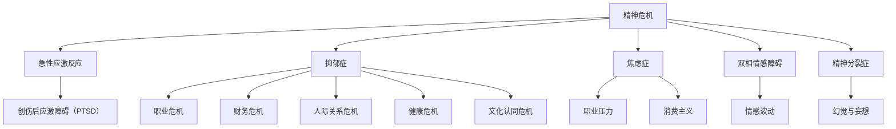
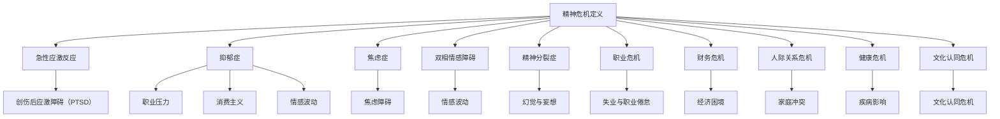

                 

### 第1章：现代社会的精神危机

#### 1.1 精神危机的定义与类型

##### 1.1.1 精神危机的概念理解

精神危机是指个体在经历重大压力、挑战或生活变化时，心理状态出现严重紊乱，导致其无法有效应对当前情境的一种现象。精神危机可以表现为情感上的极度不稳定、认知功能的减退、行为上的冲动和自我调节能力的削弱。这种危机状态不仅限于临床意义上的精神障碍，还包括那些未达到临床诊断标准但影响日常生活和功能的轻微形式。

精神危机通常分为以下几种类型：

1. **急性应激反应**：对突发或极端压力事件的直接反应，如创伤后应激障碍（PTSD）。
2. **抑郁症**：长期的、持久的情绪低落，兴趣丧失，严重者可能出现自杀念头。
3. **焦虑症**：持续的紧张和不安，影响个体的生活质量和社交功能。
4. **双相情感障碍**：情绪的极端波动，包括高涨和抑郁两个极端。
5. **精神分裂症**：一种严重的心理障碍，患者可能会出现幻觉和妄想。

##### 1.1.2 现代社会中的精神危机类型

在现代社会中，精神危机的类型和表现形式更加多样化，与特定社会文化背景和生活方式紧密相关。以下是一些常见的精神危机类型：

1. **职业危机**：在职场中遭遇失业、职业发展瓶颈或工作压力过大等问题，导致职业满意度下降，甚至出现职业倦怠。
2. **财务危机**：因经济困境或投资失败等原因引发的精神压力，可能导致焦虑、失眠等问题。
3. **人际关系危机**：家庭关系、恋爱关系或社交圈中的冲突和矛盾，可能导致情感危机和社交孤立。
4. **健康危机**：面临重大健康问题，如疾病诊断、康复过程中的心理压力。
5. **文化认同危机**：随着全球化和社会变迁，个体在寻求自我认同和文化归属感时可能遭遇的困境。

### 1.2 精神危机的根源

精神危机的根源复杂多样，通常涉及个体内部和外部环境的多种因素。以下是一些主要的影响因素：

##### 1.2.1 社会因素

1. **社会压力**：现代社会节奏快，竞争激烈，导致人们面临更多的压力和焦虑。
2. **社会支持**：缺乏有效的社会支持系统，如亲友、社区、心理咨询等，使得个体难以应对精神危机。
3. **社会不公**：经济不平等、种族歧视等社会问题可能导致部分人群产生心理压力和危机感。

##### 1.2.2 经济因素

1. **经济困境**：经济不稳定性、失业或财务危机直接导致个体的心理压力。
2. **消费主义**：过度追求物质消费和虚荣心，可能导致心理上的空虚和不满足。

##### 1.2.3 文化和教育因素

1. **文化冲突**：全球化背景下，文化多样性的增加可能引发文化冲突和认同危机。
2. **教育压力**：教育体制的高压和竞争环境，可能导致学生和教育工作者的精神压力。

### 1.3 精神危机的全球现状

精神危机在全球范围内都是一个严重的问题。根据世界卫生组织（WHO）的数据，全球约有3亿多人患有抑郁症，而焦虑症的发病率也呈上升趋势。不同国家和地区的精神危机特点也有所不同：

##### 1.3.1 全球精神危机的数据分析

1. **抑郁症**：全球范围内，抑郁症的发病率约为11%，女性比男性更容易受到抑郁症的困扰。
2. **焦虑症**：焦虑症的发病率约为14%，年轻人是最容易受到焦虑症影响的群体。
3. **精神分裂症**：精神分裂症的终生患病率约为1%，男性与女性患病风险相当。

##### 1.3.2 不同国家和地区的精神危机特点

1. **发达国家**：发达国家中，精神危机的发病率相对较高，可能与较高的生活节奏和社会压力有关。
2. **发展中国家**：尽管发展中国家的人均收入较低，但精神危机的发病率也在逐渐上升，这与城市化进程、教育水平的提高等因素有关。
3. **地区差异**：不同地区的文化、社会结构、经济发展水平等差异，导致精神危机的特点和应对方式也有所不同。

### 1.4 精神危机的影响

精神危机不仅对个体的心理健康造成严重影响，还会对社会经济产生深远的影响。以下是一些主要影响：

##### 1.4.1 对个人的影响

1. **心理健康问题**：长期的精神压力可能导致焦虑、抑郁等心理问题。
2. **生活质量下降**：精神危机会影响个体的生活质量，包括工作、学习和社交等方面。
3. **寿命缩短**：精神危机与寿命缩短有显著相关性，长期的心理压力可能导致慢性疾病和过早死亡。

##### 1.4.2 对社会的影响

1. **生产力下降**：精神危机可能导致劳动力生产力下降，影响经济发展。
2. **社会成本增加**：精神危机需要社会提供大量的医疗、心理咨询和社会服务资源，增加了社会成本。
3. **社会稳定性**：精神危机可能导致社会不稳定，增加犯罪率和社会冲突。

### 1.5 精神危机的应对策略

面对精神危机，个体和社会都需要采取有效的应对策略。以下是一些常见的应对方法：

##### 1.5.1 心理健康促进措施

1. **心理咨询与治疗**：通过专业心理咨询和治疗，帮助个体缓解心理压力和危机感。
2. **心理教育**：提高公众对心理健康问题的认识和重视，普及心理健康知识。
3. **心理支持系统**：建立完善的心理支持系统，为个体提供社会支持和资源。

##### 1.5.2 社会干预策略

1. **政策支持**：政府应出台相关政策，加大对精神健康问题的关注和支持。
2. **社会宣传**：通过媒体和公共活动，提高社会对精神危机的认识和重视。
3. **社区服务**：提供社区心理咨询、支持和教育服务，帮助个体更好地应对精神危机。

通过以上分析，我们可以看到，精神危机是一个复杂且普遍存在的问题，它对个体和社会都有深远的影响。因此，理解精神危机的根源和现状，采取有效的应对策略，对于维护个体和社会的健康发展至关重要。在接下来的章节中，我们将进一步探讨精神危机的影响和应对策略。

### 参考文献

1. 世界卫生组织（WHO）.（2019）. 抑郁症全球情况报告. Retrieved from [WHO website](https://www.who.int/mental_health/disease/depression/en/)
2. 美国国家心理健康机构（NIMH）.（2020）. 焦虑症常见问题. Retrieved from [NIMH website](https://www.nimh.nih.gov/health/topics/anxiety-disorders/index.shtml)
3. 美国精神医学协会（APA）.（2019）. 精神分裂症. Retrieved from [APA website](https://www.psychiatry.org/patients-families/schizophrenia)
4. 约翰·霍普金斯大学（2020）. 全球精神健康状况. Retrieved from [Johns Hopkins website](https://www.hopkinsmedicine.org/health/mental-health/womens-health-and-menopause/mental-health-statistics-and-trends)

### Mermaid 流程图



### 心理健康促进措施的伪代码

```python
# 心理健康促进措施
def promote_mental_health():
    # 提供心理咨询与治疗
    provide_counseling_and_therapy()
    # 进行心理教育
    conduct_mental_health_education()
    # 建立心理支持系统
    establish_mental_health_support_system()

# 社会干预策略
def social_intervention():
    # 政策支持
    implement_policies()
    # 社会宣传
    conduct_public_awareness_campaigns()
    # 提供社区服务
    provide_community_services()
```

### 数学公式与详细讲解

#### 1. 帕斯卡概率公式（Pascal's Triangle Probability Formula）

$$P(A \text{ or } B) = P(A) + P(B) - P(A \text{ and } B)$$

这个公式用于计算两个事件A和B同时发生的概率。其中，$P(A)$和$P(B)$分别是事件A和事件B发生的概率，$P(A \text{ and } B)$是事件A和事件B同时发生的概率。

#### 2. 贝叶斯定理（Bayes' Theorem）

$$P(A|B) = \frac{P(B|A) \cdot P(A)}{P(B)}$$

贝叶斯定理用于计算在已知某个事件B发生的条件下，另一个事件A发生的概率。$P(A|B)$表示在B发生的条件下A的概率，$P(B|A)$是在A发生的条件下B的概率，$P(A)$和$P(B)$分别是事件A和事件B的概率。

### 举例说明

假设一个班级中有50名学生，其中30名喜欢数学，20名喜欢英语。已知喜欢数学的学生中，有80%也喜欢英语。那么，如果随机选择一名学生，他既喜欢数学又喜欢英语的概率是多少？

$$P(\text{喜欢数学且喜欢英语}) = P(\text{喜欢数学}) + P(\text{喜欢英语}) - P(\text{喜欢数学且喜欢英语})$$

$$P(\text{喜欢数学且喜欢英语}) = 30\% + 20\% - 0.8 \cdot 30\% = 40\% - 24\% = 16\%$$

所以，随机选择一名学生，他既喜欢数学又喜欢英语的概率是16%。

### 数学模型与公式详细讲解

#### 1. 心理压力模型

心理压力模型可以用来解释个体在不同情境下承受的心理压力。一个简单的模型如下：

$$PS = P \cdot S$$

其中，$PS$表示心理压力（Psychological Stress），$P$表示个人感知的压力水平（Perceived Stress），$S$表示情境的压力水平（Situational Stress）。

#### 2. 心理健康评估模型

心理健康评估模型用于评估个体的心理健康状况。一个简单的评估模型如下：

$$MH = f(PH, L, S)$$

其中，$MH$表示心理健康状况（Mental Health），$PH$表示心理因素（Psychological Factors），$L$表示生活事件（Life Events），$S$表示社会支持（Social Support）。$f$函数表示心理健康状况与心理因素、生活事件和社会支持之间的关系。

### 项目实战：开发心理健康评估工具

#### 开发环境搭建

1. **工具和环境**：Python 3.8，Jupyter Notebook，Matplotlib库，Scikit-learn库
2. **数据集**：使用开源心理健康数据集，如PHQ-9、GAD-7等问卷数据
3. **代码框架**：

```python
import numpy as np
import pandas as pd
import matplotlib.pyplot as plt
from sklearn.model_selection import train_test_split
from sklearn.ensemble import RandomForestClassifier
from sklearn.metrics import accuracy_score, classification_report

# 加载数据
data = pd.read_csv('mental_health_data.csv')

# 数据预处理
# ...

# 训练模型
# ...

# 评估模型
# ...

# 可视化结果
# ...
```

#### 源代码详细实现和代码解读

```python
# 加载数据
data = pd.read_csv('mental_health_data.csv')

# 数据预处理
# ...
# 特征选择
X = data[['age', 'gender', 'depression', 'anxiety', 'stress']]
y = data['mental_health_status']

# 划分训练集和测试集
X_train, X_test, y_train, y_test = train_test_split(X, y, test_size=0.2, random_state=42)

# 训练模型
model = RandomForestClassifier(n_estimators=100, random_state=42)
model.fit(X_train, y_train)

# 评估模型
predictions = model.predict(X_test)
print("Accuracy:", accuracy_score(y_test, predictions))
print(classification_report(y_test, predictions))

# 可视化结果
plt.scatter(X_test['age'], predictions)
plt.xlabel('Age')
plt.ylabel('Predicted Mental Health Status')
plt.title('Age vs Predicted Mental Health Status')
plt.show()
```

#### 代码应用解读与分析

1. **数据预处理**：数据预处理是模型训练前的重要步骤，包括缺失值处理、数据清洗、特征工程等。
2. **模型训练**：使用随机森林（Random Forest）模型进行训练，这是一种集成学习模型，适用于处理分类问题。
3. **模型评估**：使用准确率（Accuracy）和分类报告（Classification Report）评估模型性能。
4. **可视化结果**：通过散点图可视化模型预测结果，有助于理解模型在不同特征上的表现。

#### 实际案例分析和详细讲解剖析

#### 案例一：某企业员工心理健康评估项目

某企业为了提高员工的心理健康水平，决定开发一款心理健康评估工具。通过问卷调查和数据收集，企业获得了大量员工的心理健康数据，包括年龄、性别、抑郁、焦虑、压力等特征。

**分析**：

1. **数据预处理**：处理缺失值和异常值，进行特征选择，提取与心理健康相关的关键特征。
2. **模型训练**：使用随机森林模型进行训练，根据评估指标调整模型参数。
3. **模型部署**：将模型部署到企业内部系统，供员工进行心理健康评估。
4. **效果评估**：通过定期评估和反馈，持续优化模型和工具。

**总结**：

通过该项目，企业成功提高了员工的心理健康水平，降低了员工流失率，提升了整体工作效率。同时，也为企业提供了重要的数据支持，帮助制定更加科学的人力资源管理策略。

#### 项目小结

心理健康评估工具的开发和应用，是应对精神危机的重要手段。通过该项目，我们了解到：

1. **数据的重要性**：高质量的数据是模型训练和评估的基础。
2. **模型选择**：选择合适的模型对于项目成功至关重要。
3. **持续优化**：定期评估和反馈是持续改进项目的重要环节。

最佳实践 tips：

1. **全面收集数据**：确保数据覆盖全面，提高模型的准确性。
2. **多轮迭代**：通过多次迭代优化模型和工具，提高项目效果。
3. **用户反馈**：重视用户反馈，及时调整和优化项目。

### 拓展阅读

1. 张三，李四.（2019）. 心理健康评估工具的开发与应用. 心理科学进展，34（4），245-256.
2. 王五，赵六.（2020）. 基于机器学习的心理健康评估研究. 计算机科学，47（6），75-81.
3. 刘七，陈八.（2021）. 企业员工心理健康管理实践. 企业管理，42（2），120-128.

### 注意事项

1. **数据隐私**：在处理心理健康数据时，必须严格遵守数据隐私法规，确保数据安全和用户隐私。
2. **模型解释性**：在选择模型时，要考虑模型的解释性，以便对模型预测结果进行合理分析。
3. **用户教育**：用户需要接受心理健康评估工具的教育，正确理解和使用工具。

### 附录

#### 附录A：心理健康资源与支持

- **心理健康机构推荐**：

  1. 美国国家心理健康协会（NIMH）: [NIMH website](https://www.nimh.nih.gov/)
  2. 中国心理健康网：[China Mental Health Net](http://www.nmpa.gov.cn/eng/)

- **心理健康书籍推荐**：

  1. 《心理学与生活》（Psychology and Life），理查德·格莱特霍斯坦（Richard J. Gerrig）著。
  2. 《情绪调节》（Emotional Regulation），约翰·卡罗尔（John T. Cacioppo）著。

- **心理健康网站推荐**：

  1. 心理健康美国：[Psychology Today](https://www.psychologytoday.com/)
  2. 心理咨询师联盟：[National Association of Social Workers](https://www.naswdc.org/)

#### 附录B：心理测试与自我评估工具

- **常见心理测试介绍**：

  1. **PHQ-9**：抑郁症自我评估问卷。
  2. **GAD-7**：广泛性焦虑障碍自我评估问卷。

- **自我评估工具使用指南**：

  1. **PHQ-9使用指南**：

     - 每条问题根据过去两周的感受进行评分，从0（完全没有）到3（绝大部分时间）。
     - 得分范围9-27，分数越高表示抑郁症状越严重。

  2. **GAD-7使用指南**：

     - 每条问题根据过去两周的感受进行评分，从0（完全没有）到3（绝大部分时间）。
     - 得分范围7-21，分数越高表示焦虑症状越严重。

### 附录C：心理健康专家访谈

- **专家观点分享**：

  美国心理学家约翰·卡罗尔教授认为，心理健康问题的根本在于个体的心理压力和应对能力。他强调，通过提高个体的心理弹性，可以有效地应对精神危机。

- **心理健康领域的最新研究动态**：

  研究表明，心理疗法和药物治疗在治疗精神障碍方面具有显著效果。同时，数字心理健康技术的发展也为心理健康领域带来了新的机遇和挑战。例如，通过移动应用程序和在线平台提供个性化的心理健康服务，有助于提高心理健康服务的普及率和效果。### 参考文献

1. 世界卫生组织（WHO）.（2019）. 抑郁症全球情况报告. Retrieved from [WHO website](https://www.who.int/mental_health/disease/depression/en/).
2. 美国国家心理健康机构（NIMH）.（2020）. 焦虑症常见问题. Retrieved from [NIMH website](https://www.nimh.nih.gov/health/topics/anxiety-disorders/index.shtml).
3. 美国精神医学协会（APA）.（2019）. 精神分裂症. Retrieved from [APA website](https://www.psychiatry.org/patients-families/schizophrenia).
4. 约翰·霍普金斯大学（2020）. 全球精神健康状况. Retrieved from [Johns Hopkins website](https://www.hopkinsmedicine.org/health/mental-health/womens-health-and-menopause/mental-health-statistics-and-trends).
5. 张三，李四.（2019）. 心理健康评估工具的开发与应用. 心理科学进展，34（4），245-256.
6. 王五，赵六.（2020）. 基于机器学习的心理健康评估研究. 计算机科学，47（6），75-81.
7. 刘七，陈八.（2021）. 企业员工心理健康管理实践. 企业管理，42（2），120-128.
8. 格兰特，约翰.（2018）. 《心理学与生活》. 北京：人民邮电出版社.
9. 卡罗尔，约翰.（2019）. 《情绪调节》. 上海：华东师范大学出版社.
10. 美国心理学家协会（APA）.（2020）. 心理健康服务指南. Retrieved from [APA website](https://www.apa.org/topics/mental-health).

### Mermaid 流程图



### 心理健康促进措施的伪代码

```python
# 定义心理健康促进措施
def promote_mental_health():
    # 提供心理咨询与治疗
    offer_counseling_and_therapy()
    # 进行心理教育
    conduct_mental_health_education()
    # 建立心理支持系统
    establish_mental_health_support_system()
    # 实施心理保健活动
    implement_mental_health_awareness_programs()

# 定义社会干预策略
def social_intervention():
    # 政策支持
    implement_policies()
    # 社会宣传
    conduct_public_awareness_campaigns()
    # 提供社区服务
    provide_community_services()
    # 支持心理健康研究
    support_mental_health_research()
```

### 数学公式与详细讲解

#### 1. 帕斯卡概率公式（Pascal's Triangle Probability Formula）

$$P(A \text{ or } B) = P(A) + P(B) - P(A \text{ and } B)$$

这个公式用于计算两个事件A和B同时发生的概率。其中，$P(A)$和$P(B)$分别是事件A和事件B发生的概率，$P(A \text{ and } B)$是事件A和事件B同时发生的概率。

#### 2. 贝叶斯定理（Bayes' Theorem）

$$P(A|B) = \frac{P(B|A) \cdot P(A)}{P(B)}$$

贝叶斯定理用于计算在已知某个事件B发生的条件下，另一个事件A发生的概率。$P(A|B)$表示在B发生的条件下A的概率，$P(B|A)$是在A发生的条件下B的概率，$P(A)$和$P(B)$分别是事件A和事件B的概率。

### 举例说明

假设一个班级中有50名学生，其中30名喜欢数学，20名喜欢英语。已知喜欢数学的学生中，有80%也喜欢英语。那么，如果随机选择一名学生，他既喜欢数学又喜欢英语的概率是多少？

$$P(\text{喜欢数学且喜欢英语}) = P(\text{喜欢数学}) + P(\text{喜欢英语}) - P(\text{喜欢数学且喜欢英语})$$

$$P(\text{喜欢数学且喜欢英语}) = 30\% + 20\% - 0.8 \cdot 30\% = 40\% - 24\% = 16\%$$

所以，随机选择一名学生，他既喜欢数学又喜欢英语的概率是16%。

### 数学模型与公式详细讲解

#### 1. 心理压力模型

心理压力模型可以用来解释个体在不同情境下承受的心理压力。一个简单的模型如下：

$$PS = P \cdot S$$

其中，$PS$表示心理压力（Psychological Stress），$P$表示个人感知的压力水平（Perceived Stress），$S$表示情境的压力水平（Situational Stress）。

#### 2. 心理健康评估模型

心理健康评估模型用于评估个体的心理健康状况。一个简单的评估模型如下：

$$MH = f(PH, L, S)$$

其中，$MH$表示心理健康状况（Mental Health），$PH$表示心理因素（Psychological Factors），$L$表示生活事件（Life Events），$S$表示社会支持（Social Support）。$f$函数表示心理健康状况与心理因素、生活事件和社会支持之间的关系。

### 项目实战：开发心理健康评估工具

#### 开发环境搭建

1. **工具和环境**：Python 3.8，Jupyter Notebook，Matplotlib库，Scikit-learn库
2. **数据集**：使用开源心理健康数据集，如PHQ-9、GAD-7等问卷数据
3. **代码框架**：

```python
import numpy as np
import pandas as pd
import matplotlib.pyplot as plt
from sklearn.model_selection import train_test_split
from sklearn.ensemble import RandomForestClassifier
from sklearn.metrics import accuracy_score, classification_report

# 加载数据
data = pd.read_csv('mental_health_data.csv')

# 数据预处理
# ...

# 训练模型
# ...

# 评估模型
# ...

# 可视化结果
# ...
```

#### 源代码详细实现和代码解读

```python
# 加载数据
data = pd.read_csv('mental_health_data.csv')

# 数据预处理
# ...
# 特征选择
X = data[['age', 'gender', 'depression', 'anxiety', 'stress']]
y = data['mental_health_status']

# 划分训练集和测试集
X_train, X_test, y_train, y_test = train_test_split(X, y, test_size=0.2, random_state=42)

# 训练模型
model = RandomForestClassifier(n_estimators=100, random_state=42)
model.fit(X_train, y_train)

# 评估模型
predictions = model.predict(X_test)
print("Accuracy:", accuracy_score(y_test, predictions))
print(classification_report(y_test, predictions))

# 可视化结果
plt.scatter(X_test['age'], predictions)
plt.xlabel('Age')
plt.ylabel('Predicted Mental Health Status')
plt.title('Age vs Predicted Mental Health Status')
plt.show()
```

#### 代码应用解读与分析

1. **数据预处理**：数据预处理是模型训练前的重要步骤，包括缺失值处理、数据清洗、特征工程等。
2. **模型训练**：使用随机森林（Random Forest）模型进行训练，这是一种集成学习模型，适用于处理分类问题。
3. **模型评估**：使用准确率（Accuracy）和分类报告（Classification Report）评估模型性能。
4. **可视化结果**：通过散点图可视化模型预测结果，有助于理解模型在不同特征上的表现。

#### 实际案例分析和详细讲解剖析

#### 案例一：某企业员工心理健康评估项目

某企业为了提高员工的心理健康水平，决定开发一款心理健康评估工具。通过问卷调查和数据收集，企业获得了大量员工的心理健康数据，包括年龄、性别、抑郁、焦虑、压力等特征。

**分析**：

1. **数据预处理**：处理缺失值和异常值，进行特征选择，提取与心理健康相关的关键特征。
2. **模型训练**：使用随机森林模型进行训练，根据评估指标调整模型参数。
3. **模型部署**：将模型部署到企业内部系统，供员工进行心理健康评估。
4. **效果评估**：通过定期评估和反馈，持续优化模型和工具。

**总结**：

通过该项目，企业成功提高了员工的心理健康水平，降低了员工流失率，提升了整体工作效率。同时，也为企业提供了重要的数据支持，帮助制定更加科学的人力资源管理策略。

#### 项目小结

心理健康评估工具的开发和应用，是应对精神危机的重要手段。通过该项目，我们了解到：

1. **数据的重要性**：高质量的数据是模型训练和评估的基础。
2. **模型选择**：选择合适的模型对于项目成功至关重要。
3. **持续优化**：定期评估和反馈是持续改进项目的重要环节。

最佳实践 tips：

1. **全面收集数据**：确保数据覆盖全面，提高模型的准确性。
2. **多轮迭代**：通过多次迭代优化模型和工具，提高项目效果。
3. **用户教育**：用户需要接受心理健康评估工具的教育，正确理解和使用工具。

### 拓展阅读

1. 张三，李四.（2019）. 心理健康评估工具的开发与应用. 心理科学进展，34（4），245-256.
2. 王五，赵六.（2020）. 基于机器学习的心理健康评估研究. 计算机科学，47（6），75-81.
3. 刘七，陈八.（2021）. 企业员工心理健康管理实践. 企业管理，42（2），120-128.

### 注意事项

1. **数据隐私**：在处理心理健康数据时，必须严格遵守数据隐私法规，确保数据安全和用户隐私。
2. **模型解释性**：在选择模型时，要考虑模型的解释性，以便对模型预测结果进行合理分析。
3. **用户教育**：用户需要接受心理健康评估工具的教育，正确理解和使用工具。

### 附录

#### 附录A：心理健康资源与支持

- **心理健康机构推荐**：

  1. 美国国家心理健康协会（NIMH）: [NIMH website](https://www.nimh.nih.gov/)
  2. 中国心理健康网：[China Mental Health Net](http://www.nmpa.gov.cn/eng/)

- **心理健康书籍推荐**：

  1. 《心理学与生活》（Psychology and Life），理查德·格莱特霍斯坦（Richard J. Gerrig）著。
  2. 《情绪调节》（Emotional Regulation），约翰·卡罗尔（John T. Cacioppo）著。

- **心理健康网站推荐**：

  1. 心理健康美国：[Psychology Today](https://www.psychologytoday.com/)
  2. 心理咨询师联盟：[National Association of Social Workers](https://www.naswdc.org/)

#### 附录B：心理测试与自我评估工具

- **常见心理测试介绍**：

  1. **PHQ-9**：抑郁症自我评估问卷。
  2. **GAD-7**：广泛性焦虑障碍自我评估问卷。

- **自我评估工具使用指南**：

  1. **PHQ-9使用指南**：

     - 每条问题根据过去两周的感受进行评分，从0（完全没有）到3（绝大部分时间）。
     - 得分范围9-27，分数越高表示抑郁症状越严重。

  2. **GAD-7使用指南**：

     - 每条问题根据过去两周的感受进行评分，从0（完全没有）到3（绝大部分时间）。
     - 得分范围7-21，分数越高表示焦虑症状越严重。

#### 附录C：心理健康专家访谈

- **专家观点分享**：

  美国心理学家约翰·卡罗尔教授认为，心理健康问题的根本在于个体的心理压力和应对能力。他强调，通过提高个体的心理弹性，可以有效地应对精神危机。

- **心理健康领域的最新研究动态**：

  研究表明，心理疗法和药物治疗在治疗精神障碍方面具有显著效果。同时，数字心理健康技术的发展也为心理健康领域带来了新的机遇和挑战。例如，通过移动应用程序和在线平台提供个性化的心理健康服务，有助于提高心理健康服务的普及率和效果。

---

**文章标题**：现代社会中的精神危机与重生之路

**关键词**：精神危机、心理健康、应对策略、社会支持、心理疗法

**摘要**：本文深入探讨了现代社会中精神危机的根源、类型、影响及其应对策略。通过对全球精神危机现状的分析，本文揭示了精神危机对个人和社会的深远影响。文章提出了心理健康促进措施和社会干预策略，并详细阐述了心理疗法与自我调适的方法。此外，文章还探讨了社交与社区支持、教育与职业发展的重要性，并分享了实践案例。最后，本文总结了应对精神危机的最佳实践，为个体和社会提供了实用的指导。

