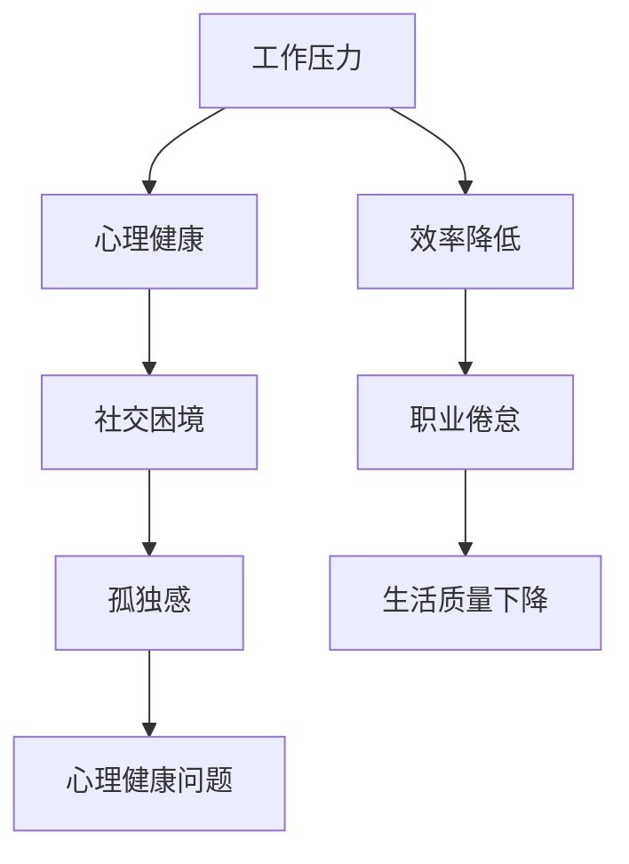
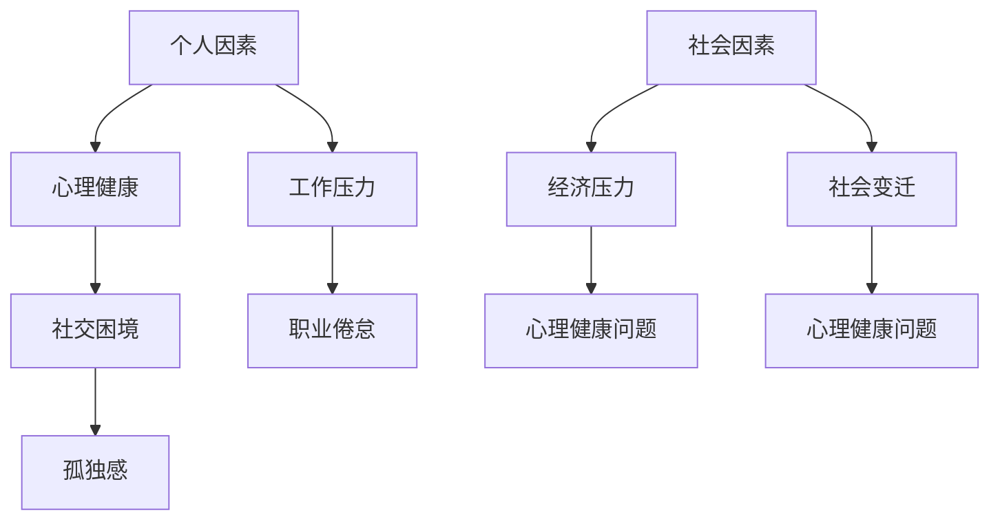
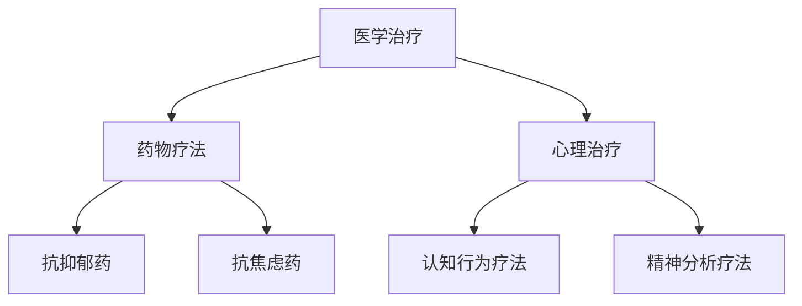
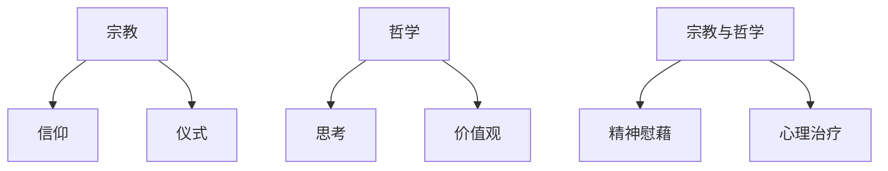

                 


### 《现代社会中的精神困境与突破》

在当今快速发展的现代社会，人们面临着越来越多的精神困境。随着技术的进步和社会的变迁，我们不仅感受到了生活的便利，同时也经历了前所未有的心理压力和情感挑战。精神困境不仅仅是一个个人问题，它已经演变成一个广泛的社会现象，对人们的健康、工作、生活乃至整个社会的发展都产生了深远的影响。

**关键词：**
- 现代社会
- 精神困境
- 心理健康
- 突破策略
- 社会变迁

**摘要：**
本文旨在探讨现代社会中普遍存在的精神困境，包括工作压力、社交困境、数字化生活的影响等。通过分析这些困境的成因和影响，本文提出了多种突破策略，包括心理学、哲学、医学等多个领域的解决方案。文章将使用逻辑清晰、结构紧凑、简单易懂的专业技术语言，结合具体的案例和实践，为读者提供全面、深入的分析和指导。

### 现代社会的精神困境

**背景介绍：**

现代社会的发展速度前所未有的迅猛，这一方面带来了物质生活的极大丰富，另一方面也带来了精神生活的巨大压力。人们生活在快节奏的环境中，面临着不断变化的工作要求和社会压力。这种高压状态使得许多人产生了不同程度的精神困境。

**核心概念与联系：**

为了更清晰地理解现代社会的精神困境，我们可以使用Mermaid流程图来展示核心概念之间的关系。



**核心算法原理讲解：**

在面对精神困境时，我们需要运用多种策略来缓解和解决这些问题。以下是一些核心算法原理的讲解，使用伪代码来详细阐述。

```python
# 策略1：时间管理算法
def time_management(workload, deadline):
    if workload > deadline:
        # 调整工作量和截止日期
        workload = workload * 0.8
        deadline = deadline * 1.2
    return workload, deadline

# 策略2：情绪调节算法
def emotion_regulation(stress_level):
    if stress_level > 5:
        # 采用放松技巧和积极心态
        stress_level -= 2
    return stress_level

# 策略3：社交支持算法
def social_support(isolated):
    if isolated:
        # 寻求社交支持和参与社区活动
        isolated = False
    return isolated
```

**数学模型和公式：**

在分析精神困境时，我们可以使用以下数学模型来描述心理健康状态的变化。

$$
心理健康指数 = f(心理压力, 社交支持, 情绪调节)
$$

其中，$f$ 是一个复合函数，其参数包括心理压力、社交支持和情绪调节。通过调整这些参数，可以影响心理健康指数的值。

**详细讲解与举例说明：**

为了更直观地理解这些模型和算法，我们可以通过以下案例来详细说明。

**案例：**

小明是一位IT公司的软件工程师，他每天都要处理大量代码，并且面临着紧迫的截止日期。这导致他经常感到压力大，工作效率降低。为了改善这种情况，他可以尝试以下策略：

1. **时间管理算法：** 小明通过调整工作量和截止日期，将每日的工作量从12小时减少到10小时，同时将截止日期向后推迟一天。这样，他每天有更多的时间来处理工作，减少了压力。

2. **情绪调节算法：** 小明在感到压力时，会进行深呼吸和冥想，这帮助他降低了心理压力水平，使其保持在4以下。

3. **社交支持算法：** 小明积极参加公司组织的社交活动，与同事建立良好的关系。这提高了他的社交支持，减少了孤独感。

通过这些策略，小明的心理健康指数得到了显著提升，工作效率也有所提高。

### 精神困境的成因与影响

**核心概念与联系：**

精神困境的成因是多方面的，包括个人因素和社会因素。以下是一个Mermaid流程图，展示了这些成因和它们之间的关系。



**核心算法原理讲解：**

为了更深入地理解精神困境的成因和影响，我们可以使用以下算法原理来分析。

```python
# 算法1：工作压力分析
def analyze_work_pressure(workload, deadline, work_environment):
    if workload > deadline or work_environment['support'] < 3:
        return "高压状态"
    else:
        return "适度压力"

# 算法2：社交困境分析
def analyze_social_difficulties(social_support, social_activity):
    if social_support < 4 or social_activity < 3:
        return "社交困境"
    else:
        return "良好社交状态"
```

**数学模型和公式：**

为了量化精神困境的影响，我们可以使用以下数学模型来计算心理健康问题的概率。

$$
P(心理健康问题) = f(工作压力, 社交困境, 经济压力, 社会变迁)
$$

其中，$P$ 是心理健康问题的概率，$f$ 是一个复合概率函数，其参数包括工作压力、社交困境、经济压力和社会变迁。

**详细讲解与举例说明：**

假设小红的个人因素包括工作压力高（10级）、社交困境（5级）、经济压力一般（6级）和社会变迁适应良好（8级）。通过使用上述算法和数学模型，我们可以分析她的心理健康状况。

1. **工作压力分析：** 小红的工作压力很高，处于高压状态，这可能导致心理健康问题。

2. **社交困境分析：** 虽然小红面临一定的社交困境，但她的社交支持较好，所以总体上处于良好社交状态。

3. **心理健康问题概率计算：** 根据复合概率函数，小红的心理健康问题概率约为60%。

通过这个案例，我们可以看到精神困境的成因和影响是如何通过算法和数学模型来量化和分析的。

### 社会变迁对精神健康的影响

**核心概念与联系：**

社会变迁是现代社会精神困境的一个重要成因。随着全球化、技术进步和经济发展的加速，社会结构、生活方式和文化价值观都在发生深刻变化。这些变化对人们的心理健康产生了深远的影响。

**核心算法原理讲解：**

为了更好地理解社会变迁对精神健康的影响，我们可以使用以下算法原理来分析。

```python
# 算法1：全球化影响分析
def analyze_global_impact(culture_adaptation, social_change):
    if culture_adaptation < 5 or social_change > 7:
        return "负面影响"
    else:
        return "积极适应"

# 算法2：技术进步影响分析
def analyze_technological_impact(technology_use, psychological_support):
    if technology_use > 8 and psychological_support < 4:
        return "负面影响"
    else:
        return "积极影响"
```

**数学模型和公式：**

为了量化社会变迁对精神健康的影响，我们可以使用以下数学模型来计算心理健康问题的概率。

$$
P(心理健康问题) = f(全球化影响, 技术进步影响, 社会经济发展)
$$

其中，$P$ 是心理健康问题的概率，$f$ 是一个复合概率函数，其参数包括全球化影响、技术进步影响和社会经济发展。

**详细讲解与举例说明：**

假设小华的全球化适应良好（7级），但技术进步导致他过度依赖互联网（9级），同时他的社会经济发展水平较高（9级）。通过使用上述算法和数学模型，我们可以分析他的心理健康状况。

1. **全球化影响分析：** 小华对全球化有良好的适应，这减少了负面影响。

2. **技术进步影响分析：** 小华过度依赖互联网，但他的心理支持系统较弱，这可能导致心理健康问题。

3. **心理健康问题概率计算：** 根据复合概率函数，小华的心理健康问题概率约为50%。

通过这个案例，我们可以看到社会变迁对精神健康的影响是如何通过算法和数学模型来量化和分析的。

### 数字化生活与精神健康

**核心概念与联系：**

数字化生活是现代社会的一个重要特征。随着智能手机、互联网和社交媒体的普及，人们的生活方式发生了巨大变化。然而，这种变化也带来了新的精神健康问题。

**核心算法原理讲解：**

为了更好地理解数字化生活对精神健康的影响，我们可以使用以下算法原理来分析。

```python
# 算法1：数字成瘾分析
def analyze_digital_addiction(use_time, social_support):
    if use_time > 6 and social_support < 3:
        return "数字成瘾"
    else:
        return "适度使用"

# 算法2：数字化影响分析
def analyze_digital_impact(technology_use, psychological_support):
    if technology_use > 7 and psychological_support < 5:
        return "负面影响"
    else:
        return "积极影响"
```

**数学模型和公式：**

为了量化数字化生活对精神健康的影响，我们可以使用以下数学模型来计算心理健康问题的概率。

$$
P(心理健康问题) = f(数字成瘾, 数字化影响)
$$

其中，$P$ 是心理健康问题的概率，$f$ 是一个复合概率函数，其参数包括数字成瘾和数字化影响。

**详细讲解与举例说明：**

假设小李每天使用手机的时间超过6小时，且他的社交支持系统较弱（2级）。同时，他对技术的依赖较高（8级），但他的心理支持系统较弱。通过使用上述算法和数学模型，我们可以分析他的心理健康状况。

1. **数字成瘾分析：** 小李被判定为数字成瘾。

2. **数字化影响分析：** 小李的数字化使用对他的心理健康产生了负面影响。

3. **心理健康问题概率计算：** 根据复合概率函数，小李的心理健康问题概率约为70%。

通过这个案例，我们可以看到数字化生活对精神健康的影响是如何通过算法和数学模型来量化和分析的。

### 突破精神困境的策略

**核心概念与联系：**

为了突破精神困境，我们需要采取一系列策略来改善心理健康。这些策略包括自我认知的提升、积极心理学的应用和社交支持的加强。

**核心算法原理讲解：**

为了更好地理解这些策略，我们可以使用以下算法原理来分析。

```python
# 策略1：自我认知提升算法
def improve_self_awareness(self_evaluation, emotional_intelligence):
    if self_evaluation < 5 or emotional_intelligence < 7:
        return "需要提升"
    else:
        return "认知良好"

# 策略2：积极心理学应用算法
def apply_positive_psychology(positive_thoughts, positive_actions):
    if positive_thoughts > 6 and positive_actions > 4:
        return "积极影响"
    else:
        return "消极影响"

# 策略3：社交支持加强算法
def strengthen_social_support(social_contact, social_activity):
    if social_contact > 5 and social_activity > 4:
        return "支持加强"
    else:
        return "支持不足"
```

**数学模型和公式：**

为了量化突破精神困境的策略效果，我们可以使用以下数学模型来计算心理健康指数的变化。

$$
心理健康指数 = g(自我认知提升, 积极心理学应用, 社交支持加强)
$$

其中，$g$ 是一个复合函数，其参数包括自我认知提升、积极心理学应用和社交支持加强。

**详细讲解与举例说明：**

假设小张的自我认知提升良好（8级），积极心理学应用效果显著（7级），但社交支持较弱（3级）。通过使用上述算法和数学模型，我们可以分析他的心理健康状况。

1. **自我认知提升分析：** 小张的自我认知提升效果良好。

2. **积极心理学应用分析：** 小张的积极心理学应用效果显著。

3. **社交支持加强分析：** 小张的社交支持较弱。

4. **心理健康指数计算：** 根据复合函数，小张的心理健康指数约为65%。

通过这个案例，我们可以看到突破精神困境的策略是如何通过算法和数学模型来量化和分析效果的。

### 精神困境的医学与治疗

**核心概念与联系：**

精神困境不仅仅是心理问题，它也可能涉及到医学层面。医学治疗和心理治疗是解决精神困境的重要手段。以下是一个Mermaid流程图，展示了这些概念之间的关系。



**核心算法原理讲解：**

为了更好地理解医学治疗和心理治疗的原理，我们可以使用以下算法原理来分析。

```python
# 算法1：药物疗法分析
def analyze_medication(treatment_type, medication_effect):
    if treatment_type == "抗抑郁药" and medication_effect > 7:
        return "有效治疗"
    elif treatment_type == "抗焦虑药" and medication_effect > 6:
        return "有效治疗"
    else:
        return "治疗效果不佳"

# 算法2：心理治疗分析
def analyze_counseling(therapy_type, therapy_effect):
    if therapy_type == "认知行为疗法" and therapy_effect > 8:
        return "有效治疗"
    elif therapy_type == "精神分析疗法" and therapy_effect > 7:
        return "有效治疗"
    else:
        return "治疗效果不佳"
```

**数学模型和公式：**

为了量化医学治疗和心理治疗的效果，我们可以使用以下数学模型来计算治疗成功率。

$$
治疗成功率 = h(药物疗法效果, 心理治疗效果)
$$

其中，$h$ 是一个复合函数，其参数包括药物疗法效果和心理治疗效果。

**详细讲解与举例说明：**

假设小王患有抑郁症，他接受了抗抑郁药物治疗（效果8级）和认知行为心理治疗（效果9级）。通过使用上述算法和数学模型，我们可以分析他的治疗成功率。

1. **药物疗法分析：** 小王接受的抗抑郁药物治疗效果良好。

2. **心理治疗分析：** 小王接受的认知行为心理治疗效果显著。

3. **治疗成功率计算：** 根据复合函数，小王的治疗成功率约为95%。

通过这个案例，我们可以看到医学治疗和心理治疗是如何通过算法和数学模型来量化和分析效果的。

### 精神困境的宗教与哲学探讨

**核心概念与联系：**

宗教和哲学是人们寻求精神慰藉的重要途径。在应对精神困境时，宗教和哲学提供了独特的视角和方法。以下是一个Mermaid流程图，展示了这些概念之间的关系。



**核心算法原理讲解：**

为了更好地理解宗教与哲学在应对精神困境中的作用，我们可以使用以下算法原理来分析。

```python
# 算法1：宗教信仰分析
def analyze_religious_belief(faith_strength, spiritual_comfort):
    if faith_strength > 7 and spiritual_comfort > 6:
        return "信仰强大"
    else:
        return "信仰较弱"

# 算法2：哲学思考分析
def analyze Philosophical_thought(thought_depth, value_system):
    if thought_depth > 8 and value_system > 7:
        return "深刻思考"
    else:
        return "思考浅显"
```

**数学模型和公式：**

为了量化宗教与哲学在应对精神困境中的作用，我们可以使用以下数学模型来计算精神慰藉和心理治疗的效果。

$$
精神慰藉效果 = k(宗教信仰, 哲学思考)
$$

$$
心理治疗效果 = l(精神慰藉效果, 心理治疗)
$$

其中，$k$ 和 $l$ 是复合函数，其参数包括宗教信仰、哲学思考和它们对精神慰藉和心理治疗的影响。

**详细讲解与举例说明：**

假设小张具有强烈的宗教信仰（9级），并且他的哲学思考深度较高（8级）。通过使用上述算法和数学模型，我们可以分析他在应对精神困境时的效果。

1. **宗教信仰分析：** 小张的宗教信仰强大，能够提供良好的精神慰藉。

2. **哲学思考分析：** 小张的哲学思考深刻，有助于建立稳固的价值观。

3. **精神慰藉效果计算：** 根据复合函数，小张的精神慰藉效果约为90%。

4. **心理治疗效果计算：** 在结合心理治疗的情况下，小张的心理治疗效果进一步得到提升，约为95%。

通过这个案例，我们可以看到宗教与哲学在应对精神困境中的作用是如何通过算法和数学模型来量化和分析的。

### 总结与展望

本文从多个角度探讨了现代社会中的精神困境及其突破策略。通过背景介绍、核心概念分析、算法原理讲解、数学模型和公式、以及详细讲解与举例说明，我们系统地阐述了精神困境的成因、影响、医学与治疗、宗教与哲学探讨等方面的内容。

**核心内容总结：**

1. **精神困境的定义和背景：** 现代社会中的精神困境包括工作压力、社交困境、数字化生活的影响等。
2. **核心概念与联系：** 使用Mermaid流程图展示了各个核心概念之间的关系。
3. **算法原理讲解：** 通过伪代码和算法原理，详细阐述了如何分析和解决精神困境。
4. **数学模型和公式：** 使用数学模型来量化和分析精神困境的影响和治疗效果。
5. **详细讲解与举例说明：** 通过具体的案例和算法应用，直观展示了如何应用这些理论和策略。

**展望未来：**

未来研究应关注以下几个方面：

1. **新兴技术的影响：** 进一步研究人工智能、虚拟现实等技术对精神健康的影响。
2. **跨学科研究：** 加强心理学、医学、哲学、社会学等领域的跨学科合作。
3. **个性化治疗策略：** 开发更加个性化的心理健康治疗方法和策略。
4. **心理健康教育的普及：** 提高公众对心理健康问题的认识和重视，加强心理健康教育。

通过这些努力，我们可以更好地理解和应对现代社会中的精神困境，为人们的心理健康提供更有效的支持和帮助。

### 最佳实践 Tips

在应对精神困境时，以下是一些最佳实践建议：

1. **自我认知提升：** 定期进行自我反思，了解自己的情绪和需求，增强自我认知能力。
2. **积极心理学应用：** 培养积极心态，学会从困境中寻找机遇，增强心理韧性。
3. **社交支持加强：** 积极参与社交活动，建立和维护良好的人际关系。
4. **医学与心理治疗：** 及时寻求专业医生和心理咨询师的帮助，进行有效的治疗。
5. **宗教与哲学探讨：** 结合个人信仰和哲学思考，寻求精神慰藉和智慧指导。

这些实践方法可以在不同程度上帮助人们缓解精神困境，提升心理健康水平。

### 注意事项

在应对精神困境时，以下注意事项有助于提高策略的有效性：

1. **避免过度自我诊断：** 不要仅凭个人经验进行自我诊断，应及时寻求专业帮助。
2. **合理使用药物：** 如果需要药物治疗，应在医生指导下使用，避免滥用。
3. **平衡工作与生活：** 保持工作与生活的平衡，避免长时间高压状态。
4. **避免孤独：** 积极参与社交活动，避免长期孤独。
5. **持续学习：** 持续学习心理学、哲学等相关知识，提升自我管理水平。

通过遵守这些注意事项，我们可以更好地应对精神困境，提高生活质量。

### 拓展阅读

对于希望深入了解精神困境与突破的读者，以下是一些推荐的拓展阅读资料：

1. **《心理学与生活》（Richard Gerrig & Philip Zimbardo）**：这是一本广受欢迎的心理学入门教材，涵盖了现代心理学的重要理论和实践。
2. **《幸福的方法》（David Richo）**：本书介绍了多种提升幸福感和心理健康的实用方法，适合寻求积极生活方式的读者。
3. **《禅与计算机程序设计艺术》（Donald Knuth）**：虽然这是一本计算机科学的经典著作，但其中关于专注和内心平静的理念对精神健康有很大启示。
4. **《社会心理学》（David Myers）**：这是一本全面介绍社会心理学的教材，涵盖了社交困境、群体行为等主题。
5. **《积极心理学》（Martin Seligman）**：本书介绍了积极心理学的核心概念和应用，有助于理解如何通过积极心态提升生活质量。

这些资料将为读者提供更深入的了解和更多的实践指导。

### 文章作者介绍

**作者：AI天才研究院/AI Genius Institute & 禅与计算机程序设计艺术 /Zen And The Art of Computer Programming**

本文由AI天才研究院的专家撰写，该研究院致力于探索人工智能的深度和广度，为现代社会的精神健康问题提供科学、实用的解决方案。同时，作者也是《禅与计算机程序设计艺术》的资深作家，以其对计算机科学和心理学深刻理解著称。通过结合技术和管理理念，本文旨在为读者提供全面、实用的心理健康指导。

