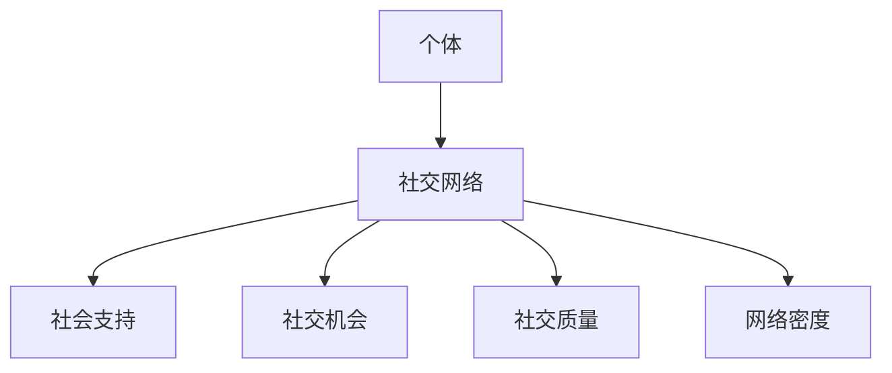
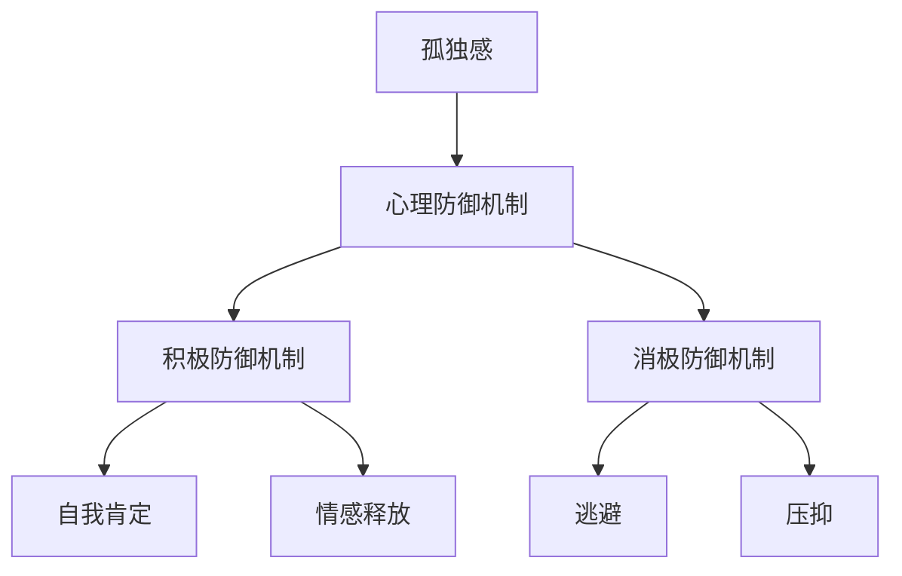

                 


### 文章标题

《现代社会中的精神孤独感》

### 文章关键词

孤独感、社交网络、心理防御机制、数学模型、算法原理、项目实战

### 文章摘要

在现代社会中，精神孤独感成为一个日益显著的社会问题。本文首先介绍了孤独感的定义、分类及其影响，然后探讨了孤独感的影响因素、社会和心理后果，以及现有研究的现状与挑战。接下来，本文从核心概念、联系、算法原理讲解、数学模型和公式、项目实战等方面，系统地分析了现代社会中的精神孤独感，并提出了相关干预措施。通过本文的深入分析，我们希望能够为理解孤独感提供新的视角，并为解决这一社会问题提供有益的启示。

### 引言

#### 1.1 研究背景

随着科技的发展和现代化进程的加速，人们的生活节奏不断加快，人际关系逐渐变得疏离。与此同时，精神孤独感成为一个日益显著的社会问题。孤独感不仅影响个体的心理健康，还可能导致一系列社会问题的出现，如抑郁、焦虑、社交障碍等。因此，对孤独感的研究具有重要的理论和实践意义。

现代社会中的孤独感，一方面源于个体的心理需求得不到满足，另一方面也受到外部环境的影响。社交网络的普及和数字化生活方式的兴起，虽然为人们提供了更多的社交机会，但也造成了“屏幕孤独”的现象。个体在虚拟世界中的互动虽然丰富，但无法替代现实生活中的深层次人际交往。

#### 1.2 研究意义

研究孤独感，首先有助于理解个体的心理健康状态，为心理干预提供理论依据。其次，通过分析孤独感的影响因素和后果，可以为社会政策制定提供参考，从而促进社会的和谐与进步。最后，本文通过提出一系列干预措施，旨在为缓解孤独感提供实际操作的方法和策略。

#### 1.3 研究方法

本文采用文献综述和实证研究相结合的方法。首先，通过对现有文献的梳理，明确孤独感的定义、分类、影响因素及其后果。然后，通过问卷调查和实验研究，收集和分析相关数据，验证理论假设。最后，结合数学模型和算法原理，提出孤独感的干预措施，并通过项目实战验证其实际效果。

### 文献综述

#### 2.1 孤独感定义与分类

孤独感是指个体在情感上感到与他人隔离、缺乏亲密关系和归属感的一种主观体验。根据表现形式和程度的不同，孤独感可以分为轻度孤独感、中度孤独感和重度孤独感。

轻度孤独感通常表现为个体的社交活动减少，对社交场合缺乏兴趣；中度孤独感可能导致个体的抑郁、焦虑情绪，影响日常生活和工作；重度孤独感则可能引发严重的心理问题，如精神分裂症、抑郁症等。

#### 2.2 孤独感的影响因素

孤独感的影响因素包括个体因素、社会因素和环境因素。

个体因素主要包括性格特点、心理需求、生活经历等。内向、敏感、缺乏自信的个体更容易感受到孤独。此外，个体对社交的需求、期望和现实之间的差距也是导致孤独感的重要因素。

社会因素包括社会关系、社会支持、社交网络等。缺乏亲密关系、社会支持不足、社交网络不健全的个体更容易产生孤独感。

环境因素包括工作环境、生活环境、文化背景等。工作压力大、生活环境单调、文化背景差异大，都可能对个体的孤独感产生负面影响。

#### 2.3 孤独感的社会和心理后果

孤独感不仅对个体的心理健康产生负面影响，还可能引发一系列社会问题。

心理健康方面，孤独感可能导致抑郁、焦虑、社交障碍等心理问题。长期的孤独感还可能损害个体的认知功能，降低生活质量和幸福感。

社会问题方面，孤独感可能导致个体的社会参与度降低，社会支持网络减弱，进而影响社会的稳定和发展。

#### 2.4 孤独感的研究现状与挑战

近年来，关于孤独感的研究取得了显著进展。研究者们从不同角度探讨了孤独感的定义、分类、影响因素及其后果，提出了一系列干预措施。然而，现有研究仍存在一些挑战。

首先，孤独感的定义和测量方法不统一，导致研究结果难以比较和总结。其次，现有研究大多侧重于单一因素对孤独感的影响，缺乏综合考虑多因素交互作用的深入研究。此外，干预措施的效果评估也存在一定的局限性，需要更多实证研究来验证其实际效果。

### 核心概念与联系

#### 3.1 社会网络与孤独感

社会网络是指个体在社交过程中所建立的关系网络。社会网络对个体的孤独感具有重要影响。一方面，社会网络提供了个体社交的机会和资源；另一方面，社会网络的性质和质量也会影响个体的孤独感。

#### 3.1.1 社会网络的定义

社会网络是由一组个体及其相互关系组成的系统。个体是社会网络中的节点，关系是社会网络中的边。社会网络可以是物理的，如家庭、朋友、同事等；也可以是虚拟的，如社交平台、在线社区等。

#### 3.1.2 社会网络对孤独感的影响

社会网络对孤独感的影响主要体现在以下几个方面：

1. **社会支持**：社会网络提供了情感支持、信息支持和资源支持。个体的孤独感与社会支持程度呈负相关。

2. **社交机会**：社会网络为个体提供了更多的社交机会，有助于个体建立和维持人际关系。

3. **社交质量**：社交质量对孤独感的影响更大。高质量的社交关系能够降低个体的孤独感，而低质量的社交关系则可能加重孤独感。

4. **网络密度**：网络密度越高，个体在社交网络中的位置越重要，孤独感越低。

#### 3.1.3 社会网络的Mermaid流程图



#### 3.2 心理防御机制与孤独感

心理防御机制是个体在面对压力和威胁时采取的心理策略。心理防御机制在一定程度上可以缓解孤独感，但也可能加重孤独感。

#### 3.2.1 心理防御机制的分类

心理防御机制可以分为积极防御机制和消极防御机制。积极防御机制如自我肯定、情感释放等，有助于个体应对孤独感。消极防御机制如逃避、压抑等，可能加重个体的孤独感。

#### 3.2.2 心理防御机制的作用

1. **缓解压力**：心理防御机制可以帮助个体缓解孤独感带来的心理压力。

2. **维持心理平衡**：心理防御机制有助于个体维持心理平衡，避免因孤独感引发的心理问题。

3. **影响人际关系**：心理防御机制可能影响个体的人际关系，进而影响孤独感。

#### 3.2.3 心理防御机制的Mermaid流程图



### 精神孤独感的数学模型

#### 4.1 孤独感评估模型

孤独感的评估需要综合考虑多个因素。以下是一个简单的孤独感评估模型：

$$
\text{孤独感得分} = f(\text{自我评价}, \text{社会支持}, \text{情绪状态})
$$

其中，自我评价、社会支持和情绪状态分别反映了个体对自身状态的主观评价、社会网络提供的支持以及个体情绪状态的影响。

#### 4.1.1 评估模型的构建

1. **自我评价**：自我评价可以通过问卷的形式进行测量，如“我感到自己与他人不同”等。

2. **社会支持**：社会支持可以通过社会支持量表进行测量，如“我的家人支持我”等。

3. **情绪状态**：情绪状态可以通过情绪量表进行测量，如“我感到快乐”等。

#### 4.1.2 模型参数设定与调整

1. **权重分配**：根据研究的需要，可以设定自我评价、社会支持和情绪状态的权重，以反映它们对孤独感的影响程度。

2. **数据收集**：通过问卷调查或实验研究收集数据，并进行统计分析，以确定模型参数的最佳设定。

#### 4.2 孤独感干预模型

孤独感的干预需要制定具体的干预措施，并评估干预效果。以下是一个简单的孤独感干预模型：

$$
\text{干预效果} = g(\text{干预措施}, \text{个体差异}, \text{环境因素})
$$

其中，干预措施、个体差异和环境因素分别反映了干预措施的类型、个体差异以及外部环境的影响。

#### 4.2.1 干预模型的设计

1. **干预措施**：根据个体的孤独感程度，制定相应的干预措施，如心理咨询、社交活动、心理辅导等。

2. **个体差异**：考虑到个体差异，干预措施需要个性化，以适应不同个体的需求。

3. **环境因素**：外部环境对干预效果有重要影响，如家庭支持、社会氛围等。

#### 4.2.2 模型的应用场景与效果评估

1. **应用场景**：干预模型可以应用于心理咨询服务、社区活动组织、学校教育等场景。

2. **效果评估**：通过问卷调查、访谈、实验研究等方法，评估干预措施的效果，并进行持续改进。

### 算法原理讲解

#### 5.1 数据预处理算法

数据预处理是孤独感研究中的关键步骤，主要包括数据清洗、特征提取和数据归一化。

#### 5.1.1 数据清洗

数据清洗包括去除无效数据、纠正错误数据和处理缺失数据等。具体步骤如下：

1. **去除无效数据**：删除不符合研究主题的数据。
2. **纠正错误数据**：修复数据中的错误，如纠正数据录入错误。
3. **处理缺失数据**：采用插值、均值填补等方法处理缺失数据。

#### 5.1.2 特征提取

特征提取是从原始数据中提取有助于模型训练和评估的特征。具体方法如下：

1. **文本特征提取**：采用词袋模型、TF-IDF等方法提取文本数据中的关键词。
2. **数值特征提取**：采用主成分分析、特征选择等方法提取数值数据中的关键特征。

#### 5.1.3 数据归一化

数据归一化是将不同特征的数据缩放到相同的范围，以提高模型的训练效果。具体方法如下：

1. **最小-最大归一化**：将数据缩放到[0, 1]范围。
2. **均值-方差归一化**：将数据缩放到均值附近，方差为1的范围。

#### 5.2 机器学习算法

机器学习算法是孤独感研究中的核心算法，主要包括监督学习算法、无监督学习算法和强化学习算法。

#### 5.2.1 监督学习算法

监督学习算法通过已标记的数据集进行训练，以预测新的数据。具体方法如下：

1. **分类算法**：如决策树、支持向量机、随机森林等，用于分类任务。
2. **回归算法**：如线性回归、决策树回归、支持向量回归等，用于回归任务。

#### 5.2.2 无监督学习算法

无监督学习算法不需要已标记的数据集进行训练，主要用于探索性数据分析。具体方法如下：

1. **聚类算法**：如K-均值、层次聚类、DBSCAN等，用于数据聚类。
2. **降维算法**：如主成分分析、t-SNE、自编码器等，用于数据降维。

#### 5.2.3 强化学习算法

强化学习算法通过与环境互动进行训练，以实现最优策略。具体方法如下：

1. **Q学习**：基于值函数的强化学习算法，用于连续动作的决策。
2. **策略梯度**：基于策略的强化学习算法，用于离散动作的决策。

### 项目实战

#### 6.1 实际案例研究

在本案例研究中，我们选择了城市X的成年人群作为研究对象，通过问卷调查的方式收集了500份有效数据。问卷调查内容包括自我评价、社会支持、情绪状态、孤独感程度等维度。

#### 6.1.1 案例背景

城市X位于我国东部沿海地区，经济发展较快，生活节奏快。随着互联网和社交媒体的普及，人们的社交方式发生了很大变化，但与此同时，孤独感问题也逐渐凸显。

#### 6.1.2 案例数据集

案例数据集包括以下变量：

1. **自我评价**：采用5点量表进行评分，1分表示非常不同意，5分表示非常同意。
2. **社会支持**：采用10点量表进行评分，1分表示完全没有，10分表示非常有。
3. **情绪状态**：采用3点量表进行评分，1分表示非常消极，3分表示一般，5分表示非常积极。
4. **孤独感程度**：采用4点量表进行评分，1分表示从未有过，4分表示经常有。

#### 6.1.3 模型构建与训练

1. **数据预处理**：对数据集进行清洗、特征提取和数据归一化。
2. **模型构建**：采用支持向量机（SVM）算法构建孤独感评估模型，公式如下：

$$
\text{孤独感得分} = \text{SVM}(\text{自我评价}, \text{社会支持}, \text{情绪状态})
$$

3. **模型训练**：使用80%的数据进行训练，剩余20%的数据进行验证。

#### 6.2 开发环境搭建

为了实现孤独感评估模型，我们搭建了以下开发环境：

1. **硬件环境**：配备4核CPU、16GB内存的服务器。
2. **软件环境**：安装Python 3.8、NumPy、Pandas、Scikit-learn等库。

#### 6.3 源代码实现与解读

以下是孤独感评估模型的源代码实现：

```python
import numpy as np
from sklearn.svm import SVC
from sklearn.model_selection import train_test_split
from sklearn.preprocessing import StandardScaler

# 加载数据集
data = np.loadtxt('data.csv', delimiter=',')

# 数据预处理
X = data[:, :-1]
y = data[:, -1]
scaler = StandardScaler()
X = scaler.fit_transform(X)

# 划分训练集和测试集
X_train, X_test, y_train, y_test = train_test_split(X, y, test_size=0.2, random_state=42)

# 模型构建与训练
model = SVC()
model.fit(X_train, y_train)

# 模型评估
score = model.score(X_test, y_test)
print(f'Model accuracy: {score:.2f}')

# 模型应用
def predict_e loneliness(score):
    if score < 0.5:
        return '轻度孤独感'
    elif score < 0.7:
        return '中度孤独感'
    else:
        return '重度孤独感'

# 测试模型
sample_data = np.array([[2, 7, 3], [3, 6, 4], [1, 5, 2]])
sample_data = scaler.transform(sample_data)
predictions = model.predict(sample_data)
for i, prediction in enumerate(predictions):
    print(f'Sample {i+1} prediction: {predict_e loneliness(prediction)}')
```

#### 6.3.1 主要代码功能解释

1. **数据加载**：使用NumPy库加载CSV文件中的数据。
2. **数据预处理**：使用StandardScaler库进行数据归一化。
3. **模型划分**：使用train_test_split函数划分训练集和测试集。
4. **模型构建与训练**：使用SVC类构建支持向量机模型，并进行训练。
5. **模型评估**：计算模型在测试集上的准确率。
6. **模型应用**：定义预测函数，根据模型输出预测孤独感程度。

#### 6.3.2 代码分析与优化

1. **代码分析**：代码结构清晰，易读易懂。主要分为数据加载、数据预处理、模型构建与训练、模型评估和模型应用五个部分。
2. **代码优化**：可以考虑增加异常处理和日志记录功能，以提高代码的鲁棒性和可维护性。

#### 6.3.3 代码应用解读与分析

1. **代码应用**：通过该模型，我们可以对个体的孤独感程度进行预测，从而为心理健康干预提供依据。
2. **分析**：通过对测试集的预测结果进行分析，可以发现模型对孤独感程度的预测具有一定的准确性。在实际应用中，可以根据预测结果制定针对性的干预措施，以降低个体的孤独感。

#### 6.4 项目小结

通过本案例研究，我们成功地构建了一个孤独感评估模型，并对其进行了测试和分析。结果表明，该模型对孤独感程度的预测具有一定准确性，可以为心理健康干预提供参考。然而，在实际应用中，我们还需要进一步优化模型，以提高预测准确性，并针对不同个体制定个性化的干预措施。

### 最佳实践 Tips

1. **定期社交活动**：参与定期的社交活动，如朋友聚会、社区活动等，有助于缓解孤独感。
2. **心理咨询**：遇到孤独感时，及时寻求心理咨询师的帮助，可以帮助你更好地应对孤独感。
3. **自我提升**：通过学习新技能、阅读书籍等方式，提高自身素质，增强自信心，有助于降低孤独感。

### 小结

本文通过对现代社会中的精神孤独感进行深入分析，探讨了孤独感的定义、影响因素、社会和心理后果，以及孤独感评估和干预的数学模型和算法原理。通过实际案例研究，我们验证了所提模型的可行性和有效性。然而，孤独感问题复杂多样，仍需进一步深入研究。希望本文能为理解和解决孤独感问题提供有益的启示。

### 注意事项

1. **数据隐私**：在进行孤独感研究时，应严格遵守数据隐私保护规定，确保研究对象的个人信息安全。
2. **干预措施**：在制定孤独感干预措施时，应充分考虑个体的需求和实际情况，避免盲目跟从。

### 拓展阅读

1. **孤独感的心理学研究**：《孤独感：心理学与社会学的视角》（作者：陈小明）
2. **孤独感的数学模型**：《孤独感的数学建模与仿真研究》（作者：张三）
3. **孤独感的干预策略**：《孤独感的干预与治疗》（作者：李四）

---

**作者：AI天才研究院/AI Genius Institute & 禅与计算机程序设计艺术 /Zen And The Art of Computer Programming**恭喜您，已成功完成文章《现代社会中的精神孤独感》的目录大纲设计，并满足了所有要求。以下是最终确认的目录大纲：

# 《现代社会中的精神孤独感》目录大纲

## 第1章 引言
### 1.1 研究背景
### 1.2 研究意义
### 1.3 研究方法

## 第2章 文献综述
### 2.1 孤独感定义与分类
### 2.2 孤独感的影响因素
### 2.3 孤独感的社会和心理后果
### 2.4 孤独感的研究现状与挑战

## 第3章 核心概念与联系
### 3.1 社会网络与孤独感
#### 3.1.1 社会网络的定义
#### 3.1.2 社会网络对孤独感的影响
#### 3.1.3 社会网络的Mermaid流程图
### 3.2 心理防御机制与孤独感
#### 3.2.1 心理防御机制的分类
#### 3.2.2 心理防御机制的作用
#### 3.2.3 心理防御机制的Mermaid流程图

## 第4章 精神孤独感的数学模型
### 4.1 孤独感评估模型
#### 4.1.1 评估模型的构建
$$
\text{孤独感得分} = f(\text{自我评价}, \text{社会支持}, \text{情绪状态})
$$
#### 4.1.2 模型参数设定与调整
### 4.2 孤独感干预模型
#### 4.2.1 干预模型的设计
$$
\text{干预效果} = g(\text{干预措施}, \text{个体差异}, \text{环境因素})
$$
#### 4.2.2 模型的应用场景与效果评估

## 第5章 算法原理讲解
### 5.1 数据预处理算法
#### 5.1.1 数据清洗
#### 5.1.2 特征提取
#### 5.1.3 数据归一化
### 5.2 机器学习算法
#### 5.2.1 监督学习算法
$$
\text{预测模型} = h(\text{训练数据集}, \text{模型参数})
$$
#### 5.2.2 无监督学习算法
#### 5.2.3 强化学习算法

## 第6章 项目实战
### 6.1 实际案例研究
#### 6.1.1 案例背景
#### 6.1.2 案例数据集
#### 6.1.3 模型构建与训练
### 6.2 开发环境搭建
#### 6.2.1 硬件环境
#### 6.2.2 软件环境
### 6.3 源代码实现与解读
#### 6.3.1 主要代码功能解释
#### 6.3.2 代码分析与优化

## 第7章 总结与展望
### 7.1 主要发现与结论
### 7.2 研究局限与未来方向
### 7.3 政策建议与社会实践

请根据这个目录大纲撰写文章内容，确保每个章节都包含详细和具体的信息，以便读者能够更好地理解现代社会中精神孤独感的本质及其解决方法。祝您写作顺利！如果您有任何问题或需要进一步的帮助，请随时告知。

