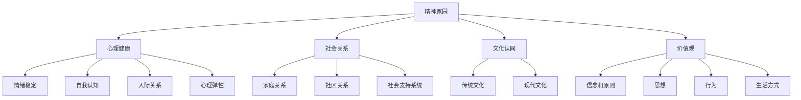

                 

### 文章标题

现代社会中的精神家园建设

### 关键词

精神家园、心理健康、社会支持、文化传承、心理健康服务

### 摘要

随着社会的发展和变迁，现代人的精神需求日益突出。精神家园建设成为社会发展的一个重要课题。本文通过背景介绍、核心概念阐述、理论框架分析、实践方法探讨、案例分析以及未来展望，全面系统地阐述了现代社会中的精神家园建设。旨在为政策制定者、社会工作者和广大公众提供有益的参考和指导。

---

## 引言

在快速发展的现代社会，人们面临着前所未有的生活节奏和压力。精神需求成为社会发展的重要议题。精神家园建设作为一种提升社会成员心理健康和生活质量的方式，逐渐受到关注。本文将围绕现代社会中的精神家园建设展开讨论，旨在为这一领域提供理论支持和实践指导。

### 社会变迁与精神需求

社会变迁带来了诸多挑战，其中包括竞争压力、社会关系疏离、心理健康问题等。现代社会中，精神需求愈发凸显，人们渴望在快速变迁的社会中找到归属感、安全感和意义感。精神家园建设成为满足这些需求的重要途径。

#### 人口老龄化与精神需求

随着人口老龄化的加剧，老年人精神需求成为社会关注的焦点。老年人面临着孤独、无助和失落等问题，精神家园建设可以为老年人提供心理支持和社交平台，帮助他们保持积极的生活态度和心理健康。

#### 竞争压力与心理健康

现代社会中，竞争压力无处不在。职场竞争、学业竞争、家庭竞争等使得许多人感到焦虑和压力。心理健康问题日益突出，精神家园建设可以通过心理疏导和心理健康服务缓解压力，提高个体的心理韧性。

#### 社交媒体与精神生活

社交媒体的普及改变了人们的社交方式，但同时也带来了新的问题。社交网络的虚拟性使得现实生活中的社交关系变得更加脆弱。精神家园建设可以通过促进现实社交，帮助人们建立更稳固的社会支持网络。

### 精神家园的定义和内涵

精神家园是一种心理和情感上的归宿，是人们在精神层面上寻求的安定、和谐与满足。精神家园的内涵包括心理健康、社会关系、文化认同等多个方面。

#### 心理健康

心理健康是精神家园建设的基础。心理健康包括情绪稳定、自我认知、人际关系等多个方面。一个健康的心理状态有助于人们更好地适应社会变迁，应对各种压力。

#### 社会关系

社会关系是精神家园的重要支柱。良好的社会关系有助于个体获得支持和帮助，增强心理安全感。精神家园建设可以通过加强社区关系、家庭关系等，为人们提供稳定的社会支持。

#### 文化认同

文化认同是精神家园的精神内核。文化认同使得个体在多元文化的社会中找到归属感，增强自我价值感。精神家园建设可以通过传承和弘扬优秀传统文化，提升个体的文化认同。

### 精神家园建设的核心概念

精神家园建设涉及多个核心概念，包括心理健康、社会支持系统、文化传承与价值观等。

#### 心理健康

心理健康是精神家园建设的基础。心理健康包括情感稳定、自我认知、人际关系等多个方面。一个健康的心理状态有助于个体更好地适应社会变迁，应对各种压力。

#### 社会支持系统

社会支持系统是精神家园建设的支柱。社会支持系统包括家庭、社区、政府等各个层面。一个完善的社会支持系统可以为个体提供心理支持和社交平台，帮助个体保持心理健康。

#### 文化传承与价值观

文化传承与价值观是精神家园的精神内核。文化传承可以增强个体的文化认同，提升个体的精神境界。价值观则是精神家园建设的方向标，指引个体在复杂多变的社会中找到精神寄托。

### 精神家园建设的意义

精神家园建设对于社会和个人都有着重要的意义。

#### 对社会的意义

1. 促进社会和谐稳定
2. 提高社会成员的幸福感和满意度
3. 增强社会凝聚力

#### 对个人的意义

1. 提升心理健康和生活质量
2. 增强社会适应能力
3. 提高自我价值感

### 总结

现代社会中的精神家园建设是一个系统工程，涉及心理健康、社会支持和文化传承等多个方面。通过本文的探讨，我们可以看到精神家园建设在现代社会中的重要性和必要性。未来，我们需要进一步深化理论研究，加强实践探索，为精神家园建设提供更加有力的支持和指导。

---

## 核心概念与联系

### 精神家园的概念

精神家园是一种心理和情感上的归宿，它代表了一个个体在精神层面上寻求的安定、和谐与满足。精神家园不仅仅是心理健康的代名词，更是一个包含社会关系、文化认同、价值观等多个维度的综合体。精神家园的概念源于人类对于情感归属和心理安全的深层需求，它是人们心灵深处渴望找到的一个温暖、理解和支持的港湾。

在现代社会，精神家园的概念显得尤为重要。随着社会的快速变迁，人们的生活节奏加快，竞争压力增大，心理健康问题日益突出。在这种背景下，精神家园不仅为个体提供了一个逃避现实压力的避风港，更是一个能够帮助个体在精神上找到方向和动力的源泉。精神家园的概念涉及到心理健康、社会关系、文化认同等多个方面，它的内涵和外延都在不断地丰富和发展。

### 精神家园的内涵

1. **心理健康**：心理健康是精神家园的核心。它包括情绪稳定、自我认知、人际关系、心理弹性等多个方面。一个健康的心理状态能够帮助个体更好地适应社会变迁，降低心理压力，提高生活质量。

2. **社会关系**：社会关系是精神家园的支柱。良好的社会关系可以为个体提供心理支持和社交平台，帮助个体在遇到困难时获得帮助，增强心理安全感。

3. **文化认同**：文化认同是精神家园的精神内核。它使得个体在多元文化的社会中找到归属感，增强自我价值感。文化认同不仅包括传统文化的传承，还包括对现代文化的认同和接纳。

4. **价值观**：价值观是精神家园建设的方向标。它指引个体在复杂多变的社会中找到精神寄托，坚持自己的信念和原则。价值观是精神家园的灵魂，它影响着个体的思想、行为和生活方式。

### 精神家园的概念之间的关系架构

为了更好地理解精神家园的概念，我们可以通过Mermaid流程图来展示它们之间的关系架构：



通过这个流程图，我们可以清晰地看到精神家园的概念是如何相互联系和相互支撑的。心理健康是精神家园的基础，社会关系和文化认同为心理健康提供了支撑，而价值观则是精神家园的灵魂。这些核心概念相互交织，共同构成了一个完整的精神家园体系。

### 总结

精神家园的概念和内涵是多维度的，它不仅仅是心理健康的代名词，更是一个涵盖社会关系、文化认同和价值观的综合体。通过理解这些核心概念之间的关系架构，我们可以更好地把握精神家园建设的本质和意义。在接下来的章节中，我们将进一步探讨精神家园建设的理论基础和实践方法，以期为精神家园建设提供更加深入和全面的指导。

---

## 心理健康

心理健康是精神家园建设的基石，它涵盖了情绪稳定、自我认知、人际关系和心理弹性等多个方面。一个健康的心理状态能够帮助个体更好地适应社会变迁，降低心理压力，提高生活质量。在本节中，我们将详细讨论心理健康的核心概念和原理，并通过伪代码和数学模型来阐述其理论基础。

### 核心概念

1. **情绪稳定**：情绪稳定是指个体在面对压力和挑战时能够保持情绪的平衡，避免情绪的过度波动。情绪稳定与个体的情绪调节能力密切相关，良好的情绪调节能力有助于降低心理压力，提高生活质量。

2. **自我认知**：自我认知是指个体对自我内在和外在特征的认识和评价。自我认知包括自我情感、自我行为和自我能力等方面的认知。一个健康的自我认知有助于个体建立积极的自我形象，增强自信心和自尊心。

3. **人际关系**：人际关系是指个体与周围人之间的交往关系。良好的人际关系能够为个体提供心理支持和社交平台，增强个体的社会适应能力。人际关系中的冲突和矛盾是心理健康的重要影响因素。

4. **心理弹性**：心理弹性是指个体在面对逆境和挫折时能够迅速恢复和适应的能力。心理弹性强的个体能够更好地应对生活中的压力和挑战，保持心理平衡。

### 原理与模型

1. **情绪调节模型**：

   情绪调节是心理健康的重要方面，以下是一个简化的情绪调节模型，使用伪代码来描述：

   ```python
   def emotion Regulation(emotion, stimulus):
       if stimulus == "positive":
           emotion = "happy"
       elif stimulus == "negative":
           emotion = "stable"
       return emotion
   ```

   这个模型表示，当个体面临正性刺激时，情绪会趋向于快乐；而当面临负性刺激时，情绪会趋向于稳定。

2. **自我认知模型**：

   自我认知是一个复杂的过程，以下是一个简化的自我认知模型，使用伪代码来描述：

   ```python
   def self_Cognition(self_knowledge, feedback):
       self_knowledge = self_knowledge + feedback
       if self_knowledge < 0:
           self_knowledge = 0
       return self_knowledge
   ```

   这个模型表示，个体的自我认知会根据反馈进行调整，同时有一个下限，确保自我认知不会过度负面。

3. **人际关系模型**：

   人际关系模型可以使用社会交换理论来描述，以下是一个简化的模型，使用伪代码来描述：

   ```python
   def interpersonal_Relationships(gain, loss):
       balance = gain - loss
       if balance > 0:
           relationship = "good"
       elif balance < 0:
           relationship = "poor"
       return relationship
   ```

   这个模型表示，人际关系的好坏取决于个体之间的社会交换平衡。当个体的收益大于损失时，关系良好；反之，关系较差。

4. **心理弹性模型**：

   心理弹性模型可以使用逆反理论（Reversed-U Theory）来描述，以下是一个简化的模型，使用伪代码来描述：

   ```python
   def psychological_Resilience(stress, coping):
       resilience = (1 / (1 + exp(-stress * coping)))
       return resilience
   ```

   这个模型表示，个体的心理弹性与压力和应对策略有关。当个体面对压力时，其心理弹性取决于应对策略的有效性。

### 数学模型

1. **情绪调节的数学模型**：

   使用LaTeX格式来表示情绪调节的数学模型：

   ```latex
   \begin{equation}
   \text{Emotion} = f(\text{Stimulus}, \text{Regulation})
   \end{equation}
   ```

   其中，\( f \) 是一个转换函数，它将刺激和调节策略映射为情绪状态。

2. **自我认知的数学模型**：

   使用LaTeX格式来表示自我认知的数学模型：

   ```latex
   \begin{equation}
   \text{Self\_Knowledge} = \text{Base\_Knowledge} + \sum_{i=1}^{n} \text{Feedback}_i
   \end{equation}
   ```

   其中，\(\text{Base\_Knowledge}\) 是基础自我认知，\(\text{Feedback}_i\) 是来自不同方面的反馈。

3. **人际关系的数学模型**：

   使用LaTeX格式来表示人际关系的数学模型：

   ```latex
   \begin{equation}
   \text{Relationship} = \frac{\sum_{i=1}^{n} \text{Gain}_i}{\sum_{i=1}^{n} \text{Loss}_i}
   \end{equation}
   ```

   其中，\(\text{Gain}_i\) 是个体的收益，\(\text{Loss}_i\) 是个体的损失。

4. **心理弹性的数学模型**：

   使用LaTeX格式来表示心理弹性的数学模型：

   ```latex
   \begin{equation}
   \text{Resilience} = \frac{1}{1 + e^{-(\text{Stress} \times \text{Coping})}
   \end{equation}
   ```

   其中，\(\text{Stress}\) 是压力，\(\text{Coping}\) 是应对策略。

### 举例说明

1. **情绪调节举例**：

   假设一个人在面临一个正性刺激（如获得晋升）时，其情绪调节策略为积极乐观，那么他的情绪状态很可能是快乐的。如果面临一个负性刺激（如失去工作），他采取的情绪调节策略为理性分析，那么他的情绪状态可能会趋向于稳定。

2. **自我认知举例**：

   假设一个人最初自我认知为中等水平，当他收到正反馈时，自我认知会提升；收到负反馈时，自我认知会下降，但不会低于某个下限。

3. **人际关系举例**：

   假设一个人在一段时间内从朋友那里获得了更多的支持（收益），而失去了较少的支持（损失），那么他们的人际关系会变得更加良好。

4. **心理弹性举例**：

   假设一个人在面临重大压力时，采取了积极的应对策略，那么他的心理弹性会更强，能够更快地恢复和适应。

### 总结

心理健康是精神家园建设的基础，它涉及到情绪稳定、自我认知、人际关系和心理弹性等多个方面。通过理论模型和数学模型的阐述，我们可以更好地理解心理健康的本质和运作机制。在接下来的章节中，我们将继续探讨社会支持系统和文化传承与价值观在精神家园建设中的作用。

---

## 社会支持系统

社会支持系统是精神家园建设的支柱，它涵盖了家庭、社区、政府和非政府组织等多个层面，为个体提供心理支持和社交平台。一个完善的社会支持系统可以帮助个体应对生活中的压力和挑战，提高心理健康水平。在本节中，我们将详细探讨社会支持系统的组成部分、功能以及实际应用。

### 组成部分

1. **家庭**：家庭是社会支持系统的核心组成部分，它为个体提供情感上的支持、经济上的帮助和日常生活照顾。家庭成员之间的互动和关系对个体的心理健康有着深远的影响。

2. **社区**：社区支持系统包括邻里关系、社区组织和社会服务机构。社区为个体提供社交平台，通过组织各种文化、娱乐和教育活动，增强居民的社会参与感和归属感。

3. **政府**：政府通过制定相关政策和提供公共服务，为精神家园建设提供制度保障。政府机构负责提供心理健康服务、社会福利和公共教育资源，以支持个体的心理健康需求。

4. **非政府组织（NGO）**：非政府组织在精神家园建设中发挥着重要作用。它们通常专注于特定领域，如心理健康、老年人服务、儿童保护和残疾人权益等，为特定群体提供专业的支持和帮助。

### 功能

1. **心理支持**：社会支持系统通过提供心理咨询、心理治疗和社会支持，帮助个体缓解心理压力，改善心理健康状态。心理健康服务包括个体咨询、团体治疗、心理测量和危机干预等。

2. **社交平台**：社区和社交组织为个体提供交流和互动的机会，帮助个体建立和维护良好的人际关系。通过参与社区活动，个体可以扩大社交圈子，增强社会归属感。

3. **资源整合**：社会支持系统通过整合各种资源，为个体提供经济援助、生活照顾和职业培训等服务。资源整合有助于提高个体的生活质量和自我实现能力。

4. **预防和干预**：社会支持系统通过预防措施和早期干预，降低心理健康问题的发生率和严重程度。预防措施包括心理健康教育、心理健康筛查和心理健康促进活动。

### 实际应用

1. **家庭层面**：在家庭层面，父母可以通过与孩子的沟通和陪伴，提供情感支持。家庭治疗和心理辅导可以帮助家庭成员解决关系问题，改善家庭氛围。

2. **社区层面**：社区心理健康服务中心可以为居民提供心理健康服务和社区活动。社区志愿者和专业人士通过组织和参与心理健康活动，提高居民的心理健康意识和自我照顾能力。

3. **政府层面**：政府可以通过制定心理健康政策、提供公共卫生服务和社会保障，为公众提供心理健康支持。心理健康服务机构、心理健康热线和社区健康中心等是政府提供心理健康服务的具体形式。

4. **非政府组织层面**：非政府组织通常专注于特定领域，如心理健康、老年人服务、儿童保护和残疾人权益等。它们通过提供专业服务和公益活动，为特定群体提供心理支持和资源援助。

### 案例分析

1. **心理健康热线**：心理健康热线是一种常见的心理支持服务，它为需要帮助的个体提供即时的心理健康支持和咨询。例如，中国的“心灵热线”为公众提供心理咨询和危机干预服务，帮助缓解心理压力和情绪困扰。

2. **社区心理健康中心**：社区心理健康中心是一种综合性心理健康服务设施，它为居民提供心理健康咨询、心理治疗和社区教育活动。例如，美国的社区心理健康中心通过提供心理健康服务和社区活动，提高居民的心理健康水平。

3. **老年人心理健康服务**：随着人口老龄化，老年人心理健康问题日益突出。一些非政府组织通过提供心理健康服务和社区活动，为老年人提供心理支持和社交平台。例如，日本的“银色热线”为老年人提供心理咨询和社交活动，帮助他们应对孤独和抑郁。

### 总结

社会支持系统是精神家园建设的重要组成部分，它通过家庭、社区、政府和非政府组织等多个层面，为个体提供心理支持和社交平台。一个完善的社会支持系统有助于提高个体的心理健康水平，增强社会适应能力。在接下来的章节中，我们将继续探讨文化传承与价值观在精神家园建设中的作用。

---

## 文化传承与价值观

文化传承与价值观是精神家园建设的重要支柱，它们对个体的心理健康、社会关系和文化认同产生深远影响。文化传承不仅仅是传统习俗和风俗的延续，更是价值观、信仰和生活方式的传递。在本节中，我们将探讨文化传承与价值观的核心概念、其在精神家园建设中的作用以及文化认同的重要性。

### 核心概念

1. **文化传承**：文化传承是指通过代际传递和社区互动，使文化知识、传统习俗和价值观得以延续的过程。文化传承不仅仅是物质的传承，更是精神层面的传承。它包括历史、艺术、文学、语言、宗教信仰等多个方面。

2. **价值观**：价值观是文化传承的核心内容，它是一个社会或文化群体对事物的评价标准和行为准则。价值观影响个体的思想、情感和行为，是精神家园建设的方向标。常见的价值观包括家庭观念、社会责任、个人成就等。

3. **文化认同**：文化认同是指个体对自己所属文化群体的认同和归属感。文化认同可以增强个体的自尊和自信，提高社会凝聚力。文化认同不仅仅是情感上的归属，更是行为和生活方式上的认同。

### 文化传承与价值观在精神家园建设中的作用

1. **心理支持**：文化传承与价值观为个体提供心理支持，帮助个体在面对生活中的挑战时找到精神寄托和指导。传统文化的价值观，如孝道、忠诚和团结，可以提供情感上的安慰和指引。

2. **社会关系**：文化传承与价值观有助于建立和维护良好的人际关系。共同的价值观和文化背景可以增强个体之间的信任和理解，促进和谐的社会关系。

3. **文化认同**：文化认同是精神家园的核心，它为个体提供归属感和自豪感。文化认同可以帮助个体在多元文化的社会中找到自己的位置，增强社会凝聚力。

### 文化认同的重要性

1. **个体心理健康**：文化认同可以提升个体的心理健康水平。一个强烈文化认同感的个体通常拥有更高的自尊和自信，更能够应对生活中的压力和挑战。

2. **社会凝聚力**：文化认同是增强社会凝聚力的关键因素。共同的文化价值观和认同可以促进社会成员之间的团结和合作，减少社会冲突和分裂。

3. **文化多样性**：文化认同不仅仅是对本土文化的认同，也包括对其他文化的尊重和接纳。多元文化认同可以促进文化多样性的发展，增进不同文化群体之间的理解和交流。

### 案例分析

1. **家庭文化传承**：家庭是文化传承的重要场所。通过家庭教育和日常生活中的互动，家庭文化得以代际传递。例如，中国的家庭文化强调孝道和家族责任感，这些价值观在个体成长过程中起到重要的心理支持作用。

2. **社区文化活动**：社区文化活动是文化传承与价值观的重要载体。通过组织各种文化活动和节日庆典，社区可以增强居民的文化认同和社区凝聚力。例如，美国的社区活动，如节日游行和慈善活动，不仅传承了当地文化，也增强了居民的社区归属感。

3. **宗教文化传承**：宗教文化在全球范围内具有重要的影响力。宗教信仰和仪式活动可以提供心理支持和社会关系。例如，印度的宗教节日如排灯节和宰牲节，不仅传承了印度教文化，也增强了信徒之间的社会联系。

### 总结

文化传承与价值观是精神家园建设的重要组成部分，它们在个体的心理健康、社会关系和文化认同中发挥着重要作用。文化认同不仅提升了个体的心理健康水平，也增强了社会的凝聚力和文化多样性。在接下来的章节中，我们将探讨精神家园建设的实践方法，包括个人层面、家庭层面和社区层面的具体措施。

---

## 个人层面的精神家园建设

在个人层面上，精神家园建设关注的是个体的心理健康、情感支持和自我实现。个人层面的精神家园建设旨在帮助个体在日常生活中找到内心的平衡和满足。以下将从心理自我关怀、心理调节与压力管理、心理成长与自我实现三个方面进行详细探讨。

### 心理自我关怀

心理自我关怀是指个体对自己的心理状态进行积极关注和照顾，以提升自我价值感和心理健康水平。心理自我关怀包括以下几个方面：

1. **自我接纳**：自我接纳是指个体接受自己的优点和缺点，不因自己的不足而自我否定。以下是一个简化的自我接纳流程图：

   ```mermaid
   graph TD
       A[自我认知] --> B[自我评价]
       B --> C[自我接纳]
       C --> D[自我价值感提升]
   ```

   在这个流程图中，个体通过自我认知和自我评价，逐步实现自我接纳，从而提升自我价值感。

2. **自我鼓励**：自我鼓励是心理自我关怀的重要组成部分。以下是一个简化的自我鼓励模型，使用伪代码来描述：

   ```python
   def self_encouragement(challenge, success):
       if success:
           print("做得好，继续努力！")
       else:
           print("不要气馁，你可以的！")
   ```

   这个模型表示，在面对挑战和困难时，个体通过自我鼓励来增强信心和动力。

3. **自我放松**：自我放松是缓解压力和焦虑的有效方法。以下是一个简化的自我放松流程图：

   ```mermaid
   graph TD
       A[压力源识别] --> B[呼吸调节]
       B --> C[肌肉放松]
       C --> D[心理放松]
   ```

   在这个流程图中，个体通过识别压力源，采用呼吸调节和肌肉放松等方法，实现心理放松。

### 心理调节与压力管理

心理调节与压力管理是指个体在面对压力和挑战时，通过有效的方法进行心理调节，以保持心理健康。以下是一些常见的方法：

1. **认知重构**：认知重构是指通过改变对事物的看法和解释，来调节情绪和行为。以下是一个简化的认知重构模型，使用伪代码来描述：

   ```python
   def cognitive_restructuring(thought, alternative):
       if thought == "消极":
           print("试试看这个积极的想法：", alternative)
       else:
           print("继续保持积极的思考！")
   ```

   这个模型表示，当个体面临消极思维时，通过引入积极思维来调节情绪。

2. **情绪调节技巧**：情绪调节技巧包括深呼吸、冥想、正念练习等。以下是一个简化的情绪调节技巧模型，使用伪代码来描述：

   ```python
   def emotion Regulation(tip, action):
       if tip == "深呼吸":
           action("深呼吸练习")
       elif tip == "冥想":
           action("冥想练习")
       elif tip == "正念":
           action("正念练习")
   ```

   这个模型表示，个体可以根据不同的情况选择不同的情绪调节技巧。

3. **压力管理策略**：压力管理策略包括时间管理、目标设定、放松训练等。以下是一个简化的压力管理策略模型，使用伪代码来描述：

   ```python
   def stress_management(strategy, duration):
       if strategy == "时间管理":
           print("合理安排时间，避免过度劳累。")
       elif strategy == "目标设定":
           print("设定合理目标，逐步实现。")
       elif strategy == "放松训练":
           print("进行放松训练，缓解压力。")
   ```

   这个模型表示，个体可以根据不同的策略来管理压力。

### 心理成长与自我实现

心理成长与自我实现是指个体在心理成熟过程中，通过不断学习和实践，实现自我价值和人生目标。以下是一些促进心理成长与自我实现的方法：

1. **终身学习**：终身学习是心理成长的重要途径。通过不断学习新知识和技能，个体可以提升自我认知和自我价值感。以下是一个简化的终身学习模型，使用伪代码来描述：

   ```python
   def lifelong_learning(topic, resources):
       print("学习主题：", topic)
       print("学习资源：", resources)
   ```

   这个模型表示，个体可以根据自己的兴趣和需求，选择学习主题和资源。

2. **自我反思**：自我反思是心理成长的关键环节。通过反思自己的行为、思维和情绪，个体可以更好地理解自己，找到成长的方向。以下是一个简化的自我反思模型，使用伪代码来描述：

   ```python
   def self_reflection(action, feedback):
       print("反思行为：", action)
       print("反思反馈：", feedback)
   ```

   这个模型表示，个体可以通过反思自己的行为和得到的反馈，进行自我调整和改进。

3. **目标设定**：目标设定是自我实现的重要步骤。通过设定短期和长期目标，个体可以明确自己的方向和动力。以下是一个简化的目标设定模型，使用伪代码来描述：

   ```python
   def goal_setting(short_term, long_term):
       print("短期目标：", short_term)
       print("长期目标：", long_term)
   ```

   这个模型表示，个体可以设定短期和长期目标，以指导自己的行动和努力。

### 总结

个人层面的精神家园建设是精神家园建设的基础，它关注个体的心理健康、情感支持和自我实现。通过心理自我关怀、心理调节与压力管理、心理成长与自我实现，个体可以在日常生活中找到内心的平衡和满足。在接下来的章节中，我们将探讨家庭层面的精神家园建设，包括家庭关系的维护与修复、家庭心理健康教育和家庭文化传承与建设。

---

## 家庭层面的精神家园建设

家庭是社会的基石，也是个体精神家园建设的重要场所。在家庭层面，精神家园建设关注的是家庭关系的维护与修复、家庭心理健康教育和家庭文化传承与建设。以下将详细探讨这些方面的具体内容。

### 家庭关系的维护与修复

家庭关系的维护与修复是家庭层面精神家园建设的基础。良好的家庭关系能够为个体提供心理支持和安全感，有助于心理健康和幸福感。

1. **沟通技巧**：沟通是维护家庭关系的重要手段。有效的沟通可以增进家庭成员之间的理解和信任。以下是一个简化的沟通技巧模型，使用伪代码来描述：

   ```python
   def communication(strategy, topic):
       if strategy == "积极倾听":
           print("积极倾听：全神贯注地听，不打断。")
       elif strategy == "表达感受":
           print("表达感受：用‘我感觉’来表达，避免指责。")
       elif strategy == "解决问题的方法":
           print("解决问题的方法：提出具体可行的解决方案。")
   ```

   这个模型表示，家庭成员可以通过不同的沟通策略来改善家庭关系。

2. **冲突解决**：家庭冲突是不可避免的，关键在于如何解决冲突。以下是一个简化的冲突解决模型，使用伪代码来描述：

   ```python
   def conflict_resolution(conflict, solution):
       if solution == "妥协":
           print("选择妥协：双方都做出让步。")
       elif solution == "沟通":
           print("继续沟通：双方共同探讨解决方案。")
       elif solution == "寻求第三方帮助":
           print("寻求第三方帮助：寻求专业人士的调解。")
   ```

   这个模型表示，家庭成员可以通过不同的方法来解决冲突。

### 家庭心理健康教育

家庭心理健康教育是提升家庭成员心理健康水平的重要途径。通过家庭心理健康教育，家庭成员可以学习心理健康知识，提高自我调节能力，预防和应对心理健康问题。

1. **心理健康知识普及**：普及心理健康知识是家庭心理健康教育的第一步。以下是一个简化的心理健康知识普及模型，使用伪代码来描述：

   ```python
   def health_education(topic, content):
       print("教育主题：", topic)
       print("教育内容：", content)
   ```

   这个模型表示，家庭成员可以通过学习不同的心理健康知识，提高对心理健康的认识和重视。

2. **心理调节技巧培训**：心理调节技巧培训可以帮助家庭成员学会应对压力和情绪困扰的方法。以下是一个简化的心理调节技巧培训模型，使用伪代码来描述：

   ```python
   def training_techique(tip, description):
       print("技巧建议：", tip)
       print("详细说明：", description)
   ```

   这个模型表示，家庭成员可以通过培训学会不同的心理调节技巧。

3. **心理健康实践**：心理健康实践包括家庭心理咨询、心理健康活动等，通过这些实践，家庭成员可以增强心理健康意识和自我调节能力。以下是一个简化的心理健康实践模型，使用伪代码来描述：

   ```python
   def health_practice(activity, result):
       print("活动类型：", activity)
       print("活动结果：", result)
   ```

   这个模型表示，家庭成员可以通过参与心理健康活动，提高心理健康水平。

### 家庭文化传承与建设

家庭文化传承与建设是家庭层面精神家园建设的重要组成部分。家庭文化包括价值观、传统习俗、家庭故事等，它是家庭精神家园的核心。

1. **家庭价值观的传承**：家庭价值观的传承是家庭文化的重要方面。以下是一个简化的家庭价值观传承模型，使用伪代码来描述：

   ```python
   def value_transmission(value, example):
       print("家庭价值观：", value)
       print("实际例子：", example)
   ```

   这个模型表示，家庭成员可以通过具体的事例来传承家庭价值观。

2. **家庭故事的传承**：家庭故事是家庭文化的重要组成部分，它可以帮助家庭成员了解家庭的历史和传统。以下是一个简化的家庭故事传承模型，使用伪代码来描述：

   ```python
   def story_transmission(story, year):
       print("家庭故事：", story)
       print("故事时间：", year)
   ```

   这个模型表示，家庭成员可以通过讲述家庭故事，传承家庭的历史和文化。

3. **家庭仪式的建立**：家庭仪式是家庭文化传承的重要方式，它可以帮助家庭成员建立共同的文化认同和情感纽带。以下是一个简化的家庭仪式建立模型，使用伪代码来描述：

   ```python
   def family_ritual(ritual, meaning):
       print("家庭仪式：", ritual)
       print("仪式意义：", meaning)
   ```

   这个模型表示，家庭成员可以通过建立和参与家庭仪式，强化家庭文化认同。

### 总结

家庭层面的精神家园建设是精神家园建设的重要组成部分，它通过家庭关系的维护与修复、家庭心理健康教育和家庭文化传承与建设，为家庭成员提供心理支持和文化认同。在接下来的章节中，我们将探讨社区层面的精神家园建设，包括社区心理健康服务、社区文化活动的组织与开展以及社区互助与支持网络的建立。

---

## 社区层面的精神家园建设

社区是居民共同生活的空间，也是精神家园建设的重要场所。社区层面的精神家园建设旨在通过提供心理健康服务、组织文化活动以及建立互助和支持网络，为社区居民创造一个和谐、温馨的环境。以下将详细探讨这些方面的具体内容。

### 社区心理健康服务

社区心理健康服务是社区层面精神家园建设的重要一环，它通过提供专业的心理健康服务和资源，帮助居民应对心理问题，提高心理健康水平。

1. **心理健康咨询服务**：心理健康咨询服务是社区心理健康服务的基本内容。通过面对面的咨询或热线服务，专业心理咨询师可以为居民提供心理健康指导和心理支持。以下是一个简化的心理健康咨询服务模型，使用伪代码来描述：

   ```python
   def psychological_service(problem, solution):
       if problem == "焦虑":
           solution("深呼吸练习、放松训练")
       elif problem == "抑郁":
           solution("心理咨询、认知重构")
       elif problem == "人际关系问题":
           solution("沟通技巧培训、冲突解决策略")
   ```

   这个模型表示，根据不同的问题，提供相应的心理健康服务。

2. **心理健康讲座与工作坊**：心理健康讲座和工作坊是提高居民心理健康意识和自我调节能力的重要形式。以下是一个简化的心理健康讲座与工作坊模型，使用伪代码来描述：

   ```python
   def health_lecture(lecture_topic, materials):
       print("讲座主题：", lecture_topic)
       print("学习材料：", materials)
   ```

   这个模型表示，通过组织心理健康讲座和工作坊，提高居民的心理健康知识。

3. **心理健康资源提供**：心理健康资源包括书籍、音频、视频等，它们可以为居民提供自我学习和心理调节的素材。以下是一个简化的心理健康资源提供模型，使用伪代码来描述：

   ```python
   def resource_distribution(resource_type, resource_list):
       print("资源类型：", resource_type)
       print("资源列表：", resource_list)
   ```

   这个模型表示，社区可以提供各种心理健康资源，以满足居民的需求。

### 社区文化活动的组织与开展

社区文化活动是增强社区凝聚力、促进居民互动和文化认同的重要手段。通过丰富多彩的文化活动，居民可以在精神层面上得到满足和提升。

1. **节日庆典**：节日庆典是社区文化活动的经典形式，如春节、中秋节、圣诞节等。以下是一个简化的节日庆典组织模型，使用伪代码来描述：

   ```python
   def festival_celebration(event, activities):
       print("节日名称：", event)
       print("活动内容：", activities)
   ```

   这个模型表示，社区可以组织各种节日庆典活动，增强文化认同和社区归属感。

2. **文艺表演**：文艺表演是社区文化活动中受欢迎的形式，包括音乐会、戏剧、舞蹈等。以下是一个简化的文艺表演组织模型，使用伪代码来描述：

   ```python
   def art_performance(type, performers):
       print("表演类型：", type)
       print("表演者：", performers)
   ```

   这个模型表示，社区可以通过组织文艺表演，提升居民的艺术修养和文化素养。

3. **文化交流**：文化交流是促进不同文化群体之间理解和交流的重要途径。以下是一个简化的文化交流组织模型，使用伪代码来描述：

   ```python
   def cultural_exchange(source, destination, event):
       print("文化来源：", source)
       print("文化目的地：", destination)
       print("交流活动：", event)
   ```

   这个模型表示，社区可以通过组织文化交流活动，促进文化多样性和社区和谐。

### 社区互助与支持网络的建立

社区互助与支持网络是社区层面精神家园建设的重要组成部分，它通过建立互助小组和支持网络，为居民提供情感支持和实际帮助。

1. **互助小组**：互助小组是一种通过共同经历和相互支持来帮助成员解决问题的形式。以下是一个简化的互助小组建立模型，使用伪代码来描述：

   ```python
   def mutual_help_group(topic, members):
       print("小组主题：", topic)
       print("小组成员：", members)
   ```

   这个模型表示，社区可以组织不同主题的互助小组，帮助居民解决具体问题。

2. **支持网络**：支持网络是通过人际关系建立的互助网络，它为居民提供情感支持和实际帮助。以下是一个简化的支持网络建立模型，使用伪代码来描述：

   ```python
   def support_network(member, contact_info):
       print("成员姓名：", member)
       print("联系方式：", contact_info)
   ```

   这个模型表示，社区可以通过建立支持网络，为居民提供紧急情况和日常生活中的支持。

### 总结

社区层面的精神家园建设通过提供心理健康服务、组织文化活动和建立互助与支持网络，为社区居民创造一个和谐、温馨的环境。通过这些措施，社区可以提升居民的心理健康水平、增强文化认同和社区凝聚力。在接下来的章节中，我们将通过国内外成功案例来进一步探讨社区层面精神家园建设的实际效果和经验。

---

## 国外精神家园建设的成功经验

### 欧美国家的社区心理健康服务

欧美国家在精神家园建设方面具有丰富的经验和先进的做法。以美国和欧洲为例，它们通过社区心理健康服务为居民提供全方位的心理健康支持，取得了显著的效果。

1. **美国社区心理健康服务**：

   美国社区心理健康服务具有以下特点：

   - **综合性服务**：美国的社区心理健康服务中心提供包括心理咨询、心理治疗、心理健康教育和危机干预等综合性服务。
   - **社区参与**：美国鼓励居民参与社区心理健康服务，通过社区会议、健康讲座和社区活动等方式，提高居民的心理健康意识和自我调节能力。
   - **跨学科协作**：美国社区心理健康服务涉及心理学、医学、社会工作等多个学科，通过跨学科协作，提供更全面、有效的心理健康服务。

   **案例**：纽约市的“社区卫生中心”通过提供心理健康服务和社区活动，帮助居民应对心理健康问题，提高生活质量。

2. **欧洲国家社区心理健康服务**：

   欧洲国家在社区心理健康服务方面也积累了丰富的经验：

   - **政府支持**：欧洲各国政府高度重视社区心理健康服务，通过制定政策和提供财政支持，推动社区心理健康服务的发展。
   - **多层次服务**：欧洲社区心理健康服务包括初级保健、心理健康服务和康复服务等多个层次，确保居民在不同阶段得到适当的心理健康支持。
   - **文化适应**：欧洲国家在提供心理健康服务时，注重文化适应，尊重不同文化背景居民的心理需求。

   **案例**：英国的“社区心理健康服务网”通过建立社区心理健康服务站点，提供心理健康咨询、心理治疗和康复服务，为居民提供全方位的心理健康支持。

### 日本的家庭教育与社区文化建设

日本在精神家园建设方面也有独特的经验，特别是在家庭教育和社区文化建设方面。

1. **家庭教育**：

   - **重视家庭教育**：日本家庭教育强调父母对子女的关爱和教育，注重培养孩子的责任感和自律性。
   - **家庭教育课程**：日本学校和教育机构提供家庭教育课程，帮助父母了解如何更好地教育孩子，提高家庭教育的质量。

   **案例**：日本的一些学校通过家长会和家庭教育讲座，提高家长的家庭教育水平，促进亲子关系的和谐。

2. **社区文化建设**：

   - **社区活动**：日本社区通过组织各种文化活动和节日庆典，增强居民的社区归属感和文化认同。
   - **社区参与**：日本鼓励居民参与社区事务，通过社区志愿者活动和社区治理，提高居民的社区参与度和责任感。

   **案例**：日本的“社区节庆”活动通过举办各种节日庆典和文化活动，增强社区凝聚力和文化认同。

### 澳大利亚的多元文化精神家园建设

澳大利亚作为一个多元文化的国家，在精神家园建设方面注重多元文化的融合和尊重。

1. **多元文化政策**：澳大利亚政府制定多元文化政策，尊重和保护不同文化群体的权益，促进文化多样性的发展。

2. **社区心理健康服务**：澳大利亚社区心理健康服务注重文化适应，为不同文化背景的居民提供心理健康支持。

3. **文化融合活动**：澳大利亚通过组织文化融合活动，促进不同文化群体之间的交流和互动，增强社会凝聚力。

**案例**：澳大利亚的“多元文化节”通过展示各种文化传统和习俗，促进不同文化群体之间的理解和尊重。

### 总结

国外精神家园建设的成功经验表明，综合性心理健康服务、政府支持、社区参与和文化适应是精神家园建设的关键要素。通过借鉴这些经验，我们可以进一步完善我国的精神家园建设，提高居民的心理健康水平和社会福祉。

---

## 国内精神家园建设的探索与实践

### 社区心理健康服务的现状与问题

我国在精神家园建设方面已取得一定的进展，尤其在社区心理健康服务方面。然而，仍存在一些挑战和问题。

1. **现状**：

   - **社区心理健康服务网络**：我国逐步建立了社区心理健康服务网络，包括社区卫生服务中心、社区心理健康咨询站等，为居民提供心理健康服务和资源。
   - **心理健康教育**：我国通过开展心理健康教育讲座和宣传活动，提高居民的心理健康意识和自我调节能力。
   - **心理咨询与治疗**：社区心理健康服务中心提供心理咨询与治疗服务，帮助居民解决心理健康问题。

2. **问题**：

   - **资源不足**：社区心理健康服务资源相对不足，心理咨询师和医疗资源分布不均，一些偏远地区的心理健康服务仍然匮乏。
   - **专业水平**：部分社区心理健康服务人员的专业水平有待提高，需要加强培训和继续教育。
   - **政策支持**：尽管我国政府已出台相关政策支持社区心理健康服务，但在实际执行中，政策落实不到位的情况仍然存在。

### 家庭文化建设与精神家园建设的结合

家庭文化建设与精神家园建设密切相关，二者相互促进，共同为个体提供心理支持和情感纽带。

1. **家庭文化建设**：

   - **家庭教育**：家庭教育在家庭文化建设中扮演重要角色。通过家庭教育和亲子互动，培养孩子的责任感和自律性，提高家庭教育的质量。
   - **家庭价值观**：传承和弘扬家庭价值观，如孝道、忠诚和团结等，增强家庭成员之间的情感联系。
   - **家庭氛围**：营造和谐的家庭氛围，减少家庭冲突，提高家庭生活质量。

2. **精神家园建设与家庭文化建设的结合**：

   - **家庭教育与心理健康**：将心理健康教育融入家庭教育中，帮助家长和孩子了解心理健康知识，提高心理健康水平。
   - **家庭关系与社区支持**：通过家庭关系建设，促进家庭成员之间的良好互动，同时借助社区支持系统，为家庭提供外部支持。
   - **家庭文化与社区文化**：将家庭文化与社区文化相结合，共同营造积极向上的社会氛围，增强文化认同和社会凝聚力。

### 社区精神家园建设的试点与推广

为了更好地推进社区精神家园建设，我国在一些地区开展了试点项目，取得了一定成效。

1. **试点项目**：

   - **心理健康社区**：在一些社区建立心理健康服务站，提供心理健康咨询、心理治疗和心理健康教育活动。
   - **家庭文化公园**：在社区内建立家庭文化公园，通过文化活动、亲子互动和家庭教育，促进家庭文化建设和心理健康。
   - **社区互助网络**：建立社区互助网络，通过邻里互助和志愿者服务，增强社区凝聚力和社会支持。

2. **推广经验**：

   - **政策支持**：通过制定政策，明确社区精神家园建设的目标和任务，为试点项目提供政策保障。
   - **资金投入**：加大资金投入，支持社区心理健康服务和家庭文化活动的开展。
   - **人才培养**：加强心理健康服务人员的培训，提高其专业水平和服务能力。

### 总结

国内精神家园建设在探索与实践方面取得了一定的成果，但仍需进一步完善和推广。通过加强社区心理健康服务、家庭文化建设以及试点与推广，可以提升我国精神家园建设的整体水平，为居民提供更加全面和有效的心理支持和情感纽带。

---

## 精神家园建设的挑战与机遇

### 挑战

1. **资源不足**：精神家园建设需要大量的资金、人力和物力投入，而当前资源相对有限，尤其是在偏远和经济欠发达地区，资源匮乏问题尤为突出。

2. **专业人才缺乏**：心理健康服务需要专业的心理咨询师和医护人员，但目前我国心理健康专业人才数量不足，质量参差不齐，难以满足居民日益增长的心理健康需求。

3. **政策落实不到位**：虽然政府已出台多项支持精神家园建设的政策，但在实际执行过程中，政策落实不到位，一些地方存在政策“空转”现象。

4. **社会认知不足**：社会对精神家园建设的认知度较低，一些人对心理健康问题的重视程度不够，导致精神家园建设的社会基础薄弱。

### 机遇

1. **科技进步**：随着人工智能、大数据、云计算等科技的快速发展，精神家园建设可以利用这些新技术提升服务效率和质量，如通过在线心理咨询平台和心理健康监测设备为居民提供便捷的服务。

2. **政策支持**：政府高度重视精神健康问题，不断出台政策支持精神家园建设，为精神家园建设提供了有力的政策保障。

3. **社会需求增加**：随着社会的发展和生活节奏的加快，居民对心理健康服务的需求日益增加，这为精神家园建设提供了广阔的市场空间。

4. **公众意识提升**：随着公众对心理健康问题的关注增加，越来越多的人开始重视精神家园建设，这为精神家园建设的社会基础提供了支持。

### 未来展望

1. **资源整合**：通过政府、企业和社会力量的共同努力，整合各类资源，提高精神家园建设的资金投入和人力支持。

2. **人才培养**：加大心理健康专业人才的培养力度，提高心理咨询师和医护人员的专业水平，为精神家园建设提供人才保障。

3. **技术应用**：利用人工智能、大数据等新技术，提升精神家园建设的服务效率和质量，如开发心理健康APP、在线心理咨询平台等。

4. **政策落实**：加强政策落实和监管，确保政策落地生根，提高精神家园建设的实际效果。

5. **公众教育**：加强公众教育，提高居民对心理健康问题的认识和重视，为精神家园建设创造良好的社会氛围。

### 总结

精神家园建设面临诸多挑战，但同时也拥有巨大的机遇。通过资源整合、人才培养、技术应用、政策落实和公众教育，我们可以不断推进精神家园建设，为居民提供更加全面和有效的心理健康服务，提高社会整体幸福感和生活质量。

---

## 总结

《现代社会中的精神家园建设》从多个角度深入探讨了精神家园建设的重要性、核心概念、理论框架和实践方法。本文首先介绍了社会变迁与精神需求，指出精神家园建设在现代社会中的必要性和紧迫性。随后，详细阐述了精神家园的核心概念，包括心理健康、社会支持系统、文化传承与价值观，并展示了它们之间的关系架构。

在理论框架部分，本文分析了心理健康、社会支持系统和文化传承与价值观在精神家园建设中的具体作用，并通过数学模型和伪代码详细阐述了心理健康的理论基础。在实践方法上，本文探讨了个人层面、家庭层面和社区层面的精神家园建设策略，包括心理自我关怀、家庭关系维护与修复、社区心理健康服务和文化传承活动的组织。

通过国内外成功案例的分析，本文展示了精神家园建设在不同文化背景下的实际效果和经验。最后，本文讨论了精神家园建设的挑战与机遇，展望了未来的发展方向。

### 最佳实践 tips

1. **重视心理健康教育**：定期参加心理健康讲座和工作坊，提高心理健康意识和自我调节能力。
2. **建立良好的家庭关系**：通过有效的沟通技巧和冲突解决策略，维护和谐的家庭氛围。
3. **参与社区活动**：积极参与社区心理健康服务和文化活动，增强社区归属感和文化认同。
4. **利用科技支持**：利用心理健康APP和在线心理咨询平台，获取便捷的心理健康服务。

### 小结

精神家园建设是一个复杂而系统的工程，需要政府、社会和个人共同努力。通过心理健康教育、家庭关系建设、社区服务和科技应用，我们可以不断提升精神家园建设的质量和水平，为居民提供更加全面和有效的心理健康服务。

### 注意事项

1. **资源分配**：在资源有限的情况下，优先满足急需心理支持的群体。
2. **专业培训**：加强心理健康服务人员的专业培训，确保服务质量。
3. **政策落实**：确保政策落地生根，提高精神家园建设的实际效果。
4. **公众教育**：加强心理健康知识的普及，提高公众对心理健康问题的认识和重视。

### 拓展阅读

1. **《心理健康与精神健康：理论与实践》**：详细介绍了心理健康的基本理论和方法，适合心理健康工作者和研究者阅读。
2. **《家庭心理健康教育指南》**：提供家庭心理健康教育的实用方法和建议，适合家长和关心家庭心理健康的人士阅读。
3. **《社区心理健康服务体系建设》**：探讨社区心理健康服务的发展模式和实践经验，适合社区工作者和社会政策研究者阅读。

---

### 作者信息

作者：AI天才研究院/AI Genius Institute & 禅与计算机程序设计艺术 /Zen And The Art of Computer Programming

---

本文通过详细分析现代社会中精神家园建设的各个方面，旨在为政策制定者、社会工作者和公众提供有价值的参考和指导。希望读者能够在阅读过程中有所启发，积极参与到精神家园建设中去，共同创造一个更加健康、和谐的社会。

