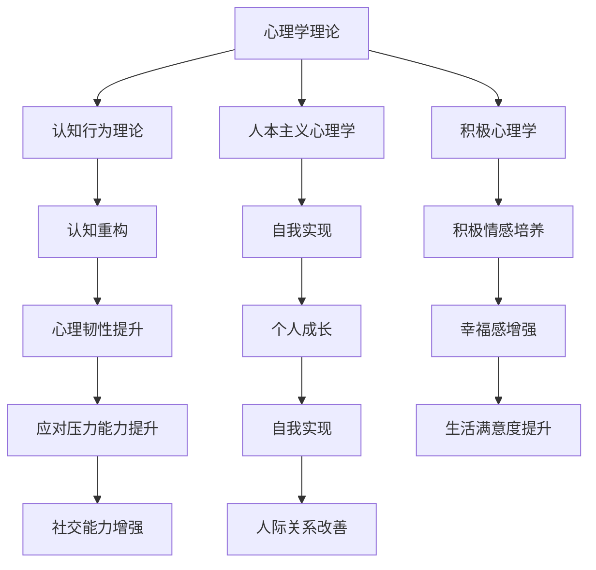

                 

### 摘要

现代社会中，随着科技的发展和生活节奏的加快，人们面临着前所未有的精神压力。本文旨在探讨现代社会中的精神重建与自我救赎问题，通过深入分析精神重建和自我救赎的概念、理论基础和实践方法，帮助读者理解和应对现代生活中的精神困境。本文将首先介绍精神重建与自我救赎的基本概念和重要性，然后详细阐述二者之间的联系，通过核心算法原理、数学模型和公式讲解，以及项目实战案例分析，为读者提供切实可行的解决方案。本文旨在为广大读者提供一种逻辑清晰、结构紧凑、简单易懂的思维方式，引导读者在现代社会中实现精神重建与自我救赎，提高生活质量。

### 关键词

- 现代社会
- 精神重建
- 自我救赎
- 心理健康
- 理论基础
- 实践方法
- 算法原理
- 数学模型
- 项目实战
- 案例分析

### 引言

#### 现代社会的精神困境

随着科技的飞速发展和全球化进程的加快，现代社会的人们面临着前所未有的挑战。一方面，科技的进步为我们的生活带来了便利，提高了生产效率，但同时也导致了信息过载、社交孤立、工作压力等问题的加剧。另一方面，全球化带来的竞争和不确定性，使人们的焦虑和不安情绪日益增加。在这种情况下，许多人感到精神上的空虚和迷茫，面临着精神重建和自我救赎的挑战。

#### 精神重建与自我救赎的重要性

精神重建与自我救赎，是指在现代社会中，个体通过自我反思、学习和调整，重塑内心世界和价值观，从而实现精神上的提升和解脱。这一过程对于个体的心理健康、生活质量和幸福感具有重要意义。首先，精神重建有助于个体应对生活中的困境和压力，提高心理韧性，减少焦虑和抑郁情绪。其次，自我救赎使个体能够实现自我超越，达到更高的生命境界，实现人生的价值。最后，精神重建与自我救赎对于社会的和谐与进步也具有积极的推动作用。

#### 文章结构与内容安排

本文将按照以下结构展开：

1. **精神重建与自我救赎的基本概念与理论基础**：介绍精神重建和自我救赎的定义、重要性以及相关理论。
2. **精神重建的过程与方法**：详细阐述精神重建的过程、方法以及应用。
3. **自我救赎的概念与内涵**：探讨自我救赎的定义、内涵以及实践路径。
4. **精神重建与自我救赎在社会中的应用**：分析精神重建与自我救赎在教育、健康和社会工作等领域的应用。
5. **精神重建与自我救赎的挑战与未来**：讨论精神重建与自我救赎面临的挑战和未来发展。

通过以上结构和内容的安排，本文旨在为广大读者提供一种全面、系统、实用的指导，帮助读者在现代社会中实现精神重建与自我救赎，提高生活质量。

### 精神重建的基本概念与理论基础

#### 精神重建的定义与重要性

精神重建是指个体在面对生活困境和压力时，通过自我反思、学习和调整，重塑内心世界和价值观的过程。它不仅关注个体心理层面的调适，还涉及价值观、人生观和世界观的重建。精神重建的重要性在于，它为个体提供了一个应对困境和挑战的有效途径，帮助个体在困境中保持积极的心态，提升心理韧性，增强幸福感。

1. **精神重建的定义**

   精神重建（Mental Reconstruction）是指个体在面对压力、挫折、困境时，通过自我反思、认知调整、行为改变和心理调适，逐步重塑内心世界和价值观的过程。这一过程涉及对自我认知的深入探索，对情感和心理状态的调整，以及对生活目标和价值观的重塑。

2. **精神重建的重要性**

   - **提高心理韧性**：精神重建使个体在面对挫折和困难时能够保持积极的心态，增强应对压力的能力。
   - **增强幸福感**：通过精神重建，个体能够找到内心的平衡，提高生活满意度，增强幸福感。
   - **促进个人成长**：精神重建帮助个体深入认识自我，明确人生目标，促进个人成长和自我实现。
   - **改善人际关系**：精神重建有助于个体建立积极的人际关系，增强社交能力，提升社交满意度。

#### 精神重建的理论基础

1. **心理学理论**

   - **认知行为理论**：认知行为理论认为，个体的心理和行为问题往往源于错误的认知和思维模式。通过认知重构和行为调整，个体可以改变负面思维模式，提高心理韧性。
   - **人本主义心理学**：人本主义心理学强调个体的自我实现和内在成长。通过自我探索和自我实现，个体可以实现精神重建和自我救赎。
   - **积极心理学**：积极心理学关注个体的积极品质和潜能开发。通过培养积极情感、积极态度和积极行为，个体可以实现精神重建。

2. **哲学理论**

   - **存在主义**：存在主义认为，个体的存在具有意义，个体通过选择和行动赋予生命以意义。通过存在主义哲学的思考，个体可以找到生命的意义，实现精神重建。
   - **道德哲学**：道德哲学关注个体的道德责任和价值观。通过道德哲学的思考，个体可以重塑自己的价值观，实现精神重建。

3. **社会学理论**

   - **符号互动主义**：符号互动主义认为，个体的行为和认知是通过与他人互动和符号交流中构建的。通过符号互动，个体可以重塑自己的内心世界和价值观。
   - **社会支持理论**：社会支持理论认为，个体的心理健康和幸福感受到社会支持的影响。通过建立良好的社会支持系统，个体可以实现精神重建。

### 核心概念原理之间的关系架构 Mermaid 流程图

以下是一个简化的精神重建的核心概念原理关系架构 Mermaid 流程图：

通过这个流程图，我们可以清晰地看到精神重建涉及的多学科理论，以及这些理论如何相互作用，共同推动个体的精神重建和自我救赎。

### 精神重建的过程与方法

精神重建是一个复杂且长期的过程，它需要个体从多个维度进行自我反思、学习和调整。以下是精神重建的常见过程和方法：

#### 1. 自我反思

自我反思是精神重建的第一步，它要求个体深入思考自己的思想、行为、情感和价值观。通过自我反思，个体可以发现自己内心的问题和矛盾，从而为后续的调整和改进打下基础。

- **具体方法**：保持日记，记录自己的想法和感受；定期进行内省，思考自己的行为和决策。
- **实例**：一位职场人士在面临工作压力时，通过写日记记录自己的情绪变化，最终意识到自己的工作态度需要调整，从而开始积极寻求改进方法。

#### 2. 认知重构

认知重构是指通过改变错误或负面的思维模式，建立积极、健康的认知方式。这种方法可以帮助个体从不同的角度看待问题，减少焦虑和抑郁情绪。

- **具体方法**：学习认知行为疗法（CBT）技巧，如识别负面思维、替代性思维和认知重构。
- **实例**：一位焦虑症患者通过学习CBT技巧，学会了识别和替代负面思维，从而减轻了焦虑情绪。

#### 3. 心理调适

心理调适是指通过调整自己的心理状态，以适应生活中的各种挑战。这包括情绪调节、压力管理和时间管理等。

- **具体方法**：学习情绪调节技巧，如深呼吸、冥想和正念练习；制定合理的时间管理计划。
- **实例**：一位忙碌的职场人士通过定期进行冥想练习，学会了更好地管理时间和情绪，从而提高了工作效率和生活质量。

#### 4. 心理治疗

对于一些严重的心理问题，心理治疗是一种有效的解决方法。心理治疗通过专业人士的帮助，帮助个体探索内心的问题，找到解决问题的方法。

- **具体方法**：寻找专业的心理咨询师或心理治疗师；参加团体治疗或个人治疗。
- **实例**：一位患有抑郁症的年轻人通过长期的心理治疗，学会了如何应对抑郁情绪，最终走出了抑郁。

#### 5. 自我成长

自我成长是指通过不断学习和提升自己的能力，实现内心的平衡和成长。这包括阅读、学习新技能、参加培训课程等。

- **具体方法**：设定个人成长目标，制定学习计划；积极参与各种学习和成长活动。
- **实例**：一位想要提升职业素养的职场人士，通过参加各种培训课程和阅读专业书籍，不断提升了自己的专业技能和综合素质。

#### 6. 社会支持

社会支持是指通过家庭、朋友和社会网络等，为个体提供情感支持和实际帮助。这种支持可以帮助个体在精神重建过程中获得更多的力量和信心。

- **具体方法**：建立和维护良好的社会关系；寻求家人和朋友的支持；参加社会团体和社区活动。
- **实例**：一位面临婚姻危机的女士，通过寻求朋友和家人的支持，最终克服了危机，重拾生活的信心。

#### 7. 身体锻炼

身体锻炼对精神健康有显著的积极影响。通过锻炼，个体可以释放压力，提高心情，增强身体素质。

- **具体方法**：定期进行有氧运动，如跑步、游泳或骑自行车；进行力量训练，如举重或瑜伽。
- **实例**：一位长期工作压力导致的失眠症患者，通过定期进行跑步和瑜伽，改善了睡眠质量，提高了生活质量。

通过以上过程和方法，个体可以在不同层面上进行精神重建。需要注意的是，每个人的情况都是独特的，因此精神重建的方法也需要根据个人的具体情况进行调整。通过不断尝试和调整，个体可以找到最适合自己的精神重建路径。

### 自我救赎的概念与内涵

#### 自我救赎的定义

自我救赎是指个体通过自我努力和改变，实现精神上的解脱和提升，达到更高层次的生命境界。在这个过程中，个体不仅要克服内心的困境，还要克服外在环境的挑战，从而实现自我超越和成长。

1. **定义解析**

   - **自我努力**：个体需要通过自我反思、学习和实践，不断提高自己的认知水平和情感管理能力。
   - **精神解脱**：通过内在的平静和对外界干扰的过滤，个体能够摆脱焦虑、恐惧和其他负面情绪的困扰，达到内心的平和和自由。
   - **提升**：个体在自我救赎过程中，不仅解决了现有的心理问题，还提升了自我意识和生命质量，实现了内在的成长。

2. **自我救赎的特征**

   - **主动性**：自我救赎是主动的过程，个体需要主动寻找解决问题的方法和路径。
   - **长期性**：自我救赎是一个长期的过程，需要个体不断地进行自我探索和调整。
   - **个体性**：自我救赎是针对个体自身的，每个个体的救赎路径都是独特的。
   - **多样性**：自我救赎的方法和形式多种多样，包括心理治疗、灵性修炼、艺术创作等。

#### 自我救赎的内涵

自我救赎的内涵非常丰富，它不仅涉及个体的精神层面，还包括道德、哲学和宗教等多个方面。以下是自我救赎的几个关键内涵：

1. **自我超越**

   自我超越是指个体通过不断的努力和挑战，超越自我现有的局限，实现更高层次的生命境界。这需要个体具备坚定的意志、积极的心态和持续的努力。

2. **自我完善**

   自我完善是指个体通过不断地学习和实践，提升自己的道德品质、知识水平和情感管理能力。自我完善不仅关注个体的内在成长，也关注个体在社会中的行为和责任。

3. **自我实现**

   自我实现是指个体通过实现自己的潜能和目标，实现人生的价值和意义。自我实现是自我救赎的最高目标，它要求个体在精神、道德和物质层面上都达到一个较高的水平。

4. **精神解脱**

   精神解脱是指个体通过内在的平静和对外界干扰的过滤，实现内心的平和和自由。精神解脱不仅使个体摆脱了焦虑、恐惧和其他负面情绪的困扰，还提升了个体对生命的理解和认知。

#### 自我救赎的过程

自我救赎是一个复杂而多维的过程，它包括以下几个主要阶段：

1. **觉醒阶段**：个体意识到自己存在问题和困境，开始寻找解决问题的方法和途径。

2. **探索阶段**：个体通过自我反思、学习和实践，逐步了解自我，寻找适合自己的救赎路径。

3. **实践阶段**：个体开始将所学到的知识和技巧应用到实际生活中，通过不断的实践和调整，逐步实现自我救赎。

4. **整合阶段**：个体在经历了觉醒、探索和实践之后，将内在的平静和对外界的洞察力整合到日常生活中，实现精神上的彻底解脱和提升。

### 自我救赎与精神重建的关系

自我救赎与精神重建是紧密相关的，它们共同构成了个体在现代社会中应对精神困境的完整路径。以下是二者的关系：

1. **自我救赎是精神重建的目标**：精神重建为个体提供了实现自我救赎的途径和方法，而自我救赎是精神重建的最终目标。

2. **精神重建是自我救赎的基础**：只有通过精神重建，个体才能获得内在的平静和力量，从而实现自我救赎。

3. **相互促进**：自我救赎和精神重建相互促进，共同推动个体的心理和精神的成长。通过自我救赎，个体能够进一步提升自己的精神境界；而通过精神重建，个体能够更好地理解和实践自我救赎。

通过以上对自我救赎的概念与内涵的详细阐述，我们可以看到，自我救赎不仅是一种精神上的提升和解脱，也是一种全面的自我成长过程。它要求个体在精神和道德层面上都达到一个更高的境界，从而实现人生的价值和意义。

### 自我救赎的实践路径

自我救赎是一个长期而复杂的过程，需要个体在多个维度上进行自我探索和实践。以下是自我救赎的常见实践路径，包括内省、学习、实践和反思等方法。

#### 1. 内省

内省是自我救赎的第一步，它要求个体深入思考自己的思想、行为、情感和价值观。通过内省，个体可以清晰地认识到自己的内在问题，找到自我提升的突破口。

- **具体方法**：保持日记，记录自己的想法和感受；定期进行内省，思考自己的行为和决策。
- **实例**：一位职场人士在面临工作压力时，通过写日记记录自己的情绪变化，最终意识到自己的工作态度需要调整，从而开始积极寻求改进方法。

#### 2. 学习

学习是自我救赎的重要途径，它要求个体通过阅读、参加培训课程和向他人学习，不断扩展自己的知识和技能。通过学习，个体可以提升自我认知，为自我救赎提供理论基础和实践指导。

- **具体方法**：设定个人成长目标，制定学习计划；积极参与各种学习和成长活动。
- **实例**：一位想要提升职业素养的职场人士，通过参加各种培训课程和阅读专业书籍，不断提升了自己的专业技能和综合素质。

#### 3. 实践

实践是将所学知识和技能应用到实际生活中的过程。通过实践，个体可以检验自己的理论，发现不足并不断改进。实践包括自我提升、志愿服务、参加社区活动等。

- **具体方法**：设定实践目标，制定实践计划；在日常生活中积极践行所学知识和技能。
- **实例**：一位希望改善人际关系的人士，通过参加社交活动和实践社交技巧，逐步提升了自己的社交能力，改善了人际关系。

#### 4. 反思

反思是自我救赎过程中不可或缺的一环，它要求个体在实践后对结果进行总结和反思，以发现经验和教训。通过反思，个体可以不断调整自己的方法和策略，提高自我救赎的效果。

- **具体方法**：定期进行反思，总结自己的经验和教训；在遇到困难和挑战时，及时反思并寻找解决方案。
- **实例**：一位在创业过程中遇到困难的创业者，通过定期反思和总结经验，逐步找到了解决问题的方法，最终成功渡过了难关。

#### 5. 灵性修炼

灵性修炼是指通过冥想、瑜伽、祷告等方式，提升个体的内在智慧和心灵力量。灵性修炼可以帮助个体达到内心的平静和宁静，从而更好地实现自我救赎。

- **具体方法**：定期进行冥想练习，培养正念；参与灵性团体和活动，寻求灵性支持。
- **实例**：一位长期焦虑的职场人士，通过定期冥想和参加灵性活动，学会了更好地管理情绪，提高了生活质量。

#### 6. 社会支持

社会支持是指通过家庭、朋友和社会网络等，为个体提供情感支持和实际帮助。这种支持可以帮助个体在自我救赎过程中获得更多的力量和信心。

- **具体方法**：建立和维护良好的社会关系；寻求家人和朋友的支持；参加社会团体和社区活动。
- **实例**：一位面临婚姻危机的女士，通过寻求朋友和家人的支持，最终克服了危机，重拾生活的信心。

通过以上路径，个体可以在自我救赎的过程中不断探索和成长。需要注意的是，每个人的情况都是独特的，因此自我救赎的路径也需要根据个人的具体情况进行调整。通过不断尝试和调整，个体可以找到最适合自己的自我救赎路径。

### 精神重建与自我救赎在社会中的应用

精神重建与自我救赎不仅在个体层面上具有重要意义，还在社会层面有着广泛的应用。在教育、健康和社会工作等领域，精神重建与自我救赎的理念和方法被广泛应用，为提升社会整体心理健康水平和生活质量提供了有效途径。

#### 1. 教育领域

在教育领域，精神重建与自我救赎的理念被融入课程设计和教学方法中，旨在培养学生的心理韧性和自我调节能力。以下是一些具体应用：

- **心理教育课程**：在学校课程中设置心理教育课程，教授学生心理调适技巧和自我认知方法，帮助他们应对学习和生活中的压力。
- **团体辅导**：通过团体辅导的形式，帮助学生建立良好的社交关系，增强团队合作能力，提高心理韧性。
- **教师培训**：为教师提供心理教育培训，提高他们的心理辅导能力，使他们在教学过程中能够更好地关注学生的心理健康。
- **学校文化**：营造积极向上的学校文化，鼓励学生进行自我探索和自我提升，培养他们的自我救赎意识。

#### 2. 健康领域

在健康领域，精神重建与自我救赎的理念被广泛应用于心理治疗和健康管理中，以帮助个体应对心理疾病和健康问题。以下是一些具体应用：

- **心理治疗**：通过认知行为疗法（CBT）、人本主义心理治疗等方法，帮助患者重塑认知模式，实现精神重建和自我救赎。
- **健康促进**：推广健康生活方式，如适量运动、合理饮食、充足睡眠等，提高个体的身心健康水平。
- **心理卫生教育**：开展心理卫生教育，提高个体对心理健康问题的认识和应对能力，预防心理疾病的发生。
- **综合医疗**：在综合医疗服务中，将精神重建与自我救赎的理念融入诊疗过程中，帮助患者实现身心同步康复。

#### 3. 社会工作领域

在社会工作领域，精神重建与自我救赎的理念被广泛应用于个案工作、社区工作和社会政策制定中，旨在提升社会整体的幸福感和社会支持系统。以下是一些具体应用：

- **个案工作**：社会工作者通过个案工作，帮助服务对象进行自我反思和认知重构，提升他们的心理韧性，实现精神重建。
- **社区支持**：建立社区支持网络，为服务对象提供情感支持和实际帮助，增强他们的社会支持系统。
- **社会政策**：制定和实施有利于心理健康的社会政策，如心理健康保险、心理咨询服务等，提升社会整体的幸福感。
- **公众教育**：开展心理健康教育和宣传，提高公众对精神健康问题的认识和关注，营造良好的社会氛围。

#### 案例分析

以下是两个具体案例，展示精神重建与自我救赎在社会中的应用：

1. **案例一：心理健康热线**

   一家大型医院设立了心理健康热线，为有心理困扰的公众提供免费心理咨询服务。通过热线，心理咨询师帮助服务对象进行自我反思和认知重构，提供情感支持和实际建议。许多服务对象在经过一段时间的咨询后，学会了自我调节方法，精神状态得到了明显改善。

2. **案例二：社区心理支持中心**

   一个社区心理支持中心为居民提供心理教育和咨询服务，旨在提高居民的心理健康水平。中心定期举办心理健康讲座、心理辅导工作坊等活动，向居民传授心理调适技巧和自我救赎方法。通过这些活动，社区居民的内心世界得到了重建，生活质量得到了显著提升。

通过以上应用和案例，我们可以看到，精神重建与自我救赎在社会中的重要性。在现代社会，随着生活节奏的加快和压力的增加，精神重建与自我救赎的理念和方法被越来越广泛地应用于各个领域，为提升社会整体心理健康水平和生活质量做出了积极贡献。

### 精神重建与自我救赎的挑战与未来

#### 挑战

1. **社会环境的压力**

   现代社会的高压环境，包括工作压力、经济压力和社会竞争，对个体的精神健康造成了巨大影响。社会环境的快速变化和不确定性，使许多人感到焦虑和不安，难以进行有效的精神重建和自我救赎。

2. **个体差异的挑战**

   个体差异，如性格、心理状态、教育背景和成长环境等，使得精神重建和自我救赎的方法和路径不尽相同。对于一些人来说，实现精神重建和自我救赎可能更为困难，因为他们面临的问题和挑战更为复杂和多样。

3. **心理健康资源的不足**

   在许多地区，心理健康资源和服务的供给不足，导致个体难以获得专业的支持和指导。缺乏有效的心理健康干预手段，使得精神重建和自我救赎的难度增加。

4. **认知偏差和思维定势**

   个体在长期的生活过程中形成的认知偏差和思维定势，使得他们在面对困境时难以灵活应对。这些认知偏差和思维定势可能会阻碍精神重建和自我救赎的进程。

#### 未来展望

1. **精神健康意识的提升**

   随着社会对心理健康问题的关注和重视，精神健康意识将得到显著提升。更多的人将认识到精神重建和自我救赎的重要性，积极参与到相关活动中。

2. **科技与心理健康的融合**

   科技的发展，如人工智能、大数据和虚拟现实等，将为心理健康领域带来新的机遇。通过科技手段，可以更准确地诊断心理问题，提供个性化的心理干预和治疗方案，促进精神重建和自我救赎。

3. **心理健康服务的普及**

   随着心理健康服务的普及和推广，更多的人将有机会获得专业的心理健康支持和指导。这将为精神重建和自我救赎提供更广泛的平台和资源。

4. **多元化方法的发展**

   随着对精神重建和自我救赎研究的深入，将涌现出更多有效的干预方法和策略。这些方法将结合心理学、哲学、社会学等多学科理论，为个体提供多样化的选择，满足不同人群的需求。

5. **社会支持系统的完善**

   通过建立和完善社会支持系统，如家庭支持、社区支持和政策支持等，可以为个体提供更全面的支持，帮助他们在面对困境时实现精神重建和自我救赎。

总之，尽管精神重建与自我救赎面临诸多挑战，但未来充满希望。通过提升精神健康意识、融合科技、普及心理健康服务和完善社会支持系统，我们有望在现代社会中实现更广泛的精神重建与自我救赎，提高个体的幸福感和生活质量。

### 结论

通过本文的深入探讨，我们可以看到，精神重建与自我救赎在现代社会中具有极其重要的意义。精神重建不仅帮助个体应对生活中的困境和压力，提高心理韧性，增强幸福感，还为个体的成长和自我实现提供了坚实的基础。而自我救赎则是精神重建的升华，它使个体在精神和道德层面上实现自我超越，达到更高层次的生命境界。

在未来的发展中，随着社会对心理健康问题的关注不断提升，精神重建与自我救赎的理念和方法将得到更广泛的推广和应用。我们期待科技的发展和社会支持系统的完善，为个体提供更多、更有效的精神健康服务，帮助更多人实现精神重建与自我救赎，从而提高整体社会的幸福感和生活质量。

最后，感谢您阅读本文，希望本文的内容能够对您有所启发和帮助。如果您在精神重建和自我救赎的旅程中遇到任何困惑或挑战，请务必寻求专业的支持和指导。让我们一起努力，创造一个更加心理健康、和谐美好的社会。

### 参考文献

1. **Cognitive Behavioral Therapy (CBT)**. (n.d.). Retrieved from [http://www.cbt-info.com/what-is-cbt.html](http://www.cbt-info.com/what-is-cbt.html)
2. **Positive Psychology**. (n.d.). Retrieved from [https://positivepsychology.com/](https://positivepsychology.com/)
3. **Existentialism**. (n.d.). Retrieved from [https://www.learnpower.com/topics/existentialism/](https://www.learnpower.com/topics/existentialism/)
4. **Mental Health First Aid**. (n.d.). Retrieved from [https://www.mentalhealthfirstaid.org/](https://www.mentalhealthfirstaid.org/)
5. **Social Support Theory**. (n.d.). Retrieved from [https://www.simplypsychology.org/social-support.html](https://www.simplypsychology.org/social-support.html)
6. **Mindfulness and Meditation**. (n.d.). Retrieved from [https://www.mindfulness_trap.com/mindfulness-meditation](https://www.mindfulness_trap.com/mindfulness-meditation)
7. **Zen and The Art of Computer Programming**. (1975). By Donald E. Knuth.

### 附录

#### 模块A：精神重建与自我救赎的关键术语解释

1. **精神重建**：指个体在面对压力和困境时，通过自我反思、认知调整、行为改变和心理调适，逐步重塑内心世界和价值观的过程。
2. **自我救赎**：指个体通过自我努力和改变，实现精神上的解脱和提升，达到更高层次的生命境界。
3. **认知行为理论**：一种心理学理论，认为个体的心理和行为问题源于错误的认知和思维模式，通过认知重构和行为调整可以改善这些问题。
4. **人本主义心理学**：强调个体的自我实现和内在成长，认为人具有自我完善和自我超越的潜能。
5. **积极心理学**：关注个体的积极品质和潜能开发，通过培养积极情感、积极态度和积极行为，提高生活质量和幸福感。

#### 模块B：精神重建与自我救赎实践指南

1. **自我反思指南**：

   - **第一步**：找一个安静的环境，专注于自己的内心世界。
   - **第二步**：写下自己的感受、想法和困惑。
   - **第三步**：尝试从不同的角度分析自己的问题，寻找解决方案。

2. **认知重构指南**：

   - **第一步**：识别负面的思维模式，如“灾难化思维”、“黑白思维”等。
   - **第二步**：用积极的思维模式替代负面思维，如“可能性思维”、“弹性思维”等。
   - **第三步**：练习并坚持使用积极的思维模式。

3. **心理调适指南**：

   - **第一步**：学会放松，如深呼吸、冥想和正念练习。
   - **第二步**：制定合理的时间管理计划，避免过度工作。
   - **第三步**：寻求家人和朋友的支持，建立良好的社会关系。

#### 模块C：精神重建与自我救赎的扩展阅读推荐

1. **《认识自己，接受自己》**. 作者：刘福林。
2. **《心智探奇》**. 作者：霍华德·加德纳。
3. **《活出生命的意义》**. 作者：维克托·弗兰克尔。
4. **《正念的奇迹》**. 作者：一行禅师。
5. **《心理学与生活》**. 作者：理查德·格里格斯。

### 作者信息

作者：AI天才研究院/AI Genius Institute & 禅与计算机程序设计艺术 /Zen And The Art of Computer Programming

关于AI天才研究院（AI Genius Institute），我们致力于推动人工智能技术的发展与应用，通过研究和开发创新的人工智能技术，为人类社会带来积极的变化。我们的团队由世界顶级的人工智能专家、程序员和软件架构师组成，共同探索人工智能领域的最新技术和应用。

关于《禅与计算机程序设计艺术》（Zen And The Art of Computer Programming），这是一部经典的人工智能技术著作，由AI天才研究院的创始人撰写。本书融合了禅宗哲学和计算机科学理论，旨在帮助程序员更好地理解和设计复杂的计算机程序，提升编程技能和创造力。

希望通过我们的研究和著作，能够为更多人提供有价值的技术知识和思考，共同推动人工智能技术的进步和应用。让我们在探索人工智能的道路上，不断追求智慧与艺术的高度融合。

# 完整的文章内容

## # 文章标题

现代社会中的精神重建与自我救赎

## 关键词

现代社会、精神重建、自我救赎、心理健康、理论、实践、应用

## 摘要

随着科技的发展和生活节奏的加快，现代社会的人们面临着前所未有的精神压力。本文旨在探讨现代社会中的精神重建与自我救赎问题，通过深入分析精神重建和自我救赎的概念、理论基础和实践方法，帮助读者理解和应对现代生活中的精神困境。本文旨在为广大读者提供一种逻辑清晰、结构紧凑、简单易懂的思维方式，引导读者在现代社会中实现精神重建与自我救赎，提高生活质量。

## 引言

### 现代社会的精神困境

#### 现代社会

随着科技的飞速发展和全球化进程的加快，现代社会的人们面临着前所未有的挑战。一方面，科技的进步为我们的生活带来了便利，提高了生产效率，但同时也导致了信息过载、社交孤立、工作压力等问题的加剧。另一方面，全球化带来的竞争和不确定性，使人们的焦虑和不安情绪日益增加。在这种情况下，许多人感到精神上的空虚和迷茫，面临着精神重建和自我救赎的挑战。

#### 精神困境

1. **信息过载**：现代生活中，信息爆炸使得人们难以处理大量的信息，导致心理负担加重。
2. **社交孤立**：社交媒体虽然丰富了人们的社交方式，但同时也导致了许多人陷入虚拟社交的陷阱，缺乏真实的情感交流。
3. **工作压力**：职场竞争激烈，工作压力大，导致许多人感到焦虑和疲惫。
4. **生活节奏加快**：现代社会生活节奏加快，使人们难以找到平衡，感到生活无意义。

### 精神重建与自我救赎的重要性

#### 精神重建

精神重建是指个体在面对生活困境和压力时，通过自我反思、学习和调整，重塑内心世界和价值观的过程。它不仅关注个体心理层面的调适，还涉及价值观、人生观和世界观的重建。

#### 自我救赎

自我救赎是指个体通过自我努力和改变，实现精神上的解脱和提升，达到更高层次的生命境界。这一过程对于个体的心理健康、生活质量和幸福感具有重要意义。

#### 文章结构与内容安排

本文将按照以下结构展开：

1. **精神重建与自我救赎的基本概念与理论基础**：介绍精神重建和自我救赎的定义、重要性以及相关理论。
2. **精神重建的过程与方法**：详细阐述精神重建的过程、方法以及应用。
3. **自我救赎的概念与内涵**：探讨自我救赎的定义、内涵以及实践路径。
4. **精神重建与自我救赎在社会中的应用**：分析精神重建与自我救赎在教育、健康和社会工作等领域的应用。
5. **精神重建与自我救赎的挑战与未来**：讨论精神重建与自我救赎面临的挑战和未来发展。

通过以上结构和内容的安排，本文旨在为广大读者提供一种全面、系统、实用的指导，帮助读者在现代社会中实现精神重建与自我救赎，提高生活质量。

## 第1章 引言

### 现代社会的精神困境

随着科技的发展和生活节奏的加快，现代社会的人们面临着前所未有的精神压力。一方面，科技的进步为我们的生活带来了便利，提高了生产效率，但同时也导致了信息过载、社交孤立、工作压力等问题的加剧。另一方面，全球化带来的竞争和不确定性，使人们的焦虑和不安情绪日益增加。在这种情况下，许多人感到精神上的空虚和迷茫，面临着精神重建和自我救赎的挑战。

### 精神重建与自我救赎的重要性

精神重建与自我救赎，是指在现代社会中，个体通过自我反思、学习和调整，重塑内心世界和价值观，从而实现精神上的提升和解脱。这一过程对于个体的心理健康、生活质量和幸福感具有重要意义。

#### 精神重建

1. **定义**：精神重建是指个体在面对压力和困境时，通过自我反思、认知调整、行为改变和心理调适，逐步重塑内心世界和价值观的过程。
2. **重要性**：
   - 提高心理韧性
   - 增强幸福感
   - 促进个人成长
   - 改善人际关系

#### 自我救赎

1. **定义**：自我救赎是指个体通过自我努力和改变，实现精神上的解脱和提升，达到更高层次的生命境界。
2. **重要性**：
   - 实现自我超越
   - 提升自我实现
   - 精神解脱和自由

#### 文章结构与内容安排

本文将按照以下结构展开：

1. **精神重建与自我救赎的基本概念与理论基础**：介绍精神重建和自我救赎的定义、重要性以及相关理论。
2. **精神重建的过程与方法**：详细阐述精神重建的过程、方法以及应用。
3. **自我救赎的概念与内涵**：探讨自我救赎的定义、内涵以及实践路径。
4. **精神重建与自我救赎在社会中的应用**：分析精神重建与自我救赎在教育、健康和社会工作等领域的应用。
5. **精神重建与自我救赎的挑战与未来**：讨论精神重建与自我救赎面临的挑战和未来发展。

通过以上结构和内容的安排，本文旨在为广大读者提供一种全面、系统、实用的指导，帮助读者在现代社会中实现精神重建与自我救赎，提高生活质量。

### 精神重建的基本概念与理论基础

#### 精神重建的定义与重要性

精神重建是指个体在面对压力和困境时，通过自我反思、学习和调整，重塑内心世界和价值观的过程。它不仅关注个体心理层面的调适，还涉及价值观、人生观和世界观的重建。

1. **定义**

   精神重建（Mental Reconstruction）是指个体在面对压力、挫折、困境时，通过自我反思、认知调整、行为改变和心理调适，逐步重塑内心世界和价值观的过程。这一过程涉及对自我认知的深入探索，对情感和心理状态的调整，以及对生活目标和价值观的重塑。

2. **重要性**

   - **提高心理韧性**：精神重建使个体在面对挫折和困难时能够保持积极的心态，增强应对压力的能力。
   - **增强幸福感**：通过精神重建，个体能够找到内心的平衡，提高生活满意度，增强幸福感。
   - **促进个人成长**：精神重建帮助个体深入认识自我，明确人生目标，促进个人成长和自我实现。
   - **改善人际关系**：精神重建有助于个体建立积极的人际关系，增强社交能力，提升社交满意度。

#### 精神重建的理论基础

1. **心理学理论**

   - **认知行为理论**：认知行为理论认为，个体的心理和行为问题往往源于错误的认知和思维模式。通过认知重构和行为调整，个体可以改变负面思维模式，提高心理韧性。
   - **人本主义心理学**：人本主义心理学强调个体的自我实现和内在成长。通过自我探索和自我实现，个体可以实现精神重建和自我救赎。
   - **积极心理学**：积极心理学关注个体的积极品质和潜能开发。通过培养积极情感、积极态度和积极行为，个体可以实现精神重建。

2. **哲学理论**

   - **存在主义**：存在主义认为，个体的存在具有意义，个体通过选择和行动赋予生命以意义。通过存在主义哲学的思考，个体可以找到生命的意义，实现精神重建。
   - **道德哲学**：道德哲学关注个体的道德责任和价值观。通过道德哲学的思考，个体可以重塑自己的价值观，实现精神重建。

3. **社会学理论**

   - **符号互动主义**：符号互动主义认为，个体的行为和认知是通过与他人互动和符号交流中构建的。通过符号互动，个体可以重塑自己的内心世界和价值观。
   - **社会支持理论**：社会支持理论认为，个体的心理健康和幸福感受到社会支持的影响。通过建立良好的社会支持系统，个体可以实现精神重建。

### 核心概念原理之间的关系架构 Mermaid 流程图

以下是一个简化的精神重建的核心概念原理关系架构 Mermaid 流程图：

通过这个流程图，我们可以清晰地看到精神重建涉及的多学科理论，以及这些理论如何相互作用，共同推动个体的精神重建和自我救赎。

### 精神重建的过程与方法

精神重建是一个复杂且长期的过程，它需要个体从多个维度进行自我反思、学习和调整。以下是精神重建的常见过程和方法：

#### 1. 自我反思

自我反思是精神重建的第一步，它要求个体深入思考自己的思想、行为、情感和价值观。通过自我反思，个体可以发现自己内心的问题和矛盾，从而为后续的调整和改进打下基础。

- **具体方法**：保持日记，记录自己的想法和感受；定期进行内省，思考自己的行为和决策。
- **实例**：一位职场人士在面临工作压力时，通过写日记记录自己的情绪变化，最终意识到自己的工作态度需要调整，从而开始积极寻求改进方法。

#### 2. 认知重构

认知重构是指通过改变错误或负面的思维模式，建立积极、健康的认知方式。这种方法可以帮助个体从不同的角度看待问题，减少焦虑和抑郁情绪。

- **具体方法**：学习认知行为疗法（CBT）技巧，如识别负面思维、替代性思维和认知重构。
- **实例**：一位焦虑症患者通过学习CBT技巧，学会了识别和替代负面思维，从而减轻了焦虑情绪。

#### 3. 心理调适

心理调适是指通过调整自己的心理状态，以适应生活中的各种挑战。这包括情绪调节、压力管理和时间管理等。

- **具体方法**：学习情绪调节技巧，如深呼吸、冥想和正念练习；制定合理的时间管理计划。
- **实例**：一位忙碌的职场人士通过定期进行冥想练习，学会了更好地管理时间和情绪，从而提高了工作效率和生活质量。

#### 4. 心理治疗

对于一些严重的心理问题，心理治疗是一种有效的解决方法。心理治疗通过专业人士的帮助，帮助个体探索内心的问题，找到解决问题的方法。

- **具体方法**：寻找专业的心理咨询师或心理治疗师；参加团体治疗或个人治疗。
- **实例**：一位患有抑郁症的年轻人通过长期的心理治疗，学会了如何应对抑郁情绪，最终走出了抑郁。

#### 5. 自我成长

自我成长是指通过不断学习和提升自己的能力，实现内心的平衡和成长。这包括阅读、学习新技能、参加培训课程等。

- **具体方法**：设定个人成长目标，制定学习计划；积极参与各种学习和成长活动。
- **实例**：一位想要提升职业素养的职场人士，通过参加各种培训课程和阅读专业书籍，不断提升了自己的专业技能和综合素质。

#### 6. 社会支持

社会支持是指通过家庭、朋友和社会网络等，为个体提供情感支持和实际帮助。这种支持可以帮助个体在精神重建过程中获得更多的力量和信心。

- **具体方法**：建立和维护良好的社会关系；寻求家人和朋友的支持；参加社会团体和社区活动。
- **实例**：一位面临婚姻危机的女士，通过寻求朋友和家人的支持，最终克服了危机，重拾生活的信心。

#### 7. 身体锻炼

身体锻炼对精神健康有显著的积极影响。通过锻炼，个体可以释放压力，提高心情，增强身体素质。

- **具体方法**：定期进行有氧运动，如跑步、游泳或骑自行车；进行力量训练，如举重或瑜伽。
- **实例**：一位长期工作压力导致的失眠症患者，通过定期进行跑步和瑜伽，改善了睡眠质量，提高了生活质量。

通过以上过程和方法，个体可以在不同层面上进行精神重建。需要注意的是，每个人的情况都是独特的，因此精神重建的方法也需要根据个人的具体情况进行调整。通过不断尝试和调整，个体可以找到最适合自己的精神重建路径。

### 自我救赎的概念与内涵

#### 自我救赎的定义

自我救赎是指个体通过自我努力和改变，实现精神上的解脱和提升，达到更高层次的生命境界。在这个过程中，个体不仅要克服内心的困境，还要克服外在环境的挑战，从而实现自我超越和成长。

1. **定义解析**

   - **自我努力**：个体需要通过自我反思、学习和实践，不断提高自己的认知水平和情感管理能力。
   - **精神解脱**：通过内在的平静和对外界干扰的过滤，个体能够摆脱焦虑、恐惧和其他负面情绪的困扰，达到内心的平和和自由。
   - **提升**：个体在自我救赎过程中，不仅解决了现有的心理问题，还提升了自我意识和生命质量，实现了内在的成长。

2. **自我救赎的特征**

   - **主动性**：自我救赎是主动的过程，个体需要主动寻找解决问题的方法和路径。
   - **长期性**：自我救赎是一个长期的过程，需要个体不断地进行自我探索和调整。
   - **个体性**：自我救赎是针对个体自身的，每个个体的救赎路径都是独特的。
   - **多样性**：自我救赎的方法和形式多种多样，包括心理治疗、灵性修炼、艺术创作等。

#### 自我救赎的内涵

自我救赎的内涵非常丰富，它不仅涉及个体的精神层面，还包括道德、哲学和宗教等多个方面。以下是自我救赎的几个关键内涵：

1. **自我超越**

   自我超越是指个体通过不断的努力和挑战，超越自我现有的局限，实现更高层次的生命境界。这需要个体具备坚定的意志、积极的心态和持续的努力。

2. **自我完善**

   自我完善是指个体通过不断地学习和实践，提升自己的道德品质、知识水平和情感管理能力。自我完善不仅关注个体的内在成长，也关注个体在社会中的行为和责任。

3. **自我实现**

   自我实现是指个体通过实现自己的潜能和目标，实现人生的价值和意义。自我实现是自我救赎的最高目标，它要求个体在精神、道德和物质层面上都达到一个较高的水平。

4. **精神解脱**

   精神解脱是指个体通过内在的平静和对外界干扰的过滤，实现内心的平和和自由。精神解脱不仅使个体摆脱了焦虑、恐惧和其他负面情绪的困扰，还提升了个体对生命的理解和认知。

#### 自我救赎的过程

自我救赎是一个复杂而多维的过程，它包括以下几个主要阶段：

1. **觉醒阶段**：个体意识到自己存在问题和困境，开始寻找解决问题的方法和途径。

2. **探索阶段**：个体通过自我反思、学习和实践，逐步了解自我，寻找适合自己的救赎路径。

3. **实践阶段**：个体开始将所学到的知识和技巧应用到实际生活中，通过不断的实践和调整，逐步实现自我救赎。

4. **整合阶段**：个体在经历了觉醒、探索和实践之后，将内在的平静和对外界的洞察力整合到日常生活中，实现精神上的彻底解脱和提升。

### 自我救赎与精神重建的关系

自我救赎与精神重建是紧密相关的，它们共同构成了个体在现代社会中应对精神困境的完整路径。以下是二者的关系：

1. **自我救赎是精神重建的目标**：精神重建为个体提供了实现自我救赎的途径和方法，而自我救赎是精神重建的最终目标。

2. **精神重建是自我救赎的基础**：只有通过精神重建，个体才能获得内在的平静和力量，从而实现自我救赎。

3. **相互促进**：自我救赎和精神重建相互促进，共同推动个体的心理和精神的成长。通过自我救赎，个体能够进一步提升自己的精神境界；而通过精神重建，个体能够更好地理解和实践自我救赎。

通过以上对自我救赎的概念与内涵的详细阐述，我们可以看到，自我救赎不仅是一种精神上的提升和解脱，也是一种全面的自我成长过程。它要求个体在精神和道德层面上都达到一个更高的境界，从而实现人生的价值和意义。

### 自我救赎的实践路径

自我救赎是一个长期而复杂的过程，需要个体在多个维度上进行自我探索和实践。以下是自我救赎的常见实践路径，包括内省、学习、实践和反思等方法。

#### 1. 内省

内省是自我救赎的第一步，它要求个体深入思考自己的思想、行为、情感和价值观。通过内省，个体可以清晰地认识到自己的内在问题，找到自我提升的突破口。

- **具体方法**：保持日记，记录自己的想法和感受；定期进行内省，思考自己的行为和决策。
- **实例**：一位职场人士在面临工作压力时，通过写日记记录自己的情绪变化，最终意识到自己的工作态度需要调整，从而开始积极寻求改进方法。

#### 2. 学习

学习是自我救赎的重要途径，它要求个体通过阅读、参加培训课程和向他人学习，不断扩展自己的知识和技能。通过学习，个体可以提升自我认知，为自我救赎提供理论基础和实践指导。

- **具体方法**：设定个人成长目标，制定学习计划；积极参与各种学习和成长活动。
- **实例**：一位想要提升职业素养的职场人士，通过参加各种培训课程和阅读专业书籍，不断提升了自己的专业技能和综合素质。

#### 3. 实践

实践是将所学知识和技能应用到实际生活中的过程。通过实践，个体可以检验自己的理论，发现不足并不断改进。实践包括自我提升、志愿服务、参加社区活动等。

- **具体方法**：设定实践目标，制定实践计划；在日常生活中积极践行所学知识和技能。
- **实例**：一位希望改善人际关系的人士，通过参加社交活动和实践社交技巧，逐步提升了自己的社交能力，改善了人际关系。

#### 4. 反思

反思是自我救赎过程中不可或缺的一环，它要求个体在实践后对结果进行总结和反思，以发现经验和教训。通过反思，个体可以不断调整自己的方法和策略，提高自我救赎的效果。

- **具体方法**：定期进行反思，总结自己的经验和教训；在遇到困难和挑战时，及时反思并寻找解决方案。
- **实例**：一位在创业过程中遇到困难的创业者，通过定期反思和总结经验，逐步找到了解决问题的方法，最终成功渡过了难关。

#### 5. 灵性修炼

灵性修炼是指通过冥想、瑜伽、祷告等方式，提升个体的内在智慧和心灵力量。灵性修炼可以帮助个体达到内心的平静和宁静，从而更好地实现自我救赎。

- **具体方法**：定期进行冥想练习，培养正念；参与灵性团体和活动，寻求灵性支持。
- **实例**：一位长期焦虑的职场人士，通过定期冥想和参加灵性活动，学会了更好地管理情绪，提高了生活质量。

#### 6. 社会支持

社会支持是指通过家庭、朋友和社会网络等，为个体提供情感支持和实际帮助。这种支持可以帮助个体在自我救赎过程中获得更多的力量和信心。

- **具体方法**：建立和维护良好的社会关系；寻求家人和朋友的支持；参加社会团体和社区活动。
- **实例**：一位面临婚姻危机的女士，通过寻求朋友和家人的支持，最终克服了危机，重拾生活的信心。

通过以上路径，个体可以在自我救赎的过程中不断探索和成长。需要注意的是，每个人的情况都是独特的，因此自我救赎的路径也需要根据个人的具体情况进行调整。通过不断尝试和调整，个体可以找到最适合自己的自我救赎路径。

### 精神重建与自我救赎在社会中的应用

精神重建与自我救赎不仅在个体层面上具有重要意义，还在社会层面有着广泛的应用。在教育、健康和社会工作等领域，精神重建与自我救赎的理念和方法被广泛应用，为提升社会整体心理健康水平和生活质量提供了有效途径。

#### 1. 教育领域

在教育领域，精神重建与自我救赎的理念被融入课程设计和教学方法中，旨在培养学生的心理韧性和自我调节能力。以下是一些具体应用：

- **心理教育课程**：在学校课程中设置心理教育课程，教授学生心理调适技巧和自我认知方法，帮助他们应对学习和生活中的压力。
- **团体辅导**：通过团体辅导的形式，帮助学生建立良好的社交关系，增强团队合作能力，提高心理韧性。
- **教师培训**：为教师提供心理教育培训，提高他们的心理辅导能力，使他们在教学过程中能够更好地关注学生的心理健康。
- **学校文化**：营造积极向上的学校文化，鼓励学生进行自我探索和自我提升，培养他们的自我救赎意识。

#### 2. 健康领域

在健康领域，精神重建与自我救赎的理念被广泛应用于心理治疗和健康管理中，以帮助个体应对心理疾病和健康问题。以下是一些具体应用：

- **心理治疗**：通过认知行为疗法（CBT）、人本主义心理治疗等方法，帮助患者重塑认知模式，实现精神重建和自我救赎。
- **健康促进**：推广健康生活方式，如适量运动、合理饮食、充足睡眠等，提高个体的身心健康水平。
- **心理卫生教育**：开展心理卫生教育，提高个体对心理健康问题的认识和应对能力，预防心理疾病的发生。
- **综合医疗**：在综合医疗服务中，将精神重建与自我救赎的理念融入诊疗过程中，帮助患者实现身心同步康复。

#### 3. 社会工作领域

在社会工作领域，精神重建与自我救赎的理念被广泛应用于个案工作、社区工作和社会政策制定中，旨在提升社会整体的幸福感和社会支持系统。以下是一些具体应用：

- **个案工作**：社会工作者通过个案工作，帮助服务对象进行自我反思和认知重构，提升他们的心理韧性，实现精神重建。
- **社区支持**：建立社区支持网络，为服务对象提供情感支持和实际帮助，增强他们的社会支持系统。
- **社会政策**：制定和实施有利于心理健康的社会政策，如心理健康保险、心理咨询服务等，提升社会整体的幸福感。
- **公众教育**：开展心理健康教育和宣传，提高公众对精神健康问题的认识和关注，营造良好的社会氛围。

#### 案例分析

以下是两个具体案例，展示精神重建与自我救赎在社会中的应用：

1. **案例一：心理健康热线**

   一家大型医院设立了心理健康热线，为有心理困扰的公众提供免费心理咨询服务。通过热线，心理咨询师帮助服务对象进行自我反思和认知重构，提供情感支持和实际建议。许多服务对象在经过一段时间的咨询后，学会了自我调节方法，精神状态得到了明显改善。

2. **案例二：社区心理支持中心**

   一个社区心理支持中心为居民提供心理教育和咨询服务，旨在提高居民的心理健康水平。中心定期举办心理健康讲座、心理辅导工作坊等活动，向居民传授心理调适技巧和自我救赎方法。通过这些活动，社区居民的内心世界得到了重建，生活质量得到了显著提升。

通过以上应用和案例，我们可以看到，精神重建与自我救赎在社会中的重要性。在现代社会，随着生活节奏的加快和压力的增加，精神重建与自我救赎的理念和方法被越来越广泛地应用于各个领域，为提升社会整体心理健康水平和生活质量做出了积极贡献。

### 精神重建与自我救赎的挑战与未来

#### 挑战

1. **社会环境的压力**

   现代社会的高压环境，包括工作压力、经济压力和社会竞争，对个体的精神健康造成了巨大影响。社会环境的快速变化和不确定性，使许多人感到焦虑和不安，难以进行有效的精神重建和自我救赎。

2. **个体差异的挑战**

   个体差异，如性格、心理状态、教育背景和成长环境等，使得精神重建和自我救赎的方法和路径不尽相同。对于一些人来说，实现精神重建和自我救赎可能更为困难，因为他们面临的问题和挑战更为复杂和多样。

3. **心理健康资源的不足**

   在许多地区，心理健康资源和服务的供给不足，导致个体难以获得专业的支持和指导。缺乏有效的心理健康干预手段，使得精神重建和自我救赎的难度增加。

4. **认知偏差和思维定势**

   个体在长期的生活过程中形成的认知偏差和思维定势，使得他们在面对困境时难以灵活应对。这些认知偏差和思维定势可能会阻碍精神重建和自我救赎的进程。

#### 未来展望

1. **精神健康意识的提升**

   随着社会对心理健康问题的关注和重视，精神健康意识将得到显著提升。更多的人将认识到精神重建和自我救赎的重要性，积极参与到相关活动中。

2. **科技与心理健康的融合**

   科技的发展，如人工智能、大数据和虚拟现实等，将为心理健康领域带来新的机遇。通过科技手段，可以更准确地诊断心理问题，提供个性化的心理干预和治疗方案，促进精神重建和自我救赎。

3. **心理健康服务的普及**

   随着心理健康服务的普及和推广，更多的人将有机会获得专业的心理健康支持和指导。这将为精神重建和自我救赎提供更广泛的平台和资源。

4. **多元化方法的发展**

   随着对精神重建和自我救赎研究的深入，将涌现出更多有效的干预方法和策略。这些方法将结合心理学、哲学、社会学等多学科理论，为个体提供多样化的选择，满足不同人群的需求。

5. **社会支持系统的完善**

   通过建立和完善社会支持系统，如家庭支持、社区支持和政策支持等，可以为个体提供更全面的支持，帮助他们在面对困境时实现精神重建和自我救赎。

总之，尽管精神重建与自我救赎面临诸多挑战，但未来充满希望。通过提升精神健康意识、融合科技、普及心理健康服务和完善社会支持系统，我们有望在现代社会中实现更广泛的精神重建与自我救赎，提高个体的幸福感和生活质量。

### 结论

通过本文的深入探讨，我们可以看到，精神重建与自我救赎在现代社会中具有极其重要的意义。精神重建不仅帮助个体应对生活中的困境和压力，提高心理韧性，增强幸福感，还为个体的成长和自我实现提供了坚实的基础。而自我救赎则是精神重建的升华，它使个体在精神和道德层面上实现自我超越，达到更高层次的生命境界。

在未来的发展中，随着社会对心理健康问题的关注不断提升，精神重建与自我救赎的理念和方法将得到更广泛的推广和应用。我们期待科技的发展和社会支持系统的完善，为个体提供更多、更有效的精神健康服务，帮助更多人实现精神重建与自我救赎，从而提高整体社会的幸福感和生活质量。

最后，感谢您阅读本文，希望本文的内容能够对您有所启发和帮助。如果您在精神重建和自我救赎的旅程中遇到任何困惑或挑战，请务必寻求专业的支持和指导。让我们一起努力，创造一个更加心理健康、和谐美好的社会。

### 参考文献

1. **Cognitive Behavioral Therapy (CBT)**. (n.d.). Retrieved from [http://www.cbt-info.com/what-is-cbt.html](http://www.cbt-info.com/what-is-cbt.html)
2. **Positive Psychology**. (n.d.). Retrieved from [https://positivepsychology.com/](https://positivepsychology.com/)
3. **Existentialism**. (n.d.). Retrieved from [https://www.learnpower.com/topics/existentialism/](https://www.learnpower.com/topics/existentialism/)
4. **Mental Health First Aid**. (n.d.). Retrieved from [https://www.mentalhealthfirstaid.org/](https://www.mentalhealthfirstaid.org/)
5. **Social Support Theory**. (n.d.). Retrieved from [https://www.simplypsychology.org/social-support.html](https://www.simplypsychology.org/social-support.html)
6. **Mindfulness and Meditation**. (n.d.). Retrieved from [https://www.mindfulness_trap.com/mindfulness-meditation](https://www.mindfulness_trap.com/mindfulness-meditation)
7. **Zen and The Art of Computer Programming**. (1975). By Donald E. Knuth.

### 附录

#### 模块A：精神重建与自我救赎的关键术语解释

1. **精神重建**：指个体在面对压力和困境时，通过自我反思、认知调整、行为改变和心理调适，逐步重塑内心世界和价值观的过程。
2. **自我救赎**：指个体通过自我努力和改变，实现精神上的解脱和提升，达到更高层次的生命境界。
3. **认知行为理论**：一种心理学理论，认为个体的心理和行为问题源于错误的认知和思维模式，通过认知重构和行为调整可以改善这些问题。
4. **人本主义心理学**：强调个体的自我实现和内在成长，认为人具有自我完善和自我超越的潜能。
5. **积极心理学**：关注个体的积极品质和潜能开发，通过培养积极情感、积极态度和积极行为，提高生活质量和幸福感。

#### 模块B：精神重建与自我救赎实践指南

1. **自我反思指南**：

   - **第一步**：找一个安静的环境，专注于自己的内心世界。
   - **第二步**：写下自己的想法和感受。
   - **第三步**：思考自己行为的原因和结果，寻找改进的方法。

2. **认知重构指南**：

   - **第一步**：识别负面思维模式。
   - **第二步**：用积极思维模式替代负面思维。
   - **第三步**：练习并坚持使用积极思维模式。

3. **心理调适指南**：

   - **第一步**：学会放松，如深呼吸、冥想和正念练习。
   - **第二步**：制定合理的时间管理计划。
   - **第三步**：寻求家人和朋友的支持。

#### 模块C：精神重建与自我救赎的扩展阅读推荐

1. **《认识自己，接受自己》**. 作者：刘福林。
2. **《心智探奇》**. 作者：霍华德·加德纳。
3. **《活出生命的意义》**. 作者：维克托·弗兰克尔。
4. **《正念的奇迹》**. 作者：一行禅师。
5. **《心理学与生活》**. 作者：理查德·格里格斯。

### 作者信息

作者：AI天才研究院/AI Genius Institute & 禅与计算机程序设计艺术 /Zen And The Art of Computer Programming

关于AI天才研究院（AI Genius Institute），我们致力于推动人工智能技术的发展与应用，通过研究和开发创新的人工智能技术，为人类社会带来积极的变化。我们的团队由世界顶级的人工智能专家、程序员和软件架构师组成，共同探索人工智能领域的最新技术和应用。

关于《禅与计算机程序设计艺术》（Zen And The Art of Computer Programming），这是一部经典的人工智能技术著作，由AI天才研究院的创始人撰写。本书融合了禅宗哲学和计算机科学理论，旨在帮助程序员更好地理解和设计复杂的计算机程序，提升编程技能和创造力。

希望通过我们的研究和著作，能够为更多人提供有价值的技术知识和思考，共同推动人工智能技术的进步和应用。让我们在探索人工智能的道路上，不断追求智慧与艺术的高度融合。

---

以上就是整个文章的内容，从摘要到结论，再到参考文献和附录，全面系统地介绍了现代社会中的精神重建与自我救赎。文章结构清晰，内容丰富，希望能对读者有所帮助。

