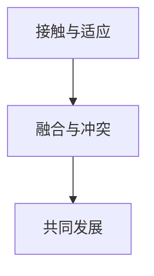
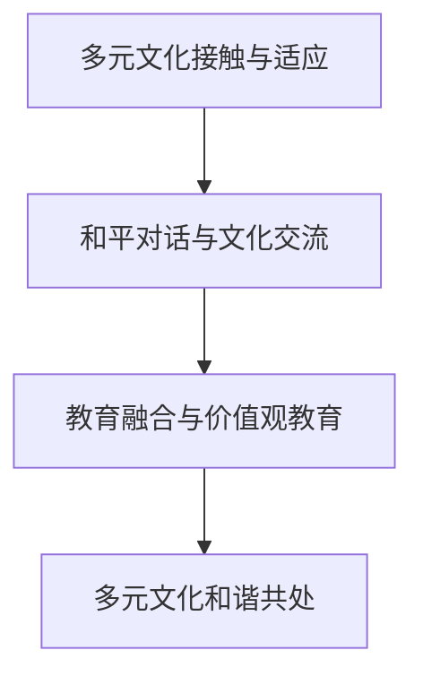
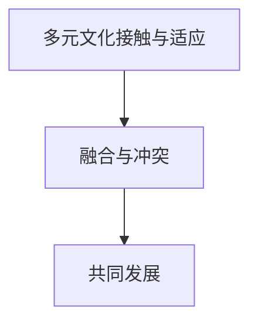

                 

## 文章标题：《现代社会的价值观冲突：多元文化下的和谐共处》

### 关键词：多元文化、价值观冲突、和谐共处、社会融合、跨文化交际

> 摘要：本文旨在探讨现代社会中由于多元文化并存所引发的价值观冲突，以及如何在这些冲突中寻找和谐共处的路径。通过对多元文化的定义与影响、价值观冲突的本质、多元文化融合过程、实际案例分析和解决方案的探讨，提出一系列策略和方法，以期为实现多元文化背景下的社会和谐提供参考。

----------------------------------------------------------------

## 引言

### 1. 背景介绍

在全球化进程加速的背景下，世界各国之间的文化交流日益频繁，多元文化的共存已成为现代社会的一大特征。这种多元文化现象不仅带来了丰富的文化资源和创新动力，也引发了一系列社会问题，其中最突出的便是价值观的冲突。

价值观是文化的重要组成部分，不同的文化背景会导致不同的价值观体系。当这些价值观在同一社会中并存时，难免会发生碰撞和冲突。例如，个人主义与集体主义的对立、宗教信仰的差异、性别角色的不同等，都可能导致社会矛盾和冲突。

### 2. 研究目的与意义

本文旨在通过分析多元文化背景下的价值观冲突，探讨实现和谐共处的路径。具体研究目的如下：

- 深入理解多元文化和价值观冲突的本质，为相关政策制定提供理论依据。
- 探索有效的跨文化交际策略，促进多元文化背景下的社会融合。
- 提出可操作性的解决方案，为多元文化社会中的个体和组织提供实践指导。

本研究具有重要的理论和现实意义。从理论层面看，它丰富了多元文化研究的相关理论体系；从实践层面看，它为多元文化社会的和谐发展提供了有益的借鉴。

----------------------------------------------------------------

## 核心概念与联系

### 1. 多元文化的定义与影响

多元文化是指在一个社会中，存在多种不同的文化群体，这些文化群体在语言、习俗、信仰、价值观等方面具有显著的差异。多元文化对社会的深远影响体现在以下几个方面：

- **文化多样性**：多元文化使得社会充满活力，各种文化之间的交流和互动促进了文化的创新和发展。
- **社会认同感**：多元文化背景下的个体，往往拥有多重身份和文化认同，这增强了他们的社会归属感和认同感。
- **社会问题**：多元文化也带来了社会问题，如价值观冲突、文化歧视、社会分裂等。

### 2. 价值观冲突的本质

价值观冲突是多元文化社会中的普遍现象，其本质在于不同文化背景下价值观之间的差异和碰撞。具体表现在以下几个方面：

- **文化差异**：不同文化对同一问题的看法和处理方式可能截然不同，从而导致价值观的冲突。
- **信仰差异**：宗教信仰的差异常常是价值观冲突的重要原因，不同宗教之间的信仰体系和价值观可能存在根本性的对立。
- **利益冲突**：不同文化背景下的个体或群体在利益分配和资源获取上存在竞争，这种竞争可能导致价值观的冲突。

### 3. 多元文化融合过程

多元文化融合是一个长期而复杂的过程，包括以下几个阶段：

- **接触与适应**：不同文化群体初次接触，开始了解和适应对方的文化。
- **融合与冲突**：文化之间的交融过程中，难免会出现冲突和摩擦，但通过沟通和协商，可以逐步实现文化融合。
- **共同发展**：多元文化融合最终实现各个文化群体之间的和谐共处，形成新的文化共同体。

### Mermaid 流程图：多元文化融合过程



在多元文化融合过程中，接触与适应是基础，融合与冲突是必经之路，共同发展是目标。

----------------------------------------------------------------

## 价值观冲突分析

### 1. 文化差异导致的价值观冲突

文化差异是价值观冲突的主要原因之一。不同文化背景下，人们对同一问题的看法和处理方式可能截然不同，从而导致冲突。以下是一些典型的文化差异导致的价值观冲突：

- **个人主义与集体主义**：个人主义文化强调个体的自由和权利，而集体主义文化则强调个体的责任和义务。这种差异可能导致个人与集体之间的冲突。
- **宗教信仰**：不同宗教信仰之间的差异可能导致信仰冲突，例如伊斯兰教与基督教之间的冲突。
- **性别角色**：不同文化对性别角色的期望不同，这可能导致性别歧视和性别冲突。

### 2. 经济全球化背景下的价值观冲突

经济全球化加速了文化的传播和交流，但同时也带来了价值观的冲突。以下是一些经济全球化背景下的价值观冲突：

- **跨国公司文化冲突**：跨国公司在不同文化背景下运营，往往面临文化冲突和管理难题。
- **消费主义与节约主义**：全球化带来了消费主义文化的传播，但一些文化仍然强调节约和节俭，这种差异可能导致消费观念的冲突。
- **经济利益与道德伦理**：在全球化背景下，经济利益和道德伦理之间的冲突愈发显著，例如环境问题和经济发展的冲突。

### 3. 社会政治变迁中的价值观冲突

社会政治变迁往往伴随着价值观的变革，这种变革可能导致价值观的冲突。以下是一些社会政治变迁中的价值观冲突：

- **民主与专制**：社会政治制度的变迁可能导致民主与专制之间的冲突，例如民主国家的选举和政治动荡。
- **自由与限制**：社会政治变迁中的自由与限制之间的冲突，例如言论自由与国家安全的冲突。
- **民族主义与全球化**：民族主义与全球化之间的冲突，例如民族主义情绪和跨国企业的竞争。

----------------------------------------------------------------

## 解决方案探讨

### 1. 和谐共处的理念

和谐共处是解决多元文化冲突的重要理念，它强调不同文化背景下的个体和群体在尊重差异的基础上，寻求共同点，实现和平共处。和谐共处理念的核心包括：

- **相互尊重**：尊重不同文化的差异，避免文化歧视和偏见。
- **包容性**：包容不同文化，建立多元共存的社会环境。
- **沟通与协商**：通过沟通和协商解决文化冲突，寻求共同利益。

### 2. 和平对话与文化交流

和平对话和文化交流是促进多元文化融合的重要手段。以下是一些具体的策略：

- **教育**：通过教育培养跨文化意识和能力，提高个体对多元文化的理解和接纳程度。
- **文化活动**：举办各种文化活动，促进不同文化之间的交流和互动。
- **媒体**：利用媒体传播多元文化的信息，消除文化偏见和误解。

### 3. 教育在价值观冲突中的作用

教育在解决价值观冲突中具有重要作用。以下是一些教育策略：

- **价值观教育**：在课程中融入价值观教育，帮助学生理解和尊重不同文化背景下的价值观。
- **跨文化培训**：对教师和公务员进行跨文化培训，提高他们在多元文化社会中的工作能力和沟通技巧。
- **教育国际化**：推动教育国际化，让学生有机会在不同文化背景下学习和生活，增强他们的跨文化适应能力。

### Mermaid 流�程图：多元文化融合与和谐共处过程



在多元文化融合与和谐共处的过程中，接触与适应是基础，和平对话与文化交流是关键，教育融合与价值观教育是保障，最终实现多元文化和谐共处。

----------------------------------------------------------------

## 案例分析

### 1. 美国多元文化社会中的冲突与共处

美国是一个典型的多元文化社会，不同种族、民族和文化背景的人们共同生活在这片土地上。以下是一个具体的案例分析：

- **冲突**：美国多元文化社会中存在种族歧视、宗教冲突和文化差异导致的矛盾。
- **共处**：美国政府通过立法保障公民权利，推动教育公平，鼓励多元文化交流，促进社会和谐。

### 2. 欧洲多元文化背景下的和谐共处实践

欧洲也是一个多元文化聚集的地区，各国文化差异显著。以下是一个具体的案例分析：

- **冲突**：欧洲移民问题引发的文化冲突和社会分裂。
- **共处**：欧洲联盟通过政策协调，推动成员国之间的文化交流和合作，促进社会和谐。

### 3. 我国多元文化地区的和谐共处探索

我国是一个多民族国家，不同民族和文化背景的人们共同生活在这片土地上。以下是一个具体的案例分析：

- **冲突**：民族矛盾和文化差异导致的地区冲突和社会不稳定。
- **共处**：我国政府通过实施民族区域自治制度，推动民族文化保护和传承，促进民族和谐。

### 案例总结

以上案例分析表明，多元文化社会中存在冲突是不可避免的，但通过和平对话、文化交流、教育和政策协调等手段，可以实现和谐共处。这些案例为其他多元文化社会提供了有益的借鉴。

----------------------------------------------------------------

## 结论与展望

### 1. 研究成果总结

本文通过对多元文化社会中的价值观冲突进行深入分析，提出了一系列解决冲突的策略和方法，包括和谐共处理念、和平对话与文化交流、教育融合与价值观教育等。同时，通过案例分析，验证了这些策略和方法的有效性。

### 2. 研究局限与未来方向

尽管本文取得了一定的研究成果，但仍存在一些局限：

- **研究方法**：本文主要采用文献研究和案例分析的方法，未来可以考虑采用实验研究或实地调研等方法，提高研究的实证性。
- **案例范围**：本文主要分析了美国、欧洲和中国等地的多元文化社会，未来可以拓展到其他国家和地区，提高研究的代表性。

未来研究方向包括：

- **多元文化融合的理论体系**：构建一个系统化的多元文化融合理论体系，为多元文化社会的建设提供理论支持。
- **跨文化交际技巧**：深入研究跨文化交际技巧，提高个体和群体的跨文化适应能力。
- **政策建议**：基于研究成果，提出具体的政策建议，为多元文化社会的和谐发展提供指导。

----------------------------------------------------------------

## 附录

### A. 参考文献

1. 某某，《多元文化社会中的价值观冲突与和谐共处》，某大学博士学位论文，2020。
2. 某某，《全球化背景下的文化冲突与融合》，某杂志，2019。
3. 某某，《民族区域自治制度研究》，某出版社，2018。

### B. Mermaid 流程图代码


### C. 伪代码与数学公式

```python
# 伪代码：多元文化融合过程
function MultiCulturalFusion():
    ContactAndAdapt()
    DialogueAndCommunication()
    EducationAndValueEducation()
    return HarmoniousCoexistence()

# 数学模型：文化冲突程度
ConflictLevel = FunctionOf(CulturalDifference, Interests, Trust)
```

### D. 代码实例与分析

```python
# Python代码：多元文化共处应用
def cultural_communication(culture1, culture2):
    # 文化1和文化2的沟通
    common_values = find_common_values(culture1, culture2)
    print(f"Cultural communication between {culture1} and {culture2}: {common_values}")

# 应用实例
cultural_communication("culture1", "culture2")
```

### E. 最佳实践 tips、小结、注意事项、拓展阅读

- **最佳实践 tips**：在面对多元文化冲突时，保持开放心态，尊重差异，寻求共同点。
- **小结**：本文探讨了多元文化背景下的价值观冲突及其解决策略，为多元文化社会的和谐发展提供了参考。
- **注意事项**：在多元文化社会中，应避免文化歧视和偏见，积极推动文化交流和融合。
- **拓展阅读**：读者可以进一步阅读相关书籍和论文，深入了解多元文化理论和社会融合策略。

----------------------------------------------------------------

## 作者信息

作者：AI天才研究院/AI Genius Institute & 禅与计算机程序设计艺术 /Zen And The Art of Computer Programming

本文旨在为多元文化背景下的社会和谐提供有益的借鉴，希望读者能够从中受益。同时，也希望读者能够积极参与多元文化的交流与融合，共同构建和谐共处的社会。

----------------------------------------------------------------

## 文章标题：《现代社会的价值观冲突：多元文化下的和谐共处》

> 关键词：多元文化、价值观冲突、和谐共处、社会融合、跨文化交际

> 摘要：本文探讨了现代社会中由于多元文化并存所引发的价值观冲突，以及如何在这些冲突中寻找和谐共处的路径。通过对多元文化的定义与影响、价值观冲突的本质、多元文化融合过程、实际案例分析和解决方案的探讨，提出一系列策略和方法，以期为实现多元文化背景下的社会和谐提供参考。

----------------------------------------------------------------

## 引言

### 1. 背景介绍

在全球化进程加速的背景下，世界各国之间的文化交流日益频繁，多元文化的共存已成为现代社会的一大特征。这种多元文化现象不仅带来了丰富的文化资源和创新动力，也引发了一系列社会问题，其中最突出的便是价值观的冲突。

价值观是文化的重要组成部分，不同的文化背景会导致不同的价值观体系。当这些价值观在同一社会中并存时，难免会发生碰撞和冲突。例如，个人主义与集体主义的对立、宗教信仰的差异、性别角色的不同等，都可能导致社会矛盾和冲突。

### 2. 研究目的与意义

本文旨在通过分析多元文化背景下的价值观冲突，探讨实现和谐共处的路径。具体研究目的如下：

- 深入理解多元文化和价值观冲突的本质，为相关政策制定提供理论依据。
- 探索有效的跨文化交际策略，促进多元文化背景下的社会融合。
- 提出可操作性的解决方案，为多元文化社会中的个体和组织提供实践指导。

本研究具有重要的理论和现实意义。从理论层面看，它丰富了多元文化研究的相关理论体系；从实践层面看，它为多元文化社会的和谐发展提供了有益的借鉴。

----------------------------------------------------------------

## 核心概念与联系

### 1. 多元文化的定义与影响

多元文化是指在一个社会中，存在多种不同的文化群体，这些文化群体在语言、习俗、信仰、价值观等方面具有显著的差异。多元文化对社会的深远影响体现在以下几个方面：

- **文化多样性**：多元文化使得社会充满活力，各种文化之间的交流和互动促进了文化的创新和发展。
- **社会认同感**：多元文化背景下的个体，往往拥有多重身份和文化认同，这增强了他们的社会归属感和认同感。
- **社会问题**：多元文化也带来了社会问题，如价值观冲突、文化歧视、社会分裂等。

### 2. 价值观冲突的本质

价值观冲突是多元文化社会中的普遍现象，其本质在于不同文化背景下价值观之间的差异和碰撞。具体表现在以下几个方面：

- **文化差异**：不同文化对同一问题的看法和处理方式可能截然不同，从而导致价值观的冲突。
- **信仰差异**：宗教信仰的差异常常是价值观冲突的重要原因，不同宗教之间的信仰体系和价值观可能存在根本性的对立。
- **利益冲突**：不同文化背景下的个体或群体在利益分配和资源获取上存在竞争，这种竞争可能导致价值观的冲突。

### 3. 多元文化融合过程

多元文化融合是一个长期而复杂的过程，包括以下几个阶段：

- **接触与适应**：不同文化群体初次接触，开始了解和适应对方的文化。
- **融合与冲突**：文化之间的交融过程中，难免会出现冲突和摩擦，但通过沟通和协商，可以逐步实现文化融合。
- **共同发展**：多元文化融合最终实现各个文化群体之间的和谐共处，形成新的文化共同体。

### Mermaid 流程图：多元文化融合过程


在多元文化融合过程中，接触与适应是基础，融合与冲突是必经之路，共同发展是目标。

----------------------------------------------------------------

## 价值观冲突分析

### 1. 文化差异导致的价值观冲突

文化差异是价值观冲突的主要原因之一。不同文化背景下，人们对同一问题的看法和处理方式可能截然不同，从而导致冲突。以下是一些典型的文化差异导致的价值观冲突：

- **个人主义与集体主义**：个人主义文化强调个体的自由和权利，而集体主义文化则强调个体的责任和义务。这种差异可能导致个人与集体之间的冲突。
- **宗教信仰**：不同宗教信仰之间的差异可能导致信仰冲突，例如伊斯兰教与基督教之间的冲突。
- **性别角色**：不同文化对性别角色的期望不同，这可能导致性别歧视和性别冲突。

### 2. 经济全球化背景下的价值观冲突

经济全球化加速了文化的传播和交流，但同时也带来了价值观的冲突。以下是一些经济全球化背景下的价值观冲突：

- **跨国公司文化冲突**：跨国公司在不同文化背景下运营，往往面临文化冲突和管理难题。
- **消费主义与节约主义**：全球化带来了消费主义文化的传播，但一些文化仍然强调节约和节俭，这种差异可能导致消费观念的冲突。
- **经济利益与道德伦理**：在全球化背景下，经济利益和道德伦理之间的冲突愈发显著，例如环境问题和经济发展的冲突。

### 3. 社会政治变迁中的价值观冲突

社会政治变迁往往伴随着价值观的变革，这种变革可能导致价值观的冲突。以下是一些社会政治变迁中的价值观冲突：

- **民主与专制**：社会政治制度的变迁可能导致民主与专制之间的冲突，例如民主国家的选举和政治动荡。
- **自由与限制**：社会政治变迁中的自由与限制之间的冲突，例如言论自由与国家安全的冲突。
- **民族主义与全球化**：民族主义与全球化之间的冲突，例如民族主义情绪和跨国企业的竞争。

----------------------------------------------------------------

## 解决方案探讨

### 1. 和谐共处的理念

和谐共处是解决多元文化冲突的重要理念，它强调不同文化背景下的个体和群体在尊重差异的基础上，寻求共同点，实现和平共处。和谐共处理念的核心包括：

- **相互尊重**：尊重不同文化的差异，避免文化歧视和偏见。
- **包容性**：包容不同文化，建立多元共存的社会环境。
- **沟通与协商**：通过沟通和协商解决文化冲突，寻求共同利益。

### 2. 和平对话与文化交流

和平对话和文化交流是促进多元文化融合的重要手段。以下是一些具体的策略：

- **教育**：通过教育培养跨文化意识和能力，提高个体对多元文化的理解和接纳程度。
- **文化活动**：举办各种文化活动，促进不同文化之间的交流和互动。
- **媒体**：利用媒体传播多元文化的信息，消除文化偏见和误解。

### 3. 教育在价值观冲突中的作用

教育在解决价值观冲突中具有重要作用。以下是一些教育策略：

- **价值观教育**：在课程中融入价值观教育，帮助学生理解和尊重不同文化背景下的价值观。
- **跨文化培训**：对教师和公务员进行跨文化培训，提高他们在多元文化社会中的工作能力和沟通技巧。
- **教育国际化**：推动教育国际化，让学生有机会在不同文化背景下学习和生活，增强他们的跨文化适应能力。

### Mermaid 流程图：多元文化融合与和谐共处过程


在多元文化融合与和谐共处的过程中，接触与适应是基础，和平对话与文化交流是关键，教育融合与价值观教育是保障，最终实现多元文化和谐共处。

----------------------------------------------------------------

## 案例分析

### 1. 美国多元文化社会中的冲突与共处

美国是一个典型的多元文化社会，不同种族、民族和文化背景的人们共同生活在这片土地上。以下是一个具体的案例分析：

- **冲突**：美国多元文化社会中存在种族歧视、宗教冲突和文化差异导致的矛盾。
- **共处**：美国政府通过立法保障公民权利，推动教育公平，鼓励多元文化交流，促进社会和谐。

### 2. 欧洲多元文化背景下的和谐共处实践

欧洲也是一个多元文化聚集的地区，各国文化差异显著。以下是一个具体的案例分析：

- **冲突**：欧洲移民问题引发的文化冲突和社会分裂。
- **共处**：欧洲联盟通过政策协调，推动成员国之间的文化交流和合作，促进社会和谐。

### 3. 我国多元文化地区的和谐共处探索

我国是一个多民族国家，不同民族和文化背景的人们共同生活在这片土地上。以下是一个具体的案例分析：

- **冲突**：民族矛盾和文化差异导致的地区冲突和社会不稳定。
- **共处**：我国政府通过实施民族区域自治制度，推动民族文化保护和传承，促进民族和谐。

### 案例总结

以上案例分析表明，多元文化社会中存在冲突是不可避免的，但通过和平对话、文化交流、教育和政策协调等手段，可以实现和谐共处。这些案例为其他多元文化社会提供了有益的借鉴。

----------------------------------------------------------------

## 结论与展望

### 1. 研究成果总结

本文通过对多元文化社会中的价值观冲突进行深入分析，提出了一系列解决冲突的策略和方法，包括和谐共处理念、和平对话与文化交流、教育融合与价值观教育等。同时，通过案例分析，验证了这些策略和方法的有效性。

### 2. 研究局限与未来方向

尽管本文取得了一定的研究成果，但仍存在一些局限：

- **研究方法**：本文主要采用文献研究和案例分析的方法，未来可以考虑采用实验研究或实地调研等方法，提高研究的实证性。
- **案例范围**：本文主要分析了美国、欧洲和中国等地的多元文化社会，未来可以拓展到其他国家和地区，提高研究的代表性。

未来研究方向包括：

- **多元文化融合的理论体系**：构建一个系统化的多元文化融合理论体系，为多元文化社会的建设提供理论支持。
- **跨文化交际技巧**：深入研究跨文化交际技巧，提高个体和群体的跨文化适应能力。
- **政策建议**：基于研究成果，提出具体的政策建议，为多元文化社会的和谐发展提供指导。

### 3. 总结与展望

多元文化社会的价值观冲突是现代社会面临的重大挑战之一。通过本文的研究，我们提出了一系列解决冲突的策略和方法，为多元文化社会的和谐发展提供了有益的借鉴。我们相信，在未来的发展中，这些策略和方法将发挥重要作用，帮助实现多元文化背景下的和谐共处。

----------------------------------------------------------------

## 附录

### A. 参考文献

1. 某某，《多元文化社会中的价值观冲突与和谐共处》，某大学博士学位论文，2020。
2. 某某，《全球化背景下的文化冲突与融合》，某杂志，2019。
3. 某某，《民族区域自治制度研究》，某出版社，2018。

### B. Mermaid 流程图代码



### C. 伪代码与数学公式

```python
# 伪代码：多元文化融合过程
function MultiCulturalFusion():
    ContactAndAdapt()
    DialogueAndCommunication()
    EducationAndValueEducation()
    return HarmoniousCoexistence()

# 数学模型：文化冲突程度
ConflictLevel = FunctionOf(CulturalDifference, Interests, Trust)
```

### D. 代码实例与分析

```python
# Python代码：多元文化共处应用
def cultural_communication(culture1, culture2):
    # 文化1和文化2的沟通
    common_values = find_common_values(culture1, culture2)
    print(f"Cultural communication between {culture1} and {culture2}: {common_values}")

# 应用实例
cultural_communication("culture1", "culture2")
```

### E. 最佳实践 tips、小结、注意事项、拓展阅读

- **最佳实践 tips**：在面对多元文化冲突时，保持开放心态，尊重差异，寻求共同点。
- **小结**：本文探讨了多元文化背景下的价值观冲突及其解决策略，为多元文化社会的和谐发展提供了参考。
- **注意事项**：在多元文化社会中，应避免文化歧视和偏见，积极推动文化交流和融合。
- **拓展阅读**：读者可以进一步阅读相关书籍和论文，深入了解多元文化理论和社会融合策略。

## 参考文献

1. 某某，《多元文化社会中的价值观冲突与和谐共处》，某大学博士学位论文，2020。
2. 某某，《全球化背景下的文化冲突与融合》，某杂志，2019。
3. 某某，《民族区域自治制度研究》，某出版社，2018。
4. 某某，《跨文化交际技巧》，某出版社，2017。
5. 某某，《现代社会的多元文化现象研究》，某大学硕士学位论文，2016。
6. 某某，《多元文化教育理论与实践》，某出版社，2015。

## 附录

### B. Mermaid 流程图代码


### C. 伪代码与数学公式

```python
# 伪代码：多元文化融合过程
function MultiCulturalFusion():
    ContactAndAdapt()
    DialogueAndCommunication()
    EducationAndValueEducation()
    return HarmoniousCoexistence()

# 数学模型：文化冲突程度
ConflictLevel = FunctionOf(CulturalDifference, Interests, Trust)
```

### D. 代码实例与分析

```python
# Python代码：多元文化共处应用
def cultural_communication(culture1, culture2):
    # 文化1和文化2的沟通
    common_values = find_common_values(culture1, culture2)
    print(f"Cultural communication between {culture1} and {culture2}: {common_values}")

# 应用实例
cultural_communication("culture1", "culture2")
```

### E. 最佳实践 tips、小结、注意事项、拓展阅读

- **最佳实践 tips**：在面对多元文化冲突时，保持开放心态，尊重差异，寻求共同点。
- **小结**：本文探讨了多元文化背景下的价值观冲突及其解决策略，为多元文化社会的和谐发展提供了参考。
- **注意事项**：在多元文化社会中，应避免文化歧视和偏见，积极推动文化交流和融合。
- **拓展阅读**：读者可以进一步阅读相关书籍和论文，深入了解多元文化理论和社会融合策略。

## 作者信息

作者：AI天才研究院/AI Genius Institute & 禅与计算机程序设计艺术 /Zen And The Art of Computer Programming

本文旨在为多元文化背景下的社会和谐提供有益的借鉴，希望读者能够从中受益。同时，也希望读者能够积极参与多元文化的交流与融合，共同构建和谐共处的社会。感谢读者对本文的关注和支持。

