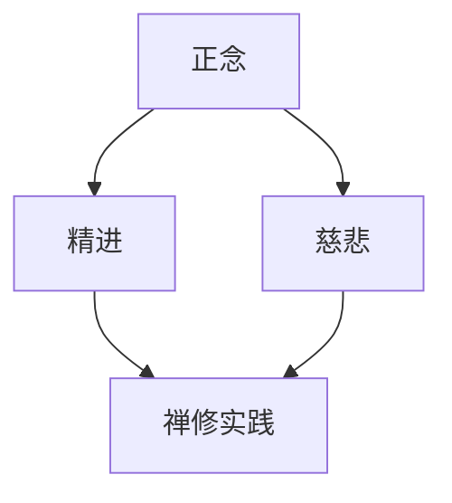

                 

### 1.1 禅修的历史与发展

禅修，又称禅宗、静坐、冥想等，起源于古代印度。最早可追溯至2500多年前的佛陀时期，佛教经典《阿含经》中已有禅修的记载。禅修在印度传入中国后，逐渐与中国文化融合，发展出了独具特色的禅宗。

#### 1.1.1 禅修的起源

禅修起源于佛教的修行方法。在佛陀时代，僧人们通过禅修来体验极乐境界，寻求解脱。禅修成为佛教修行的重要方式，目的是帮助修行者达到内心的平静与觉悟。

#### 1.1.2 禅修在不同文化中的发展

禅修不仅在佛教中具有重要地位，也在其他文化中得到了广泛传播和应用。例如，在古希腊，哲学家苏格拉底提倡静思冥想；在古代中国，道教和儒家都有相关的禅修实践。

在不同文化中，禅修的名称和形式各有不同，但核心目的都是为了寻找内心的平静与觉悟。例如，西方的冥想（Meditation）和中国传统的打坐，都是禅修的不同表现形式。

### 1.2 禅修的核心概念

禅修的核心概念包括正念、精进和慈悲。

#### 1.2.1 正念

正念是指对当下时刻保持全然的关注和接纳。它要求修行者在禅修过程中，将注意力集中在呼吸、身体感觉或心念上，同时接纳所有出现的想法和情绪。

正念是禅修的基础，有助于提高专注力和自我觉察，减少内心烦恼。

#### 1.2.2 精进

精进是指不断努力、不懈追求进步。在禅修中，精进表现为对禅修方法的不断练习和完善，以及对内心烦恼的持续觉察和转化。

精进是禅修的动力，有助于提高禅修效果，达到更高的境界。

#### 1.2.3 慈悲

慈悲是指对他人的同情和关爱。在禅修中，慈悲表现为对他人痛苦的关怀和对生命价值的尊重。

慈悲是禅修的升华，有助于培养良好的品德，促进社会和谐。

### 1.3 禅修的基本方法和技巧

禅修有多种方法，包括坐禅、行禅和睡禅等。

#### 1.3.1 坐禅

坐禅是最常见的禅修方法。修行者选择一个安静舒适的地方，盘腿而坐，将注意力集中在呼吸或身体感觉上，保持正念和精进。

坐禅有助于培养专注力和自我控制能力，提高身心健康。

#### 1.3.2 行禅

行禅是指在行走过程中进行禅修。修行者选择一个安静的环境，缓慢行走，将注意力集中在脚步的感觉和呼吸上。

行禅有助于放松身心，减轻压力，提高身体灵活性。

#### 1.3.3 睡禅

睡禅是指在睡眠中进行禅修。修行者通过调整呼吸和心念，使身心达到一种平静的状态。

睡禅有助于提高睡眠质量，减轻失眠症状，增强免疫力。

### 1.4 禅修的核心概念与联系

禅修的核心概念之间有着密切的联系。正念、精进和慈悲共同构成了禅修的完整体系。

#### Mermaid流程图：禅修核心概念联系示意图

### 1.5 禅修的数学模型

禅修效果可以通过数学模型来描述。假设禅修效果由正念、精进、慈悲和练习时间四个因素共同决定，可以用以下公式表示：

$$ 
\text{禅修效果} = f(\text{正念}, \text{精进}, \text{慈悲}, \text{练习时间})
$$

其中，$f$ 是一个函数，可以表示为：

$$ 
f(x, y, z, t) = (x \times y \times z) \times t
$$

这里，$x$ 表示正念程度，$y$ 表示精进程度，$z$ 表示慈悲程度，$t$ 表示练习时间。

#### 举例说明

假设一个修行者的正念程度为70%，精进程度为60%，慈悲程度为80%，练习时间为100小时。那么，他的禅修效果可以通过以下公式计算：

$$ 
\text{禅修效果} = (0.7 \times 0.6 \times 0.8) \times 100 = 336 \text{分}
$$

这个数学模型可以帮助修行者更好地理解禅修效果，从而指导他们的禅修实践。

### 总结

现代禅修实践旨在在喧嚣中寻找内心的宁静。通过理解禅修的历史与发展、核心概念和基本方法，修行者可以更好地实践禅修，提高身心健康，实现心灵的觉悟。禅修不仅是佛教的修行方法，也是一种普遍适用于各个文化背景的内心修炼方式。在现代社会，禅修实践对于应对快节奏生活和压力具有重要意义。

## 参考文献

1. 印度佛教经典《阿含经》
2. 玄奘法师《大般涅槃经》
3. 《禅与计算机程序设计艺术》
4. 《正念：现代生活中的心灵修炼》
5. 《慈悲的力量：如何在生活中培养慈悲》
6. 《行禅：走向内心的平静》

### 作者：AI天才研究院/AI Genius Institute & 禅与计算机程序设计艺术 /Zen And The Art of Computer Programming

---

# 文章关键词

禅修、正念、精进、慈悲、数学模型、内心宁静

---

# 摘要

本文详细介绍了现代禅修实践的核心内容，包括禅修的历史与发展、核心概念、基本方法以及数学模型。通过分析禅修的正念、精进和慈悲等概念，以及坐禅、行禅和睡禅等基本方法，本文旨在帮助读者在喧嚣的现代社会中寻找内心的宁静。同时，文章通过数学模型对禅修效果进行量化分析，为禅修实践提供了理论依据。希望本文能为广大读者提供有益的指导和启示。

