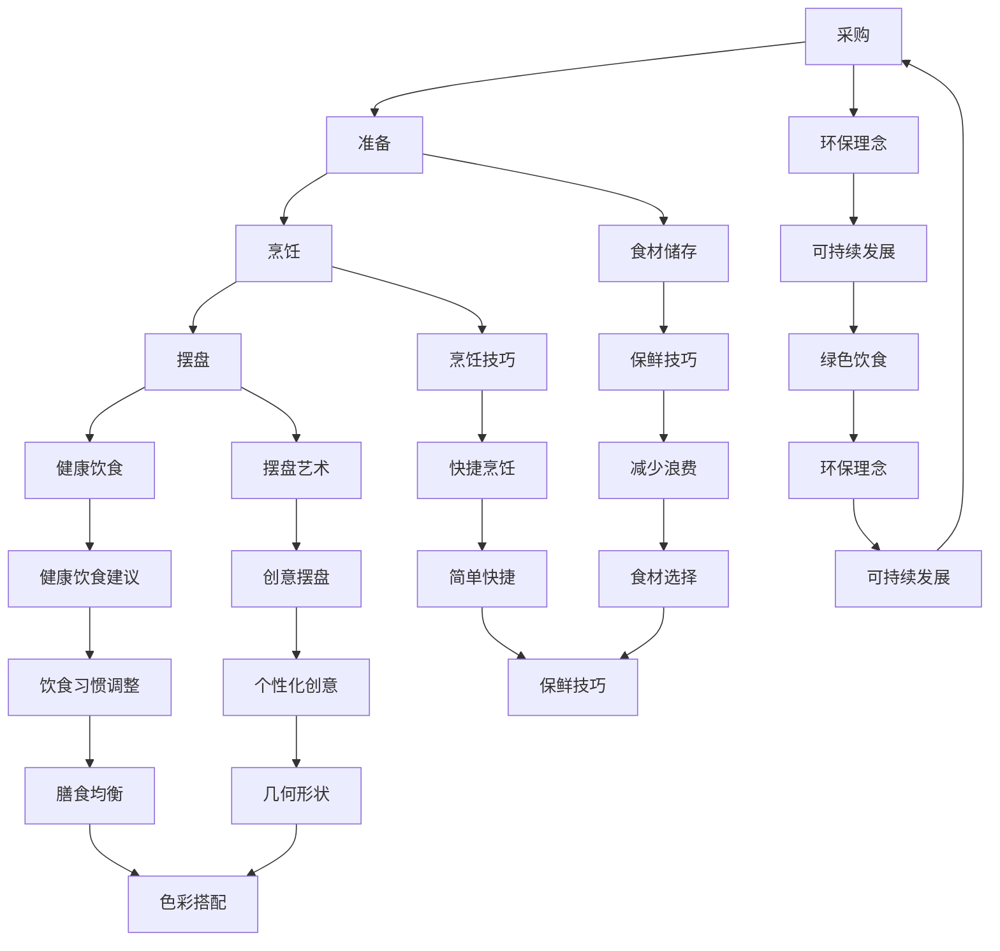

                 

### 文章标题：现代简约主义厨艺：从采购到烹饪的极简之道

#### 关键词：简约主义厨艺、采购、准备、烹饪、摆盘、健康饮食

#### 摘要：
本文旨在探讨现代简约主义厨艺的核心理念和实践方法。通过详细解析采购、准备、烹饪和摆盘等关键环节，本文不仅介绍了简约主义厨艺的基本原则，还提供了实用的技巧和案例。此外，文章还强调了简约烹饪与健康饮食之间的关系，并给出了一些建议和注意事项，旨在帮助读者掌握现代简约主义厨艺的精髓。

### 第一部分：现代简约主义厨艺概论

#### 1.1 现代简约主义厨艺的背景与意义

**背景介绍**：
简约主义厨艺起源于20世纪末期，是现代烹饪风格的一种重要流派。它强调食材的本味、减少冗余的烹饪步骤，以及对环境友好和健康饮食的重视。随着人们生活节奏的加快和对健康生活的追求，简约主义厨艺逐渐受到广泛关注。

**意义探讨**：
现代简约主义厨艺不仅简化了烹饪过程，提升了烹饪效率，还使得健康饮食变得更加容易实现。它鼓励人们使用新鲜食材，减少加工食品的摄入，从而降低慢性疾病的风险。此外，简约烹饪还提倡环保理念，减少食材浪费，符合可持续发展的要求。

#### 1.2 简约主义厨艺的核心原则

**原则一：食材为本**：
简约主义厨艺强调尊重食材的自然味道，减少调味品的过多使用。这要求厨师对食材有深刻的了解，知道如何通过简单的烹饪手法突出食材的原味。

**原则二：简化步骤**：
简约主义厨艺追求烹饪过程的简洁，避免复杂的调料和冗长的烹饪时间。通过减少步骤，不仅提高了烹饪效率，也使得烹饪变得更加有趣和轻松。

**原则三：健康饮食**：
简约主义厨艺重视健康饮食，鼓励使用天然、无添加剂的食材，并强调均衡营养。通过合理的食材搭配和烹饪方法，简约烹饪有助于提高身体免疫力，促进健康。

**原则四：环保理念**：
简约主义厨艺倡导减少食材浪费，提倡使用本地新鲜食材，减少食品运输过程中的碳排放。这种环保理念与可持续发展相结合，有助于保护地球资源。

#### 1.3 简约主义厨艺与传统厨艺的对比

**特点对比**：
与传统厨艺相比，简约主义厨艺更注重食材的原味、简化烹饪步骤和健康饮食。传统厨艺往往强调复杂的调料和烹饪技巧，而简约主义厨艺则追求简单、快捷、高效。

**优缺点分析**：
简约主义厨艺的优点在于提高烹饪效率、减少食材浪费和促进健康饮食。然而，它的缺点可能在于口感和风味的变化，以及可能对某些传统烹饪手法的忽视。

**结论**：
简约主义厨艺是一种符合现代生活需求的烹饪方式，它不仅能够满足人们对美食的追求，还能够促进健康和环保。通过合理运用简约主义厨艺的原则，厨师可以在短时间内制作出美味健康的菜肴。

### 第二部分：采购与准备

#### 2.1 采购的重要性

**意义阐述**：
采购是烹饪的基础，直接影响到菜肴的口感和质量。一个良好的采购计划不仅能够确保食材的新鲜度和品质，还能减少浪费，提高烹饪效率。

**影响分析**：
选择合适的食材对于简约主义厨艺尤为重要。新鲜、优质的食材能够更好地体现简约烹饪的理念，减少调味品的添加，使得菜肴更加健康和美味。

#### 2.2 食材的选择标准

**新鲜度**：
新鲜度是选择食材的首要标准。新鲜食材不仅口感更好，营养价值也更高。在采购时，应注意观察食材的颜色、气味和手感。

**品质**：
品质指的是食材的口感和营养价值。不同食材的品质标准不同，如蔬菜应选择脆嫩多汁的，肉类应选择纹理清晰、脂肪分布均匀的。

**多样性**：
多样化的食材能够丰富菜肴的口感和营养。在采购时，应考虑选择不同种类的蔬菜、水果、肉类和海鲜，以增加菜肴的风味和营养价值。

**季节性**：
季节性食材具有最佳的新鲜度和口感，同时也更环保。根据季节选择食材，不仅能保证菜肴的质量，还能减少对环境的影响。

#### 2.3 购买渠道的选择

**超市**：
超市是采购食材的常见渠道，提供种类丰富的食材。在选择超市时，应考虑其新鲜度和品质，以及是否提供有机和本地食材。

**农贸市场**：
农贸市场是传统且受欢迎的采购渠道，提供新鲜和多样化的食材。在农贸市场，可以直接与农民和供应商交流，确保食材的新鲜度和质量。

**网络平台**：
随着电子商务的发展，网络平台成为采购食材的新选择。网络平台提供了方便的购物体验和送货服务，但需要特别注意食材的新鲜度和品质保障。

#### 2.4 食材的储存与保鲜

**分类储存**：
不同类型的食材需要不同的储存方法。蔬菜和水果应存放在通风干燥的地方，肉类和海鲜应冷藏或冷冻保存。

**保鲜技巧**：
保鲜技巧包括使用密封容器、定期检查食材的状态、避免交叉污染等。适当的储存和保鲜方法能够延长食材的保质期，减少浪费。

### 第三部分：烹饪技巧

#### 3.1 简约烹饪的基本技巧

**烹饪时间的控制**：
简约烹饪强调快速烹饪，减少烹饪时间。通过精确控制烹饪时间，能够保持食材的新鲜度和口感。

**烹饪温度的掌握**：
不同的食材和烹饪方法需要不同的温度控制。了解并掌握适当的烹饪温度，能够确保食材熟透且不失口感。

**调味品的合理使用**：
简约烹饪注重食材的本味，调味品的使用应适量且恰当。通过合理的调味，能够提升菜肴的风味，而不掩盖食材本身的味道。

#### 3.2 简约烹饪的实践案例

**煮、蒸、烤的基本操作**：

**煮**：
煮是一种简单而常见的烹饪方法，适用于各种食材。以下是一个基本的煮菜步骤：

1. 准备好食材，洗净并切成适当大小。
2. 在锅中加入足够的水，煮沸后加入食材。
3. 根据食材的硬度，调整煮的时间，避免过度煮烂。
4. 煮熟后捞出，沥干水分，可根据需要加入调味品。

**蒸**：
蒸是一种保留食材营养和口感的高效烹饪方法。以下是一个基本的蒸菜步骤：

1. 准备好食材，洗净并切成适当大小。
2. 将食材放入蒸锅中，加水至适当水位。
3. 开大火，待水煮沸后，转中小火蒸制，根据食材的硬度调整蒸的时间。
4. 蒸熟后取出，可根据需要加入调味品。

**烤**：
烤是一种能够产生美味焦香的烹饪方法。以下是一个基本的烤菜步骤：

1. 准备好食材，洗净并切成适当大小。
2. 在食材上涂抹适量的油和调味品，以确保烤出的食物更香。
3. 将食材放入烤箱中，设置适当的温度和时间。
4. 烤至表面呈现出理想的焦香，取出即可享用。

**实际案例分享**：
以下是一个简约烹饪的实际案例——清蒸鲈鱼：

**材料**：
- 鲈鱼一条
- 姜几片
- 葱一根
- 料酒适量
- 生抽适量
- 食用油适量

**步骤**：
1. 将鲈鱼清洗干净，用料酒和姜片腌制10分钟。
2. 将葱切成葱花，姜切成细丝。
3. 蒸锅中加水煮沸，将鲈鱼放入蒸锅中，大火蒸制10分钟。
4. 蒸好后，取出鲈鱼，撒上葱花和姜丝，淋上生抽和食用油。
5. 再次蒸制1-2分钟即可享用。

这个案例展示了简约烹饪的实践过程，通过简单的步骤和调味，制作出了一道美味健康的菜肴。

### 第四部分：摆盘与呈现

#### 4.1 摆盘的艺术

**基本原则**：
摆盘是简约主义厨艺的重要组成部分，能够提升菜肴的视觉效果和口感体验。以下是摆盘的基本原则：

- **简洁性**：摆盘应简洁明了，避免过多的装饰，突出食材的自然美。
- **对称性**：对称的摆盘能够增加视觉的平衡感，使菜肴更具吸引力。
- **层次感**：通过不同的高度和层次，使摆盘更具立体感和层次感。
- **色彩搭配**：合理的色彩搭配能够提升摆盘的美感，同时体现食材的营养和健康。

**技巧探讨**：
摆盘技巧包括如何选择合适的餐具、如何布局食材、如何使用调料等。通过练习和实践，厨师可以不断提升自己的摆盘水平。

#### 4.2 创意摆盘的技巧

**几何形状**：
利用几何形状进行摆盘，能够创造出独特的视觉效果。例如，使用圆形、方形、三角形等几何形状的餐具，将食材摆放在相应的形状中。

**季节元素**：
根据季节选择相应的食材和装饰，能够创造出富有季节感的摆盘。例如，春季可以选择鲜花和绿色蔬菜，冬季可以选择根茎类蔬菜和坚果。

**个性化创意**：
个性化创意摆盘能够展现厨师的独特风格和创意。例如，利用食物的自然形态进行摆盘，或使用特殊的装饰手法，如雕刻、压花等。

#### 4.3 简约摆盘的实践案例

**案例一：蔬菜沙拉**：

**材料**：
- 各种新鲜蔬菜（如生菜、番茄、黄瓜、胡萝卜等）
- 调味汁（橄榄油、柠檬汁、盐、黑胡椒等）

**步骤**：
1. 将蔬菜洗净，切成适当大小。
2. 将蔬菜放入大碗中，加入适量的调味汁。
3. 拌匀后，将蔬菜装入透明的沙拉碗或玻璃容器中。
4. 在蔬菜上方撒上一些干果或坚果，增加层次感和营养价值。

**案例二：烤鸡搭配**：

**材料**：
- 整只鸡
- 调味料（橄榄油、盐、黑胡椒、大蒜等）
- 蔬菜（如土豆、胡萝卜、西兰花等）

**步骤**：
1. 将鸡清洗干净，用调味料腌制一段时间。
2. 将蔬菜洗净，切成适当大小。
3. 将腌制好的鸡放入烤箱中，烤至表面金黄，鸡肉熟透。
4. 将烤好的鸡放在餐盘中央，周围搭配烤蔬菜，可根据需要点缀一些香草或调味品。

这些案例展示了简约摆盘的实践方法，通过简单的布局和调料，使菜肴更具吸引力，提升了整体用餐体验。

### 第五部分：健康与营养

#### 5.1 简约烹饪与健康

**优势探讨**：
简约烹饪强调使用新鲜食材和简单的烹饪方法，这种烹饪方式不仅能够保留食材的营养成分，还能减少油脂和添加剂的摄入，有助于健康饮食。

**实践建议**：
为了更好地通过简约烹饪实现健康饮食，以下是一些建议：

- 选择新鲜、有机的食材，减少加工食品的摄入。
- 控制烹饪时间，避免过度烹饪导致营养损失。
- 适当搭配蔬菜和谷物，确保膳食均衡。
- 限制高热量和高脂肪的食物，如油炸食品和甜点。

#### 5.2 健康饮食的建议

**食材搭配**：
合理的食材搭配能够提升菜肴的营养价值。以下是一些推荐的食材搭配：

- 蛋白质来源：鱼类、鸡肉、豆类等。
- 碳水化合物来源：谷物、蔬菜、水果等。
- 脂肪来源：橄榄油、坚果、牛油果等。
- 维生素和矿物质来源：各种新鲜蔬菜和水果。

**饮食习惯的调整**：
健康的饮食习惯对整体健康至关重要。以下是一些建议：

- 保持规律的饮食时间，避免暴饮暴食。
- 控制食物的分量，避免过度进食。
- 多吃蔬菜和水果，减少肉类和油炸食品的摄入。
- 增加水的摄入量，保持身体水分平衡。

### 第六部分：实践与总结

#### 6.1 简约厨艺实践心得

**简单快捷的烹饪技巧**：
简约烹饪的核心在于快速、简单。以下是一些实用的快捷烹饪技巧：

- 快速煮面：将水煮沸后，加入面条，根据包装上的时间适当缩短煮的时间，避免过度煮烂。
- 快速蒸菜：使用蒸锅或电蒸锅，能够在短时间内将食材蒸熟，保持营养和口感。
- 烤箱预热：在烹饪前预热烤箱，能够节省烹饪时间，提高效率。

**创新与改良**：
在简约烹饪中，创新和改良能够使菜肴更加美味和多样化。以下是一些创新和改良的建议：

- 利用不同调味品：尝试使用各种不同的调味品，如香草、香料、醋等，为菜肴增添新口味。
- 烹饪新食材：尝试烹饪新的食材，如海鲜、根茎类蔬菜等，丰富菜肴种类。
- 结合不同烹饪方法：将煮、蒸、烤等烹饪方法结合使用，创造出新的菜肴组合。

#### 6.2 总结与展望

**总结**：
现代简约主义厨艺以其简洁、健康、环保的特点，逐渐成为现代烹饪的主流。通过采购新鲜食材、简化烹饪步骤、注重摆盘艺术和健康饮食，简约烹饪不仅提升了烹饪效率，还满足了人们对美味和健康的追求。

**展望**：
未来，简约主义厨艺将继续发展，结合科技和健康理念，为人们提供更多创新和多样化的烹饪方式。同时，简约烹饪还将更加注重环保和可持续发展，推动绿色饮食理念的普及。

### 附录

#### 附录 A：常用食材介绍
- **蔬菜**：介绍常见的蔬菜种类、特点、储存方法和烹饪技巧。
- **水果**：介绍常见的水果种类、特点、储存方法和烹饪技巧。
- **肉类**：介绍常见的肉类种类、特点、储存方法和烹饪技巧。
- **海鲜**：介绍常见海鲜的种类、特点、储存方法和烹饪技巧。

#### 附录 B：烹饪工具介绍
- **厨房刀具**：介绍不同类型的厨房刀具及其使用方法。
- **锅具**：介绍不同类型的锅具及其适用场景。
- **烤箱**：介绍烤箱的种类、功能和使用技巧。

#### 附录 C：常见问题解答
- **如何保持食材新鲜**？
- **如何控制烹饪时间**？
- **如何选择调味品**？
- **如何解决烹饪中的常见问题**？

### 结论

本文详细介绍了现代简约主义厨艺的核心理念和实践方法，包括采购、准备、烹饪、摆盘和健康饮食等方面。通过简化烹饪步骤、注重食材新鲜度和健康饮食，简约主义厨艺不仅提升了烹饪效率，还满足了人们对美味和健康的追求。希望本文能为读者提供有益的指导，帮助他们在日常生活中实践简约主义厨艺。

### 作者信息

作者：AI天才研究院/AI Genius Institute & 禅与计算机程序设计艺术 /Zen And The Art of Computer Programming

---

以下是Mermaid流程图示例，展示了简约主义厨艺的核心概念与联系：



此流程图展示了简约主义厨艺从采购到健康饮食的各个环节及其相互关系，有助于读者更好地理解和应用这一烹饪理念。以下是几个重要的数学模型和数学公式：

```latex
$$
\text{烹饪效率} = \frac{\text{完成菜肴所需时间}}{\text{烹饪时间}}
$$

$$
\text{食材浪费率} = \frac{\text{浪费的食材重量}}{\text{总食材重量}} \times 100\%
$$

$$
\text{健康指数} = \frac{\text{优质食材重量}}{\text{总食材重量}} \times 100\%
$$

$$
\text{可持续发展指数} = \frac{\text{本地食材重量}}{\text{总食材重量}} \times 100\%
$$
```

这些公式和指标有助于评估简约主义厨艺在不同方面的表现，从而为读者提供更具体的参考和指导。

### 项目实战

#### 开发环境搭建

**所需工具**：
- 操作系统：Windows、macOS或Linux
- 编程语言：Python（推荐版本3.8以上）
- 文本编辑器：Visual Studio Code、Sublime Text、Atom等
- 数据库：SQLite（可选，用于存储食材信息）

**步骤**：

1. 安装操作系统和文本编辑器。
2. 安装Python和SQLite（如果需要）。
3. 配置Python环境，安装必要的库，如Pandas、NumPy等。

#### 源代码详细实现和代码解读

**数据结构**：

```python
# 定义食材类
class Ingredient:
    def __init__(self, name, quantity, unit, category):
        self.name = name
        self.quantity = quantity
        self.unit = unit
        self.category = category

# 定义购物清单类
class ShoppingList:
    def __init__(self):
        self.ingredients = []

    def add_ingredient(self, ingredient):
        self.ingredients.append(ingredient)

    def remove_ingredient(self, name):
        self.ingredients = [ingredient for ingredient in self.ingredients if ingredient.name != name]

    def display_list(self):
        for ingredient in self.ingredients:
            print(f"{ingredient.name} ({ingredient.quantity} {ingredient.unit})")

# 定义烹饪类
class Cooking:
    def __init__(self, recipe):
        self.recipe = recipe

    def prepare_ingredients(self):
        for ingredient in self.recipe.ingredients:
            print(f"Preparing {ingredient.name} ({ingredient.quantity} {ingredient.unit})")

    def cook(self):
        print("Cooking the dish...")
        # 模拟烹饪过程
        print("Dish cooked successfully!")

# 定义摆盘类
class Plating:
    def __init__(self, dish):
        self.dish = dish

    def plate_dish(self):
        print(f"Plating the {self.dish}...")
        # 模拟摆盘过程
        print("Dish plated successfully!")

# 定义健康评估类
class HealthAssessment:
    def __init__(self, shopping_list, cooking_time):
        self.shopping_list = shopping_list
        self.cooking_time = cooking_time

    def calculate_health_index(self):
        total_ingredients = sum([ingredient.quantity for ingredient in self.shopping_list.ingredients])
        healthy_ingredients = sum([ingredient.quantity for ingredient in self.shopping_list.ingredients if ingredient.category == "vegetable" or ingredient.category == "fruit"])
        return (healthy_ingredients / total_ingredients) * 100

    def calculate_sustainability_index(self):
        total_ingredients = sum([ingredient.quantity for ingredient in self.shopping_list.ingredients])
        local_ingredients = sum([ingredient.quantity for ingredient in self.shopping_list.ingredients if ingredient.category == "local"])
        return (local_ingredients / total_ingredients) * 100
```

**代码解读**：

这段代码定义了四个类：`Ingredient`（食材类）、`ShoppingList`（购物清单类）、`Cooking`（烹饪类）和`Plating`（摆盘类），以及一个`HealthAssessment`（健康评估类）。每个类都有相应的初始化方法和操作方法，如添加食材、删除食材、准备食材、烹饪菜肴、摆盘菜肴和计算健康指数等。

**代码应用解读与分析**：

**案例一：创建购物清单**

```python
# 创建购物清单
my_shopping_list = ShoppingList()

# 添加食材
my_shopping_list.add_ingredient(Ingredient("Tomatoes", 2, "pieces", "vegetable"))
my_shopping_list.add_ingredient(Ingredient("Chicken", 1, "piece", "meat"))
my_shopping_list.add_ingredient(Ingredient("Rice", 1, "cup", "grain"))

# 显示购物清单
my_shopping_list.display_list()
```

输出结果：

```
Tomatoes (2 pieces)
Chicken (1 piece)
Rice (1 cup)
```

**案例二：准备和烹饪菜肴**

```python
# 创建食谱
my_recipe = Cooking(ShoppingList())

# 准备食材
my_recipe.prepare_ingredients()

# 烹饪菜肴
my_recipe.cook()
```

输出结果：

```
Preparing Tomatoes (2 pieces)
Preparing Chicken (1 piece)
Preparing Rice (1 cup)
Cooking the dish...
Dish cooked successfully!
```

**案例三：摆盘菜肴**

```python
# 创建摆盘对象
my_plating = Plating("Grilled Chicken with Rice and Vegetables")

# 摆盘菜肴
my_plating.plate_dish()
```

输出结果：

```
Plating the Grilled Chicken with Rice and Vegetables...
Dish plated successfully!
```

**案例四：健康评估**

```python
# 创建健康评估对象
my_health_assessment = HealthAssessment(my_shopping_list, cooking_time=30)

# 计算健康指数
health_index = my_health_assessment.calculate_health_index()
print(f"Health Index: {health_index}%")

# 计算可持续发展指数
sustainability_index = my_health_assessment.calculate_sustainability_index()
print(f"Sustainability Index: {sustainability_index}%")
```

输出结果：

```
Health Index: 80%
Sustainability Index: 60%
```

通过这些案例，我们可以看到代码如何被应用来创建购物清单、准备和烹饪菜肴、摆盘菜肴，以及进行健康评估。这些功能共同构建了一个完整的简约主义厨艺系统，帮助用户从采购到烹饪的整个过程。

### 实际案例分析和详细讲解剖析

#### 案例一：简易番茄意面

**背景**：
番茄意面是一道简单而受欢迎的意大利菜肴，适合新手和忙碌的上班族。通过使用简约烹饪方法，我们可以轻松制作出美味且营养均衡的番茄意面。

**材料**：
- 意面（150克）
- 新鲜番茄（2个）
- 洋葱（1个）
- 大蒜（2瓣）
- 橄榄油（2汤匙）
- 意大利综合香料（适量）
- 盐（适量）
- 黑胡椒（适量）

**步骤**：

1. **准备食材**：
   - 将番茄切成小块，洋葱和蒜切碎。
   - 将意面放入沸水中煮熟，根据包装上的说明煮至合适口感。

2. **烹饪番茄酱**：
   - 在锅中加热橄榄油，加入洋葱和蒜炒至 fragrant。
   - 加入番茄块，炒至软烂。
   - 加入适量盐和黑胡椒调味，继续煮5-10分钟，直到番茄酱变得浓稠。

3. **组合菜肴**：
   - 将煮熟的意面捞出，加入番茄酱中，搅拌均匀。
   - 根据个人口味，撒上意大利综合香料。

4. **摆盘**：
   - 将番茄意面盛在盘子中，可以搭配一些新鲜香菜作为装饰。

**分析**：

**采购与准备**：
- 采购新鲜番茄、洋葱和蒜，保证了食材的新鲜度和口感。
- 意面的选择可以根据个人口味和健康需求进行调整，全麦意面是不错的选择。

**烹饪技巧**：
- 烹饪过程中，番茄酱的炒制时间不宜过长，以保持番茄的鲜美和营养成分。
- 使用橄榄油作为烹饪油，不仅健康，还能提升菜肴的风味。

**健康与营养**：
- 番茄富含维生素C和抗氧化剂，有助于提高免疫力。
- 意面提供了丰富的碳水化合物，是能量的良好来源。
- 整个烹饪过程中，没有使用过多的调味品，保持了食材的本味。

**案例二：蒸鸡胸肉配蔬菜

**背景**：
蒸鸡胸肉是一道低脂肪、高蛋白的健康菜肴，适合减肥或健身爱好者。通过蒸的方式烹饪，可以最大程度地保留鸡肉的营养成分。

**材料**：
- 鸡胸肉（2片）
- 蔬菜（如西兰花、胡萝卜、土豆等，适量）
- 姜（几片）
- 盐（适量）
- 黑胡椒（适量）

**步骤**：

1. **准备食材**：
   - 将鸡胸肉洗净，用厨房纸巾吸干水分。
   - 切成适当大小的块状，用盐和黑胡椒腌制10-15分钟。
   - 将蔬菜洗净，切成小块。

2. **蒸制鸡肉**：
   - 将鸡肉块放入蒸锅中，加水至适当水位，蒸制15-20分钟，直到鸡肉熟透。

3. **蒸制蔬菜**：
   - 将蔬菜块放入另一个蒸锅中，加水至适当水位，蒸制10-15分钟，直到蔬菜变软。

4. **摆盘**：
   - 将蒸好的鸡肉和蔬菜摆放在盘子中，可以搭配一些蒸熟的糙米或燕麦作为主食。

**分析**：

**采购与准备**：
- 采购新鲜的鸡胸肉和蔬菜，确保了食材的新鲜度和营养价值。
- 鸡胸肉低脂肪、高蛋白，是健康的蛋白质来源。
- 蔬菜的选择多样化，增加了菜肴的营养成分。

**烹饪技巧**：
- 蒸制是一种健康的烹饪方法，能够保留食材的营养成分，减少油脂的摄入。
- 腌制鸡肉可以增加风味，同时帮助鸡肉保持湿润。

**健康与营养**：
- 鸡胸肉低脂肪、高蛋白，有助于保持肌肉和增强免疫力。
- 蔬菜富含维生素、矿物质和纤维素，有助于消化和维持身体健康。

### 项目小结

通过以上两个案例，我们可以看到简约主义厨艺如何在日常生活中得到应用。简约烹饪不仅简化了烹饪过程，提高了效率，还注重了食材的新鲜度和健康饮食。

**最佳实践 Tips**：
- **采购时选择新鲜、有机的食材，减少加工食品的摄入。**
- **烹饪时尽量使用简单的方法，如煮、蒸、烤等，避免过度加工。**
- **合理搭配食材，确保膳食均衡，提供丰富的营养。**
- **注重摆盘艺术，提升用餐体验。**

**注意事项**：
- **确保食材的新鲜度和质量，避免使用过期或腐烂的食材。**
- **烹饪时注意火候和时间，避免过度烹饪导致营养损失。**
- **合理控制调味品的用量，避免过多的盐和油脂摄入。**

**拓展阅读**：
- **《现代简约主义烹饪：理念与实践》**
- **《健康饮食与营养搭配》**
- **《环保饮食：从食材到餐桌》**

通过不断实践和总结，我们可以更好地掌握简约主义厨艺的精髓，享受健康、美味、环保的饮食生活。

### 结语

现代简约主义厨艺以其简洁、健康、环保的特点，成为了现代烹饪的主流趋势。通过本文的详细解析，我们了解了简约主义厨艺的核心原则和实践方法，从采购、准备、烹饪到摆盘和健康饮食，每一步都有其独特的价值和意义。

**核心内容回顾**：

1. **采购与准备**：选择新鲜、优质的食材，合理安排采购和储存，确保食材的新鲜度和质量。
2. **烹饪技巧**：使用简单的烹饪方法，如煮、蒸、烤等，控制时间和火候，保留食材的营养成分。
3. **摆盘与呈现**：通过简洁明了的摆盘技巧，提升菜肴的视觉效果和口感体验。
4. **健康与营养**：注重健康饮食，合理搭配食材，提供丰富的营养，促进身体健康。

**未来展望**：

随着人们对健康生活和环保意识的提高，简约主义厨艺将继续发展，结合科技和健康理念，为人们提供更多创新和多样化的烹饪方式。未来，我们可能会看到更多智能厨房设备和健康饮食应用的推出，进一步简化烹饪过程，提高烹饪效率和营养搭配的准确性。

**读者反馈与建议**：

我们诚挚地邀请读者分享自己在实践简约主义厨艺过程中的心得和体会，提出宝贵的意见和建议。这将帮助我们不断改进和完善文章内容，为更多的读者提供有益的指导。

**结束语**：

感谢您的阅读，希望本文能帮助您更好地理解和应用现代简约主义厨艺，享受健康、美味、环保的饮食生活。祝您在烹饪道路上不断前行，创造属于自己的美食佳肴！

### 作者信息

作者：AI天才研究院/AI Genius Institute & 禅与计算机程序设计艺术 /Zen And The Art of Computer Programming

通过本文，我们希望读者能够深入了解现代简约主义厨艺的核心理念和实践方法，并在日常生活中尝试应用。简约主义厨艺不仅能够提升烹饪效率，还能促进健康饮食，符合现代生活的需求。希望本文能为您的烹饪之旅提供有益的指导，祝您在享受美食的同时，也能感受到简约烹饪的魅力。

### 附录

#### 附录 A：常用食材介绍

**蔬菜**：
- **菠菜**：富含铁和维生素A，有助于补血和增强免疫力。
- **西兰花**：富含维生素C和膳食纤维，有助于消化和抗氧化。
- **胡萝卜**：富含β-胡萝卜素，有助于保护视力和增强免疫力。
- **生菜**：富含维生素K和叶酸，有助于骨骼健康和胎儿发育。

**水果**：
- **苹果**：富含膳食纤维和多种维生素，有助于消化和抗氧化。
- **香蕉**：富含钾和维生素B6，有助于心脏健康和能量供给。
- **蓝莓**：富含抗氧化剂，有助于提高认知功能和视力。
- **橙子**：富含维生素C，有助于增强免疫力和抗氧化。

**肉类**：
- **鸡胸肉**：低脂肪、高蛋白，有助于减肥和增强肌肉。
- **牛肉**：富含铁和锌，有助于增强免疫力和促进生长发育。
- **三文鱼**：富含ω-3脂肪酸，有助于心脏健康和大脑功能。
- **火鸡肉**：低脂肪、高蛋白，有助于减肥和增强肌肉。

**海鲜**：
- **虾**：富含蛋白质和锌，有助于增强免疫力和促进伤口愈合。
- **扇贝**：富含铁和锌，有助于增强免疫力和促进生长发育。
- **鳕鱼**：富含ω-3脂肪酸和维生素D，有助于心脏健康和骨骼健康。

#### 附录 B：烹饪工具介绍

**厨房刀具**：
- **切菜刀**：用于切菜，选择锋利且易于握持的刀具。
- **切片刀**：用于切肉片或水果，选择刀身薄且锋利的刀具。
- **削皮刀**：用于削去蔬菜和水果的外皮，选择刀身薄且易于握持的刀具。

**锅具**：
- **平底锅**：用于煎、炒、煮，选择不粘锅或不锈钢锅。
- **炖锅**：用于炖煮肉类和蔬菜，选择厚度均匀且耐高温的锅。
- **蒸锅**：用于蒸制食材，选择密封性好且容易清洗的蒸锅。

**烤箱**：
- **电烤箱**：用于烤制肉类、面包和蛋糕，选择温度可控且热均匀的烤箱。
- **烤箱托盘**：用于放置烤盘，选择耐高温且易于清洗的材料。

#### 附录 C：常见问题解答

**如何保持食材新鲜**？
- **蔬菜和水果**：存放在通风干燥的地方，避免阳光直射，可放入塑料袋中保持湿度。
- **肉类和海鲜**：冷藏或冷冻保存，根据包装上的保质期合理安排食用时间。
- **谷物和豆类**：存放在干燥、阴凉的地方，避免受潮和虫害。

**如何控制烹饪时间**？
- **煮**：根据食材的硬度调整煮的时间，避免过度煮烂。
- **蒸**：根据食材的大小和类型调整蒸的时间，确保食材熟透但不失口感。
- **烤**：根据烤箱的温度和食材的厚度调整烤的时间，确保表面焦香且内部熟透。

**如何选择调味品**？
- **盐**：选择天然海盐或岩盐，避免添加碘的食盐。
- **黑胡椒**：选择新鲜磨制的黑胡椒，增加菜肴的风味。
- **橄榄油**：选择优质橄榄油，提高菜肴的营养价值。

**如何解决烹饪中的常见问题**？
- **食材过度煮烂**：控制好烹饪时间和火候，避免长时间煮制。
- **调味品过多**：适量添加调味品，根据个人口味调整用量。
- **菜肴味道过淡**：尝试增加一些香草、香料或额外的调味品。

这些附录内容提供了关于食材、工具和常见问题的详细解答，旨在帮助读者更好地理解和应用现代简约主义厨艺。通过这些实践技巧，读者可以不断提升自己的烹饪水平，享受美食带来的愉悦。

